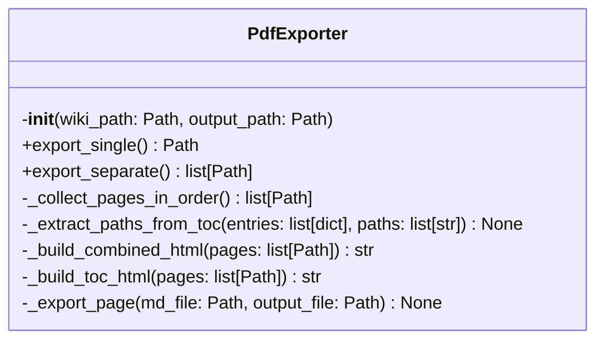

# PDF Export Module

This module provides functionality to export DeepWiki documentation to PDF format, supporting both single combined PDFs and separate PDF files for each wiki page.

## Classes

### PdfExporter

The PdfExporter class handles the conversion of wiki content to PDF format with support for multiple export modes.

#### Constructor

```python
def __init__(self, wiki_path: Path, output_path: Path)
```

Initializes the PDF exporter with the specified wiki and output paths.

**Parameters:**
- `wiki_path`: Path to the .deepwiki directory
- `output_path`: Output path for PDF file(s)

#### Methods

**export_separate()**

```python
def export_separate(self) -> list[Path]
```

Exports each wiki page as a separate PDF file.

**Returns:** List of paths to generated PDF files

## Functions

### export_to_pdf

```python
def export_to_pdf(
    wiki_path: Path | str,
    output_path: Path | str | None = None,
    single_file: bool = True,
) -> str
```

Main function to export wiki content to PDF format.

**Parameters:**
- `wiki_path`: Path to the .deepwiki directory
- `output_path`: Output path (defaults to wiki.pdf or wiki_pdfs/ based on single_file setting)
- `single_file`: If True, combines all pages into one PDF; if False, creates separate PDFs

**Returns:** Success message with output path

**Raises:** `ValueError` if the wiki path does not exist

### main

```python
def main() -> None
```

CLI entry point for PDF export functionality. Sets up argument parsing for command-line usage.

## Usage Examples

### Basic PDF Export

```python
from local_deepwiki.export.pdf import export_to_pdf

# Export to single PDF
result = export_to_pdf(".deepwiki", "output.pdf", single_file=True)
print(result)

# Export to separate PDFs
result = export_to_pdf(".deepwiki", "output_dir/", single_file=False)
print(result)
```

### Using PdfExporter Class

```python
from pathlib import Path
from local_deepwiki.export.pdf import PdfExporter

# Initialize exporter
exporter = PdfExporter(Path(".deepwiki"), Path("output.pdf"))

# Export as separate files
pdf_files = exporter.export_separate()
print(f"Generated {len(pdf_files)} PDF files")
```

### Command Line Usage

The module can be used as a CLI tool through the main function, which accepts arguments for wiki path, output location, and export mode options.

## Dependencies

The module imports standard library modules including:
- `argparse` for command-line interface
- `pathlib.Path` for file system operations
- `subprocess` for external command execution
- `tempfile` for temporary file handling
- `json` and `base64` for data processing

## Related Components

This module works with wiki content stored in markdown format and processes files from the .deepwiki directory structure. The export functionality includes support for rendering Mermaid diagrams and processing markdown content for PDF generation.

## API Reference

### class `PdfExporter`

Export wiki markdown to PDF format.

**Methods:**


<details>
<summary>View Source (lines 496-680) | <a href="https://github.com/UrbanDiver/local-deepwiki-mcp/blob/main/src/local_deepwiki/export/pdf.py#L496-L680">GitHub</a></summary>

```python
class PdfExporter:
    # Methods: __init__, export_single, export_separate, _collect_pages_in_order, _extract_paths_from_toc, _build_combined_html, _build_toc_html, _export_page
```

</details>

#### `__init__`

```python
def __init__(wiki_path: Path, output_path: Path)
```

Initialize the exporter.


| [Parameter](../generators/api_docs.md) | Type | Default | Description |
|-----------|------|---------|-------------|
| `wiki_path` | `Path` | - | Path to the .deepwiki directory. |
| `output_path` | `Path` | - | Output path for PDF file(s). |


<details>
<summary>View Source (lines 499-508) | <a href="https://github.com/UrbanDiver/local-deepwiki-mcp/blob/main/src/local_deepwiki/export/pdf.py#L499-L508">GitHub</a></summary>

```python
def __init__(self, wiki_path: Path, output_path: Path):
        """Initialize the exporter.

        Args:
            wiki_path: Path to the .deepwiki directory.
            output_path: Output path for PDF file(s).
        """
        self.wiki_path = Path(wiki_path)
        self.output_path = Path(output_path)
        self.toc_entries: list[dict] = []
```

</details>

#### `export_single`

```python
def export_single() -> Path
```

Export all wiki pages to a single PDF.


<details>
<summary>View Source (lines 510-544) | <a href="https://github.com/UrbanDiver/local-deepwiki-mcp/blob/main/src/local_deepwiki/export/pdf.py#L510-L544">GitHub</a></summary>

```python
def export_single(self) -> Path:
        """Export all wiki pages to a single PDF.

        Returns:
            Path to the generated PDF file.
        """
        logger.info(f"Starting PDF export from {self.wiki_path}")

        # Load TOC for ordering
        toc_path = self.wiki_path / "toc.json"
        if toc_path.exists():
            toc_data = json.loads(toc_path.read_text())
            self.toc_entries = toc_data.get("entries", [])
            logger.debug(f"Loaded {len(self.toc_entries)} TOC entries")

        # Collect all pages in TOC order
        pages = self._collect_pages_in_order()
        logger.info(f"Found {len(pages)} pages to export")

        # Build combined HTML
        combined_html = self._build_combined_html(pages)

        # Generate PDF
        output_file = self.output_path
        if output_file.is_dir():
            output_file = output_file / "documentation.pdf"

        output_file.parent.mkdir(parents=True, exist_ok=True)

        html_doc = HTML(string=combined_html)
        css = CSS(string=PRINT_CSS)
        html_doc.write_pdf(output_file, stylesheets=[css])

        logger.info(f"Generated PDF: {output_file}")
        return output_file
```

</details>

#### `export_separate`

```python
def export_separate() -> list[Path]
```

Export each wiki page as a separate PDF.


---


<details>
<summary>View Source (lines 546-570) | <a href="https://github.com/UrbanDiver/local-deepwiki-mcp/blob/main/src/local_deepwiki/export/pdf.py#L546-L570">GitHub</a></summary>

```python
def export_separate(self) -> list[Path]:
        """Export each wiki page as a separate PDF.

        Returns:
            List of paths to generated PDF files.
        """
        logger.info(f"Starting separate PDF export from {self.wiki_path}")

        output_dir = self.output_path
        if output_dir.suffix == ".pdf":
            output_dir = output_dir.parent / output_dir.stem

        output_dir.mkdir(parents=True, exist_ok=True)

        generated = []
        for md_file in sorted(self.wiki_path.rglob("*.md")):
            rel_path = md_file.relative_to(self.wiki_path)
            output_file = output_dir / rel_path.with_suffix(".pdf")
            output_file.parent.mkdir(parents=True, exist_ok=True)

            self._export_page(md_file, output_file)
            generated.append(output_file)

        logger.info(f"Generated {len(generated)} PDF files")
        return generated
```

</details>

### Functions

#### `is_mmdc_available`

```python
def is_mmdc_available() -> bool
```

Check if mermaid-cli (mmdc) is available on the system.

**Returns:** `bool`


<details>
<summary>View Source (lines 25-40) | <a href="https://github.com/UrbanDiver/local-deepwiki-mcp/blob/main/src/local_deepwiki/export/pdf.py#L25-L40">GitHub</a></summary>

```python
def is_mmdc_available() -> bool:
    """Check if mermaid-cli (mmdc) is available on the system.

    Returns:
        True if mmdc is available, False otherwise.
    """
    global _mmdc_available
    if _mmdc_available is not None:
        return _mmdc_available

    _mmdc_available = shutil.which("mmdc") is not None
    if _mmdc_available:
        logger.debug("Mermaid CLI (mmdc) is available")
    else:
        logger.debug("Mermaid CLI (mmdc) not found - diagrams will use placeholder")
    return _mmdc_available
```

</details>

#### `render_mermaid_to_png`

```python
def render_mermaid_to_png(diagram_code: str, timeout: int = 30) -> bytes | None
```

Render a mermaid diagram to PNG using mermaid-cli.


| [Parameter](../generators/api_docs.md) | Type | Default | Description |
|-----------|------|---------|-------------|
| `diagram_code` | `str` | - | The mermaid diagram code. |
| `timeout` | `int` | `30` | Timeout in seconds for the mmdc command. |

**Returns:** `bytes | None`


<details>
<summary>View Source (lines 43-102) | <a href="https://github.com/UrbanDiver/local-deepwiki-mcp/blob/main/src/local_deepwiki/export/pdf.py#L43-L102">GitHub</a></summary>

```python
def render_mermaid_to_png(diagram_code: str, timeout: int = 30) -> bytes | None:
    """Render a mermaid diagram to PNG using mermaid-cli.

    Args:
        diagram_code: The mermaid diagram code.
        timeout: Timeout in seconds for the mmdc command.

    Returns:
        PNG bytes if successful, None if rendering failed.
    """
    if not is_mmdc_available():
        return None

    try:
        with tempfile.TemporaryDirectory() as tmp_dir:
            tmp_path = Path(tmp_dir)
            input_file = tmp_path / "diagram.mmd"
            output_file = tmp_path / "diagram.png"

            # Write diagram to temp file
            input_file.write_text(diagram_code)

            # Run mmdc to generate PNG (embeds fonts as pixels)
            result = subprocess.run(
                [
                    "mmdc",
                    "-i",
                    str(input_file),
                    "-o",
                    str(output_file),
                    "-b",
                    "white",  # White background for PDF
                    "-s",
                    "2",  # Scale 2x for better quality
                    "--quiet",
                ],
                capture_output=True,
                text=True,
                timeout=timeout,
            )

            if result.returncode != 0:
                logger.warning(f"Mermaid CLI failed: {result.stderr}")
                return None

            if not output_file.exists():
                logger.warning("Mermaid CLI did not produce output file")
                return None

            return output_file.read_bytes()

    except subprocess.TimeoutExpired:
        logger.warning(f"Mermaid CLI timed out after {timeout}s")
        return None
    except (subprocess.SubprocessError, OSError, ValueError) as e:
        # SubprocessError: Process execution failures
        # OSError: File system or process spawning issues
        # ValueError: Invalid diagram code
        logger.warning(f"Error rendering mermaid diagram: {e}")
        return None
```

</details>

#### `render_mermaid_to_svg`

```python
def render_mermaid_to_svg(diagram_code: str, timeout: int = 30) -> str | None
```

Render a mermaid diagram to SVG using mermaid-cli.  Note: SVG may have font issues in PDF. Use render_mermaid_to_png for PDF export.


| [Parameter](../generators/api_docs.md) | Type | Default | Description |
|-----------|------|---------|-------------|
| `diagram_code` | `str` | - | The mermaid diagram code. |
| `timeout` | `int` | `30` | Timeout in seconds for the mmdc command. |

**Returns:** `str | None`


<details>
<summary>View Source (lines 105-165) | <a href="https://github.com/UrbanDiver/local-deepwiki-mcp/blob/main/src/local_deepwiki/export/pdf.py#L105-L165">GitHub</a></summary>

```python
def render_mermaid_to_svg(diagram_code: str, timeout: int = 30) -> str | None:
    """Render a mermaid diagram to SVG using mermaid-cli.

    Note: SVG may have font issues in PDF. Use render_mermaid_to_png for PDF export.

    Args:
        diagram_code: The mermaid diagram code.
        timeout: Timeout in seconds for the mmdc command.

    Returns:
        SVG string if successful, None if rendering failed.
    """
    if not is_mmdc_available():
        return None

    try:
        with tempfile.TemporaryDirectory() as tmp_dir:
            tmp_path = Path(tmp_dir)
            input_file = tmp_path / "diagram.mmd"
            output_file = tmp_path / "diagram.svg"

            # Write diagram to temp file
            input_file.write_text(diagram_code)

            # Run mmdc to generate SVG
            result = subprocess.run(
                [
                    "mmdc",
                    "-i",
                    str(input_file),
                    "-o",
                    str(output_file),
                    "-b",
                    "transparent",  # Transparent background
                    "--quiet",
                ],
                capture_output=True,
                text=True,
                timeout=timeout,
            )

            if result.returncode != 0:
                logger.warning(f"Mermaid CLI failed: {result.stderr}")
                return None

            if not output_file.exists():
                logger.warning("Mermaid CLI did not produce output file")
                return None

            svg_content = output_file.read_text()
            return svg_content

    except subprocess.TimeoutExpired:
        logger.warning(f"Mermaid CLI timed out after {timeout}s")
        return None
    except (subprocess.SubprocessError, OSError, ValueError) as e:
        # SubprocessError: Process execution failures
        # OSError: File system or process spawning issues
        # ValueError: Invalid diagram code
        logger.warning(f"Error rendering mermaid diagram: {e}")
        return None
```

</details>

#### `extract_mermaid_blocks`

```python
def extract_mermaid_blocks(content: str) -> list[tuple[str, str]]
```

Extract mermaid code blocks from markdown content.


| [Parameter](../generators/api_docs.md) | Type | Default | Description |
|-----------|------|---------|-------------|
| `content` | `str` | - | Markdown content. |

**Returns:** `list[tuple[str, str]]`


<details>
<summary>View Source (lines 168-187) | <a href="https://github.com/UrbanDiver/local-deepwiki-mcp/blob/main/src/local_deepwiki/export/pdf.py#L168-L187">GitHub</a></summary>

```python
def extract_mermaid_blocks(content: str) -> list[tuple[str, str]]:
    """Extract mermaid code blocks from markdown content.

    Args:
        content: Markdown content.

    Returns:
        List of (full_match, diagram_code) tuples.
    """
    # Match ```mermaid ... ``` blocks
    pattern = r"```mermaid\n(.*?)```"
    matches = re.findall(pattern, content, re.DOTALL)

    blocks = []
    for match in matches:
        full_block = f"```mermaid\n{match}```"
        diagram_code = match.strip()
        blocks.append((full_block, diagram_code))

    return blocks
```

</details>

#### `render_markdown_for_pdf`

```python
def render_markdown_for_pdf(content: str, render_mermaid: bool = True) -> str
```

Render markdown to HTML suitable for PDF.


| [Parameter](../generators/api_docs.md) | Type | Default | Description |
|-----------|------|---------|-------------|
| `content` | `str` | - | Markdown content. |
| `render_mermaid` | `bool` | `True` | If True, attempt to render mermaid diagrams using CLI. Falls back to placeholder if CLI is not available. |

**Returns:** `str`


<details>
<summary>View Source (lines 408-469) | <a href="https://github.com/UrbanDiver/local-deepwiki-mcp/blob/main/src/local_deepwiki/export/pdf.py#L408-L469">GitHub</a></summary>

```python
def render_markdown_for_pdf(content: str, render_mermaid: bool = True) -> str:
    """Render markdown to HTML suitable for PDF.

    Args:
        content: Markdown content.
        render_mermaid: If True, attempt to render mermaid diagrams using CLI.
            Falls back to placeholder if CLI is not available.

    Returns:
        HTML string.
    """
    processed_content = content

    # Process mermaid blocks
    if render_mermaid and is_mmdc_available():
        # Try to render mermaid diagrams to PNG (better font support than SVG)
        mermaid_blocks = extract_mermaid_blocks(content)
        for full_block, diagram_code in mermaid_blocks:
            png_bytes = render_mermaid_to_png(diagram_code)
            if png_bytes:
                # Embed PNG as base64 data URI
                b64_data = base64.b64encode(png_bytes).decode("ascii")
                img_tag = f''
                replacement = f'<div class="mermaid-diagram">{img_tag}</div>'
                processed_content = processed_content.replace(full_block, replacement)
            else:
                # Fall back to placeholder on render failure
                replacement = (
                    '<div class="mermaid-note">'
                    "[Diagram rendering failed - view in HTML version]"
                    "</div>"
                )
                processed_content = processed_content.replace(full_block, replacement)
    else:
        # No mermaid CLI - replace with placeholder notes
        lines = processed_content.split("\n")
        in_mermaid = False
        result_lines = []

        for line in lines:
            if line.strip() == "```mermaid":
                in_mermaid = True
                result_lines.append(
                    '<div class="mermaid-note">'
                    "[Diagram not available in PDF - view in HTML version]"
                    "</div>"
                )
            elif in_mermaid and line.strip() == "```":
                in_mermaid = False
            elif not in_mermaid:
                result_lines.append(line)

        processed_content = "\n".join(result_lines)

    md = markdown.Markdown(
        extensions=[
            "fenced_code",
            "tables",
            "toc",
        ]
    )
    return cast(str, md.convert(processed_content))
```

</details>

#### `extract_title`

```python
def extract_title(md_file: Path) -> str
```

Extract title from markdown file.


| [Parameter](../generators/api_docs.md) | Type | Default | Description |
|-----------|------|---------|-------------|
| `md_file` | `Path` | - | Path to markdown file. |

**Returns:** `str`


<details>
<summary>View Source (lines 472-493) | <a href="https://github.com/UrbanDiver/local-deepwiki-mcp/blob/main/src/local_deepwiki/export/pdf.py#L472-L493">GitHub</a></summary>

```python
def extract_title(md_file: Path) -> str:
    """Extract title from markdown file.

    Args:
        md_file: Path to markdown file.

    Returns:
        Extracted title or filename-based title.
    """
    try:
        content = md_file.read_text()
        for line in content.split("\n"):
            line = line.strip()
            if line.startswith("# "):
                return line[2:].strip()
            if line.startswith("**") and line.endswith("**"):
                return line[2:-2].strip()
    except (OSError, UnicodeDecodeError) as e:
        # OSError: File access issues
        # UnicodeDecodeError: File encoding issues
        logger.debug(f"Could not extract title from {md_file}: {e}")
    return md_file.stem.replace("_", " ").replace("-", " ").title()
```

</details>

#### `export_to_pdf`

```python
def export_to_pdf(wiki_path: Path | str, output_path: Path | str | None = None, single_file: bool = True) -> str
```

Export wiki to PDF format.


| [Parameter](../generators/api_docs.md) | Type | Default | Description |
|-----------|------|---------|-------------|
| `wiki_path` | `Path | str` | - | Path to the .deepwiki directory. |
| `output_path` | `Path | str | None` | `None` | Output path (default: wiki.pdf or wiki_pdfs/). |
| `single_file` | `bool` | `True` | If True, combine all pages into one PDF. |

**Returns:** `str`


<details>
<summary>View Source (lines 683-718) | <a href="https://github.com/UrbanDiver/local-deepwiki-mcp/blob/main/src/local_deepwiki/export/pdf.py#L683-L718">GitHub</a></summary>

```python
def export_to_pdf(
    wiki_path: Path | str,
    output_path: Path | str | None = None,
    single_file: bool = True,
) -> str:
    """Export wiki to PDF format.

    Args:
        wiki_path: Path to the .deepwiki directory.
        output_path: Output path (default: wiki.pdf or wiki_pdfs/).
        single_file: If True, combine all pages into one PDF.

    Returns:
        Success message with output path.
    """
    wiki_path = Path(wiki_path)

    if not wiki_path.exists():
        raise ValueError(f"Wiki path does not exist: {wiki_path}")

    if output_path is None:
        if single_file:
            output_path = wiki_path.parent / f"{wiki_path.stem}.pdf"
        else:
            output_path = wiki_path.parent / f"{wiki_path.stem}_pdfs"
    else:
        output_path = Path(output_path)

    exporter = PdfExporter(wiki_path, output_path)

    if single_file:
        result = exporter.export_single()
        return f"Exported wiki to PDF: {result}"
    else:
        results = exporter.export_separate()
        return f"Exported {len(results)} pages to PDFs in: {output_path}"
```

</details>

#### `main`

```python
def main() -> None
```

CLI entry point for PDF export.

**Returns:** `None`


<details>
<summary>View Source (lines 721-761) | <a href="https://github.com/UrbanDiver/local-deepwiki-mcp/blob/main/src/local_deepwiki/export/pdf.py#L721-L761">GitHub</a></summary>

```python
def main() -> None:
    """CLI entry point for PDF export."""
    parser = argparse.ArgumentParser(description="Export DeepWiki documentation to PDF format")
    parser.add_argument(
        "wiki_path",
        type=Path,
        nargs="?",
        default=Path(".deepwiki"),
        help="Path to the .deepwiki directory (default: .deepwiki)",
    )
    parser.add_argument(
        "-o",
        "--output",
        type=Path,
        default=None,
        help="Output path (default: wiki.pdf for single, wiki_pdfs/ for separate)",
    )
    parser.add_argument(
        "--separate",
        action="store_true",
        help="Export each page as a separate PDF instead of combining",
    )

    args = parser.parse_args()

    if not args.wiki_path.exists():
        print(f"Error: Wiki path does not exist: {args.wiki_path}", file=sys.stderr)
        sys.exit(1)

    try:
        result = export_to_pdf(
            wiki_path=args.wiki_path,
            output_path=args.output,
            single_file=not args.separate,
        )
        print(result)
        print("Open the PDF file to view the documentation.")
    except Exception as e:  # noqa: BLE001
        # Broad catch is intentional: CLI top-level error handler
        print(f"Error exporting to PDF: {e}", file=sys.stderr)
        sys.exit(1)
```

</details>

## Class Diagram



## Call Graph

```mermaid
flowchart TD
    N0[CSS]
    N1[HTML]
    N2[Path]
    N3[PdfExporter._build_combined...]
    N4[PdfExporter._build_toc_html]
    N5[PdfExporter._collect_pages_...]
    N6[PdfExporter._export_page]
    N7[PdfExporter.export_separate]
    N8[PdfExporter.export_single]
    N9[TemporaryDirectory]
    N10[_extract_paths_from_toc]
    N11[exists]
    N12[export_to_pdf]
    N13[extract_mermaid_blocks]
    N14[extract_title]
    N15[findall]
    N16[is_mmdc_available]
    N17[main]
    N18[mkdir]
    N19[read_bytes]
    N20[read_text]
    N21[relative_to]
    N22[render_markdown_for_pdf]
    N23[render_mermaid_to_png]
    N24[render_mermaid_to_svg]
    N25[rglob]
    N26[run]
    N27[which]
    N28[write_pdf]
    N29[write_text]
    N16 --> N27
    N23 --> N16
    N23 --> N9
    N23 --> N2
    N23 --> N29
    N23 --> N26
    N23 --> N11
    N23 --> N19
    N24 --> N16
    N24 --> N9
    N24 --> N2
    N24 --> N29
    N24 --> N26
    N24 --> N11
    N24 --> N20
    N13 --> N15
    N22 --> N16
    N22 --> N13
    N22 --> N23
    N14 --> N20
    N12 --> N2
    N12 --> N11
    N17 --> N2
    N17 --> N11
    N17 --> N12
    N8 --> N11
    N8 --> N20
    N8 --> N18
    N8 --> N1
    N8 --> N0
    N8 --> N28
    N7 --> N18
    N7 --> N25
    N7 --> N21
    N5 --> N10
    N5 --> N11
    N5 --> N25
    N3 --> N20
    N3 --> N22
    N4 --> N14
    N4 --> N21
    N6 --> N20
    N6 --> N22
    N6 --> N14
    N6 --> N1
    N6 --> N0
    N6 --> N28
    classDef func fill:#e1f5fe
    class N0,N1,N2,N9,N10,N11,N12,N13,N14,N15,N16,N17,N18,N19,N20,N21,N22,N23,N24,N25,N26,N27,N28,N29 func
    classDef method fill:#fff3e0
    class N3,N4,N5,N6,N7,N8 method
```



## Used By

Functions and methods in this file and their callers:

- **`ArgumentParser`**: called by `main`
- **`CSS`**: called by `PdfExporter._export_page`, `PdfExporter.export_single`
- **`HTML`**: called by `PdfExporter._export_page`, `PdfExporter.export_single`
- **`Markdown`**: called by `render_markdown_for_pdf`
- **`Path`**: called by `PdfExporter.__init__`, `export_to_pdf`, `main`, `render_mermaid_to_png`, `render_mermaid_to_svg`
- **`PdfExporter`**: called by `export_to_pdf`
- **`TemporaryDirectory`**: called by `render_mermaid_to_png`, `render_mermaid_to_svg`
- **`ValueError`**: called by `export_to_pdf`
- **`_build_combined_html`**: called by `PdfExporter.export_single`
- **`_build_toc_html`**: called by `PdfExporter._build_combined_html`
- **`_collect_pages_in_order`**: called by `PdfExporter.export_single`
- **`_export_page`**: called by `PdfExporter.export_separate`
- **`_extract_paths_from_toc`**: called by `PdfExporter._collect_pages_in_order`, `PdfExporter._extract_paths_from_toc`
- **`add_argument`**: called by `main`
- **`b64encode`**: called by `render_markdown_for_pdf`
- **`cast`**: called by `render_markdown_for_pdf`
- **`convert`**: called by `render_markdown_for_pdf`
- **`decode`**: called by `render_markdown_for_pdf`
- **`exists`**: called by `PdfExporter._collect_pages_in_order`, `PdfExporter.export_single`, `export_to_pdf`, `main`, `render_mermaid_to_png`, `render_mermaid_to_svg`
- **`exit`**: called by `main`
- **`export_separate`**: called by `export_to_pdf`
- **`export_single`**: called by `export_to_pdf`
- **`export_to_pdf`**: called by `main`
- **`extract_mermaid_blocks`**: called by `render_markdown_for_pdf`
- **`extract_title`**: called by `PdfExporter._build_toc_html`, `PdfExporter._export_page`
- **`findall`**: called by `extract_mermaid_blocks`
- **`is_dir`**: called by `PdfExporter.export_single`
- **`is_mmdc_available`**: called by `render_markdown_for_pdf`, `render_mermaid_to_png`, `render_mermaid_to_svg`
- **`loads`**: called by `PdfExporter.export_single`
- **`mkdir`**: called by `PdfExporter.export_separate`, `PdfExporter.export_single`
- **`parse_args`**: called by `main`
- **`read_bytes`**: called by `render_mermaid_to_png`
- **`read_text`**: called by `PdfExporter._build_combined_html`, `PdfExporter._export_page`, `PdfExporter.export_single`, `extract_title`, `render_mermaid_to_svg`
- **`relative_to`**: called by `PdfExporter._build_toc_html`, `PdfExporter.export_separate`
- **`render_markdown_for_pdf`**: called by `PdfExporter._build_combined_html`, `PdfExporter._export_page`
- **`render_mermaid_to_png`**: called by `render_markdown_for_pdf`
- **`rglob`**: called by `PdfExporter._collect_pages_in_order`, `PdfExporter.export_separate`
- **`run`**: called by `render_mermaid_to_png`, `render_mermaid_to_svg`
- **`title`**: called by `extract_title`
- **`which`**: called by `is_mmdc_available`
- **`with_suffix`**: called by `PdfExporter.export_separate`
- **`write_pdf`**: called by `PdfExporter._export_page`, `PdfExporter.export_single`
- **`write_text`**: called by `render_mermaid_to_png`, `render_mermaid_to_svg`

## Usage Examples

*Examples extracted from test files*

### Test basic markdown conversion

From `test_pdf_export.py::TestRenderMarkdownForPdf::test_basic_markdown`:

```python
md = "# Hello\n\nThis is a paragraph."
html = render_markdown_for_pdf(md)
assert "<h1" in html
assert "Hello" in html
assert "<p>" in html
```

### Test basic markdown conversion

From `test_pdf_export.py::TestRenderMarkdownForPdf::test_basic_markdown`:

```python
md = "# Hello\n\nThis is a paragraph."
html = render_markdown_for_pdf(md)
assert "<h1" in html
assert "Hello" in html
assert "<p>" in html
```

### Test fenced code blocks

From `test_pdf_export.py::TestRenderMarkdownForPdf::test_code_blocks`:

```python
md = "```python\ndef hello():\n    pass\n```"
html = render_markdown_for_pdf(md)
assert "<code" in html
assert "def hello" in html
```

### Test fenced code blocks

From `test_pdf_export.py::TestRenderMarkdownForPdf::test_code_blocks`:

```python
md = "```python\ndef hello():\n    pass\n```"
html = render_markdown_for_pdf(md)
assert "<code" in html
assert "def hello" in html
```

### Test extracting H1 title

From `test_pdf_export.py::TestExtractTitle::test_h1_title`:

```python
md_file = tmp_path / "test.md"
md_file.write_text("# My Title\n\nContent here.")
assert extract_title(md_file) == "My Title"
```


## Last Modified

| Entity | Type | Author | Date | Commit |
|--------|------|--------|------|--------|
| `render_mermaid_to_png` | function | Brian Breidenbach | today | `0d91a70` Apply Python best practices... |
| `render_mermaid_to_svg` | function | Brian Breidenbach | today | `0d91a70` Apply Python best practices... |
| `render_markdown_for_pdf` | function | Brian Breidenbach | today | `0d91a70` Apply Python best practices... |
| `main` | function | Brian Breidenbach | today | `0d91a70` Apply Python best practices... |
| `extract_title` | function | Brian Breidenbach | yesterday | `815ed5f` Fix remaining generic excep... |
| `is_mmdc_available` | function | Brian Breidenbach | 3 days ago | `5b653ae` Add mermaid CLI support for... |
| `extract_mermaid_blocks` | function | Brian Breidenbach | 3 days ago | `5b653ae` Add mermaid CLI support for... |
| `PdfExporter` | class | Brian Breidenbach | 3 days ago | `3b0bcf2` Add PDF export feature with... |
| `__init__` | method | Brian Breidenbach | 3 days ago | `3b0bcf2` Add PDF export feature with... |
| `export_single` | method | Brian Breidenbach | 3 days ago | `3b0bcf2` Add PDF export feature with... |
| `export_separate` | method | Brian Breidenbach | 3 days ago | `3b0bcf2` Add PDF export feature with... |
| `_collect_pages_in_order` | method | Brian Breidenbach | 3 days ago | `3b0bcf2` Add PDF export feature with... |
| `_extract_paths_from_toc` | method | Brian Breidenbach | 3 days ago | `3b0bcf2` Add PDF export feature with... |
| `_build_combined_html` | method | Brian Breidenbach | 3 days ago | `3b0bcf2` Add PDF export feature with... |
| `_build_toc_html` | method | Brian Breidenbach | 3 days ago | `3b0bcf2` Add PDF export feature with... |
| `_export_page` | method | Brian Breidenbach | 3 days ago | `3b0bcf2` Add PDF export feature with... |
| `export_to_pdf` | function | Brian Breidenbach | 3 days ago | `3b0bcf2` Add PDF export feature with... |

## Additional Source Code

Source code for functions and methods not listed in the API Reference above.

#### `_collect_pages_in_order`

<details>
<summary>View Source (lines 572-594) | <a href="https://github.com/UrbanDiver/local-deepwiki-mcp/blob/main/src/local_deepwiki/export/pdf.py#L572-L594">GitHub</a></summary>

```python
def _collect_pages_in_order(self) -> list[Path]:
        """Collect markdown files in TOC order.

        Returns:
            List of markdown file paths.
        """
        ordered_paths: list[str] = []
        self._extract_paths_from_toc(self.toc_entries, ordered_paths)

        # Convert to full paths
        pages = []
        for rel_path in ordered_paths:
            full_path = self.wiki_path / rel_path
            if full_path.exists():
                pages.append(full_path)

        # Add any files not in TOC
        all_files = set(self.wiki_path.rglob("*.md"))
        toc_files = set(pages)
        for f in sorted(all_files - toc_files):
            pages.append(f)

        return pages
```

</details>


#### `_extract_paths_from_toc`

<details>
<summary>View Source (lines 596-607) | <a href="https://github.com/UrbanDiver/local-deepwiki-mcp/blob/main/src/local_deepwiki/export/pdf.py#L596-L607">GitHub</a></summary>

```python
def _extract_paths_from_toc(self, entries: list[dict], paths: list[str]) -> None:
        """Recursively extract paths from TOC entries.

        Args:
            entries: TOC entries.
            paths: List to append paths to.
        """
        for entry in entries:
            if "path" in entry and entry["path"]:  # Skip empty paths
                paths.append(entry["path"])
            if "children" in entry:
                self._extract_paths_from_toc(entry["children"], paths)
```

</details>


#### `_build_combined_html`

<details>
<summary>View Source (lines 609-640) | <a href="https://github.com/UrbanDiver/local-deepwiki-mcp/blob/main/src/local_deepwiki/export/pdf.py#L609-L640">GitHub</a></summary>

```python
def _build_combined_html(self, pages: list[Path]) -> str:
        """Build combined HTML from all pages.

        Args:
            pages: List of markdown file paths.

        Returns:
            Combined HTML string.
        """
        parts = []

        # Add title page
        parts.append("<h1>Documentation</h1>")
        parts.append("<h2>Table of Contents</h2>")
        parts.append(self._build_toc_html(pages))
        parts.append('<div class="page-break"></div>')

        # Add each page
        for i, page in enumerate(pages):
            content = page.read_text()
            html_content = render_markdown_for_pdf(content)
            parts.append(html_content)

            # Add page break between pages (except last)
            if i < len(pages) - 1:
                parts.append('<div class="page-break"></div>')

        combined_content = "\n".join(parts)
        return PDF_HTML_TEMPLATE.format(
            title="Documentation",
            content=combined_content,
        )
```

</details>


#### `_build_toc_html`

<details>
<summary>View Source (lines 642-658) | <a href="https://github.com/UrbanDiver/local-deepwiki-mcp/blob/main/src/local_deepwiki/export/pdf.py#L642-L658">GitHub</a></summary>

```python
def _build_toc_html(self, pages: list[Path]) -> str:
        """Build table of contents HTML.

        Args:
            pages: List of markdown file paths.

        Returns:
            HTML string for TOC.
        """
        parts = ['<div class="toc">']
        for page in pages:
            title = extract_title(page)
            rel_path = page.relative_to(self.wiki_path)
            indent = "  " * (len(rel_path.parts) - 1)
            parts.append(f'<div class="toc-item">{indent}{title}</div>')
        parts.append("</div>")
        return "\n".join(parts)
```

</details>


#### `_export_page`

<details>
<summary>View Source (lines 660-680) | <a href="https://github.com/UrbanDiver/local-deepwiki-mcp/blob/main/src/local_deepwiki/export/pdf.py#L660-L680">GitHub</a></summary>

```python
def _export_page(self, md_file: Path, output_file: Path) -> None:
        """Export a single page to PDF.

        Args:
            md_file: Path to markdown file.
            output_file: Output PDF path.
        """
        logger.debug(f"Exporting page: {md_file.name}")

        content = md_file.read_text()
        html_content = render_markdown_for_pdf(content)
        title = extract_title(md_file)

        full_html = PDF_HTML_TEMPLATE.format(
            title=title,
            content=html_content,
        )

        html_doc = HTML(string=full_html)
        css = CSS(string=PRINT_CSS)
        html_doc.write_pdf(output_file, stylesheets=[css])
```

</details>

## Relevant Source Files

- `src/local_deepwiki/export/pdf.py:496-680`
