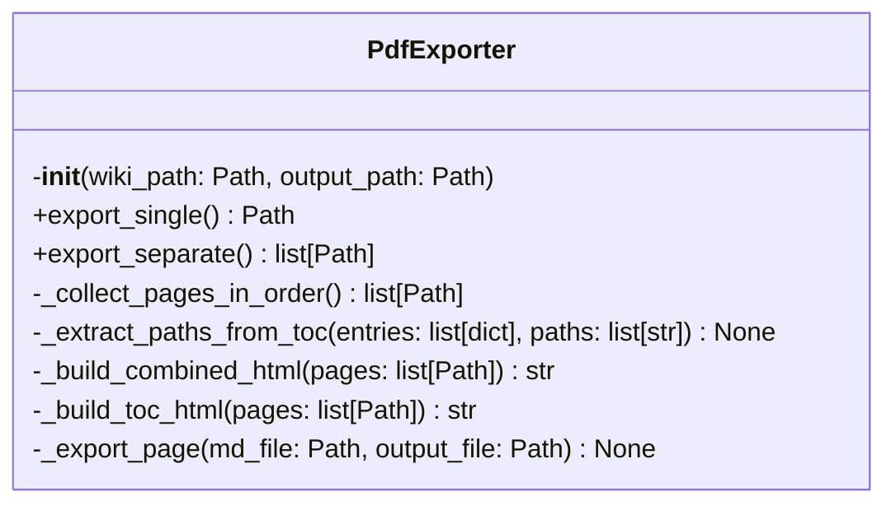

# PDF Export Module

## File Overview

The `pdf.py` module provides functionality for exporting DeepWiki documentation to PDF format. It supports both single-file exports (combining all pages) and separate exports (one PDF per page), with Mermaid diagram rendering capabilities and proper table of contents handling.

## Classes

### PdfExporter

The main class responsible for handling PDF export operations from DeepWiki documentation.

**Initialization:**
- `wiki_path`: Path to the .deepwiki directory
- `output_path`: Output path for PDF file(s)
- `toc_entries`: List to store table of contents entries

**Key Methods:**

#### export_single
Exports all wiki pages to a single combined PDF file.

**Returns:** Path to the generated PDF file

This method loads the table of contents from `toc.json` if available and collects all pages in the proper order before generating the combined PDF.

#### export_separate
Exports each wiki page as a separate PDF file.

**Returns:** List of paths to generated PDF files

Creates an output directory and generates individual PDF files for each markdown file found in the wiki directory structure.

## Functions

### export_to_pdf
The main export function that provides a high-level interface for PDF generation.

**Parameters:**
- `wiki_path`: Path to the .deepwiki directory (Path | str)
- `output_path`: Output path, defaults to "wiki.pdf" or "wiki_pdfs/" (Path | str | None)
- `single_file`: If True, combine all pages into one PDF (bool)

**Returns:** Success message with output path (str)

**Raises:** ValueError if the wiki path doesn't exist

### main
CLI entry point for PDF export functionality. Provides command-line argument parsing for:
- `wiki_path`: Path to .deepwiki directory (defaults to ".deepwiki")
- `-o, --output`: Output path specification
- `--separate`: Flag for separate file export mode

## Utility Functions

The module includes several utility functions for processing content:

- `is_mmdc_available`: Checks for Mermaid CLI availability
- `render_mermaid_to_png` / `render_mermaid_to_svg`: Mermaid diagram rendering
- `extract_mermaid_blocks`: Extracts Mermaid diagrams from markdown
- `render_markdown_for_pdf`: Processes markdown content for PDF generation
- `extract_title`: Extracts page titles from content

## Usage Examples

### Basic Single File Export
```python
from pathlib import Path
from local_deepwiki.export.pdf import export_to_pdf

# Export all pages to a single PDF
result = export_to_pdf(
    wiki_path=Path(".deepwiki"),
    output_path=Path("documentation.pdf"),
    single_file=True
)
```

### Separate File Export
```python
# Export each page as a separate PDF
result = export_to_pdf(
    wiki_path=Path(".deepwiki"),
    output_path=Path("pdf_output"),
    single_file=False
)
```

### Using the PdfExporter Class
```python
from local_deepwiki.export.pdf import PdfExporter

exporter = PdfExporter(
    wiki_path=Path(".deepwiki"),
    output_path=Path("output.pdf")
)

# Single file export
pdf_path = exporter.export_single()

# Or separate files
pdf_paths = exporter.export_separate()
```

## Dependencies

The module relies on:
- `markdown`: For markdown processing
- Standard library modules: `argparse`, `json`, `pathlib`, `subprocess`, `tempfile`
- External tools: Mermaid CLI for diagram rendering (optional)

## Related Components

This module integrates with the broader DeepWiki system by:
- Reading from `.deepwiki` directory structures
- Processing `toc.json` files for content organization
- Working with markdown files containing documentation content

## API Reference

### class `PdfExporter`

Export wiki markdown to PDF format.

**Methods:**

#### `__init__`

```python
def __init__(wiki_path: Path, output_path: Path)
```

Initialize the exporter.


| [Parameter](../generators/api_docs.md) | Type | Default | Description |
|-----------|------|---------|-------------|
| `wiki_path` | `Path` | - | Path to the .deepwiki directory. |
| `output_path` | `Path` | - | Output path for PDF file(s). |

#### `export_single`

```python
def export_single() -> Path
```

Export all wiki pages to a single PDF.

#### `export_separate`

```python
def export_separate() -> list[Path]
```

Export each wiki page as a separate PDF.


---

### Functions

#### `is_mmdc_available`

```python
def is_mmdc_available() -> bool
```

Check if mermaid-cli (mmdc) is available on the system.

**Returns:** `bool`


#### `render_mermaid_to_png`

```python
def render_mermaid_to_png(diagram_code: str, timeout: int = 30) -> bytes | None
```

Render a mermaid diagram to PNG using mermaid-cli.


| [Parameter](../generators/api_docs.md) | Type | Default | Description |
|-----------|------|---------|-------------|
| `diagram_code` | `str` | - | The mermaid diagram code. |
| `timeout` | `int` | `30` | Timeout in seconds for the mmdc command. |

**Returns:** `bytes | None`


#### `render_mermaid_to_svg`

```python
def render_mermaid_to_svg(diagram_code: str, timeout: int = 30) -> str | None
```

Render a mermaid diagram to SVG using mermaid-cli.  Note: SVG may have font issues in PDF. Use render_mermaid_to_png for PDF export.


| [Parameter](../generators/api_docs.md) | Type | Default | Description |
|-----------|------|---------|-------------|
| `diagram_code` | `str` | - | The mermaid diagram code. |
| `timeout` | `int` | `30` | Timeout in seconds for the mmdc command. |

**Returns:** `str | None`


#### `extract_mermaid_blocks`

```python
def extract_mermaid_blocks(content: str) -> list[tuple[str, str]]
```

Extract mermaid code blocks from markdown content.


| [Parameter](../generators/api_docs.md) | Type | Default | Description |
|-----------|------|---------|-------------|
| `content` | `str` | - | Markdown content. |

**Returns:** `list[tuple[str, str]]`


#### `render_markdown_for_pdf`

```python
def render_markdown_for_pdf(content: str, render_mermaid: bool = True) -> str
```

Render markdown to HTML suitable for PDF.


| [Parameter](../generators/api_docs.md) | Type | Default | Description |
|-----------|------|---------|-------------|
| `content` | `str` | - | Markdown content. |
| `render_mermaid` | `bool` | `True` | If True, attempt to render mermaid diagrams using CLI. Falls back to placeholder if CLI is not available. |

**Returns:** `str`


#### `extract_title`

```python
def extract_title(md_file: Path) -> str
```

Extract title from markdown file.


| [Parameter](../generators/api_docs.md) | Type | Default | Description |
|-----------|------|---------|-------------|
| `md_file` | `Path` | - | Path to markdown file. |

**Returns:** `str`


#### `export_to_pdf`

```python
def export_to_pdf(wiki_path: Path | str, output_path: Path | str | None = None, single_file: bool = True) -> str
```

Export wiki to PDF format.


| [Parameter](../generators/api_docs.md) | Type | Default | Description |
|-----------|------|---------|-------------|
| `wiki_path` | `Path | str` | - | Path to the .deepwiki directory. |
| `output_path` | `Path | str | None` | `None` | Output path (default: wiki.pdf or wiki_pdfs/). |
| `single_file` | `bool` | `True` | If True, combine all pages into one PDF. |

**Returns:** `str`


#### `main`

```python
def main() -> None
```

CLI entry point for PDF export.

**Returns:** `None`


## Class Diagram



## Call Graph

```mermaid
flowchart TD
    N0[CSS]
    N1[HTML]
    N2[Path]
    N3[PdfExporter._build_combined...]
    N4[PdfExporter._build_toc_html]
    N5[PdfExporter._collect_pages_...]
    N6[PdfExporter._export_page]
    N7[PdfExporter.export_separate]
    N8[PdfExporter.export_single]
    N9[TemporaryDirectory]
    N10[_extract_paths_from_toc]
    N11[exists]
    N12[export_to_pdf]
    N13[extract_mermaid_blocks]
    N14[extract_title]
    N15[findall]
    N16[is_mmdc_available]
    N17[main]
    N18[mkdir]
    N19[read_bytes]
    N20[read_text]
    N21[relative_to]
    N22[render_markdown_for_pdf]
    N23[render_mermaid_to_png]
    N24[render_mermaid_to_svg]
    N25[rglob]
    N26[run]
    N27[which]
    N28[write_pdf]
    N29[write_text]
    N16 --> N27
    N23 --> N16
    N23 --> N9
    N23 --> N2
    N23 --> N29
    N23 --> N26
    N23 --> N11
    N23 --> N19
    N24 --> N16
    N24 --> N9
    N24 --> N2
    N24 --> N29
    N24 --> N26
    N24 --> N11
    N24 --> N20
    N13 --> N15
    N22 --> N16
    N22 --> N13
    N22 --> N23
    N14 --> N20
    N12 --> N2
    N12 --> N11
    N17 --> N2
    N17 --> N11
    N17 --> N12
    N8 --> N11
    N8 --> N20
    N8 --> N18
    N8 --> N1
    N8 --> N0
    N8 --> N28
    N7 --> N18
    N7 --> N25
    N7 --> N21
    N5 --> N10
    N5 --> N11
    N5 --> N25
    N3 --> N20
    N3 --> N22
    N4 --> N14
    N4 --> N21
    N6 --> N20
    N6 --> N22
    N6 --> N14
    N6 --> N1
    N6 --> N0
    N6 --> N28
    classDef func fill:#e1f5fe
    class N0,N1,N2,N9,N10,N11,N12,N13,N14,N15,N16,N17,N18,N19,N20,N21,N22,N23,N24,N25,N26,N27,N28,N29 func
    classDef method fill:#fff3e0
    class N3,N4,N5,N6,N7,N8 method
```



## Relevant Source Files

- `src/local_deepwiki/export/pdf.py:480-664`

## See Also

- [test_pdf_export](../../../tests/test_pdf_export.md) - uses this
- [server](../server.md) - uses this
- [manifest](../generators/manifest.md) - shares 4 dependencies
- [vectorstore](../core/vectorstore.md) - shares 3 dependencies
