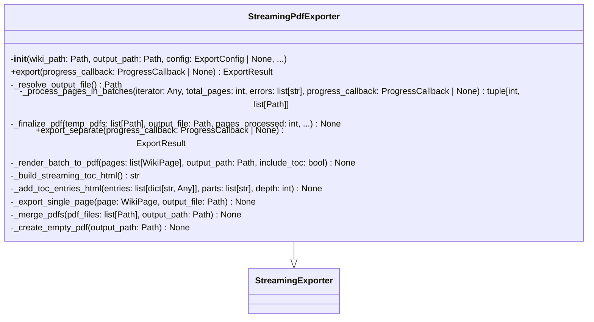
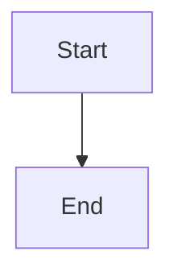

# File: `src/local_deepwiki/export/pdf.py`

## File Overview

This file provides functionality for exporting DeepWiki documentation to PDF format, supporting both batched streaming export and individual page exports. It leverages WeasyPrint for HTML-to-PDF rendering and integrates with Mermaid for diagram rendering. The file is designed to handle large wikis efficiently by processing pages in batches and managing temporary files.

The core export logic is encapsulated in the `StreamingPdfExporter` class, which inherits from [`StreamingExporter`](streaming.md) and implements asynchronous page processing with progress reporting. It also includes utility functions for rendering markdown content suitable for PDF and extracting titles from markdown files.

## Key Concepts

### Streaming Export Pattern
The `StreamingPdfExporter` implements a streaming pattern to manage memory usage when processing large wikis. Pages are processed in batches, with each batch rendered to a temporary PDF file. This approach prevents memory exhaustion and allows for progress tracking during long-running exports.

### Mermaid Diagram Handling
The file includes logic to render Mermaid diagrams as PNG images for inclusion in PDFs. This is necessary because SVGs rendered by Mermaid often don't render correctly in WeasyPrint. The implementation gracefully falls back to placeholder text if the required CLI tool (`mmdc`) is not available.

### PDF Merging Strategy
When merging multiple batch PDFs into a final output, the code attempts to use `pypdf` for efficient merging. If `pypdf` is unavailable, it falls back to copying only the first PDF, which is a pragmatic compromise for environments where `pypdf` cannot be installed.

### HTML Template and Styling
The file uses a predefined HTML template (`PDF_HTML_TEMPLATE`) and CSS styles (`PRINT_CSS`) to ensure consistent formatting across all exported pages. This centralizes styling logic and ensures that exported PDFs have a uniform appearance.

## Integration

This file is part of the `local_deepwiki.export` module and integrates with several other components:

- **Mermaid Integration**: Uses functions from `local_deepwiki.export.mermaid_renderer` to process Mermaid diagrams.
- **Shared Components**: Leverages `extract_title` from `local_deepwiki.export.shared` for consistent title extraction.
- **Streaming Infrastructure**: Inherits from [`StreamingExporter`](streaming.md) and uses [`ExportConfig`](streaming.md), [`ExportResult`](../services/models.md), [`ProgressCallback`](../models/foundation.md), and [`WikiPage`](streaming.md) types defined in `local_deepwiki.export.streaming`.
- **PDF Export Utilities**: Depends on `local_deepwiki.export.pdf_sync` for synchronous PDF export functionality, although the main implementation is in this file.

The `StreamingPdfExporter` class is used by test functions like `test_export_progress`, `test_pdf_streaming`, and `test_streaming_export`, indicating that it is a core component of the export system.

## Design Notes

### Error Handling and Resilience
The export process includes robust error handling to prevent a single page failure from aborting the entire export. Individual page errors are logged and collected in an errors list, allowing the export to continue processing remaining pages.

### Batch Size Configuration
The batch size for processing pages is configurable via [`ExportConfig`](streaming.md). This allows users to tune performance for their specific hardware or document size requirements.

### Temporary File Management
Temporary PDF files are created within a `TemporaryDirectory` to ensure cleanup. After processing, these files are copied to the final destination to avoid cleanup issues.

### Fallback Mechanisms
Several fallbacks are implemented:
- If `pypdf` is not available, the merging process uses a simple copy instead of failing.
- If Mermaid CLI is not available, diagrams are replaced with informative placeholders.
- If WeasyPrint is not installed, a helpful error is raised at runtime rather than at import time.

### Memory Efficiency
The use of `asyncio.to_thread` ensures that blocking I/O operations (like file I/O and PDF generation) do not block the event loop, maintaining responsiveness during long-running exports. Page content is released after processing to reduce memory pressure.

### Progress Reporting
Progress is reported using a callback mechanism that allows integration with UI components or logging systems. This is especially important for large wikis where users need feedback on export status.

### PDF Output Flexibility
The exporter supports both single-file output (with TOC) and separate file output per page, providing flexibility for different use cases.

## API Reference

### class `StreamingPdfExporter`

**Inherits from:** [`StreamingExporter`](streaming.md)

Memory-efficient PDF exporter using streaming page iteration.  Processes pages in batches, writes intermediate PDFs to temp files, then merges them at the end. Suitable for large wikis to avoid OOM.

**Methods:**


<details>
<summary>View Source (lines 129-546) | <a href="https://github.com/UrbanDiver/local-deepwiki-mcp/blob/main/src/local_deepwiki/export/pdf.py#L129-L546">GitHub</a></summary>

```python
class StreamingPdfExporter(StreamingExporter):
    # Methods: __init__, export, _resolve_output_file, _process_pages_in_batches, _finalize_pdf, export_separate, _render_batch_to_pdf, _build_streaming_toc_html, _add_toc_entries_html, _export_single_page, _merge_pdfs, _create_empty_pdf
```

</details>

#### `__init__`

```python
def __init__(wiki_path: Path, output_path: Path, config: ExportConfig | None = None, no_progress: bool = False)
```

Initialize the streaming PDF exporter.


| Parameter | Type | Default | Description |
|-----------|------|---------|-------------|
| `wiki_path` | `Path` | - | Path to the .deepwiki directory. |
| `output_path` | `Path` | - | Output path for PDF file(s). |
| `config` | `ExportConfig | None` | `None` | Export configuration. |
| `no_progress` | `bool` | `False` | If True, disable progress bars. |


<details>
<summary>View Source (lines 136-153) | <a href="https://github.com/UrbanDiver/local-deepwiki-mcp/blob/main/src/local_deepwiki/export/pdf.py#L136-L153">GitHub</a></summary>

```python
def __init__(
        self,
        wiki_path: Path,
        output_path: Path,
        config: ExportConfig | None = None,
        *,
        no_progress: bool = False,
    ):
        """Initialize the streaming PDF exporter.

        Args:
            wiki_path: Path to the .deepwiki directory.
            output_path: Output path for PDF file(s).
            config: Export configuration.
            no_progress: If True, disable progress bars.
        """
        super().__init__(wiki_path, output_path, config)
        self._no_progress = no_progress
```

</details>

#### `export`

```python
async def export(progress_callback: ProgressCallback | None = None) -> ExportResult
```

Export wiki to PDF with streaming/batched processing.


| Parameter | Type | Default | Description |
|-----------|------|---------|-------------|
| `progress_callback` | `ProgressCallback | None` | `None` | Optional callback for progress updates. |


<details>
<summary>View Source (lines 155-208) | <a href="https://github.com/UrbanDiver/local-deepwiki-mcp/blob/main/src/local_deepwiki/export/pdf.py#L155-L208">GitHub</a></summary>

```python
async def export(
        self, progress_callback: ProgressCallback | None = None
    ) -> ExportResult:
        """Export wiki to PDF with streaming/batched processing.

        Args:
            progress_callback: Optional callback for progress updates.

        Returns:
            ExportResult with export statistics.
        """
        start_time = time.monotonic()
        errors: list[str] = []

        logger.info(
            "Starting streaming PDF export from %s to %s",
            self.wiki_path,
            self.output_path,
        )

        await asyncio.to_thread(self.load_toc)

        iterator = self.get_page_iterator()
        total_pages = iterator.get_page_count()

        if progress_callback:
            progress_callback(
                0, total_pages, f"Starting PDF export ({total_pages} pages)"
            )

        output_file = await self._resolve_output_file()

        pages_processed, temp_pdfs = await self._process_pages_in_batches(
            iterator, total_pages, errors, progress_callback
        )

        await self._finalize_pdf(
            temp_pdfs, output_file, pages_processed, total_pages, progress_callback
        )

        duration_ms = int((time.monotonic() - start_time) * 1000)
        logger.info(
            "Streaming PDF export complete: %d pages in %d batches, %dms",
            pages_processed,
            len(temp_pdfs),
            duration_ms,
        )

        return ExportResult(
            pages_exported=pages_processed,
            output_path=output_file,
            duration_ms=duration_ms,
            errors=errors,
        )
```

</details>

#### `export_separate`

```python
async def export_separate(progress_callback: ProgressCallback | None = None) -> ExportResult
```

Export each wiki page as a separate PDF with streaming.


| Parameter | Type | Default | Description |
|-----------|------|---------|-------------|
| `progress_callback` | `ProgressCallback | None` | `None` | Optional callback for progress updates. |


---


<details>
<summary>View Source (lines 339-418) | <a href="https://github.com/UrbanDiver/local-deepwiki-mcp/blob/main/src/local_deepwiki/export/pdf.py#L339-L418">GitHub</a></summary>

```python
async def export_separate(
        self, progress_callback: ProgressCallback | None = None
    ) -> ExportResult:
        """Export each wiki page as a separate PDF with streaming.

        Args:
            progress_callback: Optional callback for progress updates.

        Returns:
            ExportResult with export statistics.
        """
        start_time = time.monotonic()
        errors: list[str] = []

        logger.info("Starting streaming separate PDF export from %s", self.wiki_path)

        # Determine output directory
        output_dir = self.output_path
        if output_dir.suffix == ".pdf":
            output_dir = output_dir.parent / output_dir.stem
        await asyncio.to_thread(output_dir.mkdir, parents=True, exist_ok=True)

        # Get page count for progress
        iterator = self.get_page_iterator()
        total_pages = iterator.get_page_count()

        # Report total pages at start
        if progress_callback:
            progress_callback(
                0, total_pages, f"Starting separate PDF export ({total_pages} pages)"
            )

        exported = 0
        async for page in iterator:
            try:
                rel_path = page.metadata.relative_path
                output_file = output_dir / rel_path.with_suffix(".pdf")
                await asyncio.to_thread(
                    output_file.parent.mkdir, parents=True, exist_ok=True
                )

                await asyncio.to_thread(self._export_single_page, page, output_file)
                exported += 1

                if progress_callback:
                    progress_callback(
                        exported,
                        total_pages,
                        f"Exported page {exported} of {total_pages}: {page.path}",
                    )

                # Release content from memory
                page.release_content()

            except Exception as e:  # noqa: BLE001 — export error boundary: one page failure must not abort entire PDF export
                error_msg = f"Failed to export {page.path}: {e}"
                logger.warning(error_msg)
                errors.append(error_msg)

        # Report completion
        if progress_callback:
            progress_callback(
                exported,
                total_pages,
                f"Separate PDF export complete ({exported} pages)",
            )

        duration_ms = int((time.monotonic() - start_time) * 1000)
        logger.info(
            "Streaming separate PDF export complete: %d pages in %dms",
            exported,
            duration_ms,
        )

        return ExportResult(
            pages_exported=exported,
            output_path=output_dir,
            duration_ms=duration_ms,
            errors=errors,
        )
```

</details>

### Functions

#### `render_markdown_for_pdf`

```python
def render_markdown_for_pdf(content: str, render_mermaid: bool = True) -> str
```

Render markdown to HTML suitable for PDF.


| Parameter | Type | Default | Description |
|-----------|------|---------|-------------|
| `content` | `str` | - | Markdown content. |
| `render_mermaid` | `bool` | `True` | If True, attempt to render mermaid diagrams using CLI. Falls back to placeholder if CLI is not available. |

**Returns:** `str`


<details>
<summary>View Source (lines 51-112) | <a href="https://github.com/UrbanDiver/local-deepwiki-mcp/blob/main/src/local_deepwiki/export/pdf.py#L51-L112">GitHub</a></summary>

```python
def render_markdown_for_pdf(content: str, render_mermaid: bool = True) -> str:
    """Render markdown to HTML suitable for PDF.

    Args:
        content: Markdown content.
        render_mermaid: If True, attempt to render mermaid diagrams using CLI.
            Falls back to placeholder if CLI is not available.

    Returns:
        HTML string.
    """
    processed_content = content

    # Process mermaid blocks
    if render_mermaid and is_mmdc_available():
        # Try to render mermaid diagrams to PNG (better font support than SVG)
        mermaid_blocks = extract_mermaid_blocks(content)
        for full_block, diagram_code in mermaid_blocks:
            png_bytes = render_mermaid_to_png(diagram_code)
            if png_bytes:
                # Embed PNG as base64 data URI
                b64_data = base64.b64encode(png_bytes).decode("ascii")
                img_tag = f''
                replacement = f'<div class="mermaid-diagram">{img_tag}</div>'
                processed_content = processed_content.replace(full_block, replacement)
            else:
                # Fall back to placeholder on render failure
                replacement = (
                    '<div class="mermaid-note">'
                    "[Diagram rendering failed - view in HTML version]"
                    "</div>"
                )
                processed_content = processed_content.replace(full_block, replacement)
    else:
        # No mermaid CLI - replace with placeholder notes
        lines = processed_content.split("\n")
        in_mermaid = False
        result_lines = []

        for line in lines:
            if line.strip() == "```mermaid":
                in_mermaid = True
                result_lines.append(
                    '<div class="mermaid-note">'
                    "[Diagram not available in PDF - view in HTML version]"
                    "</div>"
                )
            elif in_mermaid and line.strip() == "```":
                in_mermaid = False
            elif not in_mermaid:
                result_lines.append(line)

        processed_content = "\n".join(result_lines)

    md = markdown.Markdown(
        extensions=[
            "fenced_code",
            "tables",
            "toc",
        ]
    )
    return md.convert(processed_content)
```

</details>

#### `extract_title`

```python
def extract_title(md_file: Path) -> str
```

Extract title from markdown file.  Delegates to ``shared.extract_title``.


| Parameter | Type | Default | Description |
|-----------|------|---------|-------------|
| `md_file` | `Path` | - | Path to markdown file. |

**Returns:** `str`


<details>
<summary>View Source (lines 115-126) | <a href="https://github.com/UrbanDiver/local-deepwiki-mcp/blob/main/src/local_deepwiki/export/pdf.py#L115-L126">GitHub</a></summary>

```python
def extract_title(md_file: Path) -> str:
    """Extract title from markdown file.

    Delegates to ``shared.extract_title``.

    Args:
        md_file: Path to markdown file.

    Returns:
        Extracted title or filename-based title.
    """
    return _shared_extract_title(md_file)
```

</details>

## Class Diagram


```mermaid
classDiagram
    class StreamingPdfExporter {
        -__init__(wiki_path: Path, output_path: Path, config: ExportConfig | None, ...)
        +export(progress_callback: ProgressCallback | None) ExportResult
        -_resolve_output_file() Path
        -_process_pages_in_batches(iterator: Any, total_pages: int, errors: list[str], progress_callback: ProgressCallback | None) tuple[int, list[Path]]
        -_finalize_pdf(temp_pdfs: list[Path], output_file: Path, pages_processed: int, ...) None
        +export_separate(progress_callback: ProgressCallback | None) ExportResult
        -_render_batch_to_pdf(pages: list[WikiPage], output_path: Path, include_toc: bool) None
        -_build_streaming_toc_html() str
        -_add_toc_entries_html(entries: list[dict[str, Any]], parts: list[str], depth: int) None
        -_export_single_page(page: WikiPage, output_file: Path) None
        -_merge_pdfs(pdf_files: list[Path], output_path: Path) None
        -_create_empty_pdf(output_path: Path) None
    }
    StreamingPdfExporter --|> StreamingExporter
```

## Call Graph


```mermaid
flowchart TD
    N0[CSS]
    N1[ExportResult]
    N2[HTML]
    N3[ImportError]
    N4[Markdown]
    N5[StreamingPdfExporter._creat...]
    N6[StreamingPdfExporter._expor...]
    N7[StreamingPdfExporter._final...]
    N8[StreamingPdfExporter._merge...]
    N9[StreamingPdfExporter._proce...]
    N10[StreamingPdfExporter._rende...]
    N11[StreamingPdfExporter._resol...]
    N12[StreamingPdfExporter.export]
    N13[StreamingPdfExporter.export...]
    N14[_add_toc_entries_html]
    N15[_require_weasyprint]
    N16[b64encode]
    N17[copy]
    N18[decode]
    N19[extract_mermaid_blocks]
    N20[get_page_count]
    N21[get_page_iterator]
    N22[is_mmdc_available]
    N23[monotonic]
    N24[progress_callback]
    N25[release_content]
    N26[render_markdown_for_pdf]
    N27[render_mermaid_to_png]
    N28[to_thread]
    N29[write_pdf]
    N15 --> N3
    N26 --> N22
    N26 --> N19
    N26 --> N27
    N26 --> N18
    N26 --> N16
    N26 --> N4
    N12 --> N23
    N12 --> N28
    N12 --> N21
    N12 --> N20
    N12 --> N24
    N12 --> N1
    N11 --> N28
    N9 --> N24
    N9 --> N28
    N9 --> N25
    N9 --> N17
    N7 --> N24
    N7 --> N28
    N13 --> N23
    N13 --> N28
    N13 --> N21
    N13 --> N20
    N13 --> N24
    N13 --> N25
    N13 --> N1
    N10 --> N26
    N10 --> N15
    N10 --> N2
    N10 --> N0
    N10 --> N29
    N6 --> N26
    N6 --> N15
    N6 --> N2
    N6 --> N0
    N6 --> N29
    N8 --> N17
    N5 --> N15
    N5 --> N2
    N5 --> N0
    N5 --> N29
    classDef func fill:#e1f5fe
    class N0,N1,N2,N3,N4,N14,N15,N16,N17,N18,N19,N20,N21,N22,N23,N24,N25,N26,N27,N28,N29 func
    classDef method fill:#fff3e0
    class N5,N6,N7,N8,N9,N10,N11,N12,N13 method
```

## Used By

Functions and methods in this file and their callers:

- **`CSS`**: called by `StreamingPdfExporter._create_empty_pdf`, `StreamingPdfExporter._export_single_page`, `StreamingPdfExporter._render_batch_to_pdf`
- **[`ExportResult`](../services/models.md)**: called by `StreamingPdfExporter.export`, `StreamingPdfExporter.export_separate`
- **`HTML`**: called by `StreamingPdfExporter._create_empty_pdf`, `StreamingPdfExporter._export_single_page`, `StreamingPdfExporter._render_batch_to_pdf`
- **`ImportError`**: called by `_require_weasyprint`
- **`Markdown`**: called by `render_markdown_for_pdf`
- **`Path`**: called by `StreamingPdfExporter._process_pages_in_batches`
- **`PdfWriter`**: called by `StreamingPdfExporter._merge_pdfs`
- **`TemporaryDirectory`**: called by `StreamingPdfExporter._process_pages_in_batches`
- **`__init__`**: called by `StreamingPdfExporter.__init__`
- **`_add_toc_entries_html`**: called by `StreamingPdfExporter._add_toc_entries_html`, `StreamingPdfExporter._build_streaming_toc_html`
- **`_build_streaming_toc_html`**: called by `StreamingPdfExporter._render_batch_to_pdf`
- **`_create_empty_pdf`**: called by `StreamingPdfExporter._finalize_pdf`
- **`_finalize_pdf`**: called by `StreamingPdfExporter.export`
- **`_merge_pdfs`**: called by `StreamingPdfExporter._finalize_pdf`
- **`_process_pages_in_batches`**: called by `StreamingPdfExporter.export`
- **`_require_weasyprint`**: called by `StreamingPdfExporter._create_empty_pdf`, `StreamingPdfExporter._export_single_page`, `StreamingPdfExporter._render_batch_to_pdf`
- **`_resolve_output_file`**: called by `StreamingPdfExporter.export`
- **`_shared_extract_title`**: called by `extract_title`
- **`b64encode`**: called by `render_markdown_for_pdf`
- **`convert`**: called by `render_markdown_for_pdf`
- **`copy`**: called by `StreamingPdfExporter._merge_pdfs`, `StreamingPdfExporter._process_pages_in_batches`
- **`decode`**: called by `render_markdown_for_pdf`
- **[`extract_mermaid_blocks`](mermaid_renderer.md)**: called by `render_markdown_for_pdf`
- **`get_page_count`**: called by `StreamingPdfExporter.export`, `StreamingPdfExporter.export_separate`
- **`get_page_iterator`**: called by `StreamingPdfExporter.export`, `StreamingPdfExporter.export_separate`
- **`is_dir`**: called by `StreamingPdfExporter._resolve_output_file`
- **[`is_mmdc_available`](mermaid_renderer.md)**: called by `render_markdown_for_pdf`
- **`monotonic`**: called by `StreamingPdfExporter.export`, `StreamingPdfExporter.export_separate`
- **[`progress_callback`](../handlers/research.md)**: called by `StreamingPdfExporter._finalize_pdf`, `StreamingPdfExporter._process_pages_in_batches`, `StreamingPdfExporter.export`, `StreamingPdfExporter.export_separate`
- **`release_content`**: called by `StreamingPdfExporter._process_pages_in_batches`, `StreamingPdfExporter.export_separate`
- **`render_markdown_for_pdf`**: called by `StreamingPdfExporter._export_single_page`, `StreamingPdfExporter._render_batch_to_pdf`
- **[`render_mermaid_to_png`](mermaid_renderer.md)**: called by `render_markdown_for_pdf`
- **`to_thread`**: called by `StreamingPdfExporter._finalize_pdf`, `StreamingPdfExporter._process_pages_in_batches`, `StreamingPdfExporter._resolve_output_file`, `StreamingPdfExporter.export`, `StreamingPdfExporter.export_separate`
- **`with_suffix`**: called by `StreamingPdfExporter.export_separate`
- **`write`**: called by `StreamingPdfExporter._merge_pdfs`
- **`write_pdf`**: called by `StreamingPdfExporter._create_empty_pdf`, `StreamingPdfExporter._export_single_page`, `StreamingPdfExporter._render_batch_to_pdf`

## Usage Examples

*Examples extracted from test files*

### Test that mermaid diagrams are replaced with a note when CLI unavailable

From `test_pdf_mermaid.py::TestMermaidHandling::test_mermaid_replaced_with_note`:

```python
md = """# Test


```mermaid
graph TD
    A[Start] --> B[End]
```
"""
        html = render_markdown_for_pdf(md, render_mermaid=False)

        assert "mermaid-note" in html
        assert "not available in PDF" in html
        assert "view in html version" in html.lower()
```

### Test that mermaid diagrams are replaced with a note when CLI unavailable

From `test_pdf_mermaid.py::TestMermaidHandling::test_mermaid_replaced_with_note`:

```python
md = """# Test


```mermaid
graph TD
    A[Start] --> B[End]
```
"""
        html = render_markdown_for_pdf(md, render_mermaid=False)

        assert "mermaid-note" in html
        assert "not available in PDF" in html
        assert "view in html version" in html.lower()
```

### Test that regular code blocks are preserved

From `test_pdf_mermaid.py::TestMermaidHandling::test_regular_code_blocks_preserved`:

```python
html = render_markdown_for_pdf(md, render_mermaid=False)

assert "def hello" in html
assert "print(" in html and "Hello" in html
assert "mermaid-note" not in html
```

### Test when mmdc is available

From `test_pdf_mermaid.py::TestIsMmdcAvailable::test_mmdc_available`:

```python
import local_deepwiki.export.mermaid_renderer as mermaid_module

mermaid_module._mmdc_available_var.set(None)
mock_which.return_value = "/usr/local/bin/mmdc"

result = is_mmdc_available()
assert result is True
mock_which.assert_called_once_with("mmdc")
```

### Test when mmdc is not available

From `test_pdf_mermaid.py::TestIsMmdcAvailable::test_mmdc_not_available`:

```python
import local_deepwiki.export.mermaid_renderer as mermaid_module

mermaid_module._mmdc_available_var.set(None)
mock_which.return_value = None

result = is_mmdc_available()
assert result is False
```


## Last Modified

| Entity | Type | Author | Date | Commit |
|--------|------|--------|------|--------|
| `StreamingPdfExporter` | class | Brian Breidenbach | 1 week ago | `6c0c361` refactor: extract helpers f... |
| `export` | method | Brian Breidenbach | 1 week ago | `6c0c361` refactor: extract helpers f... |
| `_resolve_output_file` | method | Brian Breidenbach | 1 week ago | `6c0c361` refactor: extract helpers f... |
| `_process_pages_in_batches` | method | Brian Breidenbach | 1 week ago | `6c0c361` refactor: extract helpers f... |
| `_finalize_pdf` | method | Brian Breidenbach | 1 week ago | `6c0c361` refactor: extract helpers f... |
| `export_separate` | method | Brian Breidenbach | Feb 23, 2026 | `c6fe2bd` refactor: split oversized m... |
| `_export_single_page` | method | Brian Breidenbach | Feb 20, 2026 | `6be69f5` refactor: low-priority Pyth... |
| `_merge_pdfs` | method | Brian Breidenbach | Feb 20, 2026 | `6be69f5` refactor: low-priority Pyth... |
| `_create_empty_pdf` | method | Brian Breidenbach | Feb 20, 2026 | `6be69f5` refactor: low-priority Pyth... |
| `render_markdown_for_pdf` | function | Brian Breidenbach | Feb 11, 2026 | `c93819b` refactor: wrap blocking I/O... |
| `_render_batch_to_pdf` | method | Brian Breidenbach | Feb 10, 2026 | `20c40bf` fix: graceful degradation w... |
| `_require_weasyprint` | function | Brian Breidenbach | Feb 10, 2026 | `20c40bf` fix: graceful degradation w... |
| `extract_title` | function | Brian Breidenbach | Feb 09, 2026 | `2130136` refactor: Extract duplicate... |
| `__init__` | method | Brian Breidenbach | Jan 26, 2026 | `a64166a` Add seven medium-priority e... |
| `_build_streaming_toc_html` | method | Brian Breidenbach | Jan 26, 2026 | `a64166a` Add seven medium-priority e... |
| `_add_toc_entries_html` | method | Brian Breidenbach | Jan 26, 2026 | `a64166a` Add seven medium-priority e... |

## Additional Source Code

Source code for functions and methods not listed in the API Reference above.

#### `_require_weasyprint`

<details>
<summary>View Source (lines 41-48) | <a href="https://github.com/UrbanDiver/local-deepwiki-mcp/blob/main/src/local_deepwiki/export/pdf.py#L41-L48">GitHub</a></summary>

```python
def _require_weasyprint() -> None:
    """Raise a helpful error if WeasyPrint is not installed."""
    if HTML is None:
        raise ImportError(
            "WeasyPrint is required for PDF export but is not installed.\n"
            "Install with: uv pip install weasyprint\n"
            "See: https://doc.courtbouillon.org/weasyprint/stable/first_steps.html"
        )
```

</details>


#### `_resolve_output_file`

<details>
<summary>View Source (lines 210-223) | <a href="https://github.com/UrbanDiver/local-deepwiki-mcp/blob/main/src/local_deepwiki/export/pdf.py#L210-L223">GitHub</a></summary>

```python
async def _resolve_output_file(self) -> Path:
        """Determine and prepare the output file path.

        If the configured output path is a directory, appends ``documentation.pdf``.
        Creates any necessary parent directories.

        Returns:
            The resolved output file path.
        """
        output_file = self.output_path
        if output_file.is_dir():
            output_file = output_file / "documentation.pdf"
        await asyncio.to_thread(output_file.parent.mkdir, parents=True, exist_ok=True)
        return output_file
```

</details>


#### `_process_pages_in_batches`

<details>
<summary>View Source (lines 225-303) | <a href="https://github.com/UrbanDiver/local-deepwiki-mcp/blob/main/src/local_deepwiki/export/pdf.py#L225-L303">GitHub</a></summary>

```python
async def _process_pages_in_batches(
        self,
        iterator: Any,
        total_pages: int,
        errors: list[str],
        progress_callback: ProgressCallback | None,
    ) -> tuple[int, list[Path]]:
        """Iterate pages, accumulate them into batches, and render each batch to a PDF.

        Args:
            iterator: Page iterator returned by ``get_page_iterator()``.
            total_pages: Total page count used for progress reporting.
            errors: Mutable list to which per-page error messages are appended.
            progress_callback: Optional callback for progress updates.

        Returns:
            A tuple of ``(pages_processed, temp_pdfs)`` where ``temp_pdfs`` is
            the ordered list of intermediate batch PDF paths.
        """
        batch_size = self.config.batch_size
        batch_num = 0
        pages_processed = 0
        temp_pdfs: list[Path] = []

        with tempfile.TemporaryDirectory() as temp_dir:
            temp_path = Path(temp_dir)
            batch_pages: list[WikiPage] = []

            async for page in iterator:
                try:
                    batch_pages.append(page)
                    pages_processed += 1

                    if progress_callback:
                        progress_callback(
                            pages_processed,
                            total_pages,
                            f"Processing page {pages_processed} of {total_pages}: {page.path}",
                        )

                    if len(batch_pages) >= batch_size:
                        batch_pdf = temp_path / f"batch_{batch_num:04d}.pdf"
                        await asyncio.to_thread(
                            self._render_batch_to_pdf,
                            batch_pages,
                            batch_pdf,
                            batch_num == 0,
                        )
                        temp_pdfs.append(batch_pdf)

                        for p in batch_pages:
                            p.release_content()
                        batch_pages = []
                        batch_num += 1

                except Exception as e:  # noqa: BLE001 — export error boundary: one page failure must not abort entire PDF export
                    error_msg = f"Failed to process {page.path}: {e}"
                    logger.warning(error_msg)
                    errors.append(error_msg)

            if batch_pages:
                batch_pdf = temp_path / f"batch_{batch_num:04d}.pdf"
                await asyncio.to_thread(
                    self._render_batch_to_pdf, batch_pages, batch_pdf, batch_num == 0
                )
                temp_pdfs.append(batch_pdf)

                for p in batch_pages:
                    p.release_content()

            # Copy temp PDFs out of the TemporaryDirectory before it is cleaned up
            saved: list[Path] = []
            parent = temp_path.parent
            for pdf in temp_pdfs:
                dest = parent / pdf.name
                shutil.copy(pdf, dest)
                saved.append(dest)

        return pages_processed, saved
```

</details>


#### `_finalize_pdf`

<details>
<summary>View Source (lines 305-337) | <a href="https://github.com/UrbanDiver/local-deepwiki-mcp/blob/main/src/local_deepwiki/export/pdf.py#L305-L337">GitHub</a></summary>

```python
async def _finalize_pdf(
        self,
        temp_pdfs: list[Path],
        output_file: Path,
        pages_processed: int,
        total_pages: int,
        progress_callback: ProgressCallback | None,
    ) -> None:
        """Merge batch PDFs into the final output file and report completion.

        Args:
            temp_pdfs: Ordered list of intermediate batch PDF paths.
            output_file: Destination path for the merged PDF.
            pages_processed: Number of pages processed (for progress reporting).
            total_pages: Total page count (for progress reporting).
            progress_callback: Optional callback for progress updates.
        """
        if progress_callback:
            progress_callback(pages_processed, total_pages, "Merging PDF batches...")

        if len(temp_pdfs) == 1:
            await asyncio.to_thread(shutil.copy, temp_pdfs[0], output_file)
        elif len(temp_pdfs) > 1:
            self._merge_pdfs(temp_pdfs, output_file)
        else:
            self._create_empty_pdf(output_file)

        if progress_callback:
            progress_callback(
                pages_processed,
                total_pages,
                f"PDF export complete ({pages_processed} pages)",
            )
```

</details>


#### `_render_batch_to_pdf`

<details>
<summary>View Source (lines 420-457) | <a href="https://github.com/UrbanDiver/local-deepwiki-mcp/blob/main/src/local_deepwiki/export/pdf.py#L420-L457">GitHub</a></summary>

```python
def _render_batch_to_pdf(
        self, pages: list[WikiPage], output_path: Path, include_toc: bool = False
    ) -> None:
        """Render a batch of pages to a PDF file.

        Args:
            pages: List of WikiPage objects to render.
            output_path: Path for the output PDF.
            include_toc: If True, include TOC at the start (first batch only).
        """
        parts = []

        if include_toc:
            # Add title page with TOC for first batch
            parts.append("<h1>Documentation</h1>")
            parts.append("<h2>Table of Contents</h2>")
            parts.append(self._build_streaming_toc_html())
            parts.append('<div class="page-break"></div>')

        for i, page in enumerate(pages):
            content = page.content
            html_content = render_markdown_for_pdf(content)
            parts.append(html_content)

            # Add page break between pages (except last)
            if i < len(pages) - 1:
                parts.append('<div class="page-break"></div>')

        combined_content = "\n".join(parts)
        full_html = PDF_HTML_TEMPLATE.format(
            title="Documentation",
            content=combined_content,
        )

        _require_weasyprint()
        html_doc = HTML(string=full_html)
        css = CSS(string=PRINT_CSS)
        html_doc.write_pdf(output_path, stylesheets=[css])
```

</details>


#### `_build_streaming_toc_html`

<details>
<summary>View Source (lines 459-464) | <a href="https://github.com/UrbanDiver/local-deepwiki-mcp/blob/main/src/local_deepwiki/export/pdf.py#L459-L464">GitHub</a></summary>

```python
def _build_streaming_toc_html(self) -> str:
        """Build TOC HTML from loaded TOC entries."""
        parts = ['<div class="toc">']
        self._add_toc_entries_html(self._toc_entries, parts, 0)
        parts.append("</div>")
        return "\n".join(parts)
```

</details>


#### `_add_toc_entries_html`

<details>
<summary>View Source (lines 466-475) | <a href="https://github.com/UrbanDiver/local-deepwiki-mcp/blob/main/src/local_deepwiki/export/pdf.py#L466-L475">GitHub</a></summary>

```python
def _add_toc_entries_html(
        self, entries: list[dict[str, Any]], parts: list[str], depth: int
    ) -> None:
        """Recursively add TOC entries to HTML parts."""
        for entry in entries:
            title = entry.get("title", "")
            indent = "  " * depth
            parts.append(f'<div class="toc-item">{indent}{title}</div>')
            if "children" in entry:
                self._add_toc_entries_html(entry["children"], parts, depth + 1)
```

</details>


#### `_export_single_page`

<details>
<summary>View Source (lines 478-498) | <a href="https://github.com/UrbanDiver/local-deepwiki-mcp/blob/main/src/local_deepwiki/export/pdf.py#L478-L498">GitHub</a></summary>

```python
def _export_single_page(page: WikiPage, output_file: Path) -> None:
        """Export a single wiki page to PDF.

        Args:
            page: WikiPage object to export.
            output_file: Output PDF path.
        """
        logger.debug("Exporting page: %s", page.path)

        content = page.content
        html_content = render_markdown_for_pdf(content)

        full_html = PDF_HTML_TEMPLATE.format(
            title=page.title,
            content=html_content,
        )

        _require_weasyprint()
        html_doc = HTML(string=full_html)
        css = CSS(string=PRINT_CSS)
        html_doc.write_pdf(output_file, stylesheets=[css])
```

</details>


#### `_merge_pdfs`

<details>
<summary>View Source (lines 501-530) | <a href="https://github.com/UrbanDiver/local-deepwiki-mcp/blob/main/src/local_deepwiki/export/pdf.py#L501-L530">GitHub</a></summary>

```python
def _merge_pdfs(pdf_files: list[Path], output_path: Path) -> None:
        """Merge multiple PDF files into one.

        Uses pypdf if available, otherwise concatenates using WeasyPrint.

        Args:
            pdf_files: List of PDF file paths to merge.
            output_path: Output path for merged PDF.
        """
        try:
            # Try using pypdf for efficient merging
            from pypdf import PdfWriter

            writer = PdfWriter()
            for pdf_file in pdf_files:
                writer.append(str(pdf_file))
            writer.write(str(output_path))
            writer.close()
            logger.debug("Merged %s PDFs using pypdf", len(pdf_files))

        except ImportError:
            # Fallback: Copy first PDF only — remaining batches are lost
            logger.warning(
                "pypdf not available for PDF merging. "
                "Only %d of %d PDF batches included in output. "
                "Install pypdf (`pip install pypdf`) for complete multi-batch merging.",
                1,
                len(pdf_files),
            )
            shutil.copy(pdf_files[0], output_path)
```

</details>


#### `_create_empty_pdf`

<details>
<summary>View Source (lines 533-546) | <a href="https://github.com/UrbanDiver/local-deepwiki-mcp/blob/main/src/local_deepwiki/export/pdf.py#L533-L546">GitHub</a></summary>

```python
def _create_empty_pdf(output_path: Path) -> None:
        """Create an empty PDF file.

        Args:
            output_path: Path for the output PDF.
        """
        empty_html = PDF_HTML_TEMPLATE.format(
            title="Documentation",
            content="<p>No pages to export.</p>",
        )
        _require_weasyprint()
        html_doc = HTML(string=empty_html)
        css = CSS(string=PRINT_CSS)
        html_doc.write_pdf(output_path, stylesheets=[css])
```

</details>

## Relevant Source Files

- `src/local_deepwiki/export/pdf.py:129-546`
