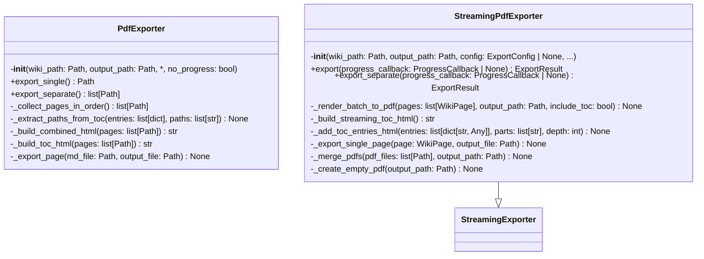

# File: `src/local_deepwiki/export/pdf.py`

## File Overview

This file provides functionality for exporting a wiki (stored in a `.deepwiki` directory) to PDF format. It supports both single-file and separate-file exports, with streaming capabilities for handling large wikis efficiently. The implementation uses `weasyprint` for HTML-to-PDF rendering and `pypdf` for merging PDFs.

### Dependencies

This file imports:
- Standard library modules: `argparse`, `asyncio`, `base64`, `json`, `re`, `shutil`, `subprocess`, `sys`, `tempfile`, `time`
- Typing and collections: `AsyncIterator`, `Path`, `Any`, `cast`
- External libraries: `markdown`, `weasyprint.CSS`, `weasyprint.HTML`, `pypdf.PdfWriter`
- Internal modules:
  - [`local_deepwiki.cli_progress.create_progress`](../cli_progress.md)
  - `local_deepwiki.export.streaming` (for [`ExportConfig`](streaming.md), [`ExportResult`](streaming.md), [`ProgressCallback`](../cli_progress.md), [`StreamingExporter`](streaming.md), [`WikiPage`](streaming.md), [`WikiPageIterator`](streaming.md))
  - [`local_deepwiki.logging.get_logger`](../logging.md)

## Classes

### `StreamingPdfExporter`

A streaming PDF exporter that processes wiki pages in batches to generate a PDF. It supports both combined and separate PDF exports.


<details>
<summary>View Source (lines 508-815) | <a href="https://github.com/UrbanDiver/local-deepwiki-mcp/blob/main/src/local_deepwiki/export/pdf.py#L508-L815">GitHub</a></summary>

```python
class StreamingPdfExporter(StreamingExporter):
    # Methods: __init__, export, export_separate, _render_batch_to_pdf, _build_streaming_toc_html, _add_toc_entries_html, _export_single_page, _merge_pdfs, _create_empty_pdf
```

</details>

#### Methods

- **`__init__(self, wiki_path: Path, output_path: Path, config: ExportConfig | None = None, *, no_progress: bool = False)`**
  - Initializes the streaming PDF exporter.
  - **Parameters**:
    - `wiki_path`: Path to the `.deepwiki` directory.
    - `output_path`: Output path for PDF file(s).
    - `config`: Optional export configuration.
    - `no_progress`: If `True`, disables progress bars.

- **`export(self, progress_callback: ProgressCallback | None = None) -> ExportResult`**
  - Exports the wiki to a single PDF with streaming/batched processing.
  - **Parameters**:
    - [`progress_callback`](../handlers.md): Optional callback for progress updates.
  - **Returns**: [`ExportResult`](streaming.md) with export statistics.

- **`export_separate(self, progress_callback: ProgressCallback | None = None) -> ExportResult`**
  - Exports each wiki page as a separate PDF with streaming.
  - **Parameters**:
    - [`progress_callback`](../handlers.md): Optional callback for progress updates.
  - **Returns**: [`ExportResult`](streaming.md) with export statistics.

- **`_render_batch_to_pdf(self, pages: list[WikiPage], output_path: Path, include_toc: bool = False) -> None`**
  - Renders a batch of pages to a PDF file.
  - **Parameters**:
    - `pages`: List of [`WikiPage`](streaming.md) objects to render.
    - `output_path`: Path for the output PDF.
    - `include_toc`: If `True`, includes a table of contents at the start (first batch only).

- **`_build_streaming_toc_html(self) -> str`**
  - Builds the HTML representation of the table of contents from loaded TOC entries.

- **`_add_toc_entries_html(self, entries: list[dict[str, Any]], parts: list[str], depth: int) -> None`**
  - Recursively adds TOC entries to HTML parts.

- **`_export_single_page(self, page: WikiPage, output_file: Path) -> None`**
  - Exports a single wiki page to a PDF.
  - **Parameters**:
    - `page`: [`WikiPage`](streaming.md) object to export.
    - `output_file`: Output PDF path.

- **`_merge_pdfs(self, pdf_files: list[Path], output_path: Path) -> None`**
  - Merges multiple PDF files into one using `pypdf` or WeasyPrint.
  - **Parameters**:
    - `pdf_files`: List of PDF file paths to merge.
    - `output_path`: Output path for the merged PDF.

- **`_create_empty_pdf(self, output_path: Path) -> None`**
  - Creates an empty PDF file.
  - **Parameters**:
    - `output_path`: Path for the output PDF.

### `PdfExporter`

A non-streaming PDF exporter that loads all pages into memory before exporting.


<details>
<summary>View Source (lines 818-1029) | <a href="https://github.com/UrbanDiver/local-deepwiki-mcp/blob/main/src/local_deepwiki/export/pdf.py#L818-L1029">GitHub</a></summary>

```python
class PdfExporter:
    # Methods: __init__, export_single, export_separate, _collect_pages_in_order, _extract_paths_from_toc, _build_combined_html, _build_toc_html, _export_page
```

</details>

#### Methods

- **`__init__(self, wiki_path: Path, output_path: Path, *, no_progress: bool = False)`**
  - Initializes the exporter.
  - **Parameters**:
    - `wiki_path`: Path to the `.deepwiki` directory.
    - `output_path`: Output path for PDF file(s).
    - `no_progress`: If `True`, disables progress bars.

- **`export_single(self) -> Path`**
  - Exports all wiki pages to a single PDF.
  - **Returns**: Path to the generated PDF file.

- **`export_separate(self) -> list[Path]`**
  - Exports each wiki page as a separate PDF.
  - **Returns**: List of paths to the generated PDF files.

- **`_collect_pages_in_order(self) -> list[WikiPage]`**
  - Collects all pages in the order specified by the TOC.

- **`_extract_paths_from_toc(self, entries: list[dict]) -> list[Path]`**
  - Extracts page paths from the TOC entries.

- **`_build_combined_html(self, pages: list[WikiPage]) -> str`**
  - Builds the combined HTML for all pages.

- **`_build_toc_html(self) -> str`**
  - Builds the HTML for the table of contents.

- **`_export_page(self, page: WikiPage, output_path: Path) -> None`**
  - Exports a single page to a PDF.
  - **Parameters**:
    - `page`: [`WikiPage`](streaming.md) object to export.
    - `output_path`: Output PDF path.

## Functions

- **`is_mmdc_available()`**
  - Checks if the `mmdc` (Mermaid CLI) tool is available for rendering Mermaid diagrams.
  - **Returns**: `bool` indicating availability.

- **`render_mermaid_to_png(mermaid_code: str, output_path: Path) -> None`**
  - Renders Mermaid code to a PNG image.
  - **Parameters**:
    - `mermaid_code`: String containing Mermaid diagram code.
    - `output_path`: Output path for the PNG file.

- **`render_mermaid_to_svg(mermaid_code: str, output_path: Path) -> None`**
  - Renders Mermaid code to an SVG image.
  - **Parameters**:
    - `mermaid_code`: String containing Mermaid diagram code.
    - `output_path`: Output path for the SVG file.

- **`extract_mermaid_blocks(markdown_content: str) -> list[str]`**
  - Extracts Mermaid code blocks from markdown content.
  - **Parameters**:
    - `markdown_content`: Markdown text.
  - **Returns**: List of Mermaid code strings.

- **`export_to_pdf(wiki_path: Path, output_path: Path, single_file: bool = True, no_progress: bool = False) -> Path | list[Path]`**
  - Main function to export the wiki to PDF.
  - **Parameters**:
    - `wiki_path`: Path to the `.deepwiki` directory.
    - `output_path`: Output path for PDF file(s).
    - `single_file`: If `True`, exports to a single file; otherwise, separate files.
    - `no_progress`: If `True`, disables progress bars.
  - **Returns**: Path or list of paths to generated PDF files.

## Integration

This file integrates with:
- The `local_deepwiki.export.streaming` module for streaming export logic.
- The `local_deepwiki.cli_progress` module for progress reporting.
- The `local_deepwiki.logging` module for logging.

It is used by the main CLI or other modules that require PDF export functionality from a `.deepwiki` directory.

## Usage Examples

### Using `StreamingPdfExporter`

```python
from local_deepwiki.export.pdf import StreamingPdfExporter

exporter = StreamingPdfExporter(wiki_path="/path/to/wiki", output_path="/path/to/output.pdf")
result = exporter.export()
```

### Using `PdfExporter`

```python
from local_deepwiki.export.pdf import PdfExporter

exporter = PdfExporter(wiki_path="/path/to/wiki", output_path="/path/to/output.pdf")
pdf_path = exporter.export_single()
```

### Using `export_to_pdf` function

```python
from local_deepwiki.export.pdf import export_to_pdf

# Export to a single PDF
pdf_path = export_to_pdf(wiki_path="/path/to/wiki", output_path="/path/to/output.pdf")

# Export to separate PDFs
pdf_paths = export_to_pdf(wiki_path="/path/to/wiki", output_path="/path/to/output", single_file=False)
```

## API Reference

### class `StreamingPdfExporter`

**Inherits from:** [`StreamingExporter`](streaming.md)

Memory-efficient PDF exporter using streaming page iteration.  Processes pages in batches, writes intermediate PDFs to temp files, then merges them at the end. Suitable for large wikis to avoid OOM.

**Methods:**


<details>
<summary>View Source (lines 508-815) | <a href="https://github.com/UrbanDiver/local-deepwiki-mcp/blob/main/src/local_deepwiki/export/pdf.py#L508-L815">GitHub</a></summary>

```python
class StreamingPdfExporter(StreamingExporter):
    # Methods: __init__, export, export_separate, _render_batch_to_pdf, _build_streaming_toc_html, _add_toc_entries_html, _export_single_page, _merge_pdfs, _create_empty_pdf
```

</details>

#### `__init__`

```python
def __init__(wiki_path: Path, output_path: Path, config: ExportConfig | None = None, no_progress: bool = False)
```

Initialize the streaming PDF exporter.


| [Parameter](../generators/api_docs.md) | Type | Default | Description |
|-----------|------|---------|-------------|
| `wiki_path` | `Path` | - | Path to the .deepwiki directory. |
| `output_path` | `Path` | - | Output path for PDF file(s). |
| `config` | `ExportConfig | None` | `None` | Export configuration. |
| `no_progress` | `bool` | `False` | If True, disable progress bars. |


<details>
<summary>View Source (lines 515-532) | <a href="https://github.com/UrbanDiver/local-deepwiki-mcp/blob/main/src/local_deepwiki/export/pdf.py#L515-L532">GitHub</a></summary>

```python
def __init__(
        self,
        wiki_path: Path,
        output_path: Path,
        config: ExportConfig | None = None,
        *,
        no_progress: bool = False,
    ):
        """Initialize the streaming PDF exporter.

        Args:
            wiki_path: Path to the .deepwiki directory.
            output_path: Output path for PDF file(s).
            config: Export configuration.
            no_progress: If True, disable progress bars.
        """
        super().__init__(wiki_path, output_path, config)
        self._no_progress = no_progress
```

</details>

#### `export`

```python
async def export(progress_callback: ProgressCallback | None = None) -> ExportResult
```

Export wiki to PDF with streaming/batched processing.


| [Parameter](../generators/api_docs.md) | Type | Default | Description |
|-----------|------|---------|-------------|
| [`progress_callback`](../handlers.md) | `ProgressCallback | None` | `None` | Optional callback for progress updates. |


<details>
<summary>View Source (lines 534-638) | <a href="https://github.com/UrbanDiver/local-deepwiki-mcp/blob/main/src/local_deepwiki/export/pdf.py#L534-L638">GitHub</a></summary>

```python
async def export(
        self, progress_callback: ProgressCallback | None = None
    ) -> ExportResult:
        """Export wiki to PDF with streaming/batched processing.

        Args:
            progress_callback: Optional callback for progress updates.

        Returns:
            ExportResult with export statistics.
        """
        start_time = time.monotonic()
        errors: list[str] = []

        logger.info(
            f"Starting streaming PDF export from {self.wiki_path} to {self.output_path}"
        )

        # Load TOC for ordering
        self.load_toc()

        # Get page count for progress
        iterator = self.get_page_iterator()
        total_pages = iterator.get_page_count()

        # Determine output file
        output_file = self.output_path
        if output_file.is_dir():
            output_file = output_file / "documentation.pdf"
        output_file.parent.mkdir(parents=True, exist_ok=True)

        # Process pages in batches and create intermediate PDFs
        batch_size = self.config.batch_size
        batch_num = 0
        pages_processed = 0
        temp_pdfs: list[Path] = []

        with tempfile.TemporaryDirectory() as temp_dir:
            temp_path = Path(temp_dir)
            batch_pages: list[WikiPage] = []

            async for page in iterator:
                try:
                    batch_pages.append(page)
                    pages_processed += 1

                    if progress_callback:
                        progress_callback(
                            pages_processed,
                            total_pages,
                            f"Processing {page.path}",
                        )

                    # When batch is full, render to intermediate PDF
                    if len(batch_pages) >= batch_size:
                        batch_pdf = temp_path / f"batch_{batch_num:04d}.pdf"
                        self._render_batch_to_pdf(batch_pages, batch_pdf, batch_num == 0)
                        temp_pdfs.append(batch_pdf)

                        # Release memory
                        for p in batch_pages:
                            p.release_content()
                        batch_pages = []
                        batch_num += 1

                except Exception as e:
                    error_msg = f"Failed to process {page.path}: {e}"
                    logger.warning(error_msg)
                    errors.append(error_msg)

            # Process remaining pages
            if batch_pages:
                batch_pdf = temp_path / f"batch_{batch_num:04d}.pdf"
                self._render_batch_to_pdf(batch_pages, batch_pdf, batch_num == 0)
                temp_pdfs.append(batch_pdf)

                for p in batch_pages:
                    p.release_content()

            # Merge all batch PDFs into final output
            if progress_callback:
                progress_callback(pages_processed, total_pages, "Merging PDF batches...")

            if len(temp_pdfs) == 1:
                # Only one batch, just copy it
                shutil.copy(temp_pdfs[0], output_file)
            elif len(temp_pdfs) > 1:
                # Multiple batches, need to merge
                self._merge_pdfs(temp_pdfs, output_file)
            else:
                # No pages - create empty PDF
                self._create_empty_pdf(output_file)

        duration_ms = int((time.monotonic() - start_time) * 1000)
        logger.info(
            f"Streaming PDF export complete: {pages_processed} pages "
            f"in {len(temp_pdfs)} batches, {duration_ms}ms"
        )

        return ExportResult(
            pages_exported=pages_processed,
            output_path=output_file,
            duration_ms=duration_ms,
            errors=errors,
        )
```

</details>

#### `export_separate`

```python
async def export_separate(progress_callback: ProgressCallback | None = None) -> ExportResult
```

Export each wiki page as a separate PDF with streaming.


| [Parameter](../generators/api_docs.md) | Type | Default | Description |
|-----------|------|---------|-------------|
| [`progress_callback`](../handlers.md) | `ProgressCallback | None` | `None` | Optional callback for progress updates. |


<details>
<summary>View Source (lines 640-695) | <a href="https://github.com/UrbanDiver/local-deepwiki-mcp/blob/main/src/local_deepwiki/export/pdf.py#L640-L695">GitHub</a></summary>

```python
async def export_separate(
        self, progress_callback: ProgressCallback | None = None
    ) -> ExportResult:
        """Export each wiki page as a separate PDF with streaming.

        Args:
            progress_callback: Optional callback for progress updates.

        Returns:
            ExportResult with export statistics.
        """
        start_time = time.monotonic()
        errors: list[str] = []

        logger.info(f"Starting streaming separate PDF export from {self.wiki_path}")

        # Determine output directory
        output_dir = self.output_path
        if output_dir.suffix == ".pdf":
            output_dir = output_dir.parent / output_dir.stem
        output_dir.mkdir(parents=True, exist_ok=True)

        # Get page count for progress
        iterator = self.get_page_iterator()
        total_pages = iterator.get_page_count()

        exported = 0
        async for page in iterator:
            try:
                rel_path = page.metadata.relative_path
                output_file = output_dir / rel_path.with_suffix(".pdf")
                output_file.parent.mkdir(parents=True, exist_ok=True)

                self._export_single_page(page, output_file)
                exported += 1

                if progress_callback:
                    progress_callback(exported, total_pages, f"Exported {page.path}")

                # Release content from memory
                page.release_content()

            except Exception as e:
                error_msg = f"Failed to export {page.path}: {e}"
                logger.warning(error_msg)
                errors.append(error_msg)

        duration_ms = int((time.monotonic() - start_time) * 1000)
        logger.info(f"Streaming separate PDF export complete: {exported} pages in {duration_ms}ms")

        return ExportResult(
            pages_exported=exported,
            output_path=output_dir,
            duration_ms=duration_ms,
            errors=errors,
        )
```

</details>

### class `PdfExporter`

Export wiki markdown to PDF format.  This is the synchronous [wrapper](../providers/base.md) class that maintains backwards compatibility. For large wikis, use StreamingPdfExporter directly for async streaming export.

**Methods:**


<details>
<summary>View Source (lines 818-1029) | <a href="https://github.com/UrbanDiver/local-deepwiki-mcp/blob/main/src/local_deepwiki/export/pdf.py#L818-L1029">GitHub</a></summary>

```python
class PdfExporter:
    # Methods: __init__, export_single, export_separate, _collect_pages_in_order, _extract_paths_from_toc, _build_combined_html, _build_toc_html, _export_page
```

</details>

#### `__init__`

```python
def __init__(wiki_path: Path, output_path: Path, no_progress: bool = False)
```

Initialize the exporter.


| [Parameter](../generators/api_docs.md) | Type | Default | Description |
|-----------|------|---------|-------------|
| `wiki_path` | `Path` | - | Path to the .deepwiki directory. |
| `output_path` | `Path` | - | Output path for PDF file(s). |
| `no_progress` | `bool` | `False` | If True, disable progress bars. |


<details>
<summary>View Source (lines 825-842) | <a href="https://github.com/UrbanDiver/local-deepwiki-mcp/blob/main/src/local_deepwiki/export/pdf.py#L825-L842">GitHub</a></summary>

```python
def __init__(
        self,
        wiki_path: Path,
        output_path: Path,
        *,
        no_progress: bool = False,
    ):
        """Initialize the exporter.

        Args:
            wiki_path: Path to the .deepwiki directory.
            output_path: Output path for PDF file(s).
            no_progress: If True, disable progress bars.
        """
        self.wiki_path = Path(wiki_path)
        self.output_path = Path(output_path)
        self.toc_entries: list[dict] = []
        self._no_progress = no_progress
```

</details>

#### `export_single`

```python
def export_single() -> Path
```

Export all wiki pages to a single PDF.


<details>
<summary>View Source (lines 844-882) | <a href="https://github.com/UrbanDiver/local-deepwiki-mcp/blob/main/src/local_deepwiki/export/pdf.py#L844-L882">GitHub</a></summary>

```python
def export_single(self) -> Path:
        """Export all wiki pages to a single PDF.

        Returns:
            Path to the generated PDF file.
        """
        logger.info(f"Starting PDF export from {self.wiki_path}")

        # Load TOC for ordering
        toc_path = self.wiki_path / "toc.json"
        if toc_path.exists():
            toc_data = json.loads(toc_path.read_text())
            self.toc_entries = toc_data.get("entries", [])
            logger.debug(f"Loaded {len(self.toc_entries)} TOC entries")

        # Collect all pages in TOC order
        pages = self._collect_pages_in_order()
        logger.info(f"Found {len(pages)} pages to export")

        # Build combined HTML with progress
        combined_html = self._build_combined_html(pages)

        # Generate PDF
        output_file = self.output_path
        if output_file.is_dir():
            output_file = output_file / "documentation.pdf"

        output_file.parent.mkdir(parents=True, exist_ok=True)

        with create_progress(disable=self._no_progress) as progress:
            task = progress.add_task("Generating PDF", total=1)
            progress.update(task, description="Writing PDF file")
            html_doc = HTML(string=combined_html)
            css = CSS(string=PRINT_CSS)
            html_doc.write_pdf(output_file, stylesheets=[css])
            progress.update(task, advance=1)

        logger.info(f"Generated PDF: {output_file}")
        return output_file
```

</details>

#### `export_separate`

```python
def export_separate() -> list[Path]
```

Export each wiki page as a separate PDF.


---


<details>
<summary>View Source (lines 884-915) | <a href="https://github.com/UrbanDiver/local-deepwiki-mcp/blob/main/src/local_deepwiki/export/pdf.py#L884-L915">GitHub</a></summary>

```python
def export_separate(self) -> list[Path]:
        """Export each wiki page as a separate PDF.

        Returns:
            List of paths to generated PDF files.
        """
        logger.info(f"Starting separate PDF export from {self.wiki_path}")

        output_dir = self.output_path
        if output_dir.suffix == ".pdf":
            output_dir = output_dir.parent / output_dir.stem

        output_dir.mkdir(parents=True, exist_ok=True)

        # Collect all markdown files
        md_files = sorted(self.wiki_path.rglob("*.md"))

        generated = []
        with create_progress(disable=self._no_progress) as progress:
            task = progress.add_task("Exporting PDFs", total=len(md_files))
            for md_file in md_files:
                rel_path = md_file.relative_to(self.wiki_path)
                progress.update(task, description=f"Exporting {rel_path.name}")
                output_file = output_dir / rel_path.with_suffix(".pdf")
                output_file.parent.mkdir(parents=True, exist_ok=True)

                self._export_page(md_file, output_file)
                generated.append(output_file)
                progress.update(task, advance=1)

        logger.info(f"Generated {len(generated)} PDF files")
        return generated
```

</details>

### Functions

#### `is_mmdc_available`

```python
def is_mmdc_available() -> bool
```

Check if mermaid-cli (mmdc) is available on the system.

**Returns:** `bool`


<details>
<summary>View Source (lines 37-52) | <a href="https://github.com/UrbanDiver/local-deepwiki-mcp/blob/main/src/local_deepwiki/export/pdf.py#L37-L52">GitHub</a></summary>

```python
def is_mmdc_available() -> bool:
    """Check if mermaid-cli (mmdc) is available on the system.

    Returns:
        True if mmdc is available, False otherwise.
    """
    global _mmdc_available
    if _mmdc_available is not None:
        return _mmdc_available

    _mmdc_available = shutil.which("mmdc") is not None
    if _mmdc_available:
        logger.debug("Mermaid CLI (mmdc) is available")
    else:
        logger.debug("Mermaid CLI (mmdc) not found - diagrams will use placeholder")
    return _mmdc_available
```

</details>

#### `render_mermaid_to_png`

```python
def render_mermaid_to_png(diagram_code: str, timeout: int = 30) -> bytes | None
```

Render a mermaid diagram to PNG using mermaid-cli.


| [Parameter](../generators/api_docs.md) | Type | Default | Description |
|-----------|------|---------|-------------|
| `diagram_code` | `str` | - | The mermaid diagram code. |
| `timeout` | `int` | `30` | Timeout in seconds for the mmdc command. |

**Returns:** `bytes | None`


<details>
<summary>View Source (lines 55-114) | <a href="https://github.com/UrbanDiver/local-deepwiki-mcp/blob/main/src/local_deepwiki/export/pdf.py#L55-L114">GitHub</a></summary>

```python
def render_mermaid_to_png(diagram_code: str, timeout: int = 30) -> bytes | None:
    """Render a mermaid diagram to PNG using mermaid-cli.

    Args:
        diagram_code: The mermaid diagram code.
        timeout: Timeout in seconds for the mmdc command.

    Returns:
        PNG bytes if successful, None if rendering failed.
    """
    if not is_mmdc_available():
        return None

    try:
        with tempfile.TemporaryDirectory() as tmp_dir:
            tmp_path = Path(tmp_dir)
            input_file = tmp_path / "diagram.mmd"
            output_file = tmp_path / "diagram.png"

            # Write diagram to temp file
            input_file.write_text(diagram_code)

            # Run mmdc to generate PNG (embeds fonts as pixels)
            result = subprocess.run(
                [
                    "mmdc",
                    "-i",
                    str(input_file),
                    "-o",
                    str(output_file),
                    "-b",
                    "white",  # White background for PDF
                    "-s",
                    "2",  # Scale 2x for better quality
                    "--quiet",
                ],
                capture_output=True,
                text=True,
                timeout=timeout,
            )

            if result.returncode != 0:
                logger.warning(f"Mermaid CLI failed: {result.stderr}")
                return None

            if not output_file.exists():
                logger.warning("Mermaid CLI did not produce output file")
                return None

            return output_file.read_bytes()

    except subprocess.TimeoutExpired:
        logger.warning(f"Mermaid CLI timed out after {timeout}s")
        return None
    except (subprocess.SubprocessError, OSError, ValueError) as e:
        # SubprocessError: Process execution failures
        # OSError: File system or process spawning issues
        # ValueError: Invalid diagram code
        logger.warning(f"Error rendering mermaid diagram: {e}")
        return None
```

</details>

#### `render_mermaid_to_svg`

```python
def render_mermaid_to_svg(diagram_code: str, timeout: int = 30) -> str | None
```

Render a mermaid diagram to SVG using mermaid-cli.  Note: SVG may have font issues in PDF. Use render_mermaid_to_png for PDF export.


| [Parameter](../generators/api_docs.md) | Type | Default | Description |
|-----------|------|---------|-------------|
| `diagram_code` | `str` | - | The mermaid diagram code. |
| `timeout` | `int` | `30` | Timeout in seconds for the mmdc command. |

**Returns:** `str | None`


<details>
<summary>View Source (lines 117-177) | <a href="https://github.com/UrbanDiver/local-deepwiki-mcp/blob/main/src/local_deepwiki/export/pdf.py#L117-L177">GitHub</a></summary>

```python
def render_mermaid_to_svg(diagram_code: str, timeout: int = 30) -> str | None:
    """Render a mermaid diagram to SVG using mermaid-cli.

    Note: SVG may have font issues in PDF. Use render_mermaid_to_png for PDF export.

    Args:
        diagram_code: The mermaid diagram code.
        timeout: Timeout in seconds for the mmdc command.

    Returns:
        SVG string if successful, None if rendering failed.
    """
    if not is_mmdc_available():
        return None

    try:
        with tempfile.TemporaryDirectory() as tmp_dir:
            tmp_path = Path(tmp_dir)
            input_file = tmp_path / "diagram.mmd"
            output_file = tmp_path / "diagram.svg"

            # Write diagram to temp file
            input_file.write_text(diagram_code)

            # Run mmdc to generate SVG
            result = subprocess.run(
                [
                    "mmdc",
                    "-i",
                    str(input_file),
                    "-o",
                    str(output_file),
                    "-b",
                    "transparent",  # Transparent background
                    "--quiet",
                ],
                capture_output=True,
                text=True,
                timeout=timeout,
            )

            if result.returncode != 0:
                logger.warning(f"Mermaid CLI failed: {result.stderr}")
                return None

            if not output_file.exists():
                logger.warning("Mermaid CLI did not produce output file")
                return None

            svg_content = output_file.read_text()
            return svg_content

    except subprocess.TimeoutExpired:
        logger.warning(f"Mermaid CLI timed out after {timeout}s")
        return None
    except (subprocess.SubprocessError, OSError, ValueError) as e:
        # SubprocessError: Process execution failures
        # OSError: File system or process spawning issues
        # ValueError: Invalid diagram code
        logger.warning(f"Error rendering mermaid diagram: {e}")
        return None
```

</details>

#### `extract_mermaid_blocks`

```python
def extract_mermaid_blocks(content: str) -> list[tuple[str, str]]
```

Extract mermaid code blocks from markdown content.


| [Parameter](../generators/api_docs.md) | Type | Default | Description |
|-----------|------|---------|-------------|
| `content` | `str` | - | Markdown content. |

**Returns:** `list[tuple[str, str]]`


<details>
<summary>View Source (lines 180-199) | <a href="https://github.com/UrbanDiver/local-deepwiki-mcp/blob/main/src/local_deepwiki/export/pdf.py#L180-L199">GitHub</a></summary>

```python
def extract_mermaid_blocks(content: str) -> list[tuple[str, str]]:
    """Extract mermaid code blocks from markdown content.

    Args:
        content: Markdown content.

    Returns:
        List of (full_match, diagram_code) tuples.
    """
    # Match ```mermaid ... ``` blocks
    pattern = r"```mermaid\n(.*?)```"
    matches = re.findall(pattern, content, re.DOTALL)

    blocks = []
    for match in matches:
        full_block = f"```mermaid\n{match}```"
        diagram_code = match.strip()
        blocks.append((full_block, diagram_code))

    return blocks
```

</details>

#### `render_markdown_for_pdf`

```python
def render_markdown_for_pdf(content: str, render_mermaid: bool = True) -> str
```

Render markdown to HTML suitable for PDF.


| [Parameter](../generators/api_docs.md) | Type | Default | Description |
|-----------|------|---------|-------------|
| `content` | `str` | - | Markdown content. |
| `render_mermaid` | `bool` | `True` | If True, attempt to render mermaid diagrams using CLI. Falls back to placeholder if CLI is not available. |

**Returns:** `str`


<details>
<summary>View Source (lines 420-481) | <a href="https://github.com/UrbanDiver/local-deepwiki-mcp/blob/main/src/local_deepwiki/export/pdf.py#L420-L481">GitHub</a></summary>

```python
def render_markdown_for_pdf(content: str, render_mermaid: bool = True) -> str:
    """Render markdown to HTML suitable for PDF.

    Args:
        content: Markdown content.
        render_mermaid: If True, attempt to render mermaid diagrams using CLI.
            Falls back to placeholder if CLI is not available.

    Returns:
        HTML string.
    """
    processed_content = content

    # Process mermaid blocks
    if render_mermaid and is_mmdc_available():
        # Try to render mermaid diagrams to PNG (better font support than SVG)
        mermaid_blocks = extract_mermaid_blocks(content)
        for full_block, diagram_code in mermaid_blocks:
            png_bytes = render_mermaid_to_png(diagram_code)
            if png_bytes:
                # Embed PNG as base64 data URI
                b64_data = base64.b64encode(png_bytes).decode("ascii")
                img_tag = f''
                replacement = f'<div class="mermaid-diagram">{img_tag}</div>'
                processed_content = processed_content.replace(full_block, replacement)
            else:
                # Fall back to placeholder on render failure
                replacement = (
                    '<div class="mermaid-note">'
                    "[Diagram rendering failed - view in HTML version]"
                    "</div>"
                )
                processed_content = processed_content.replace(full_block, replacement)
    else:
        # No mermaid CLI - replace with placeholder notes
        lines = processed_content.split("\n")
        in_mermaid = False
        result_lines = []

        for line in lines:
            if line.strip() == "```mermaid":
                in_mermaid = True
                result_lines.append(
                    '<div class="mermaid-note">'
                    "[Diagram not available in PDF - view in HTML version]"
                    "</div>"
                )
            elif in_mermaid and line.strip() == "```":
                in_mermaid = False
            elif not in_mermaid:
                result_lines.append(line)

        processed_content = "\n".join(result_lines)

    md = markdown.Markdown(
        extensions=[
            "fenced_code",
            "tables",
            "toc",
        ]
    )
    return cast(str, md.convert(processed_content))
```

</details>

#### `extract_title`

```python
def extract_title(md_file: Path) -> str
```

Extract title from markdown file.


| [Parameter](../generators/api_docs.md) | Type | Default | Description |
|-----------|------|---------|-------------|
| `md_file` | `Path` | - | Path to markdown file. |

**Returns:** `str`


<details>
<summary>View Source (lines 484-505) | <a href="https://github.com/UrbanDiver/local-deepwiki-mcp/blob/main/src/local_deepwiki/export/pdf.py#L484-L505">GitHub</a></summary>

```python
def extract_title(md_file: Path) -> str:
    """Extract title from markdown file.

    Args:
        md_file: Path to markdown file.

    Returns:
        Extracted title or filename-based title.
    """
    try:
        content = md_file.read_text()
        for line in content.split("\n"):
            line = line.strip()
            if line.startswith("# "):
                return line[2:].strip()
            if line.startswith("**") and line.endswith("**"):
                return line[2:-2].strip()
    except (OSError, UnicodeDecodeError) as e:
        # OSError: File access issues
        # UnicodeDecodeError: File encoding issues
        logger.debug(f"Could not extract title from {md_file}: {e}")
    return md_file.stem.replace("_", " ").replace("-", " ").title()
```

</details>

#### `export_to_pdf`

```python
def export_to_pdf(wiki_path: Path | str, output_path: Path | str | None = None, single_file: bool = True, no_progress: bool = False) -> str
```

Export wiki to PDF format.


| [Parameter](../generators/api_docs.md) | Type | Default | Description |
|-----------|------|---------|-------------|
| `wiki_path` | `Path | str` | - | Path to the .deepwiki directory. |
| `output_path` | `Path | str | None` | `None` | Output path (default: wiki.pdf or wiki_pdfs/). |
| `single_file` | `bool` | `True` | If True, combine all pages into one PDF. |
| `no_progress` | `bool` | `False` | If True, disable progress bars. |

**Returns:** `str`


<details>
<summary>View Source (lines 1032-1070) | <a href="https://github.com/UrbanDiver/local-deepwiki-mcp/blob/main/src/local_deepwiki/export/pdf.py#L1032-L1070">GitHub</a></summary>

```python
def export_to_pdf(
    wiki_path: Path | str,
    output_path: Path | str | None = None,
    single_file: bool = True,
    *,
    no_progress: bool = False,
) -> str:
    """Export wiki to PDF format.

    Args:
        wiki_path: Path to the .deepwiki directory.
        output_path: Output path (default: wiki.pdf or wiki_pdfs/).
        single_file: If True, combine all pages into one PDF.
        no_progress: If True, disable progress bars.

    Returns:
        Success message with output path.
    """
    wiki_path = Path(wiki_path)

    if not wiki_path.exists():
        raise ValueError(f"Wiki path does not exist: {wiki_path}")

    if output_path is None:
        if single_file:
            output_path = wiki_path.parent / f"{wiki_path.stem}.pdf"
        else:
            output_path = wiki_path.parent / f"{wiki_path.stem}_pdfs"
    else:
        output_path = Path(output_path)

    exporter = PdfExporter(wiki_path, output_path, no_progress=no_progress)

    if single_file:
        result = exporter.export_single()
        return f"Exported wiki to PDF: {result}"
    else:
        results = exporter.export_separate()
        return f"Exported {len(results)} pages to PDFs in: {output_path}"
```

</details>

#### `main`

```python
def main() -> None
```

CLI entry point for PDF export.

**Returns:** `None`


<details>
<summary>View Source (lines 1073-1119) | <a href="https://github.com/UrbanDiver/local-deepwiki-mcp/blob/main/src/local_deepwiki/export/pdf.py#L1073-L1119">GitHub</a></summary>

```python
def main() -> None:
    """CLI entry point for PDF export."""
    parser = argparse.ArgumentParser(description="Export DeepWiki documentation to PDF format")
    parser.add_argument(
        "wiki_path",
        type=Path,
        nargs="?",
        default=Path(".deepwiki"),
        help="Path to the .deepwiki directory (default: .deepwiki)",
    )
    parser.add_argument(
        "-o",
        "--output",
        type=Path,
        default=None,
        help="Output path (default: wiki.pdf for single, wiki_pdfs/ for separate)",
    )
    parser.add_argument(
        "--separate",
        action="store_true",
        help="Export each page as a separate PDF instead of combining",
    )
    parser.add_argument(
        "--no-progress",
        action="store_true",
        help="Disable progress bars (for non-interactive use)",
    )

    args = parser.parse_args()

    if not args.wiki_path.exists():
        print(f"Error: Wiki path does not exist: {args.wiki_path}", file=sys.stderr)
        sys.exit(1)

    try:
        result = export_to_pdf(
            wiki_path=args.wiki_path,
            output_path=args.output,
            single_file=not args.separate,
            no_progress=args.no_progress,
        )
        print(result)
        print("Open the PDF file to view the documentation.")
    except Exception as e:  # noqa: BLE001
        # Broad catch is intentional: CLI top-level error handler
        print(f"Error exporting to PDF: {e}", file=sys.stderr)
        sys.exit(1)
```

</details>

## Class Diagram


```mermaid
classDiagram
    class PdfExporter {
        -__init__(wiki_path: Path, output_path: Path, *, no_progress: bool)
        +export_single() Path
        +export_separate() list[Path]
        -_collect_pages_in_order() list[Path]
        -_extract_paths_from_toc(entries: list[dict], paths: list[str]) None
        -_build_combined_html(pages: list[Path]) str
        -_build_toc_html(pages: list[Path]) str
        -_export_page(md_file: Path, output_file: Path) None
    }
    class StreamingPdfExporter {
        -__init__(wiki_path: Path, output_path: Path, config: ExportConfig | None, ...)
        +export(progress_callback: ProgressCallback | None) ExportResult
        +export_separate(progress_callback: ProgressCallback | None) ExportResult
        -_render_batch_to_pdf(pages: list[WikiPage], output_path: Path, include_toc: bool) None
        -_build_streaming_toc_html() str
        -_add_toc_entries_html(entries: list[dict[str, Any]], parts: list[str], depth: int) None
        -_export_single_page(page: WikiPage, output_file: Path) None
        -_merge_pdfs(pdf_files: list[Path], output_path: Path) None
        -_create_empty_pdf(output_path: Path) None
    }
    StreamingPdfExporter --|> StreamingExporter
```

## Call Graph


```mermaid
flowchart TD
    N0[CSS]
    N1[HTML]
    N2[Path]
    N3[PdfExporter._build_combined...]
    N4[PdfExporter._collect_pages_...]
    N5[PdfExporter._export_page]
    N6[PdfExporter.export_separate]
    N7[PdfExporter.export_single]
    N8[StreamingPdfExporter._creat...]
    N9[StreamingPdfExporter._expor...]
    N10[StreamingPdfExporter._merge...]
    N11[StreamingPdfExporter._rende...]
    N12[StreamingPdfExporter.export]
    N13[StreamingPdfExporter.export...]
    N14[TemporaryDirectory]
    N15[add_task]
    N16[create_progress]
    N17[exists]
    N18[export_to_pdf]
    N19[extract_title]
    N20[is_mmdc_available]
    N21[main]
    N22[mkdir]
    N23[read_text]
    N24[render_markdown_for_pdf]
    N25[render_mermaid_to_png]
    N26[render_mermaid_to_svg]
    N27[run]
    N28[write_pdf]
    N29[write_text]
    N25 --> N20
    N25 --> N14
    N25 --> N2
    N25 --> N29
    N25 --> N27
    N25 --> N17
    N26 --> N20
    N26 --> N14
    N26 --> N2
    N26 --> N29
    N26 --> N27
    N26 --> N17
    N26 --> N23
    N24 --> N20
    N24 --> N25
    N19 --> N23
    N18 --> N2
    N18 --> N17
    N21 --> N2
    N21 --> N17
    N21 --> N18
    N12 --> N22
    N12 --> N14
    N12 --> N2
    N13 --> N22
    N11 --> N24
    N11 --> N1
    N11 --> N0
    N11 --> N28
    N9 --> N24
    N9 --> N1
    N9 --> N0
    N9 --> N28
    N8 --> N1
    N8 --> N0
    N8 --> N28
    N7 --> N17
    N7 --> N23
    N7 --> N22
    N7 --> N16
    N7 --> N15
    N7 --> N1
    N7 --> N0
    N7 --> N28
    N6 --> N22
    N6 --> N16
    N6 --> N15
    N4 --> N17
    N3 --> N16
    N3 --> N15
    N3 --> N23
    N3 --> N24
    N5 --> N23
    N5 --> N24
    N5 --> N19
    N5 --> N1
    N5 --> N0
    N5 --> N28
    classDef func fill:#e1f5fe
    class N0,N1,N2,N14,N15,N16,N17,N18,N19,N20,N21,N22,N23,N24,N25,N26,N27,N28,N29 func
    classDef method fill:#fff3e0
    class N3,N4,N5,N6,N7,N8,N9,N10,N11,N12,N13 method
```

## Used By

Functions and methods in this file and their callers:

- **`ArgumentParser`**: called by `main`
- **`CSS`**: called by `PdfExporter._export_page`, `PdfExporter.export_single`, `StreamingPdfExporter._create_empty_pdf`, `StreamingPdfExporter._export_single_page`, `StreamingPdfExporter._render_batch_to_pdf`
- **[`ExportResult`](streaming.md)**: called by `StreamingPdfExporter.export`, `StreamingPdfExporter.export_separate`
- **`HTML`**: called by `PdfExporter._export_page`, `PdfExporter.export_single`, `StreamingPdfExporter._create_empty_pdf`, `StreamingPdfExporter._export_single_page`, `StreamingPdfExporter._render_batch_to_pdf`
- **`Markdown`**: called by `render_markdown_for_pdf`
- **`Path`**: called by `PdfExporter.__init__`, `StreamingPdfExporter.export`, `export_to_pdf`, `main`, `render_mermaid_to_png`, `render_mermaid_to_svg`
- **`PdfExporter`**: called by `export_to_pdf`
- **`PdfWriter`**: called by `StreamingPdfExporter._merge_pdfs`
- **`TemporaryDirectory`**: called by `StreamingPdfExporter.export`, `render_mermaid_to_png`, `render_mermaid_to_svg`
- **`ValueError`**: called by `export_to_pdf`
- **`__init__`**: called by `StreamingPdfExporter.__init__`
- **`_add_toc_entries_html`**: called by `StreamingPdfExporter._add_toc_entries_html`, `StreamingPdfExporter._build_streaming_toc_html`
- **`_build_combined_html`**: called by `PdfExporter.export_single`
- **`_build_streaming_toc_html`**: called by `StreamingPdfExporter._render_batch_to_pdf`
- **`_build_toc_html`**: called by `PdfExporter._build_combined_html`
- **`_collect_pages_in_order`**: called by `PdfExporter.export_single`
- **`_create_empty_pdf`**: called by `StreamingPdfExporter.export`
- **`_export_page`**: called by `PdfExporter.export_separate`
- **`_export_single_page`**: called by `StreamingPdfExporter.export_separate`
- **`_extract_paths_from_toc`**: called by `PdfExporter._collect_pages_in_order`, `PdfExporter._extract_paths_from_toc`
- **`_merge_pdfs`**: called by `StreamingPdfExporter.export`
- **`_render_batch_to_pdf`**: called by `StreamingPdfExporter.export`
- **`add_argument`**: called by `main`
- **`add_task`**: called by `PdfExporter._build_combined_html`, `PdfExporter.export_separate`, `PdfExporter.export_single`
- **`b64encode`**: called by `render_markdown_for_pdf`
- **`cast`**: called by `render_markdown_for_pdf`
- **`convert`**: called by `render_markdown_for_pdf`
- **`copy`**: called by `StreamingPdfExporter._merge_pdfs`, `StreamingPdfExporter.export`
- **[`create_progress`](../cli_progress.md)**: called by `PdfExporter._build_combined_html`, `PdfExporter.export_separate`, `PdfExporter.export_single`
- **`decode`**: called by `render_markdown_for_pdf`
- **`exists`**: called by `PdfExporter._collect_pages_in_order`, `PdfExporter.export_single`, `export_to_pdf`, `main`, `render_mermaid_to_png`, `render_mermaid_to_svg`
- **`exit`**: called by `main`
- **`export_separate`**: called by `export_to_pdf`
- **`export_single`**: called by `export_to_pdf`
- **`export_to_pdf`**: called by `main`
- **`extract_mermaid_blocks`**: called by `render_markdown_for_pdf`
- **`extract_title`**: called by `PdfExporter._build_toc_html`, `PdfExporter._export_page`
- **`findall`**: called by `extract_mermaid_blocks`
- **`get_page_count`**: called by `StreamingPdfExporter.export`, `StreamingPdfExporter.export_separate`
- **`get_page_iterator`**: called by `StreamingPdfExporter.export`, `StreamingPdfExporter.export_separate`
- **`is_dir`**: called by `PdfExporter.export_single`, `StreamingPdfExporter.export`
- **`is_mmdc_available`**: called by `render_markdown_for_pdf`, `render_mermaid_to_png`, `render_mermaid_to_svg`
- **`load_toc`**: called by `StreamingPdfExporter.export`
- **`loads`**: called by `PdfExporter.export_single`
- **`mkdir`**: called by `PdfExporter.export_separate`, `PdfExporter.export_single`, `StreamingPdfExporter.export`, `StreamingPdfExporter.export_separate`
- **`monotonic`**: called by `StreamingPdfExporter.export`, `StreamingPdfExporter.export_separate`
- **`parse_args`**: called by `main`
- **[`progress_callback`](../handlers.md)**: called by `StreamingPdfExporter.export`, `StreamingPdfExporter.export_separate`
- **`read_bytes`**: called by `render_mermaid_to_png`
- **`read_text`**: called by `PdfExporter._build_combined_html`, `PdfExporter._export_page`, `PdfExporter.export_single`, `extract_title`, `render_mermaid_to_svg`
- **`relative_to`**: called by `PdfExporter._build_toc_html`, `PdfExporter.export_separate`
- **`release_content`**: called by `StreamingPdfExporter.export`, `StreamingPdfExporter.export_separate`
- **`render_markdown_for_pdf`**: called by `PdfExporter._build_combined_html`, `PdfExporter._export_page`, `StreamingPdfExporter._export_single_page`, `StreamingPdfExporter._render_batch_to_pdf`
- **`render_mermaid_to_png`**: called by `render_markdown_for_pdf`
- **`rglob`**: called by `PdfExporter._collect_pages_in_order`, `PdfExporter.export_separate`
- **`run`**: called by `render_mermaid_to_png`, `render_mermaid_to_svg`
- **`title`**: called by `extract_title`
- **`which`**: called by `is_mmdc_available`
- **`with_suffix`**: called by `PdfExporter.export_separate`, `StreamingPdfExporter.export_separate`
- **`write`**: called by `StreamingPdfExporter._merge_pdfs`
- **`write_pdf`**: called by `PdfExporter._export_page`, `PdfExporter.export_single`, `StreamingPdfExporter._create_empty_pdf`, `StreamingPdfExporter._export_single_page`, `StreamingPdfExporter._render_batch_to_pdf`
- **`write_text`**: called by `render_mermaid_to_png`, `render_mermaid_to_svg`

## Usage Examples

*Examples extracted from test files*

### Test basic markdown conversion

From `test_pdf_export.py::TestRenderMarkdownForPdf::test_basic_markdown`:

```python
md = "# Hello\n\nThis is a paragraph."
html = render_markdown_for_pdf(md)
assert "<h1" in html
assert "Hello" in html
assert "<p>" in html
```

### Test basic markdown conversion

From `test_pdf_export.py::TestRenderMarkdownForPdf::test_basic_markdown`:

```python
md = "# Hello\n\nThis is a paragraph."
html = render_markdown_for_pdf(md)
assert "<h1" in html
assert "Hello" in html
assert "<p>" in html
```

### Test fenced code blocks

From `test_pdf_export.py::TestRenderMarkdownForPdf::test_code_blocks`:

```python
md = "```python\ndef hello():\n    pass\n```"
html = render_markdown_for_pdf(md)
assert "<code" in html
assert "def hello" in html
```

### Test fenced code blocks

From `test_pdf_export.py::TestRenderMarkdownForPdf::test_code_blocks`:

```python
md = "```python\ndef hello():\n    pass\n```"
html = render_markdown_for_pdf(md)
assert "<code" in html
assert "def hello" in html
```

### Test extracting H1 title

From `test_pdf_export.py::TestExtractTitle::test_h1_title`:

```python
md_file = tmp_path / "test.md"
md_file.write_text("# My Title\n\nContent here.")
assert extract_title(md_file) == "My Title"
```


## Last Modified

| Entity | Type | Author | Date | Commit |
|--------|------|--------|------|--------|
| `StreamingPdfExporter` | class | Brian Breidenbach | 1 week ago | `a64166a` Add seven medium-priority e... |
| `__init__` | method | Brian Breidenbach | 1 week ago | `a64166a` Add seven medium-priority e... |
| `export` | method | Brian Breidenbach | 1 week ago | `a64166a` Add seven medium-priority e... |
| `export_separate` | method | Brian Breidenbach | 1 week ago | `a64166a` Add seven medium-priority e... |
| `_render_batch_to_pdf` | method | Brian Breidenbach | 1 week ago | `a64166a` Add seven medium-priority e... |
| `_build_streaming_toc_html` | method | Brian Breidenbach | 1 week ago | `a64166a` Add seven medium-priority e... |
| `_add_toc_entries_html` | method | Brian Breidenbach | 1 week ago | `a64166a` Add seven medium-priority e... |
| `_export_single_page` | method | Brian Breidenbach | 1 week ago | `a64166a` Add seven medium-priority e... |
| `_merge_pdfs` | method | Brian Breidenbach | 1 week ago | `a64166a` Add seven medium-priority e... |
| `_create_empty_pdf` | method | Brian Breidenbach | 1 week ago | `a64166a` Add seven medium-priority e... |
| `PdfExporter` | class | Brian Breidenbach | 1 week ago | `a64166a` Add seven medium-priority e... |
| `__init__` | method | Brian Breidenbach | 1 week ago | `fa2feb8` Add CLI progress bars and f... |
| `export_single` | method | Brian Breidenbach | 1 week ago | `fa2feb8` Add CLI progress bars and f... |
| `export_separate` | method | Brian Breidenbach | 1 week ago | `fa2feb8` Add CLI progress bars and f... |
| `_build_combined_html` | method | Brian Breidenbach | 1 week ago | `fa2feb8` Add CLI progress bars and f... |
| `export_to_pdf` | function | Brian Breidenbach | 1 week ago | `fa2feb8` Add CLI progress bars and f... |
| `main` | function | Brian Breidenbach | 1 week ago | `fa2feb8` Add CLI progress bars and f... |
| `render_mermaid_to_png` | function | Brian Breidenbach | 3 weeks ago | `0d91a70` Apply Python best practices... |
| `render_mermaid_to_svg` | function | Brian Breidenbach | 3 weeks ago | `0d91a70` Apply Python best practices... |
| `render_markdown_for_pdf` | function | Brian Breidenbach | 3 weeks ago | `0d91a70` Apply Python best practices... |
| `extract_title` | function | Brian Breidenbach | 3 weeks ago | `815ed5f` Fix remaining generic excep... |
| `is_mmdc_available` | function | Brian Breidenbach | 3 weeks ago | `5b653ae` Add mermaid CLI support for... |
| `extract_mermaid_blocks` | function | Brian Breidenbach | 3 weeks ago | `5b653ae` Add mermaid CLI support for... |
| `_collect_pages_in_order` | method | Brian Breidenbach | 3 weeks ago | `3b0bcf2` Add PDF export feature with... |
| `_extract_paths_from_toc` | method | Brian Breidenbach | 3 weeks ago | `3b0bcf2` Add PDF export feature with... |
| `_build_toc_html` | method | Brian Breidenbach | 3 weeks ago | `3b0bcf2` Add PDF export feature with... |
| `_export_page` | method | Brian Breidenbach | 3 weeks ago | `3b0bcf2` Add PDF export feature with... |

## Additional Source Code

Source code for functions and methods not listed in the API Reference above.

#### `_render_batch_to_pdf`

<details>
<summary>View Source (lines 697-733) | <a href="https://github.com/UrbanDiver/local-deepwiki-mcp/blob/main/src/local_deepwiki/export/pdf.py#L697-L733">GitHub</a></summary>

```python
def _render_batch_to_pdf(
        self, pages: list[WikiPage], output_path: Path, include_toc: bool = False
    ) -> None:
        """Render a batch of pages to a PDF file.

        Args:
            pages: List of WikiPage objects to render.
            output_path: Path for the output PDF.
            include_toc: If True, include TOC at the start (first batch only).
        """
        parts = []

        if include_toc:
            # Add title page with TOC for first batch
            parts.append("<h1>Documentation</h1>")
            parts.append("<h2>Table of Contents</h2>")
            parts.append(self._build_streaming_toc_html())
            parts.append('<div class="page-break"></div>')

        for i, page in enumerate(pages):
            content = page.content
            html_content = render_markdown_for_pdf(content)
            parts.append(html_content)

            # Add page break between pages (except last)
            if i < len(pages) - 1:
                parts.append('<div class="page-break"></div>')

        combined_content = "\n".join(parts)
        full_html = PDF_HTML_TEMPLATE.format(
            title="Documentation",
            content=combined_content,
        )

        html_doc = HTML(string=full_html)
        css = CSS(string=PRINT_CSS)
        html_doc.write_pdf(output_path, stylesheets=[css])
```

</details>


#### `_build_streaming_toc_html`

<details>
<summary>View Source (lines 735-740) | <a href="https://github.com/UrbanDiver/local-deepwiki-mcp/blob/main/src/local_deepwiki/export/pdf.py#L735-L740">GitHub</a></summary>

```python
def _build_streaming_toc_html(self) -> str:
        """Build TOC HTML from loaded TOC entries."""
        parts = ['<div class="toc">']
        self._add_toc_entries_html(self._toc_entries, parts, 0)
        parts.append("</div>")
        return "\n".join(parts)
```

</details>


#### `_add_toc_entries_html`

<details>
<summary>View Source (lines 742-751) | <a href="https://github.com/UrbanDiver/local-deepwiki-mcp/blob/main/src/local_deepwiki/export/pdf.py#L742-L751">GitHub</a></summary>

```python
def _add_toc_entries_html(
        self, entries: list[dict[str, Any]], parts: list[str], depth: int
    ) -> None:
        """Recursively add TOC entries to HTML parts."""
        for entry in entries:
            title = entry.get("title", "")
            indent = "  " * depth
            parts.append(f'<div class="toc-item">{indent}{title}</div>')
            if "children" in entry:
                self._add_toc_entries_html(entry["children"], parts, depth + 1)
```

</details>


#### `_export_single_page`

<details>
<summary>View Source (lines 753-772) | <a href="https://github.com/UrbanDiver/local-deepwiki-mcp/blob/main/src/local_deepwiki/export/pdf.py#L753-L772">GitHub</a></summary>

```python
def _export_single_page(self, page: WikiPage, output_file: Path) -> None:
        """Export a single wiki page to PDF.

        Args:
            page: WikiPage object to export.
            output_file: Output PDF path.
        """
        logger.debug(f"Exporting page: {page.path}")

        content = page.content
        html_content = render_markdown_for_pdf(content)

        full_html = PDF_HTML_TEMPLATE.format(
            title=page.title,
            content=html_content,
        )

        html_doc = HTML(string=full_html)
        css = CSS(string=PRINT_CSS)
        html_doc.write_pdf(output_file, stylesheets=[css])
```

</details>


#### `_merge_pdfs`

<details>
<summary>View Source (lines 774-801) | <a href="https://github.com/UrbanDiver/local-deepwiki-mcp/blob/main/src/local_deepwiki/export/pdf.py#L774-L801">GitHub</a></summary>

```python
def _merge_pdfs(self, pdf_files: list[Path], output_path: Path) -> None:
        """Merge multiple PDF files into one.

        Uses pypdf if available, otherwise concatenates using WeasyPrint.

        Args:
            pdf_files: List of PDF file paths to merge.
            output_path: Output path for merged PDF.
        """
        try:
            # Try using pypdf for efficient merging
            from pypdf import PdfWriter

            writer = PdfWriter()
            for pdf_file in pdf_files:
                writer.append(str(pdf_file))
            writer.write(str(output_path))
            writer.close()
            logger.debug(f"Merged {len(pdf_files)} PDFs using pypdf")

        except ImportError:
            # Fallback: Copy first PDF and log warning about potential issues
            logger.warning(
                "pypdf not available for PDF merging. "
                "Install pypdf for better multi-batch support. "
                "Using first batch only."
            )
            shutil.copy(pdf_files[0], output_path)
```

</details>


#### `_create_empty_pdf`

<details>
<summary>View Source (lines 803-815) | <a href="https://github.com/UrbanDiver/local-deepwiki-mcp/blob/main/src/local_deepwiki/export/pdf.py#L803-L815">GitHub</a></summary>

```python
def _create_empty_pdf(self, output_path: Path) -> None:
        """Create an empty PDF file.

        Args:
            output_path: Path for the output PDF.
        """
        empty_html = PDF_HTML_TEMPLATE.format(
            title="Documentation",
            content="<p>No pages to export.</p>",
        )
        html_doc = HTML(string=empty_html)
        css = CSS(string=PRINT_CSS)
        html_doc.write_pdf(output_path, stylesheets=[css])
```

</details>


#### `_collect_pages_in_order`

<details>
<summary>View Source (lines 917-939) | <a href="https://github.com/UrbanDiver/local-deepwiki-mcp/blob/main/src/local_deepwiki/export/pdf.py#L917-L939">GitHub</a></summary>

```python
def _collect_pages_in_order(self) -> list[Path]:
        """Collect markdown files in TOC order.

        Returns:
            List of markdown file paths.
        """
        ordered_paths: list[str] = []
        self._extract_paths_from_toc(self.toc_entries, ordered_paths)

        # Convert to full paths
        pages = []
        for rel_path in ordered_paths:
            full_path = self.wiki_path / rel_path
            if full_path.exists():
                pages.append(full_path)

        # Add any files not in TOC
        all_files = set(self.wiki_path.rglob("*.md"))
        toc_files = set(pages)
        for f in sorted(all_files - toc_files):
            pages.append(f)

        return pages
```

</details>


#### `_extract_paths_from_toc`

<details>
<summary>View Source (lines 941-952) | <a href="https://github.com/UrbanDiver/local-deepwiki-mcp/blob/main/src/local_deepwiki/export/pdf.py#L941-L952">GitHub</a></summary>

```python
def _extract_paths_from_toc(self, entries: list[dict], paths: list[str]) -> None:
        """Recursively extract paths from TOC entries.

        Args:
            entries: TOC entries.
            paths: List to append paths to.
        """
        for entry in entries:
            if "path" in entry and entry["path"]:  # Skip empty paths
                paths.append(entry["path"])
            if "children" in entry:
                self._extract_paths_from_toc(entry["children"], paths)
```

</details>


#### `_build_combined_html`

<details>
<summary>View Source (lines 954-989) | <a href="https://github.com/UrbanDiver/local-deepwiki-mcp/blob/main/src/local_deepwiki/export/pdf.py#L954-L989">GitHub</a></summary>

```python
def _build_combined_html(self, pages: list[Path]) -> str:
        """Build combined HTML from all pages.

        Args:
            pages: List of markdown file paths.

        Returns:
            Combined HTML string.
        """
        parts = []

        # Add title page
        parts.append("<h1>Documentation</h1>")
        parts.append("<h2>Table of Contents</h2>")
        parts.append(self._build_toc_html(pages))
        parts.append('<div class="page-break"></div>')

        # Add each page with progress tracking
        with create_progress(disable=self._no_progress) as progress:
            task = progress.add_task("Processing pages", total=len(pages))
            for i, page in enumerate(pages):
                progress.update(task, description=f"Processing {page.name}")
                content = page.read_text()
                html_content = render_markdown_for_pdf(content)
                parts.append(html_content)

                # Add page break between pages (except last)
                if i < len(pages) - 1:
                    parts.append('<div class="page-break"></div>')
                progress.update(task, advance=1)

        combined_content = "\n".join(parts)
        return PDF_HTML_TEMPLATE.format(
            title="Documentation",
            content=combined_content,
        )
```

</details>


#### `_build_toc_html`

<details>
<summary>View Source (lines 991-1007) | <a href="https://github.com/UrbanDiver/local-deepwiki-mcp/blob/main/src/local_deepwiki/export/pdf.py#L991-L1007">GitHub</a></summary>

```python
def _build_toc_html(self, pages: list[Path]) -> str:
        """Build table of contents HTML.

        Args:
            pages: List of markdown file paths.

        Returns:
            HTML string for TOC.
        """
        parts = ['<div class="toc">']
        for page in pages:
            title = extract_title(page)
            rel_path = page.relative_to(self.wiki_path)
            indent = "  " * (len(rel_path.parts) - 1)
            parts.append(f'<div class="toc-item">{indent}{title}</div>')
        parts.append("</div>")
        return "\n".join(parts)
```

</details>


#### `_export_page`

<details>
<summary>View Source (lines 1009-1029) | <a href="https://github.com/UrbanDiver/local-deepwiki-mcp/blob/main/src/local_deepwiki/export/pdf.py#L1009-L1029">GitHub</a></summary>

```python
def _export_page(self, md_file: Path, output_file: Path) -> None:
        """Export a single page to PDF.

        Args:
            md_file: Path to markdown file.
            output_file: Output PDF path.
        """
        logger.debug(f"Exporting page: {md_file.name}")

        content = md_file.read_text()
        html_content = render_markdown_for_pdf(content)
        title = extract_title(md_file)

        full_html = PDF_HTML_TEMPLATE.format(
            title=title,
            content=html_content,
        )

        html_doc = HTML(string=full_html)
        css = CSS(string=PRINT_CSS)
        html_doc.write_pdf(output_file, stylesheets=[css])
```

</details>

## Relevant Source Files

- `src/local_deepwiki/export/pdf.py:508-815`
