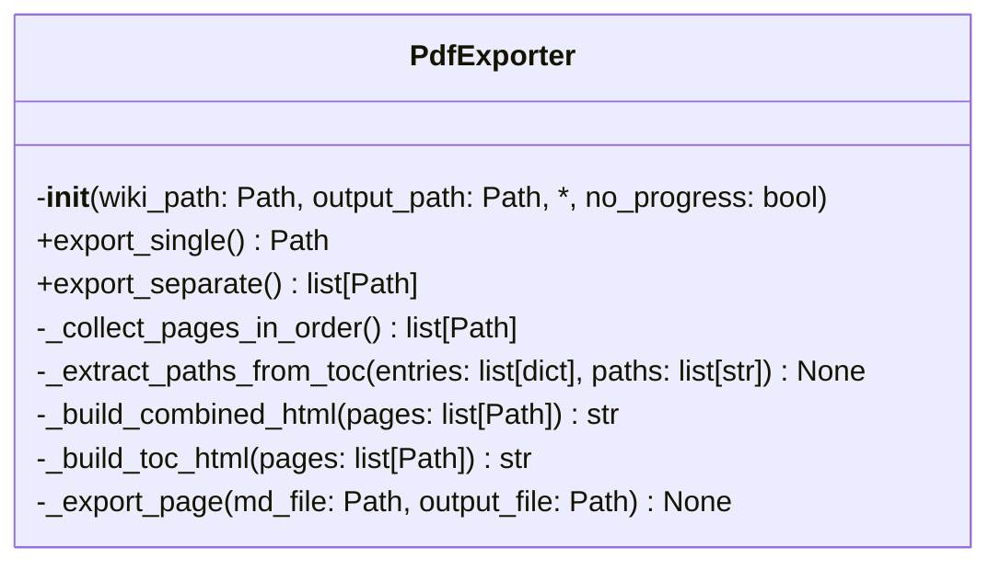

# File: `src/local_deepwiki/export/pdf_sync.py`

## File Overview

This file provides synchronous PDF export functionality for DeepWiki documentation. It serves as the primary interface for converting wiki content into PDF format, supporting both single-file and separate-file export modes. The implementation leverages the `weasyprint` library for HTML-to-PDF conversion and integrates with the project's CLI and logging systems.

The file contains:
- The `PdfExporter` class for managing export operations
- A convenience function `export_to_pdf` for simplified usage
- A CLI entry point `main` for command-line interaction

## Key Concepts

### PDF Export Abstractions
The `PdfExporter` class encapsulates the logic for exporting wiki content to PDF. It supports two modes:
1. **Single File Export**: Combines all pages into one PDF with a table of contents.
2. **Separate File Export**: Exports each page as an individual PDF.

This design choice enables flexibility for users who prefer a single comprehensive document or individual pages for easy reference.

### TOC-Driven Ordering
The exporter respects the table of contents (`toc.json`) to maintain page ordering during export. If a TOC is present, pages are collected in the specified order, with any additional files appended at the end. This ensures that exported documents reflect the intended structure of the wiki.

### HTML Generation and Styling
The HTML for each page is generated using a template (`PDF_HTML_TEMPLATE`) and styled with CSS (`PRINT_CSS`). Markdown content is rendered into HTML using [`_pdf_module.render_markdown_for_pdf`](pdf.md), and a title page with a table of contents is included in single-file exports.

### Progress Tracking
Progress bars are implemented using [`create_progress`](../cli_progress.md) from `local_deepwiki.cli_progress`. This provides visual feedback during long-running operations, improving user experience. The progress tracking is optional and can be disabled via the `no_progress` flag.

## Integration

### Within the Codebase
This file integrates with:
- `local_deepwiki.cli_progress`: For progress bar functionality
- `local_deepwiki.export.pdf`: For markdown rendering, HTML generation, and PDF writing
- `local_deepwiki.export.pdf_styles`: For HTML templates and CSS styling
- `local_deepwiki.logging`: For structured logging of export operations

### External Usage
The `PdfExporter` class and `export_to_pdf` function are used by:
- The CLI entry point (`main`) for command-line export
- Test functions (`test_pdf_generation`, `test_export_progress`) for verifying export behavior

The `export_to_pdf` function is also used by other modules within the project to programmatically trigger PDF exports.

## Design Notes

### Why `PdfExporter` as a Class
The `PdfExporter` class was chosen over a module-level function to encapsulate state (like `toc_entries`) and provide a clean interface for different export modes (`export_single`, `export_separate`). This supports reuse and testability.

### TOC Handling Strategy
The code explicitly checks for `toc.json` and uses its entries to order pages. Files not in the TOC are appended at the end. This allows for backward compatibility with wikis that may not have a structured table of contents.

### HTML Template and CSS
The `PDF_HTML_TEMPLATE` and `PRINT_CSS` are imported from `local_deepwiki.export.pdf_styles`. This separation of concerns ensures consistent styling and layout across different export modes.

### Error Handling
The CLI (`main`) uses a broad `except Exception` block to catch and report errors, ensuring that unexpected issues during export do not crash the program. This is intentional for CLI robustness.

### CLI Argument Parsing
The `main` function uses `argparse` to parse command-line arguments, supporting:
- A default path for the `.deepwiki` directory
- Output path specification
- Toggle for separate file export
- Option to disable progress bars

This design ensures the CLI is both user-friendly and extensible.

## API Reference

### class `PdfExporter`

Export wiki markdown to PDF format.  This is the synchronous [wrapper](../handlers/_error_handling.md) class that maintains backwards compatibility. For large wikis, use [StreamingPdfExporter](pdf.md) directly for async streaming export.

**Methods:**


<details>
<summary>View Source (lines 22-236) | <a href="https://github.com/UrbanDiver/local-deepwiki-mcp/blob/main/src/local_deepwiki/export/pdf_sync.py#L22-L236">GitHub</a></summary>

```python
class PdfExporter:
    # Methods: __init__, export_single, export_separate, _collect_pages_in_order, _extract_paths_from_toc, _build_combined_html, _build_toc_html, _export_page
```

</details>

#### `__init__`

```python
def __init__(wiki_path: Path, output_path: Path, no_progress: bool = False)
```

Initialize the exporter.


| Parameter | Type | Default | Description |
|-----------|------|---------|-------------|
| `wiki_path` | `Path` | - | Path to the .deepwiki directory. |
| `output_path` | `Path` | - | Output path for PDF file(s). |
| `no_progress` | `bool` | `False` | If True, disable progress bars. |


<details>
<summary>View Source (lines 29-46) | <a href="https://github.com/UrbanDiver/local-deepwiki-mcp/blob/main/src/local_deepwiki/export/pdf_sync.py#L29-L46">GitHub</a></summary>

```python
def __init__(
        self,
        wiki_path: Path,
        output_path: Path,
        *,
        no_progress: bool = False,
    ):
        """Initialize the exporter.

        Args:
            wiki_path: Path to the .deepwiki directory.
            output_path: Output path for PDF file(s).
            no_progress: If True, disable progress bars.
        """
        self.wiki_path = Path(wiki_path)
        self.output_path = Path(output_path)
        self.toc_entries: list[dict] = []
        self._no_progress = no_progress
```

</details>

#### `export_single`

```python
def export_single() -> Path
```

Export all wiki pages to a single PDF.


<details>
<summary>View Source (lines 48-87) | <a href="https://github.com/UrbanDiver/local-deepwiki-mcp/blob/main/src/local_deepwiki/export/pdf_sync.py#L48-L87">GitHub</a></summary>

```python
def export_single(self) -> Path:
        """Export all wiki pages to a single PDF.

        Returns:
            Path to the generated PDF file.
        """
        logger.info("Starting PDF export from %s", self.wiki_path)

        # Load TOC for ordering
        toc_path = self.wiki_path / "toc.json"
        if toc_path.exists():
            toc_data = json.loads(toc_path.read_text())
            self.toc_entries = toc_data.get("entries", [])
            logger.debug("Loaded %s TOC entries", len(self.toc_entries))

        # Collect all pages in TOC order
        pages = self._collect_pages_in_order()
        logger.info("Found %s pages to export", len(pages))

        # Build combined HTML with progress
        combined_html = self._build_combined_html(pages)

        # Generate PDF
        output_file = self.output_path
        if output_file.is_dir():
            output_file = output_file / "documentation.pdf"

        output_file.parent.mkdir(parents=True, exist_ok=True)

        with create_progress(disable=self._no_progress) as progress:
            task = progress.add_task("Generating PDF", total=1)
            progress.update(task, description="Writing PDF file")
            _pdf_module._require_weasyprint()
            html_doc = _pdf_module.HTML(string=combined_html)
            css = _pdf_module.CSS(string=PRINT_CSS)
            html_doc.write_pdf(output_file, stylesheets=[css])
            progress.update(task, advance=1)

        logger.info("Generated PDF: %s", output_file)
        return output_file
```

</details>

#### `export_separate`

```python
def export_separate() -> list[Path]
```

Export each wiki page as a separate PDF.


---


<details>
<summary>View Source (lines 89-120) | <a href="https://github.com/UrbanDiver/local-deepwiki-mcp/blob/main/src/local_deepwiki/export/pdf_sync.py#L89-L120">GitHub</a></summary>

```python
def export_separate(self) -> list[Path]:
        """Export each wiki page as a separate PDF.

        Returns:
            List of paths to generated PDF files.
        """
        logger.info("Starting separate PDF export from %s", self.wiki_path)

        output_dir = self.output_path
        if output_dir.suffix == ".pdf":
            output_dir = output_dir.parent / output_dir.stem

        output_dir.mkdir(parents=True, exist_ok=True)

        # Collect all markdown files
        md_files = sorted(self.wiki_path.rglob("*.md"))

        generated = []
        with create_progress(disable=self._no_progress) as progress:
            task = progress.add_task("Exporting PDFs", total=len(md_files))
            for md_file in md_files:
                rel_path = md_file.relative_to(self.wiki_path)
                progress.update(task, description=f"Exporting {rel_path.name}")
                output_file = output_dir / rel_path.with_suffix(".pdf")
                output_file.parent.mkdir(parents=True, exist_ok=True)

                self._export_page(md_file, output_file)
                generated.append(output_file)
                progress.update(task, advance=1)

        logger.info("Generated %s PDF files", len(generated))
        return generated
```

</details>

### Functions

#### `export_to_pdf`

```python
def export_to_pdf(wiki_path: Path | str, output_path: Path | str | None = None, single_file: bool = True, no_progress: bool = False) -> str
```

Export wiki to PDF format.


| Parameter | Type | Default | Description |
|-----------|------|---------|-------------|
| `wiki_path` | `Path | str` | - | Path to the .deepwiki directory. |
| `output_path` | `Path | str | None` | `None` | Output path (default: wiki.pdf or wiki_pdfs/). |
| `single_file` | `bool` | `True` | If True, combine all pages into one PDF. |
| `no_progress` | `bool` | `False` | If True, disable progress bars. |

**Returns:** `str`


<details>
<summary>View Source (lines 239-277) | <a href="https://github.com/UrbanDiver/local-deepwiki-mcp/blob/main/src/local_deepwiki/export/pdf_sync.py#L239-L277">GitHub</a></summary>

```python
def export_to_pdf(
    wiki_path: Path | str,
    output_path: Path | str | None = None,
    single_file: bool = True,
    *,
    no_progress: bool = False,
) -> str:
    """Export wiki to PDF format.

    Args:
        wiki_path: Path to the .deepwiki directory.
        output_path: Output path (default: wiki.pdf or wiki_pdfs/).
        single_file: If True, combine all pages into one PDF.
        no_progress: If True, disable progress bars.

    Returns:
        Success message with output path.
    """
    wiki_path = Path(wiki_path)

    if not wiki_path.exists():
        raise ValueError(f"Wiki path does not exist: {wiki_path}")

    if output_path is None:
        if single_file:
            output_path = wiki_path.parent / f"{wiki_path.stem}.pdf"
        else:
            output_path = wiki_path.parent / f"{wiki_path.stem}_pdfs"
    else:
        output_path = Path(output_path)

    exporter = PdfExporter(wiki_path, output_path, no_progress=no_progress)

    if single_file:
        result = exporter.export_single()
        return f"Exported wiki to PDF: {result}"
    else:
        results = exporter.export_separate()
        return f"Exported {len(results)} pages to PDFs in: {output_path}"
```

</details>

#### `main`

```python
def main() -> None
```

CLI entry point for PDF export.

**Returns:** `None`


<details>
<summary>View Source (lines 280-330) | <a href="https://github.com/UrbanDiver/local-deepwiki-mcp/blob/main/src/local_deepwiki/export/pdf_sync.py#L280-L330">GitHub</a></summary>

```python
def main() -> None:
    """CLI entry point for PDF export."""
    parser = argparse.ArgumentParser(
        description="Export DeepWiki documentation to PDF format"
    )
    parser.add_argument(
        "wiki_path",
        type=Path,
        nargs="?",
        default=Path(".deepwiki"),
        help="Path to the .deepwiki directory (default: .deepwiki)",
    )
    parser.add_argument(
        "-o",
        "--output",
        type=Path,
        default=None,
        help="Output path (default: wiki.pdf for single, wiki_pdfs/ for separate)",
    )
    parser.add_argument(
        "--separate",
        action="store_true",
        help="Export each page as a separate PDF instead of combining",
    )
    parser.add_argument(
        "--no-progress",
        action="store_true",
        help="Disable progress bars (for non-interactive use)",
    )

    args = parser.parse_args()

    if not args.wiki_path.exists():
        print(f"Error: Wiki path does not exist: {args.wiki_path}", file=sys.stderr)
        sys.exit(1)

    try:
        # Use _pdf_module.export_to_pdf so that mocking
        # local_deepwiki.export.pdf.export_to_pdf in tests works correctly.
        result = _pdf_module.export_to_pdf(
            wiki_path=args.wiki_path,
            output_path=args.output,
            single_file=not args.separate,
            no_progress=args.no_progress,
        )
        print(result)
        print("Open the PDF file to view the documentation.")
    except Exception as e:  # noqa: BLE001
        # Broad catch is intentional: CLI top-level error handler
        print(f"Error exporting to PDF: {e}", file=sys.stderr)
        sys.exit(1)
```

</details>

## Class Diagram



## Call Graph

```mermaid
flowchart TD
    N0[ArgumentParser]
    N1[CSS]
    N2[HTML]
    N3[Path]
    N4[PdfExporter]
    N5[PdfExporter._build_combined...]
    N6[PdfExporter._build_toc_html]
    N7[PdfExporter._collect_pages_...]
    N8[PdfExporter._export_page]
    N9[PdfExporter.export_separate]
    N10[PdfExporter.export_single]
    N11[ValueError]
    N12[_extract_paths_from_toc]
    N13[_require_weasyprint]
    N14[add_argument]
    N15[add_task]
    N16[create_progress]
    N17[exists]
    N18[export_separate]
    N19[export_single]
    N20[export_to_pdf]
    N21[extract_title]
    N22[main]
    N23[mkdir]
    N24[parse_args]
    N25[read_text]
    N26[relative_to]
    N27[render_markdown_for_pdf]
    N28[rglob]
    N29[write_pdf]
    N20 --> N3
    N20 --> N17
    N20 --> N11
    N20 --> N4
    N20 --> N19
    N20 --> N18
    N22 --> N0
    N22 --> N14
    N22 --> N3
    N22 --> N24
    N22 --> N17
    N22 --> N20
    N10 --> N17
    N10 --> N25
    N10 --> N23
    N10 --> N16
    N10 --> N15
    N10 --> N13
    N10 --> N2
    N10 --> N1
    N10 --> N29
    N9 --> N23
    N9 --> N28
    N9 --> N16
    N9 --> N15
    N9 --> N26
    N7 --> N12
    N7 --> N17
    N7 --> N28
    N5 --> N16
    N5 --> N15
    N5 --> N25
    N5 --> N27
    N6 --> N21
    N6 --> N26
    N8 --> N25
    N8 --> N27
    N8 --> N21
    N8 --> N13
    N8 --> N2
    N8 --> N1
    N8 --> N29
    classDef func fill:#e1f5fe
    class N0,N1,N2,N3,N4,N11,N12,N13,N14,N15,N16,N17,N18,N19,N20,N21,N22,N23,N24,N25,N26,N27,N28,N29 func
    classDef method fill:#fff3e0
    class N5,N6,N7,N8,N9,N10 method
```



## Used By

Functions and methods in this file and their callers:

- **`ArgumentParser`**: called by `main`
- **`CSS`**: called by `PdfExporter._export_page`, `PdfExporter.export_single`
- **`HTML`**: called by `PdfExporter._export_page`, `PdfExporter.export_single`
- **`Path`**: called by `PdfExporter.__init__`, `export_to_pdf`, `main`
- **`PdfExporter`**: called by `export_to_pdf`
- **`ValueError`**: called by `export_to_pdf`
- **`_build_combined_html`**: called by `PdfExporter.export_single`
- **`_build_toc_html`**: called by `PdfExporter._build_combined_html`
- **`_collect_pages_in_order`**: called by `PdfExporter.export_single`
- **`_export_page`**: called by `PdfExporter.export_separate`
- **`_extract_paths_from_toc`**: called by `PdfExporter._collect_pages_in_order`, `PdfExporter._extract_paths_from_toc`
- **`_require_weasyprint`**: called by `PdfExporter._export_page`, `PdfExporter.export_single`
- **`add_argument`**: called by `main`
- **`add_task`**: called by `PdfExporter._build_combined_html`, `PdfExporter.export_separate`, `PdfExporter.export_single`
- **[`create_progress`](../cli_progress.md)**: called by `PdfExporter._build_combined_html`, `PdfExporter.export_separate`, `PdfExporter.export_single`
- **`exists`**: called by `PdfExporter._collect_pages_in_order`, `PdfExporter.export_single`, `export_to_pdf`, `main`
- **`exit`**: called by `main`
- **`export_separate`**: called by `export_to_pdf`
- **`export_single`**: called by `export_to_pdf`
- **`export_to_pdf`**: called by `main`
- **[`extract_title`](shared.md)**: called by `PdfExporter._build_toc_html`, `PdfExporter._export_page`
- **`is_dir`**: called by `PdfExporter.export_single`
- **`loads`**: called by `PdfExporter.export_single`
- **`mkdir`**: called by `PdfExporter.export_separate`, `PdfExporter.export_single`
- **`parse_args`**: called by `main`
- **`read_text`**: called by `PdfExporter._build_combined_html`, `PdfExporter._export_page`, `PdfExporter.export_single`
- **`relative_to`**: called by `PdfExporter._build_toc_html`, `PdfExporter.export_separate`
- **[`render_markdown_for_pdf`](pdf.md)**: called by `PdfExporter._build_combined_html`, `PdfExporter._export_page`
- **`rglob`**: called by `PdfExporter._collect_pages_in_order`, `PdfExporter.export_separate`
- **`with_suffix`**: called by `PdfExporter.export_separate`
- **`write_pdf`**: called by `PdfExporter._export_page`, `PdfExporter.export_single`

## Last Modified

| Entity | Type | Author | Date | Commit |
|--------|------|--------|------|--------|
| `PdfExporter` | class | Brian Breidenbach | Feb 21, 2026 | `aad50cb` refactor: split 9 files (80... |
| `__init__` | method | Brian Breidenbach | Feb 21, 2026 | `aad50cb` refactor: split 9 files (80... |
| `export_single` | method | Brian Breidenbach | Feb 21, 2026 | `aad50cb` refactor: split 9 files (80... |
| `export_separate` | method | Brian Breidenbach | Feb 21, 2026 | `aad50cb` refactor: split 9 files (80... |
| `_collect_pages_in_order` | method | Brian Breidenbach | Feb 21, 2026 | `aad50cb` refactor: split 9 files (80... |
| `_extract_paths_from_toc` | method | Brian Breidenbach | Feb 21, 2026 | `aad50cb` refactor: split 9 files (80... |
| `_build_combined_html` | method | Brian Breidenbach | Feb 21, 2026 | `aad50cb` refactor: split 9 files (80... |
| `_build_toc_html` | method | Brian Breidenbach | Feb 21, 2026 | `aad50cb` refactor: split 9 files (80... |
| `_export_page` | method | Brian Breidenbach | Feb 21, 2026 | `aad50cb` refactor: split 9 files (80... |
| `export_to_pdf` | function | Brian Breidenbach | Feb 21, 2026 | `aad50cb` refactor: split 9 files (80... |
| `main` | function | Brian Breidenbach | Feb 21, 2026 | `aad50cb` refactor: split 9 files (80... |

## Additional Source Code

Source code for functions and methods not listed in the API Reference above.

#### `_collect_pages_in_order`

<details>
<summary>View Source (lines 122-144) | <a href="https://github.com/UrbanDiver/local-deepwiki-mcp/blob/main/src/local_deepwiki/export/pdf_sync.py#L122-L144">GitHub</a></summary>

```python
def _collect_pages_in_order(self) -> list[Path]:
        """Collect markdown files in TOC order.

        Returns:
            List of markdown file paths.
        """
        ordered_paths: list[str] = []
        self._extract_paths_from_toc(self.toc_entries, ordered_paths)

        # Convert to full paths
        pages = []
        for rel_path in ordered_paths:
            full_path = self.wiki_path / rel_path
            if full_path.exists():
                pages.append(full_path)

        # Add any files not in TOC
        all_files = set(self.wiki_path.rglob("*.md"))
        toc_files = set(pages)
        for f in sorted(all_files - toc_files):
            pages.append(f)

        return pages
```

</details>


#### `_extract_paths_from_toc`

<details>
<summary>View Source (lines 146-157) | <a href="https://github.com/UrbanDiver/local-deepwiki-mcp/blob/main/src/local_deepwiki/export/pdf_sync.py#L146-L157">GitHub</a></summary>

```python
def _extract_paths_from_toc(self, entries: list[dict], paths: list[str]) -> None:
        """Recursively extract paths from TOC entries.

        Args:
            entries: TOC entries.
            paths: List to append paths to.
        """
        for entry in entries:
            if "path" in entry and entry["path"]:  # Skip empty paths
                paths.append(entry["path"])
            if "children" in entry:
                self._extract_paths_from_toc(entry["children"], paths)
```

</details>


#### `_build_combined_html`

<details>
<summary>View Source (lines 159-194) | <a href="https://github.com/UrbanDiver/local-deepwiki-mcp/blob/main/src/local_deepwiki/export/pdf_sync.py#L159-L194">GitHub</a></summary>

```python
def _build_combined_html(self, pages: list[Path]) -> str:
        """Build combined HTML from all pages.

        Args:
            pages: List of markdown file paths.

        Returns:
            Combined HTML string.
        """
        parts = []

        # Add title page
        parts.append("<h1>Documentation</h1>")
        parts.append("<h2>Table of Contents</h2>")
        parts.append(self._build_toc_html(pages))
        parts.append('<div class="page-break"></div>')

        # Add each page with progress tracking
        with create_progress(disable=self._no_progress) as progress:
            task = progress.add_task("Processing pages", total=len(pages))
            for i, page in enumerate(pages):
                progress.update(task, description=f"Processing {page.name}")
                content = page.read_text()
                html_content = _pdf_module.render_markdown_for_pdf(content)
                parts.append(html_content)

                # Add page break between pages (except last)
                if i < len(pages) - 1:
                    parts.append('<div class="page-break"></div>')
                progress.update(task, advance=1)

        combined_content = "\n".join(parts)
        return PDF_HTML_TEMPLATE.format(
            title="Documentation",
            content=combined_content,
        )
```

</details>


#### `_build_toc_html`

<details>
<summary>View Source (lines 196-212) | <a href="https://github.com/UrbanDiver/local-deepwiki-mcp/blob/main/src/local_deepwiki/export/pdf_sync.py#L196-L212">GitHub</a></summary>

```python
def _build_toc_html(self, pages: list[Path]) -> str:
        """Build table of contents HTML.

        Args:
            pages: List of markdown file paths.

        Returns:
            HTML string for TOC.
        """
        parts = ['<div class="toc">']
        for page in pages:
            title = _pdf_module.extract_title(page)
            rel_path = page.relative_to(self.wiki_path)
            indent = "  " * (len(rel_path.parts) - 1)
            parts.append(f'<div class="toc-item">{indent}{title}</div>')
        parts.append("</div>")
        return "\n".join(parts)
```

</details>


#### `_export_page`

<details>
<summary>View Source (lines 215-236) | <a href="https://github.com/UrbanDiver/local-deepwiki-mcp/blob/main/src/local_deepwiki/export/pdf_sync.py#L215-L236">GitHub</a></summary>

```python
def _export_page(md_file: Path, output_file: Path) -> None:
        """Export a single page to PDF.

        Args:
            md_file: Path to markdown file.
            output_file: Output PDF path.
        """
        logger.debug("Exporting page: %s", md_file.name)

        content = md_file.read_text()
        html_content = _pdf_module.render_markdown_for_pdf(content)
        title = _pdf_module.extract_title(md_file)

        full_html = PDF_HTML_TEMPLATE.format(
            title=title,
            content=html_content,
        )

        _pdf_module._require_weasyprint()
        html_doc = _pdf_module.HTML(string=full_html)
        css = _pdf_module.CSS(string=PRINT_CSS)
        html_doc.write_pdf(output_file, stylesheets=[css])
```

</details>

## Relevant Source Files

- `src/local_deepwiki/export/pdf_sync.py:22-236`
