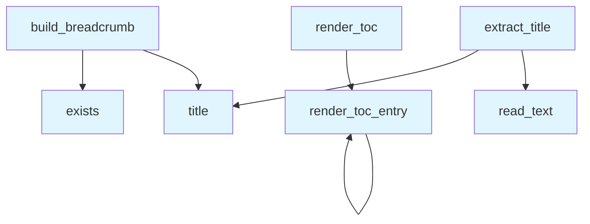

# File: `src/local_deepwiki/export/shared.py`

## File Overview

This file provides shared utility functions used across different export formats (e.g., HTML and PDF) in the `local_deepwiki` project. The purpose of this module is to reduce code duplication by centralizing common logic for extracting titles, rendering tables of contents (TOCs), and building breadcrumb navigation.

The functions defined here are used by exporters such as `html.py` and `pdf.py`, ensuring consistent behavior across different output formats without repeating the same logic.

## Key Concepts

### 1. **Title Extraction Logic**
The `extract_title` function implements a robust method for determining the title of a markdown file. It prioritizes:
- First `# heading` line
- First `**bold**` line

If neither is found, it defaults to a title derived from the filename, with underscores and hyphens replaced by spaces and title-cased.

**Why this approach?** This design allows for flexibility in how titles are specified in markdown files while maintaining backward compatibility with files that do not explicitly define a title.

### 2. **Recursive TOC Rendering**
The `render_toc_entry` and `render_toc` functions provide a recursive rendering mechanism for building nested table of contents entries in HTML format.

Each entry can have children, and the structure is recursively rendered. The function handles both linked entries (with paths) and grouping labels (without links).

**Why recursive rendering?** This approach supports deeply nested document structures and cleanly separates concerns between individual entries and their collective rendering.

### 3. **Breadcrumb Navigation Construction**
The `build_breadcrumb` function dynamically builds a breadcrumb trail based on the current file's relative path within the wiki. It intelligently determines whether to link to an `index.md` file in intermediate directories.

**Why dynamic breadcrumb construction?** This enables accurate navigation paths that reflect the actual directory structure of the wiki, supporting user-friendly navigation in exported content.

## Integration

This module integrates with the broader `local_deepwiki` codebase by being imported and used by various export-related modules, including:
- `html.py`
- `pdf.py`
- Test files like `test_export_shared.py`

It also relies on:
- `pathlib.Path` for path manipulation
- [`local_deepwiki.logging.get_logger`](../logging.md) for logging debug messages

The functions defined here are called by multiple exporters, which ensures consistency in how titles, TOCs, and breadcrumbs are handled across formats.

## Design Notes

### 1. **Error Handling**
The `extract_title` function gracefully handles `OSError` and `UnicodeDecodeError`, logging a debug message instead of crashing. This ensures robustness when dealing with corrupted or inaccessible files.

### 2. **Path Handling**
In `build_breadcrumb`, the logic checks for `index.md` files in intermediate directories to determine whether to create a link or a static label. This reflects the typical structure of wikis where directories may contain an `index.md` to act as a landing page.

### 3. **HTML Output Consistency**
All HTML rendering functions (`render_toc_entry`, `render_toc`, `build_breadcrumb`) generate consistent class names and structure, which allows for easy styling and integration with CSS frameworks or templates.

### 4. **Fallback Behavior**
When a title cannot be extracted from a file, the function falls back to deriving it from the filename stem. This ensures that all pages have a title, even if it's not explicitly defined in the markdown.

### 5. **Recursive TOC Depth**
The TOC rendering uses recursion to support arbitrary nesting levels. This is a clean and scalable solution, though it does not impose limits on nesting depth — which could be a concern in very deeply nested wikis.

## API Reference

### Functions

#### `extract_title`

```python
def extract_title(md_file: Path) -> str
```

Extract title from a markdown file.  Reads the file looking for the first ``# heading`` or ``**bold**`` line. Falls back to a title derived from the filename.


| Parameter | Type | Default | Description |
|-----------|------|---------|-------------|
| `md_file` | `Path` | - | Path to the markdown file. |

**Returns:** `str`


<details>
<summary>View Source (lines 17-41) | <a href="https://github.com/UrbanDiver/local-deepwiki-mcp/blob/main/src/local_deepwiki/export/shared.py#L17-L41">GitHub</a></summary>

```python
def extract_title(md_file: Path) -> str:
    """Extract title from a markdown file.

    Reads the file looking for the first ``# heading`` or ``**bold**`` line.
    Falls back to a title derived from the filename.

    Args:
        md_file: Path to the markdown file.

    Returns:
        Extracted title string.
    """
    try:
        content = md_file.read_text()
        for line in content.split("\n"):
            line = line.strip()
            if line.startswith("# "):
                return line[2:].strip()
            if line.startswith("**") and line.endswith("**"):
                return line[2:-2].strip()
    except (OSError, UnicodeDecodeError) as e:
        # OSError: File access issues
        # UnicodeDecodeError: File encoding issues
        logger.debug("Could not extract title from %s: %s", md_file, e)
    return md_file.stem.replace("_", " ").replace("-", " ").title()
```

</details>

#### `render_toc_entry`

```python
def render_toc_entry(entry: dict[str, Any], current_path: str, root_path: str) -> str
```

Render a single TOC entry recursively as HTML.


| Parameter | Type | Default | Description |
|-----------|------|---------|-------------|
| `entry` | `dict[str, Any]` | - | TOC entry dict with number, title, path, children. |
| `current_path` | `str` | - | Current page path for highlighting the active link. |
| `root_path` | `str` | - | Relative path to root (e.g. ``"../"``). |

**Returns:** `str`


<details>
<summary>View Source (lines 44-82) | <a href="https://github.com/UrbanDiver/local-deepwiki-mcp/blob/main/src/local_deepwiki/export/shared.py#L44-L82">GitHub</a></summary>

```python
def render_toc_entry(entry: dict[str, Any], current_path: str, root_path: str) -> str:
    """Render a single TOC entry recursively as HTML.

    Args:
        entry: TOC entry dict with number, title, path, children.
        current_path: Current page path for highlighting the active link.
        root_path: Relative path to root (e.g. ``"../"``).

    Returns:
        HTML string for this entry and its children.
    """
    has_children = bool(entry.get("children"))
    parent_class = "toc-parent" if has_children else ""

    html = f'<div class="toc-item {parent_class}">'

    if entry.get("path"):
        # Convert .md to .html for static export
        html_path = entry["path"].replace(".md", ".html")
        active = "active" if entry["path"] == current_path else ""
        html += f"""<a href="{root_path}{html_path}" class="{active}">
                <span class="toc-number">{entry.get("number", "")}</span>
                <span>{entry.get("title", "")}</span>
            </a>"""
    else:
        # No link, just a grouping label
        html += f"""<span class="toc-parent">
                <span class="toc-number">{entry.get("number", "")}</span>
                <span>{entry.get("title", "")}</span>
            </span>"""

    if has_children:
        html += '<div class="toc-nested">'
        for child in entry["children"]:
            html += render_toc_entry(child, current_path, root_path)
        html += "</div>"

    html += "</div>"
    return html
```

</details>

#### `render_toc`

```python
def render_toc(entries: list[dict[str, Any]], current_path: str, root_path: str) -> str
```

Render a list of TOC entries as HTML.


| Parameter | Type | Default | Description |
|-----------|------|---------|-------------|
| `entries` | `list[dict[str, Any]]` | - | List of TOC entry dicts. |
| `current_path` | `str` | - | Current page path for highlighting the active link. |
| `root_path` | `str` | - | Relative path to root (e.g. ``"../"``). |

**Returns:** `str`


<details>
<summary>View Source (lines 85-99) | <a href="https://github.com/UrbanDiver/local-deepwiki-mcp/blob/main/src/local_deepwiki/export/shared.py#L85-L99">GitHub</a></summary>

```python
def render_toc(entries: list[dict[str, Any]], current_path: str, root_path: str) -> str:
    """Render a list of TOC entries as HTML.

    Args:
        entries: List of TOC entry dicts.
        current_path: Current page path for highlighting the active link.
        root_path: Relative path to root (e.g. ``"../"``).

    Returns:
        Combined HTML string for all entries.
    """
    html_parts = []
    for entry in entries:
        html_parts.append(render_toc_entry(entry, current_path, root_path))
    return "\n".join(html_parts)
```

</details>

#### `build_breadcrumb`

```python
def build_breadcrumb(rel_path: Path, root_path: str, wiki_path: Path) -> str
```

Build breadcrumb navigation HTML.


| Parameter | Type | Default | Description |
|-----------|------|---------|-------------|
| `rel_path` | `Path` | - | Relative path of the current page within the wiki. |
| `root_path` | `str` | - | Relative path to root (e.g. ``"../"``). |
| `wiki_path` | `Path` | - | Absolute path to the wiki directory (used to check for ``index.md`` files in intermediate directories). |

**Returns:** `str`


<details>
<summary>View Source (lines 102-156) | <a href="https://github.com/UrbanDiver/local-deepwiki-mcp/blob/main/src/local_deepwiki/export/shared.py#L102-L156">GitHub</a></summary>

```python
def build_breadcrumb(rel_path: Path, root_path: str, wiki_path: Path) -> str:
    """Build breadcrumb navigation HTML.

    Args:
        rel_path: Relative path of the current page within the wiki.
        root_path: Relative path to root (e.g. ``"../"``).
        wiki_path: Absolute path to the wiki directory (used to check
                   for ``index.md`` files in intermediate directories).

    Returns:
        HTML string for the breadcrumb, or empty string for root pages.
    """
    parts = list(rel_path.parts)

    # Root pages don't need breadcrumbs
    if len(parts) == 1:
        return ""

    breadcrumb_items = []

    # Always start with Home
    breadcrumb_items.append(f'<a href="{root_path}index.html">Home</a>')

    # Build path progressively
    cumulative_path = ""
    for part in parts[:-1]:  # Exclude current page
        if cumulative_path:
            cumulative_path = f"{cumulative_path}/{part}"
        else:
            cumulative_path = part

        # Check if there's an index.md in this folder
        index_path = wiki_path / cumulative_path / "index.md"
        display_name = part.replace("_", " ").replace("-", " ").title()

        if index_path.exists():
            link_path = f"{cumulative_path}/index.html"
            breadcrumb_items.append(
                f'<a href="{root_path}{link_path}">{display_name}</a>'
            )
        else:
            breadcrumb_items.append(f"<span>{display_name}</span>")

    # Add current page name
    current_page = parts[-1]
    if current_page.endswith(".md"):
        current_page = current_page[:-3]
    current_page = current_page.replace("_", " ").replace("-", " ").title()
    breadcrumb_items.append(f'<span class="current">{current_page}</span>')

    return (
        '<div class="breadcrumb">'
        + ' <span class="separator">&rsaquo;</span> '.join(breadcrumb_items)
        + "</div>"
    )
```

</details>

## Call Graph



## Used By

Functions and methods in this file and their callers:

- **`exists`**: called by `build_breadcrumb`
- **`read_text`**: called by `extract_title`
- **`render_toc_entry`**: called by `render_toc`, `render_toc_entry`
- **`title`**: called by `build_breadcrumb`, `extract_title`

## Last Modified

| Entity | Type | Author | Date | Commit |
|--------|------|--------|------|--------|
| `extract_title` | function | Brian Breidenbach | Feb 11, 2026 | `ba96da1` fix: publication plan P0-P2... |
| `render_toc_entry` | function | Brian Breidenbach | Feb 09, 2026 | `2130136` refactor: Extract duplicate... |
| `render_toc` | function | Brian Breidenbach | Feb 09, 2026 | `2130136` refactor: Extract duplicate... |
| `build_breadcrumb` | function | Brian Breidenbach | Feb 09, 2026 | `2130136` refactor: Extract duplicate... |

## Relevant Source Files

- `src/local_deepwiki/export/shared.py:17-41`
