# File: `src/local_deepwiki/export/streaming.py`

## File Overview

This file provides the foundational abstractions for memory-efficient streaming exports of wiki content. It defines core data structures, utilities, and an abstract base class for implementing streaming exporters. The module enables processing large wikis without loading all pages into memory simultaneously, which is essential for performance and scalability.

The design rationale centers on lazy loading and iterative processing, allowing exporters to handle wikis of any size by yielding pages one at a time or in small batches. This approach is particularly important when dealing with large wikis that might otherwise cause memory exhaustion.

## Key Concepts

### 1. **Lazy Loading of Page Content**
The `WikiPage` class implements lazy loading for content, meaning that the full text of a page is only read from disk when the `content` property is accessed. This minimizes memory usage during iteration over many pages.

### 2. **Streaming Export Strategy**
The `StreamingExporter` abstract base class defines a contract for exporters that process pages iteratively. This supports memory-efficient handling of large wikis by avoiding the need to load all content into memory at once.

### 3. **Wiki Page Iterator with TOC Ordering**
The `WikiPageIterator` class provides an asynchronous iterator over wiki pages, supporting optional ordering based on a table of contents (TOC). It also includes logic to determine whether streaming mode should be enabled based on wiki size.

### 4. **Configuration and Memory Management**
The `ExportConfig` class encapsulates settings that control how streaming is enabled and how batches are processed, including `batch_size`, `memory_limit_mb`, and `enable_streaming`.

### 5. **Metadata-Only Page Representation**
The `WikiPageMetadata` class holds lightweight information about a page, such as path, title, and file size, without including the full content. This allows for efficient iteration and metadata-based decisions.

## Integration

This module is a core part of the export system and is used by various CLI tools and services that need to generate outputs like HTML or PDF from wiki content. It's imported and utilized by:

- `WikiPage`: used by `lazy_cache`, `search`, `source_refs`, and four other modules
- `ExportResult`: used by `models`, `wiki_service`
- `StreamingExporter`: used by `html`, `pdf` exporters

The file integrates with the broader project through:
- `local_deepwiki.logging` for logging debug and warning messages
- `pydantic` for configuration validation
- `pathlib.Path` for filesystem operations
- `AsyncIterator` and `Callable` for async processing and callbacks

This design allows the system to scale from small wikis to large ones by leveraging streaming techniques and memory-conscious programming practices.

## Design Notes

### Memory Efficiency
The core design choice to use lazy loading (`WikiPage.content`) and streaming iteration (`WikiPageIterator.__aiter__`) allows the system to scale to large wikis. This avoids the memory overhead of loading all pages into memory at once.

### TOC Support
The `WikiPageIterator` supports optional TOC ordering, which ensures pages are processed in a user-defined order. If no TOC is present, pages are iterated in alphabetical order, providing a sensible fallback.

### Streaming Decision Logic
The `should_use_streaming` method determines whether to enable streaming based on two criteria:
1. Total wiki size exceeding `memory_limit_mb`
2. Number of pages exceeding 100

This heuristic balances performance and memory usage, enabling streaming for large wikis or wikis with many pages.

### Title Extraction
The `_extract_title` method efficiently reads only the beginning of a markdown file to extract the title, avoiding full content loading. It supports both `# Title` and `**Title**` formats, falling back to a cleaned filename if no title is found.

### Extensibility
The `StreamingExporter` is an abstract base class, allowing concrete implementations (e.g., for HTML or PDF export) to define their own export logic while reusing common utilities like TOC loading and page iteration. This promotes code reuse and modularity.

### Error Handling
The module includes graceful handling of file system errors, such as:
- `OSError` when reading files
- `UnicodeDecodeError` for malformed files
- `json.JSONDecodeError` when parsing TOC

These errors are logged but do not crash the export process, ensuring robustness in real-world usage.

## API Reference

### class `ExportConfig`

**Inherits from:** `BaseModel`

Configuration for streaming export operations.


<details>
<summary>View Source (lines 22-42) | <a href="https://github.com/UrbanDiver/local-deepwiki-mcp/blob/main/src/local_deepwiki/export/streaming.py#L22-L42">GitHub</a></summary>

```python
class ExportConfig(BaseModel):
    """Configuration for streaming export operations."""

    model_config = {"frozen": True}

    batch_size: int = Field(
        default=50,
        ge=1,
        le=500,
        description="Pages per batch for PDF generation",
    )
    memory_limit_mb: int = Field(
        default=500,
        ge=100,
        le=4096,
        description="Memory threshold to trigger streaming mode (MB)",
    )
    enable_streaming: bool = Field(
        default=True,
        description="Enable streaming mode for large wikis",
    )
```

</details>

### class `WikiPageMetadata`

Lightweight metadata for a wiki page without full content.


<details>
<summary>View Source (lines 46-52) | <a href="https://github.com/UrbanDiver/local-deepwiki-mcp/blob/main/src/local_deepwiki/export/streaming.py#L46-L52">GitHub</a></summary>

```python
class WikiPageMetadata:
    """Lightweight metadata for a wiki page without full content."""

    path: str
    title: str
    file_size: int
    relative_path: Path
```

</details>

### class `WikiPage`

A wiki page with content loaded on demand.

**Methods:**


<details>
<summary>View Source (lines 56-84) | <a href="https://github.com/UrbanDiver/local-deepwiki-mcp/blob/main/src/local_deepwiki/export/streaming.py#L56-L84">GitHub</a></summary>

```python
class WikiPage:
    """A wiki page with content loaded on demand."""

    metadata: WikiPageMetadata
    _content: str | None = field(default=None, repr=False)
    _full_path: Path | None = field(default=None, repr=False)

    @property
    def path(self) -> str:
        """Return the relative path of the page."""
        return self.metadata.path

    @property
    def title(self) -> str:
        """Return the title of the page."""
        return self.metadata.title

    @property
    def content(self) -> str:
        """Return the content of the page, loading from disk if needed."""
        if self._content is None:
            if self._full_path is None:
                raise ValueError("Cannot load content: full_path not set")
            self._content = self._full_path.read_text()
        return self._content

    def release_content(self) -> None:
        """Release the content from memory."""
        self._content = None
```

</details>

#### `path`

```python
def path() -> str
```

Return the relative path of the page.


<details>
<summary>View Source (lines 56-84) | <a href="https://github.com/UrbanDiver/local-deepwiki-mcp/blob/main/src/local_deepwiki/export/streaming.py#L56-L84">GitHub</a></summary>

```python
class WikiPage:
    """A wiki page with content loaded on demand."""

    metadata: WikiPageMetadata
    _content: str | None = field(default=None, repr=False)
    _full_path: Path | None = field(default=None, repr=False)

    @property
    def path(self) -> str:
        """Return the relative path of the page."""
        return self.metadata.path

    @property
    def title(self) -> str:
        """Return the title of the page."""
        return self.metadata.title

    @property
    def content(self) -> str:
        """Return the content of the page, loading from disk if needed."""
        if self._content is None:
            if self._full_path is None:
                raise ValueError("Cannot load content: full_path not set")
            self._content = self._full_path.read_text()
        return self._content

    def release_content(self) -> None:
        """Release the content from memory."""
        self._content = None
```

</details>

#### `title`

```python
def title() -> str
```

Return the title of the page.


<details>
<summary>View Source (lines 56-84) | <a href="https://github.com/UrbanDiver/local-deepwiki-mcp/blob/main/src/local_deepwiki/export/streaming.py#L56-L84">GitHub</a></summary>

```python
class WikiPage:
    """A wiki page with content loaded on demand."""

    metadata: WikiPageMetadata
    _content: str | None = field(default=None, repr=False)
    _full_path: Path | None = field(default=None, repr=False)

    @property
    def path(self) -> str:
        """Return the relative path of the page."""
        return self.metadata.path

    @property
    def title(self) -> str:
        """Return the title of the page."""
        return self.metadata.title

    @property
    def content(self) -> str:
        """Return the content of the page, loading from disk if needed."""
        if self._content is None:
            if self._full_path is None:
                raise ValueError("Cannot load content: full_path not set")
            self._content = self._full_path.read_text()
        return self._content

    def release_content(self) -> None:
        """Release the content from memory."""
        self._content = None
```

</details>

#### `content`

```python
def content() -> str
```

Return the content of the page, loading from disk if needed.


<details>
<summary>View Source (lines 56-84) | <a href="https://github.com/UrbanDiver/local-deepwiki-mcp/blob/main/src/local_deepwiki/export/streaming.py#L56-L84">GitHub</a></summary>

```python
class WikiPage:
    """A wiki page with content loaded on demand."""

    metadata: WikiPageMetadata
    _content: str | None = field(default=None, repr=False)
    _full_path: Path | None = field(default=None, repr=False)

    @property
    def path(self) -> str:
        """Return the relative path of the page."""
        return self.metadata.path

    @property
    def title(self) -> str:
        """Return the title of the page."""
        return self.metadata.title

    @property
    def content(self) -> str:
        """Return the content of the page, loading from disk if needed."""
        if self._content is None:
            if self._full_path is None:
                raise ValueError("Cannot load content: full_path not set")
            self._content = self._full_path.read_text()
        return self._content

    def release_content(self) -> None:
        """Release the content from memory."""
        self._content = None
```

</details>

#### `release_content`

```python
def release_content() -> None
```

Release the content from memory.


<details>
<summary>View Source (lines 56-84) | <a href="https://github.com/UrbanDiver/local-deepwiki-mcp/blob/main/src/local_deepwiki/export/streaming.py#L56-L84">GitHub</a></summary>

```python
class WikiPage:
    """A wiki page with content loaded on demand."""

    metadata: WikiPageMetadata
    _content: str | None = field(default=None, repr=False)
    _full_path: Path | None = field(default=None, repr=False)

    @property
    def path(self) -> str:
        """Return the relative path of the page."""
        return self.metadata.path

    @property
    def title(self) -> str:
        """Return the title of the page."""
        return self.metadata.title

    @property
    def content(self) -> str:
        """Return the content of the page, loading from disk if needed."""
        if self._content is None:
            if self._full_path is None:
                raise ValueError("Cannot load content: full_path not set")
            self._content = self._full_path.read_text()
        return self._content

    def release_content(self) -> None:
        """Release the content from memory."""
        self._content = None
```

</details>

### class `ExportResult`

Result of an export operation.


<details>
<summary>View Source (lines 88-102) | <a href="https://github.com/UrbanDiver/local-deepwiki-mcp/blob/main/src/local_deepwiki/export/streaming.py#L88-L102">GitHub</a></summary>

```python
class ExportResult:
    """Result of an export operation."""

    pages_exported: int
    output_path: Path
    duration_ms: int
    peak_memory_mb: float = 0.0
    errors: list[str] = field(default_factory=list)

    def __str__(self) -> str:
        """Return a human-readable summary."""
        return (
            f"Exported {self.pages_exported} pages to {self.output_path} "
            f"in {self.duration_ms}ms"
        )
```

</details>

### class `WikiPageIterator`

Memory-efficient iterator over wiki pages.  Yields pages one at a time, loading content only when accessed. Supports counting pages without loading content.

**Methods:**


<details>
<summary>View Source (lines 109-229) | <a href="https://github.com/UrbanDiver/local-deepwiki-mcp/blob/main/src/local_deepwiki/export/streaming.py#L109-L229">GitHub</a></summary>

```python
class WikiPageIterator:
    # Methods: __init__, get_page_count, get_total_size_bytes, should_use_streaming, _scan_pages, _get_ordered_paths, __aiter__, _extract_title
```

</details>

#### `__init__`

```python
def __init__(wiki_path: Path, toc_order: list[str] | None = None)
```

Initialize the iterator.


| Parameter | Type | Default | Description |
|-----------|------|---------|-------------|
| `wiki_path` | `Path` | - | Path to the .deepwiki directory. |
| `toc_order` | `list[str] | None` | `None` | Optional list of page paths in TOC order. If not provided, pages are iterated in alphabetical order. |


<details>
<summary>View Source (lines 116-127) | <a href="https://github.com/UrbanDiver/local-deepwiki-mcp/blob/main/src/local_deepwiki/export/streaming.py#L116-L127">GitHub</a></summary>

```python
def __init__(self, wiki_path: Path, toc_order: list[str] | None = None):
        """Initialize the iterator.

        Args:
            wiki_path: Path to the .deepwiki directory.
            toc_order: Optional list of page paths in TOC order.
                       If not provided, pages are iterated in alphabetical order.
        """
        self.wiki_path = wiki_path
        self._toc_order = toc_order
        self._page_count: int | None = None
        self._total_size: int = 0
```

</details>

#### `get_page_count`

```python
def get_page_count() -> int
```

Return total page count without loading content.


<details>
<summary>View Source (lines 129-133) | <a href="https://github.com/UrbanDiver/local-deepwiki-mcp/blob/main/src/local_deepwiki/export/streaming.py#L129-L133">GitHub</a></summary>

```python
def get_page_count(self) -> int:
        """Return total page count without loading content."""
        if self._page_count is None:
            self._scan_pages()
        return self._page_count or 0
```

</details>

#### `get_total_size_bytes`

```python
def get_total_size_bytes() -> int
```

Return total size of all pages in bytes.


<details>
<summary>View Source (lines 135-139) | <a href="https://github.com/UrbanDiver/local-deepwiki-mcp/blob/main/src/local_deepwiki/export/streaming.py#L135-L139">GitHub</a></summary>

```python
def get_total_size_bytes(self) -> int:
        """Return total size of all pages in bytes."""
        if self._page_count is None:
            self._scan_pages()
        return self._total_size
```

</details>

#### `should_use_streaming`

```python
def should_use_streaming(memory_limit_mb: int = 500) -> bool
```

Determine if streaming mode should be used based on wiki size.


| Parameter | Type | Default | Description |
|-----------|------|---------|-------------|
| `memory_limit_mb` | `int` | `500` | Memory threshold in megabytes. |


<details>
<summary>View Source (lines 141-153) | <a href="https://github.com/UrbanDiver/local-deepwiki-mcp/blob/main/src/local_deepwiki/export/streaming.py#L141-L153">GitHub</a></summary>

```python
def should_use_streaming(self, memory_limit_mb: int = 500) -> bool:
        """Determine if streaming mode should be used based on wiki size.

        Args:
            memory_limit_mb: Memory threshold in megabytes.

        Returns:
            True if wiki size exceeds threshold and streaming is recommended.
        """
        total_mb = self.get_total_size_bytes() / (1024 * 1024)
        # Use streaming if wiki is larger than threshold
        # or if there are many pages (>100)
        return total_mb > memory_limit_mb or self.get_page_count() > 100
```

</details>

### class `StreamingExporter`

**Inherits from:** `ABC`

Abstract base class for streaming wiki exporters.  Subclasses implement memory-efficient export by processing pages one at a time or in small batches.

**Methods:**


<details>
<summary>View Source (lines 232-314) | <a href="https://github.com/UrbanDiver/local-deepwiki-mcp/blob/main/src/local_deepwiki/export/streaming.py#L232-L314">GitHub</a></summary>

```python
class StreamingExporter(ABC):
    """Abstract base class for streaming wiki exporters.

    Subclasses implement memory-efficient export by processing pages
    one at a time or in small batches.
    """

    def __init__(
        self,
        wiki_path: Path,
        output_path: Path,
        config: ExportConfig | None = None,
    ):
        """Initialize the streaming exporter.

        Args:
            wiki_path: Path to the .deepwiki directory.
            output_path: Output path for exported content.
            config: Export configuration. Uses defaults if not provided.
        """
        self.wiki_path = Path(wiki_path)
        self.output_path = Path(output_path)
        self.config = config or ExportConfig()
        self._toc_entries: list[dict[str, Any]] = []

    def load_toc(self) -> list[str]:
        """Load and parse table of contents, returning ordered page paths.

        Returns:
            List of page paths in TOC order.
        """
        import json

        toc_path = self.wiki_path / "toc.json"
        if not toc_path.exists():
            return []

        try:
            toc_data = json.loads(toc_path.read_text())
            self._toc_entries = toc_data.get("entries", [])
            paths: list[str] = []
            self._extract_paths_from_toc(self._toc_entries, paths)
            logger.debug("Loaded %s paths from TOC", len(paths))
            return paths
        except (json.JSONDecodeError, OSError) as e:
            logger.warning("Could not load TOC: %s", e)
            return []

    def _extract_paths_from_toc(
        self, entries: list[dict[str, Any]], paths: list[str]
    ) -> None:
        """Recursively extract paths from TOC entries."""
        for entry in entries:
            path = entry.get("path", "")
            if path:  # Skip empty paths
                paths.append(path)
            if "children" in entry:
                self._extract_paths_from_toc(entry["children"], paths)

    def get_page_iterator(self) -> WikiPageIterator:
        """Get an iterator over wiki pages in TOC order."""
        toc_order = self.load_toc()
        return WikiPageIterator(self.wiki_path, toc_order)

    @abstractmethod
    async def export(
        self, progress_callback: ProgressCallback | None = None
    ) -> ExportResult:
        """Export wiki with streaming.

        Args:
            progress_callback: Optional callback for progress updates.

        Returns:
            ExportResult with export statistics.
        """
        ...

    async def iter_pages(self) -> AsyncIterator[WikiPage]:
        """Iterate over wiki pages without loading all into memory."""
        iterator = self.get_page_iterator()
        async for page in iterator:
            yield page
```

</details>

#### `__init__`

```python
def __init__(wiki_path: Path, output_path: Path, config: ExportConfig | None = None)
```

Initialize the streaming exporter.


| Parameter | Type | Default | Description |
|-----------|------|---------|-------------|
| `wiki_path` | `Path` | - | Path to the .deepwiki directory. |
| `output_path` | `Path` | - | Output path for exported content. |
| `config` | `ExportConfig | None` | `None` | Export configuration. Uses defaults if not provided. |


<details>
<summary>View Source (lines 232-314) | <a href="https://github.com/UrbanDiver/local-deepwiki-mcp/blob/main/src/local_deepwiki/export/streaming.py#L232-L314">GitHub</a></summary>

```python
class StreamingExporter(ABC):
    """Abstract base class for streaming wiki exporters.

    Subclasses implement memory-efficient export by processing pages
    one at a time or in small batches.
    """

    def __init__(
        self,
        wiki_path: Path,
        output_path: Path,
        config: ExportConfig | None = None,
    ):
        """Initialize the streaming exporter.

        Args:
            wiki_path: Path to the .deepwiki directory.
            output_path: Output path for exported content.
            config: Export configuration. Uses defaults if not provided.
        """
        self.wiki_path = Path(wiki_path)
        self.output_path = Path(output_path)
        self.config = config or ExportConfig()
        self._toc_entries: list[dict[str, Any]] = []

    def load_toc(self) -> list[str]:
        """Load and parse table of contents, returning ordered page paths.

        Returns:
            List of page paths in TOC order.
        """
        import json

        toc_path = self.wiki_path / "toc.json"
        if not toc_path.exists():
            return []

        try:
            toc_data = json.loads(toc_path.read_text())
            self._toc_entries = toc_data.get("entries", [])
            paths: list[str] = []
            self._extract_paths_from_toc(self._toc_entries, paths)
            logger.debug("Loaded %s paths from TOC", len(paths))
            return paths
        except (json.JSONDecodeError, OSError) as e:
            logger.warning("Could not load TOC: %s", e)
            return []

    def _extract_paths_from_toc(
        self, entries: list[dict[str, Any]], paths: list[str]
    ) -> None:
        """Recursively extract paths from TOC entries."""
        for entry in entries:
            path = entry.get("path", "")
            if path:  # Skip empty paths
                paths.append(path)
            if "children" in entry:
                self._extract_paths_from_toc(entry["children"], paths)

    def get_page_iterator(self) -> WikiPageIterator:
        """Get an iterator over wiki pages in TOC order."""
        toc_order = self.load_toc()
        return WikiPageIterator(self.wiki_path, toc_order)

    @abstractmethod
    async def export(
        self, progress_callback: ProgressCallback | None = None
    ) -> ExportResult:
        """Export wiki with streaming.

        Args:
            progress_callback: Optional callback for progress updates.

        Returns:
            ExportResult with export statistics.
        """
        ...

    async def iter_pages(self) -> AsyncIterator[WikiPage]:
        """Iterate over wiki pages without loading all into memory."""
        iterator = self.get_page_iterator()
        async for page in iterator:
            yield page
```

</details>

#### `load_toc`

```python
def load_toc() -> list[str]
```

Load and parse table of contents, returning ordered page paths.


<details>
<summary>View Source (lines 232-314) | <a href="https://github.com/UrbanDiver/local-deepwiki-mcp/blob/main/src/local_deepwiki/export/streaming.py#L232-L314">GitHub</a></summary>

```python
class StreamingExporter(ABC):
    """Abstract base class for streaming wiki exporters.

    Subclasses implement memory-efficient export by processing pages
    one at a time or in small batches.
    """

    def __init__(
        self,
        wiki_path: Path,
        output_path: Path,
        config: ExportConfig | None = None,
    ):
        """Initialize the streaming exporter.

        Args:
            wiki_path: Path to the .deepwiki directory.
            output_path: Output path for exported content.
            config: Export configuration. Uses defaults if not provided.
        """
        self.wiki_path = Path(wiki_path)
        self.output_path = Path(output_path)
        self.config = config or ExportConfig()
        self._toc_entries: list[dict[str, Any]] = []

    def load_toc(self) -> list[str]:
        """Load and parse table of contents, returning ordered page paths.

        Returns:
            List of page paths in TOC order.
        """
        import json

        toc_path = self.wiki_path / "toc.json"
        if not toc_path.exists():
            return []

        try:
            toc_data = json.loads(toc_path.read_text())
            self._toc_entries = toc_data.get("entries", [])
            paths: list[str] = []
            self._extract_paths_from_toc(self._toc_entries, paths)
            logger.debug("Loaded %s paths from TOC", len(paths))
            return paths
        except (json.JSONDecodeError, OSError) as e:
            logger.warning("Could not load TOC: %s", e)
            return []

    def _extract_paths_from_toc(
        self, entries: list[dict[str, Any]], paths: list[str]
    ) -> None:
        """Recursively extract paths from TOC entries."""
        for entry in entries:
            path = entry.get("path", "")
            if path:  # Skip empty paths
                paths.append(path)
            if "children" in entry:
                self._extract_paths_from_toc(entry["children"], paths)

    def get_page_iterator(self) -> WikiPageIterator:
        """Get an iterator over wiki pages in TOC order."""
        toc_order = self.load_toc()
        return WikiPageIterator(self.wiki_path, toc_order)

    @abstractmethod
    async def export(
        self, progress_callback: ProgressCallback | None = None
    ) -> ExportResult:
        """Export wiki with streaming.

        Args:
            progress_callback: Optional callback for progress updates.

        Returns:
            ExportResult with export statistics.
        """
        ...

    async def iter_pages(self) -> AsyncIterator[WikiPage]:
        """Iterate over wiki pages without loading all into memory."""
        iterator = self.get_page_iterator()
        async for page in iterator:
            yield page
```

</details>

#### `get_page_iterator`

```python
def get_page_iterator() -> WikiPageIterator
```

Get an iterator over wiki pages in TOC order.


<details>
<summary>View Source (lines 232-314) | <a href="https://github.com/UrbanDiver/local-deepwiki-mcp/blob/main/src/local_deepwiki/export/streaming.py#L232-L314">GitHub</a></summary>

```python
class StreamingExporter(ABC):
    """Abstract base class for streaming wiki exporters.

    Subclasses implement memory-efficient export by processing pages
    one at a time or in small batches.
    """

    def __init__(
        self,
        wiki_path: Path,
        output_path: Path,
        config: ExportConfig | None = None,
    ):
        """Initialize the streaming exporter.

        Args:
            wiki_path: Path to the .deepwiki directory.
            output_path: Output path for exported content.
            config: Export configuration. Uses defaults if not provided.
        """
        self.wiki_path = Path(wiki_path)
        self.output_path = Path(output_path)
        self.config = config or ExportConfig()
        self._toc_entries: list[dict[str, Any]] = []

    def load_toc(self) -> list[str]:
        """Load and parse table of contents, returning ordered page paths.

        Returns:
            List of page paths in TOC order.
        """
        import json

        toc_path = self.wiki_path / "toc.json"
        if not toc_path.exists():
            return []

        try:
            toc_data = json.loads(toc_path.read_text())
            self._toc_entries = toc_data.get("entries", [])
            paths: list[str] = []
            self._extract_paths_from_toc(self._toc_entries, paths)
            logger.debug("Loaded %s paths from TOC", len(paths))
            return paths
        except (json.JSONDecodeError, OSError) as e:
            logger.warning("Could not load TOC: %s", e)
            return []

    def _extract_paths_from_toc(
        self, entries: list[dict[str, Any]], paths: list[str]
    ) -> None:
        """Recursively extract paths from TOC entries."""
        for entry in entries:
            path = entry.get("path", "")
            if path:  # Skip empty paths
                paths.append(path)
            if "children" in entry:
                self._extract_paths_from_toc(entry["children"], paths)

    def get_page_iterator(self) -> WikiPageIterator:
        """Get an iterator over wiki pages in TOC order."""
        toc_order = self.load_toc()
        return WikiPageIterator(self.wiki_path, toc_order)

    @abstractmethod
    async def export(
        self, progress_callback: ProgressCallback | None = None
    ) -> ExportResult:
        """Export wiki with streaming.

        Args:
            progress_callback: Optional callback for progress updates.

        Returns:
            ExportResult with export statistics.
        """
        ...

    async def iter_pages(self) -> AsyncIterator[WikiPage]:
        """Iterate over wiki pages without loading all into memory."""
        iterator = self.get_page_iterator()
        async for page in iterator:
            yield page
```

</details>

#### `export`

```python
async def export(progress_callback: ProgressCallback | None = None) -> ExportResult
```

Export wiki with streaming.


| Parameter | Type | Default | Description |
|-----------|------|---------|-------------|
| `progress_callback` | `ProgressCallback | None` | `None` | Optional callback for progress updates. |


<details>
<summary>View Source (lines 232-314) | <a href="https://github.com/UrbanDiver/local-deepwiki-mcp/blob/main/src/local_deepwiki/export/streaming.py#L232-L314">GitHub</a></summary>

```python
class StreamingExporter(ABC):
    """Abstract base class for streaming wiki exporters.

    Subclasses implement memory-efficient export by processing pages
    one at a time or in small batches.
    """

    def __init__(
        self,
        wiki_path: Path,
        output_path: Path,
        config: ExportConfig | None = None,
    ):
        """Initialize the streaming exporter.

        Args:
            wiki_path: Path to the .deepwiki directory.
            output_path: Output path for exported content.
            config: Export configuration. Uses defaults if not provided.
        """
        self.wiki_path = Path(wiki_path)
        self.output_path = Path(output_path)
        self.config = config or ExportConfig()
        self._toc_entries: list[dict[str, Any]] = []

    def load_toc(self) -> list[str]:
        """Load and parse table of contents, returning ordered page paths.

        Returns:
            List of page paths in TOC order.
        """
        import json

        toc_path = self.wiki_path / "toc.json"
        if not toc_path.exists():
            return []

        try:
            toc_data = json.loads(toc_path.read_text())
            self._toc_entries = toc_data.get("entries", [])
            paths: list[str] = []
            self._extract_paths_from_toc(self._toc_entries, paths)
            logger.debug("Loaded %s paths from TOC", len(paths))
            return paths
        except (json.JSONDecodeError, OSError) as e:
            logger.warning("Could not load TOC: %s", e)
            return []

    def _extract_paths_from_toc(
        self, entries: list[dict[str, Any]], paths: list[str]
    ) -> None:
        """Recursively extract paths from TOC entries."""
        for entry in entries:
            path = entry.get("path", "")
            if path:  # Skip empty paths
                paths.append(path)
            if "children" in entry:
                self._extract_paths_from_toc(entry["children"], paths)

    def get_page_iterator(self) -> WikiPageIterator:
        """Get an iterator over wiki pages in TOC order."""
        toc_order = self.load_toc()
        return WikiPageIterator(self.wiki_path, toc_order)

    @abstractmethod
    async def export(
        self, progress_callback: ProgressCallback | None = None
    ) -> ExportResult:
        """Export wiki with streaming.

        Args:
            progress_callback: Optional callback for progress updates.

        Returns:
            ExportResult with export statistics.
        """
        ...

    async def iter_pages(self) -> AsyncIterator[WikiPage]:
        """Iterate over wiki pages without loading all into memory."""
        iterator = self.get_page_iterator()
        async for page in iterator:
            yield page
```

</details>

#### `iter_pages`

```python
async def iter_pages() -> AsyncIterator[WikiPage]
```

Iterate over wiki pages without loading all into memory.


<details>
<summary>View Source (lines 232-314) | <a href="https://github.com/UrbanDiver/local-deepwiki-mcp/blob/main/src/local_deepwiki/export/streaming.py#L232-L314">GitHub</a></summary>

```python
class StreamingExporter(ABC):
    """Abstract base class for streaming wiki exporters.

    Subclasses implement memory-efficient export by processing pages
    one at a time or in small batches.
    """

    def __init__(
        self,
        wiki_path: Path,
        output_path: Path,
        config: ExportConfig | None = None,
    ):
        """Initialize the streaming exporter.

        Args:
            wiki_path: Path to the .deepwiki directory.
            output_path: Output path for exported content.
            config: Export configuration. Uses defaults if not provided.
        """
        self.wiki_path = Path(wiki_path)
        self.output_path = Path(output_path)
        self.config = config or ExportConfig()
        self._toc_entries: list[dict[str, Any]] = []

    def load_toc(self) -> list[str]:
        """Load and parse table of contents, returning ordered page paths.

        Returns:
            List of page paths in TOC order.
        """
        import json

        toc_path = self.wiki_path / "toc.json"
        if not toc_path.exists():
            return []

        try:
            toc_data = json.loads(toc_path.read_text())
            self._toc_entries = toc_data.get("entries", [])
            paths: list[str] = []
            self._extract_paths_from_toc(self._toc_entries, paths)
            logger.debug("Loaded %s paths from TOC", len(paths))
            return paths
        except (json.JSONDecodeError, OSError) as e:
            logger.warning("Could not load TOC: %s", e)
            return []

    def _extract_paths_from_toc(
        self, entries: list[dict[str, Any]], paths: list[str]
    ) -> None:
        """Recursively extract paths from TOC entries."""
        for entry in entries:
            path = entry.get("path", "")
            if path:  # Skip empty paths
                paths.append(path)
            if "children" in entry:
                self._extract_paths_from_toc(entry["children"], paths)

    def get_page_iterator(self) -> WikiPageIterator:
        """Get an iterator over wiki pages in TOC order."""
        toc_order = self.load_toc()
        return WikiPageIterator(self.wiki_path, toc_order)

    @abstractmethod
    async def export(
        self, progress_callback: ProgressCallback | None = None
    ) -> ExportResult:
        """Export wiki with streaming.

        Args:
            progress_callback: Optional callback for progress updates.

        Returns:
            ExportResult with export statistics.
        """
        ...

    async def iter_pages(self) -> AsyncIterator[WikiPage]:
        """Iterate over wiki pages without loading all into memory."""
        iterator = self.get_page_iterator()
        async for page in iterator:
            yield page
```

</details>

## Class Diagram


## Call Graph

```mermaid
flowchart TD
    N0[ExportConfig]
    N1[Path]
    N2[StreamingExporter.__init__]
    N3[StreamingExporter.get_page_...]
    N4[StreamingExporter.load_toc]
    N5[ValueError]
    N6[WikiPage]
    N7[WikiPage.content]
    N8[WikiPageIterator.__aiter__]
    N9[WikiPageIterator._extract_t...]
    N10[WikiPageIterator._get_order...]
    N11[WikiPageIterator._scan_pages]
    N12[WikiPageIterator.get_page_c...]
    N13[WikiPageIterator.get_total_...]
    N14[WikiPageIterator.should_use...]
    N15[WikiPageMetadata]
    N16[_extract_paths_from_toc]
    N17[_extract_title]
    N18[_get_ordered_paths]
    N19[_scan_pages]
    N20[exists]
    N21[get_page_count]
    N22[get_total_size_bytes]
    N23[loads]
    N24[read_text]
    N25[relative_to]
    N26[rglob]
    N27[stat]
    N28[tell]
    N29[title]
    N7 --> N5
    N7 --> N24
    N12 --> N19
    N13 --> N19
    N14 --> N22
    N14 --> N21
    N11 --> N26
    N11 --> N27
    N10 --> N25
    N10 --> N26
    N8 --> N18
    N8 --> N25
    N8 --> N17
    N8 --> N27
    N8 --> N15
    N8 --> N6
    N9 --> N28
    N9 --> N29
    N2 --> N1
    N2 --> N0
    N4 --> N20
    N4 --> N23
    N4 --> N24
    N4 --> N16
    classDef func fill:#e1f5fe
    class N0,N1,N5,N6,N15,N16,N17,N18,N19,N20,N21,N22,N23,N24,N25,N26,N27,N28,N29 func
    classDef method fill:#fff3e0
    class N2,N3,N4,N7,N8,N9,N10,N11,N12,N13,N14 method
```



## Used By

Functions and methods in this file and their callers:

- **`ExportConfig`**: called by `StreamingExporter.__init__`
- **`Path`**: called by `StreamingExporter.__init__`
- **`ValueError`**: called by `WikiPage.content`
- **`WikiPage`**: called by `WikiPageIterator.__aiter__`
- **`WikiPageIterator`**: called by `StreamingExporter.get_page_iterator`
- **`WikiPageMetadata`**: called by `WikiPageIterator.__aiter__`
- **`_extract_paths_from_toc`**: called by `StreamingExporter._extract_paths_from_toc`, `StreamingExporter.load_toc`
- **`_extract_title`**: called by `WikiPageIterator.__aiter__`
- **`_get_ordered_paths`**: called by `WikiPageIterator.__aiter__`
- **`_scan_pages`**: called by `WikiPageIterator.get_page_count`, `WikiPageIterator.get_total_size_bytes`
- **`exists`**: called by `StreamingExporter.load_toc`
- **`get_page_count`**: called by `WikiPageIterator.should_use_streaming`
- **`get_page_iterator`**: called by `StreamingExporter.iter_pages`
- **`get_total_size_bytes`**: called by `WikiPageIterator.should_use_streaming`
- **`load_toc`**: called by `StreamingExporter.get_page_iterator`
- **`loads`**: called by `StreamingExporter.load_toc`
- **`read_text`**: called by `StreamingExporter.load_toc`, `WikiPage.content`
- **`relative_to`**: called by `WikiPageIterator.__aiter__`, `WikiPageIterator._get_ordered_paths`
- **`rglob`**: called by `WikiPageIterator._get_ordered_paths`, `WikiPageIterator._scan_pages`
- **`stat`**: called by `WikiPageIterator.__aiter__`, `WikiPageIterator._scan_pages`
- **`tell`**: called by `WikiPageIterator._extract_title`
- **`title`**: called by `WikiPageIterator._extract_title`

## Usage Examples

*Examples extracted from test files*

### Test creating metadata

From `test_streaming_export.py::TestWikiPageMetadata::test_metadata_creation`:

```python
metadata = WikiPageMetadata(
    path="modules/core.md",
    title="Core Module",
    file_size=1024,
    relative_path=Path("modules/core.md"),
)
assert metadata.path == "modules/core.md"
assert metadata.title == "Core Module"
```

### Test creating metadata

From `test_streaming_export.py::TestWikiPageMetadata::test_metadata_creation`:

```python
metadata = WikiPageMetadata(
    path="modules/core.md",
    title="Core Module",
    file_size=1024,
    relative_path=Path("modules/core.md"),
)
assert metadata.path == "modules/core.md"
assert metadata.title == "Core Module"
```

### Test metadata fields are accessible

From `test_streaming_export.py::TestWikiPageMetadata::test_metadata_immutable_fields`:

```python
metadata = WikiPageMetadata(
    path="index.md",
    title="Home",
    file_size=512,
    relative_path=Path("index.md"),
)
assert str(metadata.relative_path) == "index.md"
```

### Test metadata fields are accessible

From `test_streaming_export.py::TestWikiPageMetadata::test_metadata_immutable_fields`:

```python
metadata = WikiPageMetadata(
    path="index.md",
    title="Home",
    file_size=512,
    relative_path=Path("index.md"),
)
assert str(metadata.relative_path) == "index.md"
```

### Test counting pages without loading content

From `test_streaming_export.py::TestWikiPageIterator::test_get_page_count`:

```python
iterator = WikiPageIterator(sample_wiki)
count = iterator.get_page_count()
assert count == 4
```


## Last Modified

| Entity | Type | Author | Date | Commit |
|--------|------|--------|------|--------|
| `WikiPageIterator` | class | Brian Breidenbach | Feb 20, 2026 | `6be69f5` refactor: low-priority Pyth... |
| `_extract_title` | method | Brian Breidenbach | Feb 20, 2026 | `6be69f5` refactor: low-priority Pyth... |
| `_scan_pages` | method | Brian Breidenbach | Feb 20, 2026 | `b807417` refactor: high-priority Pyt... |
| `_get_ordered_paths` | method | Brian Breidenbach | Feb 20, 2026 | `b807417` refactor: high-priority Pyt... |
| `StreamingExporter` | class | Brian Breidenbach | Feb 11, 2026 | `ba96da1` fix: publication plan P0-P2... |
| `ExportConfig` | class | Brian Breidenbach | Jan 26, 2026 | `a64166a` Add seven medium-priority e... |
| `WikiPageMetadata` | class | Brian Breidenbach | Jan 26, 2026 | `a64166a` Add seven medium-priority e... |
| `WikiPage` | class | Brian Breidenbach | Jan 26, 2026 | `a64166a` Add seven medium-priority e... |
| `ExportResult` | class | Brian Breidenbach | Jan 26, 2026 | `a64166a` Add seven medium-priority e... |
| `__init__` | method | Brian Breidenbach | Jan 26, 2026 | `a64166a` Add seven medium-priority e... |
| `get_page_count` | method | Brian Breidenbach | Jan 26, 2026 | `a64166a` Add seven medium-priority e... |
| `get_total_size_bytes` | method | Brian Breidenbach | Jan 26, 2026 | `a64166a` Add seven medium-priority e... |
| `should_use_streaming` | method | Brian Breidenbach | Jan 26, 2026 | `a64166a` Add seven medium-priority e... |
| `__aiter__` | method | Brian Breidenbach | Jan 26, 2026 | `a64166a` Add seven medium-priority e... |

## Additional Source Code

Source code for functions and methods not listed in the API Reference above.

#### `_scan_pages`

<details>
<summary>View Source (lines 155-164) | <a href="https://github.com/UrbanDiver/local-deepwiki-mcp/blob/main/src/local_deepwiki/export/streaming.py#L155-L164">GitHub</a></summary>

```python
def _scan_pages(self) -> None:
        """Scan wiki directory to count pages and calculate total size."""
        md_files = list(self.wiki_path.rglob("*.md"))
        self._page_count = len(md_files)
        self._total_size = sum(f.stat().st_size for f in md_files)
        logger.debug(
            "Scanned wiki: %d pages, %.2f MB",
            self._page_count,
            self._total_size / 1024 / 1024,
        )
```

</details>


#### `_get_ordered_paths`

<details>
<summary>View Source (lines 166-182) | <a href="https://github.com/UrbanDiver/local-deepwiki-mcp/blob/main/src/local_deepwiki/export/streaming.py#L166-L182">GitHub</a></summary>

```python
def _get_ordered_paths(self) -> list[Path]:
        """Get page paths in the correct order (TOC order or alphabetical)."""
        all_files = {
            str(f.relative_to(self.wiki_path)): f for f in self.wiki_path.rglob("*.md")
        }

        if self._toc_order:
            # Order by TOC, then add any remaining files
            ordered = []
            for path in self._toc_order:
                if path in all_files:
                    ordered.append(all_files.pop(path))
            # Add remaining files in sorted order
            ordered.extend(sorted(all_files.values(), key=lambda p: str(p)))
            return ordered
        else:
            return sorted(all_files.values(), key=lambda p: str(p))
```

</details>


#### `__aiter__`

<details>
<summary>View Source (lines 184-207) | <a href="https://github.com/UrbanDiver/local-deepwiki-mcp/blob/main/src/local_deepwiki/export/streaming.py#L184-L207">GitHub</a></summary>

```python
async def __aiter__(self) -> AsyncIterator[WikiPage]:
        """Yield pages one at a time.

        Content is loaded lazily when the `content` property is accessed.
        """
        for full_path in self._get_ordered_paths():
            rel_path = full_path.relative_to(self.wiki_path)
            title = self._extract_title(full_path)
            file_size = full_path.stat().st_size

            metadata = WikiPageMetadata(
                path=str(rel_path),
                title=title,
                file_size=file_size,
                relative_path=rel_path,
            )

            page = WikiPage(
                metadata=metadata,
                _content=None,
                _full_path=full_path,
            )

            yield page
```

</details>


#### `_extract_title`

<details>
<summary>View Source (lines 210-229) | <a href="https://github.com/UrbanDiver/local-deepwiki-mcp/blob/main/src/local_deepwiki/export/streaming.py#L210-L229">GitHub</a></summary>

```python
def _extract_title(md_file: Path) -> str:
        """Extract title from markdown file without loading full content.

        Reads only the first few lines to find the title.
        """
        try:
            with md_file.open() as f:
                for line in f:
                    line = line.strip()
                    if line.startswith("# "):
                        return line[2:].strip()
                    if line.startswith("**") and line.endswith("**"):
                        return line[2:-2].strip()
                    # Only check first 10 lines
                    if f.tell() > 1024:
                        break
        except (OSError, UnicodeDecodeError) as e:
            logger.debug("Could not extract title from %s: %s", md_file, e)

        return md_file.stem.replace("_", " ").replace("-", " ").title()
```

</details>

## Relevant Source Files

- `src/local_deepwiki/export/streaming.py:22-42`
