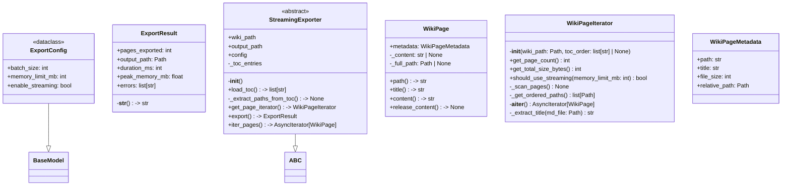

# File Overview

This file, `src/local_deepwiki/export/streaming.py`, provides core functionality for streaming export operations of wiki pages. It defines data models, iterators, and utilities to handle large wikis efficiently by loading content on demand and supporting memory-aware export strategies.

## Dependencies

This file imports:
- `ABC`, `abstractmethod` from `abc`
- `AsyncIterator` from `collections.abc`
- `dataclass`, `field` from `dataclasses`
- `Path` from `pathlib`
- `Any`, `Callable` from `typing`
- `BaseModel`, `Field` from `pydantic`
- [`get_logger`](../logging.md) from `local_deepwiki.logging`
- `json`

## Integration

This file is used by:
- `WikiPageMetadata` is used by `test_streaming_export`

Related files in the project:
- `src/local_deepwiki/core/__init__.py`
- `src/local_deepwiki/generators/source_refs.py`
- `src/local_deepwiki/plugins/base.py`
- `tests/__init__.py`
- `tests/test_plugins.py`

Key types referenced:
- `WikiPageMetadata`
- [`ProgressCallback`](../cli_progress.md)
- `ExportResult`
- `WikiPageIterator`

---

# Classes

## ExportConfig

Configuration for streaming export operations.

### Fields

- `batch_size`: `int` (default: 50, range: 1-500) - Pages per batch for PDF generation.
- `memory_limit_mb`: `int` (default: 500, range: 100-4096) - Memory threshold to trigger streaming mode (MB).
- `enable_streaming`: `bool` (default: True) - Enable streaming mode for large wikis.

## WikiPageMetadata

Lightweight metadata for a wiki page without full content.

### Fields

- `path`: `str`
- `title`: `str`
- `file_size`: `int`
- `relative_path`: `Path`

## WikiPage

A wiki page with content loaded on demand.

### Fields

- `metadata`: `WikiPageMetadata`
- `_content`: `str | None` (default: None, not represented in `__repr__`)
- `_full_path`: `Path | None` (default: None, not represented in `__repr__`)

### Properties

- `path`: `str` - Return the relative path of the page.
- `title`: `str` - Return the title of the page.
- `content`: `str` - Return the content of the page, loading from disk if needed.

## ExportResult

Result of an export operation.

### Fields

- `pages_exported`: `int`
- `output_path`: `Path`
- `duration_ms`: `int`
- `peak_memory_mb`: `float` (default: 0.0)
- `errors`: `list[str]` (default: empty list)

### Methods

- `__str__`: Return a human-readable summary.

## WikiPageIterator

Iterator for wiki pages, supporting ordered iteration and memory-aware streaming.

### Methods

- `__init__(wiki_path: Path, toc_order: list[str] | None = None)`  
  Initialize the iterator.  
  - `wiki_path`: Path to the `.deepwiki` directory.  
  - `toc_order`: Optional list of page paths in TOC order. If not provided, pages are iterated in alphabetical order.

- `get_page_count() -> int`  
  Return total page count without loading content.

- `get_total_size_bytes() -> int`  
  Return total size of all pages in bytes.

- `should_use_streaming(memory_limit_mb: int = 500) -> bool`  
  Determine if streaming mode should be used based on wiki size.  
  - `memory_limit_mb`: Memory threshold in megabytes.  
  - Returns: `True` if wiki size exceeds threshold and streaming is recommended.

- `_scan_pages() -> None`  
  Scan wiki directory to count pages and calculate total size.

- `_get_ordered_paths() -> list[Path]`  
  Get page paths in the correct order (TOC order or alphabetical).

- `__aiter__() -> AsyncIterator[WikiPage]`  
  Yield pages one at a time. Content is loaded lazily when the `content` property is accessed.

- `_extract_title(md_file: Path) -> str`  
  Extract title from markdown file without loading full content. Reads only the first few lines to [find](../generators/manifest.md) the title.

---

# Functions

This file does not contain any standalone functions. All functionality is implemented as methods within classes.

---

# Usage Examples

### Example: Using `WikiPageIterator`

```python
from pathlib import Path
from local_deepwiki.export.streaming import WikiPageIterator

wiki_path = Path("/path/to/wiki")
iterator = WikiPageIterator(wiki_path, toc_order=["page1.md", "page2.md"])

async for page in iterator:
    print(page.title)
    print(page.content)  # Content loaded on demand
```

### Example: Using `ExportConfig`

```python
from local_deepwiki.export.streaming import ExportConfig

config = ExportConfig(
    batch_size=100,
    memory_limit_mb=1000,
    enable_streaming=True
)
```

### Example: Using `ExportResult`

```python
from local_deepwiki.export.streaming import ExportResult
from pathlib import Path

result = ExportResult(
    pages_exported=100,
    output_path=Path("/output/export.pdf"),
    duration_ms=5000,
    peak_memory_mb=300.0
)

print(result)  # Output: Exported 100 pages to /output/export.pdf in 5000ms
```

## API Reference

### class `ExportConfig`

**Inherits from:** `BaseModel`

Configuration for streaming export operations.


<details>
<summary>View Source (lines 20-40) | <a href="https://github.com/UrbanDiver/local-deepwiki-mcp/blob/[main](pdf.md)/src/local_deepwiki/export/streaming.py#L20-L40">GitHub</a></summary>

```python
class ExportConfig(BaseModel):
    """Configuration for streaming export operations."""

    model_config = {"frozen": True}

    batch_size: int = Field(
        default=50,
        ge=1,
        le=500,
        description="Pages per batch for PDF generation",
    )
    memory_limit_mb: int = Field(
        default=500,
        ge=100,
        le=4096,
        description="Memory threshold to trigger streaming mode (MB)",
    )
    enable_streaming: bool = Field(
        default=True,
        description="Enable streaming mode for large wikis",
    )
```

</details>

### class `WikiPageMetadata`

Lightweight metadata for a wiki page without full content.


<details>
<summary>View Source (lines 44-50) | <a href="https://github.com/UrbanDiver/local-deepwiki-mcp/blob/[main](pdf.md)/src/local_deepwiki/export/streaming.py#L44-L50">GitHub</a></summary>

```python
class WikiPageMetadata:
    """Lightweight metadata for a wiki page without full content."""

    path: str
    title: str
    file_size: int
    relative_path: Path
```

</details>

### class `WikiPage`

A wiki page with content loaded on demand.

**Methods:**


<details>
<summary>View Source (lines 54-82) | <a href="https://github.com/UrbanDiver/local-deepwiki-mcp/blob/[main](pdf.md)/src/local_deepwiki/export/streaming.py#L54-L82">GitHub</a></summary>

```python
class WikiPage:
    """A wiki page with content loaded on demand."""

    metadata: WikiPageMetadata
    _content: str | None = field(default=None, repr=False)
    _full_path: Path | None = field(default=None, repr=False)

    @property
    def path(self) -> str:
        """Return the relative path of the page."""
        return self.metadata.path

    @property
    def title(self) -> str:
        """Return the title of the page."""
        return self.metadata.title

    @property
    def content(self) -> str:
        """Return the content of the page, loading from disk if needed."""
        if self._content is None:
            if self._full_path is None:
                raise ValueError("Cannot load content: full_path not set")
            self._content = self._full_path.read_text()
        return self._content

    def release_content(self) -> None:
        """Release the content from memory."""
        self._content = None
```

</details>

#### `path`

```python
def path() -> str
```

Return the relative path of the page.


<details>
<summary>View Source (lines 54-82) | <a href="https://github.com/UrbanDiver/local-deepwiki-mcp/blob/[main](pdf.md)/src/local_deepwiki/export/streaming.py#L54-L82">GitHub</a></summary>

```python
class WikiPage:
    """A wiki page with content loaded on demand."""

    metadata: WikiPageMetadata
    _content: str | None = field(default=None, repr=False)
    _full_path: Path | None = field(default=None, repr=False)

    @property
    def path(self) -> str:
        """Return the relative path of the page."""
        return self.metadata.path

    @property
    def title(self) -> str:
        """Return the title of the page."""
        return self.metadata.title

    @property
    def content(self) -> str:
        """Return the content of the page, loading from disk if needed."""
        if self._content is None:
            if self._full_path is None:
                raise ValueError("Cannot load content: full_path not set")
            self._content = self._full_path.read_text()
        return self._content

    def release_content(self) -> None:
        """Release the content from memory."""
        self._content = None
```

</details>

#### `title`

```python
def title() -> str
```

Return the title of the page.


<details>
<summary>View Source (lines 54-82) | <a href="https://github.com/UrbanDiver/local-deepwiki-mcp/blob/[main](pdf.md)/src/local_deepwiki/export/streaming.py#L54-L82">GitHub</a></summary>

```python
class WikiPage:
    """A wiki page with content loaded on demand."""

    metadata: WikiPageMetadata
    _content: str | None = field(default=None, repr=False)
    _full_path: Path | None = field(default=None, repr=False)

    @property
    def path(self) -> str:
        """Return the relative path of the page."""
        return self.metadata.path

    @property
    def title(self) -> str:
        """Return the title of the page."""
        return self.metadata.title

    @property
    def content(self) -> str:
        """Return the content of the page, loading from disk if needed."""
        if self._content is None:
            if self._full_path is None:
                raise ValueError("Cannot load content: full_path not set")
            self._content = self._full_path.read_text()
        return self._content

    def release_content(self) -> None:
        """Release the content from memory."""
        self._content = None
```

</details>

#### `content`

```python
def content() -> str
```

Return the content of the page, loading from disk if needed.


<details>
<summary>View Source (lines 54-82) | <a href="https://github.com/UrbanDiver/local-deepwiki-mcp/blob/[main](pdf.md)/src/local_deepwiki/export/streaming.py#L54-L82">GitHub</a></summary>

```python
class WikiPage:
    """A wiki page with content loaded on demand."""

    metadata: WikiPageMetadata
    _content: str | None = field(default=None, repr=False)
    _full_path: Path | None = field(default=None, repr=False)

    @property
    def path(self) -> str:
        """Return the relative path of the page."""
        return self.metadata.path

    @property
    def title(self) -> str:
        """Return the title of the page."""
        return self.metadata.title

    @property
    def content(self) -> str:
        """Return the content of the page, loading from disk if needed."""
        if self._content is None:
            if self._full_path is None:
                raise ValueError("Cannot load content: full_path not set")
            self._content = self._full_path.read_text()
        return self._content

    def release_content(self) -> None:
        """Release the content from memory."""
        self._content = None
```

</details>

#### `release_content`

```python
def release_content() -> None
```

Release the content from memory.


<details>
<summary>View Source (lines 54-82) | <a href="https://github.com/UrbanDiver/local-deepwiki-mcp/blob/[main](pdf.md)/src/local_deepwiki/export/streaming.py#L54-L82">GitHub</a></summary>

```python
class WikiPage:
    """A wiki page with content loaded on demand."""

    metadata: WikiPageMetadata
    _content: str | None = field(default=None, repr=False)
    _full_path: Path | None = field(default=None, repr=False)

    @property
    def path(self) -> str:
        """Return the relative path of the page."""
        return self.metadata.path

    @property
    def title(self) -> str:
        """Return the title of the page."""
        return self.metadata.title

    @property
    def content(self) -> str:
        """Return the content of the page, loading from disk if needed."""
        if self._content is None:
            if self._full_path is None:
                raise ValueError("Cannot load content: full_path not set")
            self._content = self._full_path.read_text()
        return self._content

    def release_content(self) -> None:
        """Release the content from memory."""
        self._content = None
```

</details>

### class `ExportResult`

Result of an export operation.


<details>
<summary>View Source (lines 86-100) | <a href="https://github.com/UrbanDiver/local-deepwiki-mcp/blob/[main](pdf.md)/src/local_deepwiki/export/streaming.py#L86-L100">GitHub</a></summary>

```python
class ExportResult:
    """Result of an export operation."""

    pages_exported: int
    output_path: Path
    duration_ms: int
    peak_memory_mb: float = 0.0
    errors: list[str] = field(default_factory=list)

    def __str__(self) -> str:
        """Return a human-readable summary."""
        return (
            f"Exported {self.pages_exported} pages to {self.output_path} "
            f"in {self.duration_ms}ms"
        )
```

</details>

### class `WikiPageIterator`

Memory-efficient iterator over wiki pages.  Yields pages one at a time, loading content only when accessed. Supports counting pages without loading content.

**Methods:**


<details>
<summary>View Source (lines 107-226) | <a href="https://github.com/UrbanDiver/local-deepwiki-mcp/blob/[main](pdf.md)/src/local_deepwiki/export/streaming.py#L107-L226">GitHub</a></summary>

```python
class WikiPageIterator:
    # Methods: __init__, get_page_count, get_total_size_bytes, should_use_streaming, _scan_pages, _get_ordered_paths, __aiter__, _extract_title
```

</details>

#### `__init__`

```python
def __init__(wiki_path: Path, toc_order: list[str] | None = None)
```

Initialize the iterator.


| [Parameter](../generators/api_docs.md) | Type | Default | Description |
|-----------|------|---------|-------------|
| `wiki_path` | `Path` | - | Path to the .deepwiki directory. |
| `toc_order` | `list[str] | None` | `None` | Optional list of page paths in TOC order. If not provided, pages are iterated in alphabetical order. |


<details>
<summary>View Source (lines 114-125) | <a href="https://github.com/UrbanDiver/local-deepwiki-mcp/blob/[main](pdf.md)/src/local_deepwiki/export/streaming.py#L114-L125">GitHub</a></summary>

```python
def __init__(self, wiki_path: Path, toc_order: list[str] | None = None):
        """Initialize the iterator.

        Args:
            wiki_path: Path to the .deepwiki directory.
            toc_order: Optional list of page paths in TOC order.
                       If not provided, pages are iterated in alphabetical order.
        """
        self.wiki_path = wiki_path
        self._toc_order = toc_order
        self._page_count: int | None = None
        self._total_size: int = 0
```

</details>

#### `get_page_count`

```python
def get_page_count() -> int
```

Return total page count without loading content.


<details>
<summary>View Source (lines 127-131) | <a href="https://github.com/UrbanDiver/local-deepwiki-mcp/blob/[main](pdf.md)/src/local_deepwiki/export/streaming.py#L127-L131">GitHub</a></summary>

```python
def get_page_count(self) -> int:
        """Return total page count without loading content."""
        if self._page_count is None:
            self._scan_pages()
        return self._page_count or 0
```

</details>

#### `get_total_size_bytes`

```python
def get_total_size_bytes() -> int
```

Return total size of all pages in bytes.


<details>
<summary>View Source (lines 133-137) | <a href="https://github.com/UrbanDiver/local-deepwiki-mcp/blob/[main](pdf.md)/src/local_deepwiki/export/streaming.py#L133-L137">GitHub</a></summary>

```python
def get_total_size_bytes(self) -> int:
        """Return total size of all pages in bytes."""
        if self._page_count is None:
            self._scan_pages()
        return self._total_size
```

</details>

#### `should_use_streaming`

```python
def should_use_streaming(memory_limit_mb: int = 500) -> bool
```

Determine if streaming mode should be used based on wiki size.


| [Parameter](../generators/api_docs.md) | Type | Default | Description |
|-----------|------|---------|-------------|
| `memory_limit_mb` | `int` | `500` | Memory threshold in megabytes. |


<details>
<summary>View Source (lines 139-151) | <a href="https://github.com/UrbanDiver/local-deepwiki-mcp/blob/[main](pdf.md)/src/local_deepwiki/export/streaming.py#L139-L151">GitHub</a></summary>

```python
def should_use_streaming(self, memory_limit_mb: int = 500) -> bool:
        """Determine if streaming mode should be used based on wiki size.

        Args:
            memory_limit_mb: Memory threshold in megabytes.

        Returns:
            True if wiki size exceeds threshold and streaming is recommended.
        """
        total_mb = self.get_total_size_bytes() / (1024 * 1024)
        # Use streaming if wiki is larger than threshold
        # or if there are many pages (>100)
        return total_mb > memory_limit_mb or self.get_page_count() > 100
```

</details>

### class `StreamingExporter`

**Inherits from:** `ABC`

Abstract base class for streaming wiki exporters.  Subclasses implement memory-efficient export by processing pages one at a time or in small batches.

**Methods:**


<details>
<summary>View Source (lines 229-311) | <a href="https://github.com/UrbanDiver/local-deepwiki-mcp/blob/[main](pdf.md)/src/local_deepwiki/export/streaming.py#L229-L311">GitHub</a></summary>

```python
class StreamingExporter(ABC):
    """Abstract base class for streaming wiki exporters.

    Subclasses implement memory-efficient export by processing pages
    one at a time or in small batches.
    """

    def __init__(
        self,
        wiki_path: Path,
        output_path: Path,
        config: ExportConfig | None = None,
    ):
        """Initialize the streaming exporter.

        Args:
            wiki_path: Path to the .deepwiki directory.
            output_path: Output path for exported content.
            config: Export configuration. Uses defaults if not provided.
        """
        self.wiki_path = Path(wiki_path)
        self.output_path = Path(output_path)
        self.config = config or ExportConfig()
        self._toc_entries: list[dict[str, Any]] = []

    def load_toc(self) -> list[str]:
        """Load and parse table of contents, returning ordered page paths.

        Returns:
            List of page paths in TOC order.
        """
        import json

        toc_path = self.wiki_path / "toc.json"
        if not toc_path.exists():
            return []

        try:
            toc_data = json.loads(toc_path.read_text())
            self._toc_entries = toc_data.get("entries", [])
            paths: list[str] = []
            self._extract_paths_from_toc(self._toc_entries, paths)
            logger.debug(f"Loaded {len(paths)} paths from TOC")
            return paths
        except (json.JSONDecodeError, OSError) as e:
            logger.warning(f"Could not load TOC: {e}")
            return []

    def _extract_paths_from_toc(
        self, entries: list[dict[str, Any]], paths: list[str]
    ) -> None:
        """Recursively extract paths from TOC entries."""
        for entry in entries:
            path = entry.get("path", "")
            if path:  # Skip empty paths
                paths.append(path)
            if "children" in entry:
                self._extract_paths_from_toc(entry["children"], paths)

    def get_page_iterator(self) -> WikiPageIterator:
        """Get an iterator over wiki pages in TOC order."""
        toc_order = self.load_toc()
        return WikiPageIterator(self.wiki_path, toc_order)

    @abstractmethod
    async def export(
        self, progress_callback: ProgressCallback | None = None
    ) -> ExportResult:
        """Export wiki with streaming.

        Args:
            progress_callback: Optional callback for progress updates.

        Returns:
            ExportResult with export statistics.
        """
        ...

    async def iter_pages(self) -> AsyncIterator[WikiPage]:
        """Iterate over wiki pages without loading all into memory."""
        iterator = self.get_page_iterator()
        async for page in iterator:
            yield page
```

</details>

#### `__init__`

```python
def __init__(wiki_path: Path, output_path: Path, config: ExportConfig | None = None)
```

Initialize the streaming exporter.


| [Parameter](../generators/api_docs.md) | Type | Default | Description |
|-----------|------|---------|-------------|
| `wiki_path` | `Path` | - | Path to the .deepwiki directory. |
| `output_path` | `Path` | - | Output path for exported content. |
| `config` | `ExportConfig | None` | `None` | Export configuration. Uses defaults if not provided. |


<details>
<summary>View Source (lines 229-311) | <a href="https://github.com/UrbanDiver/local-deepwiki-mcp/blob/[main](pdf.md)/src/local_deepwiki/export/streaming.py#L229-L311">GitHub</a></summary>

```python
class StreamingExporter(ABC):
    """Abstract base class for streaming wiki exporters.

    Subclasses implement memory-efficient export by processing pages
    one at a time or in small batches.
    """

    def __init__(
        self,
        wiki_path: Path,
        output_path: Path,
        config: ExportConfig | None = None,
    ):
        """Initialize the streaming exporter.

        Args:
            wiki_path: Path to the .deepwiki directory.
            output_path: Output path for exported content.
            config: Export configuration. Uses defaults if not provided.
        """
        self.wiki_path = Path(wiki_path)
        self.output_path = Path(output_path)
        self.config = config or ExportConfig()
        self._toc_entries: list[dict[str, Any]] = []

    def load_toc(self) -> list[str]:
        """Load and parse table of contents, returning ordered page paths.

        Returns:
            List of page paths in TOC order.
        """
        import json

        toc_path = self.wiki_path / "toc.json"
        if not toc_path.exists():
            return []

        try:
            toc_data = json.loads(toc_path.read_text())
            self._toc_entries = toc_data.get("entries", [])
            paths: list[str] = []
            self._extract_paths_from_toc(self._toc_entries, paths)
            logger.debug(f"Loaded {len(paths)} paths from TOC")
            return paths
        except (json.JSONDecodeError, OSError) as e:
            logger.warning(f"Could not load TOC: {e}")
            return []

    def _extract_paths_from_toc(
        self, entries: list[dict[str, Any]], paths: list[str]
    ) -> None:
        """Recursively extract paths from TOC entries."""
        for entry in entries:
            path = entry.get("path", "")
            if path:  # Skip empty paths
                paths.append(path)
            if "children" in entry:
                self._extract_paths_from_toc(entry["children"], paths)

    def get_page_iterator(self) -> WikiPageIterator:
        """Get an iterator over wiki pages in TOC order."""
        toc_order = self.load_toc()
        return WikiPageIterator(self.wiki_path, toc_order)

    @abstractmethod
    async def export(
        self, progress_callback: ProgressCallback | None = None
    ) -> ExportResult:
        """Export wiki with streaming.

        Args:
            progress_callback: Optional callback for progress updates.

        Returns:
            ExportResult with export statistics.
        """
        ...

    async def iter_pages(self) -> AsyncIterator[WikiPage]:
        """Iterate over wiki pages without loading all into memory."""
        iterator = self.get_page_iterator()
        async for page in iterator:
            yield page
```

</details>

#### `load_toc`

```python
def load_toc() -> list[str]
```

Load and parse table of contents, returning ordered page paths.


<details>
<summary>View Source (lines 229-311) | <a href="https://github.com/UrbanDiver/local-deepwiki-mcp/blob/[main](pdf.md)/src/local_deepwiki/export/streaming.py#L229-L311">GitHub</a></summary>

```python
class StreamingExporter(ABC):
    """Abstract base class for streaming wiki exporters.

    Subclasses implement memory-efficient export by processing pages
    one at a time or in small batches.
    """

    def __init__(
        self,
        wiki_path: Path,
        output_path: Path,
        config: ExportConfig | None = None,
    ):
        """Initialize the streaming exporter.

        Args:
            wiki_path: Path to the .deepwiki directory.
            output_path: Output path for exported content.
            config: Export configuration. Uses defaults if not provided.
        """
        self.wiki_path = Path(wiki_path)
        self.output_path = Path(output_path)
        self.config = config or ExportConfig()
        self._toc_entries: list[dict[str, Any]] = []

    def load_toc(self) -> list[str]:
        """Load and parse table of contents, returning ordered page paths.

        Returns:
            List of page paths in TOC order.
        """
        import json

        toc_path = self.wiki_path / "toc.json"
        if not toc_path.exists():
            return []

        try:
            toc_data = json.loads(toc_path.read_text())
            self._toc_entries = toc_data.get("entries", [])
            paths: list[str] = []
            self._extract_paths_from_toc(self._toc_entries, paths)
            logger.debug(f"Loaded {len(paths)} paths from TOC")
            return paths
        except (json.JSONDecodeError, OSError) as e:
            logger.warning(f"Could not load TOC: {e}")
            return []

    def _extract_paths_from_toc(
        self, entries: list[dict[str, Any]], paths: list[str]
    ) -> None:
        """Recursively extract paths from TOC entries."""
        for entry in entries:
            path = entry.get("path", "")
            if path:  # Skip empty paths
                paths.append(path)
            if "children" in entry:
                self._extract_paths_from_toc(entry["children"], paths)

    def get_page_iterator(self) -> WikiPageIterator:
        """Get an iterator over wiki pages in TOC order."""
        toc_order = self.load_toc()
        return WikiPageIterator(self.wiki_path, toc_order)

    @abstractmethod
    async def export(
        self, progress_callback: ProgressCallback | None = None
    ) -> ExportResult:
        """Export wiki with streaming.

        Args:
            progress_callback: Optional callback for progress updates.

        Returns:
            ExportResult with export statistics.
        """
        ...

    async def iter_pages(self) -> AsyncIterator[WikiPage]:
        """Iterate over wiki pages without loading all into memory."""
        iterator = self.get_page_iterator()
        async for page in iterator:
            yield page
```

</details>

#### `get_page_iterator`

```python
def get_page_iterator() -> WikiPageIterator
```

Get an iterator over wiki pages in TOC order.


<details>
<summary>View Source (lines 229-311) | <a href="https://github.com/UrbanDiver/local-deepwiki-mcp/blob/[main](pdf.md)/src/local_deepwiki/export/streaming.py#L229-L311">GitHub</a></summary>

```python
class StreamingExporter(ABC):
    """Abstract base class for streaming wiki exporters.

    Subclasses implement memory-efficient export by processing pages
    one at a time or in small batches.
    """

    def __init__(
        self,
        wiki_path: Path,
        output_path: Path,
        config: ExportConfig | None = None,
    ):
        """Initialize the streaming exporter.

        Args:
            wiki_path: Path to the .deepwiki directory.
            output_path: Output path for exported content.
            config: Export configuration. Uses defaults if not provided.
        """
        self.wiki_path = Path(wiki_path)
        self.output_path = Path(output_path)
        self.config = config or ExportConfig()
        self._toc_entries: list[dict[str, Any]] = []

    def load_toc(self) -> list[str]:
        """Load and parse table of contents, returning ordered page paths.

        Returns:
            List of page paths in TOC order.
        """
        import json

        toc_path = self.wiki_path / "toc.json"
        if not toc_path.exists():
            return []

        try:
            toc_data = json.loads(toc_path.read_text())
            self._toc_entries = toc_data.get("entries", [])
            paths: list[str] = []
            self._extract_paths_from_toc(self._toc_entries, paths)
            logger.debug(f"Loaded {len(paths)} paths from TOC")
            return paths
        except (json.JSONDecodeError, OSError) as e:
            logger.warning(f"Could not load TOC: {e}")
            return []

    def _extract_paths_from_toc(
        self, entries: list[dict[str, Any]], paths: list[str]
    ) -> None:
        """Recursively extract paths from TOC entries."""
        for entry in entries:
            path = entry.get("path", "")
            if path:  # Skip empty paths
                paths.append(path)
            if "children" in entry:
                self._extract_paths_from_toc(entry["children"], paths)

    def get_page_iterator(self) -> WikiPageIterator:
        """Get an iterator over wiki pages in TOC order."""
        toc_order = self.load_toc()
        return WikiPageIterator(self.wiki_path, toc_order)

    @abstractmethod
    async def export(
        self, progress_callback: ProgressCallback | None = None
    ) -> ExportResult:
        """Export wiki with streaming.

        Args:
            progress_callback: Optional callback for progress updates.

        Returns:
            ExportResult with export statistics.
        """
        ...

    async def iter_pages(self) -> AsyncIterator[WikiPage]:
        """Iterate over wiki pages without loading all into memory."""
        iterator = self.get_page_iterator()
        async for page in iterator:
            yield page
```

</details>

#### `export`

```python
async def export(progress_callback: ProgressCallback | None = None) -> ExportResult
```

Export wiki with streaming.


| [Parameter](../generators/api_docs.md) | Type | Default | Description |
|-----------|------|---------|-------------|
| [`progress_callback`](../handlers.md) | `ProgressCallback | None` | `None` | Optional callback for progress updates. |


<details>
<summary>View Source (lines 229-311) | <a href="https://github.com/UrbanDiver/local-deepwiki-mcp/blob/[main](pdf.md)/src/local_deepwiki/export/streaming.py#L229-L311">GitHub</a></summary>

```python
class StreamingExporter(ABC):
    """Abstract base class for streaming wiki exporters.

    Subclasses implement memory-efficient export by processing pages
    one at a time or in small batches.
    """

    def __init__(
        self,
        wiki_path: Path,
        output_path: Path,
        config: ExportConfig | None = None,
    ):
        """Initialize the streaming exporter.

        Args:
            wiki_path: Path to the .deepwiki directory.
            output_path: Output path for exported content.
            config: Export configuration. Uses defaults if not provided.
        """
        self.wiki_path = Path(wiki_path)
        self.output_path = Path(output_path)
        self.config = config or ExportConfig()
        self._toc_entries: list[dict[str, Any]] = []

    def load_toc(self) -> list[str]:
        """Load and parse table of contents, returning ordered page paths.

        Returns:
            List of page paths in TOC order.
        """
        import json

        toc_path = self.wiki_path / "toc.json"
        if not toc_path.exists():
            return []

        try:
            toc_data = json.loads(toc_path.read_text())
            self._toc_entries = toc_data.get("entries", [])
            paths: list[str] = []
            self._extract_paths_from_toc(self._toc_entries, paths)
            logger.debug(f"Loaded {len(paths)} paths from TOC")
            return paths
        except (json.JSONDecodeError, OSError) as e:
            logger.warning(f"Could not load TOC: {e}")
            return []

    def _extract_paths_from_toc(
        self, entries: list[dict[str, Any]], paths: list[str]
    ) -> None:
        """Recursively extract paths from TOC entries."""
        for entry in entries:
            path = entry.get("path", "")
            if path:  # Skip empty paths
                paths.append(path)
            if "children" in entry:
                self._extract_paths_from_toc(entry["children"], paths)

    def get_page_iterator(self) -> WikiPageIterator:
        """Get an iterator over wiki pages in TOC order."""
        toc_order = self.load_toc()
        return WikiPageIterator(self.wiki_path, toc_order)

    @abstractmethod
    async def export(
        self, progress_callback: ProgressCallback | None = None
    ) -> ExportResult:
        """Export wiki with streaming.

        Args:
            progress_callback: Optional callback for progress updates.

        Returns:
            ExportResult with export statistics.
        """
        ...

    async def iter_pages(self) -> AsyncIterator[WikiPage]:
        """Iterate over wiki pages without loading all into memory."""
        iterator = self.get_page_iterator()
        async for page in iterator:
            yield page
```

</details>

#### `iter_pages`

```python
async def iter_pages() -> AsyncIterator[WikiPage]
```

Iterate over wiki pages without loading all into memory.


<details>
<summary>View Source (lines 229-311) | <a href="https://github.com/UrbanDiver/local-deepwiki-mcp/blob/[main](pdf.md)/src/local_deepwiki/export/streaming.py#L229-L311">GitHub</a></summary>

```python
class StreamingExporter(ABC):
    """Abstract base class for streaming wiki exporters.

    Subclasses implement memory-efficient export by processing pages
    one at a time or in small batches.
    """

    def __init__(
        self,
        wiki_path: Path,
        output_path: Path,
        config: ExportConfig | None = None,
    ):
        """Initialize the streaming exporter.

        Args:
            wiki_path: Path to the .deepwiki directory.
            output_path: Output path for exported content.
            config: Export configuration. Uses defaults if not provided.
        """
        self.wiki_path = Path(wiki_path)
        self.output_path = Path(output_path)
        self.config = config or ExportConfig()
        self._toc_entries: list[dict[str, Any]] = []

    def load_toc(self) -> list[str]:
        """Load and parse table of contents, returning ordered page paths.

        Returns:
            List of page paths in TOC order.
        """
        import json

        toc_path = self.wiki_path / "toc.json"
        if not toc_path.exists():
            return []

        try:
            toc_data = json.loads(toc_path.read_text())
            self._toc_entries = toc_data.get("entries", [])
            paths: list[str] = []
            self._extract_paths_from_toc(self._toc_entries, paths)
            logger.debug(f"Loaded {len(paths)} paths from TOC")
            return paths
        except (json.JSONDecodeError, OSError) as e:
            logger.warning(f"Could not load TOC: {e}")
            return []

    def _extract_paths_from_toc(
        self, entries: list[dict[str, Any]], paths: list[str]
    ) -> None:
        """Recursively extract paths from TOC entries."""
        for entry in entries:
            path = entry.get("path", "")
            if path:  # Skip empty paths
                paths.append(path)
            if "children" in entry:
                self._extract_paths_from_toc(entry["children"], paths)

    def get_page_iterator(self) -> WikiPageIterator:
        """Get an iterator over wiki pages in TOC order."""
        toc_order = self.load_toc()
        return WikiPageIterator(self.wiki_path, toc_order)

    @abstractmethod
    async def export(
        self, progress_callback: ProgressCallback | None = None
    ) -> ExportResult:
        """Export wiki with streaming.

        Args:
            progress_callback: Optional callback for progress updates.

        Returns:
            ExportResult with export statistics.
        """
        ...

    async def iter_pages(self) -> AsyncIterator[WikiPage]:
        """Iterate over wiki pages without loading all into memory."""
        iterator = self.get_page_iterator()
        async for page in iterator:
            yield page
```

</details>

## Class Diagram



## Call Graph

```mermaid
flowchart TD
    N0[ExportConfig]
    N1[Path]
    N2[StreamingExporter.__init__]
    N3[StreamingExporter.get_page_...]
    N4[StreamingExporter.load_toc]
    N5[ValueError]
    N6[WikiPage]
    N7[WikiPage.content]
    N8[WikiPageIterator.__aiter__]
    N9[WikiPageIterator._extract_t...]
    N10[WikiPageIterator._get_order...]
    N11[WikiPageIterator._scan_pages]
    N12[WikiPageIterator.get_page_c...]
    N13[WikiPageIterator.get_total_...]
    N14[WikiPageIterator.should_use...]
    N15[WikiPageMetadata]
    N16[_extract_paths_from_toc]
    N17[_extract_title]
    N18[_get_ordered_paths]
    N19[_scan_pages]
    N20[exists]
    N21[get_page_count]
    N22[get_total_size_bytes]
    N23[loads]
    N24[read_text]
    N25[relative_to]
    N26[rglob]
    N27[stat]
    N28[tell]
    N29[title]
    N7 --> N5
    N7 --> N24
    N12 --> N19
    N13 --> N19
    N14 --> N22
    N14 --> N21
    N11 --> N26
    N11 --> N27
    N10 --> N25
    N10 --> N26
    N8 --> N18
    N8 --> N25
    N8 --> N17
    N8 --> N27
    N8 --> N15
    N8 --> N6
    N9 --> N28
    N9 --> N29
    N2 --> N1
    N2 --> N0
    N4 --> N20
    N4 --> N23
    N4 --> N24
    N4 --> N16
    classDef func fill:#e1f5fe
    class N0,N1,N5,N6,N15,N16,N17,N18,N19,N20,N21,N22,N23,N24,N25,N26,N27,N28,N29 func
    classDef method fill:#fff3e0
    class N2,N3,N4,N7,N8,N9,N10,N11,N12,N13,N14 method
```



## Used By

Functions and methods in this file and their callers:

- **`ExportConfig`**: called by `StreamingExporter.__init__`
- **`Path`**: called by `StreamingExporter.__init__`
- **`ValueError`**: called by `WikiPage.content`
- **`WikiPage`**: called by `WikiPageIterator.__aiter__`
- **`WikiPageIterator`**: called by `StreamingExporter.get_page_iterator`
- **`WikiPageMetadata`**: called by `WikiPageIterator.__aiter__`
- **`_extract_paths_from_toc`**: called by `StreamingExporter._extract_paths_from_toc`, `StreamingExporter.load_toc`
- **`_extract_title`**: called by `WikiPageIterator.__aiter__`
- **`_get_ordered_paths`**: called by `WikiPageIterator.__aiter__`
- **`_scan_pages`**: called by `WikiPageIterator.get_page_count`, `WikiPageIterator.get_total_size_bytes`
- **`exists`**: called by `StreamingExporter.load_toc`
- **`get_page_count`**: called by `WikiPageIterator.should_use_streaming`
- **`get_page_iterator`**: called by `StreamingExporter.iter_pages`
- **`get_total_size_bytes`**: called by `WikiPageIterator.should_use_streaming`
- **`load_toc`**: called by `StreamingExporter.get_page_iterator`
- **`loads`**: called by `StreamingExporter.load_toc`
- **`read_text`**: called by `StreamingExporter.load_toc`, `WikiPage.content`
- **`relative_to`**: called by `WikiPageIterator.__aiter__`, `WikiPageIterator._get_ordered_paths`
- **`rglob`**: called by `WikiPageIterator._get_ordered_paths`, `WikiPageIterator._scan_pages`
- **`stat`**: called by `WikiPageIterator.__aiter__`, `WikiPageIterator._scan_pages`
- **`tell`**: called by `WikiPageIterator._extract_title`
- **`title`**: called by `WikiPageIterator._extract_title`

## Usage Examples

*Examples extracted from test files*

### Test creating metadata

From `test_streaming_export.py::TestWikiPageMetadata::test_metadata_creation`:

```python
metadata = WikiPageMetadata(
    path="modules/core.md",
    title="Core Module",
    file_size=1024,
    relative_path=Path("modules/core.md"),
)
assert metadata.path == "modules/core.md"
assert metadata.title == "Core Module"
```

### Test creating metadata

From `test_streaming_export.py::TestWikiPageMetadata::test_metadata_creation`:

```python
metadata = WikiPageMetadata(
    path="modules/core.md",
    title="Core Module",
    file_size=1024,
    relative_path=Path("modules/core.md"),
)
assert metadata.path == "modules/core.md"
assert metadata.title == "Core Module"
```

### Test metadata fields are accessible

From `test_streaming_export.py::TestWikiPageMetadata::test_metadata_immutable_fields`:

```python
metadata = WikiPageMetadata(
    path="index.md",
    title="Home",
    file_size=512,
    relative_path=Path("index.md"),
)
assert str(metadata.relative_path) == "index.md"
```

### Test metadata fields are accessible

From `test_streaming_export.py::TestWikiPageMetadata::test_metadata_immutable_fields`:

```python
metadata = WikiPageMetadata(
    path="index.md",
    title="Home",
    file_size=512,
    relative_path=Path("index.md"),
)
assert str(metadata.relative_path) == "index.md"
```

### Test counting pages without loading content

From `test_streaming_export.py::TestWikiPageIterator::test_get_page_count`:

```python
iterator = WikiPageIterator(sample_wiki)
count = iterator.get_page_count()
assert count == 4
```


## Last Modified

| Entity | Type | Author | Date | Commit |
|--------|------|--------|------|--------|
| `ExportConfig` | class | Brian Breidenbach | 1 week ago | `a64166a` Add seven medium-priority e... |
| `WikiPageMetadata` | class | Brian Breidenbach | 1 week ago | `a64166a` Add seven medium-priority e... |
| `WikiPage` | class | Brian Breidenbach | 1 week ago | `a64166a` Add seven medium-priority e... |
| `ExportResult` | class | Brian Breidenbach | 1 week ago | `a64166a` Add seven medium-priority e... |
| `WikiPageIterator` | class | Brian Breidenbach | 1 week ago | `a64166a` Add seven medium-priority e... |
| `__init__` | method | Brian Breidenbach | 1 week ago | `a64166a` Add seven medium-priority e... |
| `get_page_count` | method | Brian Breidenbach | 1 week ago | `a64166a` Add seven medium-priority e... |
| `get_total_size_bytes` | method | Brian Breidenbach | 1 week ago | `a64166a` Add seven medium-priority e... |
| `should_use_streaming` | method | Brian Breidenbach | 1 week ago | `a64166a` Add seven medium-priority e... |
| `_scan_pages` | method | Brian Breidenbach | 1 week ago | `a64166a` Add seven medium-priority e... |
| `_get_ordered_paths` | method | Brian Breidenbach | 1 week ago | `a64166a` Add seven medium-priority e... |
| `__aiter__` | method | Brian Breidenbach | 1 week ago | `a64166a` Add seven medium-priority e... |
| `_extract_title` | method | Brian Breidenbach | 1 week ago | `a64166a` Add seven medium-priority e... |
| `StreamingExporter` | class | Brian Breidenbach | 1 week ago | `a64166a` Add seven medium-priority e... |

## Additional Source Code

Source code for functions and methods not listed in the API Reference above.

#### `_scan_pages`

<details>
<summary>View Source (lines 153-161) | <a href="https://github.com/UrbanDiver/local-deepwiki-mcp/blob/[main](pdf.md)/src/local_deepwiki/export/streaming.py#L153-L161">GitHub</a></summary>

```python
def _scan_pages(self) -> None:
        """Scan wiki directory to count pages and calculate total size."""
        md_files = list(self.wiki_path.rglob("*.md"))
        self._page_count = len(md_files)
        self._total_size = sum(f.stat().st_size for f in md_files)
        logger.debug(
            f"Scanned wiki: {self._page_count} pages, "
            f"{self._total_size / 1024 / 1024:.2f} MB"
        )
```

</details>


#### `_get_ordered_paths`

<details>
<summary>View Source (lines 163-180) | <a href="https://github.com/UrbanDiver/local-deepwiki-mcp/blob/[main](pdf.md)/src/local_deepwiki/export/streaming.py#L163-L180">GitHub</a></summary>

```python
def _get_ordered_paths(self) -> list[Path]:
        """Get page paths in the correct order (TOC order or alphabetical)."""
        all_files = {
            str(f.relative_to(self.wiki_path)): f
            for f in self.wiki_path.rglob("*.md")
        }

        if self._toc_order:
            # Order by TOC, then add any remaining files
            ordered = []
            for path in self._toc_order:
                if path in all_files:
                    ordered.append(all_files.pop(path))
            # Add remaining files in sorted order
            ordered.extend(sorted(all_files.values(), key=lambda p: str(p)))
            return ordered
        else:
            return sorted(all_files.values(), key=lambda p: str(p))
```

</details>


#### `__aiter__`

<details>
<summary>View Source (lines 182-205) | <a href="https://github.com/UrbanDiver/local-deepwiki-mcp/blob/[main](pdf.md)/src/local_deepwiki/export/streaming.py#L182-L205">GitHub</a></summary>

```python
async def __aiter__(self) -> AsyncIterator[WikiPage]:
        """Yield pages one at a time.

        Content is loaded lazily when the `content` property is accessed.
        """
        for full_path in self._get_ordered_paths():
            rel_path = full_path.relative_to(self.wiki_path)
            title = self._extract_title(full_path)
            file_size = full_path.stat().st_size

            metadata = WikiPageMetadata(
                path=str(rel_path),
                title=title,
                file_size=file_size,
                relative_path=rel_path,
            )

            page = WikiPage(
                metadata=metadata,
                _content=None,
                _full_path=full_path,
            )

            yield page
```

</details>


#### `_extract_title`

<details>
<summary>View Source (lines 207-226) | <a href="https://github.com/UrbanDiver/local-deepwiki-mcp/blob/[main](pdf.md)/src/local_deepwiki/export/streaming.py#L207-L226">GitHub</a></summary>

```python
def _extract_title(self, md_file: Path) -> str:
        """Extract title from markdown file without loading full content.

        Reads only the first few lines to find the title.
        """
        try:
            with md_file.open() as f:
                for line in f:
                    line = line.strip()
                    if line.startswith("# "):
                        return line[2:].strip()
                    if line.startswith("**") and line.endswith("**"):
                        return line[2:-2].strip()
                    # Only check first 10 lines
                    if f.tell() > 1024:
                        break
        except (OSError, UnicodeDecodeError) as e:
            logger.debug(f"Could not extract title from {md_file}: {e}")

        return md_file.stem.replace("_", " ").replace("-", " ").title()
```

</details>

## Relevant Source Files

- `src/local_deepwiki/export/streaming.py:20-40`
