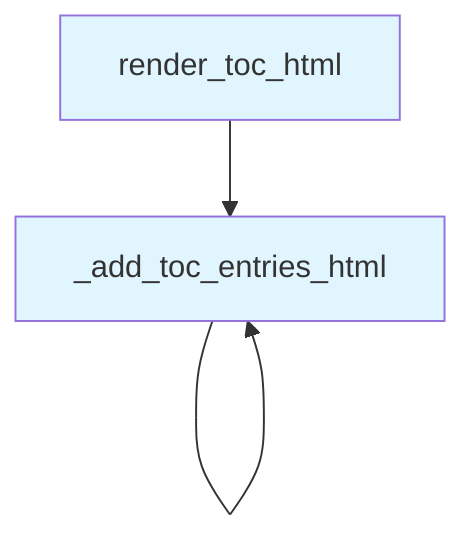

# File: `src/local_deepwiki/export/toc_renderer.py`

## File Overview

This file provides utilities for rendering a table of contents (TOC) into HTML format, primarily used for PDF and HTML export functionality within the `local_deepwiki` project. The module is designed to recursively process hierarchical TOC entries and generate properly indented HTML markup for display.

The core responsibility of this module is to transform structured TOC data (a list of dictionaries with optional nested children) into a valid HTML string representation. This is essential for generating readable and navigable documentation outputs.

## Key Concepts

### Recursive TOC Entry Processing

The `_add_toc_entries_html` function implements a recursive algorithm to process hierarchical TOC entries. It takes an entry list, a mutable list of HTML parts, and a depth indicator to manage indentation. This approach allows for arbitrary nesting levels in the TOC structure.

### HTML String Construction

The `render_toc_html` function orchestrates the construction of a complete HTML document fragment by:
1. Starting with a root `<div class="toc">` container
2. Calling the recursive function to populate entries
3. Closing the container with `</div>`

This pattern ensures consistent HTML structure and supports both flat and nested TOC entries.

### Design Rationale

The choice to use recursion for processing nested entries aligns with the natural structure of a table of contents. This approach avoids complex iterative logic and makes the code more readable and maintainable. The use of a mutable `parts` list in `_add_toc_entries_html` is a performance-conscious pattern, avoiding repeated string concatenation.

## Integration

This module is used by:
- `render_toc_html` is called by the `pdf` module and `test_toc_renderer`
- `_add_toc_entries_html` is used by `test_pdf_streaming`

These usages suggest that the module is part of a larger export pipeline, where TOC data is rendered into HTML for inclusion in PDF or HTML documentation outputs.

The function is imported and used in test contexts, indicating that it's a stable, well-defined utility that can be reliably tested and reused across components.

## Design Notes

### Indentation Strategy

The indentation is handled by prepending `"  " * depth` to each TOC item. This creates a visual hierarchy in the output HTML that reflects the structure of the original TOC entries. While this approach is simple and effective, it assumes that the output will be rendered in an environment where whitespace is preserved (e.g., HTML with CSS or plain text rendering).

### Handling Nested Entries

The recursive function checks for the presence of a `"children"` key in each entry. If present, it recursively processes those children with an incremented depth. This allows for flexible TOC structures without requiring a fixed depth limit.

### Immutability of Input

The function does not modify the input `entries` list or its contents. Instead, it builds a new HTML representation in the `parts` list, which is a safe and predictable approach.

### Type Hinting

The use of `Any` type hints reflects the dynamic nature of the TOC data, which may contain various types of values depending on how it's constructed or parsed. While not strictly typed, this flexibility supports the module's role as a generic rendering utility.

## API Reference

### Functions

#### `render_toc_html`

```python
def render_toc_html(entries: list[dict[str, Any]]) -> str
```

Render a list of TOC entries to an HTML string.


| Parameter | Type | Default | Description |
|-----------|------|---------|-------------|
| `entries` | `list[dict[str, Any]]` | - | List of TOC entry dicts, each with ``title`` and optional ``children`` list. |

**Returns:** `str`


<details>
<summary>View Source (lines 20-33) | <a href="https://github.com/UrbanDiver/local-deepwiki-mcp/blob/main/src/local_deepwiki/export/toc_renderer.py#L20-L33">GitHub</a></summary>

```python
def render_toc_html(entries: list[dict[str, Any]]) -> str:
    """Render a list of TOC entries to an HTML string.

    Args:
        entries: List of TOC entry dicts, each with ``title`` and optional
            ``children`` list.

    Returns:
        HTML string with nested TOC divs.
    """
    parts = ['<div class="toc">']
    _add_toc_entries_html(entries, parts, 0)
    parts.append("</div>")
    return "\n".join(parts)
```

</details>

## Call Graph



## Used By

Functions and methods in this file and their callers:

- **`_add_toc_entries_html`**: called by `_add_toc_entries_html`, `render_toc_html`

## Usage Examples

*Examples extracted from test files*

### Example: `toc_renderer`

From `test_toc_renderer.py::test_render_toc_html_empty`:

```python
from local_deepwiki.export.toc_renderer import render_toc_html

    result = render_toc_html([])
    assert '<div class="toc">' in result
    assert "</div>" in result
```

### Example: `render_toc_html`

From `test_toc_renderer.py::test_render_toc_html_empty`:

```python
from local_deepwiki.export.toc_renderer import render_toc_html

    result = render_toc_html([])
    assert '<div class="toc">' in result
    assert "</div>" in result
```

### Example: `render_toc_html`

From `test_toc_renderer.py::test_render_toc_html_flat_entries`:

```python
from local_deepwiki.export.toc_renderer import render_toc_html

    entries = [
        {"title": "Introduction"},
        {"title": "Setup"},
    ]
    result = render_toc_html(entries)
    assert "Introduction" in result
    assert "Setup" in result
```


## Last Modified

| Entity | Type | Author | Date | Commit |
|--------|------|--------|------|--------|
| `_add_toc_entries_html` | function | Brian Breidenbach | today | `e03bc9c` refactor: extract TOC rende... |
| `render_toc_html` | function | Brian Breidenbach | today | `e03bc9c` refactor: extract TOC rende... |

## Additional Source Code

Source code for functions and methods not listed in the API Reference above.

#### `_add_toc_entries_html`

<details>
<summary>View Source (lines 8-17) | <a href="https://github.com/UrbanDiver/local-deepwiki-mcp/blob/main/src/local_deepwiki/export/toc_renderer.py#L8-L17">GitHub</a></summary>

```python
def _add_toc_entries_html(
    entries: list[dict[str, Any]], parts: list[str], depth: int
) -> None:
    """Recursively add TOC entries to HTML parts list."""
    for entry in entries:
        title = entry.get("title", "")
        indent = "  " * depth
        parts.append(f'{indent}<div class="toc-item">{title}</div>')
        if "children" in entry:
            _add_toc_entries_html(entry["children"], parts, depth + 1)
```

</details>

## Relevant Source Files

- `src/local_deepwiki/export/toc_renderer.py:8-17`
