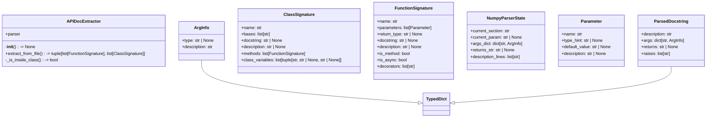
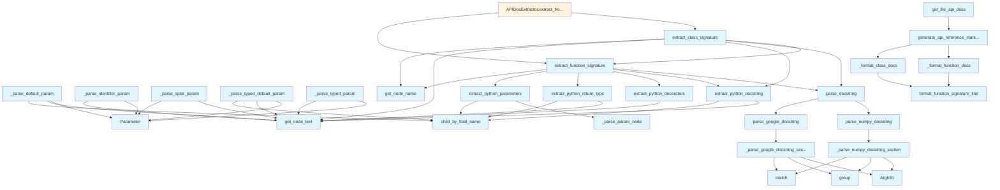

# File: `src/local_deepwiki/generators/analysis/api_docs.py`

## File Overview

This file provides functionality for extracting and formatting API documentation from source code files, primarily targeting Python code. It parses function and class definitions, extracts their signatures, docstrings, and type annotations, and formats them into structured markdown documentation.

The module is designed to support automated generation of API reference documentation from codebases, enabling tools like documentation generators or knowledge bases to extract and present information about public interfaces.

## Key Concepts

### AST Parsing and Extraction
The module leverages `tree-sitter` for parsing source code into Abstract Syntax Tree (AST) representations. It uses helper functions from `local_deepwiki.core.parser` to navigate and extract relevant nodes such as function definitions, class definitions, parameters, and docstrings. This approach allows precise and language-agnostic extraction of code structure and metadata.

### Docstring Parsing
Supports parsing of both Google-style and NumPy-style docstrings. The parser automatically detects the format based on section markers and applies appropriate parsing logic to extract:
- Function/class descriptions
- Parameter information (name, type, description)
- Return value descriptions
- Exception information

This enables rich documentation extraction from various docstring conventions.

### Parameter and Signature Handling
Parameter information is represented using the `Parameter` class, which captures name, type hint, default value, and description. Function and class signatures are modeled using `FunctionSignature` and `ClassSignature`, respectively, including metadata like decorators, async status, and inheritance information.

### Markdown Generation
The module includes utilities for generating human-readable markdown output from extracted API information. It formats signatures, parameters, and descriptions into tables and code blocks for clear presentation.

## Integration

This file integrates deeply with the `local_deepwiki.core.parser` module for AST traversal and node extraction, and with `local_deepwiki.core.chunk_extractors` for identifying node types based on language. It is called by several components within the codebase:

- `test_api_docs` (test suite) - Uses `Parameter`, `extract_python_parameters`, `extract_python_return_type`, `extract_python_decorators`, `parse_google_docstring`, `parse_numpy_docstring`, `parse_docstring`, and `get_file_api_docs`.
- `chunk_extractors` (main logic) - Uses `extract_python_return_type` and `extract_python_decorators`.
- `generator_service` (service layer) - Uses `get_file_api_docs`.
- `docstring` (docstring handling) - Uses `parse_docstring`.
- `test_type_annotations` (test suite) - Uses `extract_python_return_type` and `extract_python_decorators`.

This integration shows that the API documentation extraction is a foundational component used across different parts of the system for generating and processing code documentation.

## Design Notes

### AST Node Handling
The code defines handlers for specific parameter node types (`identifier`, `typed_parameter`, `default_parameter`, `typed_default_parameter`, `list_splat_pattern`, `dictionary_splat_pattern`) to correctly parse different parameter syntaxes in Python. This approach allows robust handling of various parameter definitions including `*args`, `**kwargs`, typed parameters, and default values.

### Docstring Format Detection
The `parse_docstring` function uses heuristics to auto-detect docstring format:
- Looks for section headers like "Args:", "Arguments:", "Parameters:" for Google-style
- Looks for section headers followed by dashes for NumPy-style
- Falls back to Google-style parsing for simple or unrecognized formats

This ensures compatibility with multiple documentation styles while maintaining simplicity in the detection logic.

### Private Item Filtering
The `generate_api_reference_markdown` function filters out private items (those starting with `_`) unless explicitly requested via the `include_private` flag. This design choice aligns with Python conventions where private members are typically excluded from public API documentation.

### Mutable State in NumPy Parser
The `NumpyParserState` class encapsulates mutable state for the NumPy docstring parser, allowing it to accumulate information across lines while maintaining clean separation of concerns. This pattern avoids passing large intermediate structures through function calls, keeping the parser logic efficient and readable.

### Decorator Extraction
The `extract_python_decorators` function looks at sibling nodes preceding a function definition to [collect](../../web/routes_chat.md) decorators. This handles the case where decorators appear on separate lines above a function, which is common in Python code.

### Class Method Extraction
When extracting class signatures, the code identifies methods within class definitions using [`find_nodes_by_type`](../../core/parser/ast_utils.md). It correctly distinguishes between top-level functions and class methods by checking parent nodes, ensuring accurate documentation generation for nested structures.

## API Reference

### class `ArgInfo`

**Inherits from:** `TypedDict`

Type for argument info in parsed docstrings.


<details>
<summary>View Source (lines 22-26) | <a href="https://github.com/UrbanDiver/local-deepwiki-mcp/blob/main/src/local_deepwiki/generators/analysis/api_docs.py#L22-L26">GitHub</a></summary>

```python
class ArgInfo(TypedDict):
    """Type for argument info in parsed docstrings."""

    type: str | None
    description: str
```

</details>

### class `ParsedDocstring`

**Inherits from:** `TypedDict`

Type for parsed docstring result.


<details>
<summary>View Source (lines 29-35) | <a href="https://github.com/UrbanDiver/local-deepwiki-mcp/blob/main/src/local_deepwiki/generators/analysis/api_docs.py#L29-L35">GitHub</a></summary>

```python
class ParsedDocstring(TypedDict):
    """Type for parsed docstring result."""

    description: str
    args: dict[str, ArgInfo]
    returns: str | None
    raises: list[str]
```

</details>

### class `Parameter`

Represents a function parameter.


<details>
<summary>View Source (lines 39-45) | <a href="https://github.com/UrbanDiver/local-deepwiki-mcp/blob/main/src/local_deepwiki/generators/analysis/api_docs.py#L39-L45">GitHub</a></summary>

```python
class Parameter:
    """Represents a function parameter."""

    name: str
    type_hint: str | None = None
    default_value: str | None = None
    description: str | None = None
```

</details>

### class `FunctionSignature`

Represents a function/method signature.


<details>
<summary>View Source (lines 49-59) | <a href="https://github.com/UrbanDiver/local-deepwiki-mcp/blob/main/src/local_deepwiki/generators/analysis/api_docs.py#L49-L59">GitHub</a></summary>

```python
class FunctionSignature:
    """Represents a function/method signature."""

    name: str
    parameters: list[Parameter] = field(default_factory=list)
    return_type: str | None = None
    docstring: str | None = None
    description: str | None = None
    is_method: bool = False
    is_async: bool = False
    decorators: list[str] = field(default_factory=list)
```

</details>

### class `ClassSignature`

Represents a class signature.


<details>
<summary>View Source (lines 63-73) | <a href="https://github.com/UrbanDiver/local-deepwiki-mcp/blob/main/src/local_deepwiki/generators/analysis/api_docs.py#L63-L73">GitHub</a></summary>

```python
class ClassSignature:
    """Represents a class signature."""

    name: str
    bases: list[str] = field(default_factory=list)
    docstring: str | None = None
    description: str | None = None
    methods: list[FunctionSignature] = field(default_factory=list)
    class_variables: list[tuple[str, str | None, str | None]] = field(
        default_factory=list
    )
```

</details>

### class `NumpyParserState`

Mutable state for the NumPy docstring line-by-line parser.  Groups the accumulators that :func:`_parse_numpy_docstring_section` reads and updates on each line.


<details>
<summary>View Source (lines 376-387) | <a href="https://github.com/UrbanDiver/local-deepwiki-mcp/blob/main/src/local_deepwiki/generators/analysis/api_docs.py#L376-L387">GitHub</a></summary>

```python
class NumpyParserState:
    """Mutable state for the NumPy docstring line-by-line parser.

    Groups the accumulators that :func:`_parse_numpy_docstring_section`
    reads and updates on each line.
    """

    current_section: str
    current_param: str | None
    args_dict: dict[str, ArgInfo]
    returns_str: str | None
    description_lines: list[str]
```

</details>

### class `APIDocExtractor`

Extracts API documentation from source files.

**Methods:**


<details>
<summary>View Source (lines 605-660) | <a href="https://github.com/UrbanDiver/local-deepwiki-mcp/blob/main/src/local_deepwiki/generators/analysis/api_docs.py#L605-L660">GitHub</a></summary>

```python
class APIDocExtractor:
    """Extracts API documentation from source files."""

    def __init__(self) -> None:
        """Initialize the extractor."""
        self.parser = CodeParser()

    def extract_from_file(
        self, file_path: Path
    ) -> tuple[list[FunctionSignature], list[ClassSignature]]:
        """Extract API documentation from a source file.

        Args:
            file_path: Path to the source file.

        Returns:
            Tuple of (functions, classes) signatures.
        """
        result = self.parser.parse_file(file_path)
        if result is None:
            return [], []

        root, language, source = result
        functions: list[FunctionSignature] = []
        classes: list[ClassSignature] = []

        function_types = FUNCTION_NODE_TYPES.get(language, set())
        class_types = CLASS_NODE_TYPES.get(language, set())

        # Extract top-level functions
        for func_node in find_nodes_by_type(root, function_types):
            # Skip if inside a class
            if self._is_inside_class(func_node, class_types):
                continue

            sig = extract_function_signature(func_node, source, language)
            if sig:
                functions.append(sig)

        # Extract classes
        for class_node in find_nodes_by_type(root, class_types):
            class_sig = extract_class_signature(class_node, source, language)
            if class_sig:
                classes.append(class_sig)

        return functions, classes

    @staticmethod
    def _is_inside_class(node: Node, class_types: set[str]) -> bool:
        """Check if a node is inside a class definition."""
        parent = node.parent
        while parent:
            if parent.type in class_types:
                return True
            parent = parent.parent
        return False
```

</details>

#### `__init__`

```python
def __init__() -> None
```

Initialize the extractor.


<details>
<summary>View Source (lines 605-660) | <a href="https://github.com/UrbanDiver/local-deepwiki-mcp/blob/main/src/local_deepwiki/generators/analysis/api_docs.py#L605-L660">GitHub</a></summary>

```python
class APIDocExtractor:
    """Extracts API documentation from source files."""

    def __init__(self) -> None:
        """Initialize the extractor."""
        self.parser = CodeParser()

    def extract_from_file(
        self, file_path: Path
    ) -> tuple[list[FunctionSignature], list[ClassSignature]]:
        """Extract API documentation from a source file.

        Args:
            file_path: Path to the source file.

        Returns:
            Tuple of (functions, classes) signatures.
        """
        result = self.parser.parse_file(file_path)
        if result is None:
            return [], []

        root, language, source = result
        functions: list[FunctionSignature] = []
        classes: list[ClassSignature] = []

        function_types = FUNCTION_NODE_TYPES.get(language, set())
        class_types = CLASS_NODE_TYPES.get(language, set())

        # Extract top-level functions
        for func_node in find_nodes_by_type(root, function_types):
            # Skip if inside a class
            if self._is_inside_class(func_node, class_types):
                continue

            sig = extract_function_signature(func_node, source, language)
            if sig:
                functions.append(sig)

        # Extract classes
        for class_node in find_nodes_by_type(root, class_types):
            class_sig = extract_class_signature(class_node, source, language)
            if class_sig:
                classes.append(class_sig)

        return functions, classes

    @staticmethod
    def _is_inside_class(node: Node, class_types: set[str]) -> bool:
        """Check if a node is inside a class definition."""
        parent = node.parent
        while parent:
            if parent.type in class_types:
                return True
            parent = parent.parent
        return False
```

</details>

#### `extract_from_file`

```python
def extract_from_file(file_path: Path) -> tuple[list[FunctionSignature], list[ClassSignature]]
```

Extract API documentation from a source file.


| Parameter | Type | Default | Description |
|-----------|------|---------|-------------|
| `file_path` | `Path` | - | Path to the source file. |


---


<details>
<summary>View Source (lines 605-660) | <a href="https://github.com/UrbanDiver/local-deepwiki-mcp/blob/main/src/local_deepwiki/generators/analysis/api_docs.py#L605-L660">GitHub</a></summary>

```python
class APIDocExtractor:
    """Extracts API documentation from source files."""

    def __init__(self) -> None:
        """Initialize the extractor."""
        self.parser = CodeParser()

    def extract_from_file(
        self, file_path: Path
    ) -> tuple[list[FunctionSignature], list[ClassSignature]]:
        """Extract API documentation from a source file.

        Args:
            file_path: Path to the source file.

        Returns:
            Tuple of (functions, classes) signatures.
        """
        result = self.parser.parse_file(file_path)
        if result is None:
            return [], []

        root, language, source = result
        functions: list[FunctionSignature] = []
        classes: list[ClassSignature] = []

        function_types = FUNCTION_NODE_TYPES.get(language, set())
        class_types = CLASS_NODE_TYPES.get(language, set())

        # Extract top-level functions
        for func_node in find_nodes_by_type(root, function_types):
            # Skip if inside a class
            if self._is_inside_class(func_node, class_types):
                continue

            sig = extract_function_signature(func_node, source, language)
            if sig:
                functions.append(sig)

        # Extract classes
        for class_node in find_nodes_by_type(root, class_types):
            class_sig = extract_class_signature(class_node, source, language)
            if class_sig:
                classes.append(class_sig)

        return functions, classes

    @staticmethod
    def _is_inside_class(node: Node, class_types: set[str]) -> bool:
        """Check if a node is inside a class definition."""
        parent = node.parent
        while parent:
            if parent.type in class_types:
                return True
            parent = parent.parent
        return False
```

</details>

### Functions

#### `extract_python_parameters`

```python
def extract_python_parameters(func_node: Node, source: bytes) -> list[Parameter]
```

Extract parameters from a Python function definition.


| Parameter | Type | Default | Description |
|-----------|------|---------|-------------|
| `func_node` | `Node` | - | The function_definition AST node. |
| `source` | `bytes` | - | Source code bytes. |

**Returns:** `list[Parameter]`


<details>
<summary>View Source (lines 165-185) | <a href="https://github.com/UrbanDiver/local-deepwiki-mcp/blob/main/src/local_deepwiki/generators/analysis/api_docs.py#L165-L185">GitHub</a></summary>

```python
def extract_python_parameters(func_node: Node, source: bytes) -> list[Parameter]:
    """Extract parameters from a Python function definition.

    Args:
        func_node: The function_definition AST node.
        source: Source code bytes.

    Returns:
        List of Parameter objects.
    """
    parameters: list[Parameter] = []
    params_node = func_node.child_by_field_name("parameters")
    if not params_node:
        return parameters

    for child in params_node.children:
        param = _parse_param_node(child, source)
        if param is not None:
            parameters.append(param)

    return parameters
```

</details>

#### `extract_python_return_type`

```python
def extract_python_return_type(func_node: Node, source: bytes) -> str | None
```

Extract return type annotation from a Python function.


| Parameter | Type | Default | Description |
|-----------|------|---------|-------------|
| `func_node` | `Node` | - | The function_definition AST node. |
| `source` | `bytes` | - | Source code bytes. |

**Returns:** `str | None`


<details>
<summary>View Source (lines 188-201) | <a href="https://github.com/UrbanDiver/local-deepwiki-mcp/blob/main/src/local_deepwiki/generators/analysis/api_docs.py#L188-L201">GitHub</a></summary>

```python
def extract_python_return_type(func_node: Node, source: bytes) -> str | None:
    """Extract return type annotation from a Python function.

    Args:
        func_node: The function_definition AST node.
        source: Source code bytes.

    Returns:
        Return type string or None.
    """
    return_type_node = func_node.child_by_field_name("return_type")
    if return_type_node:
        return get_node_text(return_type_node, source)
    return None
```

</details>

#### `extract_python_decorators`

```python
def extract_python_decorators(func_node: Node, source: bytes) -> list[str]
```

Extract decorators from a Python function.


| Parameter | Type | Default | Description |
|-----------|------|---------|-------------|
| `func_node` | `Node` | - | The function_definition AST node. |
| `source` | `bytes` | - | Source code bytes. |

**Returns:** `list[str]`


<details>
<summary>View Source (lines 204-225) | <a href="https://github.com/UrbanDiver/local-deepwiki-mcp/blob/main/src/local_deepwiki/generators/analysis/api_docs.py#L204-L225">GitHub</a></summary>

```python
def extract_python_decorators(func_node: Node, source: bytes) -> list[str]:
    """Extract decorators from a Python function.

    Args:
        func_node: The function_definition AST node.
        source: Source code bytes.

    Returns:
        List of decorator strings.
    """
    decorators: list[str] = []
    # Look at siblings before the function
    if func_node.parent:
        prev_sibling = func_node.prev_sibling
        while prev_sibling:
            if prev_sibling.type == "decorator":
                dec_text = get_node_text(prev_sibling, source)
                decorators.insert(0, dec_text)
            elif prev_sibling.type not in ("comment", "decorator"):
                break
            prev_sibling = prev_sibling.prev_sibling
    return decorators
```

</details>

#### `extract_python_docstring`

```python
def extract_python_docstring(node: Node, source: bytes) -> str | None
```

Extract docstring from a Python function or class.


| Parameter | Type | Default | Description |
|-----------|------|---------|-------------|
| `node` | `Node` | - | The function_definition or class_definition AST node. |
| `source` | `bytes` | - | Source code bytes. |

**Returns:** `str | None`


<details>
<summary>View Source (lines 228-259) | <a href="https://github.com/UrbanDiver/local-deepwiki-mcp/blob/main/src/local_deepwiki/generators/analysis/api_docs.py#L228-L259">GitHub</a></summary>

```python
def extract_python_docstring(node: Node, source: bytes) -> str | None:
    """Extract docstring from a Python function or class.

    Args:
        node: The function_definition or class_definition AST node.
        source: Source code bytes.

    Returns:
        Docstring content or None.
    """
    # Find the body/block node
    body_node = node.child_by_field_name("body")
    if not body_node:
        return None

    # First statement in body might be a docstring
    for child in body_node.children:
        if child.type == "expression_statement":
            for c in child.children:
                if c.type == "string":
                    docstring = get_node_text(c, source)
                    # Remove quotes
                    if docstring.startswith('"""') or docstring.startswith("'''"):
                        docstring = docstring[3:-3]
                    elif docstring.startswith('"') or docstring.startswith("'"):
                        docstring = docstring[1:-1]
                    return docstring.strip()
        elif child.type not in ("comment", "pass_statement"):
            # First non-comment statement is not a docstring
            break

    return None
```

</details>

#### `parse_google_docstring`

```python
def parse_google_docstring(docstring: str) -> ParsedDocstring
```

Parse a Google-style docstring.


| Parameter | Type | Default | Description |
|-----------|------|---------|-------------|
| `docstring` | `str` | - | The docstring content. |

**Returns:** `ParsedDocstring`


<details>
<summary>View Source (lines 306-372) | <a href="https://github.com/UrbanDiver/local-deepwiki-mcp/blob/main/src/local_deepwiki/generators/analysis/api_docs.py#L306-L372">GitHub</a></summary>

```python
def parse_google_docstring(docstring: str) -> ParsedDocstring:
    """Parse a Google-style docstring.

    Args:
        docstring: The docstring content.

    Returns:
        Dictionary with 'description', 'args', 'returns', 'raises' keys.
    """
    args_dict: dict[str, ArgInfo] = {}
    returns_str: str | None = None
    raises_list: list[str] = []

    if not docstring:
        return {
            "description": "",
            "args": args_dict,
            "returns": None,
            "raises": raises_list,
        }

    lines = docstring.split("\n")
    current_section = "description"
    current_param: str | None = None
    description_lines: list[str] = []

    for line in lines:
        stripped = line.strip()

        # Check for section headers
        if stripped in ("Args:", "Arguments:", "Parameters:"):
            current_section = "args"
            current_param = None
            continue
        elif stripped in ("Returns:", "Return:"):
            current_section = "returns"
            current_param = None
            continue
        elif stripped in ("Raises:", "Raise:"):
            current_section = "raises"
            current_param = None
            continue
        elif stripped in ("Example:", "Examples:", "Note:", "Notes:", "Yields:"):
            current_section = "other"
            current_param = None
            continue

        current_param, returns_str = _parse_google_docstring_section(
            stripped,
            current_section,
            current_param,
            args_dict,
            returns_str,
            description_lines,
        )

    description = " ".join(description_lines).strip()
    # Take just first paragraph for description
    if "\n\n" in description:
        description = description.split("\n\n")[0]

    return {
        "description": description,
        "args": args_dict,
        "returns": returns_str,
        "raises": raises_list,
    }
```

</details>

#### `parse_numpy_docstring`

```python
def parse_numpy_docstring(docstring: str) -> ParsedDocstring
```

Parse a NumPy-style docstring.


| Parameter | Type | Default | Description |
|-----------|------|---------|-------------|
| `docstring` | `str` | - | The docstring content. |

**Returns:** `ParsedDocstring`


<details>
<summary>View Source (lines 423-485) | <a href="https://github.com/UrbanDiver/local-deepwiki-mcp/blob/main/src/local_deepwiki/generators/analysis/api_docs.py#L423-L485">GitHub</a></summary>

```python
def parse_numpy_docstring(docstring: str) -> ParsedDocstring:
    """Parse a NumPy-style docstring.

    Args:
        docstring: The docstring content.

    Returns:
        Dictionary with 'description', 'args', 'returns', 'raises' keys.
    """
    args_dict: dict[str, ArgInfo] = {}
    returns_str: str | None = None
    raises_list: list[str] = []

    if not docstring:
        return {
            "description": "",
            "args": args_dict,
            "returns": None,
            "raises": raises_list,
        }

    lines = docstring.split("\n")
    state = NumpyParserState(
        current_section="description",
        current_param=None,
        args_dict=args_dict,
        returns_str=returns_str,
        description_lines=[],
    )

    i = 0
    while i < len(lines):
        line = lines[i]
        stripped = line.strip()

        # Check for section headers (followed by dashes)
        if i + 1 < len(lines) and lines[i + 1].strip().startswith("---"):
            if stripped.lower() in ("parameters", "args", "arguments"):
                state.current_section = "args"
            elif stripped.lower() in ("returns", "return"):
                state.current_section = "returns"
            elif stripped.lower() in ("raises", "raise"):
                state.current_section = "raises"
            else:
                state.current_section = "other"
            i += 2
            continue

        _parse_numpy_docstring_section(line, stripped, state)

        i += 1

    returns_str = state.returns_str
    description = " ".join(state.description_lines).strip()
    if "\n\n" in description:
        description = description.split("\n\n")[0]

    return {
        "description": description,
        "args": args_dict,
        "returns": returns_str,
        "raises": raises_list,
    }
```

</details>

#### `parse_docstring`

```python
def parse_docstring(docstring: str) -> ParsedDocstring
```

Parse a docstring, auto-detecting format.


| Parameter | Type | Default | Description |
|-----------|------|---------|-------------|
| `docstring` | `str` | - | The docstring content. |

**Returns:** `ParsedDocstring`


<details>
<summary>View Source (lines 488-507) | <a href="https://github.com/UrbanDiver/local-deepwiki-mcp/blob/main/src/local_deepwiki/generators/analysis/api_docs.py#L488-L507">GitHub</a></summary>

```python
def parse_docstring(docstring: str) -> ParsedDocstring:
    """Parse a docstring, auto-detecting format.

    Args:
        docstring: The docstring content.

    Returns:
        Parsed docstring dictionary.
    """
    if not docstring:
        return {"description": "", "args": {}, "returns": None, "raises": []}

    # Detect format by looking for section markers
    if re.search(r"^(Args|Arguments|Parameters):\s*$", docstring, re.MULTILINE):
        return parse_google_docstring(docstring)
    elif re.search(r"^(Parameters|Args)\s*\n\s*-+", docstring, re.MULTILINE):
        return parse_numpy_docstring(docstring)
    else:
        # Default to Google-style parsing (handles simple docstrings too)
        return parse_google_docstring(docstring)
```

</details>

#### `extract_function_signature`

```python
def extract_function_signature(func_node: Node, source: bytes, language: Language, class_name: str | None = None) -> FunctionSignature | None
```

Extract signature from a function node.


| Parameter | Type | Default | Description |
|-----------|------|---------|-------------|
| `func_node` | `Node` | - | The function AST node. |
| `source` | `bytes` | - | Source code bytes. |
| `language` | `Language` | - | Programming language. |
| `class_name` | `str | None` | `None` | Parent class name if this is a method. |

**Returns:** `FunctionSignature | None`


<details>
<summary>View Source (lines 510-554) | <a href="https://github.com/UrbanDiver/local-deepwiki-mcp/blob/main/src/local_deepwiki/generators/analysis/api_docs.py#L510-L554">GitHub</a></summary>

```python
def extract_function_signature(
    func_node: Node,
    source: bytes,
    language: Language,
    class_name: str | None = None,
) -> FunctionSignature | None:
    """Extract signature from a function node.

    Args:
        func_node: The function AST node.
        source: Source code bytes.
        language: Programming language.
        class_name: Parent class name if this is a method.

    Returns:
        FunctionSignature or None if extraction fails.
    """
    name = get_node_name(func_node, source, language)
    if not name:
        return None

    sig = FunctionSignature(name=name, is_method=class_name is not None)

    if language == Language.PYTHON:
        sig.parameters = extract_python_parameters(func_node, source)
        sig.return_type = extract_python_return_type(func_node, source)
        sig.decorators = extract_python_decorators(func_node, source)
        # Check for async keyword as first child
        sig.is_async = any(c.type == "async" for c in func_node.children)

        docstring = extract_python_docstring(func_node, source)
        if docstring:
            sig.docstring = docstring
            parsed = parse_docstring(docstring)
            sig.description = parsed["description"]

            # Merge docstring param descriptions
            for param in sig.parameters:
                if param.name.lstrip("*") in parsed["args"]:
                    arg_info = parsed["args"][param.name.lstrip("*")]
                    param.description = arg_info.get("description")
                    if not param.type_hint and arg_info.get("type"):
                        param.type_hint = arg_info["type"]

    return sig
```

</details>

#### `extract_class_signature`

```python
def extract_class_signature(class_node: Node, source: bytes, language: Language) -> ClassSignature | None
```

Extract signature from a class node.


| Parameter | Type | Default | Description |
|-----------|------|---------|-------------|
| `class_node` | `Node` | - | The class AST node. |
| `source` | `bytes` | - | Source code bytes. |
| `language` | `Language` | - | Programming language. |

**Returns:** `ClassSignature | None`


<details>
<summary>View Source (lines 557-602) | <a href="https://github.com/UrbanDiver/local-deepwiki-mcp/blob/main/src/local_deepwiki/generators/analysis/api_docs.py#L557-L602">GitHub</a></summary>

```python
def extract_class_signature(
    class_node: Node,
    source: bytes,
    language: Language,
) -> ClassSignature | None:
    """Extract signature from a class node.

    Args:
        class_node: The class AST node.
        source: Source code bytes.
        language: Programming language.

    Returns:
        ClassSignature or None if extraction fails.
    """
    name = get_node_name(class_node, source, language)
    if not name:
        return None

    sig = ClassSignature(name=name)

    if language == Language.PYTHON:
        # Extract base classes
        for child in class_node.children:
            if child.type == "argument_list":
                for c in child.children:
                    if c.type == "identifier":
                        sig.bases.append(get_node_text(c, source))
                    elif c.type == "attribute":
                        sig.bases.append(get_node_text(c, source))

        # Extract docstring
        docstring = extract_python_docstring(class_node, source)
        if docstring:
            sig.docstring = docstring
            parsed = parse_docstring(docstring)
            sig.description = parsed["description"]

        # Extract methods
        function_types = FUNCTION_NODE_TYPES.get(language, set())
        for method_node in find_nodes_by_type(class_node, function_types):
            method_sig = extract_function_signature(method_node, source, language, name)
            if method_sig:
                sig.methods.append(method_sig)

    return sig
```

</details>

#### `format_parameter`

```python
def format_parameter(param: Parameter) -> str
```

Format a parameter for display.


| Parameter | Type | Default | Description |
|-----------|------|---------|-------------|
| `param` | `Parameter` | - | The parameter to format. |

**Returns:** `str`


<details>
<summary>View Source (lines 663-677) | <a href="https://github.com/UrbanDiver/local-deepwiki-mcp/blob/main/src/local_deepwiki/generators/analysis/api_docs.py#L663-L677">GitHub</a></summary>

```python
def format_parameter(param: Parameter) -> str:
    """Format a parameter for display.

    Args:
        param: The parameter to format.

    Returns:
        Formatted parameter string.
    """
    parts = [param.name]
    if param.type_hint:
        parts.append(f": {param.type_hint}")
    if param.default_value is not None:
        parts.append(f" = {param.default_value}")
    return "".join(parts)
```

</details>

#### `format_function_signature_line`

```python
def format_function_signature_line(sig: FunctionSignature) -> str
```

Format a function signature as a single line.


| Parameter | Type | Default | Description |
|-----------|------|---------|-------------|
| `sig` | `FunctionSignature` | - | The function signature. |

**Returns:** `str`


<details>
<summary>View Source (lines 680-692) | <a href="https://github.com/UrbanDiver/local-deepwiki-mcp/blob/main/src/local_deepwiki/generators/analysis/api_docs.py#L680-L692">GitHub</a></summary>

```python
def format_function_signature_line(sig: FunctionSignature) -> str:
    """Format a function signature as a single line.

    Args:
        sig: The function signature.

    Returns:
        Formatted signature string.
    """
    prefix = "async " if sig.is_async else ""
    params = ", ".join(format_parameter(p) for p in sig.parameters)
    return_part = f" -> {sig.return_type}" if sig.return_type else ""
    return f"{prefix}def {sig.name}({params}){return_part}"
```

</details>

#### `generate_api_reference_markdown`

```python
def generate_api_reference_markdown(functions: list[FunctionSignature], classes: list[ClassSignature], include_private: bool = False) -> str
```

Generate markdown API reference documentation.


| Parameter | Type | Default | Description |
|-----------|------|---------|-------------|
| `functions` | `list[FunctionSignature]` | - | List of function signatures. |
| `classes` | `list[ClassSignature]` | - | List of class signatures. |
| `include_private` | `bool` | `False` | Whether to include private (underscore) items. |

**Returns:** `str`


<details>
<summary>View Source (lines 778-810) | <a href="https://github.com/UrbanDiver/local-deepwiki-mcp/blob/main/src/local_deepwiki/generators/analysis/api_docs.py#L778-L810">GitHub</a></summary>

```python
def generate_api_reference_markdown(
    functions: list[FunctionSignature],
    classes: list[ClassSignature],
    include_private: bool = False,
) -> str:
    """Generate markdown API reference documentation.

    Args:
        functions: List of function signatures.
        classes: List of class signatures.
        include_private: Whether to include private (underscore) items.

    Returns:
        Markdown string.
    """
    lines: list[str] = []

    # Filter private items unless requested
    if not include_private:
        functions = [f for f in functions if not f.name.startswith("_")]
        classes = [c for c in classes if not c.name.startswith("_")]

    for cls in classes:
        _format_class_docs(cls, lines, include_private)

    if functions:
        if classes:
            lines.append("---\n")
        lines.append("### Functions\n")
        for func in functions:
            _format_function_docs(func, lines)

    return "\n".join(lines)
```

</details>

#### `get_file_api_docs`

```python
def get_file_api_docs(file_path: Path) -> str | None
```

Get API documentation for a single file.


| Parameter | Type | Default | Description |
|-----------|------|---------|-------------|
| `file_path` | `Path` | - | Path to the source file. |

**Returns:** `str | None`


<details>
<summary>View Source (lines 813-828) | <a href="https://github.com/UrbanDiver/local-deepwiki-mcp/blob/main/src/local_deepwiki/generators/analysis/api_docs.py#L813-L828">GitHub</a></summary>

```python
def get_file_api_docs(file_path: Path) -> str | None:
    """Get API documentation for a single file.

    Args:
        file_path: Path to the source file.

    Returns:
        Markdown API documentation or None if no APIs found.
    """
    extractor = APIDocExtractor()
    functions, classes = extractor.extract_from_file(file_path)

    if not functions and not classes:
        return None

    return generate_api_reference_markdown(functions, classes)
```

</details>

## Class Diagram



## Call Graph



## Used By

Functions and methods in this file and their callers:

- **`APIDocExtractor`**: called by `get_file_api_docs`
- **`ArgInfo`**: called by `_parse_google_docstring_section`, `_parse_numpy_docstring_section`
- **`ClassSignature`**: called by `extract_class_signature`
- **[`CodeParser`](../../core/parser/code_parser.md)**: called by `APIDocExtractor.__init__`
- **`FunctionSignature`**: called by `extract_function_signature`
- **`NumpyParserState`**: called by `parse_numpy_docstring`
- **`Parameter`**: called by `_parse_default_param`, `_parse_identifier_param`, `_parse_splat_param`, `_parse_typed_default_param`, `_parse_typed_param`
- **`_append_params_table`**: called by `_format_class_docs`, `_format_function_docs`
- **`_format_class_docs`**: called by `generate_api_reference_markdown`
- **`_format_function_docs`**: called by `generate_api_reference_markdown`
- **`_is_inside_class`**: called by `APIDocExtractor.extract_from_file`
- **`_parse_google_docstring_section`**: called by `parse_google_docstring`
- **`_parse_numpy_docstring_section`**: called by `parse_numpy_docstring`
- **`_parse_param_node`**: called by `extract_python_parameters`
- **`child_by_field_name`**: called by `_parse_default_param`, `_parse_typed_default_param`, `extract_python_docstring`, `extract_python_parameters`, `extract_python_return_type`
- **`extract_class_signature`**: called by `APIDocExtractor.extract_from_file`
- **`extract_from_file`**: called by `get_file_api_docs`
- **`extract_function_signature`**: called by `APIDocExtractor.extract_from_file`, `extract_class_signature`
- **`extract_python_decorators`**: called by `extract_function_signature`
- **`extract_python_docstring`**: called by `extract_class_signature`, `extract_function_signature`
- **`extract_python_parameters`**: called by `extract_function_signature`
- **`extract_python_return_type`**: called by `extract_function_signature`
- **[`find_nodes_by_type`](../../core/parser/ast_utils.md)**: called by `APIDocExtractor.extract_from_file`, `extract_class_signature`
- **`format_function_signature_line`**: called by `_format_class_docs`, `_format_function_docs`
- **`format_parameter`**: called by `format_function_signature_line`
- **`generate_api_reference_markdown`**: called by `get_file_api_docs`
- **[`get_node_name`](../../core/parser/ast_utils.md)**: called by `extract_class_signature`, `extract_function_signature`
- **[`get_node_text`](../../core/parser/ast_utils.md)**: called by `_parse_default_param`, `_parse_identifier_param`, `_parse_splat_param`, `_parse_typed_default_param`, `_parse_typed_param`, `extract_class_signature`, `extract_python_decorators`, `extract_python_docstring`, `extract_python_return_type`
- **`group`**: called by `_parse_google_docstring_section`, `_parse_numpy_docstring_section`
- **`handler`**: called by `_parse_param_node`
- **`lstrip`**: called by `extract_function_signature`
- **`match`**: called by `_parse_google_docstring_section`, `_parse_numpy_docstring_section`
- **`parse_docstring`**: called by `extract_class_signature`, `extract_function_signature`
- **`parse_file`**: called by `APIDocExtractor.extract_from_file`
- **`parse_google_docstring`**: called by `parse_docstring`
- **`parse_numpy_docstring`**: called by `parse_docstring`
- **`search`**: called by `parse_docstring`

## Usage Examples

*Examples extracted from test files*

### Test creating a basic parameter

From `test_api_docs.py::TestParameter::test_basic_parameter`:

```python
param = Parameter(name="value")
assert param.name == "value"
assert param.type_hint is None
assert param.default_value is None
assert param.description is None
```

### Test creating a parameter with all fields

From `test_api_docs.py::TestParameter::test_full_parameter`:

```python
param = Parameter(
    name="count",
    type_hint="int",
    default_value="10",
    description="The number of items.",
)
assert param.name == "count"
assert param.type_hint == "int"
```

### Test extracting simple parameters without types

From `test_api_docs.py::TestExtractPythonParameters::test_simple_parameters`:

```python
source = dedent(
    """
    def func(a, b, c):
        pass
"""
).strip()
root = parser.parse_source(source, Language.PYTHON)
func_node = root.children[0]

params = extract_python_parameters(func_node, source.encode())
assert len(params) == 3
assert params[0].name == "a"
```

### Test extracting parameters with type hints

From `test_api_docs.py::TestExtractPythonParameters::test_typed_parameters`:

```python
source = dedent(
    """
    def func(name: str, count: int):
        pass
"""
).strip()
root = parser.parse_source(source, Language.PYTHON)
func_node = root.children[0]

params = extract_python_parameters(func_node, source.encode())
assert len(params) == 2
assert params[0].name == "name"
```

### Test extracting a simple return type

From `test_api_docs.py::TestExtractPythonReturnType::test_simple_return_type`:

```python
source = dedent(
    """
    def func() -> str:
        pass
"""
).strip()
root = parser.parse_source(source, Language.PYTHON)
func_node = root.children[0]

return_type = extract_python_return_type(func_node, source.encode())
assert return_type == "str"
```


## Last Modified

| Entity | Type | Author | Date | Commit |
|--------|------|--------|------|--------|
| `NumpyParserState` | class | Brian Breidenbach | yesterday | `1eef062` refactor: complete Grade A ... |
| `_parse_numpy_docstring_section` | function | Brian Breidenbach | yesterday | `1eef062` refactor: complete Grade A ... |
| `parse_numpy_docstring` | function | Brian Breidenbach | yesterday | `1eef062` refactor: complete Grade A ... |
| `_parse_identifier_param` | function | Brian Breidenbach | 1 week ago | `2cebf10` refactor: reduce _parse_par... |
| `_parse_typed_param` | function | Brian Breidenbach | 1 week ago | `2cebf10` refactor: reduce _parse_par... |
| `_parse_default_param` | function | Brian Breidenbach | 1 week ago | `2cebf10` refactor: reduce _parse_par... |
| `_parse_typed_default_param` | function | Brian Breidenbach | 1 week ago | `2cebf10` refactor: reduce _parse_par... |
| `_parse_splat_param` | function | Brian Breidenbach | 1 week ago | `2cebf10` refactor: reduce _parse_par... |
| `_parse_param_node` | function | Brian Breidenbach | 1 week ago | `2cebf10` refactor: reduce _parse_par... |
| `extract_python_parameters` | function | Brian Breidenbach | 1 week ago | `f3faf1e` refactor: split generator a... |
| `_parse_google_docstring_section` | function | Brian Breidenbach | 1 week ago | `f3faf1e` refactor: split generator a... |
| `parse_google_docstring` | function | Brian Breidenbach | 1 week ago | `f3faf1e` refactor: split generator a... |
| `_append_params_table` | function | Brian Breidenbach | 1 week ago | `f3faf1e` refactor: split generator a... |
| `_format_class_docs` | function | Brian Breidenbach | 1 week ago | `f3faf1e` refactor: split generator a... |
| `_format_function_docs` | function | Brian Breidenbach | 1 week ago | `f3faf1e` refactor: split generator a... |
| `generate_api_reference_markdown` | function | Brian Breidenbach | 1 week ago | `f3faf1e` refactor: split generator a... |
| `APIDocExtractor` | class | Brian Breidenbach | Feb 23, 2026 | `c6fe2bd` refactor: split oversized m... |
| `ClassSignature` | class | Brian Breidenbach | Feb 20, 2026 | `6be69f5` refactor: low-priority Pyth... |
| `ArgInfo` | class | Brian Breidenbach | Jan 24, 2026 | `31cf97a` Fix mypy type errors across... |
| `ParsedDocstring` | class | Brian Breidenbach | Jan 24, 2026 | `31cf97a` Fix mypy type errors across... |
| `extract_python_decorators` | function | Brian Breidenbach | Jan 24, 2026 | `31cf97a` Fix mypy type errors across... |
| `parse_docstring` | function | Brian Breidenbach | Jan 24, 2026 | `31cf97a` Fix mypy type errors across... |
| `Parameter` | class | Brian Breidenbach | Jan 13, 2026 | `c568951` Add input validation, type ... |
| `FunctionSignature` | class | Brian Breidenbach | Jan 13, 2026 | `c568951` Add input validation, type ... |
| `extract_python_return_type` | function | Brian Breidenbach | Jan 11, 2026 | `4aeda22` Add API reference documenta... |
| `extract_python_docstring` | function | Brian Breidenbach | Jan 11, 2026 | `4aeda22` Add API reference documenta... |
| `extract_function_signature` | function | Brian Breidenbach | Jan 11, 2026 | `4aeda22` Add API reference documenta... |
| `extract_class_signature` | function | Brian Breidenbach | Jan 11, 2026 | `4aeda22` Add API reference documenta... |
| `format_parameter` | function | Brian Breidenbach | Jan 11, 2026 | `4aeda22` Add API reference documenta... |
| `format_function_signature_line` | function | Brian Breidenbach | Jan 11, 2026 | `4aeda22` Add API reference documenta... |
| `get_file_api_docs` | function | Brian Breidenbach | Jan 11, 2026 | `4aeda22` Add API reference documenta... |

## Additional Source Code

Source code for functions and methods not listed in the API Reference above.

#### `_parse_identifier_param`

<details>
<summary>View Source (lines 79-84) | <a href="https://github.com/UrbanDiver/local-deepwiki-mcp/blob/main/src/local_deepwiki/generators/analysis/api_docs.py#L79-L84">GitHub</a></summary>

```python
def _parse_identifier_param(child: Node, source: bytes) -> Parameter | None:
    """Handle a plain ``identifier`` parameter node."""
    name = get_node_text(child, source)
    if name not in _SELF_CLS:
        return Parameter(name=name)
    return None
```

</details>


#### `_parse_typed_param`

<details>
<summary>View Source (lines 87-101) | <a href="https://github.com/UrbanDiver/local-deepwiki-mcp/blob/main/src/local_deepwiki/generators/analysis/api_docs.py#L87-L101">GitHub</a></summary>

```python
def _parse_typed_param(child: Node, source: bytes) -> Parameter | None:
    """Handle a ``typed_parameter`` node (name: type)."""
    name_node = None
    type_node = None
    for c in child.children:
        if c.type == "identifier":
            name_node = c
        elif c.type == "type":
            type_node = c
    if name_node:
        name = get_node_text(name_node, source)
        if name not in _SELF_CLS:
            type_hint = get_node_text(type_node, source) if type_node else None
            return Parameter(name=name, type_hint=type_hint)
    return None
```

</details>


#### `_parse_default_param`

<details>
<summary>View Source (lines 104-113) | <a href="https://github.com/UrbanDiver/local-deepwiki-mcp/blob/main/src/local_deepwiki/generators/analysis/api_docs.py#L104-L113">GitHub</a></summary>

```python
def _parse_default_param(child: Node, source: bytes) -> Parameter | None:
    """Handle a ``default_parameter`` node (name=default)."""
    name_node = child.child_by_field_name("name")
    value_node = child.child_by_field_name("value")
    if name_node:
        name = get_node_text(name_node, source)
        if name not in _SELF_CLS:
            default = get_node_text(value_node, source) if value_node else None
            return Parameter(name=name, default_value=default)
    return None
```

</details>


#### `_parse_typed_default_param`

<details>
<summary>View Source (lines 116-127) | <a href="https://github.com/UrbanDiver/local-deepwiki-mcp/blob/main/src/local_deepwiki/generators/analysis/api_docs.py#L116-L127">GitHub</a></summary>

```python
def _parse_typed_default_param(child: Node, source: bytes) -> Parameter | None:
    """Handle a ``typed_default_parameter`` node (name: type = default)."""
    name_node = child.child_by_field_name("name")
    type_node = child.child_by_field_name("type")
    value_node = child.child_by_field_name("value")
    if name_node:
        name = get_node_text(name_node, source)
        if name not in _SELF_CLS:
            type_hint = get_node_text(type_node, source) if type_node else None
            default = get_node_text(value_node, source) if value_node else None
            return Parameter(name=name, type_hint=type_hint, default_value=default)
    return None
```

</details>


#### `_parse_splat_param`

<details>
<summary>View Source (lines 130-136) | <a href="https://github.com/UrbanDiver/local-deepwiki-mcp/blob/main/src/local_deepwiki/generators/analysis/api_docs.py#L130-L136">GitHub</a></summary>

```python
def _parse_splat_param(child: Node, source: bytes) -> Parameter | None:
    """Handle ``list_splat_pattern`` (*args) and ``dictionary_splat_pattern`` (**kwargs)."""
    prefix = "*" if child.type == "list_splat_pattern" else "**"
    for c in child.children:
        if c.type == "identifier":
            return Parameter(name=f"{prefix}{get_node_text(c, source)}")
    return None
```

</details>


#### `_parse_param_node`

<details>
<summary>View Source (lines 149-162) | <a href="https://github.com/UrbanDiver/local-deepwiki-mcp/blob/main/src/local_deepwiki/generators/analysis/api_docs.py#L149-L162">GitHub</a></summary>

```python
def _parse_param_node(child: Node, source: bytes) -> Parameter | None:
    """Extract a single Parameter from an AST parameter node.

    Args:
        child: A child node of the parameters list.
        source: Source code bytes.

    Returns:
        A Parameter or None if the node should be skipped.
    """
    handler = _PARAM_NODE_HANDLERS.get(child.type)
    if handler is not None:
        return handler(child, source)
    return None
```

</details>


#### `_parse_google_docstring_section`

<details>
<summary>View Source (lines 262-303) | <a href="https://github.com/UrbanDiver/local-deepwiki-mcp/blob/main/src/local_deepwiki/generators/analysis/api_docs.py#L262-L303">GitHub</a></summary>

```python
def _parse_google_docstring_section(
    stripped: str,
    current_section: str,
    current_param: str | None,
    args_dict: dict[str, ArgInfo],
    returns_str: str | None,
    description_lines: list[str],
) -> tuple[str | None, str | None]:
    """Process one line for the Google docstring parser.

    Args:
        stripped: The stripped line content.
        current_section: Current section name.
        current_param: Name of the current parameter being parsed, or None.
        args_dict: Mutable args dict to update in-place.
        returns_str: Current returns string (may be None).
        description_lines: Mutable description lines list to update.

    Returns:
        Tuple of (updated current_param, updated returns_str).
    """
    if current_section == "description":
        description_lines.append(stripped)
    elif current_section == "args":
        param_match = re.match(r"(\w+)\s*(?:\(([^)]+)\))?\s*:\s*(.+)?", stripped)
        if param_match:
            param_name = param_match.group(1)
            param_type = param_match.group(2)
            param_desc = param_match.group(3) or ""
            args_dict[param_name] = ArgInfo(
                type=param_type,
                description=param_desc.strip(),
            )
            current_param = param_name
        elif current_param and stripped:
            args_dict[current_param]["description"] += " " + stripped
    elif current_section == "returns":
        if returns_str is None:
            returns_str = stripped
        elif stripped:
            returns_str += " " + stripped
    return current_param, returns_str
```

</details>


#### `_parse_numpy_docstring_section`

<details>
<summary>View Source (lines 390-420) | <a href="https://github.com/UrbanDiver/local-deepwiki-mcp/blob/main/src/local_deepwiki/generators/analysis/api_docs.py#L390-L420">GitHub</a></summary>

```python
def _parse_numpy_docstring_section(
    line: str,
    stripped: str,
    state: NumpyParserState,
) -> None:
    """Process one line for the NumPy docstring parser.

    Args:
        line: The raw (non-stripped) line.
        stripped: The stripped line content.
        state: Mutable parser state accumulating args, returns, and description.
    """
    if state.current_section == "description":
        state.description_lines.append(stripped)
    elif state.current_section == "args":
        param_match = re.match(r"(\w+)\s*:\s*(.+)?", stripped)
        if param_match and not line.startswith("    "):
            param_name = param_match.group(1)
            param_type = param_match.group(2)
            state.args_dict[param_name] = ArgInfo(
                type=param_type.strip() if param_type else None,
                description="",
            )
            state.current_param = param_name
        elif state.current_param and stripped:
            state.args_dict[state.current_param]["description"] += " " + stripped
    elif state.current_section == "returns":
        if state.returns_str is None:
            state.returns_str = stripped
        elif stripped:
            state.returns_str += " " + stripped
```

</details>


#### `_append_params_table`

<details>
<summary>View Source (lines 695-704) | <a href="https://github.com/UrbanDiver/local-deepwiki-mcp/blob/main/src/local_deepwiki/generators/analysis/api_docs.py#L695-L704">GitHub</a></summary>

```python
def _append_params_table(lines: list[str], params: list[Parameter]) -> None:
    """Append a markdown parameter table to *lines* for the given *params*."""
    lines.append("\n| Parameter | Type | Default | Description |")
    lines.append("|-----------|------|---------|-------------|")
    for param in params:
        type_str = f"`{param.type_hint}`" if param.type_hint else "-"
        default_str = f"`{param.default_value}`" if param.default_value else "-"
        desc_str = param.description or "-"
        lines.append(f"| `{param.name}` | {type_str} | {default_str} | {desc_str} |")
    lines.append("")
```

</details>


#### `_format_class_docs`

<details>
<summary>View Source (lines 707-747) | <a href="https://github.com/UrbanDiver/local-deepwiki-mcp/blob/main/src/local_deepwiki/generators/analysis/api_docs.py#L707-L747">GitHub</a></summary>

```python
def _format_class_docs(
    cls: ClassSignature,
    lines: list[str],
    include_private: bool,
) -> None:
    """Render one class signature block into *lines*.

    Args:
        cls: The class signature to render.
        lines: Mutable list of markdown lines to append to.
        include_private: Whether to include private methods.
    """
    lines.append(f"### class `{cls.name}`")

    if cls.bases:
        lines.append(f"\n**Inherits from:** {', '.join(f'`{b}`' for b in cls.bases)}")

    if cls.description:
        lines.append(f"\n{cls.description}")

    methods = cls.methods
    if not include_private:
        methods = [
            m
            for m in methods
            if not m.name.startswith("_")
            or m.name in ("__init__", "__call__", "__enter__", "__exit__")
        ]

    if methods:
        lines.append("\n**Methods:**\n")
        for method in methods:
            sig_line = format_function_signature_line(method)
            lines.append(f"#### `{method.name}`\n")
            lines.append(f"```python\n{sig_line}\n```\n")
            if method.description:
                lines.append(f"{method.description}\n")
            if method.parameters:
                _append_params_table(lines, method.parameters)

    lines.append("")
```

</details>


#### `_format_function_docs`

<details>
<summary>View Source (lines 750-775) | <a href="https://github.com/UrbanDiver/local-deepwiki-mcp/blob/main/src/local_deepwiki/generators/analysis/api_docs.py#L750-L775">GitHub</a></summary>

```python
def _format_function_docs(func: FunctionSignature, lines: list[str]) -> None:
    """Render one top-level function signature block into *lines*.

    Args:
        func: The function signature to render.
        lines: Mutable list of markdown lines to append to.
    """
    sig_line = format_function_signature_line(func)
    lines.append(f"#### `{func.name}`\n")

    if func.decorators:
        for dec in func.decorators:
            lines.append(f"`{dec}`\n")

    lines.append(f"```python\n{sig_line}\n```\n")

    if func.description:
        lines.append(f"{func.description}\n")

    if func.parameters:
        _append_params_table(lines, func.parameters)

    if func.return_type:
        lines.append(f"**Returns:** `{func.return_type}`\n")

    lines.append("")
```

</details>

## Relevant Source Files

- `src/local_deepwiki/generators/analysis/api_docs.py:22-26`
