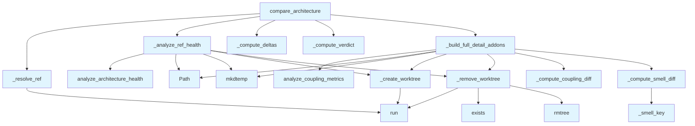

# File: `src/local_deepwiki/generators/analysis/architecture_compare.py`

## File Overview

This file implements the core logic for comparing the architectural health of a codebase at two different points in time (git refs). It is designed to support analysis of how the architecture of a project evolves, identifying improvements or regressions in key metrics such as complexity, coupling, and smell detection.

The module uses Git worktrees to isolate and analyze each reference without affecting the current working tree, ensuring safe execution in environments where the working directory is not a detached state.

## Key Concepts

### Git Worktree Isolation
The system uses `git worktree` to create isolated working trees for each git reference being analyzed. This is essential to avoid interference with the current working tree and ensures accurate analysis of historical states.

### Architecture Health Metrics
The comparison is based on architecture health reports, which include:
- Overall score and grade
- Dimensional scores (complexity, coupling, smells, layers)
- High-severity smells and their resolution
- Coupling metrics for modules

### Delta Computation
The module computes deltas for both overall and dimensional scores to determine trends. A threshold-based system is used to classify changes as "improved", "degraded", or "unchanged".

### Smell and Coupling Diffing
The module supports diffing of high-severity smells and high-distance coupling modules between the base and head references, providing detailed insights into what has changed.

## Integration

This module is part of the `local_deepwiki.generators.analysis` package and integrates with:
- [`analyze_architecture_health`](architecture_health.md) from `local_deepwiki.generators.analysis.architecture_health` for health report generation
- [`analyze_coupling_metrics`](coupling.md) from `local_deepwiki.generators.analysis.coupling` for coupling analysis

It is used by:
- `analysis_architecture` (CLI tool)
- `tool_args` (CLI argument parsing)
- `test_architecture_compare` (test suite)

It is called by functions in the CLI entry point (`src/local_deepwiki/cli/main.py`) and test utilities, making it a central component in the architecture analysis workflow.

## Design Notes

### Safety and Isolation
The use of `git worktree` is a key design choice to avoid modifying the working directory. This is crucial in environments where the working tree may be shallow or where changes might be present that could affect analysis.

### Error Handling
The module gracefully handles failures in Git operations by returning error messages rather than crashing. This makes it robust in CI/CD or automated environments where Git commands may not succeed due to shallow clones or other issues.

### Threshold-Based Verdicts
The `_compute_verdict` function uses a configurable threshold (`_VERDICT_THRESHOLD`) to determine if a change in architecture is significant. This provides a balance between noise and signal in the output.

### Temp Directory Management
The code ensures cleanup of temporary directories using `shutil.rmtree` in `_remove_worktree`, even if Git commands fail. This prevents disk space leaks in long-running or error-prone environments.

### Extensibility
The `detail_level` parameter in `compare_architecture` allows for different levels of output detail. This supports both lightweight reporting and full diagnostic information, making the module flexible for various use cases.

### Performance Considerations
The module avoids unnecessary analysis by using temporary worktrees only when needed (e.g., when `git_ref != "HEAD"`), and reuses the working tree when analyzing `HEAD`. This balances accuracy with performance.

## API Reference

### Functions

#### `compare_architecture`

```python
def compare_architecture(repo_path: Path, project_name: str, base_ref: str = "HEAD~1", head_ref: str = "HEAD", detail_level: str = "standard") -> dict[str, Any]
```

Compare architecture health between two git refs.


| Parameter | Type | Default | Description |
|-----------|------|---------|-------------|
| `repo_path` | `Path` | - | Repository root (must be a git repo). |
| `project_name` | `str` | - | Project name for display. |
| `base_ref` | `str` | `"HEAD~1"` | Git ref for the baseline (default: HEAD~1). |
| `head_ref` | `str` | `"HEAD"` | Git ref for the comparison target (default: HEAD). |
| `detail_level` | `str` | `"standard"` | - |

**Returns:** `dict[str, Any]`


<details>
<summary>View Source (lines 274-352) | <a href="https://github.com/UrbanDiver/local-deepwiki-mcp/blob/main/src/local_deepwiki/generators/analysis/architecture_compare.py#L274-L352">GitHub</a></summary>

```python
def compare_architecture(
    repo_path: Path,
    project_name: str,
    base_ref: str = "HEAD~1",
    head_ref: str = "HEAD",
    *,
    detail_level: str = "standard",
) -> dict[str, Any]:
    """Compare architecture health between two git refs.

    Args:
        repo_path: Repository root (must be a git repo).
        project_name: Project name for display.
        base_ref: Git ref for the baseline (default: HEAD~1).
        head_ref: Git ref for the comparison target (default: HEAD).

    Returns:
        Dict with base/head scores, deltas, and trend indicators.
    """
    base_sha = _resolve_ref(repo_path, base_ref)
    head_sha = _resolve_ref(repo_path, head_ref)

    if not base_sha:
        return {"status": "error", "message": f"Could not resolve git ref: {base_ref}"}
    if not head_sha:
        return {"status": "error", "message": f"Could not resolve git ref: {head_ref}"}

    head_result = _analyze_ref_health(
        repo_path,
        project_name,
        head_ref,
        "deepwiki_head_",
        "Cannot create worktree for ",
    )
    if isinstance(head_result, str):
        return {"status": "error", "message": head_result}
    head_health = head_result

    base_result = _analyze_ref_health(
        repo_path,
        project_name,
        base_ref,
        "deepwiki_base_",
        f"Cannot create worktree for {base_ref}. Is this a shallow clone? ref=",
    )
    if isinstance(base_result, str):
        return {"status": "error", "message": base_result}
    base_health = base_result

    deltas = _compute_deltas(base_health, head_health)
    verdict = _compute_verdict(deltas)

    logger.info(
        "Architecture comparison %s..%s: %s -> %s (delta: %+.1f)",
        base_sha,
        head_sha,
        deltas["base_grade"],
        deltas["head_grade"],
        deltas["overall_delta"],
    )

    result: dict[str, Any] = {
        "status": "success",
        "project_name": project_name,
        "base_ref": {"ref": base_ref, "sha": base_sha},
        "head_ref": {"ref": head_ref, "sha": head_sha},
        "deltas": deltas,
        "verdict": verdict,
        "base_health": base_health.get("overall", {}),
        "head_health": head_health.get("overall", {}),
    }

    if detail_level == "full":
        result = {
            **result,
            **_build_full_detail_addons(repo_path, base_ref, base_health, head_health),
        }

    return result
```

</details>

## Call Graph



## Used By

Functions and methods in this file and their callers:

- **`Path`**: called by `_analyze_ref_health`, `_build_full_detail_addons`
- **`_analyze_ref_health`**: called by `compare_architecture`
- **`_build_full_detail_addons`**: called by `compare_architecture`
- **`_compute_coupling_diff`**: called by `_build_full_detail_addons`
- **`_compute_deltas`**: called by `compare_architecture`
- **`_compute_smell_diff`**: called by `_build_full_detail_addons`
- **`_compute_verdict`**: called by `compare_architecture`
- **`_create_worktree`**: called by `_analyze_ref_health`, `_build_full_detail_addons`
- **`_remove_worktree`**: called by `_analyze_ref_health`, `_build_full_detail_addons`
- **`_resolve_ref`**: called by `compare_architecture`
- **`_smell_key`**: called by `_compute_smell_diff`
- **[`analyze_architecture_health`](architecture_health.md)**: called by `_analyze_ref_health`
- **[`analyze_coupling_metrics`](coupling.md)**: called by `_build_full_detail_addons`
- **`exists`**: called by `_remove_worktree`
- **`mkdtemp`**: called by `_analyze_ref_health`, `_build_full_detail_addons`
- **`rmtree`**: called by `_remove_worktree`
- **`run`**: called by `_create_worktree`, `_remove_worktree`, `_resolve_ref`

## Usage Examples

*Examples extracted from test files*

### Example: `architecture_compare`

From `test_architecture_compare.py::test_compute_deltas_improvement`:

```python
from local_deepwiki.generators.analysis.architecture_compare import (
        _compute_deltas,
    )

    base = _make_health(70.0, "C")
    head = _make_health(85.0, "B")

    result = _compute_deltas(base, head)

    assert result["overall_delta"] == 15.0
    assert result["base_grade"] == "C"
```

### Example: `_compute_deltas`

From `test_architecture_compare.py::test_compute_deltas_improvement`:

```python
_compute_deltas,
)

base = _make_health(70.0, "C")
head = _make_health(85.0, "B")

result = _compute_deltas(base, head)

assert result["overall_delta"] == 15.0
assert result["base_grade"] == "C"
```

### Example: `_compute_deltas`

From `test_architecture_compare.py::test_compute_deltas_degradation`:

```python
_compute_deltas,
)

base = _make_health(90.0, "A")
head = _make_health(60.0, "C")

result = _compute_deltas(base, head)

assert result["overall_delta"] == -30.0
assert result["dimensions"]["coupling"]["trend"] == "degraded"
```

### Example: `_resolve_ref`

From `test_architecture_compare.py::test_resolve_ref_valid`:

```python
from local_deepwiki.generators.analysis.architecture_compare import _resolve_ref

    repo = tmp_path / "repo"
    repo.mkdir()
    _git(repo, "init")
    _git(repo, "config", "user.email", "test@example.com")
    _git(repo, "config", "user.name", "Test")
    (repo / "f.py").write_text("x = 1\n")
    _git(repo, "add", "f.py")
    _git(repo, "commit", "-m", "init")

    sha = _resolve_ref(repo, "HEAD")
    assert sha is not None
    assert len(sha) >= 7  # short SHA
```

### Example: `_resolve_ref`

From `test_architecture_compare.py::test_resolve_ref_invalid`:

```python
from local_deepwiki.generators.analysis.architecture_compare import _resolve_ref

    repo = tmp_path / "repo"
    repo.mkdir()
    _git(repo, "init")

    sha = _resolve_ref(repo, "nonexistent-branch")
    assert sha is None
```


## Last Modified

| Entity | Type | Author | Date | Commit |
|--------|------|--------|------|--------|
| `_analyze_ref_health` | function | Brian Breidenbach | yesterday | `29ae780` refactor: decompose long me... |
| `_build_full_detail_addons` | function | Brian Breidenbach | yesterday | `29ae780` refactor: decompose long me... |
| `compare_architecture` | function | Brian Breidenbach | yesterday | `29ae780` refactor: decompose long me... |
| `_compute_coupling_diff` | function | Brian Breidenbach | 3 days ago | `37320f0` feat: add detail_level to c... |
| `_compute_smell_diff` | function | Brian Breidenbach | 3 days ago | `37320f0` feat: add detail_level to c... |
| `_smell_key` | function | Brian Breidenbach | 3 days ago | `37320f0` feat: add detail_level to c... |
| `_compute_verdict` | function | Brian Breidenbach | 3 days ago | `95e3776` feat: add verdict to compar... |
| `_create_worktree` | function | Brian Breidenbach | 1 week ago | `38d706a` feat: add architecture_heal... |
| `_remove_worktree` | function | Brian Breidenbach | 1 week ago | `38d706a` feat: add architecture_heal... |
| `_resolve_ref` | function | Brian Breidenbach | 1 week ago | `38d706a` feat: add architecture_heal... |
| `_compute_deltas` | function | Brian Breidenbach | 1 week ago | `38d706a` feat: add architecture_heal... |

## Additional Source Code

Source code for functions and methods not listed in the API Reference above.

#### `_create_worktree`

<details>
<summary>View Source (lines 25-42) | <a href="https://github.com/UrbanDiver/local-deepwiki-mcp/blob/main/src/local_deepwiki/generators/analysis/architecture_compare.py#L25-L42">GitHub</a></summary>

```python
def _create_worktree(repo_path: Path, ref: str, target_dir: Path) -> bool:
    """Create a detached git worktree at *ref* in *target_dir*."""
    try:
        subprocess.run(
            ["git", "worktree", "add", "--detach", str(target_dir), ref],
            cwd=str(repo_path),
            capture_output=True,
            timeout=_GIT_TIMEOUT,
            check=True,
        )
        return True
    except (
        subprocess.CalledProcessError,
        subprocess.TimeoutExpired,
        FileNotFoundError,
    ) as e:
        logger.warning("Failed to create worktree for %s: %s", ref, e)
        return False
```

</details>


#### `_remove_worktree`

<details>
<summary>View Source (lines 45-59) | <a href="https://github.com/UrbanDiver/local-deepwiki-mcp/blob/main/src/local_deepwiki/generators/analysis/architecture_compare.py#L45-L59">GitHub</a></summary>

```python
def _remove_worktree(repo_path: Path, target_dir: Path) -> None:
    """Remove a git worktree and clean up."""
    try:
        subprocess.run(
            ["git", "worktree", "remove", "--force", str(target_dir)],
            cwd=str(repo_path),
            capture_output=True,
            timeout=_GIT_TIMEOUT,
            check=False,
        )
    except (subprocess.TimeoutExpired, FileNotFoundError):
        pass
    # Belt and suspenders: remove directory if worktree removal failed
    if target_dir.exists():
        shutil.rmtree(target_dir, ignore_errors=True)
```

</details>


#### `_resolve_ref`

<details>
<summary>View Source (lines 62-79) | <a href="https://github.com/UrbanDiver/local-deepwiki-mcp/blob/main/src/local_deepwiki/generators/analysis/architecture_compare.py#L62-L79">GitHub</a></summary>

```python
def _resolve_ref(repo_path: Path, ref: str) -> str | None:
    """Resolve a git ref to a short SHA."""
    try:
        result = subprocess.run(
            ["git", "rev-parse", "--short", ref],
            cwd=str(repo_path),
            capture_output=True,
            text=True,
            timeout=_GIT_TIMEOUT,
            check=True,
        )
        return result.stdout.strip()
    except (
        subprocess.CalledProcessError,
        subprocess.TimeoutExpired,
        FileNotFoundError,
    ):
        return None
```

</details>


#### `_compute_deltas`

<details>
<summary>View Source (lines 82-125) | <a href="https://github.com/UrbanDiver/local-deepwiki-mcp/blob/main/src/local_deepwiki/generators/analysis/architecture_compare.py#L82-L125">GitHub</a></summary>

```python
def _compute_deltas(
    base: dict[str, Any],
    head: dict[str, Any],
) -> dict[str, Any]:
    """Compute metric deltas between base and head health reports."""
    base_overall = base.get("overall", {})
    head_overall = head.get("overall", {})

    dimension_deltas: dict[str, Any] = {}
    for dim in ("complexity", "coupling", "smells", "layers"):
        base_score = base_overall.get("dimensions", {}).get(dim, {}).get("score", 0)
        head_score = head_overall.get("dimensions", {}).get(dim, {}).get("score", 0)
        delta = round(head_score - base_score, 1)
        dimension_deltas[dim] = {
            "base_score": base_score,
            "head_score": head_score,
            "delta": delta,
            "trend": (
                "improved" if delta > 0 else "degraded" if delta < 0 else "unchanged"
            ),
        }

    # New and resolved smells (tracked by file + line + type identity)
    base_smells = {
        (s.get("file"), s.get("line"), s.get("type"))
        for s in base.get("top_findings", {}).get("high_severity_smells", [])
    }
    head_smells = {
        (s.get("file"), s.get("line"), s.get("type"))
        for s in head.get("top_findings", {}).get("high_severity_smells", [])
    }
    new_smell_keys = head_smells - base_smells
    resolved_smell_keys = base_smells - head_smells

    return {
        "overall_delta": round(
            head_overall.get("score", 0) - base_overall.get("score", 0), 1
        ),
        "base_grade": base_overall.get("grade", "?"),
        "head_grade": head_overall.get("grade", "?"),
        "dimensions": dimension_deltas,
        "new_high_smells": len(new_smell_keys),
        "resolved_high_smells": len(resolved_smell_keys),
    }
```

</details>


#### `_compute_verdict`

<details>
<summary>View Source (lines 133-163) | <a href="https://github.com/UrbanDiver/local-deepwiki-mcp/blob/main/src/local_deepwiki/generators/analysis/architecture_compare.py#L133-L163">GitHub</a></summary>

```python
def _compute_verdict(deltas: dict[str, Any]) -> dict[str, Any]:
    """Compute architecture verdict from deltas."""
    overall_delta = deltas.get("overall_delta", 0)
    dims = deltas.get("dimensions", {})

    improved: list[str] = []
    degraded: list[str] = []
    unchanged: list[str] = []

    for dim_name, dim_data in dims.items():
        delta = dim_data.get("delta", 0)
        if delta > _VERDICT_THRESHOLD:
            improved.append(dim_name)
        elif delta < -_VERDICT_THRESHOLD:
            degraded.append(dim_name)
        else:
            unchanged.append(dim_name)

    if overall_delta > _VERDICT_THRESHOLD:
        summary = f"Architecture improved (+{overall_delta})"
    elif overall_delta < -_VERDICT_THRESHOLD:
        summary = f"Architecture degraded ({overall_delta})"
    else:
        summary = f"No significant change ({overall_delta:+.1f})"

    return {
        "summary": summary,
        "improved": improved,
        "degraded": degraded,
        "unchanged": unchanged,
    }
```

</details>


#### `_compute_coupling_diff`

<details>
<summary>View Source (lines 166-196) | <a href="https://github.com/UrbanDiver/local-deepwiki-mcp/blob/main/src/local_deepwiki/generators/analysis/architecture_compare.py#L166-L196">GitHub</a></summary>

```python
def _compute_coupling_diff(
    base_metrics: list[dict[str, Any]],
    head_metrics: list[dict[str, Any]],
) -> dict[str, Any]:
    """Diff high-distance modules between base and head coupling metrics."""
    base_high = {
        m["module"]: m["distance"]
        for m in base_metrics
        if m.get("distance", 0) > _HIGH_DISTANCE_THRESHOLD
    }
    head_high = {
        m["module"]: m["distance"]
        for m in head_metrics
        if m.get("distance", 0) > _HIGH_DISTANCE_THRESHOLD
    }
    new_high = [
        {"module": mod, "distance": dist}
        for mod, dist in head_high.items()
        if mod not in base_high
    ]
    resolved_high = [
        {"module": mod, "distance": dist}
        for mod, dist in base_high.items()
        if mod not in head_high
    ]
    return {
        "base_modules": len(base_metrics),
        "head_modules": len(head_metrics),
        "new_high_distance": new_high,
        "resolved_high_distance": resolved_high,
    }
```

</details>


#### `_compute_smell_diff`

<details>
<summary>View Source (lines 199-224) | <a href="https://github.com/UrbanDiver/local-deepwiki-mcp/blob/main/src/local_deepwiki/generators/analysis/architecture_compare.py#L199-L224">GitHub</a></summary>

```python
def _compute_smell_diff(
    base_health: dict[str, Any],
    head_health: dict[str, Any],
) -> dict[str, Any]:
    """Diff high-severity smells between base and head health reports."""

    def _smell_key(s: dict[str, Any]) -> tuple[str, str, str]:
        return (s.get("type", ""), s.get("file", ""), s.get("entity", ""))

    base_smells = base_health.get("top_findings", {}).get("high_severity_smells", [])
    head_smells = head_health.get("top_findings", {}).get("high_severity_smells", [])
    base_keys = {_smell_key(s) for s in base_smells}
    head_keys = {_smell_key(s) for s in head_smells}
    new_keys = head_keys - base_keys
    resolved_keys = base_keys - head_keys
    new_smells = [
        {"type": s.get("type"), "file": s.get("file"), "entity": s.get("entity")}
        for s in head_smells
        if _smell_key(s) in new_keys
    ]
    resolved_smells = [
        {"type": s.get("type"), "file": s.get("file"), "entity": s.get("entity")}
        for s in base_smells
        if _smell_key(s) in resolved_keys
    ]
    return {"new_smells": new_smells, "resolved_smells": resolved_smells}
```

</details>


#### `_smell_key`

<details>
<summary>View Source (lines 205-206) | <a href="https://github.com/UrbanDiver/local-deepwiki-mcp/blob/main/src/local_deepwiki/generators/analysis/architecture_compare.py#L205-L206">GitHub</a></summary>

```python
def _smell_key(s: dict[str, Any]) -> tuple[str, str, str]:
        return (s.get("type", ""), s.get("file", ""), s.get("entity", ""))
```

</details>


#### `_analyze_ref_health`

<details>
<summary>View Source (lines 227-247) | <a href="https://github.com/UrbanDiver/local-deepwiki-mcp/blob/main/src/local_deepwiki/generators/analysis/architecture_compare.py#L227-L247">GitHub</a></summary>

```python
def _analyze_ref_health(
    repo_path: Path,
    project_name: str,
    git_ref: str,
    tmp_prefix: str,
    error_msg_prefix: str,
) -> dict[str, Any] | str:
    """Analyze architecture health for a git ref via a temporary worktree.

    Returns the health dict on success, or an error message string on failure.
    Uses the working tree directly when ``git_ref == "HEAD"``.
    """
    if git_ref == "HEAD":
        return analyze_architecture_health(repo_path, project_name)
    tmp = Path(tempfile.mkdtemp(prefix=tmp_prefix))
    try:
        if not _create_worktree(repo_path, git_ref, tmp):
            return f"{error_msg_prefix}{git_ref}"
        return analyze_architecture_health(tmp, project_name)
    finally:
        _remove_worktree(repo_path, tmp)
```

</details>


#### `_build_full_detail_addons`

<details>
<summary>View Source (lines 250-271) | <a href="https://github.com/UrbanDiver/local-deepwiki-mcp/blob/main/src/local_deepwiki/generators/analysis/architecture_compare.py#L250-L271">GitHub</a></summary>

```python
def _build_full_detail_addons(
    repo_path: Path,
    base_ref: str,
    base_health: dict[str, Any],
    head_health: dict[str, Any],
) -> dict[str, Any]:
    """Compute coupling diff and smell diff for ``detail_level='full'``."""
    from local_deepwiki.generators.analysis.coupling import analyze_coupling_metrics

    head_coupling = analyze_coupling_metrics(repo_path).get("metrics", [])
    tmp_base = Path(tempfile.mkdtemp(prefix="deepwiki_coupling_"))
    try:
        if _create_worktree(repo_path, base_ref, tmp_base):
            base_coupling = analyze_coupling_metrics(tmp_base).get("metrics", [])
        else:
            base_coupling = []
    finally:
        _remove_worktree(repo_path, tmp_base)
    return {
        "coupling_changes": _compute_coupling_diff(base_coupling, head_coupling),
        "smell_diff": _compute_smell_diff(base_health, head_health),
    }
```

</details>

## Relevant Source Files

- `src/local_deepwiki/generators/analysis/architecture_compare.py:25-42`
