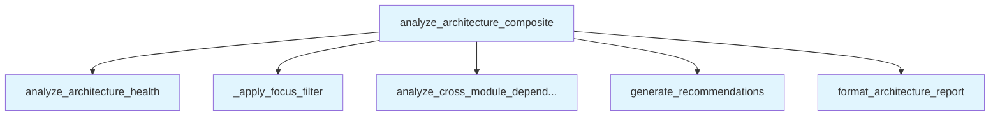

# File: `src/local_deepwiki/generators/analysis/architecture_composite.py`

## File Overview

This file serves as the **composite orchestrator** for architecture analysis. It coordinates multiple sub-analyses — such as architecture health, module dependencies, and recommendations — to produce a structured, narrative report. The module is designed to be **template-driven**, avoiding any LLM-based synthesis and relying entirely on structured data and pre-defined formatting logic.

The file is called by `analysis_architecture` and integrates with other analysis modules in the `local_deepwiki.generators.analysis` package. It acts as a **coordinator** in a pipeline of analysis tasks, gathering results from individual analyzers and combining them into a unified output.

## Key Concepts

### Composite Analysis Pattern
The core design pattern used here is **composite analysis**, where a single entry point (`analyze_architecture_composite`) orchestrates several distinct analyses:
- [`analyze_architecture_health`](architecture_health.md)
- [`analyze_cross_module_dependencies`](module_dependencies.md)
- [`generate_recommendations`](recommendations.md)

This pattern allows for modular, reusable analysis components that can be independently developed and tested, while being composed into a larger, cohesive report.

### Template-Based Reporting
The output is **not generated using LLMs** but instead relies on [`format_architecture_report`](architecture_report.md), which applies a structured template to the collected data. This ensures **reproducibility**, **consistency**, and **no dependency on external language models**.

### Focus Filtering
The function `_apply_focus_filter` enables **dimension-specific analysis**. It allows users to focus on particular aspects of the architecture, such as complexity or coupling, by trimming the results to relevant categories. This is a **design choice** to provide flexibility without increasing computational overhead unnecessarily.

## Integration

This file is part of the `local_deepwiki.generators.analysis` module and integrates with:
- `architecture_health.py`: Provides health metrics and top findings.
- `module_dependencies.py`: Identifies cross-module dependencies.
- `recommendations.py`: Generates actionable recommendations.
- `architecture_report.py`: Formats the final narrative report.

It is **called by** `analysis_architecture`, which is likely a CLI command or higher-level analysis driver. The function is designed to be **self-contained** and **reusable**, with no external dependencies beyond the standard library and the local analysis modules.

## Design Notes

### Detail Level and Performance Trade-offs
The `detail_level` parameter controls how much data is collected and included in the final report:
- `summary`: Reduces top findings to 3 items and disables dependency analysis.
- `standard`: Uses 5 top findings and includes dependency analysis only if focus is not on coupling.
- `full`: Uses 10 top findings and includes full dependency analysis.

This design balances **performance** and **comprehensiveness** by avoiding unnecessary computation when less detail is requested.

### Focus Filtering Implementation
The `_apply_focus_filter` function is a **lightweight filtering mechanism** that selectively retains findings based on a focus dimension. It preserves the overall health scores but trims the `top_findings` dictionary to only include relevant keys. This approach avoids recomputing or re-analyzing data and supports **interactive exploration** of different architectural aspects.

### No LLM Dependency
All processing is **template-based** and **local**, ensuring that:
- The output is deterministic
- No external API calls are made
- The tool can be used in environments without internet access or LLM access

This makes it suitable for **CI/CD pipelines** and **offline analysis**.

## API Reference

### Functions

#### `analyze_architecture_composite`

```python
def analyze_architecture_composite(repo_path: Path, project_name: str, detail_level: str = "standard", focus: str = "all") -> dict[str, Any]
```

Run composite architecture analysis and return narrative report.


| Parameter | Type | Default | Description |
|-----------|------|---------|-------------|
| `repo_path` | `Path` | - | Path to the repository. |
| `project_name` | `str` | - | Name for display. |
| `detail_level` | `str` | `"standard"` | "summary", "standard", or "full". |
| `focus` | `str` | `"all"` | "all", "complexity", "coupling", or "smells". |

**Returns:** `dict[str, Any]`


<details>
<summary>View Source (lines 17-89) | <a href="https://github.com/UrbanDiver/local-deepwiki-mcp/blob/main/src/local_deepwiki/generators/analysis/architecture_composite.py#L17-L89">GitHub</a></summary>

```python
def analyze_architecture_composite(
    repo_path: Path,
    project_name: str,
    *,
    detail_level: str = "standard",
    focus: str = "all",
) -> dict[str, Any]:
    """Run composite architecture analysis and return narrative report.

    Args:
        repo_path: Path to the repository.
        project_name: Name for display.
        detail_level: "summary", "standard", or "full".
        focus: "all", "complexity", "coupling", or "smells".

    Returns:
        Dict with status, report (markdown string), and raw data.
    """
    from local_deepwiki.generators.analysis.architecture_health import (
        analyze_architecture_health,
    )
    from local_deepwiki.generators.analysis.module_dependencies import (
        analyze_cross_module_dependencies,
    )

    top_n_map = {"summary": 3, "standard": 5, "full": 10}
    top_findings = top_n_map.get(detail_level, 5)

    health = analyze_architecture_health(
        repo_path,
        project_name,
        top_findings=top_findings,
    )

    if focus != "all":
        health = _apply_focus_filter(health, focus)

    deps: dict[str, Any] | None = None
    if detail_level != "summary" and focus in ("all", "coupling"):
        deps = analyze_cross_module_dependencies(
            repo_path=repo_path,
            min_edge_weight=3,
        )

    # Generate template-only recommendations (no LLM)
    recs_count = {"summary": 0, "standard": 5, "full": 10}.get(detail_level, 5)
    recommendations: list[dict[str, Any]] = []
    if recs_count > 0:
        from local_deepwiki.generators.analysis.recommendations import (
            generate_recommendations,
        )

        recs_result = generate_recommendations(
            repo_path,
            health_data=health,
            max_items=recs_count,
        )
        recommendations = recs_result.get("recommendations", [])

    report = format_architecture_report(
        health,
        deps,
        detail_level=detail_level,
        recommendations=recommendations,
    )

    return {
        "status": "success",
        "project_name": project_name,
        "report": report,
        "overall": health.get("overall", {}),
        "tool": "analyze_architecture",
    }
```

</details>

## Call Graph



## Used By

Functions and methods in this file and their callers:

- **`_apply_focus_filter`**: called by `analyze_architecture_composite`
- **[`analyze_architecture_health`](architecture_health.md)**: called by `analyze_architecture_composite`
- **[`analyze_cross_module_dependencies`](module_dependencies.md)**: called by `analyze_architecture_composite`
- **[`format_architecture_report`](architecture_report.md)**: called by `analyze_architecture_composite`
- **[`generate_recommendations`](recommendations.md)**: called by `analyze_architecture_composite`

## Last Modified

| Entity | Type | Author | Date | Commit |
|--------|------|--------|------|--------|
| `analyze_architecture_composite` | function | Brian Breidenbach | 4 days ago | `e4d508c` feat: integrate template re... |
| `_apply_focus_filter` | function | Brian Breidenbach | 4 days ago | `133094f` feat: add analyze_architect... |

## Additional Source Code

Source code for functions and methods not listed in the API Reference above.

#### `_apply_focus_filter`

<details>
<summary>View Source (lines 92-109) | <a href="https://github.com/UrbanDiver/local-deepwiki-mcp/blob/main/src/local_deepwiki/generators/analysis/architecture_composite.py#L92-L109">GitHub</a></summary>

```python
def _apply_focus_filter(
    health: dict[str, Any],
    focus: str,
) -> dict[str, Any]:
    """Filter health results to only the focused dimension.

    Keeps overall scores but trims top_findings to the relevant category.
    """
    focus_to_findings = {
        "complexity": ["hotspots"],
        "coupling": [],
        "smells": ["high_severity_smells", "god_classes"],
    }
    keep_keys = focus_to_findings.get(focus, [])

    findings = health.get("top_findings", {})
    filtered_findings = {k: v for k, v in findings.items() if k in keep_keys}
    return {**health, "top_findings": filtered_findings}
```

</details>

## Relevant Source Files

- `src/local_deepwiki/generators/analysis/architecture_composite.py:17-89`
