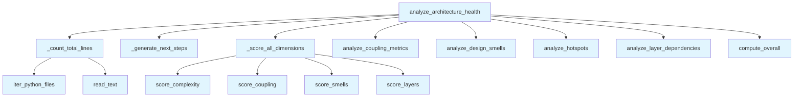

# File: `src/local_deepwiki/generators/analysis/architecture_health.py`

## File Overview

This file provides a composite architecture health analysis by orchestrating multiple granular analysis functions into a single, cohesive health report. It integrates results from hotspots, coupling, design smells, and layer dependency analysis to compute dimension-specific scores and an overall health grade.

The purpose of this module is to offer a unified, structured view of a project's architectural health without relying on LLMs — instead, it composes existing pure-analysis functions to produce a report that can be used for decision-making and prioritization.

## Key Concepts

### Composite Analysis Pattern
This module implements a **composite analysis pattern**, where several independent analysis functions are called in sequence and their results aggregated. Each dimension (complexity, coupling, smells, layers) is scored independently, then combined into an overall health score.

### Dimension Scoring
Each architectural dimension is scored using dedicated scoring functions:
- [`score_complexity`](health_scoring.md): Evaluates function-level complexity hotspots.
- [`score_coupling`](health_scoring.md): Scores module-level coupling metrics.
- [`score_smells`](health_scoring.md): Computes a score based on design smell density and line count.
- [`score_layers`](health_scoring.md): Scores adherence to layering principles.

This approach allows for granular diagnostics, enabling users to understand which aspects of the architecture are most problematic.

### Next Steps Generation
The `_generate_next_steps` function implements a **rule-based recommendation engine**. It identifies the worst-performing dimension and suggests relevant drill-down tools (e.g., `get_hotspots`, `get_design_smells`) based on that finding. It also provides recommendations based on thresholds for smell count and hotspot detection.

This design choice ensures that the output isn't just a score but actionable insights.

## Integration

### External Usage
This file is used by:
- `architecture_compare`
- `health_page`
- `test_architecture_health`

These callers invoke `analyze_architecture_health` to generate health reports for comparison or display in documentation pages.

### Internal Dependencies
This module integrates with several other analysis modules:
- [`analyze_coupling_metrics`](coupling.md) from `local_deepwiki.generators.analysis.coupling`
- [`analyze_design_smells`](design_smells.md) from `local_deepwiki.generators.analysis.design_smells`
- [`analyze_hotspots`](hotspots.md) from `local_deepwiki.generators.analysis.hotspots`
- [`analyze_layer_dependencies`](layer_analysis.md) from `local_deepwiki.generators.analysis.layer_analysis`
- [`iter_python_files`](source_filter.md) from `local_deepwiki.generators.analysis.source_filter`

It also uses scoring logic from `local_deepwiki.generators.analysis.health_scoring` and logging from `local_deepwiki.logging`.

### Context in the Codebase
This file is part of the `local_deepwiki.generators.analysis` package, which is responsible for generating various architectural and code quality reports. It fits into the larger CLI and wiki generation pipeline by being called from top-level CLI commands like `health_page` or `architecture_compare`, where it provides structured input for further processing or display.

## Design Notes

### Thresholds and Constants
Several thresholds are hardcoded:
- `_SCORE_WARN_THRESHOLD`: Used to determine when a dimension is considered "bad enough" to trigger a next-step recommendation.
- `_SMELL_THRESHOLD_MEDIUM` and `_SMELL_THRESHOLD_HIGH`: Used to decide whether to recommend actions based on smell count.
- `_MAX_NEXT_STEPS`: Limits the number of recommendations to 5.

These thresholds are chosen to balance between being too sensitive (generating too many steps) and too insensitive (missing important issues).

### Filtering Smells
In `analyze_architecture_health`, smells are filtered to include only those from the `src/` directory:
```python
src_smells = [
    s
    for s in smell_result.get("smells", [])
    if s.get("file", "").startswith("src/")
]
```
This ensures that test or generated code does not contribute to the smell score, focusing the analysis on actual source code quality.

### Line Counting
The `_count_total_lines` function uses [`iter_python_files`](source_filter.md) to enumerate source files and counts lines using `read_text`. It gracefully handles `OSError` exceptions, ensuring that a single unreadable file doesn't halt the entire analysis.

### Modular Scoring
Each dimension is scored in `_score_all_dimensions`, which calls dimension-specific scoring functions. This modular design allows for easy replacement or extension of scoring logic without affecting the overall orchestration.

### Logging
The module uses [`get_logger`](../../logging.md) to log the final grade and score for debugging and monitoring purposes, aligning with the project's logging strategy.

### No LLM Dependency
This module is designed to be pure analysis, avoiding LLM calls. This ensures deterministic, fast results and aligns with the project's focus on static code analysis.

## API Reference

### Functions

#### `analyze_architecture_health`

```python
def analyze_architecture_health(repo_path: Path, project_name: str, top_findings: int = _TOP_FINDINGS) -> dict[str, Any]
```

Run all architecture analyses and return a scored health report.


| Parameter | Type | Default | Description |
|-----------|------|---------|-------------|
| `repo_path` | `Path` | - | Repository root. |
| `project_name` | `str` | - | Project name for display. |
| `top_findings` | `int` | `_TOP_FINDINGS` | Number of top findings per category. |

**Returns:** `dict[str, Any]`


<details>
<summary>View Source (lines 148-220) | <a href="https://github.com/UrbanDiver/local-deepwiki-mcp/blob/main/src/local_deepwiki/generators/analysis/architecture_health.py#L148-L220">GitHub</a></summary>

```python
def analyze_architecture_health(
    repo_path: Path,
    project_name: str,
    *,
    top_findings: int = _TOP_FINDINGS,
) -> dict[str, Any]:
    """Run all architecture analyses and return a scored health report.

    Args:
        repo_path: Repository root.
        project_name: Project name for display.
        top_findings: Number of top findings per category.

    Returns:
        Dict with overall grade, dimension scores, and top findings.
    """
    total_lines = _count_total_lines(repo_path)

    # Run all analyses
    hotspot_result = analyze_hotspots(repo_path, metric="complexity", top_n=50)
    coupling_result = analyze_coupling_metrics(repo_path)
    smell_result = analyze_design_smells(repo_path, severity_threshold="medium")
    layer_result = analyze_layer_dependencies(repo_path, project_name)

    # Filter smells to source-only (exclude test/generated)
    src_smells = [
        s
        for s in smell_result.get("smells", [])
        if s.get("file", "").startswith("src/")
    ]

    dimensions = _score_all_dimensions(
        hotspot_result, coupling_result, src_smells, layer_result, total_lines
    )
    overall = compute_overall(dimensions)

    # Build top findings
    top_hotspots = hotspot_result.get("hotspots", [])[:top_findings]
    top_smells_high = [s for s in src_smells if s.get("severity") == "high"][
        :top_findings
    ]
    god_classes = [s for s in src_smells if s.get("type") == "god_class"]

    logger.info(
        "Architecture health: %s (%s) for %s",
        overall["grade"],
        overall["score"],
        repo_path,
    )

    top_findings_dict = {
        "hotspots": top_hotspots,
        "high_severity_smells": top_smells_high,
        "god_classes": god_classes,
        "layer_violations": layer_result.get("violations", [])[:top_findings],
    }
    stats_dict = {
        "total_lines": total_lines,
        "total_functions": hotspot_result.get("stats", {}).get("total_functions", 0),
        "files_scanned": hotspot_result.get("stats", {}).get("files_scanned", 0),
        "total_modules": coupling_result.get("stats", {}).get("total_modules", 0),
        "total_smells": len(src_smells),
    }
    next_steps = _generate_next_steps(overall, top_findings_dict, stats_dict)

    return {
        "status": "success",
        "project_name": project_name,
        "overall": overall,
        "top_findings": top_findings_dict,
        "stats": stats_dict,
        "next_steps": next_steps,
    }
```

</details>

## Call Graph



## Used By

Functions and methods in this file and their callers:

- **`_count_total_lines`**: called by `analyze_architecture_health`
- **`_generate_next_steps`**: called by `analyze_architecture_health`
- **`_score_all_dimensions`**: called by `analyze_architecture_health`
- **[`analyze_coupling_metrics`](coupling.md)**: called by `analyze_architecture_health`
- **[`analyze_design_smells`](design_smells.md)**: called by `analyze_architecture_health`
- **[`analyze_hotspots`](hotspots.md)**: called by `analyze_architecture_health`
- **[`analyze_layer_dependencies`](layer_analysis.md)**: called by `analyze_architecture_health`
- **[`compute_overall`](health_scoring.md)**: called by `analyze_architecture_health`
- **[`iter_python_files`](source_filter.md)**: called by `_count_total_lines`
- **`read_text`**: called by `_count_total_lines`
- **[`score_complexity`](health_scoring.md)**: called by `_score_all_dimensions`
- **[`score_coupling`](health_scoring.md)**: called by `_score_all_dimensions`
- **[`score_layers`](health_scoring.md)**: called by `_score_all_dimensions`
- **[`score_smells`](health_scoring.md)**: called by `_score_all_dimensions`

## Usage Examples

*Examples extracted from test files*

### Example: `architecture_health`

From `test_architecture_health.py::test_analyze_architecture_health_returns_required_keys`:

```python
from local_deepwiki.generators.analysis.architecture_health import (
        analyze_architecture_health,
    )

    result = analyze_architecture_health(simple_repo, "test-project")

    assert result["status"] == "success"
    assert result["project_name"] == "test-project"
```

### Example: `analyze_architecture_health`

From `test_architecture_health.py::test_analyze_architecture_health_returns_required_keys`:

```python
analyze_architecture_health,
)

result = analyze_architecture_health(simple_repo, "test-project")

assert result["status"] == "success"
assert result["project_name"] == "test-project"
```

### Example: `analyze_architecture_health`

From `test_architecture_health.py::test_analyze_architecture_health_overall_grade`:

```python
analyze_architecture_health,
)

result = analyze_architecture_health(simple_repo, "test-project")
overall = result["overall"]

assert "grade" in overall
assert overall["grade"] in ("A", "B", "C", "D", "F")
```


## Last Modified

| Entity | Type | Author | Date | Commit |
|--------|------|--------|------|--------|
| `_count_total_lines` | function | Brian Breidenbach | yesterday | `29ae780` refactor: decompose long me... |
| `_score_all_dimensions` | function | Brian Breidenbach | yesterday | `29ae780` refactor: decompose long me... |
| `analyze_architecture_health` | function | Brian Breidenbach | yesterday | `29ae780` refactor: decompose long me... |
| `_generate_next_steps` | function | Brian Breidenbach | 2 days ago | `3b8b067` feat: add next_steps guidan... |

## Additional Source Code

Source code for functions and methods not listed in the API Reference above.

#### `_generate_next_steps`

<details>
<summary>View Source (lines 45-115) | <a href="https://github.com/UrbanDiver/local-deepwiki-mcp/blob/main/src/local_deepwiki/generators/analysis/architecture_health.py#L45-L115">GitHub</a></summary>

```python
def _generate_next_steps(
    overall: dict[str, Any],
    top_findings: dict[str, Any],
    stats: dict[str, Any],
) -> list[dict[str, Any]]:
    """Generate suggested drill-down tool calls based on findings.

    Args:
        overall: Overall score dict with ``dimensions`` sub-dict.
        top_findings: Top findings dict (hotspots, smells, etc.).
        stats: Aggregate stats dict including ``total_smells``.

    Returns:
        List of up to 5 step dicts, each with ``tool``, ``args``, and ``reason``.
    """
    steps: list[dict[str, Any]] = []

    dimensions = overall.get("dimensions", {})
    if dimensions:
        worst_dim = min(dimensions, key=lambda d: dimensions[d].get("score", 100))
        worst_score = dimensions[worst_dim].get("score", 100)
        if worst_score < _SCORE_WARN_THRESHOLD:
            if worst_dim == "smells":
                steps.append(
                    {
                        "tool": "get_design_smells",
                        "args": {"severity_threshold": "high"},
                        "reason": f"Smells dimension scored {worst_score:.0f}/100",
                    }
                )
            elif worst_dim == "coupling":
                steps.append(
                    {
                        "tool": "get_coupling_metrics",
                        "args": {},
                        "reason": f"Coupling dimension scored {worst_score:.0f}/100",
                    }
                )

    hotspot_count = len(top_findings.get("hotspots", []))
    if hotspot_count > 0:
        steps.append(
            {
                "tool": "get_hotspots",
                "args": {"metric": "complexity", "top_n": 20},
                "reason": f"{hotspot_count} complexity hotspots detected",
            }
        )

    total_smells = stats.get("total_smells", 0)
    if total_smells > _SMELL_THRESHOLD_MEDIUM:
        steps.append(
            {
                "tool": "get_recommendations",
                "args": {"enrich": True},
                "reason": (
                    f"{total_smells} design smells found — get prioritized action items"
                ),
            }
        )

    if total_smells > _SMELL_THRESHOLD_HIGH:
        steps.append(
            {
                "tool": "get_hotspots",
                "args": {"metric": "params", "top_n": 10},
                "reason": "High smell count — check for parameter bloat",
            }
        )

    return steps[:_MAX_NEXT_STEPS]
```

</details>


#### `_count_total_lines`

<details>
<summary>View Source (lines 118-126) | <a href="https://github.com/UrbanDiver/local-deepwiki-mcp/blob/main/src/local_deepwiki/generators/analysis/architecture_health.py#L118-L126">GitHub</a></summary>

```python
def _count_total_lines(repo_path: Path) -> int:
    """Count total source lines across all Python files (excluding tests)."""
    total = 0
    for full_path, _rel in iter_python_files(repo_path, exclude_tests=True):
        try:
            total += full_path.read_text(encoding="utf-8", errors="replace").count("\n")
        except OSError:
            continue
    return total
```

</details>


#### `_score_all_dimensions`

<details>
<summary>View Source (lines 129-145) | <a href="https://github.com/UrbanDiver/local-deepwiki-mcp/blob/main/src/local_deepwiki/generators/analysis/architecture_health.py#L129-L145">GitHub</a></summary>

```python
def _score_all_dimensions(
    hotspot_result: dict[str, Any],
    coupling_result: dict[str, Any],
    src_smells: list[dict[str, Any]],
    layer_result: dict[str, Any],
    total_lines: int,
) -> dict[str, Any]:
    """Compute scored dimension dict from raw analysis results."""
    return {
        "complexity": score_complexity(
            hotspot_result.get("hotspots", []),
            hotspot_result.get("stats", {}).get("total_functions", 0),
        ),
        "coupling": score_coupling(coupling_result.get("metrics", [])),
        "smells": score_smells(src_smells, total_lines),
        "layers": score_layers(layer_result.get("violations", [])),
    }
```

</details>

## Relevant Source Files

- `src/local_deepwiki/generators/analysis/architecture_health.py:45-115`
