# File: `src/local_deepwiki/generators/analysis/architecture_health.py`

## File Overview

This file implements a composite architecture health analysis function that aggregates results from multiple specialized analysis modules. It serves as the central coordination point for running a suite of architectural health checks, including complexity hotspots, coupling metrics, design smells, and more, then computes a scored health report.

The module is designed to be a pure analysis function that composes existing analysis tools without making any LLM-based calls. It orchestrates the execution of various analysis functions, collects and filters their results, scores each dimension, and computes an overall health grade.

## Key Concepts

### Composite Analysis Pattern

This module uses the **composite analysis pattern**, where multiple individual analysis functions are orchestrated together to produce a holistic view of system health. Each analysis function ([`analyze_hotspots`](hotspots.md), [`analyze_coupling_metrics`](coupling.md), etc.) is responsible for a specific aspect of code architecture, and this module ties them together.

### Dimensional Scoring

The health report is scored across multiple dimensions:
- **Complexity**: Based on function hotspots
- **Coupling**: Based on coupling metrics
- **Smells**: Based on design smells found
- **Layers**: Based on layer dependency violations
- **Churn**: Based on file change frequency
- **Cohesion**: Based on class and module cohesion
- **Duplication**: Based on code duplication statistics
- **Testability**: Based on testability metrics
- **Maintainability**: Based on maintainability indicators

This approach allows for granular feedback on specific architectural concerns while providing an overall health score.

### Next Steps Generation

The `_generate_next_steps` function implements a **drill-down suggestion engine**. It analyzes the overall score and top findings to recommend follow-up tools or actions. This provides actionable insights to users based on the analysis results, helping them prioritize remediation efforts.

## Integration

### External Usage

This file is called by:
- `architecture_compare` (for comparing health across different versions or projects)
- `health_page` (for generating health reports in web interfaces)
- `test_architecture_health` (for unit testing the health analysis)

### Module Dependencies

This module imports and integrates analysis functions from:
- `local_deepwiki.generators.analysis.churn`
- `local_deepwiki.generators.analysis.cohesion`
- `local_deepwiki.generators.analysis.coupling`
- `local_deepwiki.generators.analysis.duplication`
- `local_deepwiki.generators.analysis.design_smells`
- `local_deepwiki.generators.analysis.health_scoring` (for scoring functions)
- `local_deepwiki.generators.analysis.maintainability`
- `local_deepwiki.generators.analysis.testability`
- `local_deepwiki.generators.analysis.hotspots`
- `local_deepwiki.generators.analysis.layer_analysis`
- `local_deepwiki.generators.analysis.source_filter` (for filtering Python files)

### Related Files

This module is part of the `local_deepwiki.generators.analysis` package and integrates with:
- `architecture_report.py` (likely for generating full reports)
- `health_scoring.py` (for scoring logic)
- `dependency_graph_data.py` (for dependency-related analysis)
- `tours.py` (for interactive analysis tours)

## Design Notes

### Modular Design and Reusability

The module is designed to be modular and reusable. Each analysis function is kept separate, which allows:
- Independent development and testing of each analysis
- Easy replacement or extension of individual analysis components
- Clear separation of concerns

### Error Handling

The module gracefully handles cases where certain analyses might fail, such as when [`analyze_churn`](churn.md) is run on a non-Git repository. It logs the failure and continues with other analyses, ensuring that one failure doesn't halt the entire health check.

### Filtering Smells

Design smells are filtered to include only those found in the `src/` directory, excluding test and generated code. This ensures that the health report focuses on the actual codebase and not on artifacts.

### Threshold-Based Next Steps

The `_generate_next_steps` function uses threshold-based logic to determine which suggestions to provide:
- If a dimension is below a warning threshold, it recommends drilling into that area
- If there are many smells, it suggests getting recommendations or checking for parameter bloat
- Limits the number of next steps to prevent overwhelming the user

This approach makes the tool both actionable and scalable, providing only the most relevant suggestions based on severity and volume of findings.

## API Reference

### Functions

#### `analyze_architecture_health`

```python
def analyze_architecture_health(repo_path: Path, project_name: str, top_findings: int = _TOP_FINDINGS) -> dict[str, Any]
```

Run all architecture analyses and return a scored health report.


| Parameter | Type | Default | Description |
|-----------|------|---------|-------------|
| `repo_path` | `Path` | - | Repository root. |
| `project_name` | `str` | - | Project name for display. |
| `top_findings` | `int` | `_TOP_FINDINGS` | Number of top findings per category. |

**Returns:** `dict[str, Any]`


<details>
<summary>View Source (lines 179-267) | <a href="https://github.com/UrbanDiver/local-deepwiki-mcp/blob/main/src/local_deepwiki/generators/analysis/architecture_health.py#L179-L267">GitHub</a></summary>

```python
def analyze_architecture_health(
    repo_path: Path,
    project_name: str,
    *,
    top_findings: int = _TOP_FINDINGS,
) -> dict[str, Any]:
    """Run all architecture analyses and return a scored health report.

    Args:
        repo_path: Repository root.
        project_name: Project name for display.
        top_findings: Number of top findings per category.

    Returns:
        Dict with overall grade, dimension scores, and top findings.
    """
    total_lines = _count_total_lines(repo_path)

    # Run all analyses
    hotspot_result = analyze_hotspots(repo_path, metric="complexity", top_n=50)
    coupling_result = analyze_coupling_metrics(repo_path)
    smell_result = analyze_design_smells(repo_path, severity_threshold="medium")
    layer_result = analyze_layer_dependencies(repo_path, project_name)
    try:
        churn_result = analyze_churn(repo_path)
    except Exception:
        logger.debug("Churn analysis skipped (not a git repo or git error)")
        churn_result = {"composite": [], "stats": {}}

    cohesion_result = analyze_cohesion(repo_path)

    duplication_result = analyze_duplication(repo_path)

    testability_result = analyze_testability(repo_path)

    maintainability_result = analyze_maintainability(repo_path)

    # Filter smells to source-only (exclude test/generated)
    src_smells = [s for s in smell_result.get("smells", []) if s.get("file", "").startswith("src/")]

    dimensions = _score_all_dimensions(
        hotspot_result,
        coupling_result,
        src_smells,
        layer_result,
        churn_result,
        cohesion_result,
        duplication_result,
        testability_result,
        maintainability_result,
        total_lines,
    )
    overall = compute_overall(dimensions)

    # Build top findings
    top_hotspots = hotspot_result.get("hotspots", [])[:top_findings]
    top_smells_high = [s for s in src_smells if s.get("severity") == "high"][:top_findings]
    god_classes = [s for s in src_smells if s.get("type") == "god_class"]

    logger.info(
        "Architecture health: %s (%s) for %s",
        overall["grade"],
        overall["score"],
        repo_path,
    )

    top_findings_dict = {
        "hotspots": top_hotspots,
        "high_severity_smells": top_smells_high,
        "god_classes": god_classes,
        "layer_violations": layer_result.get("violations", [])[:top_findings],
    }
    stats_dict = {
        "total_lines": total_lines,
        "total_functions": hotspot_result.get("stats", {}).get("total_functions", 0),
        "files_scanned": hotspot_result.get("stats", {}).get("files_scanned", 0),
        "total_modules": coupling_result.get("stats", {}).get("total_modules", 0),
        "total_smells": len(src_smells),
    }
    next_steps = _generate_next_steps(overall, top_findings_dict, stats_dict)

    return {
        "status": "success",
        "project_name": project_name,
        "overall": overall,
        "top_findings": top_findings_dict,
        "stats": stats_dict,
        "next_steps": next_steps,
    }
```

</details>

## Call Graph

```mermaid
flowchart TD
    N0[_count_total_lines]
    N1[_generate_next_steps]
    N2[_score_all_dimensions]
    N3[analyze_architecture_health]
    N4[analyze_churn]
    N5[analyze_cohesion]
    N6[analyze_coupling_metrics]
    N7[analyze_design_smells]
    N8[analyze_duplication]
    N9[analyze_hotspots]
    N10[analyze_layer_dependencies]
    N11[analyze_maintainability]
    N12[analyze_testability]
    N13[compute_overall]
    N14[iter_python_files]
    N15[read_text]
    N16[score_churn]
    N17[score_cohesion]
    N18[score_complexity]
    N19[score_coupling]
    N20[score_duplication]
    N21[score_layers]
    N22[score_maintainability]
    N23[score_smells]
    N24[score_testability]
    N0 --> N14
    N0 --> N15
    N2 --> N18
    N2 --> N19
    N2 --> N23
    N2 --> N21
    N2 --> N16
    N2 --> N17
    N2 --> N20
    N2 --> N24
    N2 --> N22
    N3 --> N0
    N3 --> N9
    N3 --> N6
    N3 --> N7
    N3 --> N10
    N3 --> N4
    N3 --> N5
    N3 --> N8
    N3 --> N12
    N3 --> N11
    N3 --> N2
    N3 --> N13
    N3 --> N1
    classDef func fill:#e1f5fe
    class N0,N1,N2,N3,N4,N5,N6,N7,N8,N9,N10,N11,N12,N13,N14,N15,N16,N17,N18,N19,N20,N21,N22,N23,N24 func
```



## Used By

Functions and methods in this file and their callers:

- **`_count_total_lines`**: called by `analyze_architecture_health`
- **`_generate_next_steps`**: called by `analyze_architecture_health`
- **`_score_all_dimensions`**: called by `analyze_architecture_health`
- **[`analyze_churn`](churn.md)**: called by `analyze_architecture_health`
- **[`analyze_cohesion`](cohesion.md)**: called by `analyze_architecture_health`
- **[`analyze_coupling_metrics`](coupling.md)**: called by `analyze_architecture_health`
- **[`analyze_design_smells`](design_smells.md)**: called by `analyze_architecture_health`
- **[`analyze_duplication`](duplication.md)**: called by `analyze_architecture_health`
- **[`analyze_hotspots`](hotspots.md)**: called by `analyze_architecture_health`
- **[`analyze_layer_dependencies`](layer_analysis.md)**: called by `analyze_architecture_health`
- **[`analyze_maintainability`](maintainability.md)**: called by `analyze_architecture_health`
- **[`analyze_testability`](testability.md)**: called by `analyze_architecture_health`
- **[`compute_overall`](health_scoring.md)**: called by `analyze_architecture_health`
- **[`iter_python_files`](source_filter.md)**: called by `_count_total_lines`
- **`read_text`**: called by `_count_total_lines`
- **[`score_churn`](health_scoring.md)**: called by `_score_all_dimensions`
- **[`score_cohesion`](health_scoring.md)**: called by `_score_all_dimensions`
- **[`score_complexity`](health_scoring.md)**: called by `_score_all_dimensions`
- **[`score_coupling`](health_scoring.md)**: called by `_score_all_dimensions`
- **[`score_duplication`](health_scoring.md)**: called by `_score_all_dimensions`
- **[`score_layers`](health_scoring.md)**: called by `_score_all_dimensions`
- **[`score_maintainability`](health_scoring.md)**: called by `_score_all_dimensions`
- **[`score_smells`](health_scoring.md)**: called by `_score_all_dimensions`
- **[`score_testability`](health_scoring.md)**: called by `_score_all_dimensions`

## Usage Examples

*Examples extracted from test files*

### Example: `architecture_health`

From `test_architecture_health.py::test_analyze_architecture_health_returns_required_keys`:

```python
from local_deepwiki.generators.analysis.architecture_health import (
        analyze_architecture_health,
    )

    result = analyze_architecture_health(simple_repo, "test-project")

    assert result["status"] == "success"
    assert result["project_name"] == "test-project"
```

### Example: `analyze_architecture_health`

From `test_architecture_health.py::test_analyze_architecture_health_returns_required_keys`:

```python
analyze_architecture_health,
)

result = analyze_architecture_health(simple_repo, "test-project")

assert result["status"] == "success"
assert result["project_name"] == "test-project"
```

### Example: `analyze_architecture_health`

From `test_architecture_health.py::test_analyze_architecture_health_overall_grade`:

```python
analyze_architecture_health,
)

result = analyze_architecture_health(simple_repo, "test-project")
overall = result["overall"]

assert "grade" in overall
assert overall["grade"] in ("A", "B", "C", "D", "F")
```


## Last Modified

| Entity | Type | Author | Date | Commit |
|--------|------|--------|------|--------|
| `_generate_next_steps` | function | Brian Breidenbach | today | `d50a656` feat: add maintainability i... |
| `analyze_architecture_health` | function | Brian Breidenbach | today | `d50a656` feat: add maintainability i... |
| `_score_all_dimensions` | function | Brian Breidenbach | today | `64e4b55` feat: add maintainability i... |
| `_count_total_lines` | function | Brian Breidenbach | 5 days ago | `29ae780` refactor: decompose long me... |

## Additional Source Code

Source code for functions and methods not listed in the API Reference above.

#### `_generate_next_steps`

<details>
<summary>View Source (lines 55-123) | <a href="https://github.com/UrbanDiver/local-deepwiki-mcp/blob/main/src/local_deepwiki/generators/analysis/architecture_health.py#L55-L123">GitHub</a></summary>

```python
def _generate_next_steps(
    overall: dict[str, Any],
    top_findings: dict[str, Any],
    stats: dict[str, Any],
) -> list[dict[str, Any]]:
    """Generate suggested drill-down tool calls based on findings.

    Args:
        overall: Overall score dict with ``dimensions`` sub-dict.
        top_findings: Top findings dict (hotspots, smells, etc.).
        stats: Aggregate stats dict including ``total_smells``.

    Returns:
        List of up to 5 step dicts, each with ``tool``, ``args``, and ``reason``.
    """
    steps: list[dict[str, Any]] = []

    dimensions = overall.get("dimensions", {})
    if dimensions:
        worst_dim = min(dimensions, key=lambda d: dimensions[d].get("score", 100))
        worst_score = dimensions[worst_dim].get("score", 100)
        if worst_score < _SCORE_WARN_THRESHOLD:
            if worst_dim == "smells":
                steps.append(
                    {
                        "tool": "get_design_smells",
                        "args": {"severity_threshold": "high"},
                        "reason": f"Smells dimension scored {worst_score:.0f}/100",
                    }
                )
            elif worst_dim == "coupling":
                steps.append(
                    {
                        "tool": "get_coupling_metrics",
                        "args": {},
                        "reason": f"Coupling dimension scored {worst_score:.0f}/100",
                    }
                )

    hotspot_count = len(top_findings.get("hotspots", []))
    if hotspot_count > 0:
        steps.append(
            {
                "tool": "get_hotspots",
                "args": {"metric": "complexity", "top_n": 20},
                "reason": f"{hotspot_count} complexity hotspots detected",
            }
        )

    total_smells = stats.get("total_smells", 0)
    if total_smells > _SMELL_THRESHOLD_MEDIUM:
        steps.append(
            {
                "tool": "get_recommendations",
                "args": {"enrich": True},
                "reason": (f"{total_smells} design smells found — get prioritized action items"),
            }
        )

    if total_smells > _SMELL_THRESHOLD_HIGH:
        steps.append(
            {
                "tool": "get_hotspots",
                "args": {"metric": "params", "top_n": 10},
                "reason": "High smell count — check for parameter bloat",
            }
        )

    return steps[:_MAX_NEXT_STEPS]
```

</details>


#### `_count_total_lines`

<details>
<summary>View Source (lines 126-134) | <a href="https://github.com/UrbanDiver/local-deepwiki-mcp/blob/main/src/local_deepwiki/generators/analysis/architecture_health.py#L126-L134">GitHub</a></summary>

```python
def _count_total_lines(repo_path: Path) -> int:
    """Count total source lines across all Python files (excluding tests)."""
    total = 0
    for full_path, _rel in iter_python_files(repo_path, exclude_tests=True):
        try:
            total += full_path.read_text(encoding="utf-8", errors="replace").count("\n")
        except OSError:
            continue
    return total
```

</details>


#### `_score_all_dimensions`

<details>
<summary>View Source (lines 137-176) | <a href="https://github.com/UrbanDiver/local-deepwiki-mcp/blob/main/src/local_deepwiki/generators/analysis/architecture_health.py#L137-L176">GitHub</a></summary>

```python
def _score_all_dimensions(
    hotspot_result: dict[str, Any],
    coupling_result: dict[str, Any],
    src_smells: list[dict[str, Any]],
    layer_result: dict[str, Any],
    churn_result: dict[str, Any],
    cohesion_result: dict[str, Any],
    duplication_result: dict[str, Any],
    testability_result: dict[str, Any],
    maintainability_result: dict[str, Any],
    total_lines: int,
) -> dict[str, Any]:
    """Compute scored dimension dict from raw analysis results."""
    return {
        "complexity": score_complexity(
            hotspot_result.get("hotspots", []),
            hotspot_result.get("stats", {}).get("total_functions", 0),
        ),
        "coupling": score_coupling(coupling_result.get("metrics", [])),
        "smells": score_smells(src_smells, total_lines),
        "layers": score_layers(layer_result.get("violations", [])),
        "churn": score_churn(
            churn_result.get("composite", []),
            stats=churn_result.get("stats", {}),
        ),
        "cohesion": score_cohesion(
            cohesion_result.get("class_cohesion", []),
            cohesion_result.get("module_cohesion", []),
            stats=cohesion_result.get("stats", {}),
        ),
        "duplication": score_duplication(
            stats=duplication_result.get("stats", {}),
        ),
        "testability": score_testability(
            stats=testability_result.get("stats", {}),
        ),
        "maintainability": score_maintainability(
            stats=maintainability_result.get("stats", {}),
        ),
    }
```

</details>

## Relevant Source Files

- `src/local_deepwiki/generators/analysis/architecture_health.py:55-123`
