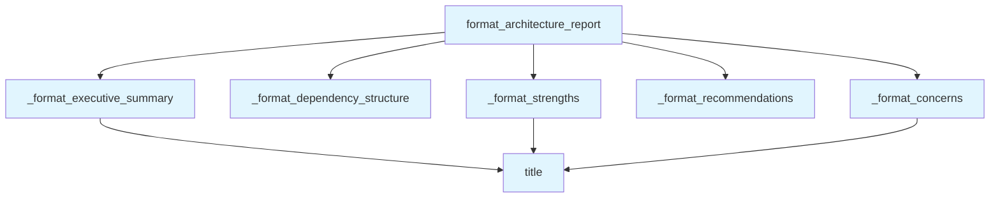

# File: `src/local_deepwiki/generators/analysis/architecture_report.py`

## File Overview

This module provides a narrative formatter for composite architecture analysis reports. It converts structured data from health checks and dependency analysis into a human-readable markdown report. The implementation is template-based and does not rely on language models.

The module is responsible for generating a structured, readable report that includes:
- Executive summary
- Strengths
- Concerns
- Dependency structure
- Recommendations

This design allows for consistent reporting across different analysis pipelines, with flexibility in detail level and inclusion of recommendations.

## Key Concepts

### Report Structure
The module uses a composition pattern to build the final report:
1. **Executive Summary**: Provides an overview of the overall health, including scores and key metrics.
2. **Strengths**: Highlights dimensions with high scores and architectural cleanliness.
3. **Concerns**: Identifies dimensions with low scores, complexity hotspots, and design smells.
4. **Dependency Structure**: Analyzes module dependencies, highlighting hubs and heavy dependencies.
5. **Recommendations**: Presents actionable suggestions for improvement.

### Threshold-based Filtering
The module implements threshold-based filtering for determining when to report strengths or concerns:
- `_STRENGTH_THRESHOLD`: Used to identify dimensions with high scores.
- `_CONCERN_THRESHOLD`: Used to identify dimensions with low scores.

These thresholds are not defined in this file, but are referenced in `_format_strengths` and `_format_concerns`. This design choice allows for easy tuning of sensitivity without modifying core logic.

### Markdown Generation
All formatting functions return markdown-formatted strings, ensuring consistency in report output. This approach avoids external dependencies for markdown generation and keeps the report generation lightweight and deterministic.

## Integration

This module is used by:
- `architecture_composite`: Likely a composite analysis handler that orchestrates multiple analysis steps and uses this module to format final output.
- `test_architecture_report`: Used in unit tests to verify report formatting logic.

The module imports `Any` from `typing` for type hints, but does not depend on any other project modules. It is designed to be a standalone formatter, with no internal dependencies beyond standard library functionality.

The integration is minimal and focused: the module is called with structured data (health checks, dependencies, recommendations) and returns a formatted markdown string. This makes it easy to plug into any analysis pipeline that produces the expected data structures.

## Design Notes

### Detail Level Control
The `format_architecture_report` function accepts a `detail_level` parameter with a default of `"standard"`. This allows callers to request a summary-only view by setting `detail_level="summary"`. This design choice provides flexibility for different audiences or use cases (e.g., quick overviews vs. detailed analysis).

### Conditional Section Inclusion
Sections are conditionally included based on data availability:
- Recommendations are only included if provided.
- Dependency structure is only included if dependency data is provided.
- Concerns and strengths sections are only included if there are relevant findings.

This prevents empty sections from cluttering the report and ensures that only relevant information is displayed.

### Data Truncation
For long lists (hotspots, smells, dependencies), the code truncates results to a maximum of 5 items. This prevents overly verbose reports and keeps the output manageable.

### Threshold Constants
The use of `_STRENGTH_THRESHOLD` and `_CONCERN_THRESHOLD` implies that these values are defined elsewhere in the codebase. This design choice allows for centralized configuration of sensitivity thresholds without requiring changes to this module's logic.

### No External Dependencies
The module does not rely on external libraries for markdown generation or formatting. This ensures that report generation is deterministic and does not require network access or additional dependencies.

### Data Robustness
All formatting functions use `.get()` with default values to prevent `KeyError` exceptions when data fields are missing. This makes the formatter robust to incomplete or inconsistent input data.

## API Reference

### Functions

#### `format_architecture_report`

```python
def format_architecture_report(health: dict[str, Any], deps: dict[str, Any] | None, detail_level: str = "standard", recommendations: list[dict[str, Any]] | None = None) -> str
```

Format architecture analysis data into a markdown narrative report.


| Parameter | Type | Default | Description |
|-----------|------|---------|-------------|
| `health` | `dict[str, Any]` | - | - |
| `deps` | `dict[str, Any] | None` | - | - |
| `detail_level` | `str` | `"standard"` | - |
| `recommendations` | `list[dict[str, Any]] | None` | `None` | - |

**Returns:** `str`


<details>
<summary>View Source (lines 15-36) | <a href="https://github.com/UrbanDiver/local-deepwiki-mcp/blob/main/src/local_deepwiki/generators/analysis/architecture_report.py#L15-L36">GitHub</a></summary>

```python
def format_architecture_report(
    health: dict[str, Any],
    deps: dict[str, Any] | None,
    *,
    detail_level: str = "standard",
    recommendations: list[dict[str, Any]] | None = None,
) -> str:
    """Format architecture analysis data into a markdown narrative report."""
    sections: list[str] = []
    sections.append(_format_executive_summary(health))

    if detail_level == "summary":
        return "\n\n".join(sections)

    sections.append(_format_strengths(health))
    sections.append(_format_concerns(health))
    if recommendations:
        sections.append(_format_recommendations(recommendations))
    if deps is not None:
        sections.append(_format_dependency_structure(deps))

    return "\n\n".join(s for s in sections if s)
```

</details>

## Call Graph



## Used By

Functions and methods in this file and their callers:

- **`_format_concerns`**: called by `format_architecture_report`
- **`_format_dependency_structure`**: called by `format_architecture_report`
- **`_format_executive_summary`**: called by `format_architecture_report`
- **`_format_recommendations`**: called by `format_architecture_report`
- **`_format_strengths`**: called by `format_architecture_report`
- **`title`**: called by `_format_concerns`, `_format_executive_summary`, `_format_strengths`

## Usage Examples

*Examples extracted from test files*

### Example: `architecture_report`

From `test_architecture_report.py::test_format_report_includes_executive_summary`:

```python
report = format_architecture_report(_make_health(76.5, "B"), _make_deps())
    assert "## Executive Summary" in report
    assert "B" in report
    assert "76.5" in report
```

### Example: `format_architecture_report`

From `test_architecture_report.py::test_format_report_includes_executive_summary`:

```python
report = format_architecture_report(_make_health(76.5, "B"), _make_deps())
    assert "## Executive Summary" in report
    assert "B" in report
    assert "76.5" in report
```

### Example: `format_architecture_report`

From `test_architecture_report.py::test_format_report_includes_strengths`:

```python
report = format_architecture_report(_make_health(90.0, "A"), _make_deps())
    assert "## Strengths" in report
```

### Recommendations are formatted as numbered list

From `test_architecture_report.py::test_format_recommendations_section`:

```python
_format_recommendations,
)

recs = [
    {
        "title": "Extract helpers from parse_node",
        "category": "complexity",
        "description": "CC=23, 145 lines",
        "file": "src/parser.py",
        "line": 42,
        "effort": "low",
        "impact": "high",
        "priority": 3.0,
    },
    {
        "title": "Split BigManager into focused components",
        "category": "smells",
        "description": "20 methods, 800 lines",
        "file": "src/big.py",
        "line": 1,
        "effort": "medium",
        "impact": "high",
        "priority": 1.5,
    },
]
```

### Empty recommendations returns empty string

From `test_architecture_report.py::test_format_recommendations_empty`:

```python
from local_deepwiki.generators.analysis.architecture_report import (
    _format_recommendations,
)

assert _format_recommendations([]) == ""
```


## Last Modified

| Entity | Type | Author | Date | Commit |
|--------|------|--------|------|--------|
| `format_architecture_report` | function | Brian Breidenbach | 4 days ago | `e4d508c` feat: integrate template re... |
| `_format_recommendations` | function | Brian Breidenbach | 4 days ago | `e4d508c` feat: integrate template re... |
| `_format_executive_summary` | function | Brian Breidenbach | 4 days ago | `88c7c2f` feat: add narrative formatt... |
| `_format_strengths` | function | Brian Breidenbach | 4 days ago | `88c7c2f` feat: add narrative formatt... |
| `_format_concerns` | function | Brian Breidenbach | 4 days ago | `88c7c2f` feat: add narrative formatt... |
| `_format_dependency_structure` | function | Brian Breidenbach | 4 days ago | `88c7c2f` feat: add narrative formatt... |

## Additional Source Code

Source code for functions and methods not listed in the API Reference above.

#### `_format_executive_summary`

<details>
<summary>View Source (lines 39-61) | <a href="https://github.com/UrbanDiver/local-deepwiki-mcp/blob/main/src/local_deepwiki/generators/analysis/architecture_report.py#L39-L61">GitHub</a></summary>

```python
def _format_executive_summary(health: dict[str, Any]) -> str:
    overall = health.get("overall", {})
    grade = overall.get("grade", "?")
    score = overall.get("score", 0)
    stats = health.get("stats", {})
    lines = stats.get("total_lines", 0)
    functions = stats.get("total_functions", 0)
    files = stats.get("files_scanned", 0)
    dims = overall.get("dimensions", {})

    dim_table = "| Dimension | Score | Grade |\n|-----------|-------|-------|\n"
    for dim_name in ("complexity", "coupling", "smells", "layers"):
        d = dims.get(dim_name, {})
        dim_table += (
            f"| {dim_name.title()} | {d.get('score', '?')} | {d.get('grade', '?')} |\n"
        )

    return (
        f"## Executive Summary\n\n"
        f"**Overall: {grade} ({score}/100)** — "
        f"{lines:,} lines, {functions:,} functions across {files} files.\n\n"
        f"{dim_table}"
    )
```

</details>


#### `_format_strengths`

<details>
<summary>View Source (lines 64-85) | <a href="https://github.com/UrbanDiver/local-deepwiki-mcp/blob/main/src/local_deepwiki/generators/analysis/architecture_report.py#L64-L85">GitHub</a></summary>

```python
def _format_strengths(health: dict[str, Any]) -> str:
    overall = health.get("overall", {})
    dims = overall.get("dimensions", {})
    findings = health.get("top_findings", {})

    strengths: list[str] = []
    for dim_name, d in dims.items():
        if d.get("score", 0) >= _STRENGTH_THRESHOLD:
            strengths.append(
                f"- **{dim_name.title()}** ({d['grade']}): score {d['score']}/100"
            )

    if not findings.get("god_classes"):
        strengths.append("- **No god classes** detected")

    if not findings.get("layer_violations"):
        strengths.append("- **Zero layer violations** — clean architectural layering")

    if not strengths:
        return ""

    return "## Strengths\n\n" + "\n".join(strengths)
```

</details>


#### `_format_concerns`

<details>
<summary>View Source (lines 88-124) | <a href="https://github.com/UrbanDiver/local-deepwiki-mcp/blob/main/src/local_deepwiki/generators/analysis/architecture_report.py#L88-L124">GitHub</a></summary>

```python
def _format_concerns(health: dict[str, Any]) -> str:
    overall = health.get("overall", {})
    dims = overall.get("dimensions", {})
    findings = health.get("top_findings", {})

    parts: list[str] = []

    for dim_name, d in dims.items():
        if d.get("score", 100) < _CONCERN_THRESHOLD:
            parts.append(
                f"- **{dim_name.title()}** ({d['grade']}): score {d['score']}/100"
            )

    hotspots = findings.get("hotspots", [])
    if hotspots:
        parts.append("\n### Complexity Hotspots\n")
        parts.append("| Function | File | CC | Lines |")
        parts.append("|----------|------|----|-------|")
        for h in hotspots[:5]:
            details = h.get("details", {})
            parts.append(
                f"| `{h['function']}` | `{h['file']}:{h['line']}` "
                f"| {details.get('cyclomatic', '?')} | {details.get('length', '?')} |"
            )

    smells = findings.get("high_severity_smells", [])
    if smells:
        parts.append("\n### High-Severity Design Smells\n")
        for s in smells[:5]:
            parts.append(
                f"- **{s['type']}** in `{s.get('file', '?')}:{s.get('line', '?')}` — {s.get('entity', '?')}"
            )

    if not parts:
        return ""

    return "## Concerns\n\n" + "\n".join(parts)
```

</details>


#### `_format_dependency_structure`

<details>
<summary>View Source (lines 127-159) | <a href="https://github.com/UrbanDiver/local-deepwiki-mcp/blob/main/src/local_deepwiki/generators/analysis/architecture_report.py#L127-L159">GitHub</a></summary>

```python
def _format_dependency_structure(deps: dict[str, Any]) -> str:
    stats = deps.get("stats", {})
    edges = deps.get("edges", [])

    parts: list[str] = [
        f"**{stats.get('total_modules', 0)} modules**, "
        f"**{stats.get('total_edges', 0)} dependency edges**"
    ]

    if edges:
        in_degree: dict[str, int] = {}
        for e in edges:
            tgt = e.get("target", "")
            in_degree[tgt] = in_degree.get(tgt, 0) + e.get("weight", 1)

        top_hubs = sorted(in_degree.items(), key=lambda x: -x[1])[:5]
        if top_hubs:
            parts.append("\n### Most-Depended-On Modules\n")
            parts.append("| Module | Inbound Imports |")
            parts.append("|--------|----------------|")
            for mod, count in top_hubs:
                parts.append(f"| `{mod}` | {count} |")

        heaviest = sorted(edges, key=lambda e: e.get("weight", 0), reverse=True)[:5]
        if heaviest:
            parts.append("\n### Heaviest Dependencies\n")
            for e in heaviest:
                parts.append(
                    f"- `{e.get('source', '?')}` → `{e.get('target', '?')}` "
                    f"(weight {e.get('weight', 0)})"
                )

    return "## Dependency Structure\n\n" + "\n".join(parts)
```

</details>


#### `_format_recommendations`

<details>
<summary>View Source (lines 162-173) | <a href="https://github.com/UrbanDiver/local-deepwiki-mcp/blob/main/src/local_deepwiki/generators/analysis/architecture_report.py#L162-L173">GitHub</a></summary>

```python
def _format_recommendations(recommendations: list[dict[str, Any]]) -> str:
    """Format recommendations as a numbered markdown list."""
    if not recommendations:
        return ""
    parts = ["## Recommendations\n"]
    for i, r in enumerate(recommendations, 1):
        parts.append(
            f"{i}. **{r['title']}** ({r['category']}, "
            f"effort: {r['effort']}, impact: {r['impact']})\n"
            f"   `{r['file']}:{r['line']}` — {r['description']}"
        )
    return "\n".join(parts)
```

</details>

## Relevant Source Files

- `src/local_deepwiki/generators/analysis/architecture_report.py:15-36`
