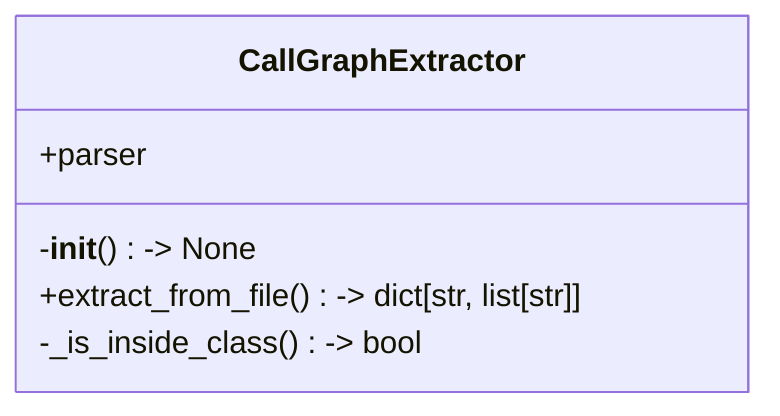

# File: `src/local_deepwiki/generators/analysis/callgraph.py`

## File Overview

This file implements a call graph extraction system that identifies function and method calls within source code files, enabling visualization and analysis of code dependencies. It is designed to support multiple programming languages by leveraging the Tree-sitter parser and language-specific extraction logic.

The core responsibility of this file is to parse source code, identify function definitions and calls, and build a mapping of callers to callees. It also provides utilities to generate Mermaid flowchart diagrams from these call graphs and to reverse the call graph for analysis of callers.

## Key Concepts

### Language-Agnostic Parsing with Tree-sitter

The system uses the Tree-sitter library to parse source code into an Abstract Syntax Tree (AST). This allows for accurate and language-agnostic extraction of nodes, such as function definitions and call expressions, by leveraging language-specific grammars.

### Per-Language Call Extraction

Each supported programming language has a dedicated function for extracting call names from call expression nodes. This is necessary because the structure of call expressions varies significantly across languages (e.g., Python uses identifiers and attributes, while JavaScript uses member expressions). The generic call extractor (`_extract_generic_call`) delegates to language-specific extractors for languages that do not have a dedicated implementation.

### Call Graph Construction

The `CallGraphExtractor` class is responsible for walking through the AST of a file and building a mapping of function names to the list of functions they call. It distinguishes between top-level functions and class methods, ensuring that class methods are named with their full qualified names (e.g., `ClassName.methodName`).

### Filtering Built-ins and Noise

To improve the quality of the call graph, the system filters out common built-in functions and noise patterns (e.g., `self`, `this`) using `_is_builtin_or_noise`. This prevents the call graph from being cluttered with uninformative nodes.

### Mermaid Diagram Generation

The system can generate Mermaid flowchart diagrams from the call graph. It includes logic to limit the number of nodes in the diagram (`_trim_nodes_to_limit`) and to style function and method nodes differently for clarity (`_build_call_graph_mermaid`).

## Integration

This file is a core component of the analysis and documentation generation pipeline in `local_deepwiki`. It is used by several other modules and services:

- `CallGraphExtractor` is used by `generator`, `graph`, `analysis_entity`, and other analysis components.
- `generate_call_graph_diagram` is used by `generator_service` and tests.
- `get_file_call_graph` and `get_file_callers` are used by `files` and tests.
- `build_reverse_call_graph` is used by `analysis_entity`, `analysis_service`, and tests.

The file imports from `local_deepwiki.core.parser` to leverage existing AST traversal and node extraction utilities, and from `local_deepwiki.core.chunk_extractors` to determine valid function and class node types for different languages.

## Design Notes

### Why Tree-sitter?

Tree-sitter is chosen over regex or simple parsing because it provides accurate, language-specific ASTs that are robust to syntax variations and complex code structures. This is essential for correctly identifying function calls in languages with complex syntax, such as C++ or Swift.

### Why Not Just Use AST Node Types?

While the AST node types are used to find function and call expressions, the actual extraction of call names requires understanding the structure of the call node. For example, in Python, a call like `obj.method()` requires traversing the AST to extract `method` from the attribute node, not just the raw node text.

### Why Filter Built-ins and Noise?

Filtering built-ins and noise improves the clarity and utility of the call graph. Without this, diagrams can become cluttered with common patterns that don't add value to understanding the code's structure.

### Why Limit Nodes in Diagrams?

Including all nodes in a diagram can make it unreadable, especially for large projects. By limiting the number of nodes to a reasonable maximum (`max_nodes`), the system ensures that diagrams remain useful for analysis.

### Why Separate `CallGraphExtractor` from Diagram Generation?

Separating the logic for extracting call graphs from the logic for generating diagrams promotes modularity and testability. It allows the same call graph data to be used for different purposes (e.g., both visualization and reverse lookup), while keeping the diagram generation logic focused and reusable.

## API Reference

### class `CallGraphExtractor`

Extracts call graphs from source files.

**Methods:**


<details>
<summary>View Source (lines 314-382) | <a href="https://github.com/UrbanDiver/local-deepwiki-mcp/blob/main/src/local_deepwiki/generators/analysis/callgraph.py#L314-L382">GitHub</a></summary>

```python
class CallGraphExtractor:
    """Extracts call graphs from source files."""

    def __init__(self) -> None:
        """Initialize the extractor."""
        self.parser = CodeParser()

    def extract_from_file(
        self,
        file_path: Path,
        repo_root: Path,
    ) -> dict[str, list[str]]:
        """Extract call graph from a source file.

        Args:
            file_path: Path to the source file.
            repo_root: Repository root path.

        Returns:
            Dictionary mapping function name to list of called functions.
        """
        result = self.parser.parse_file(file_path)
        if result is None:
            return {}

        root, language, source = result
        call_graph: dict[str, list[str]] = {}

        # Get function and class node types
        function_types = FUNCTION_NODE_TYPES.get(language, set())
        class_types = CLASS_NODE_TYPES.get(language, set())

        # Extract from top-level functions
        for func_node in find_nodes_by_type(root, function_types):
            # Skip if inside a class
            if self._is_inside_class(func_node, class_types):
                continue

            func_name = get_node_name(func_node, source, language)
            if func_name:
                calls = extract_calls_from_function(func_node, source, language)
                if calls:
                    call_graph[func_name] = calls

        # Extract from class methods
        for class_node in find_nodes_by_type(root, class_types):
            class_name = get_node_name(class_node, source, language)
            if not class_name:
                continue

            for method_node in find_nodes_by_type(class_node, function_types):
                method_name = get_node_name(method_node, source, language)
                if method_name:
                    full_name = f"{class_name}.{method_name}"
                    calls = extract_calls_from_function(method_node, source, language)
                    if calls:
                        call_graph[full_name] = calls

        return call_graph

    @staticmethod
    def _is_inside_class(node: Node, class_types: set[str]) -> bool:
        """Check if a node is inside a class definition."""
        parent = node.parent
        while parent:
            if parent.type in class_types:
                return True
            parent = parent.parent
        return False
```

</details>

#### `__init__`

```python
def __init__() -> None
```

Initialize the extractor.


<details>
<summary>View Source (lines 314-382) | <a href="https://github.com/UrbanDiver/local-deepwiki-mcp/blob/main/src/local_deepwiki/generators/analysis/callgraph.py#L314-L382">GitHub</a></summary>

```python
class CallGraphExtractor:
    """Extracts call graphs from source files."""

    def __init__(self) -> None:
        """Initialize the extractor."""
        self.parser = CodeParser()

    def extract_from_file(
        self,
        file_path: Path,
        repo_root: Path,
    ) -> dict[str, list[str]]:
        """Extract call graph from a source file.

        Args:
            file_path: Path to the source file.
            repo_root: Repository root path.

        Returns:
            Dictionary mapping function name to list of called functions.
        """
        result = self.parser.parse_file(file_path)
        if result is None:
            return {}

        root, language, source = result
        call_graph: dict[str, list[str]] = {}

        # Get function and class node types
        function_types = FUNCTION_NODE_TYPES.get(language, set())
        class_types = CLASS_NODE_TYPES.get(language, set())

        # Extract from top-level functions
        for func_node in find_nodes_by_type(root, function_types):
            # Skip if inside a class
            if self._is_inside_class(func_node, class_types):
                continue

            func_name = get_node_name(func_node, source, language)
            if func_name:
                calls = extract_calls_from_function(func_node, source, language)
                if calls:
                    call_graph[func_name] = calls

        # Extract from class methods
        for class_node in find_nodes_by_type(root, class_types):
            class_name = get_node_name(class_node, source, language)
            if not class_name:
                continue

            for method_node in find_nodes_by_type(class_node, function_types):
                method_name = get_node_name(method_node, source, language)
                if method_name:
                    full_name = f"{class_name}.{method_name}"
                    calls = extract_calls_from_function(method_node, source, language)
                    if calls:
                        call_graph[full_name] = calls

        return call_graph

    @staticmethod
    def _is_inside_class(node: Node, class_types: set[str]) -> bool:
        """Check if a node is inside a class definition."""
        parent = node.parent
        while parent:
            if parent.type in class_types:
                return True
            parent = parent.parent
        return False
```

</details>

#### `extract_from_file`

```python
def extract_from_file(file_path: Path, repo_root: Path) -> dict[str, list[str]]
```

Extract call graph from a source file.


| Parameter | Type | Default | Description |
|-----------|------|---------|-------------|
| `file_path` | `Path` | - | Path to the source file. |
| `repo_root` | `Path` | - | Repository root path. |


---


<details>
<summary>View Source (lines 314-382) | <a href="https://github.com/UrbanDiver/local-deepwiki-mcp/blob/main/src/local_deepwiki/generators/analysis/callgraph.py#L314-L382">GitHub</a></summary>

```python
class CallGraphExtractor:
    """Extracts call graphs from source files."""

    def __init__(self) -> None:
        """Initialize the extractor."""
        self.parser = CodeParser()

    def extract_from_file(
        self,
        file_path: Path,
        repo_root: Path,
    ) -> dict[str, list[str]]:
        """Extract call graph from a source file.

        Args:
            file_path: Path to the source file.
            repo_root: Repository root path.

        Returns:
            Dictionary mapping function name to list of called functions.
        """
        result = self.parser.parse_file(file_path)
        if result is None:
            return {}

        root, language, source = result
        call_graph: dict[str, list[str]] = {}

        # Get function and class node types
        function_types = FUNCTION_NODE_TYPES.get(language, set())
        class_types = CLASS_NODE_TYPES.get(language, set())

        # Extract from top-level functions
        for func_node in find_nodes_by_type(root, function_types):
            # Skip if inside a class
            if self._is_inside_class(func_node, class_types):
                continue

            func_name = get_node_name(func_node, source, language)
            if func_name:
                calls = extract_calls_from_function(func_node, source, language)
                if calls:
                    call_graph[func_name] = calls

        # Extract from class methods
        for class_node in find_nodes_by_type(root, class_types):
            class_name = get_node_name(class_node, source, language)
            if not class_name:
                continue

            for method_node in find_nodes_by_type(class_node, function_types):
                method_name = get_node_name(method_node, source, language)
                if method_name:
                    full_name = f"{class_name}.{method_name}"
                    calls = extract_calls_from_function(method_node, source, language)
                    if calls:
                        call_graph[full_name] = calls

        return call_graph

    @staticmethod
    def _is_inside_class(node: Node, class_types: set[str]) -> bool:
        """Check if a node is inside a class definition."""
        parent = node.parent
        while parent:
            if parent.type in class_types:
                return True
            parent = parent.parent
        return False
```

</details>

### Functions

#### `extract_call_name`

```python
def extract_call_name(call_node: Node, source: bytes, language: Language) -> str | None
```

Extract the function/method name from a call expression.


| Parameter | Type | Default | Description |
|-----------|------|---------|-------------|
| `call_node` | `Node` | - | The call expression AST node. |
| `source` | `bytes` | - | Source bytes. |
| `language` | `Language` | - | Programming language. |

**Returns:** `str | None`


<details>
<summary>View Source (lines 148-163) | <a href="https://github.com/UrbanDiver/local-deepwiki-mcp/blob/main/src/local_deepwiki/generators/analysis/callgraph.py#L148-L163">GitHub</a></summary>

```python
def extract_call_name(call_node: Node, source: bytes, language: Language) -> str | None:
    """Extract the function/method name from a call expression.

    Args:
        call_node: The call expression AST node.
        source: Source bytes.
        language: Programming language.

    Returns:
        The called function name or None if can't determine.
    """
    if language == Language.PYTHON:
        return _extract_python_call(call_node, source)
    elif language in (Language.JAVASCRIPT, Language.TYPESCRIPT):
        return _extract_js_call(call_node, source)
    return _extract_generic_call(call_node, source, language)
```

</details>

#### `extract_calls_from_function`

```python
def extract_calls_from_function(func_node: Node, source: bytes, language: Language) -> list[str]
```

Extract all function calls from a function body.


| Parameter | Type | Default | Description |
|-----------|------|---------|-------------|
| `func_node` | `Node` | - | The function AST node. |
| `source` | `bytes` | - | Source bytes. |
| `language` | `Language` | - | Programming language. |

**Returns:** `list[str]`


<details>
<summary>View Source (lines 166-195) | <a href="https://github.com/UrbanDiver/local-deepwiki-mcp/blob/main/src/local_deepwiki/generators/analysis/callgraph.py#L166-L195">GitHub</a></summary>

```python
def extract_calls_from_function(
    func_node: Node,
    source: bytes,
    language: Language,
) -> list[str]:
    """Extract all function calls from a function body.

    Args:
        func_node: The function AST node.
        source: Source bytes.
        language: Programming language.

    Returns:
        List of called function names (deduplicated).
    """
    call_types = CALL_NODE_TYPES.get(language, set())
    if not call_types:
        return []

    call_nodes = find_nodes_by_type(func_node, call_types)
    calls = []

    for call_node in call_nodes:
        name = extract_call_name(call_node, source, language)
        if name and name not in calls:
            # Filter out common built-ins and noise
            if not _is_builtin_or_noise(name, language):
                calls.append(name)

    return calls
```

</details>

#### `generate_call_graph_diagram`

```python
def generate_call_graph_diagram(call_graph: dict[str, list[str]], title: str | None = None, max_nodes: int = 30) -> str | None
```

Generate a Mermaid flowchart for a call graph.


| Parameter | Type | Default | Description |
|-----------|------|---------|-------------|
| `call_graph` | `dict[str, list[str]]` | - | Mapping of caller to list of callees. |
| `title` | `str | None` | `None` | Optional diagram title. |
| `max_nodes` | `int` | `30` | Maximum number of nodes to include. |

**Returns:** `str | None`


<details>
<summary>View Source (lines 443-470) | <a href="https://github.com/UrbanDiver/local-deepwiki-mcp/blob/main/src/local_deepwiki/generators/analysis/callgraph.py#L443-L470">GitHub</a></summary>

```python
def generate_call_graph_diagram(
    call_graph: dict[str, list[str]],
    title: str | None = None,
    max_nodes: int = 30,
) -> str | None:
    """Generate a Mermaid flowchart for a call graph.

    Args:
        call_graph: Mapping of caller to list of callees.
        title: Optional diagram title.
        max_nodes: Maximum number of nodes to include.

    Returns:
        Mermaid diagram string or None if empty.
    """
    if not call_graph:
        return None

    all_nodes: set[str] = set()
    for caller, callees in call_graph.items():
        all_nodes.add(caller)
        all_nodes.update(callees)

    if len(all_nodes) > max_nodes:
        all_nodes = _trim_nodes_to_limit(all_nodes, call_graph, max_nodes)

    lines = _build_call_graph_mermaid(all_nodes, call_graph)
    return "\n".join(lines)
```

</details>

#### `get_file_call_graph`

```python
def get_file_call_graph(file_path: Path, repo_root: Path) -> str | None
```

Get a call graph diagram for a single file.


| Parameter | Type | Default | Description |
|-----------|------|---------|-------------|
| `file_path` | `Path` | - | Path to the source file. |
| `repo_root` | `Path` | - | Repository root path. |

**Returns:** `str | None`


<details>
<summary>View Source (lines 473-485) | <a href="https://github.com/UrbanDiver/local-deepwiki-mcp/blob/main/src/local_deepwiki/generators/analysis/callgraph.py#L473-L485">GitHub</a></summary>

```python
def get_file_call_graph(file_path: Path, repo_root: Path) -> str | None:
    """Get a call graph diagram for a single file.

    Args:
        file_path: Path to the source file.
        repo_root: Repository root path.

    Returns:
        Mermaid diagram string or None if no calls found.
    """
    extractor = CallGraphExtractor()
    call_graph = extractor.extract_from_file(file_path, repo_root)
    return generate_call_graph_diagram(call_graph)
```

</details>

#### `build_reverse_call_graph`

```python
def build_reverse_call_graph(call_graph: dict[str, list[str]]) -> dict[str, list[str]]
```

Build a reverse call graph mapping callee to callers.


| Parameter | Type | Default | Description |
|-----------|------|---------|-------------|
| `call_graph` | `dict[str, list[str]]` | - | Mapping of caller -> list of callees. |

**Returns:** `dict[str, list[str]]`


<details>
<summary>View Source (lines 488-504) | <a href="https://github.com/UrbanDiver/local-deepwiki-mcp/blob/main/src/local_deepwiki/generators/analysis/callgraph.py#L488-L504">GitHub</a></summary>

```python
def build_reverse_call_graph(call_graph: dict[str, list[str]]) -> dict[str, list[str]]:
    """Build a reverse call graph mapping callee to callers.

    Args:
        call_graph: Mapping of caller -> list of callees.

    Returns:
        Mapping of callee -> list of callers.
    """
    reverse: dict[str, list[str]] = {}
    for caller, callees in call_graph.items():
        for callee in callees:
            if callee not in reverse:
                reverse[callee] = []
            if caller not in reverse[callee]:
                reverse[callee].append(caller)
    return reverse
```

</details>

#### `get_file_callers`

```python
def get_file_callers(file_path: Path, repo_root: Path) -> dict[str, list[str]]
```

Get a mapping of function/method names to their callers within a file.


| Parameter | Type | Default | Description |
|-----------|------|---------|-------------|
| `file_path` | `Path` | - | Path to the source file. |
| `repo_root` | `Path` | - | Repository root path. |

**Returns:** `dict[str, list[str]]`


<details>
<summary>View Source (lines 507-519) | <a href="https://github.com/UrbanDiver/local-deepwiki-mcp/blob/main/src/local_deepwiki/generators/analysis/callgraph.py#L507-L519">GitHub</a></summary>

```python
def get_file_callers(file_path: Path, repo_root: Path) -> dict[str, list[str]]:
    """Get a mapping of function/method names to their callers within a file.

    Args:
        file_path: Path to the source file.
        repo_root: Repository root path.

    Returns:
        Mapping of function name -> list of caller names.
    """
    extractor = CallGraphExtractor()
    call_graph = extractor.extract_from_file(file_path, repo_root)
    return build_reverse_call_graph(call_graph)
```

</details>

## Class Diagram



## Call Graph

```mermaid
flowchart TD
    N0[CallGraphExtractor]
    N1[CallGraphExtractor.__init__]
    N2[CallGraphExtractor.extract_...]
    N3[CodeParser]
    N4[Counter]
    N5[_build_call_graph_mermaid]
    N6[_extract_c_cpp_call]
    N7[_extract_generic_call]
    N8[_extract_go_call]
    N9[_extract_java_call]
    N10[_extract_js_call]
    N11[_extract_python_call]
    N12[_extract_rust_call]
    N13[_extract_swift_call]
    N14[_is_builtin_or_noise]
    N15[_trim_nodes_to_limit]
    N16[add]
    N17[build_reverse_call_graph]
    N18[child_by_field_name]
    N19[extract_call_name]
    N20[extract_calls_from_function]
    N21[extract_from_file]
    N22[extractor]
    N23[find_nodes_by_type]
    N24[frozenset]
    N25[generate_call_graph_diagram]
    N26[get_file_call_graph]
    N27[get_file_callers]
    N28[get_node_text]
    N29[parse_file]
    N11 --> N18
    N11 --> N28
    N10 --> N18
    N10 --> N28
    N8 --> N18
    N8 --> N28
    N12 --> N18
    N12 --> N28
    N9 --> N18
    N9 --> N28
    N6 --> N18
    N6 --> N28
    N13 --> N18
    N13 --> N28
    N7 --> N22
    N19 --> N11
    N19 --> N10
    N19 --> N7
    N20 --> N23
    N20 --> N19
    N20 --> N14
    N14 --> N24
    N15 --> N4
    N25 --> N16
    N25 --> N15
    N25 --> N5
    N26 --> N0
    N26 --> N21
    N26 --> N25
    N27 --> N0
    N27 --> N21
    N27 --> N17
    N1 --> N3
    N2 --> N29
    N2 --> N23
    N2 --> N20
    classDef func fill:#e1f5fe
    class N0,N3,N4,N5,N6,N7,N8,N9,N10,N11,N12,N13,N14,N15,N16,N17,N18,N19,N20,N21,N22,N23,N24,N25,N26,N27,N28,N29 func
    classDef method fill:#fff3e0
    class N1,N2 method
```



## Used By

Functions and methods in this file and their callers:

- **`CallGraphExtractor`**: called by `get_file_call_graph`, `get_file_callers`
- **[`CodeParser`](../../core/parser/code_parser.md)**: called by `CallGraphExtractor.__init__`
- **`Counter`**: called by `_trim_nodes_to_limit`
- **`_build_call_graph_mermaid`**: called by `generate_call_graph_diagram`
- **`_extract_generic_call`**: called by `extract_call_name`
- **`_extract_js_call`**: called by `extract_call_name`
- **`_extract_python_call`**: called by `extract_call_name`
- **`_is_builtin_or_noise`**: called by `extract_calls_from_function`
- **`_is_inside_class`**: called by `CallGraphExtractor.extract_from_file`
- **`_trim_nodes_to_limit`**: called by `generate_call_graph_diagram`
- **`add`**: called by `generate_call_graph_diagram`
- **`build_reverse_call_graph`**: called by `get_file_callers`
- **`child_by_field_name`**: called by `_extract_c_cpp_call`, `_extract_go_call`, `_extract_java_call`, `_extract_js_call`, `_extract_python_call`, `_extract_rust_call`, `_extract_swift_call`
- **`extract_call_name`**: called by `extract_calls_from_function`
- **`extract_calls_from_function`**: called by `CallGraphExtractor.extract_from_file`
- **`extract_from_file`**: called by `get_file_call_graph`, `get_file_callers`
- **`extractor`**: called by `_extract_generic_call`
- **[`find_nodes_by_type`](../../core/parser/ast_utils.md)**: called by `CallGraphExtractor.extract_from_file`, `extract_calls_from_function`
- **`frozenset`**: called by `_is_builtin_or_noise`
- **`generate_call_graph_diagram`**: called by `get_file_call_graph`
- **[`get_node_name`](../../core/parser/ast_utils.md)**: called by `CallGraphExtractor.extract_from_file`
- **[`get_node_text`](../../core/parser/ast_utils.md)**: called by `_extract_c_cpp_call`, `_extract_go_call`, `_extract_java_call`, `_extract_js_call`, `_extract_python_call`, `_extract_rust_call`, `_extract_swift_call`
- **`parse_file`**: called by `CallGraphExtractor.extract_from_file`

## Usage Examples

*Examples extracted from test files*

### Test that common built-ins are filtered

From `test_callgraph.py::TestIsBuiltinOrNoise::test_common_builtins_filtered`:

```python
assert _is_builtin_or_noise("print", Language.PYTHON) is True
assert _is_builtin_or_noise("len", Language.PYTHON) is True
assert _is_builtin_or_noise("str", Language.PYTHON) is True
assert _is_builtin_or_noise("isinstance", Language.PYTHON) is True
```

### Test Python-specific built-ins are filtered

From `test_callgraph.py::TestIsBuiltinOrNoise::test_python_specific_builtins`:

```python
assert _is_builtin_or_noise("super", Language.PYTHON) is True
assert _is_builtin_or_noise("next", Language.PYTHON) is True
```

### Test extracting a simple function call

From `test_callgraph.py::TestExtractCallsPython::test_simple_function_call`:

```python
source = dedent(
    """
    def main():
        process_data()
"""
).strip()
root = parser.parse_source(source, Language.PYTHON)
func_node = root.children[0]  # function_definition

calls = extract_calls_from_function(func_node, source.encode(), Language.PYTHON)
assert "process_data" in calls
```

### Test extracting multiple function calls

From `test_callgraph.py::TestExtractCallsPython::test_multiple_function_calls`:

```python
source = dedent(
    """
    def main():
        load_data()
        process_data()
        save_results()
"""
).strip()
root = parser.parse_source(source, Language.PYTHON)
func_node = root.children[0]

calls = extract_calls_from_function(func_node, source.encode(), Language.PYTHON)
assert "load_data" in calls
assert "process_data" in calls
```

### Test that empty call graph returns None

From `test_callgraph.py::TestGenerateCallGraphDiagram::test_empty_graph_returns_none`:

```python
result = generate_call_graph_diagram({})
assert result is None
```


## Last Modified

| Entity | Type | Author | Date | Commit |
|--------|------|--------|------|--------|
| `_extract_swift_call` | function | Brian Breidenbach | yesterday | `ca3ccca` refactor: flatten deep nest... |
| `_extract_go_call` | function | Brian Breidenbach | 1 week ago | `bc3c92e` refactor: reduce cyclomatic... |
| `_extract_rust_call` | function | Brian Breidenbach | 1 week ago | `bc3c92e` refactor: reduce cyclomatic... |
| `_extract_java_call` | function | Brian Breidenbach | 1 week ago | `bc3c92e` refactor: reduce cyclomatic... |
| `_extract_c_cpp_call` | function | Brian Breidenbach | 1 week ago | `bc3c92e` refactor: reduce cyclomatic... |
| `_extract_generic_call` | function | Brian Breidenbach | 1 week ago | `bc3c92e` refactor: reduce cyclomatic... |
| `_extract_python_call` | function | Brian Breidenbach | 1 week ago | `f3faf1e` refactor: split generator a... |
| `_extract_js_call` | function | Brian Breidenbach | 1 week ago | `f3faf1e` refactor: split generator a... |
| `extract_call_name` | function | Brian Breidenbach | 1 week ago | `f3faf1e` refactor: split generator a... |
| `_is_builtin_or_noise` | function | Brian Breidenbach | 1 week ago | `f3faf1e` refactor: split generator a... |
| `_trim_nodes_to_limit` | function | Brian Breidenbach | 1 week ago | `f3faf1e` refactor: split generator a... |
| `_build_call_graph_mermaid` | function | Brian Breidenbach | 1 week ago | `f3faf1e` refactor: split generator a... |
| `generate_call_graph_diagram` | function | Brian Breidenbach | 1 week ago | `f3faf1e` refactor: split generator a... |
| `CallGraphExtractor` | class | Brian Breidenbach | Feb 23, 2026 | `c6fe2bd` refactor: split oversized m... |
| `build_reverse_call_graph` | function | Brian Breidenbach | Jan 16, 2026 | `62e3290` Add GitHub source links and... |
| `get_file_callers` | function | Brian Breidenbach | Jan 16, 2026 | `62e3290` Add GitHub source links and... |
| `extract_calls_from_function` | function | Brian Breidenbach | Jan 11, 2026 | `71d32c1` Add call graph diagrams to ... |
| `get_file_call_graph` | function | Brian Breidenbach | Jan 11, 2026 | `71d32c1` Add call graph diagrams to ... |

## Additional Source Code

Source code for functions and methods not listed in the API Reference above.

#### `_extract_python_call`

<details>
<summary>View Source (lines 33-43) | <a href="https://github.com/UrbanDiver/local-deepwiki-mcp/blob/main/src/local_deepwiki/generators/analysis/callgraph.py#L33-L43">GitHub</a></summary>

```python
def _extract_python_call(call_node: Node, source: bytes) -> str | None:
    """Extract call name from a Python call expression node."""
    func = call_node.child_by_field_name("function")
    if func:
        if func.type == "identifier":
            return get_node_text(func, source)
        elif func.type == "attribute":
            attr = func.child_by_field_name("attribute")
            if attr:
                return get_node_text(attr, source)
    return None
```

</details>


#### `_extract_js_call`

<details>
<summary>View Source (lines 46-56) | <a href="https://github.com/UrbanDiver/local-deepwiki-mcp/blob/main/src/local_deepwiki/generators/analysis/callgraph.py#L46-L56">GitHub</a></summary>

```python
def _extract_js_call(call_node: Node, source: bytes) -> str | None:
    """Extract call name from a JS/TS call expression node."""
    func = call_node.child_by_field_name("function")
    if func:
        if func.type == "identifier":
            return get_node_text(func, source)
        elif func.type == "member_expression":
            prop = func.child_by_field_name("property")
            if prop:
                return get_node_text(prop, source)
    return None
```

</details>


#### `_extract_go_call`

<details>
<summary>View Source (lines 59-69) | <a href="https://github.com/UrbanDiver/local-deepwiki-mcp/blob/main/src/local_deepwiki/generators/analysis/callgraph.py#L59-L69">GitHub</a></summary>

```python
def _extract_go_call(call_node: Node, source: bytes) -> str | None:
    """Extract call name from a Go call expression node."""
    func = call_node.child_by_field_name("function")
    if func:
        if func.type == "identifier":
            return get_node_text(func, source)
        elif func.type == "selector_expression":
            field = func.child_by_field_name("field")
            if field:
                return get_node_text(field, source)
    return None
```

</details>


#### `_extract_rust_call`

<details>
<summary>View Source (lines 72-86) | <a href="https://github.com/UrbanDiver/local-deepwiki-mcp/blob/main/src/local_deepwiki/generators/analysis/callgraph.py#L72-L86">GitHub</a></summary>

```python
def _extract_rust_call(call_node: Node, source: bytes) -> str | None:
    """Extract call name from a Rust call expression node."""
    func = call_node.child_by_field_name("function")
    if func:
        if func.type == "identifier":
            return get_node_text(func, source)
        elif func.type == "scoped_identifier":
            name = func.child_by_field_name("name")
            if name:
                return get_node_text(name, source)
        elif func.type == "field_expression":
            field = func.child_by_field_name("field")
            if field:
                return get_node_text(field, source)
    return None
```

</details>


#### `_extract_java_call`

<details>
<summary>View Source (lines 89-94) | <a href="https://github.com/UrbanDiver/local-deepwiki-mcp/blob/main/src/local_deepwiki/generators/analysis/callgraph.py#L89-L94">GitHub</a></summary>

```python
def _extract_java_call(call_node: Node, source: bytes) -> str | None:
    """Extract call name from a Java method invocation node."""
    name = call_node.child_by_field_name("name")
    if name:
        return get_node_text(name, source)
    return None
```

</details>


#### `_extract_c_cpp_call`

<details>
<summary>View Source (lines 97-107) | <a href="https://github.com/UrbanDiver/local-deepwiki-mcp/blob/main/src/local_deepwiki/generators/analysis/callgraph.py#L97-L107">GitHub</a></summary>

```python
def _extract_c_cpp_call(call_node: Node, source: bytes) -> str | None:
    """Extract call name from a C/C++ call expression node."""
    func = call_node.child_by_field_name("function")
    if func:
        if func.type == "identifier":
            return get_node_text(func, source)
        elif func.type == "field_expression":
            field = func.child_by_field_name("field")
            if field:
                return get_node_text(field, source)
    return None
```

</details>


#### `_extract_swift_call`

<details>
<summary>View Source (lines 110-125) | <a href="https://github.com/UrbanDiver/local-deepwiki-mcp/blob/main/src/local_deepwiki/generators/analysis/callgraph.py#L110-L125">GitHub</a></summary>

```python
def _extract_swift_call(call_node: Node, source: bytes) -> str | None:
    """Extract call name from a Swift call expression node."""
    func = call_node.child_by_field_name("function")
    if not func:
        return None
    if func.type == "identifier":
        return get_node_text(func, source)
    if func.type not in ("navigation_expression", "member_access"):
        return None
    for child in func.children:
        if child.type != "navigation_suffix":
            continue
        for c in child.children:
            if c.type == "simple_identifier":
                return get_node_text(c, source)
    return None
```

</details>


#### `_extract_generic_call`

<details>
<summary>View Source (lines 138-145) | <a href="https://github.com/UrbanDiver/local-deepwiki-mcp/blob/main/src/local_deepwiki/generators/analysis/callgraph.py#L138-L145">GitHub</a></summary>

```python
def _extract_generic_call(
    call_node: Node, source: bytes, language: Language
) -> str | None:
    """Extract call name for Go, Rust, Java, C/C++, and Swift."""
    extractor = _GENERIC_CALL_EXTRACTORS.get(language)
    if extractor:
        return extractor(call_node, source)
    return None
```

</details>


#### `_is_builtin_or_noise`

<details>
<summary>View Source (lines 299-311) | <a href="https://github.com/UrbanDiver/local-deepwiki-mcp/blob/main/src/local_deepwiki/generators/analysis/callgraph.py#L299-L311">GitHub</a></summary>

```python
def _is_builtin_or_noise(name: str, language: Language) -> bool:
    """Check if a function name is a built-in or common noise.

    Args:
        name: Function name.
        language: Programming language.

    Returns:
        True if should be filtered out.
    """
    if name.lower() in _BUILTIN_NAMES:
        return True
    return name in _NOISE_PATTERNS.get(language, frozenset())
```

</details>


#### `_trim_nodes_to_limit`

<details>
<summary>View Source (lines 385-397) | <a href="https://github.com/UrbanDiver/local-deepwiki-mcp/blob/main/src/local_deepwiki/generators/analysis/callgraph.py#L385-L397">GitHub</a></summary>

```python
def _trim_nodes_to_limit(
    all_nodes: set[str],
    call_graph: dict[str, list[str]],
    max_nodes: int,
) -> set[str]:
    """Return the top *max_nodes* most-connected nodes from *all_nodes*."""
    connection_count: Counter[str] = Counter()
    for caller, callees in call_graph.items():
        connection_count[caller] += len(callees)
        for callee in callees:
            connection_count[callee] += 1
    sorted_nodes = sorted(connection_count.items(), key=lambda x: x[1], reverse=True)
    return {node for node, _ in sorted_nodes[:max_nodes]}
```

</details>


#### `_build_call_graph_mermaid`

<details>
<summary>View Source (lines 400-440) | <a href="https://github.com/UrbanDiver/local-deepwiki-mcp/blob/main/src/local_deepwiki/generators/analysis/callgraph.py#L400-L440">GitHub</a></summary>

```python
def _build_call_graph_mermaid(
    all_nodes: set[str],
    call_graph: dict[str, list[str]],
) -> list[str]:
    """Build Mermaid flowchart lines for *all_nodes* and edges from *call_graph*.

    Args:
        all_nodes: Set of node names to include.
        call_graph: Mapping of caller to list of callees.

    Returns:
        List of Mermaid diagram lines (without the closing newline join).
    """
    lines = ["flowchart TD"]

    node_ids: dict[str, str] = {}
    for i, node in enumerate(sorted(all_nodes)):
        safe_id = f"N{i}"
        node_ids[node] = safe_id
        display_name = node if len(node) <= 30 else node[:27] + "..."
        lines.append(f"    {safe_id}[{display_name}]")

    for caller, callees in call_graph.items():
        if caller not in node_ids:
            continue
        caller_id = node_ids[caller]
        for callee in callees:
            if callee in node_ids:
                lines.append(f"    {caller_id} --> {node_ids[callee]}")

    func_nodes = [nid for node, nid in node_ids.items() if "." not in node]
    method_nodes = [nid for node, nid in node_ids.items() if "." in node]

    if func_nodes:
        lines.append("    classDef func fill:#e1f5fe")
        lines.append(f"    class {','.join(func_nodes)} func")
    if method_nodes:
        lines.append("    classDef method fill:#fff3e0")
        lines.append(f"    class {','.join(method_nodes)} method")

    return lines
```

</details>

## Relevant Source Files

- `src/local_deepwiki/generators/analysis/callgraph.py:314-382`
