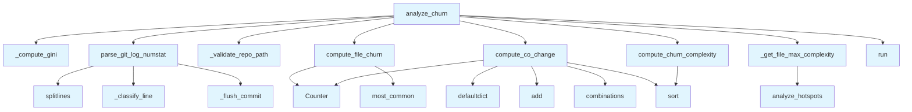

# File: `src/local_deepwiki/generators/analysis/churn.py`

## File Overview

This file provides functionality for analyzing code churn in a Git repository, focusing on change-based metrics that reflect how frequently files are modified and how they co-change with other files. It serves as a core component in understanding architectural health by quantifying the dynamics of code evolution.

The file orchestrates the execution of `git log --numstat`, parses the output to extract commit history, and computes various metrics such as file churn, co-change coupling (using Jaccard similarity), and a composite risk score combining churn and cyclomatic complexity. It also calculates the Gini coefficient to measure the concentration of changes across files.

## Key Concepts

### Change-Based Metrics

The core abstraction revolves around measuring how often files are changed over time (`file_churn`) and how often pairs of files are modified together (`co_change`). These metrics are essential for identifying hotspots and coupling patterns in codebases, which can indicate architectural issues or areas of high maintenance.

### Jaccard Similarity for Co-Change

Co-change analysis uses Jaccard similarity to quantify how often pairs of files appear in the same commits. This approach was chosen because it provides an intuitive and scalable way to detect tightly coupled components. The minimum shared commit threshold (`min_shared`) allows filtering out weak or coincidental correlations.

### Composite Risk Score

A composite score combining normalized file churn and cyclomatic complexity is computed to prioritize files that are both frequently modified and complex. This helps identify areas of the codebase that may be risky to modify due to their high change frequency and complexity.

### Gini Coefficient

The Gini coefficient is used to measure how evenly changes are distributed across files. A high Gini value indicates that a few files receive most of the changes, which may signal architectural imbalance or hotspots.

### Git Log Parsing

The parsing of `git log --numstat` output is implemented in a robust way to handle binary files and commits with no tracked files, ensuring that only meaningful data is processed.

## Integration

This file is part of the analysis module and integrates with:

- **`local_deepwiki.core.git_utils`**: Used for validating repository paths and handling timeouts during Git operations.
- **`local_deepwiki.generators.analysis.hotspots`**: Leverages this module to obtain cyclomatic complexity data for composite risk scoring.
- **`local_deepwiki.logging`**: Utilized for logging warnings when Git operations or complexity analysis fail.

The functions in this file are called by:
- `test_churn` (test suite)
- `analyze_churn` (used by `architecture_health`, `analysis_architecture`, and `test_churn`)

This file is designed to be a standalone analysis tool that can be integrated into larger architectural health reporting systems or used independently for change-based code analysis.

## Design Notes

### Handling Binary Files

Binary files in Git are represented as `-\t-\tpath` in `--numstat` output. The `_classify_line` function explicitly identifies and skips these entries, ensuring that only tracked text files are considered in the analysis.

### Commit Filtering

Commits without tracked files are omitted from processing. This is handled by `_flush_commit`, which only appends commits to the result list if they contain files. This ensures that empty or irrelevant commits do not skew metrics.

### Normalization in Composite Score

The composite risk score normalizes both churn and complexity to [0, 1] before multiplication. This choice ensures that the composite score is not dominated by one metric and allows for meaningful comparisons across different projects or timeframes.

### Gini Coefficient Implementation

The Gini coefficient is calculated using a well-known formula that measures inequality in a distribution. The implementation handles edge cases such as empty inputs or zero totals, returning 0.0 in these scenarios.

### Timeout Handling

The `analyze_churn` function includes timeout handling for Git operations using `subprocess.TimeoutExpired`. If Git fails to complete within the defined timeout (`_GIT_LOG_CHURN_TIMEOUT`), a warning is logged, and an empty result is returned to prevent the analysis from crashing.

### Complexity Analysis Fallback

If complexity analysis fails (e.g., due to missing tools or parsing errors), the function gracefully continues with churn-only analysis, logging the error for debugging purposes. This ensures that the presence of complexity data does not block the overall churn analysis.

## API Reference

### Functions

#### `parse_git_log_numstat`

```python
def parse_git_log_numstat(raw: str) -> list[tuple[str, list[str]]]
```

Parse ``git log --format='%H' --numstat`` output.  Returns a list of (commit_hash, [file_paths]) tuples. Binary files (shown as ``-\\t-\\tpath``) are skipped. Commits with no tracked files after filtering are omitted.


| Parameter | Type | Default | Description |
|-----------|------|---------|-------------|
| `raw` | `str` | - | - |

**Returns:** `list[tuple[str, list[str]]]`


<details>
<summary>View Source (lines 51-78) | <a href="https://github.com/UrbanDiver/local-deepwiki-mcp/blob/main/src/local_deepwiki/generators/analysis/churn.py#L51-L78">GitHub</a></summary>

```python
def parse_git_log_numstat(raw: str) -> list[tuple[str, list[str]]]:
    """Parse ``git log --format='%H' --numstat`` output.

    Returns a list of (commit_hash, [file_paths]) tuples.
    Binary files (shown as ``-\\t-\\tpath``) are skipped.
    Commits with no tracked files after filtering are omitted.
    """
    result: list[tuple[str, list[str]]] = []
    current_hash: str | None = None
    current_files: list[str] = []

    for line in raw.splitlines():
        line_type, value = _classify_line(line.strip())

        if line_type == "blank":
            if current_files:
                _flush_commit(result, current_hash, current_files)
                current_hash = None
                current_files = []
        elif line_type == "numstat" and value is not None:
            current_files.append(value)
        elif line_type == "hash" and value is not None:
            _flush_commit(result, current_hash, current_files)
            current_hash = value
            current_files = []

    _flush_commit(result, current_hash, current_files)
    return result
```

</details>

#### `compute_file_churn`

```python
def compute_file_churn(commits: list[tuple[str, list[str]]]) -> dict[str, int]
```

Count commits per file from parsed git log.  Returns a dict sorted by count descending.


| Parameter | Type | Default | Description |
|-----------|------|---------|-------------|
| `commits` | `list[tuple[str, list[str]]]` | - | - |

**Returns:** `dict[str, int]`


<details>
<summary>View Source (lines 81-91) | <a href="https://github.com/UrbanDiver/local-deepwiki-mcp/blob/main/src/local_deepwiki/generators/analysis/churn.py#L81-L91">GitHub</a></summary>

```python
def compute_file_churn(
    commits: list[tuple[str, list[str]]],
) -> dict[str, int]:
    """Count commits per file from parsed git log.

    Returns a dict sorted by count descending.
    """
    counter: Counter[str] = Counter()
    for _hash, files in commits:
        counter.update(files)
    return dict(counter.most_common())
```

</details>

#### `compute_co_change`

```python
def compute_co_change(commits: list[tuple[str, list[str]]], min_shared: int = 2) -> list[dict[str, Any]]
```

Compute Jaccard similarity for file pairs co-occurring in commits.


| Parameter | Type | Default | Description |
|-----------|------|---------|-------------|
| `commits` | `list[tuple[str, list[str]]]` | - | Parsed git log from :func:`parse_git_log_numstat`. |
| `min_shared` | `int` | `2` | Minimum number of shared commits to include a pair. |

**Returns:** `list[dict[str, Any]]`


<details>
<summary>View Source (lines 94-141) | <a href="https://github.com/UrbanDiver/local-deepwiki-mcp/blob/main/src/local_deepwiki/generators/analysis/churn.py#L94-L141">GitHub</a></summary>

```python
def compute_co_change(
    commits: list[tuple[str, list[str]]],
    *,
    min_shared: int = 2,
) -> list[dict[str, Any]]:
    """Compute Jaccard similarity for file pairs co-occurring in commits.

    Args:
        commits: Parsed git log from :func:`parse_git_log_numstat`.
        min_shared: Minimum number of shared commits to include a pair.

    Returns:
        List of dicts sorted by jaccard descending, each with keys:
        ``pair``, ``shared_commits``, ``union_commits``, ``jaccard``.
    """
    if not commits:
        return []

    # Build per-file commit sets
    file_commits: defaultdict[str, set[str]] = defaultdict(set)
    for commit_hash, files in commits:
        for f in files:
            file_commits[f].add(commit_hash)

    # Count co-occurrences via pair combinations within each commit
    pair_shared: Counter[tuple[str, str]] = Counter()
    for _hash, files in commits:
        for pair in combinations(sorted(set(files)), 2):
            pair_shared[pair] += 1

    # Build results with Jaccard
    results: list[dict[str, Any]] = []
    for (f1, f2), shared in pair_shared.items():
        if shared < min_shared:
            continue
        union = len(file_commits[f1] | file_commits[f2])
        jaccard = round(shared / union, 4)
        results.append(
            {
                "pair": [f1, f2],
                "shared_commits": shared,
                "union_commits": union,
                "jaccard": jaccard,
            }
        )

    results.sort(key=lambda r: r["jaccard"], reverse=True)
    return results
```

</details>

#### `compute_churn_complexity`

```python
def compute_churn_complexity(churn: dict[str, int], complexity: dict[str, float]) -> list[dict[str, Any]]
```

Compute composite risk score per file (normalized churn * complexity).  Both churn (commit count) and complexity (max cyclomatic complexity) are normalized to [0, 1] before multiplying.  Files absent from *complexity* receive complexity=0 (and therefore composite=0).  Returns a list sorted by ``composite`` descending.


| Parameter | Type | Default | Description |
|-----------|------|---------|-------------|
| `churn` | `dict[str, int]` | - | - |
| `complexity` | `dict[str, float]` | - | - |

**Returns:** `list[dict[str, Any]]`


<details>
<summary>View Source (lines 144-179) | <a href="https://github.com/UrbanDiver/local-deepwiki-mcp/blob/main/src/local_deepwiki/generators/analysis/churn.py#L144-L179">GitHub</a></summary>

```python
def compute_churn_complexity(
    churn: dict[str, int],
    complexity: dict[str, float],
) -> list[dict[str, Any]]:
    """Compute composite risk score per file (normalized churn * complexity).

    Both churn (commit count) and complexity (max cyclomatic complexity) are
    normalized to [0, 1] before multiplying.  Files absent from *complexity*
    receive complexity=0 (and therefore composite=0).

    Returns a list sorted by ``composite`` descending.
    """
    if not churn:
        return []

    max_churn = max(churn.values()) or 1
    max_cc = max(complexity.values()) if complexity else 1
    max_cc = max_cc or 1

    rows: list[dict[str, Any]] = []
    for filepath, commits in churn.items():
        cc = complexity.get(filepath, 0)
        norm_churn = commits / max_churn
        norm_cc = cc / max_cc
        composite = round(norm_churn * norm_cc, 4)
        rows.append(
            {
                "file": filepath,
                "churn": commits,
                "complexity": cc,
                "composite": composite,
            }
        )

    rows.sort(key=lambda r: r["composite"], reverse=True)
    return rows
```

</details>

#### `analyze_churn`

```python
def analyze_churn(repo_path: str | Path, window_days: int = DEFAULT_WINDOW_DAYS, top_n: int = 20, min_co_change: int = 2, include_complexity: bool = True) -> dict[str, Any]
```

Full churn analysis orchestrator.  Runs ``git log --numstat`` over *window_days*, computes per-file churn, co-change coupling, optionally churn x complexity composite, and Gini coefficient.  Returns a dict with ``status``, ``file_churn``, ``co_change``, ``composite``, and ``stats`` keys.


| Parameter | Type | Default | Description |
|-----------|------|---------|-------------|
| `repo_path` | `str | Path` | - | - |
| `window_days` | `int` | `DEFAULT_WINDOW_DAYS` | - |
| `top_n` | `int` | `20` | - |
| `min_co_change` | `int` | `2` | - |
| `include_complexity` | `bool` | `True` | - |

**Returns:** `dict[str, Any]`


<details>
<summary>View Source (lines 217-290) | <a href="https://github.com/UrbanDiver/local-deepwiki-mcp/blob/main/src/local_deepwiki/generators/analysis/churn.py#L217-L290">GitHub</a></summary>

```python
def analyze_churn(
    repo_path: str | Path,
    *,
    window_days: int = DEFAULT_WINDOW_DAYS,
    top_n: int = 20,
    min_co_change: int = 2,
    include_complexity: bool = True,
) -> dict[str, Any]:
    """Full churn analysis orchestrator.

    Runs ``git log --numstat`` over *window_days*, computes per-file churn,
    co-change coupling, optionally churn x complexity composite, and Gini
    coefficient.

    Returns a dict with ``status``, ``file_churn``, ``co_change``,
    ``composite``, and ``stats`` keys.
    """
    repo = _validate_repo_path(repo_path)

    # Run git log
    cmd = [
        "git",
        "log",
        f"--since={window_days} days ago",
        "--format=%H",
        "--numstat",
    ]
    try:
        proc = subprocess.run(
            cmd,
            cwd=repo,
            capture_output=True,
            text=True,
            timeout=_GIT_LOG_CHURN_TIMEOUT,
        )
        raw = proc.stdout
    except (subprocess.TimeoutExpired, OSError) as exc:
        logger.warning("git log failed: %s", exc)
        raw = ""

    # Parse and compute
    commits = parse_git_log_numstat(raw)
    file_churn = compute_file_churn(commits)
    co_change = compute_co_change(commits, min_shared=min_co_change)

    # Churn x complexity composite
    composite: list[dict[str, Any]] = []
    if include_complexity and file_churn:
        try:
            complexity = _get_file_max_complexity(repo)
            composite = compute_churn_complexity(file_churn, complexity)[:top_n]
        except Exception as exc:
            logger.warning("Complexity analysis failed: %s", exc)

    # Gini coefficient
    gini = _compute_gini(list(file_churn.values()))

    # Build file_churn list (top_n)
    file_churn_list = [
        {"file": f, "commits": c} for f, c in list(file_churn.items())[:top_n]
    ]

    return {
        "status": "success",
        "file_churn": file_churn_list,
        "co_change": co_change,
        "composite": composite,
        "stats": {
            "total_commits": len(commits),
            "total_files": len(file_churn),
            "window_days": window_days,
            "gini_coefficient": round(gini, 4),
        },
    }
```

</details>

## Call Graph



## Used By

Functions and methods in this file and their callers:

- **`Counter`**: called by `compute_co_change`, `compute_file_churn`
- **`_classify_line`**: called by `parse_git_log_numstat`
- **`_compute_gini`**: called by `analyze_churn`
- **`_flush_commit`**: called by `parse_git_log_numstat`
- **`_get_file_max_complexity`**: called by `analyze_churn`
- **`_validate_repo_path`**: called by `analyze_churn`
- **`add`**: called by `compute_co_change`
- **[`analyze_hotspots`](hotspots.md)**: called by `_get_file_max_complexity`
- **`combinations`**: called by `compute_co_change`
- **`compute_churn_complexity`**: called by `analyze_churn`
- **`compute_co_change`**: called by `analyze_churn`
- **`compute_file_churn`**: called by `analyze_churn`
- **`defaultdict`**: called by `compute_co_change`
- **`most_common`**: called by `compute_file_churn`
- **`parse_git_log_numstat`**: called by `analyze_churn`
- **`run`**: called by `analyze_churn`
- **`sort`**: called by `compute_churn_complexity`, `compute_co_change`
- **`splitlines`**: called by `parse_git_log_numstat`

## Usage Examples

*Examples extracted from test files*

### Parse 2 commits with multiple files each

From `test_churn.py::test_parse_git_log_numstat_basic`:

```python
raw = (
    "abc1234\n"
    "10\t5\tsrc/foo.py\n"
    "3\t1\tsrc/bar.py\n"
    "\n"
    "def5678\n"
    "20\t10\tsrc/baz.py\n"
    "1\t0\tsrc/foo.py\n"
)
result = parse_git_log_numstat(raw)
assert len(result) == 2
assert result[0] == ("abc1234", ["src/foo.py", "src/bar.py"])
assert result[1] == ("def5678", ["src/baz.py", "src/foo.py"])
```

### Empty input returns empty list

From `test_churn.py::test_parse_git_log_numstat_empty`:

```python
assert parse_git_log_numstat("") == []
assert parse_git_log_numstat("   \n\n  ") == []
```

### Verify correct commit counts across 3 commits

From `test_churn.py::test_compute_file_churn_counts_commits`:

```python
commits = [
    ("c1", ["a.py", "b.py"]),
    ("c2", ["b.py", "c.py"]),
    ("c3", ["a.py", "b.py", "c.py"]),
]
result = compute_file_churn(commits)
assert result == {"b.py": 3, "a.py": 2, "c.py": 2}
```

### Verify correct commit counts across 3 commits

From `test_churn.py::test_compute_file_churn_counts_commits`:

```python
commits = [
    ("c1", ["a.py", "b.py"]),
    ("c2", ["b.py", "c.py"]),
    ("c3", ["a.py", "b.py", "c.py"]),
]
result = compute_file_churn(commits)
assert result == {"b.py": 3, "a.py": 2, "c.py": 2}
```

### Empty commits returns empty dict

From `test_churn.py::test_compute_file_churn_empty`:

```python
assert compute_file_churn([]) == {}
```


## Last Modified

| Entity | Type | Author | Date | Commit |
|--------|------|--------|------|--------|
| `_classify_line` | function | Brian Breidenbach | today | `a75af5c` refactor: extract helpers f... |
| `_flush_commit` | function | Brian Breidenbach | today | `a75af5c` refactor: extract helpers f... |
| `parse_git_log_numstat` | function | Brian Breidenbach | today | `a75af5c` refactor: extract helpers f... |
| `analyze_churn` | function | Brian Breidenbach | today | `a75af5c` refactor: extract helpers f... |
| `compute_churn_complexity` | function | Brian Breidenbach | today | `deeeed1` feat(churn): add churn×comp... |
| `_compute_gini` | function | Brian Breidenbach | today | `deeeed1` feat(churn): add churn×comp... |
| `_get_file_max_complexity` | function | Brian Breidenbach | today | `deeeed1` feat(churn): add churn×comp... |
| `compute_file_churn` | function | Brian Breidenbach | today | `da9dcc6` feat(churn): add git log pa... |
| `compute_co_change` | function | Brian Breidenbach | today | `da9dcc6` feat(churn): add git log pa... |

## Additional Source Code

Source code for functions and methods not listed in the API Reference above.

#### `_classify_line`

<details>
<summary>View Source (lines 25-38) | <a href="https://github.com/UrbanDiver/local-deepwiki-mcp/blob/main/src/local_deepwiki/generators/analysis/churn.py#L25-L38">GitHub</a></summary>

```python
def _classify_line(stripped: str) -> tuple[str, str | None]:
    """Classify a git log line as 'blank', 'binary', 'numstat', or 'hash'.

    Returns (type, value) where value is the filepath for numstat or hash string.
    """
    if not stripped:
        return ("blank", None)
    parts = stripped.split("\t")
    if len(parts) == 3:
        added, deleted, filepath = parts
        if added == "-" and deleted == "-":
            return ("binary", None)
        return ("numstat", filepath)
    return ("hash", stripped)
```

</details>


#### `_flush_commit`

<details>
<summary>View Source (lines 41-48) | <a href="https://github.com/UrbanDiver/local-deepwiki-mcp/blob/main/src/local_deepwiki/generators/analysis/churn.py#L41-L48">GitHub</a></summary>

```python
def _flush_commit(
    result: list[tuple[str, list[str]]],
    current_hash: str | None,
    current_files: list[str],
) -> None:
    """Append a completed commit to result if it has files."""
    if current_hash is not None and current_files:
        result.append((current_hash, list(current_files)))
```

</details>


#### `_compute_gini`

<details>
<summary>View Source (lines 182-197) | <a href="https://github.com/UrbanDiver/local-deepwiki-mcp/blob/main/src/local_deepwiki/generators/analysis/churn.py#L182-L197">GitHub</a></summary>

```python
def _compute_gini(values: list[int]) -> float:
    """Compute Gini coefficient measuring churn concentration across files.

    Returns 0.0 for empty or all-zero input.
    Range: 0 (perfectly even) to approaching 1 (all churn in one file).
    """
    if not values:
        return 0.0

    sorted_vals = sorted(values)
    n = len(sorted_vals)
    total = sum(sorted_vals)
    if total == 0:
        return 0.0

    return sum((2 * i - n + 1) * v for i, v in enumerate(sorted_vals)) / (n * total)
```

</details>


#### `_get_file_max_complexity`

<details>
<summary>View Source (lines 200-214) | <a href="https://github.com/UrbanDiver/local-deepwiki-mcp/blob/main/src/local_deepwiki/generators/analysis/churn.py#L200-L214">GitHub</a></summary>

```python
def _get_file_max_complexity(repo_path: Path) -> dict[str, float]:
    """Get max cyclomatic complexity per file using the hotspots module.

    Returns a dict of file path -> max CC value.
    """
    from local_deepwiki.generators.analysis.hotspots import analyze_hotspots

    result = analyze_hotspots(repo_path, metric="complexity", top_n=500)
    file_max: dict[str, float] = {}
    for hotspot in result.get("hotspots", []):
        filepath = hotspot["file"]
        cc = hotspot["metric_value"]
        if filepath not in file_max or cc > file_max[filepath]:
            file_max[filepath] = cc
    return file_max
```

</details>

## Relevant Source Files

- `src/local_deepwiki/generators/analysis/churn.py:25-38`
