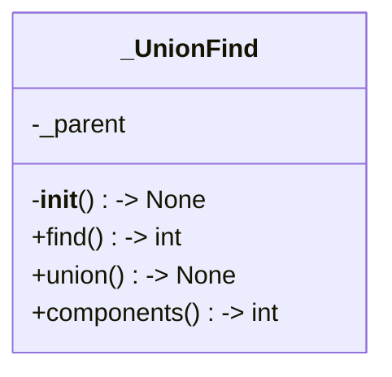
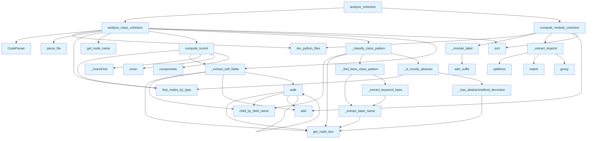

# File: `src/local_deepwiki/generators/analysis/cohesion.py`

## File Overview

This file implements cohesion metrics for Python code analysis, specifically computing:
1. **LCOM4 (Lack of Cohesion of Methods)** for individual classes
2. **Module import cohesion** by measuring internal vs. external imports

The implementation is purely static, using tree-sitter AST parsing and does not involve any LLM calls. It is designed to analyze code structure and identify potential design smells related to cohesion — such as classes with low internal connectivity or modules with poor internal import patterns.

This file is part of the `local_deepwiki` codebase and is used by various analysis tools, including those that generate architecture reports and design smell detection.

## Key Concepts

### 1. **LCOM4 Algorithm**
LCOM4 measures how cohesive a class is by analyzing the connectivity between its methods in a method-field graph:
- Each method is connected to the fields it accesses.
- Methods sharing at least one field are considered connected.
- The number of connected components gives the LCOM4 value.
  - A value of 1 indicates perfect cohesion.
  - A value of 0 indicates no methods.
  - Higher values indicate lower cohesion.

**Why chosen:** LCOM4 is a well-established metric for detecting low cohesion in object-oriented code and is widely used in software quality analysis.

### 2. **Union-Find (Disjoint Set) Data Structure**
The `_UnionFind` class is used to efficiently compute connected components in the method-field graph.

**Why chosen:** Union-Find is an optimal data structure for dynamically connecting and querying disjoint sets, making it ideal for efficiently computing LCOM4.

### 3. **Pattern Classification for Classes**
The `_classify_class_pattern` function identifies special class types:
- Abstract Base Classes (ABC)
- Protocol classes
- Mixin classes

These patterns are excluded from LCOM4 computation as LCOM4 is misleading for such classes.

**Why chosen:** Direct LCOM4 computation on abstract or protocol classes can be misleading, so these are handled separately to provide more accurate insights.

### 4. **Module Cohesion via Import Ratio**
The module cohesion analysis computes the ratio of internal imports (imports within the same module/package) to total imports.

**Why chosen:** This metric helps identify modules that are overly dependent on external code, which can indicate poor encapsulation or design issues.

## Integration

This file is part of the `local_deepwiki.generators.analysis` module and integrates with:
- [`CodeParser`](../../core/parser/code_parser.md) from `local_deepwiki.core.parser.code_parser` for AST parsing.
- [`iter_python_files`](source_filter.md) from `local_deepwiki.generators.analysis.source_filter` to enumerate Python files.
- [`find_nodes_by_type`](../../core/parser/ast_utils.md), [`get_node_name`](../../core/parser/ast_utils.md), [`get_node_text`](../../core/parser/ast_utils.md) from `local_deepwiki.core.parser.ast_utils` for AST traversal and node information.
- `CLASS_NODE_TYPES`, `FUNCTION_NODE_TYPES` from `local_deepwiki.core.chunk_extractors` to identify class and method nodes.

It is called by:
- `test_cohesion` for unit testing
- `layer_analysis` via `_extract_imports`
- `coupling` and `module_dependencies` via `_module_label`

## Design Notes

### 1. **AST Walking and Field Extraction**
The `_extract_self_fields` function walks the AST of a method to find all `self.<field>` access patterns. This is a lightweight way to extract field usage without full semantic analysis.

### 2. **Handling Special Class Types**
The code recognizes and excludes certain class types (ABC, Protocol, Mixin) from LCOM4 analysis. This avoids misinterpretation of metrics for these well-defined patterns.

### 3. **Module Labeling and Parent Resolution**
The `_module_label` and `_parent_module` functions convert file paths to dotted module labels and resolve parent modules. This is crucial for correctly associating imports with their source modules.

### 4. **Edge Case Handling**
- Empty or unreadable files are skipped.
- Files with no imports are still registered in their module.
- Low cohesion modules are filtered to avoid penalizing small, independent packages (e.g., `providers/llm`).
- The LCOM4 computation gracefully handles classes with no methods or fields.

### 5. **Performance Considerations**
- The use of `UnionFind` ensures efficient computation of connected components.
- AST traversal is done in a single pass for each method.
- File reading and parsing are batched and filtered for performance.

### 6. **Language Support**
- The code is written with `LangEnum` support, though currently only Python is supported.
- `FUNCTION_NODE_TYPES` and `CLASS_NODE_TYPES` are used to ensure correct node identification based on language.

This implementation is designed to be robust, efficient, and suitable for static analysis of large codebases.

## API Reference

### Functions

#### `walk`

```python
def walk(node: Any) -> None
```


| Parameter | Type | Default | Description |
|-----------|------|---------|-------------|
| `node` | `Any` | - | - |

**Returns:** `None`


<details>
<summary>View Source (lines 72-82) | <a href="https://github.com/UrbanDiver/local-deepwiki-mcp/blob/main/src/local_deepwiki/generators/analysis/cohesion.py#L72-L82">GitHub</a></summary>

```python
def walk(node: Any) -> None:
        if node.type == "attribute":
            children = node.children
            if len(children) >= 2:
                obj = children[0]
                if obj.type == "identifier" and get_node_text(obj, source) == "self":
                    attr = node.child_by_field_name("attribute")
                    if attr:
                        fields.add(get_node_text(attr, source))
        for child in node.children:
            walk(child)
```

</details>

#### `compute_lcom4`

```python
def compute_lcom4(class_node: Any, source: bytes, language: LangEnum) -> int
```

Compute LCOM4 for a single class node.  LCOM4 counts the connected components in the method-field graph where methods sharing at least one field are connected.


| Parameter | Type | Default | Description |
|-----------|------|---------|-------------|
| `class_node` | `Any` | - | Tree-sitter node for the class. |
| `source` | `bytes` | - | Original source as bytes. |
| `language` | `LangEnum` | - | Programming language of the source. |

**Returns:** `int`


<details>
<summary>View Source (lines 184-218) | <a href="https://github.com/UrbanDiver/local-deepwiki-mcp/blob/main/src/local_deepwiki/generators/analysis/cohesion.py#L184-L218">GitHub</a></summary>

```python
def compute_lcom4(class_node: Any, source: bytes, language: LangEnum) -> int:
    """Compute LCOM4 for a single class node.

    LCOM4 counts the connected components in the method-field graph where
    methods sharing at least one field are connected.

    Args:
        class_node: Tree-sitter node for the class.
        source: Original source as bytes.
        language: Programming language of the source.

    Returns:
        Number of connected components (1 = perfectly cohesive, 0 = no methods).
    """
    func_types = FUNCTION_NODE_TYPES.get(language)
    if func_types is None:
        return 0

    methods = find_nodes_by_type(class_node, func_types)
    if not methods:
        return 0

    # Build method -> fields mapping
    method_fields: list[set[str]] = [_extract_self_fields(m, source) for m in methods]

    n = len(methods)
    uf = _UnionFind(n)

    # Connect methods that share at least one field
    for i in range(n):
        for j in range(i + 1, n):
            if method_fields[i] & method_fields[j]:
                uf.union(i, j)

    return uf.components()
```

</details>

#### `analyze_class_cohesion`

```python
def analyze_class_cohesion(repo_path: Path, language: LangEnum | None = None, exclude_tests: bool = True) -> list[dict[str, Any]]
```

Walk Python files, parse each, find classes, compute LCOM4 per class.


| Parameter | Type | Default | Description |
|-----------|------|---------|-------------|
| `repo_path` | `Path` | - | Root of the repository. |
| `language` | `LangEnum | None` | `None` | Restrict to this language (currently only Python supported). |
| `exclude_tests` | `bool` | `True` | Skip test files when True. |

**Returns:** `list[dict[str, Any]]`


<details>
<summary>View Source (lines 226-282) | <a href="https://github.com/UrbanDiver/local-deepwiki-mcp/blob/main/src/local_deepwiki/generators/analysis/cohesion.py#L226-L282">GitHub</a></summary>

```python
def analyze_class_cohesion(
    repo_path: Path,
    *,
    language: LangEnum | None = None,
    exclude_tests: bool = True,
) -> list[dict[str, Any]]:
    """Walk Python files, parse each, find classes, compute LCOM4 per class.

    Args:
        repo_path: Root of the repository.
        language: Restrict to this language (currently only Python supported).
        exclude_tests: Skip test files when True.

    Returns:
        List of dicts sorted by LCOM4 descending.
    """
    lang = language or LangEnum.PYTHON
    parser = CodeParser()
    results: list[dict[str, Any]] = []

    for full_path, rel_path in iter_python_files(
        repo_path, exclude_tests=exclude_tests
    ):
        parsed = parser.parse_file(full_path)
        if parsed is None:
            continue
        root, detected_lang, source = parsed

        class_types = CLASS_NODE_TYPES.get(detected_lang)
        if class_types is None:
            continue

        for cls_node in find_nodes_by_type(root, class_types):
            cls_name = get_node_name(cls_node, source, detected_lang) or "<anonymous>"
            lcom4 = compute_lcom4(cls_node, source, detected_lang)
            pattern = _classify_class_pattern(cls_node, source)

            func_types = FUNCTION_NODE_TYPES.get(detected_lang, set())
            methods = find_nodes_by_type(cls_node, func_types)
            all_fields: set[str] = set()
            for m in methods:
                all_fields |= _extract_self_fields(m, source)

            results.append(
                {
                    "class_name": cls_name,
                    "file": str(rel_path),
                    "line": cls_node.start_point[0] + 1,
                    "lcom4": lcom4,
                    "method_count": len(methods),
                    "field_count": len(all_fields),
                    "pattern": pattern,
                }
            )

    results.sort(key=lambda r: r["lcom4"], reverse=True)
    return results
```

</details>

#### `compute_module_cohesion`

```python
def compute_module_cohesion(repo_path: Path) -> list[dict[str, Any]]
```

Compute internal-import ratio per module directory.  A "module" is a Python package directory. For each module, counts total imports and how many reference files within the same module.


| Parameter | Type | Default | Description |
|-----------|------|---------|-------------|
| `repo_path` | `Path` | - | Root of the repository. |

**Returns:** `list[dict[str, Any]]`


<details>
<summary>View Source (lines 335-398) | <a href="https://github.com/UrbanDiver/local-deepwiki-mcp/blob/main/src/local_deepwiki/generators/analysis/cohesion.py#L335-L398">GitHub</a></summary>

```python
def compute_module_cohesion(repo_path: Path) -> list[dict[str, Any]]:
    """Compute internal-import ratio per module directory.

    A "module" is a Python package directory. For each module, counts total
    imports and how many reference files within the same module.

    Args:
        repo_path: Root of the repository.

    Returns:
        List of dicts sorted by cohesion_ratio ascending (least cohesive first).
    """
    # Gather per-module data
    module_data: dict[str, dict[str, Any]] = defaultdict(
        lambda: {"internal": 0, "total": 0, "files": set()}
    )

    for py_file, rel_path in iter_python_files(repo_path, exclude_tests=True):
        file_label = _module_label(rel_path)
        parent = _parent_module(file_label)

        try:
            source = py_file.read_text(encoding="utf-8", errors="replace")
        except OSError:
            logger.warning("Could not read %s", py_file)
            continue

        imports = _extract_imports(source)
        if not imports:
            # Still register the file in its module
            module_data[parent]["files"].add(str(rel_path))
            continue

        module_data[parent]["files"].add(str(rel_path))

        for dotted in imports:
            module_data[parent]["total"] += 1

            # Check if the import is internal to this module.
            # Import path is already a dotted module name (e.g. "mypkg.b"),
            # and parent is also a dotted label (e.g. "mypkg"), so we can
            # compare directly.
            import_parent = _parent_module(dotted)

            if import_parent == parent or dotted.startswith(parent + "."):
                module_data[parent]["internal"] += 1

    results: list[dict[str, Any]] = []
    for mod_name, data in module_data.items():
        total = data["total"]
        internal = data["internal"]
        ratio = internal / total if total > 0 else 0.0
        results.append(
            {
                "module": mod_name,
                "internal_imports": internal,
                "total_imports": total,
                "cohesion_ratio": round(ratio, 4),
                "file_count": len(data["files"]),
            }
        )

    results.sort(key=lambda r: r["cohesion_ratio"])
    return results
```

</details>

#### `analyze_cohesion`

```python
def analyze_cohesion(repo_path: Path, top_n: int = 20, exclude_tests: bool = True) -> dict[str, Any]
```

Run both class and module cohesion analyses.


| Parameter | Type | Default | Description |
|-----------|------|---------|-------------|
| `repo_path` | `Path` | - | Root of the repository. |
| `top_n` | `int` | `20` | Max number of classes to return (highest LCOM4 first). |
| `exclude_tests` | `bool` | `True` | Skip test files. |

**Returns:** `dict[str, Any]`


<details>
<summary>View Source (lines 406-456) | <a href="https://github.com/UrbanDiver/local-deepwiki-mcp/blob/main/src/local_deepwiki/generators/analysis/cohesion.py#L406-L456">GitHub</a></summary>

```python
def analyze_cohesion(
    repo_path: Path,
    *,
    top_n: int = 20,
    exclude_tests: bool = True,
) -> dict[str, Any]:
    """Run both class and module cohesion analyses.

    Args:
        repo_path: Root of the repository.
        top_n: Max number of classes to return (highest LCOM4 first).
        exclude_tests: Skip test files.

    Returns:
        Dict with ``status``, ``class_cohesion``, ``module_cohesion``,
        and ``stats`` keys.
    """
    all_classes = analyze_class_cohesion(repo_path, exclude_tests=exclude_tests)
    module_results = compute_module_cohesion(repo_path)

    total_classes = len(all_classes)
    regular_classes = [c for c in all_classes if c.get("pattern") is None]
    pattern_count = total_classes - len(regular_classes)
    classes_gt_2 = sum(1 for c in regular_classes if c["lcom4"] > 2)
    avg_lcom = (
        sum(c["lcom4"] for c in regular_classes) / len(regular_classes)
        if regular_classes
        else 0.0
    )
    # Don't penalize small leaf packages with 0 internal imports —
    # they're likely independent implementations (e.g. providers/llm).
    low_cohesion_modules = sum(
        1
        for m in module_results
        if m["cohesion_ratio"] < 0.3
        and not (m["internal_imports"] == 0 and m["file_count"] < 6)
    )

    return {
        "status": "success",
        "class_cohesion": all_classes[:top_n],
        "module_cohesion": module_results,
        "stats": {
            "total_classes": total_classes,
            "classes_with_lcom_gt_2": classes_gt_2,
            "avg_lcom": round(avg_lcom, 2),
            "total_modules": len(module_results),
            "low_cohesion_modules": low_cohesion_modules,
            "excluded_pattern_classes": pattern_count,
        },
    }
```

</details>

## Class Diagram



## Call Graph



## Used By

Functions and methods in this file and their callers:

- **[`CodeParser`](../../core/parser/code_parser.md)**: called by `analyze_class_cohesion`
- **`_UnionFind`**: called by `compute_lcom4`
- **`_classify_class_pattern`**: called by `analyze_class_cohesion`
- **`_extract_base_name`**: called by `_extract_keyword_base`, `_find_base_class_pattern`
- **`_extract_imports`**: called by `compute_module_cohesion`
- **`_extract_keyword_base`**: called by `_find_base_class_pattern`
- **`_extract_self_fields`**: called by `analyze_class_cohesion`, `compute_lcom4`
- **`_find_base_class_pattern`**: called by `_classify_class_pattern`
- **`_has_abstractmethod_decorator`**: called by `_is_mostly_abstract`
- **`_is_mostly_abstract`**: called by `_classify_class_pattern`
- **`_module_label`**: called by `compute_module_cohesion`
- **`_parent_module`**: called by `compute_module_cohesion`
- **`add`**: called by `_extract_self_fields`, `compute_module_cohesion`, `walk`
- **`analyze_class_cohesion`**: called by `analyze_cohesion`
- **`child_by_field_name`**: called by `_classify_class_pattern`, `_extract_self_fields`, `walk`
- **`components`**: called by `compute_lcom4`
- **`compute_lcom4`**: called by `analyze_class_cohesion`
- **`compute_module_cohesion`**: called by `analyze_cohesion`
- **`defaultdict`**: called by `compute_module_cohesion`
- **[`find_nodes_by_type`](../../core/parser/ast_utils.md)**: called by `_is_mostly_abstract`, `analyze_class_cohesion`, `compute_lcom4`
- **[`get_node_name`](../../core/parser/ast_utils.md)**: called by `analyze_class_cohesion`
- **[`get_node_text`](../../core/parser/ast_utils.md)**: called by `_classify_class_pattern`, `_extract_base_name`, `_extract_self_fields`, `_has_abstractmethod_decorator`, `walk`
- **`group`**: called by `_extract_imports`
- **[`iter_python_files`](source_filter.md)**: called by `analyze_class_cohesion`, `compute_module_cohesion`
- **`match`**: called by `_extract_imports`
- **`parse_file`**: called by `analyze_class_cohesion`
- **`read_text`**: called by `compute_module_cohesion`
- **`sort`**: called by `analyze_class_cohesion`, `compute_module_cohesion`
- **`splitlines`**: called by `_extract_imports`
- **`union`**: called by `compute_lcom4`
- **`walk`**: called by `_extract_self_fields`, `walk`
- **`with_suffix`**: called by `_module_label`

## Usage Examples

*Examples extracted from test files*

### All methods share the same fields -> LCOM4 = 1

From `test_cohesion.py::test_compute_lcom4_perfectly_cohesive`:

```python
from local_deepwiki.generators.analysis.cohesion import compute_lcom4
    from local_deepwiki.core.parser.code_parser import CodeParser
    from local_deepwiki.models import Language as LangEnum

    source = """
class Cohesive:
    def __init__(self):
        self.x = 0
        self.y = 0
    def get_x(self):
        return self.x
    def get_y(self):
        return self.y
    def get_both(self):
        return self.x + self.y
"""
    parser = CodeParser()
    root = parser.parse_source(source, LangEnum.PYTHON)
    from local_deepwiki.core.parser.ast_utils import find_nodes_by_type
    from local_deepwiki.core.chunk_extractors import CLASS_NODE_TYPES

    classes = find_nodes_by_type(root, CLASS_NODE_TYPES[LangEnum.PYTHON])
    assert len(classes) == 1
    result = compute_lcom4(classes[0], source.encode(), LangEnum.PYTHON)
    assert result == 1
```

### All methods share the same fields -> LCOM4 = 1

From `test_cohesion.py::test_compute_lcom4_perfectly_cohesive`:

```python
from local_deepwiki.generators.analysis.cohesion import compute_lcom4
    from local_deepwiki.core.parser.code_parser import CodeParser
    from local_deepwiki.models import Language as LangEnum

    source = """
class Cohesive:
    def __init__(self):
        self.x = 0
        self.y = 0
    def get_x(self):
        return self.x
    def get_y(self):
        return self.y
    def get_both(self):
        return self.x + self.y
"""
    parser = CodeParser()
    root = parser.parse_source(source, LangEnum.PYTHON)
    from local_deepwiki.core.parser.ast_utils import find_nodes_by_type
    from local_deepwiki.core.chunk_extractors import CLASS_NODE_TYPES

    classes = find_nodes_by_type(root, CLASS_NODE_TYPES[LangEnum.PYTHON])
    assert len(classes) == 1
    result = compute_lcom4(classes[0], source.encode(), LangEnum.PYTHON)
    assert result == 1
```

### Two groups of methods access disjoint fields -> LCOM4 = 2

From `test_cohesion.py::test_compute_lcom4_splittable`:

```python
from local_deepwiki.generators.analysis.cohesion import compute_lcom4
    from local_deepwiki.core.parser.code_parser import CodeParser
    from local_deepwiki.models import Language as LangEnum

    source = """
class Splittable:
    def set_a(self):
        self.a = 1
    def get_a(self):
        return self.a
    def set_b(self):
        self.b = 2
    def get_b(self):
        return self.b
"""
    parser = CodeParser()
    root = parser.parse_source(source, LangEnum.PYTHON)
    from local_deepwiki.core.parser.ast_utils import find_nodes_by_type
    from local_deepwiki.core.chunk_extractors import CLASS_NODE_TYPES

    classes = find_nodes_by_type(root, CLASS_NODE_TYPES[LangEnum.PYTHON])
    result = compute_lcom4(classes[0], source.encode(), LangEnum.PYTHON)
    assert result == 2
```

### Class inheriting from ABC is classified as 'abc'

From `test_cohesion.py::test_classify_abc_class`:

```python
from local_deepwiki.generators.analysis.cohesion import _classify_class_pattern
    from local_deepwiki.models import Language as LangEnum

    source = """
from abc import ABC, abstractmethod

class MyBase(ABC):
    @abstractmethod
    def do_thing(self):
        pass
    @abstractmethod
    def do_other(self):
        pass
"""
    parser = CodeParser()
    root = parser.parse_source(source, LangEnum.PYTHON)
    classes = find_nodes_by_type(root, CLASS_NODE_TYPES[LangEnum.PYTHON])
    assert len(classes) == 1
    result = _classify_class_pattern(classes[0], source.encode())
    assert result == "abc"
```

### Class inheriting from Protocol is classified as 'protocol'

From `test_cohesion.py::test_classify_protocol_class`:

```python
from local_deepwiki.generators.analysis.cohesion import _classify_class_pattern
    from local_deepwiki.models import Language as LangEnum

    source = """
from typing import Protocol

class Readable(Protocol):
    def read(self) -> bytes:
        ...
"""
    parser = CodeParser()
    root = parser.parse_source(source, LangEnum.PYTHON)
    classes = find_nodes_by_type(root, CLASS_NODE_TYPES[LangEnum.PYTHON])
    assert len(classes) == 1
    result = _classify_class_pattern(classes[0], source.encode())
    assert result == "protocol"
```


## Last Modified

| Entity | Type | Author | Date | Commit |
|--------|------|--------|------|--------|
| `_extract_keyword_base` | function | Brian Breidenbach | today | `cb56fa2` refactor: reduce cognitive ... |
| `_find_base_class_pattern` | function | Brian Breidenbach | today | `cb56fa2` refactor: reduce cognitive ... |
| `_is_mostly_abstract` | function | Brian Breidenbach | today | `cb56fa2` refactor: reduce cognitive ... |
| `_classify_class_pattern` | function | Brian Breidenbach | today | `cb56fa2` refactor: reduce cognitive ... |
| `_extract_base_name` | function | Brian Breidenbach | today | `4fb073b` feat: pattern-aware cohesio... |
| `_has_abstractmethod_decorator` | function | Brian Breidenbach | today | `4fb073b` feat: pattern-aware cohesio... |
| `analyze_class_cohesion` | function | Brian Breidenbach | today | `4fb073b` feat: pattern-aware cohesio... |
| `analyze_cohesion` | function | Brian Breidenbach | today | `4fb073b` feat: pattern-aware cohesio... |
| `_UnionFind` | class | Brian Breidenbach | today | `0d6b194` feat: add LCOM4 class cohes... |
| `_extract_self_fields` | function | Brian Breidenbach | today | `0d6b194` feat: add LCOM4 class cohes... |
| `walk` | function | Brian Breidenbach | today | `0d6b194` feat: add LCOM4 class cohes... |
| `compute_lcom4` | function | Brian Breidenbach | today | `0d6b194` feat: add LCOM4 class cohes... |
| `_extract_imports` | function | Brian Breidenbach | today | `0d6b194` feat: add LCOM4 class cohes... |
| `_module_label` | function | Brian Breidenbach | today | `0d6b194` feat: add LCOM4 class cohes... |
| `_parent_module` | function | Brian Breidenbach | today | `0d6b194` feat: add LCOM4 class cohes... |
| `compute_module_cohesion` | function | Brian Breidenbach | today | `0d6b194` feat: add LCOM4 class cohes... |

## Additional Source Code

Source code for functions and methods not listed in the API Reference above.

### `_UnionFind`

<details>
<summary>View Source (lines 40-60) | <a href="https://github.com/UrbanDiver/local-deepwiki-mcp/blob/main/src/local_deepwiki/generators/analysis/cohesion.py#L40-L60">GitHub</a></summary>

```python
class _UnionFind:
    """Disjoint-set data structure with path compression."""

    __slots__ = ("_parent",)

    def __init__(self, n: int) -> None:
        self._parent = list(range(n))

    def find(self, x: int) -> int:
        while self._parent[x] != x:
            self._parent[x] = self._parent[self._parent[x]]
            x = self._parent[x]
        return x

    def union(self, a: int, b: int) -> None:
        ra, rb = self.find(a), self.find(b)
        if ra != rb:
            self._parent[ra] = rb

    def components(self) -> int:
        return len({self.find(i) for i in range(len(self._parent))})
```

</details>


#### `_extract_self_fields`

<details>
<summary>View Source (lines 68-85) | <a href="https://github.com/UrbanDiver/local-deepwiki-mcp/blob/main/src/local_deepwiki/generators/analysis/cohesion.py#L68-L85">GitHub</a></summary>

```python
def _extract_self_fields(method_node: Any, source: bytes) -> set[str]:
    """Walk *method_node* and return names of ``self.<field>`` accesses."""
    fields: set[str] = set()

    def walk(node: Any) -> None:
        if node.type == "attribute":
            children = node.children
            if len(children) >= 2:
                obj = children[0]
                if obj.type == "identifier" and get_node_text(obj, source) == "self":
                    attr = node.child_by_field_name("attribute")
                    if attr:
                        fields.add(get_node_text(attr, source))
        for child in node.children:
            walk(child)

    walk(method_node)
    return fields
```

</details>


#### `_extract_base_name`

<details>
<summary>View Source (lines 93-105) | <a href="https://github.com/UrbanDiver/local-deepwiki-mcp/blob/main/src/local_deepwiki/generators/analysis/cohesion.py#L93-L105">GitHub</a></summary>

```python
def _extract_base_name(node: Any, source: bytes) -> str:
    """Extract the final identifier from a base class node.

    For ``ABC`` returns ``"ABC"``. For ``abc.ABC`` returns ``"ABC"``.
    """
    if node.type == "identifier":
        return get_node_text(node, source)
    if node.type == "attribute":
        # Dotted name -- last identifier child is the class name.
        children = [c for c in node.children if c.type == "identifier"]
        if children:
            return get_node_text(children[-1], source)
    return ""
```

</details>


#### `_has_abstractmethod_decorator`

<details>
<summary>View Source (lines 108-121) | <a href="https://github.com/UrbanDiver/local-deepwiki-mcp/blob/main/src/local_deepwiki/generators/analysis/cohesion.py#L108-L121">GitHub</a></summary>

```python
def _has_abstractmethod_decorator(method_node: Any, source: bytes) -> bool:
    """Return True if *method_node* has an ``@abstractmethod`` decorator."""
    parent = method_node.parent
    if parent is None or parent.type != "decorated_definition":
        return False
    for sibling in parent.children:
        if sibling.type == "decorator":
            for dec_child in sibling.children:
                if (
                    dec_child.type == "identifier"
                    and get_node_text(dec_child, source) == "abstractmethod"
                ):
                    return True
    return False
```

</details>


#### `_extract_keyword_base`

<details>
<summary>View Source (lines 124-130) | <a href="https://github.com/UrbanDiver/local-deepwiki-mcp/blob/main/src/local_deepwiki/generators/analysis/cohesion.py#L124-L130">GitHub</a></summary>

```python
def _extract_keyword_base(kw_node: Any, source: bytes) -> str:
    """Extract the base name from a keyword argument like ``metaclass=ABCMeta``."""
    for child in kw_node.children:
        name = _extract_base_name(child, source)
        if name:
            return name
    return ""
```

</details>


#### `_find_base_class_pattern`

<details>
<summary>View Source (lines 133-150) | <a href="https://github.com/UrbanDiver/local-deepwiki-mcp/blob/main/src/local_deepwiki/generators/analysis/cohesion.py#L133-L150">GitHub</a></summary>

```python
def _find_base_class_pattern(class_node: Any, source: bytes) -> str | None:
    """Check base classes for ABC or Protocol inheritance."""
    arg_list = next((c for c in class_node.children if c.type == "argument_list"), None)
    if arg_list is None:
        return None

    for arg in arg_list.children:
        base_name = _extract_base_name(arg, source)
        if base_name in _ABC_BASES:
            return "abc"
        if base_name in _PROTOCOL_BASES:
            return "protocol"
        if arg.type == "keyword_argument":
            kw_name = _extract_keyword_base(arg, source)
            if kw_name in _ABC_BASES:
                return "abc"

    return None
```

</details>


#### `_is_mostly_abstract`

<details>
<summary>View Source (lines 153-160) | <a href="https://github.com/UrbanDiver/local-deepwiki-mcp/blob/main/src/local_deepwiki/generators/analysis/cohesion.py#L153-L160">GitHub</a></summary>

```python
def _is_mostly_abstract(class_node: Any, source: bytes) -> bool:
    """Return True if at least half of the class methods are abstract."""
    func_types = FUNCTION_NODE_TYPES.get(LangEnum.PYTHON, set())
    methods = find_nodes_by_type(class_node, func_types)
    if not methods:
        return False
    abstract_count = sum(1 for m in methods if _has_abstractmethod_decorator(m, source))
    return abstract_count >= len(methods) / 2
```

</details>


#### `_classify_class_pattern`

<details>
<summary>View Source (lines 163-181) | <a href="https://github.com/UrbanDiver/local-deepwiki-mcp/blob/main/src/local_deepwiki/generators/analysis/cohesion.py#L163-L181">GitHub</a></summary>

```python
def _classify_class_pattern(class_node: Any, source: bytes) -> str | None:
    """Classify a class as a known OOP pattern where LCOM4 is misleading.

    Returns:
        ``"abc"`` for abstract base classes, ``"protocol"`` for Protocol
        classes, ``"mixin"`` for mixin classes, or ``None`` for regular classes.
    """
    name_node = class_node.child_by_field_name("name")
    if name_node and "Mixin" in get_node_text(name_node, source):
        return "mixin"

    base_pattern = _find_base_class_pattern(class_node, source)
    if base_pattern is not None:
        return base_pattern

    if _is_mostly_abstract(class_node, source):
        return "abc"

    return None
```

</details>


#### `_extract_imports`

<details>
<summary>View Source (lines 290-300) | <a href="https://github.com/UrbanDiver/local-deepwiki-mcp/blob/main/src/local_deepwiki/generators/analysis/cohesion.py#L290-L300">GitHub</a></summary>

```python
def _extract_imports(source: str) -> list[str]:
    """Return full dotted module paths from all import statements."""
    modules: list[str] = []
    for line in source.splitlines():
        stripped = line.strip()
        for pattern in _IMPORT_PATTERNS:
            match = pattern.match(stripped)
            if match:
                modules.append(match.group(1))
                break
    return modules
```

</details>


#### `_module_label`

<details>
<summary>View Source (lines 303-320) | <a href="https://github.com/UrbanDiver/local-deepwiki-mcp/blob/main/src/local_deepwiki/generators/analysis/cohesion.py#L303-L320">GitHub</a></summary>

```python
def _module_label(rel_path: Path) -> str:
    """Convert a relative file path to a dotted module label.

    Keeps the full package hierarchy (does NOT strip the project top-level
    package) so labels match import paths exactly.

    ``src/mypkg/core/indexer.py`` -> ``mypkg.core.indexer``
    ``src/mypkg/__init__.py`` -> ``mypkg``
    """
    parts = list(rel_path.with_suffix("").parts)
    # Drop common wrapper dirs.
    while parts and parts[0] in ("src", "lib", "pkg"):
        parts = parts[1:]
    if not parts:
        return "root"
    # Collapse __init__ to parent
    meaningful = [p for p in parts if p != "__init__"]
    return ".".join(meaningful) if meaningful else parts[0]
```

</details>


#### `_parent_module`

<details>
<summary>View Source (lines 323-332) | <a href="https://github.com/UrbanDiver/local-deepwiki-mcp/blob/main/src/local_deepwiki/generators/analysis/cohesion.py#L323-L332">GitHub</a></summary>

```python
def _parent_module(label: str) -> str:
    """Return the parent module label (everything up to the last dot).

    ``core.parser.ast_utils`` -> ``core.parser``
    ``core`` -> ``core``
    """
    parts = label.split(".")
    if len(parts) <= 1:
        return label
    return ".".join(parts[:-1])
```

</details>

## Relevant Source Files

- `src/local_deepwiki/generators/analysis/cohesion.py:40-60`
