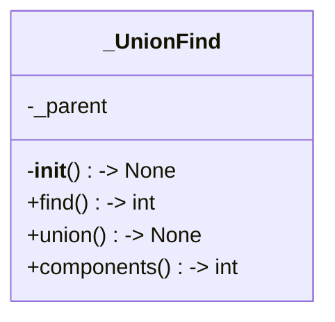
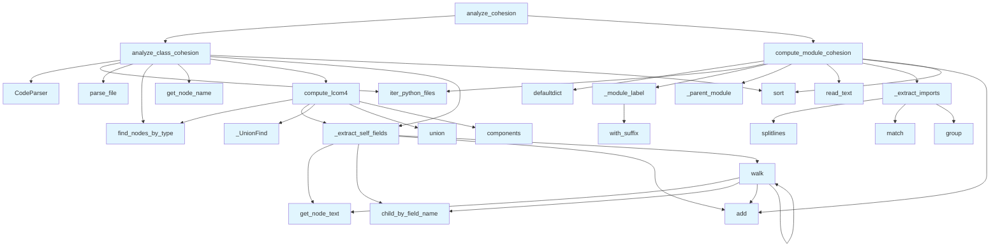

# File: `src/local_deepwiki/generators/analysis/cohesion.py`

## File Overview

This file computes cohesion metrics for Python code, specifically focusing on **class cohesion** and **module import cohesion**. It uses static analysis via the Tree-sitter AST parser to extract information from source code without any external LLM calls.

The **class cohesion** is measured using the **LCOM4 metric**, which evaluates how well methods in a class are related by shared instance variables (fields). A lower LCOM4 value indicates higher cohesion.

The **module cohesion** is measured by computing the **internal-import ratio** — the proportion of imports within a module that refer to other files in the same module. This helps identify modules with high internal coupling and low cohesion.

## Key Concepts

### 1. **LCOM4 (Lack of Cohesion of Methods)**
- **What it measures**: The number of connected components in the method-field graph where methods sharing at least one field are connected.
- **Why it was chosen**: LCOM4 is a well-established metric for quantifying class cohesion, offering a numeric value that can be compared across classes.
- **Algorithm**:
  - For each class, extract all methods.
  - For each method, identify the instance fields it accesses (`self.<field>`).
  - Use a **Union-Find** data structure to group methods that share fields.
  - The number of connected components equals the LCOM4 value.

### 2. **Union-Find Data Structure**
- **What it is**: A disjoint-set data structure that supports efficient union and find operations with path compression.
- **Why it was chosen**: It is optimal for grouping elements into connected components, which is exactly what is needed for computing LCOM4.

### 3. **Module Cohesion via Internal-Import Ratio**
- **What it measures**: The ratio of internal imports to total imports in a module.
- **Why it was chosen**: This provides a simple, actionable metric for identifying modules with poor internal structure or high coupling to external dependencies.
- **Implementation**:
  - For each Python file, parse import statements.
  - Determine the module label for the file and each import.
  - Count how many imports refer to the same module (internal).
  - Compute the ratio.

### 4. **Path-to-Module Label Conversion**
- **What it does**: Converts file paths like `src/mypkg/core/indexer.py` into dotted module labels like `mypkg.core.indexer`.
- **Why it was chosen**: Ensures consistent and accurate matching of imports to modules, especially when dealing with nested packages.

## Integration

This file is part of the **analysis** module and is used by several test and CLI components:

- **Called by**:
  - `test_cohesion`: Tests both `analyze_class_cohesion` and `compute_module_cohesion`.
  - `layer_analysis`: Uses `_extract_imports`.
  - `coupling`: Uses `_module_label` and `_parent_module`.
  - `module_dependencies`: Uses `_module_label` and `_parent_module`.

It integrates with:
- [`CodeParser`](../../core/parser/code_parser.md) from `local_deepwiki.core.parser.code_parser` to parse Python files.
- [`iter_python_files`](source_filter.md) from `local_deepwiki.generators.analysis.source_filter` to traverse the repository.
- [`find_nodes_by_type`](../../core/parser/ast_utils.md), [`get_node_name`](../../core/parser/ast_utils.md), [`get_node_text`](../../core/parser/ast_utils.md) from `local_deepwiki.core.parser.ast_utils` for AST traversal and node information.
- `CLASS_NODE_TYPES`, `FUNCTION_NODE_TYPES` from `local_deepwiki.core.chunk_extractors` to identify class and function nodes.
- `LangEnum` from `local_deepwiki.models` to support language-specific parsing.

## Design Notes

### 1. **LCOM4 Computation**
- The algorithm correctly identifies shared fields by walking the AST and checking for `self.<field>` patterns.
- It uses a **Union-Find** structure to efficiently compute connected components, avoiding a quadratic complexity for comparing all pairs of methods.
- Edge cases like classes with no methods or no fields are handled gracefully by returning `0`.

### 2. **Import Parsing**
- Uses regular expressions to match import patterns, including `import <module>` and `from <module> import ...`.
- The `_IMPORT_PATTERNS` list is not shown but is assumed to be defined elsewhere (likely in the same file or imported).
- Files that cannot be read are skipped with a warning, ensuring robustness.

### 3. **Module Labeling**
- The `_module_label` function strips common [wrapper](../../handlers/_error_handling.md) directories like `src`, `lib`, `pkg`, to produce clean module labels.
- It also collapses `__init__.py` entries to their parent module to ensure consistent labeling.
- This design allows for precise matching of import paths with module labels.

### 4. **Cohesion Ratio Calculation**
- The ratio is calculated as `internal_imports / total_imports`, rounded to 4 decimal places.
- Modules with no imports are correctly assigned a ratio of `0.0`.
- Sorting by cohesion ratio ascending helps identify the least cohesive modules first, which is useful for refactoring.

### 5. **Performance Considerations**
- AST parsing and traversal are done per file, avoiding full repository parsing in a single pass.
- Union-Find ensures efficient LCOM4 computation even for classes with many methods.
- No external services or LLMs are used, keeping the analysis fast and deterministic.

### 6. **Test Exclusion**
- By default, test files are excluded (`exclude_tests=True`) to avoid skewing cohesion metrics with test-specific code.
- This behavior is consistent with other analysis tools in the project.

### 7. **Error Handling**
- File reading errors are caught and logged with a warning, ensuring the analysis does not crash on corrupted or inaccessible files.
- Empty or invalid ASTs are gracefully skipped.

## API Reference

### Functions

#### `walk`

```python
def walk(node: Any) -> None
```


| Parameter | Type | Default | Description |
|-----------|------|---------|-------------|
| `node` | `Any` | - | - |

**Returns:** `None`


<details>
<summary>View Source (lines 72-82) | <a href="https://github.com/UrbanDiver/local-deepwiki-mcp/blob/main/src/local_deepwiki/generators/analysis/cohesion.py#L72-L82">GitHub</a></summary>

```python
def walk(node: Any) -> None:
        if node.type == "attribute":
            children = node.children
            if len(children) >= 2:
                obj = children[0]
                if obj.type == "identifier" and get_node_text(obj, source) == "self":
                    attr = node.child_by_field_name("attribute")
                    if attr:
                        fields.add(get_node_text(attr, source))
        for child in node.children:
            walk(child)
```

</details>

#### `compute_lcom4`

```python
def compute_lcom4(class_node: Any, source: bytes, language: LangEnum) -> int
```

Compute LCOM4 for a single class node.  LCOM4 counts the connected components in the method-field graph where methods sharing at least one field are connected.


| Parameter | Type | Default | Description |
|-----------|------|---------|-------------|
| `class_node` | `Any` | - | Tree-sitter node for the class. |
| `source` | `bytes` | - | Original source as bytes. |
| `language` | `LangEnum` | - | Programming language of the source. |

**Returns:** `int`


<details>
<summary>View Source (lines 88-122) | <a href="https://github.com/UrbanDiver/local-deepwiki-mcp/blob/main/src/local_deepwiki/generators/analysis/cohesion.py#L88-L122">GitHub</a></summary>

```python
def compute_lcom4(class_node: Any, source: bytes, language: LangEnum) -> int:
    """Compute LCOM4 for a single class node.

    LCOM4 counts the connected components in the method-field graph where
    methods sharing at least one field are connected.

    Args:
        class_node: Tree-sitter node for the class.
        source: Original source as bytes.
        language: Programming language of the source.

    Returns:
        Number of connected components (1 = perfectly cohesive, 0 = no methods).
    """
    func_types = FUNCTION_NODE_TYPES.get(language)
    if func_types is None:
        return 0

    methods = find_nodes_by_type(class_node, func_types)
    if not methods:
        return 0

    # Build method -> fields mapping
    method_fields: list[set[str]] = [_extract_self_fields(m, source) for m in methods]

    n = len(methods)
    uf = _UnionFind(n)

    # Connect methods that share at least one field
    for i in range(n):
        for j in range(i + 1, n):
            if method_fields[i] & method_fields[j]:
                uf.union(i, j)

    return uf.components()
```

</details>

#### `analyze_class_cohesion`

```python
def analyze_class_cohesion(repo_path: Path, language: LangEnum | None = None, exclude_tests: bool = True) -> list[dict[str, Any]]
```

Walk Python files, parse each, find classes, compute LCOM4 per class.


| Parameter | Type | Default | Description |
|-----------|------|---------|-------------|
| `repo_path` | `Path` | - | Root of the repository. |
| `language` | `LangEnum | None` | `None` | Restrict to this language (currently only Python supported). |
| `exclude_tests` | `bool` | `True` | Skip test files when True. |

**Returns:** `list[dict[str, Any]]`


<details>
<summary>View Source (lines 130-182) | <a href="https://github.com/UrbanDiver/local-deepwiki-mcp/blob/main/src/local_deepwiki/generators/analysis/cohesion.py#L130-L182">GitHub</a></summary>

```python
def analyze_class_cohesion(
    repo_path: Path,
    *,
    language: LangEnum | None = None,
    exclude_tests: bool = True,
) -> list[dict[str, Any]]:
    """Walk Python files, parse each, find classes, compute LCOM4 per class.

    Args:
        repo_path: Root of the repository.
        language: Restrict to this language (currently only Python supported).
        exclude_tests: Skip test files when True.

    Returns:
        List of dicts sorted by LCOM4 descending.
    """
    lang = language or LangEnum.PYTHON
    parser = CodeParser()
    results: list[dict[str, Any]] = []

    for full_path, rel_path in iter_python_files(repo_path, exclude_tests=exclude_tests):
        parsed = parser.parse_file(full_path)
        if parsed is None:
            continue
        root, detected_lang, source = parsed

        class_types = CLASS_NODE_TYPES.get(detected_lang)
        if class_types is None:
            continue

        for cls_node in find_nodes_by_type(root, class_types):
            cls_name = get_node_name(cls_node, source, detected_lang) or "<anonymous>"
            lcom4 = compute_lcom4(cls_node, source, detected_lang)

            func_types = FUNCTION_NODE_TYPES.get(detected_lang, set())
            methods = find_nodes_by_type(cls_node, func_types)
            all_fields: set[str] = set()
            for m in methods:
                all_fields |= _extract_self_fields(m, source)

            results.append(
                {
                    "class_name": cls_name,
                    "file": str(rel_path),
                    "line": cls_node.start_point[0] + 1,
                    "lcom4": lcom4,
                    "method_count": len(methods),
                    "field_count": len(all_fields),
                }
            )

    results.sort(key=lambda r: r["lcom4"], reverse=True)
    return results
```

</details>

#### `compute_module_cohesion`

```python
def compute_module_cohesion(repo_path: Path) -> list[dict[str, Any]]
```

Compute internal-import ratio per module directory.  A "module" is a Python package directory. For each module, counts total imports and how many reference files within the same module.


| Parameter | Type | Default | Description |
|-----------|------|---------|-------------|
| `repo_path` | `Path` | - | Root of the repository. |

**Returns:** `list[dict[str, Any]]`


<details>
<summary>View Source (lines 235-298) | <a href="https://github.com/UrbanDiver/local-deepwiki-mcp/blob/main/src/local_deepwiki/generators/analysis/cohesion.py#L235-L298">GitHub</a></summary>

```python
def compute_module_cohesion(repo_path: Path) -> list[dict[str, Any]]:
    """Compute internal-import ratio per module directory.

    A "module" is a Python package directory. For each module, counts total
    imports and how many reference files within the same module.

    Args:
        repo_path: Root of the repository.

    Returns:
        List of dicts sorted by cohesion_ratio ascending (least cohesive first).
    """
    # Gather per-module data
    module_data: dict[str, dict[str, Any]] = defaultdict(
        lambda: {"internal": 0, "total": 0, "files": set()}
    )

    for py_file, rel_path in iter_python_files(repo_path, exclude_tests=True):
        file_label = _module_label(rel_path)
        parent = _parent_module(file_label)

        try:
            source = py_file.read_text(encoding="utf-8", errors="replace")
        except OSError:
            logger.warning("Could not read %s", py_file)
            continue

        imports = _extract_imports(source)
        if not imports:
            # Still register the file in its module
            module_data[parent]["files"].add(str(rel_path))
            continue

        module_data[parent]["files"].add(str(rel_path))

        for dotted in imports:
            module_data[parent]["total"] += 1

            # Check if the import is internal to this module.
            # Import path is already a dotted module name (e.g. "mypkg.b"),
            # and parent is also a dotted label (e.g. "mypkg"), so we can
            # compare directly.
            import_parent = _parent_module(dotted)

            if import_parent == parent or dotted.startswith(parent + "."):
                module_data[parent]["internal"] += 1

    results: list[dict[str, Any]] = []
    for mod_name, data in module_data.items():
        total = data["total"]
        internal = data["internal"]
        ratio = internal / total if total > 0 else 0.0
        results.append(
            {
                "module": mod_name,
                "internal_imports": internal,
                "total_imports": total,
                "cohesion_ratio": round(ratio, 4),
                "file_count": len(data["files"]),
            }
        )

    results.sort(key=lambda r: r["cohesion_ratio"])
    return results
```

</details>

#### `analyze_cohesion`

```python
def analyze_cohesion(repo_path: Path, top_n: int = 20, exclude_tests: bool = True) -> dict[str, Any]
```

Run both class and module cohesion analyses.


| Parameter | Type | Default | Description |
|-----------|------|---------|-------------|
| `repo_path` | `Path` | - | Root of the repository. |
| `top_n` | `int` | `20` | Max number of classes to return (highest LCOM4 first). |
| `exclude_tests` | `bool` | `True` | Skip test files. |

**Returns:** `dict[str, Any]`


<details>
<summary>View Source (lines 306-342) | <a href="https://github.com/UrbanDiver/local-deepwiki-mcp/blob/main/src/local_deepwiki/generators/analysis/cohesion.py#L306-L342">GitHub</a></summary>

```python
def analyze_cohesion(
    repo_path: Path,
    *,
    top_n: int = 20,
    exclude_tests: bool = True,
) -> dict[str, Any]:
    """Run both class and module cohesion analyses.

    Args:
        repo_path: Root of the repository.
        top_n: Max number of classes to return (highest LCOM4 first).
        exclude_tests: Skip test files.

    Returns:
        Dict with ``status``, ``class_cohesion``, ``module_cohesion``,
        and ``stats`` keys.
    """
    all_classes = analyze_class_cohesion(repo_path, exclude_tests=exclude_tests)
    module_results = compute_module_cohesion(repo_path)

    total_classes = len(all_classes)
    classes_gt_2 = sum(1 for c in all_classes if c["lcom4"] > 2)
    avg_lcom = sum(c["lcom4"] for c in all_classes) / total_classes if total_classes > 0 else 0.0
    low_cohesion_modules = sum(1 for m in module_results if m["cohesion_ratio"] < 0.3)

    return {
        "status": "success",
        "class_cohesion": all_classes[:top_n],
        "module_cohesion": module_results,
        "stats": {
            "total_classes": total_classes,
            "classes_with_lcom_gt_2": classes_gt_2,
            "avg_lcom": round(avg_lcom, 2),
            "total_modules": len(module_results),
            "low_cohesion_modules": low_cohesion_modules,
        },
    }
```

</details>

## Class Diagram



## Call Graph



## Used By

Functions and methods in this file and their callers:

- **[`CodeParser`](../../core/parser/code_parser.md)**: called by `analyze_class_cohesion`
- **`_UnionFind`**: called by `compute_lcom4`
- **`_extract_imports`**: called by `compute_module_cohesion`
- **`_extract_self_fields`**: called by `analyze_class_cohesion`, `compute_lcom4`
- **`_module_label`**: called by `compute_module_cohesion`
- **`_parent_module`**: called by `compute_module_cohesion`
- **`add`**: called by `_extract_self_fields`, `compute_module_cohesion`, `walk`
- **`analyze_class_cohesion`**: called by `analyze_cohesion`
- **`child_by_field_name`**: called by `_extract_self_fields`, `walk`
- **`components`**: called by `compute_lcom4`
- **`compute_lcom4`**: called by `analyze_class_cohesion`
- **`compute_module_cohesion`**: called by `analyze_cohesion`
- **`defaultdict`**: called by `compute_module_cohesion`
- **[`find_nodes_by_type`](../../core/parser/ast_utils.md)**: called by `analyze_class_cohesion`, `compute_lcom4`
- **[`get_node_name`](../../core/parser/ast_utils.md)**: called by `analyze_class_cohesion`
- **[`get_node_text`](../../core/parser/ast_utils.md)**: called by `_extract_self_fields`, `walk`
- **`group`**: called by `_extract_imports`
- **[`iter_python_files`](source_filter.md)**: called by `analyze_class_cohesion`, `compute_module_cohesion`
- **`match`**: called by `_extract_imports`
- **`parse_file`**: called by `analyze_class_cohesion`
- **`read_text`**: called by `compute_module_cohesion`
- **`sort`**: called by `analyze_class_cohesion`, `compute_module_cohesion`
- **`splitlines`**: called by `_extract_imports`
- **`union`**: called by `compute_lcom4`
- **`walk`**: called by `_extract_self_fields`, `walk`
- **`with_suffix`**: called by `_module_label`

## Usage Examples

*Examples extracted from test files*

### All methods share the same fields -> LCOM4 = 1

From `test_cohesion.py::test_compute_lcom4_perfectly_cohesive`:

```python
from local_deepwiki.generators.analysis.cohesion import compute_lcom4
    from local_deepwiki.core.parser.code_parser import CodeParser
    from local_deepwiki.models import Language as LangEnum

    source = """
class Cohesive:
    def __init__(self):
        self.x = 0
        self.y = 0
    def get_x(self):
        return self.x
    def get_y(self):
        return self.y
    def get_both(self):
        return self.x + self.y
"""
    parser = CodeParser()
    root = parser.parse_source(source, LangEnum.PYTHON)
    from local_deepwiki.core.parser.ast_utils import find_nodes_by_type
    from local_deepwiki.core.chunk_extractors import CLASS_NODE_TYPES

    classes = find_nodes_by_type(root, CLASS_NODE_TYPES[LangEnum.PYTHON])
    assert len(classes) == 1
    result = compute_lcom4(classes[0], source.encode(), LangEnum.PYTHON)
    assert result == 1
```

### All methods share the same fields -> LCOM4 = 1

From `test_cohesion.py::test_compute_lcom4_perfectly_cohesive`:

```python
from local_deepwiki.generators.analysis.cohesion import compute_lcom4
    from local_deepwiki.core.parser.code_parser import CodeParser
    from local_deepwiki.models import Language as LangEnum

    source = """
class Cohesive:
    def __init__(self):
        self.x = 0
        self.y = 0
    def get_x(self):
        return self.x
    def get_y(self):
        return self.y
    def get_both(self):
        return self.x + self.y
"""
    parser = CodeParser()
    root = parser.parse_source(source, LangEnum.PYTHON)
    from local_deepwiki.core.parser.ast_utils import find_nodes_by_type
    from local_deepwiki.core.chunk_extractors import CLASS_NODE_TYPES

    classes = find_nodes_by_type(root, CLASS_NODE_TYPES[LangEnum.PYTHON])
    assert len(classes) == 1
    result = compute_lcom4(classes[0], source.encode(), LangEnum.PYTHON)
    assert result == 1
```

### Two groups of methods access disjoint fields -> LCOM4 = 2

From `test_cohesion.py::test_compute_lcom4_splittable`:

```python
from local_deepwiki.generators.analysis.cohesion import compute_lcom4
    from local_deepwiki.core.parser.code_parser import CodeParser
    from local_deepwiki.models import Language as LangEnum

    source = """
class Splittable:
    def set_a(self):
        self.a = 1
    def get_a(self):
        return self.a
    def set_b(self):
        self.b = 2
    def get_b(self):
        return self.b
"""
    parser = CodeParser()
    root = parser.parse_source(source, LangEnum.PYTHON)
    from local_deepwiki.core.parser.ast_utils import find_nodes_by_type
    from local_deepwiki.core.chunk_extractors import CLASS_NODE_TYPES

    classes = find_nodes_by_type(root, CLASS_NODE_TYPES[LangEnum.PYTHON])
    result = compute_lcom4(classes[0], source.encode(), LangEnum.PYTHON)
    assert result == 2
```

### Example: `analyze_class_cohesion`

From `test_cohesion.py::test_analyze_class_cohesion`:

```python
from local_deepwiki.generators.analysis.cohesion import analyze_class_cohesion

    _write_py(
        tmp_path / "src" / "mod.py",
        """
class Foo:
    def set_x(self):
        self.x = 1
    def get_x(self):
        return self.x
    def set_y(self):
        self.y = 2
    def get_y(self):
        return self.y
""",
    )
    results = analyze_class_cohesion(tmp_path)
    assert len(results) >= 1
    assert results[0]["class_name"] == "Foo"
```

### Results should be sorted by LCOM4 descending

From `test_cohesion.py::test_analyze_class_cohesion_sorted_descending`:

```python
from local_deepwiki.generators.analysis.cohesion import analyze_class_cohesion

    _write_py(
        tmp_path / "src" / "mod.py",
        """
class Low:
    def __init__(self):
        self.x = 0
    def get_x(self):
        return self.x

class High:
    def set_a(self):
        self.a = 1
    def set_b(self):
        self.b = 2
    def set_c(self):
        self.c = 3
""",
    )
    results = analyze_class_cohesion(tmp_path)
    assert len(results) == 2
    assert results[0]["class_name"] == "High"
```


## Last Modified

| Entity | Type | Author | Date | Commit |
|--------|------|--------|------|--------|
| `analyze_class_cohesion` | function | Brian Breidenbach | today | `8a5e93f` feat: add cohesion-based ar... |
| `analyze_cohesion` | function | Brian Breidenbach | today | `8a5e93f` feat: add cohesion-based ar... |
| `_UnionFind` | class | Brian Breidenbach | today | `0d6b194` feat: add LCOM4 class cohes... |
| `_extract_self_fields` | function | Brian Breidenbach | today | `0d6b194` feat: add LCOM4 class cohes... |
| `walk` | function | Brian Breidenbach | today | `0d6b194` feat: add LCOM4 class cohes... |
| `compute_lcom4` | function | Brian Breidenbach | today | `0d6b194` feat: add LCOM4 class cohes... |
| `_extract_imports` | function | Brian Breidenbach | today | `0d6b194` feat: add LCOM4 class cohes... |
| `_module_label` | function | Brian Breidenbach | today | `0d6b194` feat: add LCOM4 class cohes... |
| `_parent_module` | function | Brian Breidenbach | today | `0d6b194` feat: add LCOM4 class cohes... |
| `compute_module_cohesion` | function | Brian Breidenbach | today | `0d6b194` feat: add LCOM4 class cohes... |

## Additional Source Code

Source code for functions and methods not listed in the API Reference above.

### `_UnionFind`

<details>
<summary>View Source (lines 40-60) | <a href="https://github.com/UrbanDiver/local-deepwiki-mcp/blob/main/src/local_deepwiki/generators/analysis/cohesion.py#L40-L60">GitHub</a></summary>

```python
class _UnionFind:
    """Disjoint-set data structure with path compression."""

    __slots__ = ("_parent",)

    def __init__(self, n: int) -> None:
        self._parent = list(range(n))

    def find(self, x: int) -> int:
        while self._parent[x] != x:
            self._parent[x] = self._parent[self._parent[x]]
            x = self._parent[x]
        return x

    def union(self, a: int, b: int) -> None:
        ra, rb = self.find(a), self.find(b)
        if ra != rb:
            self._parent[ra] = rb

    def components(self) -> int:
        return len({self.find(i) for i in range(len(self._parent))})
```

</details>


#### `_extract_self_fields`

<details>
<summary>View Source (lines 68-85) | <a href="https://github.com/UrbanDiver/local-deepwiki-mcp/blob/main/src/local_deepwiki/generators/analysis/cohesion.py#L68-L85">GitHub</a></summary>

```python
def _extract_self_fields(method_node: Any, source: bytes) -> set[str]:
    """Walk *method_node* and return names of ``self.<field>`` accesses."""
    fields: set[str] = set()

    def walk(node: Any) -> None:
        if node.type == "attribute":
            children = node.children
            if len(children) >= 2:
                obj = children[0]
                if obj.type == "identifier" and get_node_text(obj, source) == "self":
                    attr = node.child_by_field_name("attribute")
                    if attr:
                        fields.add(get_node_text(attr, source))
        for child in node.children:
            walk(child)

    walk(method_node)
    return fields
```

</details>


#### `_extract_imports`

<details>
<summary>View Source (lines 190-200) | <a href="https://github.com/UrbanDiver/local-deepwiki-mcp/blob/main/src/local_deepwiki/generators/analysis/cohesion.py#L190-L200">GitHub</a></summary>

```python
def _extract_imports(source: str) -> list[str]:
    """Return full dotted module paths from all import statements."""
    modules: list[str] = []
    for line in source.splitlines():
        stripped = line.strip()
        for pattern in _IMPORT_PATTERNS:
            match = pattern.match(stripped)
            if match:
                modules.append(match.group(1))
                break
    return modules
```

</details>


#### `_module_label`

<details>
<summary>View Source (lines 203-220) | <a href="https://github.com/UrbanDiver/local-deepwiki-mcp/blob/main/src/local_deepwiki/generators/analysis/cohesion.py#L203-L220">GitHub</a></summary>

```python
def _module_label(rel_path: Path) -> str:
    """Convert a relative file path to a dotted module label.

    Keeps the full package hierarchy (does NOT strip the project top-level
    package) so labels match import paths exactly.

    ``src/mypkg/core/indexer.py`` -> ``mypkg.core.indexer``
    ``src/mypkg/__init__.py`` -> ``mypkg``
    """
    parts = list(rel_path.with_suffix("").parts)
    # Drop common wrapper dirs.
    while parts and parts[0] in ("src", "lib", "pkg"):
        parts = parts[1:]
    if not parts:
        return "root"
    # Collapse __init__ to parent
    meaningful = [p for p in parts if p != "__init__"]
    return ".".join(meaningful) if meaningful else parts[0]
```

</details>


#### `_parent_module`

<details>
<summary>View Source (lines 223-232) | <a href="https://github.com/UrbanDiver/local-deepwiki-mcp/blob/main/src/local_deepwiki/generators/analysis/cohesion.py#L223-L232">GitHub</a></summary>

```python
def _parent_module(label: str) -> str:
    """Return the parent module label (everything up to the last dot).

    ``core.parser.ast_utils`` -> ``core.parser``
    ``core`` -> ``core``
    """
    parts = label.split(".")
    if len(parts) <= 1:
        return label
    return ".".join(parts[:-1])
```

</details>

## Relevant Source Files

- `src/local_deepwiki/generators/analysis/cohesion.py:40-60`
