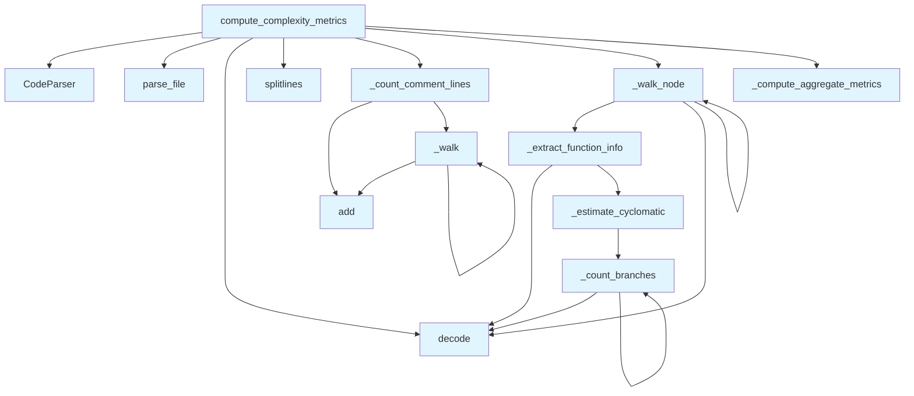

# File: `src/local_deepwiki/generators/analysis/complexity.py`

## File Overview

This file implements a complexity metrics generator that analyzes source code to compute cyclomatic complexity, nesting depth, and other code complexity metrics. It leverages the tree-sitter AST parsing capabilities provided by the [`CodeParser`](../../core/parser/code_parser.md) class to traverse and extract meaningful information from code files.

The core responsibility of this module is to offer a structured way to assess code complexity by analyzing the structure of functions and classes within a given source file. This supports code quality analysis and helps identify potentially problematic areas of code that may benefit from refactoring.

## Key Concepts

### AST Traversal and Metrics Extraction

The module uses a recursive tree traversal approach to walk through the AST and extract relevant metrics. It distinguishes between function and class nodes, extracting their names, line ranges, parameter counts, and cyclomatic complexity.

### Cyclomatic Complexity Estimation

Cyclomatic complexity is estimated by counting decision points such as `if`, `while`, `for`, `&&`, `||`, and other logical operators. This is a well-established metric for assessing code complexity and maintainability.

### Nesting Depth Tracking

The module tracks the maximum nesting depth of code structures (e.g., nested functions, loops, conditionals) to help identify overly complex code blocks.

### Aggregate Metrics Computation

After collecting per-function metrics, the module computes aggregate statistics like average cyclomatic complexity, maximum parameter count, and maximum nesting depth across all functions in the file.

## Integration

This module integrates with the broader `local_deepwiki` codebase by relying on:

- [`CodeParser`](../../core/parser/code_parser.md) from `local_deepwiki.core.parser`: Used to parse source files into ASTs.
- [`get_logger`](../../logging.md) from `local_deepwiki.logging`: For logging complexity analysis results.

It is consumed by:

- The `coupling` module, via the `_walk` function.
- The `hotspots` module, via `_estimate_cyclomatic`, `_extract_function_info`, and `_walk_node`.
- The `test_complexity` module, via `compute_complexity_metrics`.

These integrations suggest that complexity metrics are used as part of broader code analysis workflows, particularly in identifying code hotspots and coupling patterns.

## Design Notes

### Why Tree-Sitter?

Tree-sitter is chosen for its fast and accurate parsing capabilities, allowing precise AST traversal for complex code structures. This enables accurate identification of function and class boundaries, as well as decision points for cyclomatic complexity estimation.

### Handling of Comments and Blank Lines

The module distinguishes between comment lines and blank lines for accurate line count metrics. This is important for providing a complete picture of code density and maintainability.

### Aggregation of Metrics

The design separates the collection of raw metrics from their aggregation into summary statistics. This modular approach allows for flexibility in how metrics are reported or used downstream.

### Nesting Depth Logic

Nesting depth is incremented only when entering certain structural types (`_NESTING_TYPES`). This ensures that nesting is accurately tracked without being inflated by non-structural elements like expressions or literals.

### Limiting Results

Function and class lists are limited to 50 items in the final result to prevent overly large outputs, which is a pragmatic decision for performance and readability.

### Error Handling

If a file cannot be parsed (e.g., unsupported file type), the module returns a structured result indicating the failure, allowing the calling code to handle it gracefully.

## API Reference

### Functions

#### `compute_complexity_metrics`

```python
async def compute_complexity_metrics(file_path: Path, repo_path: Path) -> dict[str, Any]
```

Compute cyclomatic complexity metrics for a source file.  Analyzes code complexity using tree-sitter AST parsing. Returns function/class counts, line metrics, cyclomatic complexity, nesting depth, and parameter counts.


| Parameter | Type | Default | Description |
|-----------|------|---------|-------------|
| `file_path` | `Path` | - | Path to the source file (relative to repo_path for display) |
| `repo_path` | `Path` | - | Path to the repository root |

**Returns:** `dict[str, Any]`


<details>
<summary>View Source (lines 196-269) | <a href="https://github.com/UrbanDiver/local-deepwiki-mcp/blob/main/src/local_deepwiki/generators/analysis/complexity.py#L196-L269">GitHub</a></summary>

```python
async def compute_complexity_metrics(
    file_path: Path, repo_path: Path
) -> dict[str, Any]:
    """Compute cyclomatic complexity metrics for a source file.

    Analyzes code complexity using tree-sitter AST parsing. Returns
    function/class counts, line metrics, cyclomatic complexity,
    nesting depth, and parameter counts.

    Args:
        file_path: Path to the source file (relative to repo_path for display)
        repo_path: Path to the repository root

    Returns:
        dict with 'status', 'file_path', 'language', 'lines', 'counts',
        'complexity', 'functions', and 'classes' keys.
    """
    full_file = repo_path / file_path

    parser = CodeParser()
    parse_result = parser.parse_file(full_file)

    if parse_result is None:
        return {
            "status": "success",
            "file_path": str(file_path),
            "message": (
                f"File type not supported for AST analysis: {full_file.suffix}"
            ),
            "metrics": {},
        }

    root_node, language, source_bytes = parse_result
    source_text = source_bytes.decode("utf-8", errors="replace")
    lines = source_text.splitlines()

    total_lines = len(lines)
    blank_lines = sum(1 for line in lines if not line.strip())
    comment_lines = _count_comment_lines(root_node)

    functions: list[dict[str, Any]] = []
    classes: list[dict[str, Any]] = []
    max_nesting: list[int] = [0]

    _walk_node(root_node, 0, functions, classes, max_nesting)

    complexity = _compute_aggregate_metrics(functions, max_nesting[0])

    result = {
        "status": "success",
        "file_path": str(file_path),
        "language": language.value,
        "lines": {
            "total": total_lines,
            "blank": blank_lines,
            "comment": comment_lines,
            "code": total_lines - blank_lines - comment_lines,
        },
        "counts": {
            "functions": len(functions),
            "classes": len(classes),
        },
        "complexity": complexity,
        "functions": functions[:50],
        "classes": classes[:50],
    }

    logger.info(
        "Complexity metrics: %d functions, %d classes for %s",
        len(functions),
        len(classes),
        file_path,
    )
    return result
```

</details>

## Call Graph



## Used By

Functions and methods in this file and their callers:

- **[`CodeParser`](../../core/parser/code_parser.md)**: called by `compute_complexity_metrics`
- **`_compute_aggregate_metrics`**: called by `compute_complexity_metrics`
- **`_count_branches`**: called by `_count_branches`, `_estimate_cyclomatic`
- **`_count_comment_lines`**: called by `compute_complexity_metrics`
- **`_estimate_cyclomatic`**: called by `_extract_function_info`
- **`_extract_function_info`**: called by `_walk_node`
- **`_walk`**: called by `_count_comment_lines`, `_walk`
- **`_walk_node`**: called by `_walk_node`, `compute_complexity_metrics`
- **`add`**: called by `_count_comment_lines`, `_walk`
- **`decode`**: called by `_count_branches`, `_extract_function_info`, `_walk_node`, `compute_complexity_metrics`
- **`parse_file`**: called by `compute_complexity_metrics`
- **`splitlines`**: called by `compute_complexity_metrics`

## Usage Examples

*Examples extracted from test files*

### Test complexity metrics for a simple Python function

From `test_complexity.py::test_simple_function`:

```python
# Create a simple Python file
    code = """
def simple_function(x):
    return x + 1
"""
    file_path = tmp_path / "simple.py"
    file_path.write_text(code)

    result = await compute_complexity_metrics(Path("simple.py"), tmp_path)

    assert result["status"] == "success"
    assert result["language"] == "python"
    assert result["counts"]["functions"] == 1
    assert result["counts"]["classes"] == 0

    # Check function details
    func = result["functions"][0]
    assert func["name"] == "simple_function"
    assert func["cyclomatic_complexity"] == 1  # No branches
    assert func["param_count"] == 1
    assert func["nesting_depth"] == 0
```

### Test complexity metrics for a simple Python function

From `test_complexity.py::test_simple_function`:

```python
# Create a simple Python file
    code = """
def simple_function(x):
    return x + 1
"""
    file_path = tmp_path / "simple.py"
    file_path.write_text(code)

    result = await compute_complexity_metrics(Path("simple.py"), tmp_path)

    assert result["status"] == "success"
    assert result["language"] == "python"
    assert result["counts"]["functions"] == 1
    assert result["counts"]["classes"] == 0

    # Check function details
    func = result["functions"][0]
    assert func["name"] == "simple_function"
    assert func["cyclomatic_complexity"] == 1  # No branches
    assert func["param_count"] == 1
    assert func["nesting_depth"] == 0
```

### Test complexity metrics for a function with if/elif/else branches

From `test_complexity.py::test_function_with_branches`:

```python
code = """
def complex_function(x, y):
    if x > 0:
        return x
    elif x < 0:
        return -x
    else:
        return y
"""
    file_path = tmp_path / "branches.py"
    file_path.write_text(code)

    result = await compute_complexity_metrics(Path("branches.py"), tmp_path)

    assert result["status"] == "success"
    assert result["counts"]["functions"] == 1

    func = result["functions"][0]
    assert func["name"] == "complex_function"
    assert func["cyclomatic_complexity"] > 1  # Has branches
    assert func["param_count"] == 2
```

### Parsing a Python file with functions and classes returns correct counts

From `test_complexity_metrics.py::test_complexity_metrics_python_file`:

```python
result = await handle_get_complexity_metrics(
    {"repo_path": str(tmp_path), "file_path": "example.py"}
)
data = json.loads(result[0].text)
assert data["status"] == "success"
assert data["language"] == "python"
```


## Last Modified

| Entity | Type | Author | Date | Commit |
|--------|------|--------|------|--------|
| `_count_comment_lines` | function | Brian Breidenbach | 1 week ago | `af244a5` refactor: split core hotspo... |
| `_walk` | function | Brian Breidenbach | 1 week ago | `af244a5` refactor: split core hotspo... |
| `_count_branches` | function | Brian Breidenbach | 1 week ago | `af244a5` refactor: split core hotspo... |
| `_estimate_cyclomatic` | function | Brian Breidenbach | 1 week ago | `af244a5` refactor: split core hotspo... |
| `_extract_function_info` | function | Brian Breidenbach | 1 week ago | `af244a5` refactor: split core hotspo... |
| `_walk_node` | function | Brian Breidenbach | 1 week ago | `af244a5` refactor: split core hotspo... |
| `_compute_aggregate_metrics` | function | Brian Breidenbach | 1 week ago | `af244a5` refactor: split core hotspo... |
| `compute_complexity_metrics` | function | Brian Breidenbach | 1 week ago | `af244a5` refactor: split core hotspo... |

## Additional Source Code

Source code for functions and methods not listed in the API Reference above.

#### `_count_comment_lines`

<details>
<summary>View Source (lines 74-86) | <a href="https://github.com/UrbanDiver/local-deepwiki-mcp/blob/main/src/local_deepwiki/generators/analysis/complexity.py#L74-L86">GitHub</a></summary>

```python
def _count_comment_lines(root: Node) -> int:
    """Count lines that contain comments."""
    comment_line_set: set[int] = set()

    def _walk(n: Node) -> None:
        if n.type in ("comment", "line_comment", "block_comment"):
            for line_no in range(n.start_point[0], n.end_point[0] + 1):
                comment_line_set.add(line_no)
        for child in n.children:
            _walk(child)

    _walk(root)
    return len(comment_line_set)
```

</details>


#### `_walk`

<details>
<summary>View Source (lines 78-83) | <a href="https://github.com/UrbanDiver/local-deepwiki-mcp/blob/main/src/local_deepwiki/generators/analysis/complexity.py#L78-L83">GitHub</a></summary>

```python
def _walk(n: Node) -> None:
        if n.type in ("comment", "line_comment", "block_comment"):
            for line_no in range(n.start_point[0], n.end_point[0] + 1):
                comment_line_set.add(line_no)
        for child in n.children:
            _walk(child)
```

</details>


#### `_count_branches`

<details>
<summary>View Source (lines 89-102) | <a href="https://github.com/UrbanDiver/local-deepwiki-mcp/blob/main/src/local_deepwiki/generators/analysis/complexity.py#L89-L102">GitHub</a></summary>

```python
def _count_branches(n: Node, count: list[int]) -> None:
    """Recursively count branch and logical-operator decision points."""
    if n.type in _BRANCH_TYPES:
        count[0] += 1
    if n.type in ("boolean_operator", "binary_expression"):
        for child in n.children:
            if child.type in ("and", "or") or (
                child.text
                and child.text.decode("utf-8", errors="replace") in _LOGICAL_OPS
            ):
                count[0] += 1
                break
    for child in n.children:
        _count_branches(child, count)
```

</details>


#### `_estimate_cyclomatic`

<details>
<summary>View Source (lines 105-109) | <a href="https://github.com/UrbanDiver/local-deepwiki-mcp/blob/main/src/local_deepwiki/generators/analysis/complexity.py#L105-L109">GitHub</a></summary>

```python
def _estimate_cyclomatic(node: Node) -> int:
    """Estimate cyclomatic complexity by counting decision points."""
    count = [1]  # Base complexity; use list for mutation in nested call
    _count_branches(node, count)
    return count[0]
```

</details>


#### `_extract_function_info`

<details>
<summary>View Source (lines 112-135) | <a href="https://github.com/UrbanDiver/local-deepwiki-mcp/blob/main/src/local_deepwiki/generators/analysis/complexity.py#L112-L135">GitHub</a></summary>

```python
def _extract_function_info(node: Node, depth: int) -> dict[str, Any]:
    """Extract name, line range, parameter count, and complexity from a function node."""
    name = ""
    param_count = 0
    for child in node.children:
        if child.type in ("identifier", "name", "property_identifier"):
            name = child.text.decode("utf-8", errors="replace") if child.text else ""
        if child.type in ("parameters", "formal_parameters", "parameter_list"):
            param_count = sum(
                1
                for p in child.children
                if p.type not in ("(", ")", ",", "comment")
                and (p.text.decode("utf-8", errors="replace") if p.text else "")
                not in ("self", "cls")
            )
    cyclomatic = _estimate_cyclomatic(node)
    return {
        "name": name,
        "line": node.start_point[0] + 1,
        "end_line": node.end_point[0] + 1,
        "param_count": param_count,
        "nesting_depth": depth,
        "cyclomatic_complexity": cyclomatic,
    }
```

</details>


#### `_walk_node`

<details>
<summary>View Source (lines 138-166) | <a href="https://github.com/UrbanDiver/local-deepwiki-mcp/blob/main/src/local_deepwiki/generators/analysis/complexity.py#L138-L166">GitHub</a></summary>

```python
def _walk_node(
    node: Node,
    depth: int,
    functions: list[dict[str, Any]],
    classes: list[dict[str, Any]],
    max_nesting: list[int],
) -> None:
    """Recursively traverse the AST, collecting function and class metrics."""
    node_type = node.type

    if node_type in _FUNCTION_TYPES:
        functions.append(_extract_function_info(node, depth))

    if node_type in _CLASS_TYPES:
        class_name = ""
        for child in node.children:
            if child.type in ("identifier", "name", "type_identifier"):
                class_name = (
                    child.text.decode("utf-8", errors="replace") if child.text else ""
                )
                break
        classes.append({"name": class_name, "line": node.start_point[0] + 1})

    if node_type in _NESTING_TYPES:
        max_nesting[0] = max(max_nesting[0], depth)

    for child in node.children:
        child_depth = depth + 1 if node_type in _NESTING_TYPES else depth
        _walk_node(child, child_depth, functions, classes, max_nesting)
```

</details>


#### `_compute_aggregate_metrics`

<details>
<summary>View Source (lines 169-193) | <a href="https://github.com/UrbanDiver/local-deepwiki-mcp/blob/main/src/local_deepwiki/generators/analysis/complexity.py#L169-L193">GitHub</a></summary>

```python
def _compute_aggregate_metrics(
    functions: list[dict[str, Any]],
    max_nesting: int,
) -> dict[str, Any]:
    """Compute aggregate statistics from the collected function metrics."""
    param_counts = [f["param_count"] for f in functions]
    cyclomatic_values = [f["cyclomatic_complexity"] for f in functions]
    nesting_depths = [f["nesting_depth"] for f in functions]

    return {
        "avg_cyclomatic": (
            round(sum(cyclomatic_values) / len(cyclomatic_values), 2)
            if cyclomatic_values
            else 0
        ),
        "max_cyclomatic": max(cyclomatic_values) if cyclomatic_values else 0,
        "avg_params": (
            round(sum(param_counts) / len(param_counts), 2) if param_counts else 0
        ),
        "max_params": max(param_counts) if param_counts else 0,
        "avg_nesting_depth": (
            round(sum(nesting_depths) / len(nesting_depths), 2) if nesting_depths else 0
        ),
        "max_nesting_depth": max_nesting,
    }
```

</details>

## Relevant Source Files

- `src/local_deepwiki/generators/analysis/complexity.py:74-86`
