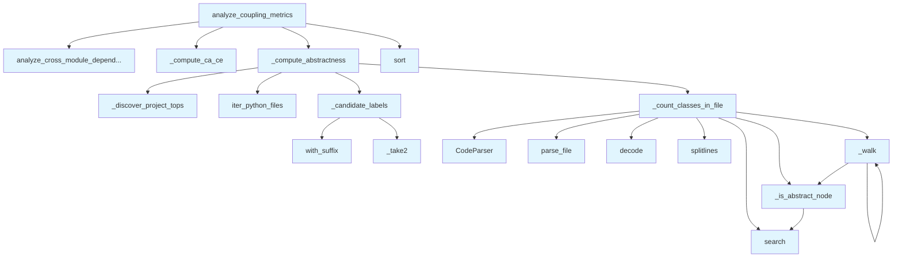

# File: `src/local_deepwiki/generators/analysis/coupling.py`

## File Overview

This module implements Robert C. Martin's package-level stability metrics for analyzing coupling and abstractness in Python projects. It computes key software architecture metrics such as afferent coupling (Ca), efferent coupling (Ce), instability (I), abstractness (A), and distance from the main sequence (D) for each module in a repository.

The module performs static analysis of Python source code using AST parsing to identify class definitions and determine which ones are abstract. It integrates with the project's dependency analysis system to compute coupling counts between modules.

## Key Concepts

### Coupling Metrics
The module implements Robert C. Martin's architectural metrics:
- **Afferent Coupling (Ca)**: Number of external modules that depend on a module.
- **Efferent Coupling (Ce)**: Number of external modules that a module depends on.
- **Instability (I)**: `Ce / (Ca + Ce)`, where 0 = stable, 1 = unstable.
- **Abstractness (A)**: Ratio of abstract classes to total classes in a module.
- **Distance from Main Sequence (D)**: `|A + I - 1|`, used to identify modules that deviate from the ideal balance.

### Abstract Class Detection
The module identifies abstract classes based on two criteria:
1. Inheritance from `ABC`, `ABCMeta`, or `Protocol`.
2. Presence of `@abstractmethod` decorators within the class body.

This approach leverages AST parsing with `tree-sitter` and [`CodeParser`](../../core/parser/code_parser.md) to extract class definitions and their properties without requiring runtime evaluation.

### Module Label Resolution
To correctly attribute abstract class counts, the module resolves multiple possible labels for each file:
- Unstripped label: Based on full file path (e.g., `local_deepwiki.providers`)
- Stripped label: Based on import paths (e.g., `providers.base`)

It prefers the more specific stripped label when resolving where to assign class counts.

## Integration

This module is part of the analysis pipeline and integrates with several other components in the codebase:

- **Dependency Analysis**: Uses [`analyze_cross_module_dependencies`](module_dependencies.md) to get module and edge information.
- **Source Filtering**: Relies on [`iter_python_files`](source_filter.md) to enumerate Python files in the repository.
- **Parser**: Utilizes [`CodeParser`](../../core/parser/code_parser.md) from `local_deepwiki.core.parser` for AST parsing.
- **Project Top Discovery**: Uses `_discover_project_tops` from `module_dependencies` to identify top-level package names.

It is called by:
- `complexity` via `_walk` function
- `coupling_page` and `analysis_architecture` via `analyze_coupling_metrics`

The module is designed to be a pure filesystem and AST-based analysis tool, avoiding any LLM or external service calls, making it suitable for automated analysis in CI/CD pipelines or static analysis tools.

## Design Notes

### Parsing Strategy
The module uses `tree-sitter` with [`CodeParser`](../../core/parser/code_parser.md) to parse Python files, allowing for accurate identification of class definitions and their attributes. This is more robust than regex-based parsing for complex Python constructs.

### Abstract Class Identification
The algorithm for detecting abstract classes is conservative:
- It checks both inheritance and decorators.
- It uses regex matching against class source text spans, which is efficient and accurate for the supported patterns.

### Module Labeling
The labeling strategy ensures that abstractness is attributed to the most specific available module node:
- If both stripped and unstripped labels exist, the stripped one is preferred.
- This ensures that classes defined in `providers/base.py` contribute to the abstractness score of `providers.base` rather than `local_deepwiki.providers`.

### Edge Case Handling
- Unparseable files return `(0, 0)` for class counts.
- Modules with no classes have an abstractness score of `0.0`.
- Empty or invalid module names are skipped during aggregation.
- The instability and distance metrics are carefully rounded to avoid floating-point precision issues.

### Performance Considerations
- The module re-walks the repository to map files to modules, which is acceptable for analysis tools but not for real-time applications.
- Class counting is done per file to avoid excessive memory usage.
- The use of `tree-sitter` and [`CodeParser`](../../core/parser/code_parser.md) provides fast and accurate parsing.

This design ensures that the analysis is both accurate and performant while remaining fully self-contained and suitable for automated code quality checks.

## API Reference

### Functions

#### `analyze_coupling_metrics`

```python
def analyze_coupling_metrics(repo_path: Path, module_filter: str | None = None) -> dict[str, Any]
```

Compute Robert C. Martin coupling metrics per module.


| Parameter | Type | Default | Description |
|-----------|------|---------|-------------|
| `repo_path` | `Path` | - | Root of the repository to analyze. |
| `module_filter` | `str | None` | `None` | Optional prefix to restrict analysis to a sub-package. |

**Returns:** `dict[str, Any]`


<details>
<summary>View Source (lines 204-268) | <a href="https://github.com/UrbanDiver/local-deepwiki-mcp/blob/main/src/local_deepwiki/generators/analysis/coupling.py#L204-L268">GitHub</a></summary>

```python
def analyze_coupling_metrics(
    repo_path: Path,
    module_filter: str | None = None,
) -> dict[str, Any]:
    """Compute Robert C. Martin coupling metrics per module.

    Args:
        repo_path: Root of the repository to analyze.
        module_filter: Optional prefix to restrict analysis to a sub-package.

    Returns:
        A dict with ``status`` and ``metrics`` (list of per-module dicts).
    """
    dep_result = analyze_cross_module_dependencies(
        repo_path,
        module_filter=module_filter,
        include_external=False,
        min_edge_weight=1,
    )
    modules = dep_result["modules"]
    edges = dep_result["edges"]

    ca, ce = _compute_ca_ce(modules, edges)
    abstractness = _compute_abstractness(repo_path, modules)

    metrics: list[dict[str, Any]] = []
    for mod in modules:
        name = mod["name"]
        ca_val = ca.get(name, 0)
        ce_val = ce.get(name, 0)
        total = ca_val + ce_val
        instability = round(ce_val / total, 4) if total > 0 else 0.0
        a_val = abstractness.get(name, 0.0)
        distance = round(abs(a_val + instability - 1.0), 4)
        metrics.append(
            {
                "module": name,
                "afferent_coupling": ca_val,
                "efferent_coupling": ce_val,
                "instability": instability,
                "abstractness": a_val,
                "distance": distance,
            }
        )

    metrics.sort(key=lambda m: m["distance"], reverse=True)
    logger.info("Coupling metrics: %d modules analyzed in %s", len(metrics), repo_path)

    return {
        "status": "success",
        "metrics": metrics,
        "stats": {
            "total_modules": len(metrics),
            "avg_instability": (
                round(sum(m["instability"] for m in metrics) / len(metrics), 4)
                if metrics
                else 0.0
            ),
            "avg_abstractness": (
                round(sum(m["abstractness"] for m in metrics) / len(metrics), 4)
                if metrics
                else 0.0
            ),
        },
    }
```

</details>

## Call Graph



## Used By

Functions and methods in this file and their callers:

- **[`CodeParser`](../../core/parser/code_parser.md)**: called by `_count_classes_in_file`
- **`_candidate_labels`**: called by `_compute_abstractness`
- **`_compute_abstractness`**: called by `analyze_coupling_metrics`
- **`_compute_ca_ce`**: called by `analyze_coupling_metrics`
- **`_count_classes_in_file`**: called by `_compute_abstractness`
- **`_discover_project_tops`**: called by `_compute_abstractness`
- **`_is_abstract_node`**: called by `_count_classes_in_file`, `_walk`
- **`_take2`**: called by `_candidate_labels`
- **`_walk`**: called by `_count_classes_in_file`, `_walk`
- **[`analyze_cross_module_dependencies`](module_dependencies.md)**: called by `analyze_coupling_metrics`
- **`decode`**: called by `_count_classes_in_file`
- **[`iter_python_files`](source_filter.md)**: called by `_compute_abstractness`
- **`parse_file`**: called by `_count_classes_in_file`
- **`search`**: called by `_count_classes_in_file`, `_is_abstract_node`
- **`sort`**: called by `analyze_coupling_metrics`
- **`splitlines`**: called by `_count_classes_in_file`
- **`with_suffix`**: called by `_candidate_labels`

## Usage Examples

*Examples extracted from test files*

### Handler returns success status

From `test_coupling_metrics.py::test_coupling_metrics_success`:

```python
result = await handle_get_coupling_metrics({"repo_path": str(pkg_repo)})
data = json.loads(result[0].text)
assert data["status"] == "success"
```

### Example: `coupling`

From `test_coupling_page.py::test_returns_markdown_with_title_and_table`:

```python
result = generate_coupling_page(_make_data())
    assert result is not None
    assert "# Coupling Metrics" in result
    # Should have a markdown table
    assert "| Module |" in result
```


## Last Modified

| Entity | Type | Author | Date | Commit |
|--------|------|--------|------|--------|
| `_compute_ca_ce` | function | Brian Breidenbach | yesterday | `29ae780` refactor: decompose long me... |
| `analyze_coupling_metrics` | function | Brian Breidenbach | yesterday | `29ae780` refactor: decompose long me... |
| `_candidate_labels` | function | Brian Breidenbach | yesterday | `515ba66` refactor: improve coupling ... |
| `_take2` | function | Brian Breidenbach | yesterday | `515ba66` refactor: improve coupling ... |
| `_compute_abstractness` | function | Brian Breidenbach | yesterday | `515ba66` refactor: improve coupling ... |
| `_count_classes_in_file` | function | Brian Breidenbach | 1 week ago | `f6da957` feat: add 4 architecture an... |
| `_is_abstract_node` | function | Brian Breidenbach | 1 week ago | `f6da957` feat: add 4 architecture an... |
| `_walk` | function | Brian Breidenbach | 1 week ago | `f6da957` feat: add 4 architecture an... |

## Additional Source Code

Source code for functions and methods not listed in the API Reference above.

#### `_count_classes_in_file`

<details>
<summary>View Source (lines 48-90) | <a href="https://github.com/UrbanDiver/local-deepwiki-mcp/blob/main/src/local_deepwiki/generators/analysis/coupling.py#L48-L90">GitHub</a></summary>

```python
def _count_classes_in_file(full_path: Path) -> tuple[int, int]:
    """Return ``(total_classes, abstract_classes)`` found in *full_path*.

    A class is considered abstract if:
    - It inherits from ``ABC``, ``ABCMeta``, or ``Protocol``, OR
    - It contains at least one ``@abstractmethod`` decorator.

    Falls back to (0, 0) for unparseable or unsupported files.
    """
    parser = CodeParser()
    parse_result = parser.parse_file(full_path)
    if parse_result is None:
        return 0, 0

    root_node, _lang, src_bytes = parse_result
    source = src_bytes.decode("utf-8", errors="replace")
    lines = source.splitlines()

    total = 0
    abstract = 0

    def _is_abstract_node(node: Node) -> bool:
        """Check if a class node is abstract via base classes or decorators."""
        # Check parent classes in the node text span.
        class_src = "\n".join(lines[node.start_point[0] : node.end_point[0] + 1])
        if _ABC_BASE_RE.search(class_src):
            return True
        # Check for @abstractmethod anywhere inside the class body.
        if _ABSTRACT_METHOD_RE.search(class_src):
            return True
        return False

    def _walk(n: Node) -> None:
        nonlocal total, abstract
        if n.type in _CLASS_TYPES:
            total += 1
            if _is_abstract_node(n):
                abstract += 1
        for child in n.children:
            _walk(child)

    _walk(root_node)
    return total, abstract
```

</details>


#### `_is_abstract_node`

<details>
<summary>View Source (lines 69-78) | <a href="https://github.com/UrbanDiver/local-deepwiki-mcp/blob/main/src/local_deepwiki/generators/analysis/coupling.py#L69-L78">GitHub</a></summary>

```python
def _is_abstract_node(node: Node) -> bool:
        """Check if a class node is abstract via base classes or decorators."""
        # Check parent classes in the node text span.
        class_src = "\n".join(lines[node.start_point[0] : node.end_point[0] + 1])
        if _ABC_BASE_RE.search(class_src):
            return True
        # Check for @abstractmethod anywhere inside the class body.
        if _ABSTRACT_METHOD_RE.search(class_src):
            return True
        return False
```

</details>


#### `_walk`

<details>
<summary>View Source (lines 80-87) | <a href="https://github.com/UrbanDiver/local-deepwiki-mcp/blob/main/src/local_deepwiki/generators/analysis/coupling.py#L80-L87">GitHub</a></summary>

```python
def _walk(n: Node) -> None:
        nonlocal total, abstract
        if n.type in _CLASS_TYPES:
            total += 1
            if _is_abstract_node(n):
                abstract += 1
        for child in n.children:
            _walk(child)
```

</details>


#### `_candidate_labels`

<details>
<summary>View Source (lines 93-136) | <a href="https://github.com/UrbanDiver/local-deepwiki-mcp/blob/main/src/local_deepwiki/generators/analysis/coupling.py#L93-L136">GitHub</a></summary>

```python
def _candidate_labels(rel_path: Path, project_tops: set[str]) -> list[str]:
    """Return candidate module labels for *rel_path* in order of specificity.

    The dependency graph builds two kinds of node labels for the same file:

    1. The **source label** (via :func:`_module_label`): takes the first two
       parts of the path after stripping ``src/``, e.g.
       ``src/local_deepwiki/providers/base.py`` → ``local_deepwiki.providers``.

    2. The **import target label** (via :func:`_resolve_import_target`): strips
       the project top-level package name from import paths, e.g.
       ``from local_deepwiki.providers.base import X`` → ``providers.base``.

    Both labels may appear in the graph.  We return the stripped label first
    (most specific, e.g. ``providers.base``) followed by the unstripped label
    (``local_deepwiki.providers``) so that abstractness is attributed to the
    most precise module node that actually exists.
    """
    parts = list(rel_path.with_suffix("").parts)
    # Drop common source-layout wrapper directories.
    while parts and parts[0] in ("src", "lib", "pkg"):
        parts = parts[1:]
    if not parts:
        return ["root"]

    # Unstripped label (matches _module_label output).
    def _take2(ps: list[str]) -> str:
        meaningful = [p for p in ps[:2] if p != "__init__"]
        return ".".join(meaningful) if meaningful else (ps[0] if ps else "root")

    unstripped = _take2(parts)

    # Stripped label (matches _resolve_import_target output for imports).
    stripped: str | None = None
    if parts[0] in project_tops:
        tail = parts[1:]
        if tail:
            stripped = _take2(tail)

    candidates: list[str] = []
    if stripped and stripped != unstripped:
        candidates.append(stripped)
    candidates.append(unstripped)
    return candidates
```

</details>


#### `_take2`

<details>
<summary>View Source (lines 119-121) | <a href="https://github.com/UrbanDiver/local-deepwiki-mcp/blob/main/src/local_deepwiki/generators/analysis/coupling.py#L119-L121">GitHub</a></summary>

```python
def _take2(ps: list[str]) -> str:
        meaningful = [p for p in ps[:2] if p != "__init__"]
        return ".".join(meaningful) if meaningful else (ps[0] if ps else "root")
```

</details>


#### `_compute_abstractness`

<details>
<summary>View Source (lines 139-186) | <a href="https://github.com/UrbanDiver/local-deepwiki-mcp/blob/main/src/local_deepwiki/generators/analysis/coupling.py#L139-L186">GitHub</a></summary>

```python
def _compute_abstractness(
    repo_path: Path, modules: list[dict[str, Any]]
) -> dict[str, float]:
    """Return a dict mapping module label -> abstractness score (0.0–1.0).

    The dependency graph contains two kinds of module nodes for files in
    projects with a top-level wrapper package (e.g. ``local_deepwiki``):

    - **Source nodes** such as ``local_deepwiki.providers`` — created from
      file paths via :func:`~module_dependencies._module_label`.
    - **Import-target nodes** such as ``providers.base`` — created when other
      modules import from ``local_deepwiki.providers.base``.

    We generate both candidate labels for each file and attribute the class
    counts to whichever graph node is found first (preferring the more
    specific stripped label).  This ensures that ABCs and Protocols defined in
    ``providers/base.py`` are counted against ``providers.base`` (Ca=30) rather
    than only against ``local_deepwiki.providers`` (Ce=12), giving an accurate
    abstractness score for the heavily-depended-on module.
    """
    result: dict[str, float] = {}

    # We need to map each module label back to the files that belong to it.
    # We re-walk the repo since we don't persist the file->module mapping.
    module_names = {m["name"] for m in modules}
    project_tops = _discover_project_tops(repo_path)

    module_total: dict[str, int] = {m: 0 for m in module_names}
    module_abstract: dict[str, int] = {m: 0 for m in module_names}

    for py_file, rel_path in iter_python_files(repo_path, exclude_tests=False):
        # Find the first candidate label that exists as a module node.
        label: str | None = None
        for candidate in _candidate_labels(rel_path, project_tops):
            if candidate in module_names:
                label = candidate
                break
        if label is None:
            continue
        total, abstr = _count_classes_in_file(py_file)
        module_total[label] += total
        module_abstract[label] += abstr

    for mod in module_names:
        tot = module_total[mod]
        result[mod] = round(module_abstract[mod] / tot, 4) if tot > 0 else 0.0

    return result
```

</details>


#### `_compute_ca_ce`

<details>
<summary>View Source (lines 189-201) | <a href="https://github.com/UrbanDiver/local-deepwiki-mcp/blob/main/src/local_deepwiki/generators/analysis/coupling.py#L189-L201">GitHub</a></summary>

```python
def _compute_ca_ce(
    modules: list[dict[str, Any]],
    edges: list[dict[str, Any]],
) -> tuple[dict[str, int], dict[str, int]]:
    """Compute afferent (Ca) and efferent (Ce) coupling counts per module."""
    ca: dict[str, int] = {m["name"]: 0 for m in modules}
    ce: dict[str, int] = {m["name"]: 0 for m in modules}
    for edge in edges:
        if edge["target"] in ca:
            ca[edge["target"]] += 1
        if edge["source"] in ce:
            ce[edge["source"]] += 1
    return ca, ce
```

</details>

## Relevant Source Files

- `src/local_deepwiki/generators/analysis/coupling.py:48-90`
