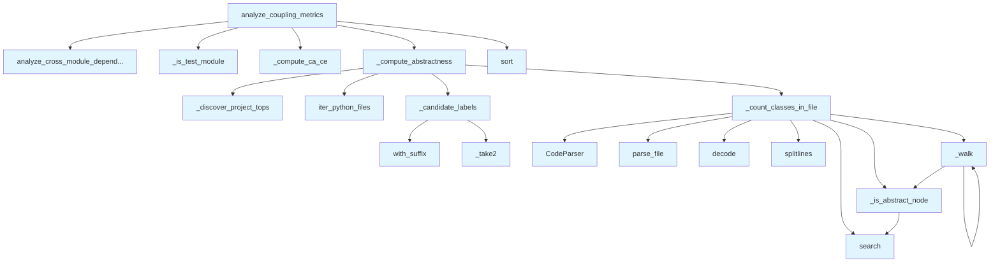

# File: `src/local_deepwiki/generators/analysis/coupling.py`

## File Overview

This file implements **Robert C. Martin's coupling metrics** for analyzing package-level stability in Python projects. It computes several key metrics for each module in a repository, including afferent coupling (Ca), efferent coupling (Ce), instability (I), abstractness (A), and distance from the main sequence (D).

The analysis is performed purely using filesystem traversal and AST parsing — no external services or LLMs are involved. The results are used to identify unstable modules, understand architectural dependencies, and support architectural analysis tasks like hotspot detection and design smell identification.

This file integrates with other modules in the `local_deepwiki.generators.analysis` package to provide a complete analysis pipeline for project architecture.

## Key Concepts

### 1. **Coupling Metrics**
The file implements the core metrics defined by Robert C. Martin for software architecture analysis:
- **Afferent Coupling (Ca)**: Number of modules that depend on a given module.
- **Efferent Coupling (Ce)**: Number of modules that a given module depends on.
- **Instability (I)**: Ce / (Ca + Ce), where 0 = maximally stable, 1 = maximally unstable.
- **Abstractness (A)**: Fraction of abstract classes in a module (defined as classes inheriting from `ABC`, `ABCMeta`, `Protocol`, or containing `@abstractmethod`).
- **Distance from Main Sequence (D)**: |A + I - 1|, used to identify modules that deviate from the ideal balance of stability and abstractness.

### 2. **Abstractness Calculation**
Abstractness is computed by:
- Parsing each Python file to extract class definitions.
- Identifying abstract classes based on inheritance from `ABC`, `ABCMeta`, `Protocol`, or presence of `@abstractmethod`.
- Aggregating class counts per module and calculating the fraction of abstract classes.

### 3. **Module Labeling and Resolution**
Modules are labeled in two ways:
- **Source label**: Based on file path (e.g., `src/local_deepwiki/providers/base.py` → `local_deepwiki.providers`).
- **Import target label**: Based on resolved import paths (e.g., `from local_deepwiki.providers.base import X` → `providers.base`).

This dual labeling ensures that abstractness and coupling metrics are attributed to the most specific module node that exists in the dependency graph.

### 4. **Test Module Filtering**
Test modules (identified by labels like `test_`, `tests`, or `conftest`) are filtered out by default to avoid skewing architectural metrics.

## Integration

This file is part of the `local_deepwiki.generators.analysis` module and integrates with:
- `module_dependencies`: Used for discovering project tops and analyzing cross-module dependencies.
- `source_filter`: Used to iterate over Python source files in the repository.
- [`CodeParser`](../../core/parser/code_parser.md): Used to parse Python files into ASTs for class and method analysis.
- [`get_logger`](../../logging.md): Used for logging during analysis.

Functions in this file are called by:
- `_walk` (used by `complexity`, `design_smells`, `hotspots`)
- `_is_test_module` (used by `dependency_diagram`, `test_diagrams_misc`)
- `analyze_coupling_metrics` (used by `coupling_page`, `analysis_architecture`, `test_analysis_architecture`)

The `analyze_coupling_metrics` function is the primary entry point and is used to generate coupling reports for the documentation system.

## Design Notes

### 1. **AST Parsing Strategy**
The code uses `tree-sitter` to parse Python files and traverse the AST for class definitions. This approach is chosen for its performance and accuracy in parsing Python syntax, especially in complex codebases.

### 2. **Abstract Class Detection**
Abstract classes are detected by:
- Looking for inheritance from `ABC`, `ABCMeta`, or `Protocol`.
- Scanning the class body for `@abstractmethod` decorators.

This dual-check ensures accurate detection of abstract classes even in edge cases.

### 3. **Module Label Resolution**
To ensure that metrics are attributed to the most precise module node, the code generates two candidate labels for each file:
- A stripped label (e.g., `providers.base`) for import targets.
- An unstripped label (e.g., `local_deepwiki.providers`) for source nodes.

The most specific label that exists in the dependency graph is used for attribution.

### 4. **Test Module Exclusion**
Test modules are excluded by default to avoid skewing architectural metrics. This behavior is configurable via the `exclude_tests` parameter.

### 5. **Performance Considerations**
- The file re-walks the repository to map files to modules, which is a trade-off for not persisting this mapping.
- AST parsing is reused from [`CodeParser`](../../core/parser/code_parser.md), which likely caches parsed results for performance.

### 6. **Edge Cases**
- Unparseable or unsupported files return `(0, 0)` for class counts.
- Modules with zero total classes return an abstractness of `0.0`.
- Empty dependency graphs are handled gracefully with safe defaults.

This design ensures robustness and usability in a wide variety of project structures.

## API Reference

### Functions

#### `analyze_coupling_metrics`

```python
def analyze_coupling_metrics(repo_path: Path, module_filter: str | None = None, exclude_tests: bool = True) -> dict[str, Any]
```

Compute Robert C. Martin coupling metrics per module.


| Parameter | Type | Default | Description |
|-----------|------|---------|-------------|
| `repo_path` | `Path` | - | Root of the repository to analyze. |
| `module_filter` | `str | None` | `None` | Optional prefix to restrict analysis to a sub-package. |
| `exclude_tests` | `bool` | `True` | When True, exclude test modules from metrics. |

**Returns:** `dict[str, Any]`


<details>
<summary>View Source (lines 210-285) | <a href="https://github.com/UrbanDiver/local-deepwiki-mcp/blob/main/src/local_deepwiki/generators/analysis/coupling.py#L210-L285">GitHub</a></summary>

```python
def analyze_coupling_metrics(
    repo_path: Path,
    module_filter: str | None = None,
    exclude_tests: bool = True,
) -> dict[str, Any]:
    """Compute Robert C. Martin coupling metrics per module.

    Args:
        repo_path: Root of the repository to analyze.
        module_filter: Optional prefix to restrict analysis to a sub-package.
        exclude_tests: When True, exclude test modules from metrics.

    Returns:
        A dict with ``status`` and ``metrics`` (list of per-module dicts).
    """
    dep_result = analyze_cross_module_dependencies(
        repo_path,
        module_filter=module_filter,
        include_external=False,
        min_edge_weight=1,
    )
    modules = dep_result["modules"]
    edges = dep_result["edges"]

    if exclude_tests:
        test_names = {m["name"] for m in modules if _is_test_module(m["name"])}
        modules = [m for m in modules if m["name"] not in test_names]
        edges = [
            e
            for e in edges
            if e["source"] not in test_names and e["target"] not in test_names
        ]

    ca, ce = _compute_ca_ce(modules, edges)
    abstractness = _compute_abstractness(repo_path, modules)

    metrics: list[dict[str, Any]] = []
    for mod in modules:
        name = mod["name"]
        ca_val = ca.get(name, 0)
        ce_val = ce.get(name, 0)
        total = ca_val + ce_val
        instability = round(ce_val / total, 4) if total > 0 else 0.0
        a_val = abstractness.get(name, 0.0)
        distance = round(abs(a_val + instability - 1.0), 4)
        metrics.append(
            {
                "module": name,
                "afferent_coupling": ca_val,
                "efferent_coupling": ce_val,
                "instability": instability,
                "abstractness": a_val,
                "distance": distance,
            }
        )

    metrics.sort(key=lambda m: m["distance"], reverse=True)
    logger.info("Coupling metrics: %d modules analyzed in %s", len(metrics), repo_path)

    return {
        "status": "success",
        "metrics": metrics,
        "stats": {
            "total_modules": len(metrics),
            "avg_instability": (
                round(sum(m["instability"] for m in metrics) / len(metrics), 4)
                if metrics
                else 0.0
            ),
            "avg_abstractness": (
                round(sum(m["abstractness"] for m in metrics) / len(metrics), 4)
                if metrics
                else 0.0
            ),
        },
    }
```

</details>

## Call Graph



## Used By

Functions and methods in this file and their callers:

- **[`CodeParser`](../../core/parser/code_parser.md)**: called by `_count_classes_in_file`
- **`_candidate_labels`**: called by `_compute_abstractness`
- **`_compute_abstractness`**: called by `analyze_coupling_metrics`
- **`_compute_ca_ce`**: called by `analyze_coupling_metrics`
- **`_count_classes_in_file`**: called by `_compute_abstractness`
- **`_discover_project_tops`**: called by `_compute_abstractness`
- **`_is_abstract_node`**: called by `_count_classes_in_file`, `_walk`
- **`_is_test_module`**: called by `analyze_coupling_metrics`
- **`_take2`**: called by `_candidate_labels`
- **`_walk`**: called by `_count_classes_in_file`, `_walk`
- **[`analyze_cross_module_dependencies`](module_dependencies.md)**: called by `analyze_coupling_metrics`
- **`decode`**: called by `_count_classes_in_file`
- **[`iter_python_files`](source_filter.md)**: called by `_compute_abstractness`
- **`parse_file`**: called by `_count_classes_in_file`
- **`search`**: called by `_count_classes_in_file`, `_is_abstract_node`
- **`sort`**: called by `analyze_coupling_metrics`
- **`splitlines`**: called by `_count_classes_in_file`
- **`with_suffix`**: called by `_candidate_labels`

## Usage Examples

*Examples extracted from test files*

### Handler returns success status

From `test_coupling_metrics.py::test_coupling_metrics_success`:

```python
result = await handle_get_coupling_metrics({"repo_path": str(pkg_repo)})
data = json.loads(result[0].text)
assert data["status"] == "success"
```

### Example: `coupling`

From `test_coupling_page.py::test_returns_markdown_with_title_and_table`:

```python
result = generate_coupling_page(_make_data())
    assert result is not None
    assert "# Coupling Metrics" in result
    # Should have a markdown table
    assert "| Module |" in result
```


## Last Modified

| Entity | Type | Author | Date | Commit |
|--------|------|--------|------|--------|
| `_is_test_module` | function | Brian Breidenbach | today | `56000bf` fix: improve analysis accur... |
| `analyze_coupling_metrics` | function | Brian Breidenbach | today | `56000bf` fix: improve analysis accur... |
| `_compute_ca_ce` | function | Brian Breidenbach | 3 days ago | `29ae780` refactor: decompose long me... |
| `_candidate_labels` | function | Brian Breidenbach | 3 days ago | `515ba66` refactor: improve coupling ... |
| `_take2` | function | Brian Breidenbach | 3 days ago | `515ba66` refactor: improve coupling ... |
| `_compute_abstractness` | function | Brian Breidenbach | 3 days ago | `515ba66` refactor: improve coupling ... |
| `_count_classes_in_file` | function | Brian Breidenbach | 1 week ago | `f6da957` feat: add 4 architecture an... |
| `_is_abstract_node` | function | Brian Breidenbach | 1 week ago | `f6da957` feat: add 4 architecture an... |
| `_walk` | function | Brian Breidenbach | 1 week ago | `f6da957` feat: add 4 architecture an... |

## Additional Source Code

Source code for functions and methods not listed in the API Reference above.

#### `_count_classes_in_file`

<details>
<summary>View Source (lines 48-90) | <a href="https://github.com/UrbanDiver/local-deepwiki-mcp/blob/main/src/local_deepwiki/generators/analysis/coupling.py#L48-L90">GitHub</a></summary>

```python
def _count_classes_in_file(full_path: Path) -> tuple[int, int]:
    """Return ``(total_classes, abstract_classes)`` found in *full_path*.

    A class is considered abstract if:
    - It inherits from ``ABC``, ``ABCMeta``, or ``Protocol``, OR
    - It contains at least one ``@abstractmethod`` decorator.

    Falls back to (0, 0) for unparseable or unsupported files.
    """
    parser = CodeParser()
    parse_result = parser.parse_file(full_path)
    if parse_result is None:
        return 0, 0

    root_node, _lang, src_bytes = parse_result
    source = src_bytes.decode("utf-8", errors="replace")
    lines = source.splitlines()

    total = 0
    abstract = 0

    def _is_abstract_node(node: Node) -> bool:
        """Check if a class node is abstract via base classes or decorators."""
        # Check parent classes in the node text span.
        class_src = "\n".join(lines[node.start_point[0] : node.end_point[0] + 1])
        if _ABC_BASE_RE.search(class_src):
            return True
        # Check for @abstractmethod anywhere inside the class body.
        if _ABSTRACT_METHOD_RE.search(class_src):
            return True
        return False

    def _walk(n: Node) -> None:
        nonlocal total, abstract
        if n.type in _CLASS_TYPES:
            total += 1
            if _is_abstract_node(n):
                abstract += 1
        for child in n.children:
            _walk(child)

    _walk(root_node)
    return total, abstract
```

</details>


#### `_is_abstract_node`

<details>
<summary>View Source (lines 69-78) | <a href="https://github.com/UrbanDiver/local-deepwiki-mcp/blob/main/src/local_deepwiki/generators/analysis/coupling.py#L69-L78">GitHub</a></summary>

```python
def _is_abstract_node(node: Node) -> bool:
        """Check if a class node is abstract via base classes or decorators."""
        # Check parent classes in the node text span.
        class_src = "\n".join(lines[node.start_point[0] : node.end_point[0] + 1])
        if _ABC_BASE_RE.search(class_src):
            return True
        # Check for @abstractmethod anywhere inside the class body.
        if _ABSTRACT_METHOD_RE.search(class_src):
            return True
        return False
```

</details>


#### `_walk`

<details>
<summary>View Source (lines 80-87) | <a href="https://github.com/UrbanDiver/local-deepwiki-mcp/blob/main/src/local_deepwiki/generators/analysis/coupling.py#L80-L87">GitHub</a></summary>

```python
def _walk(n: Node) -> None:
        nonlocal total, abstract
        if n.type in _CLASS_TYPES:
            total += 1
            if _is_abstract_node(n):
                abstract += 1
        for child in n.children:
            _walk(child)
```

</details>


#### `_candidate_labels`

<details>
<summary>View Source (lines 93-136) | <a href="https://github.com/UrbanDiver/local-deepwiki-mcp/blob/main/src/local_deepwiki/generators/analysis/coupling.py#L93-L136">GitHub</a></summary>

```python
def _candidate_labels(rel_path: Path, project_tops: set[str]) -> list[str]:
    """Return candidate module labels for *rel_path* in order of specificity.

    The dependency graph builds two kinds of node labels for the same file:

    1. The **source label** (via :func:`_module_label`): takes the first two
       parts of the path after stripping ``src/``, e.g.
       ``src/local_deepwiki/providers/base.py`` → ``local_deepwiki.providers``.

    2. The **import target label** (via :func:`_resolve_import_target`): strips
       the project top-level package name from import paths, e.g.
       ``from local_deepwiki.providers.base import X`` → ``providers.base``.

    Both labels may appear in the graph.  We return the stripped label first
    (most specific, e.g. ``providers.base``) followed by the unstripped label
    (``local_deepwiki.providers``) so that abstractness is attributed to the
    most precise module node that actually exists.
    """
    parts = list(rel_path.with_suffix("").parts)
    # Drop common source-layout wrapper directories.
    while parts and parts[0] in ("src", "lib", "pkg"):
        parts = parts[1:]
    if not parts:
        return ["root"]

    # Unstripped label (matches _module_label output).
    def _take2(ps: list[str]) -> str:
        meaningful = [p for p in ps[:2] if p != "__init__"]
        return ".".join(meaningful) if meaningful else (ps[0] if ps else "root")

    unstripped = _take2(parts)

    # Stripped label (matches _resolve_import_target output for imports).
    stripped: str | None = None
    if parts[0] in project_tops:
        tail = parts[1:]
        if tail:
            stripped = _take2(tail)

    candidates: list[str] = []
    if stripped and stripped != unstripped:
        candidates.append(stripped)
    candidates.append(unstripped)
    return candidates
```

</details>


#### `_take2`

<details>
<summary>View Source (lines 119-121) | <a href="https://github.com/UrbanDiver/local-deepwiki-mcp/blob/main/src/local_deepwiki/generators/analysis/coupling.py#L119-L121">GitHub</a></summary>

```python
def _take2(ps: list[str]) -> str:
        meaningful = [p for p in ps[:2] if p != "__init__"]
        return ".".join(meaningful) if meaningful else (ps[0] if ps else "root")
```

</details>


#### `_compute_abstractness`

<details>
<summary>View Source (lines 139-186) | <a href="https://github.com/UrbanDiver/local-deepwiki-mcp/blob/main/src/local_deepwiki/generators/analysis/coupling.py#L139-L186">GitHub</a></summary>

```python
def _compute_abstractness(
    repo_path: Path, modules: list[dict[str, Any]]
) -> dict[str, float]:
    """Return a dict mapping module label -> abstractness score (0.0–1.0).

    The dependency graph contains two kinds of module nodes for files in
    projects with a top-level wrapper package (e.g. ``local_deepwiki``):

    - **Source nodes** such as ``local_deepwiki.providers`` — created from
      file paths via :func:`~module_dependencies._module_label`.
    - **Import-target nodes** such as ``providers.base`` — created when other
      modules import from ``local_deepwiki.providers.base``.

    We generate both candidate labels for each file and attribute the class
    counts to whichever graph node is found first (preferring the more
    specific stripped label).  This ensures that ABCs and Protocols defined in
    ``providers/base.py`` are counted against ``providers.base`` (Ca=30) rather
    than only against ``local_deepwiki.providers`` (Ce=12), giving an accurate
    abstractness score for the heavily-depended-on module.
    """
    result: dict[str, float] = {}

    # We need to map each module label back to the files that belong to it.
    # We re-walk the repo since we don't persist the file->module mapping.
    module_names = {m["name"] for m in modules}
    project_tops = _discover_project_tops(repo_path)

    module_total: dict[str, int] = {m: 0 for m in module_names}
    module_abstract: dict[str, int] = {m: 0 for m in module_names}

    for py_file, rel_path in iter_python_files(repo_path, exclude_tests=False):
        # Find the first candidate label that exists as a module node.
        label: str | None = None
        for candidate in _candidate_labels(rel_path, project_tops):
            if candidate in module_names:
                label = candidate
                break
        if label is None:
            continue
        total, abstr = _count_classes_in_file(py_file)
        module_total[label] += total
        module_abstract[label] += abstr

    for mod in module_names:
        tot = module_total[mod]
        result[mod] = round(module_abstract[mod] / tot, 4) if tot > 0 else 0.0

    return result
```

</details>


#### `_compute_ca_ce`

<details>
<summary>View Source (lines 189-201) | <a href="https://github.com/UrbanDiver/local-deepwiki-mcp/blob/main/src/local_deepwiki/generators/analysis/coupling.py#L189-L201">GitHub</a></summary>

```python
def _compute_ca_ce(
    modules: list[dict[str, Any]],
    edges: list[dict[str, Any]],
) -> tuple[dict[str, int], dict[str, int]]:
    """Compute afferent (Ca) and efferent (Ce) coupling counts per module."""
    ca: dict[str, int] = {m["name"]: 0 for m in modules}
    ce: dict[str, int] = {m["name"]: 0 for m in modules}
    for edge in edges:
        if edge["target"] in ca:
            ca[edge["target"]] += 1
        if edge["source"] in ce:
            ce[edge["source"]] += 1
    return ca, ce
```

</details>


#### `_is_test_module`

<details>
<summary>View Source (lines 204-207) | <a href="https://github.com/UrbanDiver/local-deepwiki-mcp/blob/main/src/local_deepwiki/generators/analysis/coupling.py#L204-L207">GitHub</a></summary>

```python
def _is_test_module(name: str) -> bool:
    """Return True if *name* looks like a test module label."""
    parts = name.split(".")
    return any(p.startswith("test_") or p == "tests" or p == "conftest" for p in parts)
```

</details>

## Relevant Source Files

- `src/local_deepwiki/generators/analysis/coupling.py:48-90`

## See Also

- [logging](../../logging.md) - dependency
- [init_cli](../../cli/init_cli.md) - shares 2 dependencies
