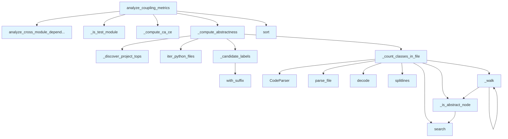

# File: `src/local_deepwiki/generators/analysis/coupling.py`

## File Overview

This file implements Robert C. Martin's package-level stability metrics for analyzing coupling between modules in a Python project. It computes key coupling metrics — afferent coupling (Ca), efferent coupling (Ce), instability (I), abstractness (A), and distance from the main sequence (D) — using only local filesystem and AST analysis.

The file is designed to be used as part of a larger static analysis pipeline, providing data that can be visualized or used for architectural decision-making.

## Key Concepts

### Coupling Metrics
The core of this module is the computation of coupling metrics:
- **Afferent Coupling (Ca)**: The number of modules that depend on a given module.
- **Efferent Coupling (Ce)**: The number of modules that a given module depends on.
- **Instability (I)**: `Ce / (Ca + Ce)`. A value of 0 indicates maximum stability; 1 indicates maximum instability.
- **Abstractness (A)**: The fraction of abstract classes in a module.
- **Distance from Main Sequence (D)**: `|A + I - 1|`. This metric helps identify modules that are either too abstract or too concrete.

These metrics are used to classify modules into different architectural zones (stable, unstable, abstract, concrete) and are useful for identifying architectural smells or potential refactoring candidates.

### AST Parsing and Class Detection
The file leverages `tree-sitter` and [`CodeParser`](../../core/parser/code_parser.md) to parse Python source code and detect class definitions. It identifies abstract classes by checking for inheritance from `ABC`, `ABCMeta`, or `Protocol`, and by looking for `@abstractmethod` decorators.

### Module Labeling and Mapping
To correctly attribute class counts and coupling metrics, the file implements logic to map file paths to module labels. It strips project top-level packages and handles special cases like `__init__.py` files to ensure consistent labeling across source and import nodes.

## Integration

This file is part of the analysis pipeline in `local_deepwiki` and integrates with:
- `module_dependencies.py`: Uses `_discover_project_tops` and [`analyze_cross_module_dependencies`](module_dependencies.md) to build the dependency graph.
- `source_filter.py`: Uses [`iter_python_files`](source_filter.md) to iterate over Python source files.
- [`CodeParser`](../../core/parser/code_parser.md): Used to parse source code into ASTs for analysis.
- [`get_logger`](../../logging.md): For logging information about the analysis process.

The functions in this file are called by:
- `_walk`: Used by complexity, design_smells, and hotspots analysis modules.
- `_is_test_module`: Used by dependency_diagram and test_diagrams_misc.
- `analyze_coupling_metrics`: Used by coupling_page, analysis_architecture, and test_analysis_architecture.

This file is a core part of the static analysis engine, contributing to architectural analysis and metrics generation.

## Design Notes

### Abstract Class Detection
The method for detecting abstract classes is robust, checking both base class inheritance and [decorator](../../providers/retry.md) usage. This ensures that classes conforming to Python's abstract base class protocols are correctly identified.

### Module Label Consistency
The `_candidate_labels` function ensures that module labels are consistent across the dependency graph, resolving ambiguities between source file paths and import targets. This is critical for accurate attribution of abstractness scores.

### Test Module Exclusion
The `analyze_coupling_metrics` function includes an option to exclude test modules from the analysis. This is important for architectural metrics, as test code often introduces artificial coupling that does not reflect the structure of the production code.

### File-Level Analysis
This module avoids any external dependencies or LLM calls, relying entirely on local filesystem and AST parsing. This ensures reproducibility and performance, making it suitable for large codebases or CI/CD pipelines.

### Edge Case Handling
The module gracefully handles unparseable files by returning `(0, 0)` for class counts, ensuring that analysis does not fail on malformed code. It also ensures that division by zero does not occur when calculating instability or abstractness.

## API Reference

### Functions

#### `analyze_coupling_metrics`

```python
def analyze_coupling_metrics(repo_path: Path, module_filter: str | None = None, exclude_tests: bool = True) -> dict[str, Any]
```

Compute Robert C. Martin coupling metrics per module.


| Parameter | Type | Default | Description |
|-----------|------|---------|-------------|
| `repo_path` | `Path` | - | Root of the repository to analyze. |
| `module_filter` | `str | None` | `None` | Optional prefix to restrict analysis to a sub-package. |
| `exclude_tests` | `bool` | `True` | When True, exclude test modules from metrics. |

**Returns:** `dict[str, Any]`


<details>
<summary>View Source (lines 185-260) | <a href="https://github.com/UrbanDiver/local-deepwiki-mcp/blob/main/src/local_deepwiki/generators/analysis/coupling.py#L185-L260">GitHub</a></summary>

```python
def analyze_coupling_metrics(
    repo_path: Path,
    module_filter: str | None = None,
    exclude_tests: bool = True,
) -> dict[str, Any]:
    """Compute Robert C. Martin coupling metrics per module.

    Args:
        repo_path: Root of the repository to analyze.
        module_filter: Optional prefix to restrict analysis to a sub-package.
        exclude_tests: When True, exclude test modules from metrics.

    Returns:
        A dict with ``status`` and ``metrics`` (list of per-module dicts).
    """
    dep_result = analyze_cross_module_dependencies(
        repo_path,
        module_filter=module_filter,
        include_external=False,
        min_edge_weight=1,
    )
    modules = dep_result["modules"]
    edges = dep_result["edges"]

    if exclude_tests:
        test_names = {m["name"] for m in modules if _is_test_module(m["name"])}
        modules = [m for m in modules if m["name"] not in test_names]
        edges = [
            e
            for e in edges
            if e["source"] not in test_names and e["target"] not in test_names
        ]

    ca, ce = _compute_ca_ce(modules, edges)
    abstractness = _compute_abstractness(repo_path, modules)

    metrics: list[dict[str, Any]] = []
    for mod in modules:
        name = mod["name"]
        ca_val = ca.get(name, 0)
        ce_val = ce.get(name, 0)
        total = ca_val + ce_val
        instability = round(ce_val / total, 4) if total > 0 else 0.0
        a_val = abstractness.get(name, 0.0)
        distance = round(abs(a_val + instability - 1.0), 4)
        metrics.append(
            {
                "module": name,
                "afferent_coupling": ca_val,
                "efferent_coupling": ce_val,
                "instability": instability,
                "abstractness": a_val,
                "distance": distance,
            }
        )

    metrics.sort(key=lambda m: m["distance"], reverse=True)
    logger.info("Coupling metrics: %d modules analyzed in %s", len(metrics), repo_path)

    return {
        "status": "success",
        "metrics": metrics,
        "stats": {
            "total_modules": len(metrics),
            "avg_instability": (
                round(sum(m["instability"] for m in metrics) / len(metrics), 4)
                if metrics
                else 0.0
            ),
            "avg_abstractness": (
                round(sum(m["abstractness"] for m in metrics) / len(metrics), 4)
                if metrics
                else 0.0
            ),
        },
    }
```

</details>

## Call Graph



## Used By

Functions and methods in this file and their callers:

- **[`CodeParser`](../../core/parser/code_parser.md)**: called by `_count_classes_in_file`
- **`_candidate_labels`**: called by `_compute_abstractness`
- **`_compute_abstractness`**: called by `analyze_coupling_metrics`
- **`_compute_ca_ce`**: called by `analyze_coupling_metrics`
- **`_count_classes_in_file`**: called by `_compute_abstractness`
- **`_discover_project_tops`**: called by `_compute_abstractness`
- **`_is_abstract_node`**: called by `_count_classes_in_file`, `_walk`
- **`_is_test_module`**: called by `analyze_coupling_metrics`
- **`_walk`**: called by `_count_classes_in_file`, `_walk`
- **[`analyze_cross_module_dependencies`](module_dependencies.md)**: called by `analyze_coupling_metrics`
- **`decode`**: called by `_count_classes_in_file`
- **[`iter_python_files`](source_filter.md)**: called by `_compute_abstractness`
- **`parse_file`**: called by `_count_classes_in_file`
- **`search`**: called by `_count_classes_in_file`, `_is_abstract_node`
- **`sort`**: called by `analyze_coupling_metrics`
- **`splitlines`**: called by `_count_classes_in_file`
- **`with_suffix`**: called by `_candidate_labels`

## Usage Examples

*Examples extracted from test files*

### Handler returns success status

From `test_coupling_metrics.py::test_coupling_metrics_success`:

```python
result = await handle_get_coupling_metrics({"repo_path": str(pkg_repo)})
data = json.loads(result[0].text)
assert data["status"] == "success"
```

### Example: `coupling`

From `test_coupling_page.py::test_returns_markdown_with_title_and_table`:

```python
result = generate_coupling_page(_make_data())
    assert result is not None
    assert "# Coupling Metrics" in result
    # Should have a markdown table
    assert "| Module |" in result
```


## Last Modified

| Entity | Type | Author | Date | Commit |
|--------|------|--------|------|--------|
| `_candidate_labels` | function | Brian Breidenbach | today | `c0fe1bd` fix: unify module labels in... |
| `_is_test_module` | function | Brian Breidenbach | today | `56000bf` fix: improve analysis accur... |
| `analyze_coupling_metrics` | function | Brian Breidenbach | today | `56000bf` fix: improve analysis accur... |
| `_compute_ca_ce` | function | Brian Breidenbach | 3 days ago | `29ae780` refactor: decompose long me... |
| `_compute_abstractness` | function | Brian Breidenbach | 3 days ago | `515ba66` refactor: improve coupling ... |
| `_count_classes_in_file` | function | Brian Breidenbach | 1 week ago | `f6da957` feat: add 4 architecture an... |
| `_is_abstract_node` | function | Brian Breidenbach | 1 week ago | `f6da957` feat: add 4 architecture an... |
| `_walk` | function | Brian Breidenbach | 1 week ago | `f6da957` feat: add 4 architecture an... |

## Additional Source Code

Source code for functions and methods not listed in the API Reference above.

#### `_count_classes_in_file`

<details>
<summary>View Source (lines 48-90) | <a href="https://github.com/UrbanDiver/local-deepwiki-mcp/blob/main/src/local_deepwiki/generators/analysis/coupling.py#L48-L90">GitHub</a></summary>

```python
def _count_classes_in_file(full_path: Path) -> tuple[int, int]:
    """Return ``(total_classes, abstract_classes)`` found in *full_path*.

    A class is considered abstract if:
    - It inherits from ``ABC``, ``ABCMeta``, or ``Protocol``, OR
    - It contains at least one ``@abstractmethod`` decorator.

    Falls back to (0, 0) for unparseable or unsupported files.
    """
    parser = CodeParser()
    parse_result = parser.parse_file(full_path)
    if parse_result is None:
        return 0, 0

    root_node, _lang, src_bytes = parse_result
    source = src_bytes.decode("utf-8", errors="replace")
    lines = source.splitlines()

    total = 0
    abstract = 0

    def _is_abstract_node(node: Node) -> bool:
        """Check if a class node is abstract via base classes or decorators."""
        # Check parent classes in the node text span.
        class_src = "\n".join(lines[node.start_point[0] : node.end_point[0] + 1])
        if _ABC_BASE_RE.search(class_src):
            return True
        # Check for @abstractmethod anywhere inside the class body.
        if _ABSTRACT_METHOD_RE.search(class_src):
            return True
        return False

    def _walk(n: Node) -> None:
        nonlocal total, abstract
        if n.type in _CLASS_TYPES:
            total += 1
            if _is_abstract_node(n):
                abstract += 1
        for child in n.children:
            _walk(child)

    _walk(root_node)
    return total, abstract
```

</details>


#### `_is_abstract_node`

<details>
<summary>View Source (lines 69-78) | <a href="https://github.com/UrbanDiver/local-deepwiki-mcp/blob/main/src/local_deepwiki/generators/analysis/coupling.py#L69-L78">GitHub</a></summary>

```python
def _is_abstract_node(node: Node) -> bool:
        """Check if a class node is abstract via base classes or decorators."""
        # Check parent classes in the node text span.
        class_src = "\n".join(lines[node.start_point[0] : node.end_point[0] + 1])
        if _ABC_BASE_RE.search(class_src):
            return True
        # Check for @abstractmethod anywhere inside the class body.
        if _ABSTRACT_METHOD_RE.search(class_src):
            return True
        return False
```

</details>


#### `_walk`

<details>
<summary>View Source (lines 80-87) | <a href="https://github.com/UrbanDiver/local-deepwiki-mcp/blob/main/src/local_deepwiki/generators/analysis/coupling.py#L80-L87">GitHub</a></summary>

```python
def _walk(n: Node) -> None:
        nonlocal total, abstract
        if n.type in _CLASS_TYPES:
            total += 1
            if _is_abstract_node(n):
                abstract += 1
        for child in n.children:
            _walk(child)
```

</details>


#### `_candidate_labels`

<details>
<summary>View Source (lines 93-111) | <a href="https://github.com/UrbanDiver/local-deepwiki-mcp/blob/main/src/local_deepwiki/generators/analysis/coupling.py#L93-L111">GitHub</a></summary>

```python
def _candidate_labels(rel_path: Path, project_tops: set[str]) -> list[str]:
    """Return candidate module labels for *rel_path*.

    Now that :func:`_module_label` strips the project top-level package
    (matching :func:`_resolve_import_target`), source labels and import
    labels are consistent.  We return the single canonical label.
    """
    parts = list(rel_path.with_suffix("").parts)
    while parts and parts[0] in ("src", "lib", "pkg"):
        parts = parts[1:]
    if not parts:
        return ["root"]
    if parts[0] in project_tops:
        parts = parts[1:]
    if not parts:
        return ["root"]
    meaningful = [p for p in parts[:2] if p != "__init__"]
    label = ".".join(meaningful) if meaningful else (parts[0] if parts else "root")
    return [label]
```

</details>


#### `_compute_abstractness`

<details>
<summary>View Source (lines 114-161) | <a href="https://github.com/UrbanDiver/local-deepwiki-mcp/blob/main/src/local_deepwiki/generators/analysis/coupling.py#L114-L161">GitHub</a></summary>

```python
def _compute_abstractness(
    repo_path: Path, modules: list[dict[str, Any]]
) -> dict[str, float]:
    """Return a dict mapping module label -> abstractness score (0.0–1.0).

    The dependency graph contains two kinds of module nodes for files in
    projects with a top-level wrapper package (e.g. ``local_deepwiki``):

    - **Source nodes** such as ``local_deepwiki.providers`` — created from
      file paths via :func:`~module_dependencies._module_label`.
    - **Import-target nodes** such as ``providers.base`` — created when other
      modules import from ``local_deepwiki.providers.base``.

    We generate both candidate labels for each file and attribute the class
    counts to whichever graph node is found first (preferring the more
    specific stripped label).  This ensures that ABCs and Protocols defined in
    ``providers/base.py`` are counted against ``providers.base`` (Ca=30) rather
    than only against ``local_deepwiki.providers`` (Ce=12), giving an accurate
    abstractness score for the heavily-depended-on module.
    """
    result: dict[str, float] = {}

    # We need to map each module label back to the files that belong to it.
    # We re-walk the repo since we don't persist the file->module mapping.
    module_names = {m["name"] for m in modules}
    project_tops = _discover_project_tops(repo_path)

    module_total: dict[str, int] = {m: 0 for m in module_names}
    module_abstract: dict[str, int] = {m: 0 for m in module_names}

    for py_file, rel_path in iter_python_files(repo_path, exclude_tests=False):
        # Find the first candidate label that exists as a module node.
        label: str | None = None
        for candidate in _candidate_labels(rel_path, project_tops):
            if candidate in module_names:
                label = candidate
                break
        if label is None:
            continue
        total, abstr = _count_classes_in_file(py_file)
        module_total[label] += total
        module_abstract[label] += abstr

    for mod in module_names:
        tot = module_total[mod]
        result[mod] = round(module_abstract[mod] / tot, 4) if tot > 0 else 0.0

    return result
```

</details>


#### `_compute_ca_ce`

<details>
<summary>View Source (lines 164-176) | <a href="https://github.com/UrbanDiver/local-deepwiki-mcp/blob/main/src/local_deepwiki/generators/analysis/coupling.py#L164-L176">GitHub</a></summary>

```python
def _compute_ca_ce(
    modules: list[dict[str, Any]],
    edges: list[dict[str, Any]],
) -> tuple[dict[str, int], dict[str, int]]:
    """Compute afferent (Ca) and efferent (Ce) coupling counts per module."""
    ca: dict[str, int] = {m["name"]: 0 for m in modules}
    ce: dict[str, int] = {m["name"]: 0 for m in modules}
    for edge in edges:
        if edge["target"] in ca:
            ca[edge["target"]] += 1
        if edge["source"] in ce:
            ce[edge["source"]] += 1
    return ca, ce
```

</details>


#### `_is_test_module`

<details>
<summary>View Source (lines 179-182) | <a href="https://github.com/UrbanDiver/local-deepwiki-mcp/blob/main/src/local_deepwiki/generators/analysis/coupling.py#L179-L182">GitHub</a></summary>

```python
def _is_test_module(name: str) -> bool:
    """Return True if *name* looks like a test module label."""
    parts = name.split(".")
    return any(p.startswith("test_") or p == "tests" or p == "conftest" for p in parts)
```

</details>

## Relevant Source Files

- `src/local_deepwiki/generators/analysis/coupling.py:48-90`

## See Also

- [logging](../../logging.md) - dependency
- [init_cli](../../cli/init_cli.md) - shares 2 dependencies

## See Also

- [logging](../../logging.md) - dependency
- [init_cli](../../cli/init_cli.md) - shares 2 dependencies

## See Also

- [logging](../../logging.md) - dependency
- [init_cli](../../cli/init_cli.md) - shares 2 dependencies
