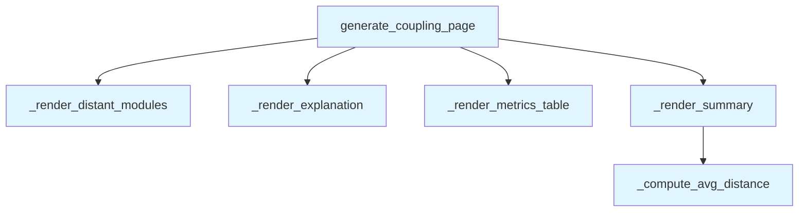

# File: `src/local_deepwiki/generators/analysis/coupling_page.py`

## File Overview

This file is responsible for rendering coupling metrics data into a structured markdown page. It takes the output of `analyze_coupling_metrics()` and transforms it into a human-readable report that includes explanations of Martin's coupling metrics, summary statistics, a detailed metrics table, and a highlight section for modules that are far from the main sequence.

The design rationale is to produce a self-contained, informative markdown document that can be used directly in a wiki or documentation system without requiring external dependencies or LLM processing. It is a pure computation module focused on formatting and presentation logic.

## Key Concepts

### Martin's Coupling Metrics

The core of this module is the interpretation and rendering of Robert C. Martin's package coupling metrics:
- **Ca** (afferent coupling): The number of modules depending on the current module.
- **Ce** (efferent coupling): The number of modules the current module depends on.
- **I** (instability): Calculated as `Ce / (Ca + Ce)`, where 0 = maximally stable, 1 = maximally unstable.
- **A** (abstractness): The fraction of abstract classes in the module.
- **D** (distance from main sequence): Calculated as `|A + I - 1|`, where 0 = on the main sequence, 1 = maximally far.

These metrics are used to assess module stability and abstraction, and to identify potential design issues in the codebase.

### Sorting and Highlighting

The module sorts the metrics table by **distance from the main sequence** in descending order, which allows users to quickly identify modules that are either too concrete (zone of pain) or too abstract (zone of uselessness). The `_render_distant_modules` function specifically highlights these modules.

### Summary Statistics

The module computes and displays average instability, abstractness, and distance, providing a high-level overview of the coupling behavior across all modules.

## Integration

This file is part of the `local_deepwiki` documentation generation pipeline. It is used by:
- `generate_coupling_page` — the main entry point, called by `test_coupling_page`.
- `_render_summary` — used by coverage tests.

The module is designed to be a pure computation layer and does not depend on external libraries or async operations. It integrates directly with the analysis pipeline by accepting data from `analyze_coupling_metrics()` and returning formatted markdown, making it suitable for embedding into larger documentation generation workflows.

## Design Notes

- **No External Dependencies**: The module is self-contained and does not rely on external libraries, LLMs, or async operations.
- **Robustness**: The code gracefully handles missing or empty data by returning `None` in `generate_coupling_page` and using default values in computations.
- **Sorting Strategy**: The metrics table is sorted by distance descending to prioritize modules that are most deviant from the main sequence.
- **Threshold for Highlighting**: The `_render_distant_modules` function uses a fixed threshold (`_DISTANCE_THRESHOLD`) to determine which modules to highlight. This value is not defined in the provided code, implying it's defined elsewhere in the codebase.
- **Formatting Consistency**: Markdown formatting is consistent and clean, using tables and lists to present data in a structured and readable way.
- **Edge Case Handling**: The `_compute_avg_distance` function safely handles empty metric lists by returning `0.0`, avoiding division by zero errors.

## API Reference

### Functions

#### `generate_coupling_page`

```python
def generate_coupling_page(coupling_data: dict) -> str | None
```

Render coupling metrics dict as markdown.


| Parameter | Type | Default | Description |
|-----------|------|---------|-------------|
| `coupling_data` | `dict` | - | Dict returned by ``analyze_coupling_metrics()``. |

**Returns:** `str | None`


<details>
<summary>View Source (lines 15-37) | <a href="https://github.com/UrbanDiver/local-deepwiki-mcp/blob/main/src/local_deepwiki/generators/analysis/coupling_page.py#L15-L37">GitHub</a></summary>

```python
def generate_coupling_page(coupling_data: dict) -> str | None:
    """Render coupling metrics dict as markdown.

    Args:
        coupling_data: Dict returned by ``analyze_coupling_metrics()``.

    Returns:
        Markdown string, or ``None`` if the data is empty / unusable.
    """
    metrics = coupling_data.get("metrics", [])
    if not metrics:
        return None

    lines: list[str] = []
    lines.append("# Coupling Metrics")
    lines.append("")

    _render_explanation(lines)
    _render_summary(lines, coupling_data.get("stats", {}), metrics)
    _render_metrics_table(lines, metrics)
    _render_distant_modules(lines, metrics)

    return "\n".join(lines)
```

</details>

## Call Graph



## Used By

Functions and methods in this file and their callers:

- **`_compute_avg_distance`**: called by `_render_summary`
- **`_render_distant_modules`**: called by `generate_coupling_page`
- **`_render_explanation`**: called by `generate_coupling_page`
- **`_render_metrics_table`**: called by `generate_coupling_page`
- **`_render_summary`**: called by `generate_coupling_page`

## Usage Examples

*Examples extracted from test files*

### Example: `coupling_page`

From `test_coupling_page.py::test_returns_markdown_with_title_and_table`:

```python
result = generate_coupling_page(_make_data())
    assert result is not None
    assert "# Coupling Metrics" in result
    # Should have a markdown table
    assert "| Module |" in result
```

### Example: `generate_coupling_page`

From `test_coupling_page.py::test_returns_markdown_with_title_and_table`:

```python
result = generate_coupling_page(_make_data())
    assert result is not None
    assert "# Coupling Metrics" in result
    # Should have a markdown table
    assert "| Module |" in result
```

### Example: `generate_coupling_page`

From `test_coupling_page.py::test_includes_module_name_in_output`:

```python
metrics = [_make_module(module="generators.wiki")]
    result = generate_coupling_page(_make_data(metrics=metrics))
    assert result is not None
    assert "generators.wiki" in result
```


## Last Modified

| Entity | Type | Author | Date | Commit |
|--------|------|--------|------|--------|
| `generate_coupling_page` | function | Brian Breidenbach | 1 week ago | `87b57fa` feat: add Coupling Metrics ... |
| `_render_explanation` | function | Brian Breidenbach | 1 week ago | `87b57fa` feat: add Coupling Metrics ... |
| `_render_summary` | function | Brian Breidenbach | 1 week ago | `87b57fa` feat: add Coupling Metrics ... |
| `_compute_avg_distance` | function | Brian Breidenbach | 1 week ago | `87b57fa` feat: add Coupling Metrics ... |
| `_render_metrics_table` | function | Brian Breidenbach | 1 week ago | `87b57fa` feat: add Coupling Metrics ... |
| `_render_distant_modules` | function | Brian Breidenbach | 1 week ago | `87b57fa` feat: add Coupling Metrics ... |

## Additional Source Code

Source code for functions and methods not listed in the API Reference above.

#### `_render_explanation`

<details>
<summary>View Source (lines 40-62) | <a href="https://github.com/UrbanDiver/local-deepwiki-mcp/blob/main/src/local_deepwiki/generators/analysis/coupling_page.py#L40-L62">GitHub</a></summary>

```python
def _render_explanation(lines: list[str]) -> None:
    """Append explanation paragraph describing Martin coupling metrics."""
    lines.append(
        "Robert C. Martin's package coupling metrics measure the stability "
        "and abstractness of each module:"
    )
    lines.append("")
    lines.append(
        "- **Ca** (afferent coupling): number of modules that depend on this module"
    )
    lines.append(
        "- **Ce** (efferent coupling): number of modules this module depends on"
    )
    lines.append(
        "- **I** (instability): Ce / (Ca + Ce) -- 0 = maximally stable, "
        "1 = maximally unstable"
    )
    lines.append("- **A** (abstractness): fraction of abstract classes in the module")
    lines.append(
        "- **D** (distance from main sequence): |A + I - 1| -- "
        "0 = on the main sequence, 1 = maximally far"
    )
    lines.append("")
```

</details>


#### `_render_summary`

<details>
<summary>View Source (lines 65-83) | <a href="https://github.com/UrbanDiver/local-deepwiki-mcp/blob/main/src/local_deepwiki/generators/analysis/coupling_page.py#L65-L83">GitHub</a></summary>

```python
def _render_summary(lines: list[str], stats: dict, metrics: list[dict]) -> None:
    """Append summary statistics."""
    total = stats.get("total_modules", len(metrics))
    avg_distance = _compute_avg_distance(metrics)

    lines.append("## Summary")
    lines.append("")
    lines.append(f"- **Total modules:** {total}")
    lines.append(f"- **Average distance from main sequence:** {avg_distance:.3f}")

    avg_instability = stats.get("avg_instability")
    if avg_instability is not None:
        lines.append(f"- **Average instability:** {avg_instability:.3f}")

    avg_abstractness = stats.get("avg_abstractness")
    if avg_abstractness is not None:
        lines.append(f"- **Average abstractness:** {avg_abstractness:.3f}")

    lines.append("")
```

</details>


#### `_compute_avg_distance`

<details>
<summary>View Source (lines 86-91) | <a href="https://github.com/UrbanDiver/local-deepwiki-mcp/blob/main/src/local_deepwiki/generators/analysis/coupling_page.py#L86-L91">GitHub</a></summary>

```python
def _compute_avg_distance(metrics: list[dict]) -> float:
    """Compute average distance from the metrics list."""
    if not metrics:
        return 0.0
    total = sum(m.get("distance", 0.0) for m in metrics)
    return round(total / len(metrics), 4)
```

</details>


#### `_render_metrics_table`

<details>
<summary>View Source (lines 94-115) | <a href="https://github.com/UrbanDiver/local-deepwiki-mcp/blob/main/src/local_deepwiki/generators/analysis/coupling_page.py#L94-L115">GitHub</a></summary>

```python
def _render_metrics_table(lines: list[str], metrics: list[dict]) -> None:
    """Append the main metrics table sorted by distance descending."""
    sorted_metrics = sorted(metrics, key=lambda m: m.get("distance", 0.0), reverse=True)

    lines.append("## Metrics by Module")
    lines.append("")
    lines.append("| Module | Ca | Ce | I | A | D |")
    lines.append("|--------|----|----|---|---|---|")

    for m in sorted_metrics:
        module = m.get("module", "")
        ca = m.get("afferent_coupling", 0)
        ce = m.get("efferent_coupling", 0)
        instability = m.get("instability", 0.0)
        abstractness = m.get("abstractness", 0.0)
        distance = m.get("distance", 0.0)
        lines.append(
            f"| `{module}` | {ca} | {ce} "
            f"| {instability:.3f} | {abstractness:.3f} | {distance:.3f} |"
        )

    lines.append("")
```

</details>


#### `_render_distant_modules`

<details>
<summary>View Source (lines 118-147) | <a href="https://github.com/UrbanDiver/local-deepwiki-mcp/blob/main/src/local_deepwiki/generators/analysis/coupling_page.py#L118-L147">GitHub</a></summary>

```python
def _render_distant_modules(lines: list[str], metrics: list[dict]) -> None:
    """Append a highlight section for modules far from the main sequence."""
    distant = [m for m in metrics if m.get("distance", 0.0) > _DISTANCE_THRESHOLD]

    if not distant:
        return

    distant_sorted = sorted(distant, key=lambda m: m.get("distance", 0.0), reverse=True)

    lines.append("## Far from Main Sequence")
    lines.append("")
    lines.append(
        f"The following {len(distant_sorted)} module(s) have D > "
        f"{_DISTANCE_THRESHOLD}, indicating they may be either too "
        "concrete and stable (zone of pain) or too abstract and unstable "
        "(zone of uselessness):"
    )
    lines.append("")

    for m in distant_sorted:
        module = m.get("module", "")
        distance = m.get("distance", 0.0)
        instability = m.get("instability", 0.0)
        abstractness = m.get("abstractness", 0.0)
        lines.append(
            f"- **`{module}`** -- D={distance:.3f} "
            f"(I={instability:.3f}, A={abstractness:.3f})"
        )

    lines.append("")
```

</details>

## Relevant Source Files

- `src/local_deepwiki/generators/analysis/coupling_page.py:15-37`
