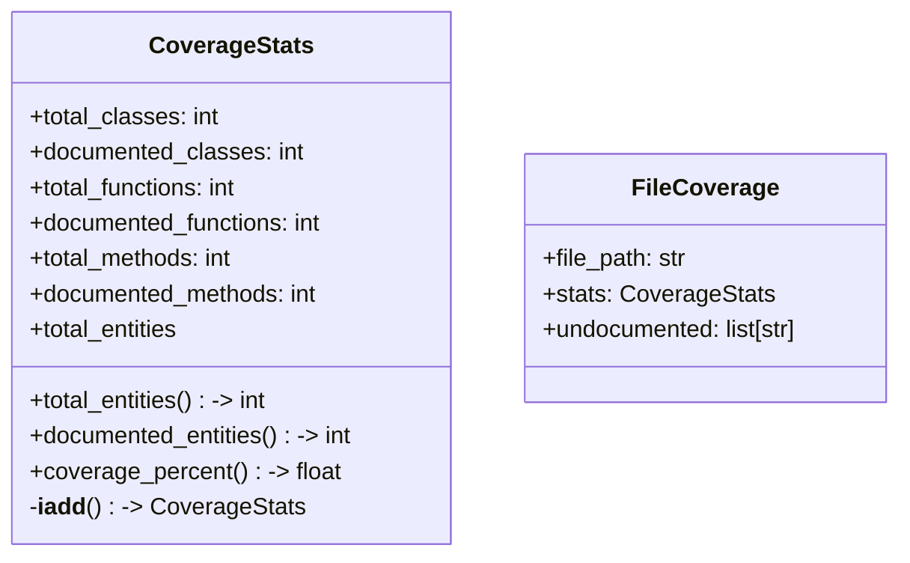
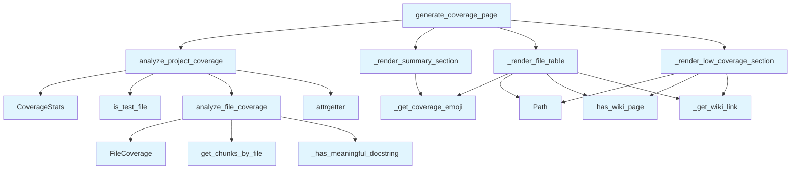

# File: `src/local_deepwiki/generators/analysis/coverage.py`

## File Overview

This file provides functionality for analyzing and reporting documentation coverage within a codebase. It assesses how well classes, functions, and methods are documented by examining docstrings and generates a structured markdown report summarizing coverage statistics.

The primary responsibility of this file is to:
- Analyze individual files for documentation coverage.
- Aggregate coverage statistics across the entire project.
- Generate a human-readable markdown report that highlights coverage levels and identifies low-coverage files.

It is part of the analysis suite for generating documentation-related pages, integrating with vector stores that contain code chunks and their associated metadata.

## Key Concepts

### Coverage Analysis
The core concept revolves around assessing the documentation quality of code entities (classes, functions, methods). This is achieved by:
- Parsing code chunks from a vector store.
- Checking each chunk's docstring for meaningful content using `_has_meaningful_docstring`.
- Categorizing entities by type and accumulating coverage statistics in `CoverageStats`.

### Reporting Structure
The report is composed of three main sections:
1. **Summary**: Overall coverage percentage and breakdown by entity type.
2. **Per-File Coverage Table**: Shows coverage for each file, sorted from lowest to highest.
3. **Files Needing Attention**: Lists files with low coverage (<50%) along with undocumented entities.

This structure allows users to quickly identify both global coverage trends and specific areas requiring improvement.

### Emoji Indicators
An emoji-based visual indicator is used to represent coverage levels:
- 🟢 ≥90%
- 🟡 ≥70%
- 🟠 ≥50%
- 🔴 <50%

This provides an immediate visual cue for coverage status without needing to parse numbers.

## Integration

This file integrates with several core components of the system:

- **[VectorStore](../../core/vectorstore/store.md)**: Used via `vector_store.get_chunks_by_file()` to retrieve code chunks for analysis.
- **[IndexStatus](../../models/wiki.md)**: Provides file listing information used to iterate over project files.
- **Path Utilities**: [`is_test_file`](source_filter.md) filters out test files from coverage analysis.
- **Wiki Utilities**: [`has_wiki_page`](../wiki/utils.md) and [`file_path_to_wiki_path`](../wiki/utils.md) enable linking to existing wiki pages in the output.

It is consumed by:
- `analyze_project_coverage` is called by `generator_service`.
- `generate_coverage_page` is also used by `generator_service` to produce the final markdown output.
- `_get_coverage_emoji` and `CoverageStats` are used by `test_coverage` tests.

## Design Notes

### Meaningful Docstring Detection
The `_has_meaningful_docstring` function implements a heuristic to filter out trivial or placeholder docstrings such as "todo", "pass", etc. It enforces a minimum length (`MIN_DOCSTRING_LENGTH`) to avoid counting very short docstrings as meaningful. This prevents false positives in coverage metrics.

### Coverage Thresholds
Coverage thresholds are defined as constants:
- `COVERAGE_EXCELLENT_THRESHOLD`: 90%
- `COVERAGE_GOOD_THRESHOLD`: 70%
- `COVERAGE_FAIR_THRESHOLD`: 50%

These thresholds determine emoji indicators and are used to identify low-coverage files in the "Files Needing Attention" section.

### Sorting and Pagination
Files are sorted by coverage percentage (ascending) to highlight the lowest-coverage files first. For the "Files Needing Attention" section, only the top `MAX_LOW_COVERAGE_FILES` are listed, and for each file, only the first `MAX_UNDOCUMENTED_ITEMS` undocumented entities are shown. This prevents overwhelming users with too much information.

### Handling Empty Files
If a file has no entities (i.e., `total_entities == 0`), it is skipped in the per-file table to avoid displaying meaningless rows.

### Asynchronous Processing
All coverage analysis functions are `async` to allow for efficient I/O operations when interacting with the vector store, especially in large projects where many files need to be processed.

## API Reference

### class `CoverageStats`

Documentation coverage statistics.

**Methods:**


<details>
<summary>View Source (lines 28-67) | <a href="https://github.com/UrbanDiver/local-deepwiki-mcp/blob/main/src/local_deepwiki/generators/analysis/coverage.py#L28-L67">GitHub</a></summary>

```python
class CoverageStats:
    """Documentation coverage statistics."""

    total_classes: int = 0
    documented_classes: int = 0
    total_functions: int = 0
    documented_functions: int = 0
    total_methods: int = 0
    documented_methods: int = 0

    @property
    def total_entities(self) -> int:
        """Total number of documentable entities."""
        return self.total_classes + self.total_functions + self.total_methods

    @property
    def documented_entities(self) -> int:
        """Total number of documented entities."""
        return (
            self.documented_classes
            + self.documented_functions
            + self.documented_methods
        )

    @property
    def coverage_percent(self) -> float:
        """Overall documentation coverage percentage."""
        if self.total_entities == 0:
            return 100.0
        return (self.documented_entities / self.total_entities) * 100

    def __iadd__(self, other: CoverageStats) -> CoverageStats:
        """Accumulate stats from another CoverageStats instance."""
        self.total_classes += other.total_classes
        self.documented_classes += other.documented_classes
        self.total_functions += other.total_functions
        self.documented_functions += other.documented_functions
        self.total_methods += other.total_methods
        self.documented_methods += other.documented_methods
        return self
```

</details>

#### `total_entities`

```python
def total_entities() -> int
```

Total number of documentable entities.


<details>
<summary>View Source (lines 28-67) | <a href="https://github.com/UrbanDiver/local-deepwiki-mcp/blob/main/src/local_deepwiki/generators/analysis/coverage.py#L28-L67">GitHub</a></summary>

```python
class CoverageStats:
    """Documentation coverage statistics."""

    total_classes: int = 0
    documented_classes: int = 0
    total_functions: int = 0
    documented_functions: int = 0
    total_methods: int = 0
    documented_methods: int = 0

    @property
    def total_entities(self) -> int:
        """Total number of documentable entities."""
        return self.total_classes + self.total_functions + self.total_methods

    @property
    def documented_entities(self) -> int:
        """Total number of documented entities."""
        return (
            self.documented_classes
            + self.documented_functions
            + self.documented_methods
        )

    @property
    def coverage_percent(self) -> float:
        """Overall documentation coverage percentage."""
        if self.total_entities == 0:
            return 100.0
        return (self.documented_entities / self.total_entities) * 100

    def __iadd__(self, other: CoverageStats) -> CoverageStats:
        """Accumulate stats from another CoverageStats instance."""
        self.total_classes += other.total_classes
        self.documented_classes += other.documented_classes
        self.total_functions += other.total_functions
        self.documented_functions += other.documented_functions
        self.total_methods += other.total_methods
        self.documented_methods += other.documented_methods
        return self
```

</details>

#### `documented_entities`

```python
def documented_entities() -> int
```

Total number of documented entities.


<details>
<summary>View Source (lines 28-67) | <a href="https://github.com/UrbanDiver/local-deepwiki-mcp/blob/main/src/local_deepwiki/generators/analysis/coverage.py#L28-L67">GitHub</a></summary>

```python
class CoverageStats:
    """Documentation coverage statistics."""

    total_classes: int = 0
    documented_classes: int = 0
    total_functions: int = 0
    documented_functions: int = 0
    total_methods: int = 0
    documented_methods: int = 0

    @property
    def total_entities(self) -> int:
        """Total number of documentable entities."""
        return self.total_classes + self.total_functions + self.total_methods

    @property
    def documented_entities(self) -> int:
        """Total number of documented entities."""
        return (
            self.documented_classes
            + self.documented_functions
            + self.documented_methods
        )

    @property
    def coverage_percent(self) -> float:
        """Overall documentation coverage percentage."""
        if self.total_entities == 0:
            return 100.0
        return (self.documented_entities / self.total_entities) * 100

    def __iadd__(self, other: CoverageStats) -> CoverageStats:
        """Accumulate stats from another CoverageStats instance."""
        self.total_classes += other.total_classes
        self.documented_classes += other.documented_classes
        self.total_functions += other.total_functions
        self.documented_functions += other.documented_functions
        self.total_methods += other.total_methods
        self.documented_methods += other.documented_methods
        return self
```

</details>

#### `coverage_percent`

```python
def coverage_percent() -> float
```

Overall documentation coverage percentage.


<details>
<summary>View Source (lines 28-67) | <a href="https://github.com/UrbanDiver/local-deepwiki-mcp/blob/main/src/local_deepwiki/generators/analysis/coverage.py#L28-L67">GitHub</a></summary>

```python
class CoverageStats:
    """Documentation coverage statistics."""

    total_classes: int = 0
    documented_classes: int = 0
    total_functions: int = 0
    documented_functions: int = 0
    total_methods: int = 0
    documented_methods: int = 0

    @property
    def total_entities(self) -> int:
        """Total number of documentable entities."""
        return self.total_classes + self.total_functions + self.total_methods

    @property
    def documented_entities(self) -> int:
        """Total number of documented entities."""
        return (
            self.documented_classes
            + self.documented_functions
            + self.documented_methods
        )

    @property
    def coverage_percent(self) -> float:
        """Overall documentation coverage percentage."""
        if self.total_entities == 0:
            return 100.0
        return (self.documented_entities / self.total_entities) * 100

    def __iadd__(self, other: CoverageStats) -> CoverageStats:
        """Accumulate stats from another CoverageStats instance."""
        self.total_classes += other.total_classes
        self.documented_classes += other.documented_classes
        self.total_functions += other.total_functions
        self.documented_functions += other.documented_functions
        self.total_methods += other.total_methods
        self.documented_methods += other.documented_methods
        return self
```

</details>

### class `FileCoverage`

Coverage statistics for a single file.

---


<details>
<summary>View Source (lines 71-78) | <a href="https://github.com/UrbanDiver/local-deepwiki-mcp/blob/main/src/local_deepwiki/generators/analysis/coverage.py#L71-L78">GitHub</a></summary>

```python
class FileCoverage:
    """Coverage statistics for a single file."""

    file_path: str
    stats: CoverageStats = field(default_factory=CoverageStats)
    undocumented: list[str] = field(
        default_factory=list
    )  # List of undocumented entity names
```

</details>

### Functions

#### `analyze_file_coverage`

```python
async def analyze_file_coverage(file_path: str, vector_store: VectorStore) -> FileCoverage
```

Analyze documentation coverage for a single file.


| Parameter | Type | Default | Description |
|-----------|------|---------|-------------|
| `file_path` | `str` | - | Path to the source file. |
| `vector_store` | `VectorStore` | - | Vector store with code chunks. |

**Returns:** `FileCoverage`


<details>
<summary>View Source (lines 106-148) | <a href="https://github.com/UrbanDiver/local-deepwiki-mcp/blob/main/src/local_deepwiki/generators/analysis/coverage.py#L106-L148">GitHub</a></summary>

```python
async def analyze_file_coverage(
    file_path: str,
    vector_store: VectorStore,
) -> FileCoverage:
    """Analyze documentation coverage for a single file.

    Args:
        file_path: Path to the source file.
        vector_store: Vector store with code chunks.

    Returns:
        FileCoverage object with statistics.
    """
    coverage = FileCoverage(file_path=file_path)
    chunks = await vector_store.get_chunks_by_file(file_path)

    for chunk in chunks:
        name = chunk.name or "Unknown"
        has_doc = _has_meaningful_docstring(chunk.docstring)

        if chunk.chunk_type == ChunkType.CLASS:
            coverage.stats.total_classes += 1
            if has_doc:
                coverage.stats.documented_classes += 1
            else:
                coverage.undocumented.append(f"class {name}")

        elif chunk.chunk_type == ChunkType.FUNCTION:
            coverage.stats.total_functions += 1
            if has_doc:
                coverage.stats.documented_functions += 1
            else:
                coverage.undocumented.append(f"function {name}")

        elif chunk.chunk_type == ChunkType.METHOD:
            coverage.stats.total_methods += 1
            if has_doc:
                coverage.stats.documented_methods += 1
            else:
                parent = chunk.parent_name or "Unknown"
                coverage.undocumented.append(f"method {parent}.{name}")

    return coverage
```

</details>

#### `analyze_project_coverage`

```python
async def analyze_project_coverage(index_status: IndexStatus, vector_store: VectorStore) -> tuple[CoverageStats, list[FileCoverage]]
```

Analyze documentation coverage for the entire project.


| Parameter | Type | Default | Description |
|-----------|------|---------|-------------|
| `index_status` | `IndexStatus` | - | Index status with file information. |
| `vector_store` | `VectorStore` | - | Vector store with code chunks. |

**Returns:** `tuple[CoverageStats, list[FileCoverage]]`


<details>
<summary>View Source (lines 151-178) | <a href="https://github.com/UrbanDiver/local-deepwiki-mcp/blob/main/src/local_deepwiki/generators/analysis/coverage.py#L151-L178">GitHub</a></summary>

```python
async def analyze_project_coverage(
    index_status: IndexStatus,
    vector_store: VectorStore,
) -> tuple[CoverageStats, list[FileCoverage]]:
    """Analyze documentation coverage for the entire project.

    Args:
        index_status: Index status with file information.
        vector_store: Vector store with code chunks.

    Returns:
        Tuple of (overall stats, list of per-file coverage).
    """
    overall = CoverageStats()
    file_coverages: list[FileCoverage] = []

    for file_info in index_status.files:
        if is_test_file(file_info.path):
            continue
        file_coverage = await analyze_file_coverage(file_info.path, vector_store)
        file_coverages.append(file_coverage)

        overall += file_coverage.stats

    # Sort by coverage (lowest first)
    file_coverages = sorted(file_coverages, key=attrgetter("stats.coverage_percent"))

    return overall, file_coverages
```

</details>

#### `generate_coverage_page`

```python
async def generate_coverage_page(index_status: IndexStatus, vector_store: VectorStore) -> str | None
```

Generate the documentation coverage report page.


| Parameter | Type | Default | Description |
|-----------|------|---------|-------------|
| `index_status` | `IndexStatus` | - | Index status with file information. |
| `vector_store` | `VectorStore` | - | Vector store with code chunks. |

**Returns:** `str | None`


<details>
<summary>View Source (lines 325-360) | <a href="https://github.com/UrbanDiver/local-deepwiki-mcp/blob/main/src/local_deepwiki/generators/analysis/coverage.py#L325-L360">GitHub</a></summary>

```python
async def generate_coverage_page(
    index_status: IndexStatus,
    vector_store: VectorStore,
) -> str | None:
    """Generate the documentation coverage report page.

    Args:
        index_status: Index status with file information.
        vector_store: Vector store with code chunks.

    Returns:
        Markdown content for the coverage page, or None if no entities found.
    """
    overall, file_coverages = await analyze_project_coverage(index_status, vector_store)

    if overall.total_entities == 0:
        return None

    lines = [
        "# Documentation Coverage",
        "",
        "This report shows the documentation coverage for the codebase.",
        "",
    ]

    lines.extend(_render_summary_section(overall))
    lines.extend(_render_file_table(file_coverages))
    lines.extend(_render_low_coverage_section(file_coverages))

    # Legend
    lines.append("---")
    lines.append("")
    lines.append("**Legend:** 🟢 ≥90% | 🟡 ≥70% | 🟠 ≥50% | 🔴 <50%")
    lines.append("")

    return "\n".join(lines)
```

</details>

## Class Diagram



## Call Graph



## Used By

Functions and methods in this file and their callers:

- **`CoverageStats`**: called by `analyze_project_coverage`
- **`FileCoverage`**: called by `analyze_file_coverage`
- **`Path`**: called by `_render_file_table`, `_render_low_coverage_section`
- **`_get_coverage_emoji`**: called by `_render_file_table`, `_render_summary_section`
- **`_get_wiki_link`**: called by `_render_file_table`, `_render_low_coverage_section`
- **`_has_meaningful_docstring`**: called by `analyze_file_coverage`
- **`_render_file_table`**: called by `generate_coverage_page`
- **`_render_low_coverage_section`**: called by `generate_coverage_page`
- **`_render_summary_section`**: called by `generate_coverage_page`
- **`analyze_file_coverage`**: called by `analyze_project_coverage`
- **`analyze_project_coverage`**: called by `generate_coverage_page`
- **`attrgetter`**: called by `analyze_project_coverage`
- **`get_chunks_by_file`**: called by `analyze_file_coverage`
- **[`has_wiki_page`](../wiki/utils.md)**: called by `_render_file_table`, `_render_low_coverage_section`
- **[`is_test_file`](source_filter.md)**: called by `analyze_project_coverage`

## Usage Examples

*Examples extracted from test files*

### Test total_entities property

From `test_coverage.py::TestCoverageStats::test_total_entities`:

```python
stats = CoverageStats(
    total_classes=5,
    total_functions=10,
    total_methods=15,
)
assert stats.total_entities == 30
```

### Test documented_entities property

From `test_coverage.py::TestCoverageStats::test_documented_entities`:

```python
stats = CoverageStats(
    documented_classes=3,
    documented_functions=8,
    documented_methods=12,
)
assert stats.documented_entities == 23
```

### Test coverage_percent property

From `test_coverage.py::TestCoverageStats::test_coverage_percent`:

```python
stats = CoverageStats(
    total_classes=10,
    documented_classes=10,
    total_functions=10,
    documented_functions=5,
    total_methods=10,
    documented_methods=5,
)
# 20/30 = 66.67%
assert 66.6 < stats.coverage_percent < 66.7
```

### Test creating FileCoverage with defaults

From `test_coverage.py::TestFileCoverage::test_creates_with_defaults`:

```python
fc = FileCoverage(file_path="test.py")
assert fc.file_path == "test.py"
assert fc.stats.total_entities == 0
assert fc.undocumented == []
```

### Test returns False for None docstring

From `test_coverage.py::TestHasMeaningfulDocstring::test_returns_false_for_none`:

```python
assert _has_meaningful_docstring(None) is False
```


## Last Modified

| Entity | Type | Author | Date | Commit |
|--------|------|--------|------|--------|
| `_render_summary_section` | function | Brian Breidenbach | 1 week ago | `658356d` refactor: extract helpers f... |
| `_render_file_table` | function | Brian Breidenbach | 1 week ago | `658356d` refactor: extract helpers f... |
| `_render_low_coverage_section` | function | Brian Breidenbach | 1 week ago | `658356d` refactor: extract helpers f... |
| `generate_coverage_page` | function | Brian Breidenbach | 1 week ago | `658356d` refactor: extract helpers f... |
| `analyze_project_coverage` | function | Brian Breidenbach | 2 weeks ago | `39c02f1` fix: filter test entities f... |
| `CoverageStats` | class | Brian Breidenbach | Feb 20, 2026 | `fdff11b` refactor: apply Pythonic id... |
| `FileCoverage` | class | Brian Breidenbach | Feb 09, 2026 | `ac01653` refactor: extract magic num... |
| `_has_meaningful_docstring` | function | Brian Breidenbach | Feb 09, 2026 | `ac01653` refactor: extract magic num... |
| `_get_coverage_emoji` | function | Brian Breidenbach | Feb 09, 2026 | `ac01653` refactor: extract magic num... |
| `analyze_file_coverage` | function | Brian Breidenbach | Jan 16, 2026 | `8d2ab68` Add inheritance trees, glos... |

## Additional Source Code

Source code for functions and methods not listed in the API Reference above.

#### `_has_meaningful_docstring`

<details>
<summary>View Source (lines 81-103) | <a href="https://github.com/UrbanDiver/local-deepwiki-mcp/blob/main/src/local_deepwiki/generators/analysis/coverage.py#L81-L103">GitHub</a></summary>

```python
def _has_meaningful_docstring(docstring: str | None) -> bool:
    """Check if a docstring is meaningful (not empty or trivial).

    Args:
        docstring: The docstring to check.

    Returns:
        True if the docstring is meaningful.
    """
    if not docstring:
        return False

    # Strip and check for minimal content
    cleaned = docstring.strip()
    if len(cleaned) < MIN_DOCSTRING_LENGTH:  # Too short to be meaningful
        return False

    # Check for placeholder docstrings
    placeholders = ["todo", "fixme", "xxx", "pass", "..."]
    if cleaned.lower() in placeholders:
        return False

    return True
```

</details>


#### `_get_coverage_emoji`

<details>
<summary>View Source (lines 181-197) | <a href="https://github.com/UrbanDiver/local-deepwiki-mcp/blob/main/src/local_deepwiki/generators/analysis/coverage.py#L181-L197">GitHub</a></summary>

```python
def _get_coverage_emoji(percent: float) -> str:
    """Get an emoji indicator for coverage level.

    Args:
        percent: Coverage percentage.

    Returns:
        Emoji string.
    """
    if percent >= COVERAGE_EXCELLENT_THRESHOLD:
        return "🟢"
    elif percent >= COVERAGE_GOOD_THRESHOLD:
        return "🟡"
    elif percent >= COVERAGE_FAIR_THRESHOLD:
        return "🟠"
    else:
        return "🔴"
```

</details>


#### `_render_summary_section`

<details>
<summary>View Source (lines 203-236) | <a href="https://github.com/UrbanDiver/local-deepwiki-mcp/blob/main/src/local_deepwiki/generators/analysis/coverage.py#L203-L236">GitHub</a></summary>

```python
def _render_summary_section(overall: CoverageStats) -> list[str]:
    """Render the overall summary and type-breakdown markdown sections.

    Args:
        overall: Aggregate coverage statistics.

    Returns:
        List of markdown lines.
    """
    emoji = _get_coverage_emoji(overall.coverage_percent)
    lines = [
        "## Summary",
        "",
        f"{emoji} **Overall Coverage: {overall.coverage_percent:.1f}%**",
        "",
        f"- **{overall.documented_entities}** / **{overall.total_entities}** entities documented",
        "",
        "### By Type",
        "",
        "| Type | Documented | Total | Coverage |",
        "|------|------------|-------|----------|",
    ]

    for label, documented, total in [
        ("Classes", overall.documented_classes, overall.total_classes),
        ("Functions", overall.documented_functions, overall.total_functions),
        ("Methods", overall.documented_methods, overall.total_methods),
    ]:
        if total > 0:
            pct = (documented / total) * 100
            lines.append(f"| {label} | {documented} | {total} | {pct:.1f}% |")

    lines.append("")
    return lines
```

</details>


#### `_render_file_table`

<details>
<summary>View Source (lines 239-273) | <a href="https://github.com/UrbanDiver/local-deepwiki-mcp/blob/main/src/local_deepwiki/generators/analysis/coverage.py#L239-L273">GitHub</a></summary>

```python
def _render_file_table(file_coverages: list[FileCoverage]) -> list[str]:
    """Render the per-file coverage table.

    Args:
        file_coverages: Sorted list of per-file coverage stats.

    Returns:
        List of markdown lines.
    """
    lines = [
        "## Coverage by File",
        "",
        "| File | Documented | Total | Coverage |",
        "|------|------------|-------|----------|",
    ]

    for fc in file_coverages:
        if fc.stats.total_entities == 0:
            continue

        emoji = _get_coverage_emoji(fc.stats.coverage_percent)
        file_name = Path(fc.file_path).name
        if has_wiki_page(fc.file_path):
            file_col = f"[{file_name}]({_get_wiki_link(fc.file_path)})"
        else:
            file_col = file_name

        lines.append(
            f"| {emoji} {file_col} | "
            f"{fc.stats.documented_entities} | {fc.stats.total_entities} | "
            f"{fc.stats.coverage_percent:.1f}% |"
        )

    lines.append("")
    return lines
```

</details>


#### `_render_low_coverage_section`

<details>
<summary>View Source (lines 276-322) | <a href="https://github.com/UrbanDiver/local-deepwiki-mcp/blob/main/src/local_deepwiki/generators/analysis/coverage.py#L276-L322">GitHub</a></summary>

```python
def _render_low_coverage_section(file_coverages: list[FileCoverage]) -> list[str]:
    """Render the 'Files Needing Attention' section for low-coverage files.

    Args:
        file_coverages: Sorted list of per-file coverage stats.

    Returns:
        List of markdown lines (empty if no low-coverage files).
    """
    low_coverage_files = [
        fc
        for fc in file_coverages
        if fc.stats.coverage_percent < COVERAGE_FAIR_THRESHOLD
        and fc.stats.total_entities > 0
    ]

    if not low_coverage_files:
        return []

    lines = [
        "## Files Needing Attention",
        "",
        "Files with less than 50% documentation coverage:",
        "",
    ]

    for fc in low_coverage_files[:MAX_LOW_COVERAGE_FILES]:
        file_name = Path(fc.file_path).name
        if has_wiki_page(fc.file_path):
            lines.append(f"### [{file_name}]({_get_wiki_link(fc.file_path)})")
        else:
            lines.append(f"### {file_name}")
        lines.append("")
        lines.append(f"Coverage: {fc.stats.coverage_percent:.1f}%")
        lines.append("")

        if fc.undocumented:
            lines.append("Undocumented:")
            for item in fc.undocumented[:MAX_UNDOCUMENTED_ITEMS]:
                lines.append(f"- `{item}`")
            if len(fc.undocumented) > MAX_UNDOCUMENTED_ITEMS:
                lines.append(
                    f"- ... and {len(fc.undocumented) - MAX_UNDOCUMENTED_ITEMS} more"
                )
        lines.append("")

    return lines
```

</details>

## Relevant Source Files

- `src/local_deepwiki/generators/analysis/coverage.py:28-67`
