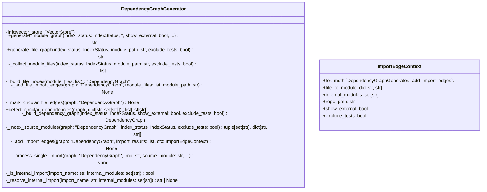

# File Overview

This module provides a dedicated `DependencyGraphGenerator` class for generating Mermaid dependency graphs showing module and file interdependencies within a codebase. It integrates with the vector store to analyze import statements and detect circular dependencies. The module is designed to support visualization of both internal module dependencies and external package dependencies, with the ability to exclude test files and control the display of external dependencies.

The primary responsibility of this file is to transform indexed code chunks into structured dependency graphs, and then render these graphs as Mermaid diagrams for documentation generation. It handles both high-level module graphs and granular file-level graphs within specific modules.

# Key Concepts

## Dependency Graph Construction

The core abstraction is the [`DependencyGraph`](dependency_graph_data.md) class, which represents a directed graph of module dependencies. This graph structure allows for efficient detection of cycles using depth-first search (DFS) algorithms, which are implemented in the [`find_circular_dependencies`](dependency_graph_data.md) helper function.

The design rationale for using a graph-based approach is to accurately model the complex interdependencies between modules, where each node represents a module and each edge represents an import relationship. This enables both visualization and analysis of dependency structures.

## Import Parsing and Resolution

The `_parse_imports` function uses language-specific regular expressions defined in `IMPORT_PATTERNS` to extract import statements from code content. This approach allows the system to support multiple programming languages while maintaining consistent parsing behavior.

The `_is_internal_import` and `_resolve_internal_import` methods implement sophisticated logic to determine whether an import refers to an internal module. This logic considers project name prefixes, module name suffixes, and exact matches to correctly categorize imports as internal or external.

## Circular Dependency Detection

The system implements a robust circular dependency detection mechanism using DFS traversal of the adjacency list representation of the dependency graph. The `_normalize_cycle` function ensures that detected cycles are consistently formatted for comparison and display.

## Visualization and Rendering

The rendering logic separates internal and external dependencies into distinct Mermaid subgraphs, with special styling for circular dependencies. The `_render_module_graph` and `_render_file_graph` functions provide different levels of granularity for visualization, allowing users to examine either the module-level structure or the file-level details within specific modules.

# Integration

This module integrates with the core indexing and vector store infrastructure through the [`VectorStore`](../../core/vectorstore/store.md) dependency. It relies on the [`IndexStatus`](../../models/wiki.md) model to access file information and uses the `ChunkType.IMPORT` to search for import-related code chunks.

The `DependencyGraphGenerator` is used by the `DependencyGraphGenerator` class in `test_dependency_graph_core`, which suggests it's part of the testing infrastructure for dependency graph generation. It also integrates with visualization components through the `_render_edges` function, which is called by `viz`.

The module imports from `dependency_graph_data` which provides the core graph data structures and helper functions for dependency analysis. This separation of concerns allows the core graph generation logic to remain focused on building and analyzing dependencies while delegating the data structure definitions to a separate module.

# Design Notes

## Trade-offs and Considerations

The design chooses to use a two-phase approach for graph building: first indexing source modules and then processing import statements. This separation allows for better performance by avoiding redundant processing and enables clear distinction between internal and external dependencies.

The system handles external dependencies by grouping them into a separate subgraph, which improves readability of the diagram by reducing visual clutter from numerous external package references.

## Edge Cases Handled

The implementation properly handles:
- Test file exclusion via `_is_test_path` filtering
- Module name resolution that accounts for project name prefixes
- Circular dependency detection with normalized cycle representation
- External dependency grouping with configurable maximum display count
- File path to wiki path conversion for navigation links

## Non-Obvious Implementation Choices

The use of `ImportEdgeContext` as an immutable data structure for passing parameters to the import edge processing functions helps maintain clean separation of concerns and prevents accidental mutation of shared state during graph construction.

The decision to use Mermaid's `-.->` syntax for circular dependencies and to apply specific styling rules to these edges makes the visualization immediately clear to readers about which dependencies form cycles that should be addressed.

The system includes a limit on external dependencies (`max_external`) to prevent overwhelming visual complexity in large projects with many external dependencies.

The `_render_module_graph` function groups modules by top-level package names to create a more organized visual structure, making large dependency graphs more readable.

## API Reference

### class `ImportEdgeContext`

Immutable context for adding import edges to a dependency graph.  Bundles the mutable graph, lookup structures, and configuration flags for :meth:`DependencyGraphGenerator._add_import_edges`.


<details>
<summary>View Source (lines 415-426) | <a href="https://github.com/UrbanDiver/local-deepwiki-mcp/blob/main/src/local_deepwiki/generators/analysis/dependency_graph.py#L415-L426">GitHub</a></summary>

```python
class ImportEdgeContext:
    """Immutable context for adding import edges to a dependency graph.

    Bundles the mutable graph, lookup structures, and configuration flags
    for :meth:`DependencyGraphGenerator._add_import_edges`.
    """

    file_to_module: dict[str, str]
    internal_modules: set[str]
    repo_path: str
    show_external: bool
    exclude_tests: bool
```

</details>

### class `DependencyGraphGenerator`

Generator for module and file dependency graphs.  This class analyzes code imports from indexed chunks and generates Mermaid diagrams showing module interdependencies, including detection of circular dependencies.

**Methods:**


<details>
<summary>View Source (lines 429-782) | <a href="https://github.com/UrbanDiver/local-deepwiki-mcp/blob/main/src/local_deepwiki/generators/analysis/dependency_graph.py#L429-L782">GitHub</a></summary>

```python
class DependencyGraphGenerator:
    # Methods: __init__, generate_module_graph, generate_file_graph, _collect_module_files, _build_file_nodes, _add_file_import_edges, _mark_circular_file_edges, detect_circular_dependencies, _build_dependency_graph, _index_source_modules, _add_import_edges, _process_single_import, _is_internal_import, _resolve_internal_import
```

</details>

#### `__init__`

```python
def __init__(vector_store: "VectorStore")
```

Initialize the dependency graph generator.


| Parameter | Type | Default | Description |
|-----------|------|---------|-------------|
| `vector_store` | `"VectorStore"` | - | Vector store with indexed code chunks. |


<details>
<summary>View Source (lines 447-454) | <a href="https://github.com/UrbanDiver/local-deepwiki-mcp/blob/main/src/local_deepwiki/generators/analysis/dependency_graph.py#L447-L454">GitHub</a></summary>

```python
def __init__(self, vector_store: "VectorStore"):
        """Initialize the dependency graph generator.

        Args:
            vector_store: Vector store with indexed code chunks.
        """
        self._store = vector_store
        self._project_name: str = ""
```

</details>

#### `generate_module_graph`

```python
async def generate_module_graph(index_status: IndexStatus, show_external: bool = False, max_external: int = 10, exclude_tests: bool = True, wiki_base_path: str = "") -> str
```

Generate Mermaid graph of module dependencies.


| Parameter | Type | Default | Description |
|-----------|------|---------|-------------|
| `index_status` | `IndexStatus` | - | Index status with file information. |
| `show_external` | `bool` | `False` | Whether to show external dependencies. |
| `max_external` | `int` | `10` | Maximum external dependencies to show. |
| `exclude_tests` | `bool` | `True` | Whether to exclude test modules. |
| `wiki_base_path` | `str` | `""` | Base path for wiki links. |


<details>
<summary>View Source (lines 456-507) | <a href="https://github.com/UrbanDiver/local-deepwiki-mcp/blob/main/src/local_deepwiki/generators/analysis/dependency_graph.py#L456-L507">GitHub</a></summary>

```python
async def generate_module_graph(
        self,
        index_status: IndexStatus,
        *,
        show_external: bool = False,
        max_external: int = 10,
        exclude_tests: bool = True,
        wiki_base_path: str = "",
    ) -> str:
        """Generate Mermaid graph of module dependencies.

        Args:
            index_status: Index status with file information.
            show_external: Whether to show external dependencies.
            max_external: Maximum external dependencies to show.
            exclude_tests: Whether to exclude test modules.
            wiki_base_path: Base path for wiki links.

        Returns:
            Mermaid flowchart markdown string showing module dependencies.
        """
        # Extract project name from repo path
        self._project_name = Path(index_status.repo_path).name.lower().replace("-", "_")

        # Build the dependency graph
        graph = await self._build_dependency_graph(
            index_status=index_status,
            show_external=show_external,
            exclude_tests=exclude_tests,
        )

        if not graph.nodes:
            return _generate_empty_graph_message("No module dependencies found.")

        # Detect circular dependencies
        graph.cycles = self.detect_circular_dependencies(graph.get_adjacency_list())

        # Mark circular edges
        circular_edges = _get_circular_edges(graph.cycles)
        for edge_key in circular_edges:
            if edge_key in graph.edges:
                graph.edges[edge_key] = dataclasses.replace(
                    graph.edges[edge_key], is_circular=True
                )

        # Generate Mermaid diagram
        return _render_module_graph(
            graph=graph,
            show_external=show_external,
            max_external=max_external,
            wiki_base_path=wiki_base_path,
        )
```

</details>

#### `generate_file_graph`

```python
async def generate_file_graph(index_status: IndexStatus, module_path: str, exclude_tests: bool = True) -> str
```

Generate Mermaid graph for files within a module.


| Parameter | Type | Default | Description |
|-----------|------|---------|-------------|
| `index_status` | `IndexStatus` | - | Index status with file information. |
| `module_path` | `str` | - | Module/directory path to show files for. |
| `exclude_tests` | `bool` | `True` | Whether to exclude test files. |


<details>
<summary>View Source (lines 509-538) | <a href="https://github.com/UrbanDiver/local-deepwiki-mcp/blob/main/src/local_deepwiki/generators/analysis/dependency_graph.py#L509-L538">GitHub</a></summary>

```python
async def generate_file_graph(
        self,
        index_status: IndexStatus,
        module_path: str,
        exclude_tests: bool = True,
    ) -> str:
        """Generate Mermaid graph for files within a module.

        Args:
            index_status: Index status with file information.
            module_path: Module/directory path to show files for.
            exclude_tests: Whether to exclude test files.

        Returns:
            Mermaid flowchart markdown string showing file dependencies.
        """
        self._project_name = Path(index_status.repo_path).name.lower().replace("-", "_")

        module_files = self._collect_module_files(
            index_status, module_path, exclude_tests
        )
        if not module_files:
            return _generate_empty_graph_message(
                f"No files found in module: {module_path}"
            )

        graph = self._build_file_nodes(module_files)
        await self._add_file_import_edges(graph, module_files, module_path)
        self._mark_circular_file_edges(graph)
        return _render_file_graph(graph, module_path)
```

</details>

#### `detect_circular_dependencies`

```python
def detect_circular_dependencies(graph: dict[str, set[str]]) -> list[list[str]]
```

Find all circular dependency cycles using DFS.  Delegates to the standalone `[`find_circular_dependencies`](dependency_graph_data.md)` helper.


| Parameter | Type | Default | Description |
|-----------|------|---------|-------------|
| `graph` | `dict[str, set[str]]` | - | Adjacency list mapping module to its dependencies. |


---


<details>
<summary>View Source (lines 607-620) | <a href="https://github.com/UrbanDiver/local-deepwiki-mcp/blob/main/src/local_deepwiki/generators/analysis/dependency_graph.py#L607-L620">GitHub</a></summary>

```python
def detect_circular_dependencies(
        self, graph: dict[str, set[str]]
    ) -> list[list[str]]:
        """Find all circular dependency cycles using DFS.

        Delegates to the standalone ``find_circular_dependencies`` helper.

        Args:
            graph: Adjacency list mapping module to its dependencies.

        Returns:
            List of cycles, where each cycle is a list of module names.
        """
        return find_circular_dependencies(graph)
```

</details>

### Functions

#### `generate_dependency_graph_page`

```python
async def generate_dependency_graph_page(index_status: IndexStatus, vector_store: "VectorStore", show_external: bool = True, max_external: int = 10, wiki_base_path: str = "files/") -> str
```

Generate a complete dependency graph wiki page.


| Parameter | Type | Default | Description |
|-----------|------|---------|-------------|
| `index_status` | `IndexStatus` | - | Index status with file information. |
| `vector_store` | `"VectorStore"` | - | Vector store with indexed chunks. |
| `show_external` | `bool` | `True` | Whether to show external dependencies. |
| `max_external` | `int` | `10` | Maximum external dependencies to show. |
| `wiki_base_path` | `str` | `"files/"` | Base path for wiki links. |

**Returns:** `str`


<details>
<summary>View Source (lines 785-852) | <a href="https://github.com/UrbanDiver/local-deepwiki-mcp/blob/main/src/local_deepwiki/generators/analysis/dependency_graph.py#L785-L852">GitHub</a></summary>

```python
async def generate_dependency_graph_page(
    index_status: IndexStatus,
    vector_store: "VectorStore",
    *,
    show_external: bool = True,
    max_external: int = 10,
    wiki_base_path: str = "files/",
) -> str:
    """Generate a complete dependency graph wiki page.

    Args:
        index_status: Index status with file information.
        vector_store: Vector store with indexed chunks.
        show_external: Whether to show external dependencies.
        max_external: Maximum external dependencies to show.
        wiki_base_path: Base path for wiki links.

    Returns:
        Markdown content for the dependency graph page.
    """
    generator = DependencyGraphGenerator(vector_store)

    module_graph = await generator.generate_module_graph(
        index_status=index_status,
        show_external=show_external,
        max_external=max_external,
        wiki_base_path=wiki_base_path,
    )

    content_parts = [
        "# Dependency Graph",
        "",
        "This page shows the module dependencies within the codebase.",
        "",
        "## Module Dependencies",
        "",
        "The following diagram shows how modules depend on each other. "
        "Click on a module to view its documentation.",
        "",
        module_graph,
        "",
    ]

    content_parts.extend(
        [
            "## Legend",
            "",
            "- **Solid arrows**: Internal module dependencies",
            "- **Dashed arrows**: External dependencies",
            "- **Red dashed arrows**: Circular dependencies (should be addressed)",
            "- **Numbers on arrows**: Number of import statements",
            "",
        ]
    )

    content_parts.extend(
        [
            "## Best Practices",
            "",
            "- Avoid circular dependencies as they can lead to import errors and make "
            "the codebase harder to understand",
            "- Consider using dependency injection or interfaces to break cycles",
            "- External dependencies are grouped separately for clarity",
            "",
        ]
    )

    return "\n".join(content_parts)
```

</details>

## Class Diagram



## Call Graph

```mermaid
flowchart TD
    N0[DependencyGraph]
    N1[DependencyGraphGenerator._a...]
    N2[DependencyGraphGenerator._a...]
    N3[DependencyGraphGenerator._b...]
    N4[DependencyGraphGenerator._b...]
    N5[DependencyGraphGenerator._i...]
    N6[DependencyGraphGenerator._m...]
    N7[DependencyGraphGenerator._p...]
    N8[DependencyGraphGenerator.ge...]
    N9[DependencyGraphGenerator.ge...]
    N10[DependencyNode]
    N11[Path]
    N12[_file_path_to_wiki_path]
    N13[_generate_empty_graph_message]
    N14[_get_circular_edges]
    N15[_is_test_path]
    N16[_parse_imports]
    N17[_render_click_handlers]
    N18[_render_edges]
    N19[_render_file_graph]
    N20[_render_module_graph]
    N21[_render_subgraphs]
    N22[_sanitize_mermaid_name]
    N23[add]
    N24[add_edge]
    N25[add_node]
    N26[detect_circular_dependencies]
    N27[generate_dependency_graph_page]
    N28[get_adjacency_list]
    N29[search]
    N14 --> N23
    N16 --> N29
    N12 --> N11
    N19 --> N22
    N21 --> N22
    N18 --> N10
    N17 --> N12
    N20 --> N21
    N20 --> N18
    N20 --> N17
    N9 --> N11
    N9 --> N13
    N9 --> N26
    N9 --> N28
    N9 --> N14
    N9 --> N20
    N8 --> N11
    N8 --> N13
    N8 --> N19
    N4 --> N0
    N4 --> N11
    N4 --> N25
    N4 --> N10
    N4 --> N15
    N1 --> N29
    N1 --> N11
    N1 --> N16
    N1 --> N24
    N6 --> N26
    N6 --> N28
    N6 --> N14
    N3 --> N0
    N3 --> N29
    N5 --> N15
    N5 --> N23
    N5 --> N25
    N5 --> N10
    N2 --> N15
    N2 --> N25
    N2 --> N10
    N2 --> N23
    N2 --> N16
    N7 --> N24
    N7 --> N25
    N7 --> N10
    classDef func fill:#e1f5fe
    class N0,N10,N11,N12,N13,N14,N15,N16,N17,N18,N19,N20,N21,N22,N23,N24,N25,N26,N27,N28,N29 func
    classDef method fill:#fff3e0
    class N1,N2,N3,N4,N5,N6,N7,N8,N9 method
```



## Used By

Functions and methods in this file and their callers:

- **[`DependencyGraph`](dependency_graph_data.md)**: called by `DependencyGraphGenerator._build_dependency_graph`, `DependencyGraphGenerator._build_file_nodes`
- **`DependencyGraphGenerator`**: called by `generate_dependency_graph_page`
- **[`DependencyNode`](dependency_graph_data.md)**: called by `DependencyGraphGenerator._add_import_edges`, `DependencyGraphGenerator._build_file_nodes`, `DependencyGraphGenerator._index_source_modules`, `DependencyGraphGenerator._process_single_import`, `_render_edges`
- **`ImportEdgeContext`**: called by `DependencyGraphGenerator._build_dependency_graph`
- **`Path`**: called by `DependencyGraphGenerator._add_file_import_edges`, `DependencyGraphGenerator._build_file_nodes`, `DependencyGraphGenerator.generate_file_graph`, `DependencyGraphGenerator.generate_module_graph`, `_file_path_to_wiki_path`
- **`_add_file_import_edges`**: called by `DependencyGraphGenerator.generate_file_graph`
- **`_add_import_edges`**: called by `DependencyGraphGenerator._build_dependency_graph`
- **`_build_dependency_graph`**: called by `DependencyGraphGenerator.generate_module_graph`
- **`_build_file_nodes`**: called by `DependencyGraphGenerator.generate_file_graph`
- **`_collect_module_files`**: called by `DependencyGraphGenerator.generate_file_graph`
- **`_extract_module_name`**: called by `DependencyGraphGenerator._add_import_edges`, `DependencyGraphGenerator._index_source_modules`
- **`_file_path_to_wiki_path`**: called by `_render_click_handlers`
- **`_generate_empty_graph_message`**: called by `DependencyGraphGenerator.generate_file_graph`, `DependencyGraphGenerator.generate_module_graph`
- **`_get_circular_edges`**: called by `DependencyGraphGenerator._mark_circular_file_edges`, `DependencyGraphGenerator.generate_module_graph`
- **`_index_source_modules`**: called by `DependencyGraphGenerator._build_dependency_graph`
- **`_is_internal_import`**: called by `DependencyGraphGenerator._process_single_import`
- **`_is_test_path`**: called by `DependencyGraphGenerator._add_import_edges`, `DependencyGraphGenerator._build_file_nodes`, `DependencyGraphGenerator._collect_module_files`, `DependencyGraphGenerator._index_source_modules`
- **`_mark_circular_file_edges`**: called by `DependencyGraphGenerator.generate_file_graph`
- **`_parse_imports`**: called by `DependencyGraphGenerator._add_file_import_edges`, `DependencyGraphGenerator._add_import_edges`
- **`_process_single_import`**: called by `DependencyGraphGenerator._add_import_edges`
- **`_render_click_handlers`**: called by `_render_module_graph`
- **`_render_cycle_warnings`**: called by `_render_module_graph`
- **`_render_edges`**: called by `_render_module_graph`
- **`_render_external_subgraph`**: called by `_render_module_graph`
- **`_render_file_graph`**: called by `DependencyGraphGenerator.generate_file_graph`
- **`_render_module_graph`**: called by `DependencyGraphGenerator.generate_module_graph`
- **`_render_styling`**: called by `_render_module_graph`
- **`_render_subgraphs`**: called by `_render_module_graph`
- **`_resolve_internal_import`**: called by `DependencyGraphGenerator._process_single_import`
- **`_sanitize_mermaid_name`**: called by `_render_file_graph`, `_render_subgraphs`
- **`add`**: called by `DependencyGraphGenerator._add_import_edges`, `DependencyGraphGenerator._index_source_modules`, `_get_circular_edges`
- **`add_edge`**: called by `DependencyGraphGenerator._add_file_import_edges`, `DependencyGraphGenerator._process_single_import`
- **`add_node`**: called by `DependencyGraphGenerator._add_import_edges`, `DependencyGraphGenerator._build_file_nodes`, `DependencyGraphGenerator._index_source_modules`, `DependencyGraphGenerator._process_single_import`
- **`defaultdict`**: called by `_render_module_graph`
- **`detect_circular_dependencies`**: called by `DependencyGraphGenerator._mark_circular_file_edges`, `DependencyGraphGenerator.generate_module_graph`
- **[`find_circular_dependencies`](dependency_graph_data.md)**: called by `DependencyGraphGenerator.detect_circular_dependencies`
- **`generate_module_graph`**: called by `generate_dependency_graph_page`
- **`get_adjacency_list`**: called by `DependencyGraphGenerator._mark_circular_file_edges`, `DependencyGraphGenerator.generate_module_graph`
- **`group`**: called by `_parse_imports`
- **`search`**: called by `DependencyGraphGenerator._add_file_import_edges`, `DependencyGraphGenerator._build_dependency_graph`, `_parse_imports`
- **`title`**: called by `_render_subgraphs`
- **`with_suffix`**: called by `_file_path_to_wiki_path`

## Usage Examples

*Examples extracted from test files*

### Test that generate_module_graph produces Mermaid output

From `test_dependency_graph_core.py::TestDependencyGraphGenerator::test_generate_module_graph_creates_mermaid`:

```python
generator = DependencyGraphGenerator(mock_vector_store)
result = await generator.generate_module_graph(sample_index_status)
assert "```mermaid" in result
assert "flowchart" in result
assert "```" in result
```

### Test that generate_module_graph produces Mermaid output

From `test_dependency_graph_core.py::TestDependencyGraphGenerator::test_generate_module_graph_creates_mermaid`:

```python
generator = DependencyGraphGenerator(mock_vector_store)
result = await generator.generate_module_graph(sample_index_status)
assert "```mermaid" in result
assert "flowchart" in result
assert "```" in result
```

### Test that generate_module_graph shows nodes

From `test_dependency_graph_core.py::TestDependencyGraphGenerator::test_generate_module_graph_shows_nodes`:

```python
generator = DependencyGraphGenerator(mock_vector_store)
result = await generator.generate_module_graph(sample_index_status)
# Should have subgraphs for the modules
assert "subgraph" in result
```

### Test that generate_module_graph shows nodes

From `test_dependency_graph_core.py::TestDependencyGraphGenerator::test_generate_module_graph_shows_nodes`:

```python
generator = DependencyGraphGenerator(mock_vector_store)
result = await generator.generate_module_graph(sample_index_status)
# Should have subgraphs for the modules
assert "subgraph" in result
```

### Test basic file graph generation

From `test_dependency_graph_core.py::TestDependencyGraphGenerator::test_generate_file_graph_basic`:

```python
result = await generator.generate_file_graph(
    sample_index_status,
    module_path="core",
)
assert "```mermaid" in result
assert "flowchart" in result
```


## Last Modified

| Entity | Type | Author | Date | Commit |
|--------|------|--------|------|--------|
| `ImportEdgeContext` | class | Brian Breidenbach | yesterday | `1eef062` refactor: complete Grade A ... |
| `DependencyGraphGenerator` | class | Brian Breidenbach | yesterday | `1eef062` refactor: complete Grade A ... |
| `_build_dependency_graph` | method | Brian Breidenbach | yesterday | `1eef062` refactor: complete Grade A ... |
| `_add_import_edges` | method | Brian Breidenbach | yesterday | `1eef062` refactor: complete Grade A ... |
| `generate_file_graph` | method | Brian Breidenbach | 2 days ago | `1a11306` refactor: decompose CC > 15... |
| `_collect_module_files` | method | Brian Breidenbach | 2 days ago | `1a11306` refactor: decompose CC > 15... |
| `_build_file_nodes` | method | Brian Breidenbach | 2 days ago | `1a11306` refactor: decompose CC > 15... |
| `_add_file_import_edges` | method | Brian Breidenbach | 2 days ago | `1a11306` refactor: decompose CC > 15... |
| `_mark_circular_file_edges` | method | Brian Breidenbach | 2 days ago | `1a11306` refactor: decompose CC > 15... |
| `_index_source_modules` | method | Brian Breidenbach | 2 days ago | `1a11306` refactor: decompose CC > 15... |
| `_process_single_import` | method | Brian Breidenbach | 2 days ago | `1a11306` refactor: decompose CC > 15... |
| `_render_subgraphs` | function | Brian Breidenbach | 1 week ago | `bc3c92e` refactor: reduce cyclomatic... |
| `_render_external_subgraph` | function | Brian Breidenbach | 1 week ago | `bc3c92e` refactor: reduce cyclomatic... |
| `_render_edges` | function | Brian Breidenbach | 1 week ago | `bc3c92e` refactor: reduce cyclomatic... |
| `_render_click_handlers` | function | Brian Breidenbach | 1 week ago | `bc3c92e` refactor: reduce cyclomatic... |
| `_render_styling` | function | Brian Breidenbach | 1 week ago | `bc3c92e` refactor: reduce cyclomatic... |
| `_render_cycle_warnings` | function | Brian Breidenbach | 1 week ago | `bc3c92e` refactor: reduce cyclomatic... |
| `_render_module_graph` | function | Brian Breidenbach | 1 week ago | `bc3c92e` refactor: reduce cyclomatic... |
| `generate_module_graph` | method | Brian Breidenbach | 1 week ago | `eaee4de` refactor: extract Dependenc... |
| `_normalize_cycle` | function | Brian Breidenbach | 1 week ago | `eaee4de` refactor: extract Dependenc... |
| `_get_circular_edges` | function | Brian Breidenbach | 1 week ago | `eaee4de` refactor: extract Dependenc... |
| `_parse_imports` | function | Brian Breidenbach | 1 week ago | `eaee4de` refactor: extract Dependenc... |
| `_file_path_to_wiki_path` | function | Brian Breidenbach | 1 week ago | `eaee4de` refactor: extract Dependenc... |
| `_generate_empty_graph_message` | function | Brian Breidenbach | 1 week ago | `eaee4de` refactor: extract Dependenc... |
| `_render_file_graph` | function | Brian Breidenbach | 1 week ago | `eaee4de` refactor: extract Dependenc... |
| `detect_circular_dependencies` | method | Brian Breidenbach | 1 week ago | `fd8bb32` fix: code quality — consoli... |
| `generate_dependency_graph_page` | function | Brian Breidenbach | Feb 20, 2026 | `8182b15` refactor: Pythonic API impr... |
| `_resolve_internal_import` | method | Brian Breidenbach | Feb 20, 2026 | `fab1690` refactor: low-priority Pyth... |
| `__init__` | method | Brian Breidenbach | Jan 26, 2026 | `a64166a` Add seven medium-priority e... |
| `_is_internal_import` | method | Brian Breidenbach | Jan 26, 2026 | `a64166a` Add seven medium-priority e... |

## Additional Source Code

Source code for functions and methods not listed in the API Reference above.

#### `_normalize_cycle`

<details>
<summary>View Source (lines 42-62) | <a href="https://github.com/UrbanDiver/local-deepwiki-mcp/blob/main/src/local_deepwiki/generators/analysis/dependency_graph.py#L42-L62">GitHub</a></summary>

```python
def _normalize_cycle(cycle: list[str]) -> list[str]:
    """Normalize a cycle for consistent comparison.

    Rotates the cycle so that the smallest element is first.

    Args:
        cycle: List of nodes forming a cycle.

    Returns:
        Normalized cycle list.
    """
    if len(cycle) <= 1:
        return cycle

    # Remove the duplicate last element if present
    if cycle[0] == cycle[-1] and len(cycle) > 1:
        cycle = cycle[:-1]

    # Find the minimum element and rotate
    min_idx = cycle.index(min(cycle))
    return cycle[min_idx:] + cycle[:min_idx]
```

</details>


#### `_get_circular_edges`

<details>
<summary>View Source (lines 65-79) | <a href="https://github.com/UrbanDiver/local-deepwiki-mcp/blob/main/src/local_deepwiki/generators/analysis/dependency_graph.py#L65-L79">GitHub</a></summary>

```python
def _get_circular_edges(cycles: list[list[str]]) -> set[tuple[str, str]]:
    """Extract edges that are part of circular dependencies.

    Args:
        cycles: List of detected cycles.

    Returns:
        Set of (source, target) tuples that form cycles.
    """
    edges: set[tuple[str, str]] = set()
    for cycle in cycles:
        rotated = cycle[1:] + cycle[:1]
        for source, target in zip(cycle, rotated):
            edges.add((source, target))
    return edges
```

</details>


#### `_parse_imports`

<details>
<summary>View Source (lines 82-108) | <a href="https://github.com/UrbanDiver/local-deepwiki-mcp/blob/main/src/local_deepwiki/generators/analysis/dependency_graph.py#L82-L108">GitHub</a></summary>

```python
def _parse_imports(content: str, language: str) -> list[str]:
    """Parse import statements from code content.

    Args:
        content: Code content with import statements.
        language: Programming language.

    Returns:
        List of imported module names.
    """
    imports: list[str] = []

    # Get patterns for this language
    patterns = IMPORT_PATTERNS.get(language, IMPORT_PATTERNS.get("python", []))

    for line in content.split("\n"):
        line = line.strip()
        if not line:
            continue

        for pattern in patterns:
            match = pattern.search(line)
            if match:
                imports.append(match.group(1))
                break

    return imports
```

</details>


#### `_file_path_to_wiki_path`

<details>
<summary>View Source (lines 111-122) | <a href="https://github.com/UrbanDiver/local-deepwiki-mcp/blob/main/src/local_deepwiki/generators/analysis/dependency_graph.py#L111-L122">GitHub</a></summary>

```python
def _file_path_to_wiki_path(file_path: str) -> str:
    """Convert a file path to its wiki page path.

    Args:
        file_path: Source file path.

    Returns:
        Wiki page path.
    """
    path = Path(file_path)
    wiki_path = str(path.with_suffix(".md"))
    return f"files/{wiki_path}"
```

</details>


#### `_generate_empty_graph_message`

<details>
<summary>View Source (lines 125-134) | <a href="https://github.com/UrbanDiver/local-deepwiki-mcp/blob/main/src/local_deepwiki/generators/analysis/dependency_graph.py#L125-L134">GitHub</a></summary>

```python
def _generate_empty_graph_message(message: str) -> str:
    """Generate a placeholder for empty graphs.

    Args:
        message: Message to display.

    Returns:
        Mermaid diagram with placeholder message.
    """
    return f"```mermaid\nflowchart TD\n    A[{message}]\n```"
```

</details>


#### `_render_file_graph`

<details>
<summary>View Source (lines 137-191) | <a href="https://github.com/UrbanDiver/local-deepwiki-mcp/blob/main/src/local_deepwiki/generators/analysis/dependency_graph.py#L137-L191">GitHub</a></summary>

```python
def _render_file_graph(graph: DependencyGraph, module_path: str) -> str:
    """Render the file dependency graph as Mermaid markdown.

    Args:
        graph: The dependency graph to render.
        module_path: Module path being visualized.

    Returns:
        Mermaid flowchart markdown string.
    """
    lines = ["```mermaid", "flowchart TD"]
    lines.append(f"    subgraph {_sanitize_mermaid_name(module_path)}[{module_path}]")

    # Create node ID mapping
    node_ids: dict[str, str] = {}
    for i, (name, _node) in enumerate(sorted(graph.nodes.items())):
        node_id = f"F{i}"
        node_ids[name] = node_id
        lines.append(f"        {node_id}[{name}]")

    lines.append("    end")

    # Add edges
    link_idx = 0
    circular_link_indices: list[int] = []

    for (source, target), edge in sorted(graph.edges.items()):
        source_id = node_ids.get(source)
        target_id = node_ids.get(target)

        if source_id and target_id:
            if edge.is_circular:
                lines.append(f"    {source_id} -.->|circular| {target_id}")
                circular_link_indices.append(link_idx)
            else:
                lines.append(f"    {source_id} --> {target_id}")
            link_idx += 1

    # Add circular styling
    if circular_link_indices:
        lines.append("    linkStyle default stroke:#666")
        for idx in circular_link_indices:
            lines.append(f"    linkStyle {idx} stroke:#f00,stroke-width:2px")

    lines.append("```")

    # Add cycle warnings
    if graph.cycles:
        lines.append("")
        lines.append("**Warning: Circular dependencies detected!**")
        for cycle in graph.cycles[:3]:
            cycle_str = " -> ".join(cycle) + " -> " + cycle[0]
            lines.append(f"- `{cycle_str}`")

    return "\n".join(lines)
```

</details>


#### `_render_subgraphs`

<details>
<summary>View Source (lines 194-221) | <a href="https://github.com/UrbanDiver/local-deepwiki-mcp/blob/main/src/local_deepwiki/generators/analysis/dependency_graph.py#L194-L221">GitHub</a></summary>

```python
def _render_subgraphs(
    groups: dict[str, list[DependencyNode]],
    node_ids: dict[str, str],
    idx: int,
) -> tuple[list[str], int]:
    """Render internal module subgraphs into Mermaid lines.

    Args:
        groups: Mapping of top-level package name to its nodes.
        node_ids: Mutable mapping that will be updated with new node IDs.
        idx: Current node index counter.

    Returns:
        Tuple of (lines, updated_idx).
    """
    lines: list[str] = []
    for group_name, nodes in sorted(groups.items()):
        safe_group = _sanitize_mermaid_name(group_name)
        display_name = group_name.replace("_", " ").title()
        lines.append(f"    subgraph {safe_group}[{display_name}]")
        for node in sorted(nodes, key=lambda n: n.name):
            node_id = f"M{idx}"
            node_ids[node.name] = node_id
            idx += 1
            display = node.name.split(".")[-1]
            lines.append(f"        {node_id}[{display}]")
        lines.append("    end")
    return lines, idx
```

</details>


#### `_render_external_subgraph`

<details>
<summary>View Source (lines 224-250) | <a href="https://github.com/UrbanDiver/local-deepwiki-mcp/blob/main/src/local_deepwiki/generators/analysis/dependency_graph.py#L224-L250">GitHub</a></summary>

```python
def _render_external_subgraph(
    external_nodes: list[DependencyNode],
    max_external: int,
    node_ids: dict[str, str],
    idx: int,
) -> tuple[list[str], int]:
    """Render the external dependencies subgraph into Mermaid lines.

    Args:
        external_nodes: List of external dependency nodes.
        max_external: Maximum number of external nodes to show.
        node_ids: Mutable mapping that will be updated with new node IDs.
        idx: Current node index counter.

    Returns:
        Tuple of (lines, updated_idx).
    """
    lines: list[str] = []
    ext_nodes_to_show = sorted(external_nodes, key=lambda n: n.name)[:max_external]
    lines.append("    subgraph external[External Dependencies]")
    for node in ext_nodes_to_show:
        node_id = f"E{idx}"
        node_ids[node.name] = node_id
        idx += 1
        lines.append(f"        {node_id}([{node.name}]):::external")
    lines.append("    end")
    return lines, idx
```

</details>


#### `_render_edges`

<details>
<summary>View Source (lines 253-290) | <a href="https://github.com/UrbanDiver/local-deepwiki-mcp/blob/main/src/local_deepwiki/generators/analysis/dependency_graph.py#L253-L290">GitHub</a></summary>

```python
def _render_edges(
    graph: DependencyGraph,
    node_ids: dict[str, str],
) -> tuple[list[str], list[int]]:
    """Render edge lines for the module dependency graph.

    Args:
        graph: The dependency graph with edges.
        node_ids: Mapping of node name to Mermaid node ID.

    Returns:
        Tuple of (edge_lines, circular_link_indices).
    """
    lines: list[str] = []
    link_idx = 0
    circular_link_indices: list[int] = []

    for (source, target), edge in sorted(graph.edges.items()):
        source_id = node_ids.get(source)
        target_id = node_ids.get(target)
        if not (source_id and target_id and source_id != target_id):
            continue
        if edge.is_circular:
            lines.append(f"    {source_id} -.->|circular| {target_id}")
            circular_link_indices.append(link_idx)
        elif edge.count > 1:
            lines.append(f"    {source_id} -->|{edge.count}| {target_id}")
        else:
            is_ext = graph.nodes.get(
                target, DependencyNode(name="", file_path="")
            ).is_external
            if is_ext:
                lines.append(f"    {source_id} -.-> {target_id}")
            else:
                lines.append(f"    {source_id} --> {target_id}")
        link_idx += 1

    return lines, circular_link_indices
```

</details>


#### `_render_click_handlers`

<details>
<summary>View Source (lines 293-314) | <a href="https://github.com/UrbanDiver/local-deepwiki-mcp/blob/main/src/local_deepwiki/generators/analysis/dependency_graph.py#L293-L314">GitHub</a></summary>

```python
def _render_click_handlers(
    graph: DependencyGraph,
    node_ids: dict[str, str],
    wiki_base_path: str,
) -> list[str]:
    """Render click handler lines for wiki navigation.

    Args:
        graph: The dependency graph with node metadata.
        node_ids: Mapping of node name to Mermaid node ID.
        wiki_base_path: Base path for wiki links.

    Returns:
        List of click handler lines.
    """
    lines: list[str] = []
    for node_name, node_id in sorted(node_ids.items()):
        node = graph.nodes.get(node_name)  # type: ignore[assignment]
        if node and not node.is_external and node.file_path:
            wiki_path = _file_path_to_wiki_path(node.file_path)
            lines.append(f'    click {node_id} "{wiki_base_path}{wiki_path}"')
    return lines
```

</details>


#### `_render_styling`

<details>
<summary>View Source (lines 317-334) | <a href="https://github.com/UrbanDiver/local-deepwiki-mcp/blob/main/src/local_deepwiki/generators/analysis/dependency_graph.py#L317-L334">GitHub</a></summary>

```python
def _render_styling(circular_link_indices: list[int]) -> list[str]:
    """Render class definition and link styling lines.

    Args:
        circular_link_indices: Link indices that should be styled as circular.

    Returns:
        List of styling lines.
    """
    lines: list[str] = [
        "    classDef external fill:#2d2d3d,stroke:#666,stroke-dasharray: 5 5",
        "    classDef circular fill:#ff6b6b,stroke:#c92a2a",
    ]
    if circular_link_indices:
        lines.append("    linkStyle default stroke:#666")
        for idx in circular_link_indices:
            lines.append(f"    linkStyle {idx} stroke:#f00,stroke-width:2px")
    return lines
```

</details>


#### `_render_cycle_warnings`

<details>
<summary>View Source (lines 337-358) | <a href="https://github.com/UrbanDiver/local-deepwiki-mcp/blob/main/src/local_deepwiki/generators/analysis/dependency_graph.py#L337-L358">GitHub</a></summary>

```python
def _render_cycle_warnings(graph: DependencyGraph) -> list[str]:
    """Render circular dependency warning lines appended after the diagram.

    Args:
        graph: The dependency graph with detected cycles.

    Returns:
        List of warning lines (may be empty if no cycles).
    """
    if not graph.cycles:
        return []
    lines: list[str] = [
        "",
        "**Warning: Circular dependencies detected!**",
        "",
    ]
    for i, cycle in enumerate(graph.cycles[:5], 1):
        cycle_str = " -> ".join(cycle) + " -> " + cycle[0]
        lines.append(f"{i}. `{cycle_str}`")
    if len(graph.cycles) > 5:
        lines.append(f"   ... and {len(graph.cycles) - 5} more")
    return lines
```

</details>


#### `_render_module_graph`

<details>
<summary>View Source (lines 361-411) | <a href="https://github.com/UrbanDiver/local-deepwiki-mcp/blob/main/src/local_deepwiki/generators/analysis/dependency_graph.py#L361-L411">GitHub</a></summary>

```python
def _render_module_graph(
    graph: DependencyGraph,
    show_external: bool,
    max_external: int,
    wiki_base_path: str,
) -> str:
    """Render the module dependency graph as Mermaid markdown.

    Args:
        graph: The dependency graph to render.
        show_external: Whether to show external dependencies.
        max_external: Maximum external dependencies to show.
        wiki_base_path: Base path for wiki links.

    Returns:
        Mermaid flowchart markdown string.
    """
    lines = ["```mermaid", "flowchart TD"]

    # Group nodes by top-level package
    groups: dict[str, list[DependencyNode]] = defaultdict(list)
    external_nodes = [node for node in graph.nodes.values() if node.is_external]
    for node in graph.nodes.values():
        if not node.is_external:
            group = node.name.split(".")[0] if "." in node.name else "root"
            groups[group].append(node)

    # Build node ID mapping via subgraph rendering
    node_ids: dict[str, str] = {}
    idx = 0

    subgraph_lines, idx = _render_subgraphs(groups, node_ids, idx)
    lines.extend(subgraph_lines)

    if show_external and external_nodes:
        ext_lines, idx = _render_external_subgraph(
            external_nodes, max_external, node_ids, idx
        )
        lines.extend(ext_lines)

    edge_lines, circular_link_indices = _render_edges(graph, node_ids)
    lines.extend(edge_lines)

    if wiki_base_path:
        lines.extend(_render_click_handlers(graph, node_ids, wiki_base_path))

    lines.extend(_render_styling(circular_link_indices))
    lines.append("```")
    lines.extend(_render_cycle_warnings(graph))

    return "\n".join(lines)
```

</details>


#### `_collect_module_files`

<details>
<summary>View Source (lines 540-554) | <a href="https://github.com/UrbanDiver/local-deepwiki-mcp/blob/main/src/local_deepwiki/generators/analysis/dependency_graph.py#L540-L554">GitHub</a></summary>

```python
def _collect_module_files(
        self,
        index_status: IndexStatus,
        module_path: str,
        exclude_tests: bool,
    ) -> list:
        """Filter index files to those belonging to the specified module."""
        module_files = [
            f
            for f in index_status.files
            if module_path in f.path and f.path.endswith(".py")
        ]
        if exclude_tests:
            module_files = [f for f in module_files if not _is_test_path(f.path)]
        return module_files
```

</details>


#### `_build_file_nodes`

<details>
<summary>View Source (lines 556-568) | <a href="https://github.com/UrbanDiver/local-deepwiki-mcp/blob/main/src/local_deepwiki/generators/analysis/dependency_graph.py#L556-L568">GitHub</a></summary>

```python
def _build_file_nodes(self, module_files: list) -> "DependencyGraph":
        """Create a DependencyGraph populated with nodes for each module file."""
        graph = DependencyGraph()
        for file_info in module_files:
            file_name = Path(file_info.path).stem
            graph.add_node(
                DependencyNode(
                    name=file_name,
                    file_path=file_info.path,
                    is_test=_is_test_path(file_info.path),
                )
            )
        return graph
```

</details>


#### `_add_file_import_edges`

<details>
<summary>View Source (lines 570-595) | <a href="https://github.com/UrbanDiver/local-deepwiki-mcp/blob/main/src/local_deepwiki/generators/analysis/dependency_graph.py#L570-L595">GitHub</a></summary>

```python
async def _add_file_import_edges(
        self,
        graph: "DependencyGraph",
        module_files: list,
        module_path: str,
    ) -> None:
        """Search for intra-module imports and add edges to the graph."""
        search_results = await self._store.search(
            f"import {module_path}",
            limit=100,
            chunk_type="import",
        )
        file_stems = [Path(f.path).stem for f in module_files]
        for result in search_results:
            chunk = result.chunk
            if chunk.chunk_type != ChunkType.IMPORT:
                continue
            source_file = Path(chunk.file_path).stem
            if module_path not in chunk.file_path:
                continue
            imports = _parse_imports(chunk.content, chunk.language.value)
            for imp in imports:
                if module_path in imp or imp in file_stems:
                    target_file = imp.split(".")[-1]
                    if target_file in file_stems:
                        graph.add_edge(source_file, target_file)
```

</details>


#### `_mark_circular_file_edges`

<details>
<summary>View Source (lines 597-605) | <a href="https://github.com/UrbanDiver/local-deepwiki-mcp/blob/main/src/local_deepwiki/generators/analysis/dependency_graph.py#L597-L605">GitHub</a></summary>

```python
def _mark_circular_file_edges(self, graph: "DependencyGraph") -> None:
        """Detect cycles and mark the corresponding edges as circular."""
        graph.cycles = self.detect_circular_dependencies(graph.get_adjacency_list())
        circular_edges = _get_circular_edges(graph.cycles)
        for edge_key in circular_edges:
            if edge_key in graph.edges:
                graph.edges[edge_key] = dataclasses.replace(
                    graph.edges[edge_key], is_circular=True
                )
```

</details>


#### `_build_dependency_graph`

<details>
<summary>View Source (lines 622-655) | <a href="https://github.com/UrbanDiver/local-deepwiki-mcp/blob/main/src/local_deepwiki/generators/analysis/dependency_graph.py#L622-L655">GitHub</a></summary>

```python
async def _build_dependency_graph(
        self,
        index_status: IndexStatus,
        show_external: bool,
        exclude_tests: bool,
    ) -> DependencyGraph:
        """Build dependency graph from indexed chunks.

        Args:
            index_status: Index status with file information.
            show_external: Whether to include external dependencies.
            exclude_tests: Whether to exclude test files.

        Returns:
            Populated DependencyGraph.
        """
        graph = DependencyGraph()
        internal_modules, file_to_module = self._index_source_modules(
            graph, index_status, exclude_tests
        )
        import_results = await self._store.search(
            "import require include from use",
            limit=500,
            chunk_type="import",
        )
        edge_ctx = ImportEdgeContext(
            file_to_module=file_to_module,
            internal_modules=internal_modules,
            repo_path=index_status.repo_path,
            show_external=show_external,
            exclude_tests=exclude_tests,
        )
        self._add_import_edges(graph, import_results, edge_ctx)
        return graph
```

</details>


#### `_index_source_modules`

<details>
<summary>View Source (lines 657-679) | <a href="https://github.com/UrbanDiver/local-deepwiki-mcp/blob/main/src/local_deepwiki/generators/analysis/dependency_graph.py#L657-L679">GitHub</a></summary>

```python
def _index_source_modules(
        self,
        graph: "DependencyGraph",
        index_status: IndexStatus,
        exclude_tests: bool,
    ) -> tuple[set[str], dict[str, str]]:
        """Register all source files as nodes and return module tracking structures."""
        internal_modules: set[str] = set()
        file_to_module: dict[str, str] = {}
        for file_info in index_status.files:
            if exclude_tests and _is_test_path(file_info.path):
                continue
            module_name = _extract_module_name(file_info.path, index_status.repo_path)
            internal_modules.add(module_name)
            file_to_module[file_info.path] = module_name
            graph.add_node(
                DependencyNode(
                    name=module_name,
                    file_path=file_info.path,
                    is_test=_is_test_path(file_info.path),
                )
            )
        return internal_modules, file_to_module
```

</details>


#### `_add_import_edges`

<details>
<summary>View Source (lines 681-705) | <a href="https://github.com/UrbanDiver/local-deepwiki-mcp/blob/main/src/local_deepwiki/generators/analysis/dependency_graph.py#L681-L705">GitHub</a></summary>

```python
def _add_import_edges(
        self,
        graph: "DependencyGraph",
        import_results: list,
        ctx: ImportEdgeContext,
    ) -> None:
        """Parse import chunks and add edges to the dependency graph."""
        for result in import_results:
            chunk = result.chunk
            if chunk.chunk_type != ChunkType.IMPORT:
                continue
            if ctx.exclude_tests and _is_test_path(chunk.file_path):
                continue
            source_module = ctx.file_to_module.get(chunk.file_path)
            if not source_module:
                source_module = _extract_module_name(chunk.file_path, ctx.repo_path)
                graph.add_node(
                    DependencyNode(name=source_module, file_path=chunk.file_path)
                )
                ctx.internal_modules.add(source_module)
            imports = _parse_imports(chunk.content, chunk.language.value)
            for imp in imports:
                self._process_single_import(
                    graph, imp, source_module, ctx.internal_modules, ctx.show_external
                )
```

</details>


#### `_process_single_import`

<details>
<summary>View Source (lines 707-727) | <a href="https://github.com/UrbanDiver/local-deepwiki-mcp/blob/main/src/local_deepwiki/generators/analysis/dependency_graph.py#L707-L727">GitHub</a></summary>

```python
def _process_single_import(
        self,
        graph: "DependencyGraph",
        imp: str,
        source_module: str,
        internal_modules: set[str],
        show_external: bool,
    ) -> None:
        """Add a single import as an internal or external edge."""
        if self._is_internal_import(imp, internal_modules):
            target_module = self._resolve_internal_import(imp, internal_modules)
            if target_module and target_module != source_module:
                graph.add_edge(source_module, target_module)
        elif show_external:
            ext_name = imp.split(".")[0]
            if ext_name and not ext_name.startswith("_"):
                if ext_name not in graph.nodes:
                    graph.add_node(
                        DependencyNode(name=ext_name, file_path="", is_external=True)
                    )
                graph.add_edge(source_module, ext_name)
```

</details>


#### `_is_internal_import`

<details>
<summary>View Source (lines 729-753) | <a href="https://github.com/UrbanDiver/local-deepwiki-mcp/blob/main/src/local_deepwiki/generators/analysis/dependency_graph.py#L729-L753">GitHub</a></summary>

```python
def _is_internal_import(self, import_name: str, internal_modules: set[str]) -> bool:
        """Check if an import refers to an internal module.

        Args:
            import_name: Import module name.
            internal_modules: Set of known internal module names.

        Returns:
            True if the import is internal.
        """
        if import_name in internal_modules:
            return True

        if self._project_name and import_name.startswith(self._project_name + "."):
            return True

        import_parts = import_name.split(".")
        for module in internal_modules:
            module_parts = module.split(".")
            if import_parts[-1] == module_parts[-1]:
                return True
            if import_name.endswith("." + module):
                return True

        return False
```

</details>


#### `_resolve_internal_import`

<details>
<summary>View Source (lines 755-782) | <a href="https://github.com/UrbanDiver/local-deepwiki-mcp/blob/main/src/local_deepwiki/generators/analysis/dependency_graph.py#L755-L782">GitHub</a></summary>

```python
def _resolve_internal_import(
        self, import_name: str, internal_modules: set[str]
    ) -> str | None:
        """Resolve an import name to an internal module.

        Args:
            import_name: Import module name.
            internal_modules: Set of known internal module names.

        Returns:
            Resolved internal module name, or None if not found.
        """
        if import_name in internal_modules:
            return import_name

        if self._project_name:
            if import_name.startswith(self._project_name + "."):
                stripped = import_name[len(self._project_name) + 1 :]
                if stripped in internal_modules:
                    return stripped

        import_parts = import_name.split(".")
        for module in internal_modules:
            module_parts = module.split(".")
            if import_parts[-1] == module_parts[-1]:
                return module

        return None
```

</details>

## Relevant Source Files

- `src/local_deepwiki/generators/analysis/dependency_graph.py:415-426`
