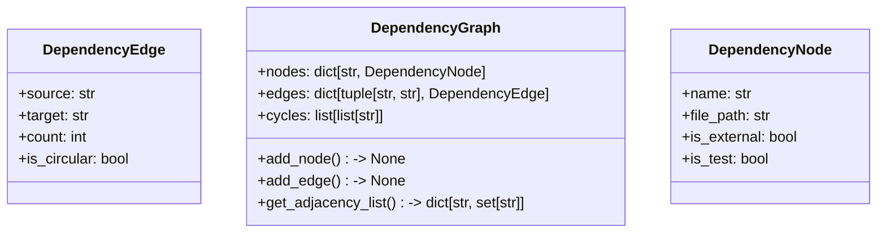
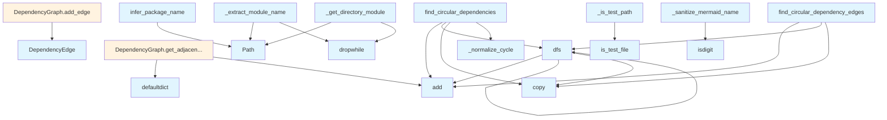

# File: `src/local_deepwiki/generators/analysis/dependency_graph_data.py`

## File Overview

This file defines the core data structures and helper functions used to build and analyze dependency graphs within a Python project. It is designed to support the generation of dependency information, particularly for documentation and visualization purposes. The module provides abstractions for nodes and edges in a dependency graph, utilities for path manipulation and module name extraction, and algorithms for detecting circular dependencies.

The design emphasizes modularity and reusability, enabling integration into various analysis and generation pipelines, especially within the `local_deepwiki` documentation toolchain.

## Key Concepts

### Data Structures

- **DependencyNode**: Represents a module or file in the dependency graph. It holds metadata such as the module name, file path, and flags indicating whether it's external or a test file.
- **DependencyEdge**: Represents a dependency relationship between two modules. It tracks the source and target nodes, the number of times the dependency occurs, and whether it's part of a circular dependency.
- **DependencyGraph**: Encapsulates the entire dependency graph with nodes and edges. It supports operations to add nodes and edges, and to compute an adjacency list representation.

### Algorithms and Utilities

- **Circular Dependency Detection (`find_circular_dependencies`)**: Uses a depth-first search (DFS) approach to detect cycles in the dependency graph. It normalizes cycles to ensure consistent representation.
- **Path Sanitization (`_sanitize_mermaid_name`)**: Ensures that module names are safe for use in Mermaid diagrams by replacing special characters with underscores and prepending a prefix if the name starts with a digit.
- **Module Name Extraction (`_extract_module_name`)**: Converts file paths into Python module names by traversing the directory structure and applying heuristics to strip common root directories.
- **Directory Module Extraction (`_get_directory_module`)**: Identifies the top-level module or directory containing a file, useful for grouping or categorizing dependencies.

### Why These Patterns?

These abstractions and algorithms were chosen to support:
- **Modular dependency analysis** that can be reused across different tools in the documentation pipeline.
- **Robustness in path handling**, especially in complex project structures with nested directories and test files.
- **Visualization readiness**, by sanitizing names for Mermaid diagrams.
- **Detection of problematic dependencies**, such as circular dependencies, which can indicate design issues or tight coupling.

## Integration

This file is a core part of the dependency analysis pipeline in `local_deepwiki`. It is used by:
- The [`DependencyGraphGenerator`](dependency_graph.md) class, which leverages `DependencyNode`, `DependencyEdge`, and `DependencyGraph` to construct and analyze dependency information.
- Various test modules, such as `test_dependency_graph_basics`, which validate the behavior of `DependencyNode`, `DependencyEdge`, and helper functions like `_extract_module_name`, `_get_directory_module`, and `_is_test_path`.

The file imports from:
- [`local_deepwiki.core.path_utils.is_test_file`](source_filter.md): for determining whether a file path corresponds to a test file.
- Standard library modules like `re`, `collections`, `dataclasses`, and `pathlib` for parsing, data handling, and path manipulation.

It is closely related to other modules in the `generators/analysis` directory, such as `api_docs.py`, which may also use dependency information for generating documentation.

## Design Notes

### Circular Dependency Detection

The `find_circular_dependencies` function implements a DFS-based algorithm to detect cycles. It normalizes cycles by rotating them so that the lexicographically smallest element is at the start. This ensures that equivalent cycles are represented consistently.

### Path Handling

The `_extract_module_name` function handles common directory structures by skipping root directories (e.g., `src`, `lib`) and normalizing the project name. This makes module names consistent across different project layouts.

### Mermaid Compatibility

The `_sanitize_mermaid_name` function ensures compatibility with Mermaid syntax by replacing special characters that are not allowed in node names. This is crucial for visualization tools that consume the dependency graph.

### Reusability

The module is designed to be lightweight and focused, making it easy to integrate into other analysis tools or pipelines without unnecessary dependencies. The use of dataclasses and standard library utilities keeps the code simple and readable.

### Test File Detection

The `_is_test_path` function delegates to [`is_test_file`](source_filter.md) from `path_utils`, ensuring consistency in how test files are identified across the codebase. This is important for filtering out test dependencies when generating documentation.

## API Reference

### class `DependencyNode`

A node in the dependency graph.


<details>
<summary>View Source (lines 66-72) | <a href="https://github.com/UrbanDiver/local-deepwiki-mcp/blob/main/src/local_deepwiki/generators/analysis/dependency_graph_data.py#L66-L72">GitHub</a></summary>

```python
class DependencyNode:
    """A node in the dependency graph."""

    name: str
    file_path: str
    is_external: bool = False
    is_test: bool = False
```

</details>

### class `DependencyEdge`

An edge in the dependency graph.


<details>
<summary>View Source (lines 76-82) | <a href="https://github.com/UrbanDiver/local-deepwiki-mcp/blob/main/src/local_deepwiki/generators/analysis/dependency_graph_data.py#L76-L82">GitHub</a></summary>

```python
class DependencyEdge:
    """An edge in the dependency graph."""

    source: str
    target: str
    count: int = 1
    is_circular: bool = False
```

</details>

### class `DependencyGraph`

A complete dependency graph.

**Methods:**


<details>
<summary>View Source (lines 86-111) | <a href="https://github.com/UrbanDiver/local-deepwiki-mcp/blob/main/src/local_deepwiki/generators/analysis/dependency_graph_data.py#L86-L111">GitHub</a></summary>

```python
class DependencyGraph:
    """A complete dependency graph."""

    nodes: dict[str, DependencyNode] = field(default_factory=dict)
    edges: dict[tuple[str, str], DependencyEdge] = field(default_factory=dict)
    cycles: list[list[str]] = field(default_factory=list)

    def add_node(self, node: DependencyNode) -> None:
        """Add a node to the graph."""
        if node.name not in self.nodes:
            self.nodes[node.name] = node

    def add_edge(self, source: str, target: str) -> None:
        """Add an edge to the graph."""
        key = (source, target)
        if key in self.edges:
            self.edges[key].count += 1
        else:
            self.edges[key] = DependencyEdge(source=source, target=target)

    def get_adjacency_list(self) -> dict[str, set[str]]:
        """Get adjacency list representation of the graph."""
        adj: dict[str, set[str]] = defaultdict(set)
        for (source, target), _ in self.edges.items():
            adj[source].add(target)
        return dict(adj)
```

</details>

#### `add_node`

```python
def add_node(node: DependencyNode) -> None
```

Add a node to the graph.


| Parameter | Type | Default | Description |
|-----------|------|---------|-------------|
| `node` | `DependencyNode` | - | - |


<details>
<summary>View Source (lines 86-111) | <a href="https://github.com/UrbanDiver/local-deepwiki-mcp/blob/main/src/local_deepwiki/generators/analysis/dependency_graph_data.py#L86-L111">GitHub</a></summary>

```python
class DependencyGraph:
    """A complete dependency graph."""

    nodes: dict[str, DependencyNode] = field(default_factory=dict)
    edges: dict[tuple[str, str], DependencyEdge] = field(default_factory=dict)
    cycles: list[list[str]] = field(default_factory=list)

    def add_node(self, node: DependencyNode) -> None:
        """Add a node to the graph."""
        if node.name not in self.nodes:
            self.nodes[node.name] = node

    def add_edge(self, source: str, target: str) -> None:
        """Add an edge to the graph."""
        key = (source, target)
        if key in self.edges:
            self.edges[key].count += 1
        else:
            self.edges[key] = DependencyEdge(source=source, target=target)

    def get_adjacency_list(self) -> dict[str, set[str]]:
        """Get adjacency list representation of the graph."""
        adj: dict[str, set[str]] = defaultdict(set)
        for (source, target), _ in self.edges.items():
            adj[source].add(target)
        return dict(adj)
```

</details>

#### `add_edge`

```python
def add_edge(source: str, target: str) -> None
```

Add an edge to the graph.


| Parameter | Type | Default | Description |
|-----------|------|---------|-------------|
| `source` | `str` | - | - |
| `target` | `str` | - | - |


<details>
<summary>View Source (lines 86-111) | <a href="https://github.com/UrbanDiver/local-deepwiki-mcp/blob/main/src/local_deepwiki/generators/analysis/dependency_graph_data.py#L86-L111">GitHub</a></summary>

```python
class DependencyGraph:
    """A complete dependency graph."""

    nodes: dict[str, DependencyNode] = field(default_factory=dict)
    edges: dict[tuple[str, str], DependencyEdge] = field(default_factory=dict)
    cycles: list[list[str]] = field(default_factory=list)

    def add_node(self, node: DependencyNode) -> None:
        """Add a node to the graph."""
        if node.name not in self.nodes:
            self.nodes[node.name] = node

    def add_edge(self, source: str, target: str) -> None:
        """Add an edge to the graph."""
        key = (source, target)
        if key in self.edges:
            self.edges[key].count += 1
        else:
            self.edges[key] = DependencyEdge(source=source, target=target)

    def get_adjacency_list(self) -> dict[str, set[str]]:
        """Get adjacency list representation of the graph."""
        adj: dict[str, set[str]] = defaultdict(set)
        for (source, target), _ in self.edges.items():
            adj[source].add(target)
        return dict(adj)
```

</details>

#### `get_adjacency_list`

```python
def get_adjacency_list() -> dict[str, set[str]]
```

Get adjacency list representation of the graph.


---


<details>
<summary>View Source (lines 86-111) | <a href="https://github.com/UrbanDiver/local-deepwiki-mcp/blob/main/src/local_deepwiki/generators/analysis/dependency_graph_data.py#L86-L111">GitHub</a></summary>

```python
class DependencyGraph:
    """A complete dependency graph."""

    nodes: dict[str, DependencyNode] = field(default_factory=dict)
    edges: dict[tuple[str, str], DependencyEdge] = field(default_factory=dict)
    cycles: list[list[str]] = field(default_factory=list)

    def add_node(self, node: DependencyNode) -> None:
        """Add a node to the graph."""
        if node.name not in self.nodes:
            self.nodes[node.name] = node

    def add_edge(self, source: str, target: str) -> None:
        """Add an edge to the graph."""
        key = (source, target)
        if key in self.edges:
            self.edges[key].count += 1
        else:
            self.edges[key] = DependencyEdge(source=source, target=target)

    def get_adjacency_list(self) -> dict[str, set[str]]:
        """Get adjacency list representation of the graph."""
        adj: dict[str, set[str]] = defaultdict(set)
        for (source, target), _ in self.edges.items():
            adj[source].add(target)
        return dict(adj)
```

</details>

### Functions

#### `find_circular_dependencies`

```python
def find_circular_dependencies(graph: dict[str, set[str] | Iterable[str]]) -> list[list[str]]
```

Find all circular dependency cycles using DFS.


| Parameter | Type | Default | Description |
|-----------|------|---------|-------------|
| `graph` | `dict[str, set[str] | Iterable[str]]` | - | Adjacency list mapping module to its dependencies. |

**Returns:** `list[list[str]]`


<details>
<summary>View Source (lines 200-245) | <a href="https://github.com/UrbanDiver/local-deepwiki-mcp/blob/main/src/local_deepwiki/generators/analysis/dependency_graph_data.py#L200-L245">GitHub</a></summary>

```python
def find_circular_dependencies(
    graph: dict[str, set[str] | Iterable[str]],
) -> list[list[str]]:
    """Find all circular dependency cycles using DFS.

    Args:
        graph: Adjacency list mapping module to its dependencies.

    Returns:
        List of cycles, where each cycle is a list of module names.
    """
    cycles: list[list[str]] = []
    visited: set[str] = set()
    rec_stack: set[str] = set()

    def _normalize_cycle(cycle: list[str]) -> list[str]:
        if len(cycle) <= 1:
            return cycle
        if cycle[0] == cycle[-1] and len(cycle) > 1:
            cycle = cycle[:-1]
        min_idx = cycle.index(min(cycle))
        return cycle[min_idx:] + cycle[:min_idx]

    def dfs(node: str, path: list[str]) -> None:
        visited.add(node)
        rec_stack.add(node)
        path.append(node)

        for neighbor in graph.get(node, set()):
            if neighbor not in visited:
                dfs(neighbor, path.copy())
            elif neighbor in rec_stack:
                cycle_start = path.index(neighbor) if neighbor in path else -1
                if cycle_start >= 0:
                    cycle = path[cycle_start:] + [neighbor]
                    normalized = _normalize_cycle(cycle)
                    if normalized not in cycles:
                        cycles.append(normalized)

        rec_stack.remove(node)

    for node in graph:
        if node not in visited:
            dfs(node, [])

    return cycles
```

</details>

#### `dfs`

```python
def dfs(node: str, path: list[str]) -> None
```


| Parameter | Type | Default | Description |
|-----------|------|---------|-------------|
| `node` | `str` | - | - |
| `path` | `list[str]` | - | - |

**Returns:** `None`


<details>
<summary>View Source (lines 261-276) | <a href="https://github.com/UrbanDiver/local-deepwiki-mcp/blob/main/src/local_deepwiki/generators/analysis/dependency_graph_data.py#L261-L276">GitHub</a></summary>

```python
def dfs(node: str, path: list[str], visited: set[str]) -> None:
        if node in path:
            cycle_start = path.index(node)
            cycle = path[cycle_start:] + [node]
            for src, tgt in zip(cycle, cycle[1:]):
                circular.add((src, tgt))
            return

        if node in visited:
            return

        visited.add(node)
        path.append(node)

        for dep in deps.get(node, set()):
            dfs(dep, path.copy(), visited)
```

</details>

#### `find_circular_dependency_edges`

```python
def find_circular_dependency_edges(deps: dict[str, set[str]]) -> set[tuple[str, str]]
```

Find circular dependency *edges* in a dependency graph.


| Parameter | Type | Default | Description |
|-----------|------|---------|-------------|
| `deps` | `dict[str, set[str]]` | - | Mapping of module to its dependencies. |

**Returns:** `set[tuple[str, str]]`


<details>
<summary>View Source (lines 248-281) | <a href="https://github.com/UrbanDiver/local-deepwiki-mcp/blob/main/src/local_deepwiki/generators/analysis/dependency_graph_data.py#L248-L281">GitHub</a></summary>

```python
def find_circular_dependency_edges(
    deps: dict[str, set[str]],
) -> set[tuple[str, str]]:
    """Find circular dependency *edges* in a dependency graph.

    Args:
        deps: Mapping of module to its dependencies.

    Returns:
        Set of (from, to) tuples that form circular dependencies.
    """
    circular: set[tuple[str, str]] = set()

    def dfs(node: str, path: list[str], visited: set[str]) -> None:
        if node in path:
            cycle_start = path.index(node)
            cycle = path[cycle_start:] + [node]
            for src, tgt in zip(cycle, cycle[1:]):
                circular.add((src, tgt))
            return

        if node in visited:
            return

        visited.add(node)
        path.append(node)

        for dep in deps.get(node, set()):
            dfs(dep, path.copy(), visited)

    for module in deps:
        dfs(module, [], set())

    return circular
```

</details>

#### `dfs`

```python
def dfs(node: str, path: list[str], visited: set[str]) -> None
```


| Parameter | Type | Default | Description |
|-----------|------|---------|-------------|
| `node` | `str` | - | - |
| `path` | `list[str]` | - | - |
| `visited` | `set[str]` | - | - |

**Returns:** `None`


<details>
<summary>View Source (lines 261-276) | <a href="https://github.com/UrbanDiver/local-deepwiki-mcp/blob/main/src/local_deepwiki/generators/analysis/dependency_graph_data.py#L261-L276">GitHub</a></summary>

```python
def dfs(node: str, path: list[str], visited: set[str]) -> None:
        if node in path:
            cycle_start = path.index(node)
            cycle = path[cycle_start:] + [node]
            for src, tgt in zip(cycle, cycle[1:]):
                circular.add((src, tgt))
            return

        if node in visited:
            return

        visited.add(node)
        path.append(node)

        for dep in deps.get(node, set()):
            dfs(dep, path.copy(), visited)
```

</details>

#### `infer_package_name`

```python
def infer_package_name(repo_path: str | Path) -> str
```

Infer the Python package name from a repository path.  Uses the directory name, normalised with hyphens replaced by underscores (PEP 503).


| Parameter | Type | Default | Description |
|-----------|------|---------|-------------|
| `repo_path` | `str | Path` | - | Path to the repository root. |

**Returns:** `str`


<details>
<summary>View Source (lines 284-296) | <a href="https://github.com/UrbanDiver/local-deepwiki-mcp/blob/main/src/local_deepwiki/generators/analysis/dependency_graph_data.py#L284-L296">GitHub</a></summary>

```python
def infer_package_name(repo_path: str | Path) -> str:
    """Infer the Python package name from a repository path.

    Uses the directory name, normalised with hyphens replaced by
    underscores (PEP 503).

    Args:
        repo_path: Path to the repository root.

    Returns:
        Lower-cased, underscore-separated package name.
    """
    return Path(repo_path).name.lower().replace("-", "_")
```

</details>

## Class Diagram



## Call Graph



## Used By

Functions and methods in this file and their callers:

- **`DependencyEdge`**: called by `DependencyGraph.add_edge`
- **`Path`**: called by `_extract_module_name`, `_get_directory_module`, `infer_package_name`
- **`_normalize_cycle`**: called by `find_circular_dependencies`
- **`add`**: called by `DependencyGraph.get_adjacency_list`, `dfs`, `find_circular_dependencies`, `find_circular_dependency_edges`
- **`copy`**: called by `dfs`, `find_circular_dependencies`, `find_circular_dependency_edges`
- **`defaultdict`**: called by `DependencyGraph.get_adjacency_list`
- **`dfs`**: called by `dfs`, `find_circular_dependencies`, `find_circular_dependency_edges`
- **`dropwhile`**: called by `_extract_module_name`, `_get_directory_module`
- **[`is_test_file`](source_filter.md)**: called by `_is_test_path`
- **`isdigit`**: called by `_sanitize_mermaid_name`

## Last Modified

| Entity | Type | Author | Date | Commit |
|--------|------|--------|------|--------|
| `_is_test_path` | function | Brian Breidenbach | 1 week ago | `fd8bb32` fix: code quality — consoli... |
| `find_circular_dependencies` | function | Brian Breidenbach | 1 week ago | `fd8bb32` fix: code quality — consoli... |
| `_normalize_cycle` | function | Brian Breidenbach | 1 week ago | `fd8bb32` fix: code quality — consoli... |
| `dfs` | function | Brian Breidenbach | 1 week ago | `fd8bb32` fix: code quality — consoli... |
| `find_circular_dependency_edges` | function | Brian Breidenbach | 1 week ago | `fd8bb32` fix: code quality — consoli... |
| `dfs` | function | Brian Breidenbach | 1 week ago | `fd8bb32` fix: code quality — consoli... |
| `infer_package_name` | function | Brian Breidenbach | 1 week ago | `fd8bb32` fix: code quality — consoli... |
| `DependencyNode` | class | Brian Breidenbach | Feb 21, 2026 | `aad50cb` refactor: split 9 files (80... |
| `DependencyEdge` | class | Brian Breidenbach | Feb 21, 2026 | `aad50cb` refactor: split 9 files (80... |
| `DependencyGraph` | class | Brian Breidenbach | Feb 21, 2026 | `aad50cb` refactor: split 9 files (80... |
| `_sanitize_mermaid_name` | function | Brian Breidenbach | Feb 21, 2026 | `aad50cb` refactor: split 9 files (80... |
| `_extract_module_name` | function | Brian Breidenbach | Feb 21, 2026 | `aad50cb` refactor: split 9 files (80... |
| `_get_directory_module` | function | Brian Breidenbach | Feb 21, 2026 | `aad50cb` refactor: split 9 files (80... |

## Additional Source Code

Source code for functions and methods not listed in the API Reference above.

#### `_sanitize_mermaid_name`

<details>
<summary>View Source (lines 114-128) | <a href="https://github.com/UrbanDiver/local-deepwiki-mcp/blob/main/src/local_deepwiki/generators/analysis/dependency_graph_data.py#L114-L128">GitHub</a></summary>

```python
def _sanitize_mermaid_name(name: str) -> str:
    """Sanitize a name for use in Mermaid diagrams.

    Args:
        name: Original name.

    Returns:
        Sanitized name safe for Mermaid syntax.
    """
    result = name.replace("<", "_").replace(">", "_").replace(" ", "_")
    result = result.replace("[", "_").replace("]", "_").replace(".", "_")
    result = result.replace("-", "_").replace(":", "_").replace("/", "_")
    if result and result[0].isdigit():
        result = "M" + result
    return result
```

</details>


#### `_is_test_path`

<details>
<summary>View Source (lines 131-142) | <a href="https://github.com/UrbanDiver/local-deepwiki-mcp/blob/main/src/local_deepwiki/generators/analysis/dependency_graph_data.py#L131-L142">GitHub</a></summary>

```python
def _is_test_path(file_path: str) -> bool:
    """Check if a file path is a test file.

    Delegates to the canonical ``is_test_file`` helper in ``path_utils``.

    Args:
        file_path: File path to check.

    Returns:
        True if the file is a test file.
    """
    return is_test_file(file_path)
```

</details>


#### `_extract_module_name`

<details>
<summary>View Source (lines 145-174) | <a href="https://github.com/UrbanDiver/local-deepwiki-mcp/blob/main/src/local_deepwiki/generators/analysis/dependency_graph_data.py#L145-L174">GitHub</a></summary>

```python
def _extract_module_name(file_path: str, project_root: str = "") -> str:
    """Extract module name from file path.

    Args:
        file_path: File path like 'src/myproject/core/parser.py'.
        project_root: Optional project root to strip.

    Returns:
        Module name like 'core.parser'.
    """
    path = Path(file_path)

    # Remove extension
    name = path.stem if path.suffix else path.name

    # Build module path from directory structure
    parts = list(path.parts[:-1])  # Exclude filename

    # Skip common root directories
    parts = list(dropwhile(lambda p: p.lower() in _SKIP_DIRS, parts))

    # Skip package directory if it matches project name
    if project_root:
        project_name = Path(project_root).name.lower().replace("-", "_")
        if parts and parts[0].lower().replace("-", "_") == project_name:
            parts = parts[1:]

    if parts:
        return ".".join(parts) + "." + name
    return name
```

</details>


#### `_get_directory_module`

<details>
<summary>View Source (lines 177-197) | <a href="https://github.com/UrbanDiver/local-deepwiki-mcp/blob/main/src/local_deepwiki/generators/analysis/dependency_graph_data.py#L177-L197">GitHub</a></summary>

```python
def _get_directory_module(file_path: str) -> str:
    """Get the directory/module containing a file.

    Args:
        file_path: File path like 'src/myproject/core/parser.py'.

    Returns:
        Directory module name like 'core'.
    """
    path = Path(file_path)
    parts = list(path.parts[:-1])

    # Skip common root directories
    parts = list(dropwhile(lambda p: p.lower() in _SKIP_DIRS, parts))

    # Return the top-level module/directory
    if len(parts) >= 2:
        return parts[1] if parts[0] in _SKIP_DIRS else parts[0]
    elif parts:
        return parts[0]
    return "root"
```

</details>


#### `_normalize_cycle`

<details>
<summary>View Source (lines 215-221) | <a href="https://github.com/UrbanDiver/local-deepwiki-mcp/blob/main/src/local_deepwiki/generators/analysis/dependency_graph_data.py#L215-L221">GitHub</a></summary>

```python
def _normalize_cycle(cycle: list[str]) -> list[str]:
        if len(cycle) <= 1:
            return cycle
        if cycle[0] == cycle[-1] and len(cycle) > 1:
            cycle = cycle[:-1]
        min_idx = cycle.index(min(cycle))
        return cycle[min_idx:] + cycle[:min_idx]
```

</details>


#### `dfs`

<details>
<summary>View Source (lines 223-239) | <a href="https://github.com/UrbanDiver/local-deepwiki-mcp/blob/main/src/local_deepwiki/generators/analysis/dependency_graph_data.py#L223-L239">GitHub</a></summary>

```python
def dfs(node: str, path: list[str]) -> None:
        visited.add(node)
        rec_stack.add(node)
        path.append(node)

        for neighbor in graph.get(node, set()):
            if neighbor not in visited:
                dfs(neighbor, path.copy())
            elif neighbor in rec_stack:
                cycle_start = path.index(neighbor) if neighbor in path else -1
                if cycle_start >= 0:
                    cycle = path[cycle_start:] + [neighbor]
                    normalized = _normalize_cycle(cycle)
                    if normalized not in cycles:
                        cycles.append(normalized)

        rec_stack.remove(node)
```

</details>

## Relevant Source Files

- `src/local_deepwiki/generators/analysis/dependency_graph_data.py:66-72`
