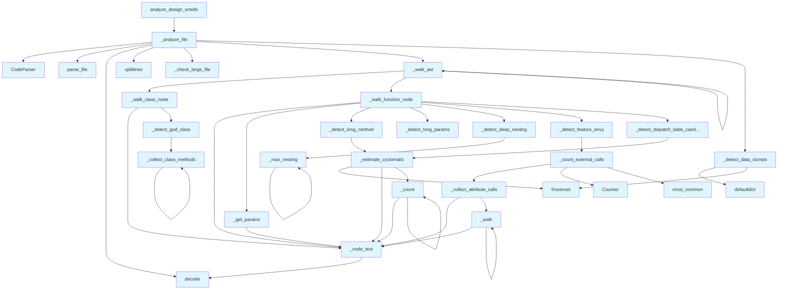

# File: `src/local_deepwiki/generators/analysis/design_smells.py`

## File Overview

This module provides static analysis capabilities to detect common design smells in source code using Abstract Syntax Tree (AST) parsing. It performs heuristic-based detection of issues such as God Classes, Long Methods, Feature Envy, and others without relying on external services or LLMs. The detection is purely based on source code structure and line counts.

The module is designed to be part of a larger static analysis pipeline, where it can be invoked to scan a repository and return structured results about design issues found.

## Key Concepts

### Design Smell Detection Heuristics

The module implements several well-known design smell detection heuristics, each with threshold-based logic:

- **God Class**: A class with more than 15 methods and/or more than 500 lines.
- **Long Method**: A function exceeding 80 lines or having cyclomatic complexity above 15.
- **Long [Parameter](api_docs.md) List**: A function with more than 6 parameters.
- **Feature Envy**: A function making more than 3 calls to methods of a single other class.
- **Large File**: A file with more than 800 lines.
- **Deep Nesting**: A function with nesting depth exceeding 4 levels.
- **Data Clump**: More than 3 functions share the same 3 or more parameter names.

These heuristics are chosen for their ability to identify structural issues that may impact maintainability and readability.

### AST Walking and Node Analysis

The module leverages the `tree-sitter` library to parse source code into ASTs. It uses recursive traversal (`_walk_ast`) to walk the AST and identify relevant nodes (classes, functions) and extract information such as:

- Function parameters (`_get_params`)
- Nesting depth (`_max_nesting`)
- Attribute calls (`_collect_attribute_calls`)
- Cyclomatic complexity (`_estimate_cyclomatic`)

This approach ensures that detection is based on actual code structure rather than simple text parsing.

### Threshold-Based Severity Filtering

Detection is configurable by severity threshold (`low`, `medium`, `high`) to allow filtering out less critical issues. The `_SEVERITY_ORDER` mapping enables sorting and filtering of smells.

### Data Clump Detection

A unique aspect of this module is its ability to detect **data clumps**, which are shared parameters across multiple functions. This is a more advanced pattern that requires tracking function signatures across a file and identifying commonalities.

## Integration

This module integrates with the broader codebase through:

- **[`CodeParser`](../../core/parser/code_parser.md)** from `local_deepwiki.core.parser`: Used to parse source files into ASTs.
- **[`iter_source_files`](source_filter.md)** from `local_deepwiki.generators.analysis.source_filter`: Provides an iterator over source files in a repository.
- **Logging**: Uses [`get_logger`](../../logging.md) from `local_deepwiki.logging` for logging analysis progress.

It is called by:
- `analyze_design_smells` function, which is used by the `smells_page` generator.
- Several internal helper functions (`_node_text`, `_estimate_cyclomatic`, etc.) are used by other analysis modules like `complexity`, `hotspots`, and `coupling`.

The module is a core component of the static analysis subsystem, supporting the generation of design smell reports in the documentation pipeline.

## Design Notes

### Why AST-based Analysis?

AST-based analysis is chosen over regex or string-based checks because it provides accurate, structured understanding of code semantics. It allows for precise identification of constructs like nesting, method calls, and class boundaries, which are essential for detecting smells like Feature Envy or Deep Nesting.

### Thresholds and Configurability

Thresholds are hardcoded for simplicity and consistency. While this limits configurability, it ensures that the detection is consistent and predictable across runs. In a future version, these could be made configurable via a settings file or CLI arguments.

### Handling Edge Cases

- **Unknown node types**: The code gracefully handles unknown or unexpected node types by skipping them.
- **Missing identifiers**: Functions and classes without names are handled with fallbacks (`"<unnamed>"`, `"<anonymous>"`).
- **Empty or malformed files**: Parsing failures are caught and return an empty list of smells.

### Performance Considerations

- AST traversal is recursive and optimized for depth-first processing.
- Use of `Counter` and `defaultdict` for efficient counting and grouping.
- Smells are collected in a flat list and sorted at the end for consistent output.

### Why No LLM or External Services?

The module is intentionally kept free of LLMs or external APIs. This ensures:
- Reproducibility of results.
- Fast execution without network dependencies.
- Compatibility with offline analysis environments.

This design aligns with the project's goal of providing lightweight, self-contained static analysis tools.

## API Reference

### Functions

#### `analyze_design_smells`

```python
def analyze_design_smells(repo_path: Path, severity_threshold: str = "medium", exclude_tests: bool = True) -> dict[str, Any]
```

Scan *repo_path* for design smells.


| Parameter | Type | Default | Description |
|-----------|------|---------|-------------|
| `repo_path` | `Path` | - | Root of the repository to scan. |
| `severity_threshold` | `str` | `"medium"` | Minimum severity to include (``"low"``, ``"medium"``, ``"high"``). |
| `exclude_tests` | `bool` | `True` | When ``True``, skip test files. |

**Returns:** `dict[str, Any]`


<details>
<summary>View Source (lines 656-708) | <a href="https://github.com/UrbanDiver/local-deepwiki-mcp/blob/main/src/local_deepwiki/generators/analysis/design_smells.py#L656-L708">GitHub</a></summary>

```python
def analyze_design_smells(
    repo_path: Path,
    severity_threshold: str = "medium",
    exclude_tests: bool = True,
) -> dict[str, Any]:
    """Scan *repo_path* for design smells.

    Args:
        repo_path: Root of the repository to scan.
        severity_threshold: Minimum severity to include (``"low"``,
            ``"medium"``, ``"high"``).
        exclude_tests: When ``True``, skip test files.

    Returns:
        A dict with ``status``, ``smells``, and ``summary`` keys.
    """
    if severity_threshold not in _SEVERITY_ORDER:
        return {
            "status": "error",
            "message": (
                f"Invalid severity_threshold '{severity_threshold}'. "
                "Valid values: low, medium, high"
            ),
        }

    all_smells: list[dict[str, Any]] = []

    for full_path, rel_path in iter_source_files(
        repo_path, exclude_tests=exclude_tests
    ):
        file_smells = _analyze_file(full_path, rel_path, severity_threshold)
        all_smells.extend(file_smells)

    # Sort: severity descending, then file, then line.
    all_smells.sort(
        key=lambda s: (
            -_SEVERITY_ORDER.get(s["severity"], 0),
            s["file"],
            s["line"],
        )
    )

    logger.info(
        "Design smells: %d smells found in %s",
        len(all_smells),
        repo_path,
    )

    return {
        "status": "success",
        "smells": all_smells,
        "summary": _compute_smell_summary(all_smells),
    }
```

</details>

## Call Graph



## Used By

Functions and methods in this file and their callers:

- **[`CodeParser`](../../core/parser/code_parser.md)**: called by `_analyze_file`
- **`Counter`**: called by `_count_external_calls`
- **`_analyze_file`**: called by `analyze_design_smells`
- **`_check_large_file`**: called by `_analyze_file`
- **`_collect_attribute_calls`**: called by `_count_external_calls`
- **`_collect_class_methods`**: called by `_collect_class_methods`, `_detect_god_class`
- **`_compute_smell_summary`**: called by `analyze_design_smells`
- **`_count`**: called by `_count`, `_estimate_cyclomatic`
- **`_count_external_calls`**: called by `_detect_feature_envy`
- **`_detect_data_clumps`**: called by `_analyze_file`
- **`_detect_deep_nesting`**: called by `_walk_function_node`
- **`_detect_dispatch_table_candidate`**: called by `_walk_function_node`
- **`_detect_feature_envy`**: called by `_walk_function_node`
- **`_detect_god_class`**: called by `_walk_class_node`
- **`_detect_long_method`**: called by `_walk_function_node`
- **`_detect_long_params`**: called by `_walk_function_node`
- **`_estimate_cyclomatic`**: called by `_detect_dispatch_table_candidate`, `_detect_long_method`
- **`_get_params`**: called by `_walk_function_node`
- **`_max_nesting`**: called by `_detect_deep_nesting`, `_max_nesting`
- **`_node_text`**: called by `_collect_attribute_calls`, `_count`, `_estimate_cyclomatic`, `_get_params`, `_walk`, `_walk_class_node`, `_walk_function_node`
- **`_walk`**: called by `_collect_attribute_calls`, `_walk`
- **`_walk_ast`**: called by `_analyze_file`, `_walk_ast`
- **`_walk_class_node`**: called by `_walk_ast`
- **`_walk_function_node`**: called by `_walk_ast`
- **`add`**: called by `_detect_data_clumps`
- **`decode`**: called by `_analyze_file`, `_node_text`
- **`defaultdict`**: called by `_detect_data_clumps`
- **`frozenset`**: called by `_detect_data_clumps`, `_estimate_cyclomatic`
- **[`iter_source_files`](source_filter.md)**: called by `analyze_design_smells`
- **`most_common`**: called by `_count_external_calls`
- **`parse_file`**: called by `_analyze_file`
- **`sort`**: called by `analyze_design_smells`
- **`splitlines`**: called by `_analyze_file`

## Usage Examples

*Examples extracted from test files*

### Handler returns success for an empty repo

From `test_design_smells.py::test_design_smells_success`:

```python
result = await handle_get_design_smells({"repo_path": str(tmp_path)})
data = json.loads(result[0].text)
assert data["status"] == "success"
```

### Function with high CC but low line count should be flagged as dispatch candidate

From `test_design_smells.py::test_detects_dispatch_table_candidate`:

```python
from local_deepwiki.generators.analysis.design_smells import analyze_design_smells

    code = """
def handle_status(code: int) -> str:
    if code == 200:
        return "ok"
    elif code == 201:
        return "created"
    elif code == 204:
        return "no content"
    elif code == 301:
        return "moved"
    elif code == 302:
        return "found"
    elif code == 400:
        return "bad request"
    elif code == 401:
        return "unauthorized"
    elif code == 403:
        return "forbidden"
    elif code == 404:
        return "not found"
    elif code == 405:
        return "method not allowed"
    elif code == 408:
```


## Last Modified

| Entity | Type | Author | Date | Commit |
|--------|------|--------|------|--------|
| `_check_large_file` | function | Brian Breidenbach | 2 days ago | `1a11306` refactor: decompose CC > 15... |
| `_walk_class_node` | function | Brian Breidenbach | 2 days ago | `1a11306` refactor: decompose CC > 15... |
| `_walk_function_node` | function | Brian Breidenbach | 2 days ago | `1a11306` refactor: decompose CC > 15... |
| `_walk_ast` | function | Brian Breidenbach | 2 days ago | `1a11306` refactor: decompose CC > 15... |
| `_analyze_file` | function | Brian Breidenbach | 2 days ago | `1a11306` refactor: decompose CC > 15... |
| `_detect_dispatch_table_candidate` | function | Brian Breidenbach | 2 days ago | `d58bac7` feat: add data clump and di... |
| `_collect_attribute_calls` | function | Brian Breidenbach | 1 week ago | `6dca476` fix: add allowlist to filte... |
| `_walk` | function | Brian Breidenbach | 1 week ago | `6dca476` fix: add allowlist to filte... |
| `_collect_class_methods` | function | Brian Breidenbach | 1 week ago | `f3faf1e` refactor: split generator a... |
| `_detect_god_class` | function | Brian Breidenbach | 1 week ago | `f3faf1e` refactor: split generator a... |
| `_detect_long_method` | function | Brian Breidenbach | 1 week ago | `f3faf1e` refactor: split generator a... |
| `_detect_long_params` | function | Brian Breidenbach | 1 week ago | `f3faf1e` refactor: split generator a... |
| `_detect_deep_nesting` | function | Brian Breidenbach | 1 week ago | `f3faf1e` refactor: split generator a... |
| `_count_external_calls` | function | Brian Breidenbach | 1 week ago | `f3faf1e` refactor: split generator a... |
| `_detect_feature_envy` | function | Brian Breidenbach | 1 week ago | `f3faf1e` refactor: split generator a... |
| `_compute_smell_summary` | function | Brian Breidenbach | 1 week ago | `f3faf1e` refactor: split generator a... |
| `analyze_design_smells` | function | Brian Breidenbach | 1 week ago | `f3faf1e` refactor: split generator a... |
| `_node_text` | function | Brian Breidenbach | 1 week ago | `f6da957` feat: add 4 architecture an... |
| `_estimate_cyclomatic` | function | Brian Breidenbach | 1 week ago | `f6da957` feat: add 4 architecture an... |
| `_count` | function | Brian Breidenbach | 1 week ago | `f6da957` feat: add 4 architecture an... |
| `_get_params` | function | Brian Breidenbach | 1 week ago | `f6da957` feat: add 4 architecture an... |
| `_max_nesting` | function | Brian Breidenbach | 1 week ago | `f6da957` feat: add 4 architecture an... |
| `_detect_data_clumps` | function | Brian Breidenbach | 1 week ago | `f6da957` feat: add 4 architecture an... |

## Additional Source Code

Source code for functions and methods not listed in the API Reference above.

#### `_node_text`

<details>
<summary>View Source (lines 154-155) | <a href="https://github.com/UrbanDiver/local-deepwiki-mcp/blob/main/src/local_deepwiki/generators/analysis/design_smells.py#L154-L155">GitHub</a></summary>

```python
def _node_text(node: Node) -> str:
    return node.text.decode("utf-8", errors="replace") if node.text else ""
```

</details>


#### `_estimate_cyclomatic`

<details>
<summary>View Source (lines 158-175) | <a href="https://github.com/UrbanDiver/local-deepwiki-mcp/blob/main/src/local_deepwiki/generators/analysis/design_smells.py#L158-L175">GitHub</a></summary>

```python
def _estimate_cyclomatic(node: Node) -> int:
    count = 1
    logical_ops = frozenset({"and", "or", "&&", "||"})

    def _count(n: Node) -> None:
        nonlocal count
        if n.type in _BRANCH_TYPES:
            count += 1
        if n.type in ("boolean_operator", "binary_expression"):
            for child in n.children:
                if child.type in ("and", "or") or _node_text(child) in logical_ops:
                    count += 1
                    break
        for child in n.children:
            _count(child)

    _count(node)
    return count
```

</details>


#### `_count`

<details>
<summary>View Source (lines 162-172) | <a href="https://github.com/UrbanDiver/local-deepwiki-mcp/blob/main/src/local_deepwiki/generators/analysis/design_smells.py#L162-L172">GitHub</a></summary>

```python
def _count(n: Node) -> None:
        nonlocal count
        if n.type in _BRANCH_TYPES:
            count += 1
        if n.type in ("boolean_operator", "binary_expression"):
            for child in n.children:
                if child.type in ("and", "or") or _node_text(child) in logical_ops:
                    count += 1
                    break
        for child in n.children:
            _count(child)
```

</details>


#### `_get_params`

<details>
<summary>View Source (lines 178-188) | <a href="https://github.com/UrbanDiver/local-deepwiki-mcp/blob/main/src/local_deepwiki/generators/analysis/design_smells.py#L178-L188">GitHub</a></summary>

```python
def _get_params(node: Node) -> list[str]:
    """Extract parameter names from a function node."""
    params: list[str] = []
    for child in node.children:
        if child.type in ("parameters", "formal_parameters", "parameter_list"):
            for p in child.children:
                if p.type not in ("(", ")", ",", "comment"):
                    name = _node_text(p)
                    if name not in ("self", "cls"):
                        params.append(name)
    return params
```

</details>


#### `_max_nesting`

<details>
<summary>View Source (lines 191-197) | <a href="https://github.com/UrbanDiver/local-deepwiki-mcp/blob/main/src/local_deepwiki/generators/analysis/design_smells.py#L191-L197">GitHub</a></summary>

```python
def _max_nesting(node: Node, depth: int = 0) -> int:
    """Return the maximum nesting depth within a node."""
    result = depth if node.type in _NESTING_TYPES else 0
    for child in node.children:
        child_depth = depth + 1 if node.type in _NESTING_TYPES else depth
        result = max(result, _max_nesting(child, child_depth))
    return result
```

</details>


#### `_collect_attribute_calls`

<details>
<summary>View Source (lines 200-232) | <a href="https://github.com/UrbanDiver/local-deepwiki-mcp/blob/main/src/local_deepwiki/generators/analysis/design_smells.py#L200-L232">GitHub</a></summary>

```python
def _collect_attribute_calls(node: Node) -> list[str]:
    """Collect object names from attribute access calls (obj.method()).

    Returns a list of object names (left side of dot) found in call expressions.
    """
    objects: list[str] = []

    def _walk(n: Node) -> None:
        # call_expression children: function + arguments
        if n.type in ("call", "call_expression"):
            func_node = None
            for child in n.children:
                if child.type in (
                    "attribute",
                    "member_expression",
                    "field_expression",
                ):
                    func_node = child
                    break
            if func_node is not None:
                obj_node = func_node.children[0] if func_node.children else None
                if obj_node and obj_node.type == "identifier":
                    obj_name = _node_text(obj_node)
                    if (
                        obj_name not in ("self", "cls", "super")
                        and obj_name not in _FEATURE_ENVY_IGNORED_OBJECTS
                    ):
                        objects.append(obj_name)
        for child in n.children:
            _walk(child)

    _walk(node)
    return objects
```

</details>


#### `_walk`

<details>
<summary>View Source (lines 207-229) | <a href="https://github.com/UrbanDiver/local-deepwiki-mcp/blob/main/src/local_deepwiki/generators/analysis/design_smells.py#L207-L229">GitHub</a></summary>

```python
def _walk(n: Node) -> None:
        # call_expression children: function + arguments
        if n.type in ("call", "call_expression"):
            func_node = None
            for child in n.children:
                if child.type in (
                    "attribute",
                    "member_expression",
                    "field_expression",
                ):
                    func_node = child
                    break
            if func_node is not None:
                obj_node = func_node.children[0] if func_node.children else None
                if obj_node and obj_node.type == "identifier":
                    obj_name = _node_text(obj_node)
                    if (
                        obj_name not in ("self", "cls", "super")
                        and obj_name not in _FEATURE_ENVY_IGNORED_OBJECTS
                    ):
                        objects.append(obj_name)
        for child in n.children:
            _walk(child)
```

</details>


#### `_collect_class_methods`

<details>
<summary>View Source (lines 240-244) | <a href="https://github.com/UrbanDiver/local-deepwiki-mcp/blob/main/src/local_deepwiki/generators/analysis/design_smells.py#L240-L244">GitHub</a></summary>

```python
def _collect_class_methods(node: Node, out: list[Any]) -> None:
    if node.type in _FUNCTION_TYPES:
        out.append(node)
    for child in node.children:
        _collect_class_methods(child, out)
```

</details>


#### `_detect_god_class`

<details>
<summary>View Source (lines 247-283) | <a href="https://github.com/UrbanDiver/local-deepwiki-mcp/blob/main/src/local_deepwiki/generators/analysis/design_smells.py#L247-L283">GitHub</a></summary>

```python
def _detect_god_class(
    class_node: Any,
    class_name: str,
    rel_path: Path,
    threshold_level: int,
) -> list[dict[str, Any]]:
    """Return god-class smell dicts for *class_node* if thresholds exceeded."""
    smells: list[dict[str, Any]] = []
    methods: list[Any] = []
    for child in class_node.children:
        _collect_class_methods(child, methods)

    class_lines = class_node.end_point[0] - class_node.start_point[0] + 1
    if (
        _SEVERITY_ORDER[SEVERITY_HIGH] >= threshold_level
        and len(methods) > _GOD_CLASS_METHOD_THRESHOLD
        and class_lines > _GOD_CLASS_LINE_THRESHOLD
    ):
        smells.append(
            {
                "type": "god_class",
                "severity": SEVERITY_HIGH,
                "file": str(rel_path),
                "line": class_node.start_point[0] + 1,
                "entity": class_name,
                "description": (
                    f"Class has {len(methods)} methods and {class_lines} lines "
                    f"(thresholds: {_GOD_CLASS_METHOD_THRESHOLD} methods, "
                    f"{_GOD_CLASS_LINE_THRESHOLD} lines)"
                ),
                "suggestion": (
                    "Apply Single Responsibility Principle — extract cohesive "
                    "groups of methods into separate classes."
                ),
            }
        )
    return smells
```

</details>


#### `_detect_long_method`

<details>
<summary>View Source (lines 286-313) | <a href="https://github.com/UrbanDiver/local-deepwiki-mcp/blob/main/src/local_deepwiki/generators/analysis/design_smells.py#L286-L313">GitHub</a></summary>

```python
def _detect_long_method(
    func_node: Any,
    func_name: str,
    rel_path: Path,
    threshold_level: int,
) -> dict[str, Any] | None:
    """Return a long-method smell dict or None."""
    func_lines = func_node.end_point[0] - func_node.start_point[0] + 1
    cyclomatic = _estimate_cyclomatic(func_node)
    if _SEVERITY_ORDER[SEVERITY_HIGH] >= threshold_level and (
        func_lines > _LONG_METHOD_LINE_THRESHOLD
        or cyclomatic > _LONG_METHOD_CC_THRESHOLD
    ):
        return {
            "type": "long_method",
            "severity": SEVERITY_HIGH,
            "file": str(rel_path),
            "line": func_node.start_point[0] + 1,
            "entity": func_name,
            "description": (
                f"Function has {func_lines} lines and cyclomatic "
                f"complexity {cyclomatic} "
                f"(thresholds: {_LONG_METHOD_LINE_THRESHOLD} lines, "
                f"CC {_LONG_METHOD_CC_THRESHOLD})"
            ),
            "suggestion": "Extract smaller helper functions. Reduce branching.",
        }
    return None
```

</details>


#### `_detect_long_params`

<details>
<summary>View Source (lines 316-340) | <a href="https://github.com/UrbanDiver/local-deepwiki-mcp/blob/main/src/local_deepwiki/generators/analysis/design_smells.py#L316-L340">GitHub</a></summary>

```python
def _detect_long_params(
    func_node: Any,
    func_name: str,
    params: list[str],
    rel_path: Path,
    threshold_level: int,
) -> dict[str, Any] | None:
    """Return a long-parameter-list smell dict or None."""
    if (
        _SEVERITY_ORDER[SEVERITY_MEDIUM] >= threshold_level
        and len(params) > _LONG_PARAM_THRESHOLD
    ):
        return {
            "type": "long_parameter_list",
            "severity": SEVERITY_MEDIUM,
            "file": str(rel_path),
            "line": func_node.start_point[0] + 1,
            "entity": func_name,
            "description": (
                f"Function has {len(params)} parameters "
                f"(threshold: {_LONG_PARAM_THRESHOLD})"
            ),
            "suggestion": "Introduce a parameter object or configuration dataclass.",
        }
    return None
```

</details>


#### `_detect_deep_nesting`

<details>
<summary>View Source (lines 343-367) | <a href="https://github.com/UrbanDiver/local-deepwiki-mcp/blob/main/src/local_deepwiki/generators/analysis/design_smells.py#L343-L367">GitHub</a></summary>

```python
def _detect_deep_nesting(
    func_node: Any,
    func_name: str,
    rel_path: Path,
    threshold_level: int,
) -> dict[str, Any] | None:
    """Return a deep-nesting smell dict or None."""
    nesting = _max_nesting(func_node)
    if (
        _SEVERITY_ORDER[SEVERITY_MEDIUM] >= threshold_level
        and nesting > _DEEP_NESTING_THRESHOLD
    ):
        return {
            "type": "deep_nesting",
            "severity": SEVERITY_MEDIUM,
            "file": str(rel_path),
            "line": func_node.start_point[0] + 1,
            "entity": func_name,
            "description": (
                f"Function has nesting depth {nesting} "
                f"(threshold: {_DEEP_NESTING_THRESHOLD})"
            ),
            "suggestion": "Use early returns (guard clauses) to flatten nesting.",
        }
    return None
```

</details>


#### `_count_external_calls`

<details>
<summary>View Source (lines 370-379) | <a href="https://github.com/UrbanDiver/local-deepwiki-mcp/blob/main/src/local_deepwiki/generators/analysis/design_smells.py#L370-L379">GitHub</a></summary>

```python
def _count_external_calls(func_node: Any) -> tuple[str, int] | None:
    """Return (most_common_obj, count) for feature-envy detection, or None."""
    calls = _collect_attribute_calls(func_node)
    if not calls:
        return None
    counter = Counter(calls)
    most_common_obj, count = counter.most_common(1)[0]
    if count > _FEATURE_ENVY_CALL_THRESHOLD:
        return most_common_obj, count
    return None
```

</details>


#### `_detect_feature_envy`

<details>
<summary>View Source (lines 382-412) | <a href="https://github.com/UrbanDiver/local-deepwiki-mcp/blob/main/src/local_deepwiki/generators/analysis/design_smells.py#L382-L412">GitHub</a></summary>

```python
def _detect_feature_envy(
    func_node: Any,
    func_name: str,
    rel_path: Path,
    threshold_level: int,
) -> list[dict[str, Any]]:
    """Return feature-envy smell dicts (0 or 1) for *func_node*."""
    smells: list[dict[str, Any]] = []
    if _SEVERITY_ORDER[SEVERITY_MEDIUM] < threshold_level:
        return smells
    result = _count_external_calls(func_node)
    if result is not None:
        most_common_obj, count = result
        smells.append(
            {
                "type": "feature_envy",
                "severity": SEVERITY_MEDIUM,
                "file": str(rel_path),
                "line": func_node.start_point[0] + 1,
                "entity": func_name,
                "description": (
                    f"Function calls '{most_common_obj}' methods "
                    f"{count} times — it may belong there "
                    f"(threshold: {_FEATURE_ENVY_CALL_THRESHOLD})"
                ),
                "suggestion": (
                    f"Consider moving this function to the '{most_common_obj}' class."
                ),
            }
        )
    return smells
```

</details>


#### `_detect_dispatch_table_candidate`

<details>
<summary>View Source (lines 415-445) | <a href="https://github.com/UrbanDiver/local-deepwiki-mcp/blob/main/src/local_deepwiki/generators/analysis/design_smells.py#L415-L445">GitHub</a></summary>

```python
def _detect_dispatch_table_candidate(
    func_node: Any,
    func_name: str,
    rel_path: Path,
    threshold_level: int,
) -> dict[str, Any] | None:
    """Flag functions with high CC but low line count as dispatch table candidates."""
    if _SEVERITY_ORDER[SEVERITY_MEDIUM] < threshold_level:
        return None
    func_lines = func_node.end_point[0] - func_node.start_point[0] + 1
    cyclomatic = _estimate_cyclomatic(func_node)
    if (
        cyclomatic > _DISPATCH_TABLE_CC_THRESHOLD
        and func_lines < _DISPATCH_TABLE_MAX_LINES
    ):
        return {
            "type": "dispatch_table_candidate",
            "severity": SEVERITY_MEDIUM,
            "file": str(rel_path),
            "line": func_node.start_point[0] + 1,
            "entity": func_name,
            "description": (
                f"Function has cyclomatic complexity {cyclomatic} in only "
                f"{func_lines} lines (high branching density suggests "
                f"an if/elif chain)"
            ),
            "suggestion": (
                "Replace conditional chain with a dictionary dispatch table or mapping."
            ),
        }
    return None
```

</details>


#### `_check_large_file`

<details>
<summary>View Source (lines 453-475) | <a href="https://github.com/UrbanDiver/local-deepwiki-mcp/blob/main/src/local_deepwiki/generators/analysis/design_smells.py#L453-L475">GitHub</a></summary>

```python
def _check_large_file(
    total_lines: int,
    rel_path: Path,
    threshold_level: int,
    smells: list[dict[str, Any]],
) -> None:
    """Append a large_file smell if the file exceeds the line threshold."""
    if _SEVERITY_ORDER[SEVERITY_MEDIUM] >= threshold_level:
        if total_lines > _LARGE_FILE_LINE_THRESHOLD:
            smells.append(
                {
                    "type": "large_file",
                    "severity": SEVERITY_MEDIUM,
                    "file": str(rel_path),
                    "line": 1,
                    "entity": rel_path.name,
                    "description": (
                        f"File has {total_lines} lines "
                        f"(threshold: {_LARGE_FILE_LINE_THRESHOLD})"
                    ),
                    "suggestion": "Split into smaller, focused modules.",
                }
            )
```

</details>


#### `_walk_class_node`

<details>
<summary>View Source (lines 478-492) | <a href="https://github.com/UrbanDiver/local-deepwiki-mcp/blob/main/src/local_deepwiki/generators/analysis/design_smells.py#L478-L492">GitHub</a></summary>

```python
def _walk_class_node(
    node: Any,
    rel_path: Path,
    threshold_level: int,
    smells: list[dict[str, Any]],
) -> None:
    """Detect god-class smells for a class AST node."""
    class_name = ""
    for child in node.children:
        if child.type in ("identifier", "name", "type_identifier"):
            class_name = _node_text(child)
            break
    smells.extend(
        _detect_god_class(node, class_name or "<unnamed>", rel_path, threshold_level)
    )
```

</details>


#### `_walk_function_node`

<details>
<summary>View Source (lines 495-528) | <a href="https://github.com/UrbanDiver/local-deepwiki-mcp/blob/main/src/local_deepwiki/generators/analysis/design_smells.py#L495-L528">GitHub</a></summary>

```python
def _walk_function_node(
    node: Any,
    rel_path: Path,
    threshold_level: int,
    smells: list[dict[str, Any]],
    function_params: dict[str, list[str]],
) -> None:
    """Detect all function-level smells for a function AST node."""
    func_name = ""
    for child in node.children:
        if child.type in ("identifier", "name", "property_identifier"):
            func_name = _node_text(child)
            break
    func_name = func_name or "<anonymous>"
    params = _get_params(node)
    function_params[func_name] = params

    smell = _detect_long_method(node, func_name, rel_path, threshold_level)
    if smell:
        smells.append(smell)

    smell = _detect_long_params(node, func_name, params, rel_path, threshold_level)
    if smell:
        smells.append(smell)

    smell = _detect_deep_nesting(node, func_name, rel_path, threshold_level)
    if smell:
        smells.append(smell)

    smells.extend(_detect_feature_envy(node, func_name, rel_path, threshold_level))

    smell = _detect_dispatch_table_candidate(node, func_name, rel_path, threshold_level)
    if smell:
        smells.append(smell)
```

</details>


#### `_walk_ast`

<details>
<summary>View Source (lines 531-544) | <a href="https://github.com/UrbanDiver/local-deepwiki-mcp/blob/main/src/local_deepwiki/generators/analysis/design_smells.py#L531-L544">GitHub</a></summary>

```python
def _walk_ast(
    node: Any,
    rel_path: Path,
    threshold_level: int,
    smells: list[dict[str, Any]],
    function_params: dict[str, list[str]],
) -> None:
    """Recursively walk the AST, dispatching to class/function handlers."""
    if node.type in _CLASS_TYPES:
        _walk_class_node(node, rel_path, threshold_level, smells)
    elif node.type in _FUNCTION_TYPES:
        _walk_function_node(node, rel_path, threshold_level, smells, function_params)
    for child in node.children:
        _walk_ast(child, rel_path, threshold_level, smells, function_params)
```

</details>


#### `_analyze_file`

<details>
<summary>View Source (lines 547-580) | <a href="https://github.com/UrbanDiver/local-deepwiki-mcp/blob/main/src/local_deepwiki/generators/analysis/design_smells.py#L547-L580">GitHub</a></summary>

```python
def _analyze_file(
    full_path: Path,
    rel_path: Path,
    severity_threshold: str,
) -> list[dict[str, Any]]:
    """Detect design smells in a single source file.

    Returns a list of smell dicts (possibly empty).
    """
    smells: list[dict[str, Any]] = []
    threshold_level = _SEVERITY_ORDER[severity_threshold]

    parser = CodeParser()
    parse_result = parser.parse_file(full_path)
    if parse_result is None:
        return smells

    root_node, _lang, src_bytes = parse_result
    source = src_bytes.decode("utf-8", errors="replace")
    total_lines = len(source.splitlines())

    _check_large_file(total_lines, rel_path, threshold_level, smells)

    function_params: dict[str, list[str]] = {}
    _walk_ast(root_node, rel_path, threshold_level, smells, function_params)

    # --- Data Clump (file-level check after all functions walked) ---
    if (
        _SEVERITY_ORDER[SEVERITY_LOW] >= threshold_level
        and len(function_params) >= _DATA_CLUMP_MIN_FUNCTIONS
    ):
        _detect_data_clumps(function_params, rel_path, smells)

    return smells
```

</details>


#### `_detect_data_clumps`

<details>
<summary>View Source (lines 583-621) | <a href="https://github.com/UrbanDiver/local-deepwiki-mcp/blob/main/src/local_deepwiki/generators/analysis/design_smells.py#L583-L621">GitHub</a></summary>

```python
def _detect_data_clumps(
    function_params: dict[str, list[str]],
    rel_path: Path,
    smells: list[dict[str, Any]],
) -> None:
    """Detect data clump smell: >3 functions share the same 3+ parameter names."""
    # Build param-set -> list of function names mapping.
    param_groups: dict[frozenset[str], list[str]] = defaultdict(list)
    for func_name, params in function_params.items():
        if len(params) >= _DATA_CLUMP_SHARED_PARAMS:
            param_set = frozenset(params)
            param_groups[param_set].append(func_name)

    # Find cliques where many functions share all params from a common subset.
    # For simplicity: if the same frozen set appears in >= _DATA_CLUMP_MIN_FUNCTIONS,
    # report it. Also check subsets of size >= _DATA_CLUMP_SHARED_PARAMS.
    reported: set[frozenset[str]] = set()

    for param_set, funcs in param_groups.items():
        if len(funcs) >= _DATA_CLUMP_MIN_FUNCTIONS and param_set not in reported:
            reported.add(param_set)
            shared = sorted(param_set)
            smells.append(
                {
                    "type": "data_clump",
                    "severity": SEVERITY_LOW,
                    "file": str(rel_path),
                    "line": 1,
                    "entity": ", ".join(funcs[:5]),
                    "description": (
                        f"{len(funcs)} functions share parameters: "
                        + ", ".join(shared[:6])
                    ),
                    "suggestion": (
                        "Extract shared parameters into a dedicated data class or "
                        "named tuple."
                    ),
                }
            )
```

</details>


#### `_compute_smell_summary`

<details>
<summary>View Source (lines 629-653) | <a href="https://github.com/UrbanDiver/local-deepwiki-mcp/blob/main/src/local_deepwiki/generators/analysis/design_smells.py#L629-L653">GitHub</a></summary>

```python
def _compute_smell_summary(all_smells: list[dict[str, Any]]) -> dict[str, Any]:
    """Build the summary dict from a flat list of smell dicts.

    Args:
        all_smells: All detected smell dicts.

    Returns:
        Dict with ``total``, ``by_severity``, and ``by_type`` keys.
    """
    by_severity: dict[str, int] = {
        SEVERITY_HIGH: 0,
        SEVERITY_MEDIUM: 0,
        SEVERITY_LOW: 0,
    }
    by_type: dict[str, int] = {}
    for smell in all_smells:
        sev = smell["severity"]
        stype = smell["type"]
        by_severity[sev] = by_severity.get(sev, 0) + 1
        by_type[stype] = by_type.get(stype, 0) + 1
    return {
        "total": len(all_smells),
        "by_severity": by_severity,
        "by_type": by_type,
    }
```

</details>

## Relevant Source Files

- `src/local_deepwiki/generators/analysis/design_smells.py:154-155`
