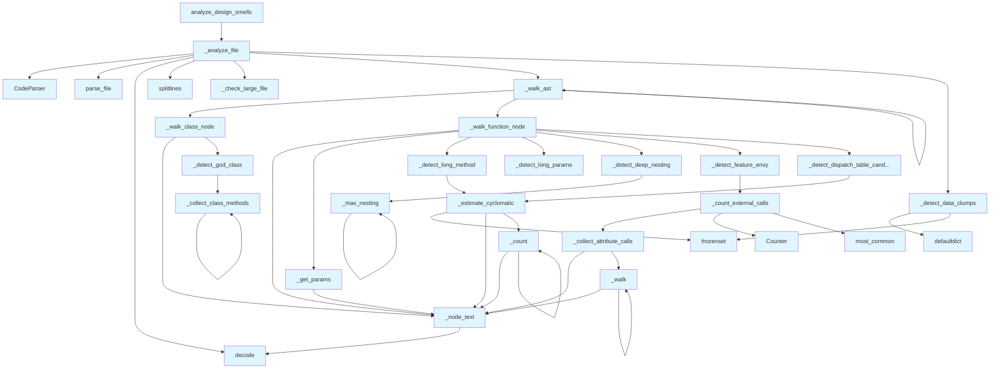

# File: `src/local_deepwiki/generators/analysis/design_smells.py`

## File Overview

This file implements a static analysis tool for detecting common design smells in source code using AST (Abstract Syntax Tree) parsing. It provides heuristics to identify code smells such as God Classes, Long Methods, Feature Envy, and more, based on line counts, cyclomatic complexity, nesting depth, and parameter usage patterns.

The module is designed to be a pure filesystem and AST-based analysis tool — it does not rely on external services or LLMs. It integrates with the broader `local_deepwiki` ecosystem by leveraging [`CodeParser`](../../core/parser/code_parser.md) for AST parsing and [`iter_source_files`](source_filter.md) for traversing source files.

## Key Concepts

### Design Smells Detection

The core abstraction is the detection of design smells using static analysis. Each smell is defined by a set of thresholds (e.g., line count, cyclomatic complexity) and heuristics that are applied to AST nodes.

- **God Class**: A class with too many methods and lines, indicating violation of the Single Responsibility Principle.
- **Long Method**: A function that is too long or has high cyclomatic complexity, suggesting it should be split.
- **Long [Parameter](api_docs.md) List**: A function with too many parameters, suggesting the use of a parameter object.
- **Feature Envy**: A function that makes too many calls to methods of another class, suggesting it may belong there.
- **Large File**: A file that is too long, suggesting it should be split into smaller modules.
- **Deep Nesting**: Excessive nesting in a function, which reduces readability.
- **Data Clump**: Multiple functions that share the same set of parameters, suggesting a shared data structure.

### AST Traversal and Smell Detection

The system uses recursive AST traversal to identify relevant nodes (classes, functions) and then applies smell-specific detection functions. The traversal is implemented via `_walk_ast`, which dispatches to class or function-specific handlers (`_walk_class_node`, `_walk_function_node`).

### Threshold-Based Heuristics

All smell detection is based on configurable thresholds. These thresholds are defined as module-level constants, allowing for easy tuning or customization of sensitivity. The thresholds are designed to catch common anti-patterns that reduce code maintainability.

### Severity Levels

Smells are categorized into severity levels: `low`, `medium`, and `high`. This allows filtering of results based on severity, which is useful for prioritizing refactoring efforts.

## Integration

This file is part of the `local_deepwiki.generators.analysis` module and integrates with:

- [`CodeParser`](../../core/parser/code_parser.md) from `local_deepwiki.core.parser` to parse source code into ASTs.
- [`iter_source_files`](source_filter.md) from `local_deepwiki.generators.analysis.source_filter` to iterate over source files in a repository.
- [`get_logger`](../../logging.md) from `local_deepwiki.logging` to log analysis progress and results.

It is called by:
- `analyze_design_smells` function, which is used by modules like `smells_page`, `analysis_architecture`, and tests.

The file is also used internally by:
- `chunk_builders`, `chunk_extractors`, and other components that require helper functions like `_node_text`, `_estimate_cyclomatic`, and `_count`.

## Design Notes

### Why Static Analysis?

This module uses static analysis (AST parsing) instead of runtime or dynamic analysis because:
- It is faster and more deterministic.
- It doesn't require running or instrumenting the code.
- It allows for detecting design smells without modifying the codebase.

### Threshold Selection

Thresholds were chosen based on widely accepted practices in software engineering:
- For example, a God Class is flagged if it has more than 15 methods and 500 lines.
- Long Method is flagged if it exceeds 80 lines or has cyclomatic complexity over 15.
- Feature Envy is flagged if a function makes more than 3 calls to a single external object.

These values are not arbitrary but are based on empirical thresholds used in literature and tooling (e.g., SonarQube, PMD).

### Separation of Concerns

The module is separated into:
- Helper functions (`_node_text`, `_estimate_cyclomatic`, `_count`, etc.) for AST utilities.
- Smell detection functions (`_detect_god_class`, `_detect_long_method`, etc.) for specific smell logic.
- File-level analysis (`_analyze_file`, `_walk_ast`) for orchestrating the detection process.
- Top-level function (`analyze_design_smells`) for integrating with the CLI or other consumers.

This structure promotes reusability and testability, as each function has a single, well-defined responsibility.

### Filtering by Severity

The `analyze_design_smells` function allows filtering by severity, enabling users to focus on the most critical smells. This is implemented by mapping severity strings to numerical values (`_SEVERITY_ORDER`) and comparing against them.

### Handling of Edge Cases

- **Empty or Invalid Files**: The `_analyze_file` function gracefully handles cases where parsing fails by returning an empty list of smells.
- **Unnamed Entities**: Functions and classes without names (e.g., anonymous functions or unnamed classes) are given placeholder names (`<anonymous>`, `<unnamed>`).
- **[Parameter](api_docs.md) Extraction**: The `_get_params` function filters out `self` and `cls` parameters to avoid skewing data clump detection.

### Data Clump Detection

Data clump detection is performed at the file level, after all functions have been analyzed. It identifies parameter sets that are shared across multiple functions, suggesting that those parameters should be grouped into a dedicated data structure. This is a more advanced detection that requires tracking function parameters across the entire file.

### Sorting of Smells

The final list of smells is sorted by severity (descending), then by file name, and then by line number. This makes it easier for users to prioritize fixes and navigate the results.

## API Reference

### Functions

#### `analyze_design_smells`

```python
def analyze_design_smells(repo_path: Path, severity_threshold: str = "medium", exclude_tests: bool = True) -> dict[str, Any]
```

Scan *repo_path* for design smells.


| Parameter | Type | Default | Description |
|-----------|------|---------|-------------|
| `repo_path` | `Path` | - | Root of the repository to scan. |
| `severity_threshold` | `str` | `"medium"` | Minimum severity to include (``"low"``, ``"medium"``, ``"high"``). |
| `exclude_tests` | `bool` | `True` | When ``True``, skip test files. |

**Returns:** `dict[str, Any]`


<details>
<summary>View Source (lines 670-722) | <a href="https://github.com/UrbanDiver/local-deepwiki-mcp/blob/main/src/local_deepwiki/generators/analysis/design_smells.py#L670-L722">GitHub</a></summary>

```python
def analyze_design_smells(
    repo_path: Path,
    severity_threshold: str = "medium",
    exclude_tests: bool = True,
) -> dict[str, Any]:
    """Scan *repo_path* for design smells.

    Args:
        repo_path: Root of the repository to scan.
        severity_threshold: Minimum severity to include (``"low"``,
            ``"medium"``, ``"high"``).
        exclude_tests: When ``True``, skip test files.

    Returns:
        A dict with ``status``, ``smells``, and ``summary`` keys.
    """
    if severity_threshold not in _SEVERITY_ORDER:
        return {
            "status": "error",
            "message": (
                f"Invalid severity_threshold '{severity_threshold}'. "
                "Valid values: low, medium, high"
            ),
        }

    all_smells: list[dict[str, Any]] = []

    for full_path, rel_path in iter_source_files(
        repo_path, exclude_tests=exclude_tests
    ):
        file_smells = _analyze_file(full_path, rel_path, severity_threshold)
        all_smells.extend(file_smells)

    # Sort: severity descending, then file, then line.
    all_smells.sort(
        key=lambda s: (
            -_SEVERITY_ORDER.get(s["severity"], 0),
            s["file"],
            s["line"],
        )
    )

    logger.info(
        "Design smells: %d smells found in %s",
        len(all_smells),
        repo_path,
    )

    return {
        "status": "success",
        "smells": all_smells,
        "summary": _compute_smell_summary(all_smells),
    }
```

</details>

## Call Graph



## Used By

Functions and methods in this file and their callers:

- **[`CodeParser`](../../core/parser/code_parser.md)**: called by `_analyze_file`
- **`Counter`**: called by `_count_external_calls`
- **`_analyze_file`**: called by `analyze_design_smells`
- **`_check_large_file`**: called by `_analyze_file`
- **`_collect_attribute_calls`**: called by `_count_external_calls`
- **`_collect_class_methods`**: called by `_collect_class_methods`, `_detect_god_class`
- **`_compute_smell_summary`**: called by `analyze_design_smells`
- **`_count`**: called by `_count`, `_estimate_cyclomatic`
- **`_count_external_calls`**: called by `_detect_feature_envy`
- **`_detect_data_clumps`**: called by `_analyze_file`
- **`_detect_deep_nesting`**: called by `_walk_function_node`
- **`_detect_dispatch_table_candidate`**: called by `_walk_function_node`
- **`_detect_feature_envy`**: called by `_walk_function_node`
- **`_detect_god_class`**: called by `_walk_class_node`
- **`_detect_long_method`**: called by `_walk_function_node`
- **`_detect_long_params`**: called by `_walk_function_node`
- **`_estimate_cyclomatic`**: called by `_detect_dispatch_table_candidate`, `_detect_long_method`
- **`_get_params`**: called by `_walk_function_node`
- **`_max_nesting`**: called by `_detect_deep_nesting`, `_max_nesting`
- **`_node_text`**: called by `_collect_attribute_calls`, `_count`, `_estimate_cyclomatic`, `_get_params`, `_walk`, `_walk_class_node`, `_walk_function_node`
- **`_walk`**: called by `_collect_attribute_calls`, `_walk`
- **`_walk_ast`**: called by `_analyze_file`, `_walk_ast`
- **`_walk_class_node`**: called by `_walk_ast`
- **`_walk_function_node`**: called by `_walk_ast`
- **`add`**: called by `_detect_data_clumps`
- **`decode`**: called by `_analyze_file`, `_node_text`
- **`defaultdict`**: called by `_detect_data_clumps`
- **`frozenset`**: called by `_detect_data_clumps`, `_estimate_cyclomatic`
- **[`iter_source_files`](source_filter.md)**: called by `analyze_design_smells`
- **`most_common`**: called by `_count_external_calls`
- **`parse_file`**: called by `_analyze_file`
- **`sort`**: called by `analyze_design_smells`
- **`splitlines`**: called by `_analyze_file`

## Usage Examples

*Examples extracted from test files*

### Handler returns success for an empty repo

From `test_design_smells.py::test_design_smells_success`:

```python
result = await handle_get_design_smells({"repo_path": str(tmp_path)})
data = json.loads(result[0].text)
assert data["status"] == "success"
```

### Function with high CC but low line count should be flagged as dispatch candidate

From `test_design_smells.py::test_detects_dispatch_table_candidate`:

```python
from local_deepwiki.generators.analysis.design_smells import analyze_design_smells

    code = """
def handle_status(code: int) -> str:
    if code == 200:
        return "ok"
    elif code == 201:
        return "created"
    elif code == 204:
        return "no content"
    elif code == 301:
        return "moved"
    elif code == 302:
        return "found"
    elif code == 400:
        return "bad request"
    elif code == 401:
        return "unauthorized"
    elif code == 403:
        return "forbidden"
    elif code == 404:
        return "not found"
    elif code == 405:
        return "method not allowed"
    elif code == 408:
```


## Last Modified

| Entity | Type | Author | Date | Commit |
|--------|------|--------|------|--------|
| `_detect_long_method` | function | Brian Breidenbach | today | `56000bf` fix: improve analysis accur... |
| `_detect_feature_envy` | function | Brian Breidenbach | today | `56000bf` fix: improve analysis accur... |
| `_check_large_file` | function | Brian Breidenbach | 3 days ago | `1a11306` refactor: decompose CC > 15... |
| `_walk_class_node` | function | Brian Breidenbach | 3 days ago | `1a11306` refactor: decompose CC > 15... |
| `_walk_function_node` | function | Brian Breidenbach | 3 days ago | `1a11306` refactor: decompose CC > 15... |
| `_walk_ast` | function | Brian Breidenbach | 3 days ago | `1a11306` refactor: decompose CC > 15... |
| `_analyze_file` | function | Brian Breidenbach | 3 days ago | `1a11306` refactor: decompose CC > 15... |
| `_detect_dispatch_table_candidate` | function | Brian Breidenbach | 3 days ago | `d58bac7` feat: add data clump and di... |
| `_collect_attribute_calls` | function | Brian Breidenbach | 1 week ago | `6dca476` fix: add allowlist to filte... |
| `_walk` | function | Brian Breidenbach | 1 week ago | `6dca476` fix: add allowlist to filte... |
| `_collect_class_methods` | function | Brian Breidenbach | 1 week ago | `f3faf1e` refactor: split generator a... |
| `_detect_god_class` | function | Brian Breidenbach | 1 week ago | `f3faf1e` refactor: split generator a... |
| `_detect_long_params` | function | Brian Breidenbach | 1 week ago | `f3faf1e` refactor: split generator a... |
| `_detect_deep_nesting` | function | Brian Breidenbach | 1 week ago | `f3faf1e` refactor: split generator a... |
| `_count_external_calls` | function | Brian Breidenbach | 1 week ago | `f3faf1e` refactor: split generator a... |
| `_compute_smell_summary` | function | Brian Breidenbach | 1 week ago | `f3faf1e` refactor: split generator a... |
| `analyze_design_smells` | function | Brian Breidenbach | 1 week ago | `f3faf1e` refactor: split generator a... |
| `_node_text` | function | Brian Breidenbach | 1 week ago | `f6da957` feat: add 4 architecture an... |
| `_estimate_cyclomatic` | function | Brian Breidenbach | 1 week ago | `f6da957` feat: add 4 architecture an... |
| `_count` | function | Brian Breidenbach | 1 week ago | `f6da957` feat: add 4 architecture an... |
| `_get_params` | function | Brian Breidenbach | 1 week ago | `f6da957` feat: add 4 architecture an... |
| `_max_nesting` | function | Brian Breidenbach | 1 week ago | `f6da957` feat: add 4 architecture an... |
| `_detect_data_clumps` | function | Brian Breidenbach | 1 week ago | `f6da957` feat: add 4 architecture an... |

## Additional Source Code

Source code for functions and methods not listed in the API Reference above.

#### `_node_text`

<details>
<summary>View Source (lines 162-163) | <a href="https://github.com/UrbanDiver/local-deepwiki-mcp/blob/main/src/local_deepwiki/generators/analysis/design_smells.py#L162-L163">GitHub</a></summary>

```python
def _node_text(node: Node) -> str:
    return node.text.decode("utf-8", errors="replace") if node.text else ""
```

</details>


#### `_estimate_cyclomatic`

<details>
<summary>View Source (lines 166-183) | <a href="https://github.com/UrbanDiver/local-deepwiki-mcp/blob/main/src/local_deepwiki/generators/analysis/design_smells.py#L166-L183">GitHub</a></summary>

```python
def _estimate_cyclomatic(node: Node) -> int:
    count = 1
    logical_ops = frozenset({"and", "or", "&&", "||"})

    def _count(n: Node) -> None:
        nonlocal count
        if n.type in _BRANCH_TYPES:
            count += 1
        if n.type in ("boolean_operator", "binary_expression"):
            for child in n.children:
                if child.type in ("and", "or") or _node_text(child) in logical_ops:
                    count += 1
                    break
        for child in n.children:
            _count(child)

    _count(node)
    return count
```

</details>


#### `_count`

<details>
<summary>View Source (lines 170-180) | <a href="https://github.com/UrbanDiver/local-deepwiki-mcp/blob/main/src/local_deepwiki/generators/analysis/design_smells.py#L170-L180">GitHub</a></summary>

```python
def _count(n: Node) -> None:
        nonlocal count
        if n.type in _BRANCH_TYPES:
            count += 1
        if n.type in ("boolean_operator", "binary_expression"):
            for child in n.children:
                if child.type in ("and", "or") or _node_text(child) in logical_ops:
                    count += 1
                    break
        for child in n.children:
            _count(child)
```

</details>


#### `_get_params`

<details>
<summary>View Source (lines 186-196) | <a href="https://github.com/UrbanDiver/local-deepwiki-mcp/blob/main/src/local_deepwiki/generators/analysis/design_smells.py#L186-L196">GitHub</a></summary>

```python
def _get_params(node: Node) -> list[str]:
    """Extract parameter names from a function node."""
    params: list[str] = []
    for child in node.children:
        if child.type in ("parameters", "formal_parameters", "parameter_list"):
            for p in child.children:
                if p.type not in ("(", ")", ",", "comment"):
                    name = _node_text(p)
                    if name not in ("self", "cls"):
                        params.append(name)
    return params
```

</details>


#### `_max_nesting`

<details>
<summary>View Source (lines 199-205) | <a href="https://github.com/UrbanDiver/local-deepwiki-mcp/blob/main/src/local_deepwiki/generators/analysis/design_smells.py#L199-L205">GitHub</a></summary>

```python
def _max_nesting(node: Node, depth: int = 0) -> int:
    """Return the maximum nesting depth within a node."""
    result = depth if node.type in _NESTING_TYPES else 0
    for child in node.children:
        child_depth = depth + 1 if node.type in _NESTING_TYPES else depth
        result = max(result, _max_nesting(child, child_depth))
    return result
```

</details>


#### `_collect_attribute_calls`

<details>
<summary>View Source (lines 208-240) | <a href="https://github.com/UrbanDiver/local-deepwiki-mcp/blob/main/src/local_deepwiki/generators/analysis/design_smells.py#L208-L240">GitHub</a></summary>

```python
def _collect_attribute_calls(node: Node) -> list[str]:
    """Collect object names from attribute access calls (obj.method()).

    Returns a list of object names (left side of dot) found in call expressions.
    """
    objects: list[str] = []

    def _walk(n: Node) -> None:
        # call_expression children: function + arguments
        if n.type in ("call", "call_expression"):
            func_node = None
            for child in n.children:
                if child.type in (
                    "attribute",
                    "member_expression",
                    "field_expression",
                ):
                    func_node = child
                    break
            if func_node is not None:
                obj_node = func_node.children[0] if func_node.children else None
                if obj_node and obj_node.type == "identifier":
                    obj_name = _node_text(obj_node)
                    if (
                        obj_name not in ("self", "cls", "super")
                        and obj_name not in _FEATURE_ENVY_IGNORED_OBJECTS
                    ):
                        objects.append(obj_name)
        for child in n.children:
            _walk(child)

    _walk(node)
    return objects
```

</details>


#### `_walk`

<details>
<summary>View Source (lines 215-237) | <a href="https://github.com/UrbanDiver/local-deepwiki-mcp/blob/main/src/local_deepwiki/generators/analysis/design_smells.py#L215-L237">GitHub</a></summary>

```python
def _walk(n: Node) -> None:
        # call_expression children: function + arguments
        if n.type in ("call", "call_expression"):
            func_node = None
            for child in n.children:
                if child.type in (
                    "attribute",
                    "member_expression",
                    "field_expression",
                ):
                    func_node = child
                    break
            if func_node is not None:
                obj_node = func_node.children[0] if func_node.children else None
                if obj_node and obj_node.type == "identifier":
                    obj_name = _node_text(obj_node)
                    if (
                        obj_name not in ("self", "cls", "super")
                        and obj_name not in _FEATURE_ENVY_IGNORED_OBJECTS
                    ):
                        objects.append(obj_name)
        for child in n.children:
            _walk(child)
```

</details>


#### `_collect_class_methods`

<details>
<summary>View Source (lines 248-252) | <a href="https://github.com/UrbanDiver/local-deepwiki-mcp/blob/main/src/local_deepwiki/generators/analysis/design_smells.py#L248-L252">GitHub</a></summary>

```python
def _collect_class_methods(node: Node, out: list[Any]) -> None:
    if node.type in _FUNCTION_TYPES:
        out.append(node)
    for child in node.children:
        _collect_class_methods(child, out)
```

</details>


#### `_detect_god_class`

<details>
<summary>View Source (lines 255-291) | <a href="https://github.com/UrbanDiver/local-deepwiki-mcp/blob/main/src/local_deepwiki/generators/analysis/design_smells.py#L255-L291">GitHub</a></summary>

```python
def _detect_god_class(
    class_node: Any,
    class_name: str,
    rel_path: Path,
    threshold_level: int,
) -> list[dict[str, Any]]:
    """Return god-class smell dicts for *class_node* if thresholds exceeded."""
    smells: list[dict[str, Any]] = []
    methods: list[Any] = []
    for child in class_node.children:
        _collect_class_methods(child, methods)

    class_lines = class_node.end_point[0] - class_node.start_point[0] + 1
    if (
        _SEVERITY_ORDER[SEVERITY_HIGH] >= threshold_level
        and len(methods) > _GOD_CLASS_METHOD_THRESHOLD
        and class_lines > _GOD_CLASS_LINE_THRESHOLD
    ):
        smells.append(
            {
                "type": "god_class",
                "severity": SEVERITY_HIGH,
                "file": str(rel_path),
                "line": class_node.start_point[0] + 1,
                "entity": class_name,
                "description": (
                    f"Class has {len(methods)} methods and {class_lines} lines "
                    f"(thresholds: {_GOD_CLASS_METHOD_THRESHOLD} methods, "
                    f"{_GOD_CLASS_LINE_THRESHOLD} lines)"
                ),
                "suggestion": (
                    "Apply Single Responsibility Principle — extract cohesive "
                    "groups of methods into separate classes."
                ),
            }
        )
    return smells
```

</details>


#### `_detect_long_method`

<details>
<summary>View Source (lines 294-325) | <a href="https://github.com/UrbanDiver/local-deepwiki-mcp/blob/main/src/local_deepwiki/generators/analysis/design_smells.py#L294-L325">GitHub</a></summary>

```python
def _detect_long_method(
    func_node: Any,
    func_name: str,
    rel_path: Path,
    threshold_level: int,
) -> dict[str, Any] | None:
    """Return a long-method smell dict or None."""
    func_lines = func_node.end_point[0] - func_node.start_point[0] + 1
    cyclomatic = _estimate_cyclomatic(func_node)
    # Flag if: (long AND branchy) OR (very high CC regardless of length)
    is_long_and_branchy = (
        func_lines > _LONG_METHOD_LINE_THRESHOLD and cyclomatic > _LONG_METHOD_CC_FLOOR
    )
    is_high_cc = cyclomatic > _LONG_METHOD_CC_THRESHOLD
    if _SEVERITY_ORDER[SEVERITY_HIGH] >= threshold_level and (
        is_long_and_branchy or is_high_cc
    ):
        return {
            "type": "long_method",
            "severity": SEVERITY_HIGH,
            "file": str(rel_path),
            "line": func_node.start_point[0] + 1,
            "entity": func_name,
            "description": (
                f"Function has {func_lines} lines and cyclomatic "
                f"complexity {cyclomatic} "
                f"(thresholds: {_LONG_METHOD_LINE_THRESHOLD} lines, "
                f"CC {_LONG_METHOD_CC_THRESHOLD})"
            ),
            "suggestion": "Extract smaller helper functions. Reduce branching.",
        }
    return None
```

</details>


#### `_detect_long_params`

<details>
<summary>View Source (lines 328-352) | <a href="https://github.com/UrbanDiver/local-deepwiki-mcp/blob/main/src/local_deepwiki/generators/analysis/design_smells.py#L328-L352">GitHub</a></summary>

```python
def _detect_long_params(
    func_node: Any,
    func_name: str,
    params: list[str],
    rel_path: Path,
    threshold_level: int,
) -> dict[str, Any] | None:
    """Return a long-parameter-list smell dict or None."""
    if (
        _SEVERITY_ORDER[SEVERITY_MEDIUM] >= threshold_level
        and len(params) > _LONG_PARAM_THRESHOLD
    ):
        return {
            "type": "long_parameter_list",
            "severity": SEVERITY_MEDIUM,
            "file": str(rel_path),
            "line": func_node.start_point[0] + 1,
            "entity": func_name,
            "description": (
                f"Function has {len(params)} parameters "
                f"(threshold: {_LONG_PARAM_THRESHOLD})"
            ),
            "suggestion": "Introduce a parameter object or configuration dataclass.",
        }
    return None
```

</details>


#### `_detect_deep_nesting`

<details>
<summary>View Source (lines 355-379) | <a href="https://github.com/UrbanDiver/local-deepwiki-mcp/blob/main/src/local_deepwiki/generators/analysis/design_smells.py#L355-L379">GitHub</a></summary>

```python
def _detect_deep_nesting(
    func_node: Any,
    func_name: str,
    rel_path: Path,
    threshold_level: int,
) -> dict[str, Any] | None:
    """Return a deep-nesting smell dict or None."""
    nesting = _max_nesting(func_node)
    if (
        _SEVERITY_ORDER[SEVERITY_MEDIUM] >= threshold_level
        and nesting > _DEEP_NESTING_THRESHOLD
    ):
        return {
            "type": "deep_nesting",
            "severity": SEVERITY_MEDIUM,
            "file": str(rel_path),
            "line": func_node.start_point[0] + 1,
            "entity": func_name,
            "description": (
                f"Function has nesting depth {nesting} "
                f"(threshold: {_DEEP_NESTING_THRESHOLD})"
            ),
            "suggestion": "Use early returns (guard clauses) to flatten nesting.",
        }
    return None
```

</details>


#### `_count_external_calls`

<details>
<summary>View Source (lines 382-391) | <a href="https://github.com/UrbanDiver/local-deepwiki-mcp/blob/main/src/local_deepwiki/generators/analysis/design_smells.py#L382-L391">GitHub</a></summary>

```python
def _count_external_calls(func_node: Any) -> tuple[str, int] | None:
    """Return (most_common_obj, count) for feature-envy detection, or None."""
    calls = _collect_attribute_calls(func_node)
    if not calls:
        return None
    counter = Counter(calls)
    most_common_obj, count = counter.most_common(1)[0]
    if count > _FEATURE_ENVY_CALL_THRESHOLD:
        return most_common_obj, count
    return None
```

</details>


#### `_detect_feature_envy`

<details>
<summary>View Source (lines 394-426) | <a href="https://github.com/UrbanDiver/local-deepwiki-mcp/blob/main/src/local_deepwiki/generators/analysis/design_smells.py#L394-L426">GitHub</a></summary>

```python
def _detect_feature_envy(
    func_node: Any,
    func_name: str,
    rel_path: Path,
    threshold_level: int,
) -> list[dict[str, Any]]:
    """Return feature-envy smell dicts (0 or 1) for *func_node*."""
    smells: list[dict[str, Any]] = []
    if _SEVERITY_ORDER[SEVERITY_MEDIUM] < threshold_level:
        return smells
    if func_name.startswith(_FEATURE_ENVY_IGNORED_PREFIXES):
        return smells
    result = _count_external_calls(func_node)
    if result is not None:
        most_common_obj, count = result
        smells.append(
            {
                "type": "feature_envy",
                "severity": SEVERITY_MEDIUM,
                "file": str(rel_path),
                "line": func_node.start_point[0] + 1,
                "entity": func_name,
                "description": (
                    f"Function calls '{most_common_obj}' methods "
                    f"{count} times — it may belong there "
                    f"(threshold: {_FEATURE_ENVY_CALL_THRESHOLD})"
                ),
                "suggestion": (
                    f"Consider moving this function to the '{most_common_obj}' class."
                ),
            }
        )
    return smells
```

</details>


#### `_detect_dispatch_table_candidate`

<details>
<summary>View Source (lines 429-459) | <a href="https://github.com/UrbanDiver/local-deepwiki-mcp/blob/main/src/local_deepwiki/generators/analysis/design_smells.py#L429-L459">GitHub</a></summary>

```python
def _detect_dispatch_table_candidate(
    func_node: Any,
    func_name: str,
    rel_path: Path,
    threshold_level: int,
) -> dict[str, Any] | None:
    """Flag functions with high CC but low line count as dispatch table candidates."""
    if _SEVERITY_ORDER[SEVERITY_MEDIUM] < threshold_level:
        return None
    func_lines = func_node.end_point[0] - func_node.start_point[0] + 1
    cyclomatic = _estimate_cyclomatic(func_node)
    if (
        cyclomatic > _DISPATCH_TABLE_CC_THRESHOLD
        and func_lines < _DISPATCH_TABLE_MAX_LINES
    ):
        return {
            "type": "dispatch_table_candidate",
            "severity": SEVERITY_MEDIUM,
            "file": str(rel_path),
            "line": func_node.start_point[0] + 1,
            "entity": func_name,
            "description": (
                f"Function has cyclomatic complexity {cyclomatic} in only "
                f"{func_lines} lines (high branching density suggests "
                f"an if/elif chain)"
            ),
            "suggestion": (
                "Replace conditional chain with a dictionary dispatch table or mapping."
            ),
        }
    return None
```

</details>


#### `_check_large_file`

<details>
<summary>View Source (lines 467-489) | <a href="https://github.com/UrbanDiver/local-deepwiki-mcp/blob/main/src/local_deepwiki/generators/analysis/design_smells.py#L467-L489">GitHub</a></summary>

```python
def _check_large_file(
    total_lines: int,
    rel_path: Path,
    threshold_level: int,
    smells: list[dict[str, Any]],
) -> None:
    """Append a large_file smell if the file exceeds the line threshold."""
    if _SEVERITY_ORDER[SEVERITY_MEDIUM] >= threshold_level:
        if total_lines > _LARGE_FILE_LINE_THRESHOLD:
            smells.append(
                {
                    "type": "large_file",
                    "severity": SEVERITY_MEDIUM,
                    "file": str(rel_path),
                    "line": 1,
                    "entity": rel_path.name,
                    "description": (
                        f"File has {total_lines} lines "
                        f"(threshold: {_LARGE_FILE_LINE_THRESHOLD})"
                    ),
                    "suggestion": "Split into smaller, focused modules.",
                }
            )
```

</details>


#### `_walk_class_node`

<details>
<summary>View Source (lines 492-506) | <a href="https://github.com/UrbanDiver/local-deepwiki-mcp/blob/main/src/local_deepwiki/generators/analysis/design_smells.py#L492-L506">GitHub</a></summary>

```python
def _walk_class_node(
    node: Any,
    rel_path: Path,
    threshold_level: int,
    smells: list[dict[str, Any]],
) -> None:
    """Detect god-class smells for a class AST node."""
    class_name = ""
    for child in node.children:
        if child.type in ("identifier", "name", "type_identifier"):
            class_name = _node_text(child)
            break
    smells.extend(
        _detect_god_class(node, class_name or "<unnamed>", rel_path, threshold_level)
    )
```

</details>


#### `_walk_function_node`

<details>
<summary>View Source (lines 509-542) | <a href="https://github.com/UrbanDiver/local-deepwiki-mcp/blob/main/src/local_deepwiki/generators/analysis/design_smells.py#L509-L542">GitHub</a></summary>

```python
def _walk_function_node(
    node: Any,
    rel_path: Path,
    threshold_level: int,
    smells: list[dict[str, Any]],
    function_params: dict[str, list[str]],
) -> None:
    """Detect all function-level smells for a function AST node."""
    func_name = ""
    for child in node.children:
        if child.type in ("identifier", "name", "property_identifier"):
            func_name = _node_text(child)
            break
    func_name = func_name or "<anonymous>"
    params = _get_params(node)
    function_params[func_name] = params

    smell = _detect_long_method(node, func_name, rel_path, threshold_level)
    if smell:
        smells.append(smell)

    smell = _detect_long_params(node, func_name, params, rel_path, threshold_level)
    if smell:
        smells.append(smell)

    smell = _detect_deep_nesting(node, func_name, rel_path, threshold_level)
    if smell:
        smells.append(smell)

    smells.extend(_detect_feature_envy(node, func_name, rel_path, threshold_level))

    smell = _detect_dispatch_table_candidate(node, func_name, rel_path, threshold_level)
    if smell:
        smells.append(smell)
```

</details>


#### `_walk_ast`

<details>
<summary>View Source (lines 545-558) | <a href="https://github.com/UrbanDiver/local-deepwiki-mcp/blob/main/src/local_deepwiki/generators/analysis/design_smells.py#L545-L558">GitHub</a></summary>

```python
def _walk_ast(
    node: Any,
    rel_path: Path,
    threshold_level: int,
    smells: list[dict[str, Any]],
    function_params: dict[str, list[str]],
) -> None:
    """Recursively walk the AST, dispatching to class/function handlers."""
    if node.type in _CLASS_TYPES:
        _walk_class_node(node, rel_path, threshold_level, smells)
    elif node.type in _FUNCTION_TYPES:
        _walk_function_node(node, rel_path, threshold_level, smells, function_params)
    for child in node.children:
        _walk_ast(child, rel_path, threshold_level, smells, function_params)
```

</details>


#### `_analyze_file`

<details>
<summary>View Source (lines 561-594) | <a href="https://github.com/UrbanDiver/local-deepwiki-mcp/blob/main/src/local_deepwiki/generators/analysis/design_smells.py#L561-L594">GitHub</a></summary>

```python
def _analyze_file(
    full_path: Path,
    rel_path: Path,
    severity_threshold: str,
) -> list[dict[str, Any]]:
    """Detect design smells in a single source file.

    Returns a list of smell dicts (possibly empty).
    """
    smells: list[dict[str, Any]] = []
    threshold_level = _SEVERITY_ORDER[severity_threshold]

    parser = CodeParser()
    parse_result = parser.parse_file(full_path)
    if parse_result is None:
        return smells

    root_node, _lang, src_bytes = parse_result
    source = src_bytes.decode("utf-8", errors="replace")
    total_lines = len(source.splitlines())

    _check_large_file(total_lines, rel_path, threshold_level, smells)

    function_params: dict[str, list[str]] = {}
    _walk_ast(root_node, rel_path, threshold_level, smells, function_params)

    # --- Data Clump (file-level check after all functions walked) ---
    if (
        _SEVERITY_ORDER[SEVERITY_LOW] >= threshold_level
        and len(function_params) >= _DATA_CLUMP_MIN_FUNCTIONS
    ):
        _detect_data_clumps(function_params, rel_path, smells)

    return smells
```

</details>


#### `_detect_data_clumps`

<details>
<summary>View Source (lines 597-635) | <a href="https://github.com/UrbanDiver/local-deepwiki-mcp/blob/main/src/local_deepwiki/generators/analysis/design_smells.py#L597-L635">GitHub</a></summary>

```python
def _detect_data_clumps(
    function_params: dict[str, list[str]],
    rel_path: Path,
    smells: list[dict[str, Any]],
) -> None:
    """Detect data clump smell: >3 functions share the same 3+ parameter names."""
    # Build param-set -> list of function names mapping.
    param_groups: dict[frozenset[str], list[str]] = defaultdict(list)
    for func_name, params in function_params.items():
        if len(params) >= _DATA_CLUMP_SHARED_PARAMS:
            param_set = frozenset(params)
            param_groups[param_set].append(func_name)

    # Find cliques where many functions share all params from a common subset.
    # For simplicity: if the same frozen set appears in >= _DATA_CLUMP_MIN_FUNCTIONS,
    # report it. Also check subsets of size >= _DATA_CLUMP_SHARED_PARAMS.
    reported: set[frozenset[str]] = set()

    for param_set, funcs in param_groups.items():
        if len(funcs) >= _DATA_CLUMP_MIN_FUNCTIONS and param_set not in reported:
            reported.add(param_set)
            shared = sorted(param_set)
            smells.append(
                {
                    "type": "data_clump",
                    "severity": SEVERITY_LOW,
                    "file": str(rel_path),
                    "line": 1,
                    "entity": ", ".join(funcs[:5]),
                    "description": (
                        f"{len(funcs)} functions share parameters: "
                        + ", ".join(shared[:6])
                    ),
                    "suggestion": (
                        "Extract shared parameters into a dedicated data class or "
                        "named tuple."
                    ),
                }
            )
```

</details>


#### `_compute_smell_summary`

<details>
<summary>View Source (lines 643-667) | <a href="https://github.com/UrbanDiver/local-deepwiki-mcp/blob/main/src/local_deepwiki/generators/analysis/design_smells.py#L643-L667">GitHub</a></summary>

```python
def _compute_smell_summary(all_smells: list[dict[str, Any]]) -> dict[str, Any]:
    """Build the summary dict from a flat list of smell dicts.

    Args:
        all_smells: All detected smell dicts.

    Returns:
        Dict with ``total``, ``by_severity``, and ``by_type`` keys.
    """
    by_severity: dict[str, int] = {
        SEVERITY_HIGH: 0,
        SEVERITY_MEDIUM: 0,
        SEVERITY_LOW: 0,
    }
    by_type: dict[str, int] = {}
    for smell in all_smells:
        sev = smell["severity"]
        stype = smell["type"]
        by_severity[sev] = by_severity.get(sev, 0) + 1
        by_type[stype] = by_type.get(stype, 0) + 1
    return {
        "total": len(all_smells),
        "by_severity": by_severity,
        "by_type": by_type,
    }
```

</details>

## Relevant Source Files

- `src/local_deepwiki/generators/analysis/design_smells.py:162-163`
