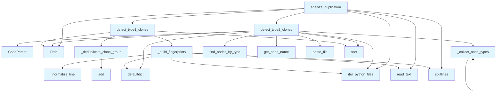

# File: `src/local_deepwiki/generators/analysis/duplication.py`

## File Overview

This file implements duplication detection logic for source code, identifying both **Type 1** (exact) and **Type 2** (structural) clones within a repository. It provides functionality to scan Python files, compute fingerprints for code blocks, and analyze the extent of code duplication.

The design avoids external dependencies like LLMs and instead relies purely on static analysis using line-based fingerprinting and AST node-type sequences for structural clone detection.

## Key Concepts

### Duplication Detection Types

1. **Type 1 Clones (Exact Clones)**:
   - Detected using a sliding window over normalized lines of code.
   - Uses hash-based fingerprinting to group identical or near-identical code blocks.
   - A block is considered a clone if it contains at least `min_lines` consecutive lines that match another block elsewhere.

2. **Type 2 Clones (Structural Clones)**:
   - Detected by comparing the AST node types of functions.
   - Uses tree-sitter AST parsing to extract function structures.
   - Groups functions with the same structural pattern, regardless of variable names or comments.

### Why These Approaches?

- **Line-based fingerprinting** for Type 1 clones is a well-established technique for detecting exact code reuse, especially useful for identifying copy-paste errors.
- **AST-based structural comparison** allows detecting semantically similar code that has been refactored (e.g., variable renaming), which line-based methods would miss.
- The use of `defaultdict` for grouping fingerprints and clone instances enables efficient aggregation and avoids explicit checks for key existence.
- The normalization of lines (stripping whitespace, ignoring comments) ensures that stylistic differences don't interfere with clone detection.

## Integration

This file is part of the `local_deepwiki.generators.analysis` module and integrates with:

- `local_deepwiki.core.parser.code_parser` to parse code into ASTs.
- `local_deepwiki.core.chunk_extractors` to identify function node types.
- `local_deepwiki.generators.analysis.source_filter` to enumerate Python files in a repository.
- `local_deepwiki.logging` for logging warnings during file reads.

It is used by test functions (`test_duplication`) that call:
- `detect_type1_clones`
- `detect_type2_clones`
- `analyze_duplication`

These functions are central to generating duplication reports as part of broader analysis tools, such as those found in:
- `src/local_deepwiki/generators/analysis/architecture_report.py`
- `src/local_deepwiki/generators/analysis/design_smells.py`
- `src/local_deepwiki/generators/analysis/health_scoring.py`

## Design Notes

### Handling Overlapping Clones

- The `_deduplicate_clone_group` function ensures that overlapping or duplicate clone instances are removed.
- This prevents inflated clone counts when multiple windows overlap in a file.

### File Reading and Error Handling

- When reading files, the code uses `errors="replace"` to avoid crashing on encoding issues.
- Any file that cannot be read is skipped with a warning, ensuring robustness in large repositories.

### Structural Clone Filtering

- Functions with fewer than `_MIN_AST_NODES` are ignored to avoid noise from very small code structures.
- This threshold prevents trivial matches from polluting clone groups.

### Hashing Strategy

- Hashes are truncated to 60 bits (`0xFFFFFFFFFFFFFFFF`) to prevent potential overflow and keep them within a reasonable size for reporting.
- This is a common practice in fingerprinting to maintain uniqueness while avoiding excessively large numbers.

### Line Normalization

- Comments and blank lines are ignored during fingerprinting to ensure that stylistic or documentation differences don't affect clone detection.
- This improves the signal-to-noise ratio in the detection process.

### Summary Statistics

- The `analyze_duplication` function computes useful metrics:
  - Total lines in the scanned codebase.
  - Number of duplicated lines.
  - Duplication ratio (percentage of lines duplicated).
  - Inter-file duplication ratio.
  - Largest clone group size.

These statistics provide actionable insights into the degree of code duplication in a project, useful for health scoring and refactor planning.

## API Reference

### Functions

#### `detect_type1_clones`

```python
def detect_type1_clones(repo_path: Path, min_lines: int = _MIN_CLONE_LINES, exclude_tests: bool = True) -> list[dict[str, Any]]
```

Detect exact code clones (Type 1) using line-based fingerprinting.


| Parameter | Type | Default | Description |
|-----------|------|---------|-------------|
| `repo_path` | `Path` | - | Root of the repository to scan. |
| `min_lines` | `int` | `_MIN_CLONE_LINES` | Minimum consecutive lines for a clone block. |
| `exclude_tests` | `bool` | `True` | Skip test files when True. |

**Returns:** `list[dict[str, Any]]`


<details>
<summary>View Source (lines 109-152) | <a href="https://github.com/UrbanDiver/local-deepwiki-mcp/blob/main/src/local_deepwiki/generators/analysis/duplication.py#L109-L152">GitHub</a></summary>

```python
def detect_type1_clones(
    repo_path: Path,
    *,
    min_lines: int = _MIN_CLONE_LINES,
    exclude_tests: bool = True,
) -> list[dict[str, Any]]:
    """Detect exact code clones (Type 1) using line-based fingerprinting.

    Args:
        repo_path: Root of the repository to scan.
        min_lines: Minimum consecutive lines for a clone block.
        exclude_tests: Skip test files when True.

    Returns:
        List of clone groups sorted by number of instances descending.
    """
    repo_path = Path(repo_path)
    fingerprints = _build_fingerprints(repo_path, min_lines, exclude_tests)

    # Filter to groups with 2+ instances and deduplicate overlapping windows
    clone_groups: list[dict[str, Any]] = []
    for fp_hash, instances in fingerprints.items():
        if len(instances) < 2:
            continue

        unique_instances = _deduplicate_clone_group(instances)
        if len(unique_instances) < 2:
            continue

        files_in_group = {inst["file"] for inst in unique_instances}
        scope = "intra_file" if len(files_in_group) == 1 else "inter_file"

        clone_groups.append(
            {
                "fingerprint": hex(fp_hash & 0xFFFFFFFFFFFFFFFF),
                "line_count": min_lines,
                "instances": unique_instances,
                "scope": scope,
            }
        )

    # Sort by number of instances descending
    clone_groups.sort(key=lambda g: len(g["instances"]), reverse=True)
    return clone_groups
```

</details>

#### `detect_type2_clones`

```python
def detect_type2_clones(repo_path: Path, exclude_tests: bool = True) -> list[dict[str, Any]]
```

Detect structural clones (Type 2) by comparing function AST structure.


| Parameter | Type | Default | Description |
|-----------|------|---------|-------------|
| `repo_path` | `Path` | - | Root of the repository to scan. |
| `exclude_tests` | `bool` | `True` | Skip test files when True. |

**Returns:** `list[dict[str, Any]]`


<details>
<summary>View Source (lines 155-225) | <a href="https://github.com/UrbanDiver/local-deepwiki-mcp/blob/main/src/local_deepwiki/generators/analysis/duplication.py#L155-L225">GitHub</a></summary>

```python
def detect_type2_clones(
    repo_path: Path,
    *,
    exclude_tests: bool = True,
) -> list[dict[str, Any]]:
    """Detect structural clones (Type 2) by comparing function AST structure.

    Args:
        repo_path: Root of the repository to scan.
        exclude_tests: Skip test files when True.

    Returns:
        List of clone groups sorted by group size descending.
    """
    repo_path = Path(repo_path)
    parser = CodeParser()
    files = iter_python_files(repo_path, exclude_tests=exclude_tests)

    # Build mapping: structural_hash -> list of function info dicts
    structural_groups: dict[int, list[dict[str, Any]]] = defaultdict(list)

    for full_path, rel_path in files:
        result = parser.parse_file(full_path)
        if result is None:
            continue

        root, language, source = result
        fn_types = FUNCTION_NODE_TYPES.get(language)
        if fn_types is None:
            continue

        fn_nodes = find_nodes_by_type(root, fn_types)
        for fn_node in fn_nodes:
            node_types = _collect_node_types(fn_node)
            if len(node_types) < _MIN_AST_NODES:
                continue

            struct_hash = hash(tuple(node_types))
            fn_name = get_node_name(fn_node, source, language) or "<anonymous>"
            structural_groups[struct_hash].append(
                {
                    "file": str(rel_path),
                    "function": fn_name,
                    "line": fn_node.start_point[0] + 1,
                    "node_count": len(node_types),
                }
            )

    # Filter to groups with 2+ members
    clone_groups: list[dict[str, Any]] = []
    for s_hash, instances in structural_groups.items():
        if len(instances) < 2:
            continue
        clone_groups.append(
            {
                "structural_hash": hex(s_hash & 0xFFFFFFFFFFFFFFFF),
                "node_count": instances[0]["node_count"],
                "instances": [
                    {
                        "file": inst["file"],
                        "function": inst["function"],
                        "line": inst["line"],
                    }
                    for inst in instances
                ],
            }
        )

    # Sort by group size descending
    clone_groups.sort(key=lambda g: len(g["instances"]), reverse=True)
    return clone_groups
```

</details>

#### `analyze_duplication`

```python
def analyze_duplication(repo_path: Path, min_lines: int = _MIN_CLONE_LINES, top_n: int = 20, exclude_tests: bool = True) -> dict[str, Any]
```

Run both detection types and compute summary statistics.


| Parameter | Type | Default | Description |
|-----------|------|---------|-------------|
| `repo_path` | `Path` | - | Root of the repository to scan. |
| `min_lines` | `int` | `_MIN_CLONE_LINES` | Minimum consecutive lines for Type 1 clones. |
| `top_n` | `int` | `20` | Maximum number of clone groups to return per type. |
| `exclude_tests` | `bool` | `True` | Skip test files when True. |

**Returns:** `dict[str, Any]`


<details>
<summary>View Source (lines 228-299) | <a href="https://github.com/UrbanDiver/local-deepwiki-mcp/blob/main/src/local_deepwiki/generators/analysis/duplication.py#L228-L299">GitHub</a></summary>

```python
def analyze_duplication(
    repo_path: Path,
    *,
    min_lines: int = _MIN_CLONE_LINES,
    top_n: int = 20,
    exclude_tests: bool = True,
) -> dict[str, Any]:
    """Run both detection types and compute summary statistics.

    Args:
        repo_path: Root of the repository to scan.
        min_lines: Minimum consecutive lines for Type 1 clones.
        top_n: Maximum number of clone groups to return per type.
        exclude_tests: Skip test files when True.

    Returns:
        Dict with status, clone groups, and summary stats.
    """
    repo_path = Path(repo_path)

    # Compute total source lines across all scanned files
    files = iter_python_files(repo_path, exclude_tests=exclude_tests)
    total_lines = 0
    for full_path, _rel_path in files:
        try:
            content = full_path.read_text(encoding="utf-8", errors="replace")
            total_lines += len(content.splitlines())
        except OSError:
            continue

    # Run both detectors
    type1_clones = detect_type1_clones(
        repo_path, min_lines=min_lines, exclude_tests=exclude_tests
    )
    type2_clones = detect_type2_clones(repo_path, exclude_tests=exclude_tests)

    # Compute duplicated lines:
    # Each instance contributes line_count lines, but one copy per group is "original"
    duplicated_lines = sum(
        group["line_count"] * (len(group["instances"]) - 1) for group in type1_clones
    )

    largest_clone_lines = max(
        (group["line_count"] for group in type1_clones), default=0
    )

    duplication_ratio = duplicated_lines / total_lines if total_lines > 0 else 0.0

    inter_file_type1 = [g for g in type1_clones if g.get("scope") == "inter_file"]
    inter_file_duplicated_lines = sum(
        group["line_count"] * (len(group["instances"]) - 1)
        for group in inter_file_type1
    )
    inter_file_ratio = (
        inter_file_duplicated_lines / total_lines if total_lines > 0 else 0.0
    )

    return {
        "status": "success",
        "type1_clones": type1_clones[:top_n],
        "type2_clones": type2_clones[:top_n],
        "stats": {
            "total_lines": total_lines,
            "duplicated_lines": duplicated_lines,
            "duplication_ratio": duplication_ratio,
            "inter_file_duplication_ratio": inter_file_ratio,
            "type1_clone_groups": len(type1_clones),
            "type2_clone_groups": len(type2_clones),
            "inter_file_clone_groups": len(inter_file_type1) + len(type2_clones),
            "largest_clone_lines": largest_clone_lines,
        },
    }
```

</details>

## Call Graph



## Used By

Functions and methods in this file and their callers:

- **[`CodeParser`](../../core/parser/code_parser.md)**: called by `detect_type2_clones`
- **`Path`**: called by `analyze_duplication`, `detect_type1_clones`, `detect_type2_clones`
- **`_build_fingerprints`**: called by `detect_type1_clones`
- **`_collect_node_types`**: called by `_collect_node_types`, `detect_type2_clones`
- **`_deduplicate_clone_group`**: called by `detect_type1_clones`
- **`_normalize_line`**: called by `_build_fingerprints`
- **`add`**: called by `_deduplicate_clone_group`
- **`defaultdict`**: called by `_build_fingerprints`, `detect_type2_clones`
- **`detect_type1_clones`**: called by `analyze_duplication`
- **`detect_type2_clones`**: called by `analyze_duplication`
- **[`find_nodes_by_type`](../../core/parser/ast_utils.md)**: called by `detect_type2_clones`
- **[`get_node_name`](../../core/parser/ast_utils.md)**: called by `detect_type2_clones`
- **[`iter_python_files`](source_filter.md)**: called by `_build_fingerprints`, `analyze_duplication`, `detect_type2_clones`
- **`parse_file`**: called by `detect_type2_clones`
- **`read_text`**: called by `_build_fingerprints`, `analyze_duplication`
- **`sort`**: called by `detect_type1_clones`, `detect_type2_clones`
- **`splitlines`**: called by `_build_fingerprints`, `analyze_duplication`

## Usage Examples

*Examples extracted from test files*

### Example: `duplication`

From `test_duplication.py::test_detect_type1_clones_finds_exact_duplicates`:

```python
from local_deepwiki.generators.analysis.duplication import detect_type1_clones

    _write_py(tmp_path / "src" / "a.py", _DUPLICATE_BLOCK + "\nx = 1\n")
    _write_py(tmp_path / "src" / "b.py", _DUPLICATE_BLOCK + "\ny = 2\n")
    clones = detect_type1_clones(tmp_path, min_lines=6)
    assert len(clones) >= 1
    assert clones[0]["line_count"] >= 6
```

### Example: `detect_type1_clones`

From `test_duplication.py::test_detect_type1_clones_finds_exact_duplicates`:

```python
from local_deepwiki.generators.analysis.duplication import detect_type1_clones

    _write_py(tmp_path / "src" / "a.py", _DUPLICATE_BLOCK + "\nx = 1\n")
    _write_py(tmp_path / "src" / "b.py", _DUPLICATE_BLOCK + "\ny = 2\n")
    clones = detect_type1_clones(tmp_path, min_lines=6)
    assert len(clones) >= 1
    assert clones[0]["line_count"] >= 6
```

### Example: `detect_type1_clones`

From `test_duplication.py::test_detect_type1_clones_no_duplicates`:

```python
from local_deepwiki.generators.analysis.duplication import detect_type1_clones

    _write_py(tmp_path / "src" / "a.py", "def foo():\n    return 1\n")
    _write_py(tmp_path / "src" / "b.py", "def bar():\n    return 2\n")
    clones = detect_type1_clones(tmp_path, min_lines=6)
    assert clones == []
```

### Example: `detect_type2_clones`

From `test_duplication.py::test_detect_type2_clones_finds_structural_duplicates`:

```python
from local_deepwiki.generators.analysis.duplication import detect_type2_clones

    # Two functions with same structure but different names/values
    _write_py(
        tmp_path / "src" / "a.py",
        """
def process_users(users):
    result = []
    for user in users:
        if user.is_active():
            name = user.get_name()
            result.append(name)
    return result

def process_orders(orders):
    result = []
    for order in orders:
        if order.is_valid():
            total = order.get_total()
            result.append(total)
    return result
""",
    )
    clones = detect_type2_clones(tmp_path)
    assert len(clones) >= 1
```

### Example: `detect_type2_clones`

From `test_duplication.py::test_detect_type2_clones_no_structural_duplicates`:

```python
from local_deepwiki.generators.analysis.duplication import detect_type2_clones

    _write_py(
        tmp_path / "src" / "a.py",
        """
def simple():
    return 1

def complex_fn(x, y, z):
    if x > 0:
        for i in range(y):
            z += i
    return z
""",
    )
    clones = detect_type2_clones(tmp_path)
    # These have different structures, should not be grouped
    assert all(len(c["instances"]) < 2 for c in clones) if clones else True
```


## Last Modified

| Entity | Type | Author | Date | Commit |
|--------|------|--------|------|--------|
| `analyze_duplication` | function | Brian Breidenbach | today | `8a348c8` fix: tune scoring penalties... |
| `detect_type1_clones` | function | Brian Breidenbach | today | `eb1bd6e` feat: separate intra-file f... |
| `_build_fingerprints` | function | Brian Breidenbach | today | `a75af5c` refactor: extract helpers f... |
| `_deduplicate_clone_group` | function | Brian Breidenbach | today | `a75af5c` refactor: extract helpers f... |
| `_normalize_line` | function | Brian Breidenbach | today | `75290fc` feat: add clone detection e... |
| `_collect_node_types` | function | Brian Breidenbach | today | `75290fc` feat: add clone detection e... |
| `detect_type2_clones` | function | Brian Breidenbach | today | `75290fc` feat: add clone detection e... |

## Additional Source Code

Source code for functions and methods not listed in the API Reference above.

#### `_normalize_line`

<details>
<summary>View Source (lines 26-37) | <a href="https://github.com/UrbanDiver/local-deepwiki-mcp/blob/main/src/local_deepwiki/generators/analysis/duplication.py#L26-L37">GitHub</a></summary>

```python
def _normalize_line(line: str) -> str | None:
    """Normalize a source line for fingerprinting.

    Strips leading/trailing whitespace, returns None for blank lines
    and comment-only lines.
    """
    stripped = line.strip()
    if not stripped:
        return None
    if stripped.startswith("#"):
        return None
    return stripped
```

</details>


#### `_collect_node_types`

<details>
<summary>View Source (lines 40-45) | <a href="https://github.com/UrbanDiver/local-deepwiki-mcp/blob/main/src/local_deepwiki/generators/analysis/duplication.py#L40-L45">GitHub</a></summary>

```python
def _collect_node_types(node: Any) -> list[str]:
    """Walk all descendants depth-first and collect node type strings."""
    types: list[str] = [node.type]
    for child in node.children:
        types.extend(_collect_node_types(child))
    return types
```

</details>


#### `_build_fingerprints`

<details>
<summary>View Source (lines 48-92) | <a href="https://github.com/UrbanDiver/local-deepwiki-mcp/blob/main/src/local_deepwiki/generators/analysis/duplication.py#L48-L92">GitHub</a></summary>

```python
def _build_fingerprints(
    repo_path: Path,
    min_lines: int,
    exclude_tests: bool,
) -> dict[int, list[dict[str, Any]]]:
    """Build hash -> location mapping from all files.

    Reads each file, normalizes lines, and computes sliding-window hashes.
    Returns a dict mapping fingerprint hash to list of location dicts.
    """
    files = iter_python_files(repo_path, exclude_tests=exclude_tests)
    fingerprints: dict[int, list[dict[str, Any]]] = defaultdict(list)

    for full_path, rel_path in files:
        try:
            content = full_path.read_text(encoding="utf-8", errors="replace")
        except OSError:
            logger.warning("Cannot read %s, skipping", full_path)
            continue

        raw_lines = content.splitlines()

        # Build list of (original_line_number, normalized_text)
        normalized: list[tuple[int, str]] = []
        for i, line in enumerate(raw_lines, start=1):
            norm = _normalize_line(line)
            if norm is not None:
                normalized.append((i, norm))

        if len(normalized) < min_lines:
            continue

        # Sliding window over normalized lines
        for start_idx in range(len(normalized) - min_lines + 1):
            window = normalized[start_idx : start_idx + min_lines]
            key = hash(tuple(entry[1] for entry in window))
            fingerprints[key].append(
                {
                    "file": str(rel_path),
                    "start_line": window[0][0],
                    "end_line": window[-1][0],
                }
            )

    return fingerprints
```

</details>


#### `_deduplicate_clone_group`

<details>
<summary>View Source (lines 95-106) | <a href="https://github.com/UrbanDiver/local-deepwiki-mcp/blob/main/src/local_deepwiki/generators/analysis/duplication.py#L95-L106">GitHub</a></summary>

```python
def _deduplicate_clone_group(
    instances: list[dict[str, Any]],
) -> list[dict[str, Any]]:
    """Remove overlapping windows from a clone group, return unique instances."""
    seen: set[tuple[str, int]] = set()
    unique: list[dict[str, Any]] = []
    for inst in instances:
        loc = (inst["file"], inst["start_line"])
        if loc not in seen:
            seen.add(loc)
            unique.append(inst)
    return unique
```

</details>

## Relevant Source Files

- `src/local_deepwiki/generators/analysis/duplication.py:26-37`
