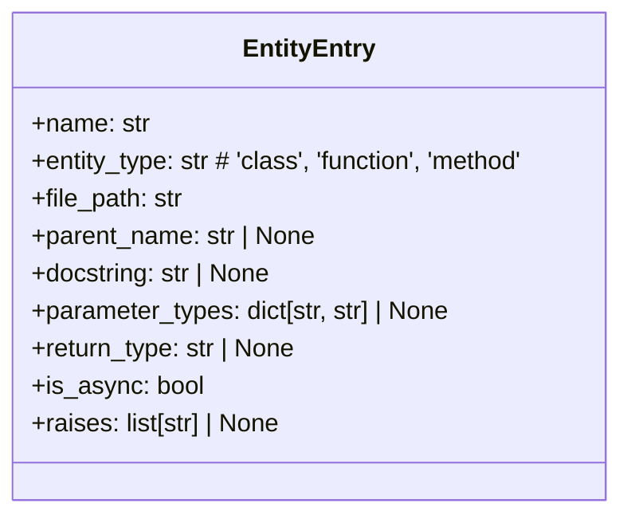
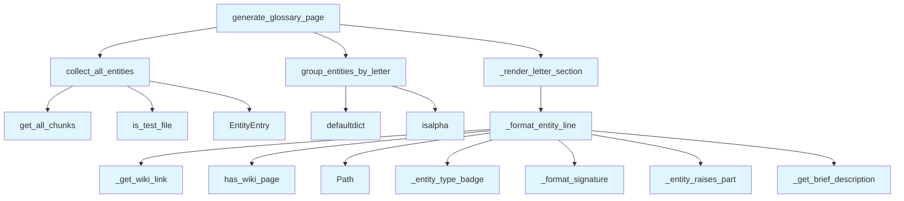

# Glossary Generator Module

## File Overview

This module is responsible for generating a comprehensive glossary and index page for wiki documentation. It collects all classes, functions, and methods from the codebase, organizes them alphabetically, and formats them into a navigable markdown document with collapsible sections.

The design rationale centers on creating a user-friendly index that helps developers quickly locate and understand code entities. The module leverages vector store data to extract metadata such as parameter types, return types, and exception information, providing rich context in the generated documentation.

## Key Concepts

### Entity Collection and Metadata Extraction
The `collect_all_entities` function uses bulk chunk-type queries to efficiently gather all code entities (classes, functions, methods) from the vector store. It filters out test files and extracts rich metadata including parameter types, return types, async status, and exception information.

### Alphabetical Grouping and Formatting
Entities are grouped by their first letter using `group_entities_by_letter`, which handles non-alphabetic characters by grouping them under "#". This enables a clean, navigable alphabetical index structure.

### Signature Formatting and Display
The `_format_signature` function creates compact, readable signatures that show parameter types and return types, with truncation for functions with many parameters. This provides essential information at a glance without cluttering the display.

### Markdown Rendering with Collapsible Sections
The `_render_letter_section` function uses HTML `<details>` elements to create collapsible sections, making the glossary page manageable even with large codebases. The `generate_glossary_page` function orchestrates the full page generation, including navigation links and summary statistics.

## Integration

This module integrates with the core indexing and vector store systems through the [`IndexStatus`](../../models/wiki.md) and [`VectorStore`](../../core/vectorstore/store.md) dependencies. It's used by the `lazy_generator` and `test_glossary` modules, indicating its role in both automated documentation generation and testing.

The module's functions are designed to work with the existing chunking and metadata system, making minimal assumptions about the underlying data structure. It relies on the [`ChunkType`](../../models/foundation.md) enum and [`IndexStatusManager`](../../core/index_manager.md) for type safety and status tracking.

## Design Notes

### Performance Considerations
The module uses bulk queries (`vector_store.get_all_chunks(chunk_type=entity_type_str)`) instead of per-file queries to minimize database round trips, optimizing performance for large codebases.

### Metadata Handling
The code handles various metadata fields gracefully, including optional fields like `docstring`, `parameter_types`, and `raises`. It uses default values and safe access patterns to avoid runtime errors when metadata is missing.

### User Experience
The generated glossary page includes:
- Quick navigation links to each letter section
- Summary statistics (total entities, counts by type)
- Expand/collapse functionality for large sections
- Visual indicators for entity types and async status
- Exception warnings for functions that raise exceptions

### Edge Case Handling
- Non-alphabetic entity names are grouped under "#"
- Empty docstrings or brief descriptions are handled gracefully
- Functions with many parameters show truncation indicators
- Test files are automatically filtered out
- Wiki page links are only included when a corresponding wiki page exists

The module's design prioritizes maintainability and extensibility, with clear separation of concerns between data collection, formatting, and rendering logic.

## API Reference

### class `EntityEntry`

An entry in the glossary.

---


<details>
<summary>View Source (lines 16-29) | <a href="https://github.com/UrbanDiver/local-deepwiki-mcp/blob/main/src/local_deepwiki/generators/analysis/glossary.py#L16-L29">GitHub</a></summary>

```python
class EntityEntry:
    """An entry in the glossary."""

    name: str
    entity_type: str  # 'class', 'function', 'method'
    file_path: str
    parent_name: str | None = None
    docstring: str | None = None
    # Type annotation metadata
    parameter_types: dict[str, str] | None = None
    return_type: str | None = None
    is_async: bool = False
    # Exception metadata
    raises: list[str] | None = None
```

</details>

### Functions

#### `collect_all_entities`

```python
async def collect_all_entities(index_status: IndexStatus, vector_store: VectorStore) -> list[EntityEntry]
```

Collect all classes, functions, and methods from the codebase.


| Parameter | Type | Default | Description |
|-----------|------|---------|-------------|
| `index_status` | `IndexStatus` | - | Index status with file information. |
| `vector_store` | `VectorStore` | - | Vector store with code chunks. |

**Returns:** `list[EntityEntry]`


<details>
<summary>View Source (lines 32-85) | <a href="https://github.com/UrbanDiver/local-deepwiki-mcp/blob/main/src/local_deepwiki/generators/analysis/glossary.py#L32-L85">GitHub</a></summary>

```python
async def collect_all_entities(
    index_status: IndexStatus,
    vector_store: VectorStore,
) -> list[EntityEntry]:
    """Collect all classes, functions, and methods from the codebase.

    Args:
        index_status: Index status with file information.
        vector_store: Vector store with code chunks.

    Returns:
        List of EntityEntry objects sorted alphabetically by name.
    """
    entities: list[EntityEntry] = []

    # Use bulk chunk-type queries (3 queries) instead of N per-file queries
    type_to_entity = {
        "class": ChunkType.CLASS,
        "function": ChunkType.FUNCTION,
        "method": ChunkType.METHOD,
    }

    for entity_type_str, chunk_type_enum in type_to_entity.items():
        for chunk in vector_store.get_all_chunks(chunk_type=entity_type_str):
            if is_test_file(chunk.file_path):
                continue
            metadata = chunk.metadata or {}
            param_types = metadata.get("parameter_types")
            return_type = metadata.get("return_type")
            is_async = metadata.get("is_async", False)
            raises = metadata.get("raises")

            entry_kwargs: dict = {
                "name": chunk.name or "Unknown",
                "entity_type": entity_type_str,
                "file_path": chunk.file_path,
                "docstring": chunk.docstring,
            }

            if entity_type_str in ("function", "method"):
                entry_kwargs.update(
                    parameter_types=param_types,
                    return_type=return_type,
                    is_async=is_async,
                    raises=raises,
                )
            if entity_type_str == "method":
                entry_kwargs["parent_name"] = chunk.parent_name

            entities.append(EntityEntry(**entry_kwargs))

    # Sort alphabetically by name (case-insensitive)
    entities = sorted(entities, key=lambda e: e.name.lower())
    return entities
```

</details>

#### `group_entities_by_letter`

```python
def group_entities_by_letter(entities: list[EntityEntry]) -> dict[str, list[EntityEntry]]
```

Group entities by their first letter.


| Parameter | Type | Default | Description |
|-----------|------|---------|-------------|
| `entities` | `list[EntityEntry]` | - | List of entities (should be pre-sorted). |

**Returns:** `dict[str, list[EntityEntry]]`


<details>
<summary>View Source (lines 88-107) | <a href="https://github.com/UrbanDiver/local-deepwiki-mcp/blob/main/src/local_deepwiki/generators/analysis/glossary.py#L88-L107">GitHub</a></summary>

```python
def group_entities_by_letter(
    entities: list[EntityEntry],
) -> dict[str, list[EntityEntry]]:
    """Group entities by their first letter.

    Args:
        entities: List of entities (should be pre-sorted).

    Returns:
        Dictionary mapping letter to list of entities.
    """
    grouped: dict[str, list[EntityEntry]] = defaultdict(list)

    for entity in entities:
        first_char = entity.name[0].upper() if entity.name else "#"
        if not first_char.isalpha():
            first_char = "#"  # Group non-alphabetic under #
        grouped[first_char].append(entity)

    return grouped
```

</details>

#### `generate_glossary_page`

```python
async def generate_glossary_page(index_status: IndexStatus, vector_store: VectorStore) -> str | None
```

Generate the glossary/index page content.


| Parameter | Type | Default | Description |
|-----------|------|---------|-------------|
| `index_status` | `IndexStatus` | - | Index status with file information. |
| `vector_store` | `VectorStore` | - | Vector store with code chunks. |

**Returns:** `str | None`


<details>
<summary>View Source (lines 250-309) | <a href="https://github.com/UrbanDiver/local-deepwiki-mcp/blob/main/src/local_deepwiki/generators/analysis/glossary.py#L250-L309">GitHub</a></summary>

```python
async def generate_glossary_page(
    index_status: IndexStatus,
    vector_store: VectorStore,
) -> str | None:
    """Generate the glossary/index page content.

    Args:
        index_status: Index status with file information.
        vector_store: Vector store with code chunks.

    Returns:
        Markdown content for the glossary page, or None if no entities found.
    """
    entities = await collect_all_entities(index_status, vector_store)

    if not entities:
        return None

    grouped = group_entities_by_letter(entities)
    letters = sorted(grouped.keys())

    class_count = sum(1 for e in entities if e.entity_type == "class")
    func_count = sum(1 for e in entities if e.entity_type == "function")
    method_count = sum(1 for e in entities if e.entity_type == "method")

    nav_links = " | ".join(f"[{letter}](#{letter.lower()})" for letter in letters)

    lines = [
        "# Glossary",
        "",
        "Alphabetical index of all classes, functions, and methods in the codebase.",
        "",
        f"**Quick Navigation:** {nav_links}",
        "",
        f"**Total:** {len(entities)} entities "
        f"({class_count} classes, {func_count} functions, {method_count} methods)",
        "",
        "---",
        "",
        "<p>"
        '<a href="#" onclick="document.querySelectorAll(\'details\').forEach(d=>d.open=true);return false">Expand All</a>'
        " | "
        '<a href="#" onclick="document.querySelectorAll(\'details\').forEach(d=>d.open=false);return false">Collapse All</a>'
        "</p>",
        "",
    ]

    for letter in letters:
        lines.extend(_render_letter_section(letter, grouped[letter]))

    lines.extend(
        [
            "---",
            "",
            "**Legend:** 🔷 Class | 🔹 Function | ▪️ Method | ⚡ Async | ⚠️ Raises exceptions",
            "",
        ]
    )

    return "\n".join(lines)
```

</details>

## Class Diagram



## Call Graph



## Used By

Functions and methods in this file and their callers:

- **`EntityEntry`**: called by `collect_all_entities`
- **`Path`**: called by `_format_entity_line`
- **`_entity_raises_part`**: called by `_format_entity_line`
- **`_entity_type_badge`**: called by `_format_entity_line`
- **`_format_entity_line`**: called by `_render_letter_section`
- **`_format_signature`**: called by `_format_entity_line`
- **`_get_brief_description`**: called by `_format_entity_line`
- **`_get_wiki_link`**: called by `_format_entity_line`
- **`_render_letter_section`**: called by `generate_glossary_page`
- **`collect_all_entities`**: called by `generate_glossary_page`
- **`defaultdict`**: called by `group_entities_by_letter`
- **`get_all_chunks`**: called by `collect_all_entities`
- **`group_entities_by_letter`**: called by `generate_glossary_page`
- **[`has_wiki_page`](../wiki/utils.md)**: called by `_format_entity_line`
- **[`is_test_file`](source_filter.md)**: called by `collect_all_entities`
- **`isalpha`**: called by `group_entities_by_letter`

## Usage Examples

*Examples extracted from test files*

### Test creating a function entry

From `test_glossary.py::TestEntityEntry::test_creates_function_entry`:

```python
entry = EntityEntry(
    name="my_function",
    entity_type="function",
    file_path="src/module.py",
)
assert entry.name == "my_function"
assert entry.entity_type == "function"
```

### Test creating a method entry with parent class

From `test_glossary.py::TestEntityEntry::test_creates_method_entry_with_parent`:

```python
entry = EntityEntry(
    name="my_method",
    entity_type="method",
    file_path="src/module.py",
    parent_name="MyClass",
    docstring="A method docstring.",
)
assert entry.parent_name == "MyClass"
assert entry.docstring == "A method docstring."
```

### Test that entities are grouped by first letter

From `test_glossary.py::TestGroupEntitiesByLetter::test_groups_alphabetically`:

```python
entities = [
    EntityEntry("apple", "function", "a.py"),
    EntityEntry("apricot", "function", "a.py"),
    EntityEntry("banana", "class", "b.py"),
]
grouped = group_entities_by_letter(entities)
assert "A" in grouped
assert "B" in grouped
assert len(grouped["A"]) == 2
assert len(grouped["B"]) == 1
```

### Test that grouping is case-insensitive

From `test_glossary.py::TestGroupEntitiesByLetter::test_case_insensitive_grouping`:

```python
entities = [
    EntityEntry("Apple", "function", "a.py"),
    EntityEntry("apple", "function", "a.py"),
]
grouped = group_entities_by_letter(entities)
assert "A" in grouped
assert len(grouped["A"]) == 2
```

### Test returns empty string for None docstring

From `test_glossary.py::TestGetBriefDescription::test_returns_empty_for_none`:

```python
assert _get_brief_description(None) == ""
```


## Last Modified

| Entity | Type | Author | Date | Commit |
|--------|------|--------|------|--------|
| `_entity_type_badge` | function | Brian Breidenbach | 2 days ago | `1a11306` refactor: decompose CC > 15... |
| `_entity_raises_part` | function | Brian Breidenbach | 2 days ago | `1a11306` refactor: decompose CC > 15... |
| `_format_entity_line` | function | Brian Breidenbach | 2 days ago | `1a11306` refactor: decompose CC > 15... |
| `_render_letter_section` | function | Brian Breidenbach | 2 days ago | `1a11306` refactor: decompose CC > 15... |
| `generate_glossary_page` | function | Brian Breidenbach | 2 days ago | `1a11306` refactor: decompose CC > 15... |
| `collect_all_entities` | function | Brian Breidenbach | 2 weeks ago | `39c02f1` fix: filter test entities f... |
| `group_entities_by_letter` | function | Brian Breidenbach | Feb 20, 2026 | `fdff11b` refactor: apply Pythonic id... |
| `EntityEntry` | class | Brian Breidenbach | Jan 16, 2026 | `202b96d` Add exception documentation... |
| `_format_signature` | function | Brian Breidenbach | Jan 16, 2026 | `ce066c4` Add type annotation extract... |
| `_get_brief_description` | function | Brian Breidenbach | Jan 16, 2026 | `8d2ab68` Add inheritance trees, glos... |

## Additional Source Code

Source code for functions and methods not listed in the API Reference above.

#### `_get_brief_description`

<details>
<summary>View Source (lines 113-138) | <a href="https://github.com/UrbanDiver/local-deepwiki-mcp/blob/main/src/local_deepwiki/generators/analysis/glossary.py#L113-L138">GitHub</a></summary>

```python
def _get_brief_description(docstring: str | None, max_length: int = 60) -> str:
    """Extract a brief description from a docstring.

    Args:
        docstring: Full docstring or None.
        max_length: Maximum length of the description.

    Returns:
        Brief description string.
    """
    if not docstring:
        return ""

    # Get first line
    first_line = docstring.split("\n")[0].strip()

    # Remove common prefixes
    for prefix in ["Args:", "Returns:", "Raises:", "Example:", "Note:"]:
        if first_line.startswith(prefix):
            return ""

    # Truncate if needed
    if len(first_line) > max_length:
        return first_line[: max_length - 3] + "..."

    return first_line
```

</details>


#### `_format_signature`

<details>
<summary>View Source (lines 141-180) | <a href="https://github.com/UrbanDiver/local-deepwiki-mcp/blob/main/src/local_deepwiki/generators/analysis/glossary.py#L141-L180">GitHub</a></summary>

```python
def _format_signature(entity: EntityEntry, max_params: int = 3) -> str:
    """Format a compact function/method signature showing types.

    Args:
        entity: The entity entry with type information.
        max_params: Maximum number of parameters to show before truncating.

    Returns:
        Formatted signature string like "(x: int, y: str) -> bool" or empty string.
    """
    if entity.entity_type == "class":
        return ""

    parts = []

    # Format parameters
    if entity.parameter_types:
        param_strs = []
        param_items = list(entity.parameter_types.items())
        shown_params = param_items[:max_params]
        remaining = len(param_items) - max_params

        for name, type_hint in shown_params:
            if type_hint:
                param_strs.append(f"{name}: {type_hint}")
            else:
                param_strs.append(name)

        if remaining > 0:
            param_strs.append(f"...+{remaining}")

        parts.append(f"({', '.join(param_strs)})")
    else:
        parts.append("(...)")

    # Add return type
    if entity.return_type:
        parts.append(f" → {entity.return_type}")

    return "".join(parts)
```

</details>


#### `_entity_type_badge`

<details>
<summary>View Source (lines 190-194) | <a href="https://github.com/UrbanDiver/local-deepwiki-mcp/blob/main/src/local_deepwiki/generators/analysis/glossary.py#L190-L194">GitHub</a></summary>

```python
def _entity_type_badge(entity: "EntityEntry") -> str:
    """Return the type badge string (with async marker if applicable)."""
    base_badge = _TYPE_BADGES.get(entity.entity_type, "")
    async_marker = "⚡" if entity.is_async else ""
    return f"{base_badge}{async_marker}"
```

</details>


#### `_entity_raises_part`

<details>
<summary>View Source (lines 197-204) | <a href="https://github.com/UrbanDiver/local-deepwiki-mcp/blob/main/src/local_deepwiki/generators/analysis/glossary.py#L197-L204">GitHub</a></summary>

```python
def _entity_raises_part(entity: "EntityEntry") -> str:
    """Return a raises indicator string, or empty string if no raises."""
    if not entity.raises:
        return ""
    exc_list = ", ".join(entity.raises[:3])
    if len(entity.raises) > 3:
        exc_list += f", +{len(entity.raises) - 3}"
    return f" ⚠️`{exc_list}`"
```

</details>


#### `_format_entity_line`

<details>
<summary>View Source (lines 207-231) | <a href="https://github.com/UrbanDiver/local-deepwiki-mcp/blob/main/src/local_deepwiki/generators/analysis/glossary.py#L207-L231">GitHub</a></summary>

```python
def _format_entity_line(entity: "EntityEntry") -> str:
    """Render a single glossary entry as a markdown list item."""
    if entity.entity_type == "method" and entity.parent_name:
        display_name = f"{entity.parent_name}.{entity.name}"
    else:
        display_name = entity.name

    wiki_link = (
        _get_wiki_link(entity.file_path) if has_wiki_page(entity.file_path) else ""
    )
    file_name = Path(entity.file_path).name
    type_badge = _entity_type_badge(entity)
    signature = _format_signature(entity)
    sig_part = f" `{signature}`" if signature else ""
    raises_part = _entity_raises_part(entity)
    desc = _get_brief_description(entity.docstring)
    desc_part = f" - {desc}" if desc else ""

    if wiki_link:
        name_part = f"**[`{display_name}`]({wiki_link})**"
    else:
        name_part = f"**`{display_name}`**"
    return (
        f"- {type_badge} {name_part}{sig_part}{raises_part} (`{file_name}`){desc_part}"
    )
```

</details>


#### `_render_letter_section`

<details>
<summary>View Source (lines 234-247) | <a href="https://github.com/UrbanDiver/local-deepwiki-mcp/blob/main/src/local_deepwiki/generators/analysis/glossary.py#L234-L247">GitHub</a></summary>

```python
def _render_letter_section(
    letter: str, letter_entities: list["EntityEntry"]
) -> list[str]:
    """Render a collapsible <details> section for one letter group."""
    count = len(letter_entities)
    section: list[str] = [
        f'<details id="{letter.lower()}" markdown="1">',
        f"<summary><strong>{letter}</strong> — {count} entities</summary>",
        "",
    ]
    for entity in letter_entities:
        section.append(_format_entity_line(entity))
    section.extend(["", "</details>", ""])
    return section
```

</details>

## Relevant Source Files

- `src/local_deepwiki/generators/analysis/glossary.py:16-29`
