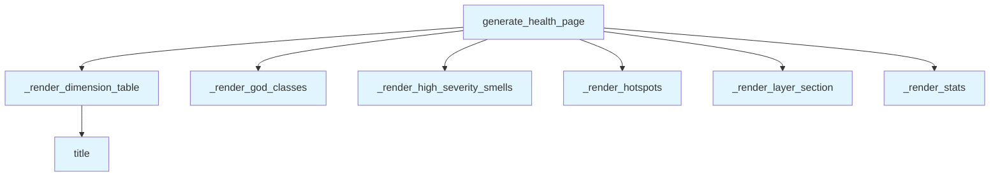

# File: `src/local_deepwiki/generators/analysis/health_page.py`

## File Overview

This file is responsible for rendering architecture health analysis results into a structured markdown page. It takes a dictionary of health data — typically produced by the `analyze_architecture_health()` function — and formats it into a human-readable report that includes an overall grade, dimension scores, codebase statistics, and a summary of key findings such as complexity hotspots, design smells, god classes, and layer violations.

The module is designed to be a pure computation component with no external dependencies, LLM calls, or async operations. Its primary purpose is to transform structured data into a presentation-ready markdown format.

## Key Concepts

### Data Transformation
The core abstraction in this file is the transformation of a flat dictionary structure (`health_data`) into a hierarchical markdown document. This is achieved through a series of helper functions that each handle a specific section of the report.

Each rendering function (`_render_*`) is responsible for appending markdown content to a shared list of lines. This pattern allows for a clean separation of concerns and makes the code easy to test and extend.

### Markdown Generation
The module leverages a simple but effective markdown generation strategy:
- Tables are used for structured data like dimension scores and hotspots.
- Lists are used for unstructured or semi-structured findings like design smells and layer violations.
- Headings and emphasis are used to provide clear visual hierarchy and readability.

This approach avoids complex templating and keeps the rendering logic straightforward and predictable.

### Section Organization
The architecture health report is organized into logical sections:
1. **Overall Grade**: A summary of the health score.
2. **Scores by Dimension**: Per-dimension breakdown of scores and grades.
3. **Codebase Stats**: High-level metrics about the scanned codebase.
4. **Top Findings**: Detailed breakdown of specific issues:
   - Complexity Hotspots
   - High-Severity Design Smells
   - God Classes
   - Layer Violations

This organization allows users to quickly assess the health of the system and drill down into specific issues.

## Integration

This file is part of the `local_deepwiki` codebase and is used to generate documentation or reports for architecture health analysis. Based on the usage context:

- It is called by `generate_health_page`, which is itself invoked by `test_health_page`. This suggests it is used in test environments to validate the output of the health analysis.
- The `_render_stats` function is also used by `hotspots_page`, indicating that the stats rendering logic is shared across different report types.

The module is not directly imported by any other module in the provided code; it is intended to be used as a utility for rendering health analysis data into markdown. The functions are designed to be reusable and composable, supporting a modular documentation generation pipeline.

## Design Notes

### Handling Empty Data
Each rendering function checks whether its input data is empty before proceeding. This is a defensive design choice to ensure that the output is clean and does not include empty sections, which would be visually unappealing or confusing.

### Hotspot Row Limiting
The `_render_hotspots` function limits the number of displayed hotspots to `_MAX_HOTSPOT_ROWS`. This is a practical design choice to prevent overly long reports, ensuring that the output remains readable and not cluttered with excessive data.

### Markdown Consistency
The module maintains consistent formatting across all rendered sections:
- Tables use consistent markdown syntax with headers and separators.
- Lists are indented and spaced for readability.
- Emphasis is used consistently for file paths, function names, and entity names.

This consistency improves the user experience by ensuring that the rendered markdown is predictable and professional in appearance.

### No External Dependencies
The module avoids external dependencies, LLM calls, or async operations. This design choice ensures that it can be used reliably in any environment where health data is available, without needing network access or complex setup.

## API Reference

### Functions

#### `generate_health_page`

```python
def generate_health_page(health_data: dict) -> str | None
```

Render architecture health dict as markdown.


| Parameter | Type | Default | Description |
|-----------|------|---------|-------------|
| `health_data` | `dict` | - | Dict returned by ``analyze_architecture_health()``. |

**Returns:** `str | None`


<details>
<summary>View Source (lines 14-42) | <a href="https://github.com/UrbanDiver/local-deepwiki-mcp/blob/main/src/local_deepwiki/generators/analysis/health_page.py#L14-L42">GitHub</a></summary>

```python
def generate_health_page(health_data: dict) -> str | None:
    """Render architecture health dict as markdown.

    Args:
        health_data: Dict returned by ``analyze_architecture_health()``.

    Returns:
        Markdown string, or ``None`` if the data is empty / unusable.
    """
    overall = health_data.get("overall")
    if not overall:
        return None

    lines: list[str] = []
    lines.append("# Architecture Health")
    lines.append("")
    lines.append(f"**Overall Grade: {overall['grade']} ({overall['score']:.0f}/100)**")
    lines.append("")

    _render_dimension_table(lines, overall.get("dimensions", {}))
    _render_stats(lines, health_data.get("stats", {}))

    findings = health_data.get("top_findings", {})
    _render_hotspots(lines, findings.get("hotspots", []))
    _render_high_severity_smells(lines, findings.get("high_severity_smells", []))
    _render_god_classes(lines, findings.get("god_classes", []))
    _render_layer_section(lines, findings.get("layer_violations", []))

    return "\n".join(lines)
```

</details>

## Call Graph



## Used By

Functions and methods in this file and their callers:

- **`_render_dimension_table`**: called by `generate_health_page`
- **`_render_god_classes`**: called by `generate_health_page`
- **`_render_high_severity_smells`**: called by `generate_health_page`
- **`_render_hotspots`**: called by `generate_health_page`
- **`_render_layer_section`**: called by `generate_health_page`
- **`_render_stats`**: called by `generate_health_page`
- **`title`**: called by `_render_dimension_table`

## Usage Examples

*Examples extracted from test files*

### Example: `health_page`

From `test_health_page.py::test_generate_health_page_returns_markdown`:

```python
result = generate_health_page(mock_health_data)
    assert result is not None
    assert "# Architecture Health" in result
    assert "**C**" in result or "C" in result
```

### Example: `generate_health_page`

From `test_health_page.py::test_generate_health_page_returns_markdown`:

```python
result = generate_health_page(mock_health_data)
    assert result is not None
    assert "# Architecture Health" in result
    assert "**C**" in result or "C" in result
```

### Example: `generate_health_page`

From `test_health_page.py::test_generate_health_page_includes_dimension_table`:

```python
result = generate_health_page(mock_health_data)
    assert "| Dimension" in result
    assert "67.2" in result
    assert "44.2" in result
```


## Last Modified

| Entity | Type | Author | Date | Commit |
|--------|------|--------|------|--------|
| `generate_health_page` | function | Brian Breidenbach | 1 week ago | `e346d81` feat: add Architecture Heal... |
| `_render_dimension_table` | function | Brian Breidenbach | 1 week ago | `e346d81` feat: add Architecture Heal... |
| `_render_stats` | function | Brian Breidenbach | 1 week ago | `e346d81` feat: add Architecture Heal... |
| `_render_hotspots` | function | Brian Breidenbach | 1 week ago | `e346d81` feat: add Architecture Heal... |
| `_render_high_severity_smells` | function | Brian Breidenbach | 1 week ago | `e346d81` feat: add Architecture Heal... |
| `_render_god_classes` | function | Brian Breidenbach | 1 week ago | `e346d81` feat: add Architecture Heal... |
| `_render_layer_section` | function | Brian Breidenbach | 1 week ago | `e346d81` feat: add Architecture Heal... |

## Additional Source Code

Source code for functions and methods not listed in the API Reference above.

#### `_render_dimension_table`

<details>
<summary>View Source (lines 45-56) | <a href="https://github.com/UrbanDiver/local-deepwiki-mcp/blob/main/src/local_deepwiki/generators/analysis/health_page.py#L45-L56">GitHub</a></summary>

```python
def _render_dimension_table(lines: list[str], dims: dict) -> None:
    """Append a scores-by-dimension markdown table."""
    if not dims:
        return

    lines.append("## Scores by Dimension")
    lines.append("")
    lines.append("| Dimension | Score | Grade |")
    lines.append("|-----------|-------|-------|")
    for name, dim in dims.items():
        lines.append(f"| {name.title()} | {dim['score']:.1f} | {dim['grade']} |")
    lines.append("")
```

</details>


#### `_render_stats`

<details>
<summary>View Source (lines 59-69) | <a href="https://github.com/UrbanDiver/local-deepwiki-mcp/blob/main/src/local_deepwiki/generators/analysis/health_page.py#L59-L69">GitHub</a></summary>

```python
def _render_stats(lines: list[str], stats: dict) -> None:
    """Append codebase statistics."""
    if not stats:
        return

    lines.append("## Codebase Stats")
    lines.append("")
    lines.append(f"- **Total lines:** {stats.get('total_lines', 0):,}")
    lines.append(f"- **Total functions:** {stats.get('total_functions', 0):,}")
    lines.append(f"- **Files scanned:** {stats.get('files_scanned', 0):,}")
    lines.append("")
```

</details>


#### `_render_hotspots`

<details>
<summary>View Source (lines 72-88) | <a href="https://github.com/UrbanDiver/local-deepwiki-mcp/blob/main/src/local_deepwiki/generators/analysis/health_page.py#L72-L88">GitHub</a></summary>

```python
def _render_hotspots(lines: list[str], hotspots: list[dict]) -> None:
    """Append complexity hotspot table."""
    if not hotspots:
        return

    lines.append("## Complexity Hotspots")
    lines.append("")
    lines.append("| Function | File | CC | Lines | Params |")
    lines.append("|----------|------|----|-------|--------|")
    for h in hotspots[:_MAX_HOTSPOT_ROWS]:
        d = h.get("details", {})
        lines.append(
            f"| `{h['function']}` | `{h['file']}:{h['line']}` "
            f"| {d.get('cyclomatic', '')} | {d.get('length', '')} "
            f"| {d.get('params', '')} |"
        )
    lines.append("")
```

</details>


#### `_render_high_severity_smells`

<details>
<summary>View Source (lines 91-103) | <a href="https://github.com/UrbanDiver/local-deepwiki-mcp/blob/main/src/local_deepwiki/generators/analysis/health_page.py#L91-L103">GitHub</a></summary>

```python
def _render_high_severity_smells(lines: list[str], smells: list[dict]) -> None:
    """Append high-severity design smell list."""
    if not smells:
        return

    lines.append("## High-Severity Design Smells")
    lines.append("")
    for s in smells:
        lines.append(
            f"- **{s['entity']}** in `{s['file']}:{s['line']}` "
            f"({s['type']}) -- {s['description']}"
        )
    lines.append("")
```

</details>


#### `_render_god_classes`

<details>
<summary>View Source (lines 106-118) | <a href="https://github.com/UrbanDiver/local-deepwiki-mcp/blob/main/src/local_deepwiki/generators/analysis/health_page.py#L106-L118">GitHub</a></summary>

```python
def _render_god_classes(lines: list[str], god_classes: list[dict]) -> None:
    """Append god class list."""
    if not god_classes:
        return

    lines.append("## God Classes")
    lines.append("")
    for gc in god_classes:
        lines.append(
            f"- **{gc['entity']}** in `{gc['file']}:{gc['line']}` "
            f"-- {gc['description']}"
        )
    lines.append("")
```

</details>


#### `_render_layer_section`

<details>
<summary>View Source (lines 121-133) | <a href="https://github.com/UrbanDiver/local-deepwiki-mcp/blob/main/src/local_deepwiki/generators/analysis/health_page.py#L121-L133">GitHub</a></summary>

```python
def _render_layer_section(lines: list[str], violations: list) -> None:
    """Append layer architecture section."""
    if violations:
        lines.append("## Layer Violations")
        lines.append("")
        for v in violations:
            lines.append(f"- {v}")
        lines.append("")
    else:
        lines.append("## Layer Architecture")
        lines.append("")
        lines.append("No layer violations detected.")
        lines.append("")
```

</details>

## Relevant Source Files

- `src/local_deepwiki/generators/analysis/health_page.py:14-42`
