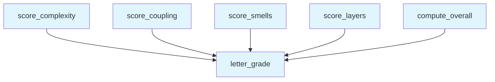

# File: `src/local_deepwiki/generators/analysis/health_scoring.py`

## File Overview

This file implements a health scoring system that translates raw architectural metrics into dimension-specific scores (0–100) and an overall letter grade (A–F). It provides a consistent, computable way to assess code quality based on architectural health indicators such as complexity, coupling, design smells, and layer discipline.

The module is designed for pure computation and does not perform any I/O operations. It is intended to be used by other components in the analysis pipeline that provide metric summaries, and it returns structured data that can be consumed by downstream reporting or visualization logic.

## Key Concepts

### Dimension-Based Scoring

Each function in this module corresponds to a specific dimension of code health:
- **Complexity**: Based on cyclomatic complexity and percentage of functions exceeding a threshold.
- **Coupling**: Evaluates module instability and distance from main sequence.
- **Smells**: Considers density and severity of design smells, with special weight for "god class" violations.
- **Layers**: Simple count of layer discipline violations.

Each dimension is scored independently using a consistent algorithm:
1. Start with a perfect score of 100.
2. Apply deductions based on observed metrics.
3. Cap deductions to prevent negative scores.
4. Assign a letter grade using a predefined threshold mapping.

### Weighted Overall Score

The `compute_overall` function aggregates dimension scores using predefined weights (`_DIMENSION_WEIGHTS`) to produce a composite score. This approach allows prioritizing certain architectural aspects over others, reflecting the project's specific quality goals.

### Why This Approach

The scoring logic is designed to be:
- **Relative**: Metrics are normalized or scaled so that larger projects don't get unfairly penalized.
- **Threshold-based**: Simple, interpretable rules that map easily to actionable insights.
- **Scalable**: Functions handle edge cases like empty inputs gracefully.

## Integration

This module is part of the analysis pipeline and is called by:
- `test_health_scoring`: Unit tests that validate the scoring functions.
- `architecture_health`: Likely a handler or service that orchestrates health scoring across multiple dimensions.
  
It imports `Any` from `typing` to support flexible data structures for metrics and hotspots, aligning with the dynamic nature of architectural data.

The module is closely related to:
- `src/local_deepwiki/generators/analysis/api_docs.py`: May use similar scoring logic or data structures.
- `src/local_deepwiki/handlers/types.py`: Could define the types used for metrics and hotspots.
- `src/local_deepwiki/validation.py`: Possibly integrates with validation logic for metric data integrity.

## Design Notes

### Edge Case Handling

- Functions return a score of 100 with an "A" grade when inputs are empty or invalid (e.g., zero functions, no metrics).
- Deductions are capped to ensure scores never drop below 0.
- Division by zero is avoided through conditional checks.

### Scoring Algorithm Details

- **Complexity scoring** uses thresholds for maximum cyclomatic complexity and percentage of functions over CC=15.
- **Coupling scoring** scales penalties based on average distance and percentage of unstable modules, using percentage-based thresholds to normalize for project size.
- **Smells scoring** applies severity weights to different types of smells, with a strong penalty for "god class" violations.
- **Layer scoring** uses a linear deduction model — each violation deducts 10 points, capped at 0.

### Weighted Aggregation

The `compute_overall` function aggregates scores using fixed weights (`_DIMENSION_WEIGHTS`), which are not visible in the code snippet but are expected to be defined elsewhere in the module. This ensures that some dimensions (e.g., coupling or complexity) are considered more important than others in the final score.

This design choice allows for a balance between simplicity and configurability, enabling project-specific tuning of architectural priorities without requiring complex logic in the scoring functions themselves.

## API Reference

### Functions

#### `letter_grade`

```python
def letter_grade(score: float) -> str
```

Convert a 0-100 score to a letter grade.


| Parameter | Type | Default | Description |
|-----------|------|---------|-------------|
| `score` | `float` | - | - |

**Returns:** `str`


<details>
<summary>View Source (lines 29-34) | <a href="https://github.com/UrbanDiver/local-deepwiki-mcp/blob/main/src/local_deepwiki/generators/analysis/health_scoring.py#L29-L34">GitHub</a></summary>

```python
def letter_grade(score: float) -> str:
    """Convert a 0-100 score to a letter grade."""
    for grade, threshold in _GRADE_THRESHOLDS:
        if score >= threshold:
            return grade
    return "F"
```

</details>

#### `score_complexity`

```python
def score_complexity(hotspots: list[dict[str, Any]], total_functions: int) -> dict[str, Any]
```

Score complexity dimension (0-100).  Factors: - Max cyclomatic complexity (lower is better) - % of functions above CC=15 (lower is better)


| Parameter | Type | Default | Description |
|-----------|------|---------|-------------|
| `hotspots` | `list[dict[str, Any]]` | - | - |
| `total_functions` | `int` | - | - |

**Returns:** `dict[str, Any]`


<details>
<summary>View Source (lines 37-76) | <a href="https://github.com/UrbanDiver/local-deepwiki-mcp/blob/main/src/local_deepwiki/generators/analysis/health_scoring.py#L37-L76">GitHub</a></summary>

```python
def score_complexity(
    hotspots: list[dict[str, Any]],
    total_functions: int,
) -> dict[str, Any]:
    """Score complexity dimension (0-100).

    Factors:
    - Max cyclomatic complexity (lower is better)
    - % of functions above CC=15 (lower is better)
    """
    if total_functions == 0:
        return {"score": 100, "grade": "A", "factors": {}}

    cc_values = [h["metric_value"] for h in hotspots if "metric_value" in h]
    max_cc = max(cc_values) if cc_values else 0
    high_cc_count = sum(1 for h in hotspots if h.get("metric_value", 0) > 15)
    high_cc_pct = (high_cc_count / total_functions) * 100 if total_functions > 0 else 0

    # Score: start at 100, deduct for high CC
    score = 100.0
    if max_cc > 50:
        score -= 30
    elif max_cc > 30:
        score -= 20
    elif max_cc > 15:
        score -= 10

    # Deduct for % of functions over CC=15
    score -= min(high_cc_pct * 5, 40)  # cap at 40 point deduction

    score = max(0.0, min(100.0, score))
    return {
        "score": round(score, 1),
        "grade": letter_grade(score),
        "factors": {
            "max_cyclomatic": max_cc,
            "functions_over_cc15": high_cc_count,
            "pct_over_cc15": round(high_cc_pct, 1),
        },
    }
```

</details>

#### `score_coupling`

```python
def score_coupling(metrics: list[dict[str, Any]]) -> dict[str, Any]
```

Score coupling dimension (0-100).  Factors: - Average distance from main sequence (lower is better) - Percentage of highly unstable modules (I>0.8 and Ce>5)  Uses percentage-based thresholds so the score scales with project size rather than penalizing large projects with many small modules.


| Parameter | Type | Default | Description |
|-----------|------|---------|-------------|
| `metrics` | `list[dict[str, Any]]` | - | - |

**Returns:** `dict[str, Any]`


<details>
<summary>View Source (lines 79-115) | <a href="https://github.com/UrbanDiver/local-deepwiki-mcp/blob/main/src/local_deepwiki/generators/analysis/health_scoring.py#L79-L115">GitHub</a></summary>

```python
def score_coupling(metrics: list[dict[str, Any]]) -> dict[str, Any]:
    """Score coupling dimension (0-100).

    Factors:
    - Average distance from main sequence (lower is better)
    - Percentage of highly unstable modules (I>0.8 and Ce>5)

    Uses percentage-based thresholds so the score scales with project size
    rather than penalizing large projects with many small modules.
    """
    if not metrics:
        return {"score": 100, "grade": "A", "factors": {}}

    distances = [m.get("distance", 0) for m in metrics]
    avg_distance = sum(distances) / len(distances) if distances else 0
    highly_unstable = sum(
        1
        for m in metrics
        if m.get("instability", 0) > 0.8 and m.get("efferent_coupling", 0) > 5
    )
    unstable_pct = (highly_unstable / len(metrics)) * 100 if metrics else 0

    score = 100.0
    score -= min(avg_distance * 50, 40)  # avg distance penalty, cap 40
    score -= min(unstable_pct * 2, 25)  # unstable % penalty, cap 25

    score = max(0.0, min(100.0, score))
    return {
        "score": round(score, 1),
        "grade": letter_grade(score),
        "factors": {
            "avg_distance": round(avg_distance, 3),
            "highly_unstable_modules": highly_unstable,
            "unstable_pct": round(unstable_pct, 1),
            "total_modules": len(metrics),
        },
    }
```

</details>

#### `score_smells`

```python
def score_smells(smells: list[dict[str, Any]], total_lines: int) -> dict[str, Any]
```

Score design smells dimension (0-100).  Factors: - Smell density: smells per 1000 lines, weighted by severity - God class count (high-impact)


| Parameter | Type | Default | Description |
|-----------|------|---------|-------------|
| `smells` | `list[dict[str, Any]]` | - | - |
| `total_lines` | `int` | - | - |

**Returns:** `dict[str, Any]`


<details>
<summary>View Source (lines 118-151) | <a href="https://github.com/UrbanDiver/local-deepwiki-mcp/blob/main/src/local_deepwiki/generators/analysis/health_scoring.py#L118-L151">GitHub</a></summary>

```python
def score_smells(
    smells: list[dict[str, Any]],
    total_lines: int,
) -> dict[str, Any]:
    """Score design smells dimension (0-100).

    Factors:
    - Smell density: smells per 1000 lines, weighted by severity
    - God class count (high-impact)
    """
    if total_lines == 0:
        return {"score": 100, "grade": "A", "factors": {}}

    severity_weights = {"high": 3, "medium": 1, "low": 0.5}
    weighted_count = sum(
        severity_weights.get(s.get("severity", "medium"), 1) for s in smells
    )
    density = (weighted_count / total_lines) * 1000
    god_classes = sum(1 for s in smells if s.get("type") == "god_class")

    score = 100.0
    score -= min(density * 8, 80)  # density penalty, cap 80
    score -= min(god_classes * 10, 35)  # god class penalty, cap 35

    score = max(0.0, min(100.0, score))
    return {
        "score": round(score, 1),
        "grade": letter_grade(score),
        "factors": {
            "total_smells": len(smells),
            "weighted_density_per_1k": round(density, 2),
            "god_classes": god_classes,
        },
    }
```

</details>

#### `score_layers`

```python
def score_layers(violations: list[dict[str, Any]]) -> dict[str, Any]
```

Score layer discipline dimension (0-100).  Simple: 100 minus 10 per violation, floor 0.


| Parameter | Type | Default | Description |
|-----------|------|---------|-------------|
| `violations` | `list[dict[str, Any]]` | - | - |

**Returns:** `dict[str, Any]`


<details>
<summary>View Source (lines 154-167) | <a href="https://github.com/UrbanDiver/local-deepwiki-mcp/blob/main/src/local_deepwiki/generators/analysis/health_scoring.py#L154-L167">GitHub</a></summary>

```python
def score_layers(violations: list[dict[str, Any]]) -> dict[str, Any]:
    """Score layer discipline dimension (0-100).

    Simple: 100 minus 10 per violation, floor 0.
    """
    count = len(violations)
    score = max(0.0, 100.0 - count * 10)
    return {
        "score": round(score, 1),
        "grade": letter_grade(score),
        "factors": {
            "total_violations": count,
        },
    }
```

</details>

#### `compute_overall`

```python
def compute_overall(dimension_scores: dict[str, dict[str, Any]]) -> dict[str, Any]
```

Compute weighted overall score from dimension scores.


| Parameter | Type | Default | Description |
|-----------|------|---------|-------------|
| `dimension_scores` | `dict[str, dict[str, Any]]` | - | - |

**Returns:** `dict[str, Any]`


<details>
<summary>View Source (lines 170-183) | <a href="https://github.com/UrbanDiver/local-deepwiki-mcp/blob/main/src/local_deepwiki/generators/analysis/health_scoring.py#L170-L183">GitHub</a></summary>

```python
def compute_overall(dimension_scores: dict[str, dict[str, Any]]) -> dict[str, Any]:
    """Compute weighted overall score from dimension scores."""
    total = 0.0
    for dim, weight in _DIMENSION_WEIGHTS.items():
        dim_score = dimension_scores.get(dim, {}).get("score", 100)
        total += dim_score * weight

    overall = round(total, 1)
    return {
        "score": overall,
        "grade": letter_grade(overall),
        "dimensions": dimension_scores,
        "weights": _DIMENSION_WEIGHTS,
    }
```

</details>

## Call Graph



## Used By

Functions and methods in this file and their callers:

- **`letter_grade`**: called by `compute_overall`, `score_complexity`, `score_coupling`, `score_layers`, `score_smells`

## Usage Examples

*Examples extracted from test files*

### Example: `letter_grade`

From `test_health_scoring.py::test_letter_grade_a_at_90`:

```python
assert letter_grade(90) == "A"
```

### Example: `letter_grade`

From `test_health_scoring.py::test_letter_grade_a_at_100`:

```python
assert letter_grade(100) == "A"
```

### Example: `score_complexity`

From `test_health_scoring.py::test_score_complexity_empty_hotspots_zero_functions`:

```python
result = score_complexity([], 0)
    assert result["score"] == 100
    assert result["grade"] == "A"
    assert result["factors"] == {}
```

### Example: `score_complexity`

From `test_health_scoring.py::test_score_complexity_perfect_no_high_cc`:

```python
hotspots = [{"metric_value": 3}, {"metric_value": 5}, {"metric_value": 2}]
    result = score_complexity(hotspots, total_functions=10)
    assert result["score"] == 100.0
    assert result["grade"] == "A"
    assert result["factors"]["max_cyclomatic"] == 5
    assert result["factors"]["functions_over_cc15"] == 0
    assert result["factors"]["pct_over_cc15"] == 0.0
```

### Example: `score_coupling`

From `test_health_scoring.py::test_score_coupling_empty_metrics`:

```python
result = score_coupling([])
    assert result["score"] == 100
    assert result["grade"] == "A"
    assert result["factors"] == {}
```


## Last Modified

| Entity | Type | Author | Date | Commit |
|--------|------|--------|------|--------|
| `score_coupling` | function | Brian Breidenbach | 1 week ago | `9a560e1` refactor: recalibrate coupl... |
| `score_smells` | function | Brian Breidenbach | 1 week ago | `b12031b` fix: recalibrate smells sco... |
| `letter_grade` | function | Brian Breidenbach | 1 week ago | `c9f0d4d` refactor: extract source_fi... |
| `score_complexity` | function | Brian Breidenbach | 1 week ago | `c9f0d4d` refactor: extract source_fi... |
| `score_layers` | function | Brian Breidenbach | 1 week ago | `c9f0d4d` refactor: extract source_fi... |
| `compute_overall` | function | Brian Breidenbach | 1 week ago | `c9f0d4d` refactor: extract source_fi... |

## Relevant Source Files

- `src/local_deepwiki/generators/analysis/health_scoring.py:29-34`
