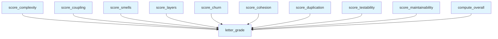

# File: `src/local_deepwiki/generators/analysis/health_scoring.py`

## File Overview

This module provides a suite of functions for converting raw architecture and code metrics into dimension-specific scores and overall health grades. It is part of the analysis pipeline for generating architectural health reports. The module is designed to be pure computation — it does not perform I/O operations or directly interact with external systems. Instead, it accepts structured metric data and returns standardized score objects that include scores, letter grades, and detailed factors.

The module is used by:
- `architecture_health` (in `src/local_deepwiki/generators/analysis/architecture_report.py`)
- Various test functions in `test_health_scoring`

The overall goal is to provide a consistent and interpretable way to assess software health across multiple dimensions, such as complexity, coupling, cohesion, duplication, and maintainability.

## Key Concepts

### Dimensional Scoring

Each function in this module corresponds to a specific dimension of software health:
- `score_complexity`: Evaluates cyclomatic complexity.
- `score_coupling`: Assesses module coupling and instability.
- `score_smells`: Rates design smells and God class occurrences.
- `score_layers`: Checks layer discipline violations.
- `score_churn`: Measures file churn and complexity.
- `score_cohesion`: Evaluates class and module cohesion.
- `score_duplication`: Detects code duplication.
- `score_testability`: Rates test coverage and assertion density.
- `score_maintainability`: Evaluates Maintainability Index.

These functions are designed to be **independent**, each scoring one dimension based on its specific metrics. They return a consistent structure:
```python
{
    "score": float,
    "grade": str,
    "factors": dict
}
```

### Scoring Algorithm Design

The scoring algorithms are designed to:
- Start at a perfect score (100) and deduct points based on negative indicators.
- Apply **penalties with ceilings** to prevent over-penalization.
- Use **weighted penalties** that reflect the severity of issues.
- Include **detailed factor breakdowns** for transparency and debugging.

For example, in `score_complexity`, the maximum cyclomatic complexity and percentage of functions over CC=15 are used to compute a deduction from 100. Similarly, in `score_duplication`, a linear penalty is applied to duplication ratios, with a cap at 50 points.

### Overall Scoring

The `compute_overall` function aggregates scores from all dimensions using a predefined set of weights (`_DIMENSION_WEIGHTS`). This allows for a weighted average that reflects the relative importance of each dimension in the overall health assessment.

## Integration

This module is a core part of the analysis pipeline and is used by:
- `architecture_health` in `src/local_deepwiki/generators/analysis/architecture_report.py` — which orchestrates the full health report generation.
- Test suite (`test_health_scoring`) — for unit testing each scoring function in isolation.

The functions in this file are **pure** and **stateless**, which allows them to be easily unit-tested and reused in different contexts. The module is imported by `architecture_health`, which in turn is called by `SessionState` and `Types` handlers, indicating that the health scoring is a key part of the session-based analysis workflow.

## Design Notes

### Edge Case Handling

- **Zero or missing metrics**: Functions like `score_complexity` and `score_smells` return a perfect score (`100`, grade `"A"`) when input data is missing or zero, to avoid penalizing projects that have no data in a dimension.
- **Capped deductions**: All penalties are capped to avoid negative scores. For example, `score_churn` caps its deductions at 40 points for high-risk files and 15 points for Gini coefficient concentration.
- **Fallbacks for missing data**: In functions like `score_duplication`, the module prefers inter-file metrics (e.g., `inter_file_duplication_ratio`) when available, falling back to total metrics if not.

### Weighted Scoring

The `compute_overall` function uses a fixed `_DIMENSION_WEIGHTS` dictionary to compute a weighted average of dimension scores. This allows the system to emphasize or de-emphasize certain dimensions depending on the project’s priorities or domain-specific needs.

### Letter Grade Conversion

The `letter_grade` function is a simple utility that maps a numeric score to a letter grade (A-F) using a predefined threshold list (`_GRADE_THRESHOLDS`). This is used across all scoring functions to ensure consistent grading.

### Design Rationale

The design of this module reflects a **modular scoring system**:
- Each dimension is scored independently, which allows for clear diagnosis of specific issues.
- The use of consistent return formats makes it easy to aggregate and present results.
- The functions are kept lightweight and pure, which supports scalability and testability.

This approach allows for a **flexible and extensible** system where new dimensions can be added without affecting existing scoring logic.

## API Reference

### Functions

#### `letter_grade`

```python
def letter_grade(score: float) -> str
```

Convert a 0-100 score to a letter grade.


| Parameter | Type | Default | Description |
|-----------|------|---------|-------------|
| `score` | `float` | - | - |

**Returns:** `str`


<details>
<summary>View Source (lines 34-39) | <a href="https://github.com/UrbanDiver/local-deepwiki-mcp/blob/main/src/local_deepwiki/generators/analysis/health_scoring.py#L34-L39">GitHub</a></summary>

```python
def letter_grade(score: float) -> str:
    """Convert a 0-100 score to a letter grade."""
    for grade, threshold in _GRADE_THRESHOLDS:
        if score >= threshold:
            return grade
    return "F"
```

</details>

#### `score_complexity`

```python
def score_complexity(hotspots: list[dict[str, Any]], total_functions: int) -> dict[str, Any]
```

Score complexity dimension (0-100).  Factors: - Max cyclomatic complexity (lower is better) - % of functions above CC=15 (lower is better)


| Parameter | Type | Default | Description |
|-----------|------|---------|-------------|
| `hotspots` | `list[dict[str, Any]]` | - | - |
| `total_functions` | `int` | - | - |

**Returns:** `dict[str, Any]`


<details>
<summary>View Source (lines 42-81) | <a href="https://github.com/UrbanDiver/local-deepwiki-mcp/blob/main/src/local_deepwiki/generators/analysis/health_scoring.py#L42-L81">GitHub</a></summary>

```python
def score_complexity(
    hotspots: list[dict[str, Any]],
    total_functions: int,
) -> dict[str, Any]:
    """Score complexity dimension (0-100).

    Factors:
    - Max cyclomatic complexity (lower is better)
    - % of functions above CC=15 (lower is better)
    """
    if total_functions == 0:
        return {"score": 100, "grade": "A", "factors": {}}

    cc_values = [h["metric_value"] for h in hotspots if "metric_value" in h]
    max_cc = max(cc_values) if cc_values else 0
    high_cc_count = sum(1 for h in hotspots if h.get("metric_value", 0) > 15)
    high_cc_pct = (high_cc_count / total_functions) * 100 if total_functions > 0 else 0

    # Score: start at 100, deduct for high CC
    score = 100.0
    if max_cc > 50:
        score -= 30
    elif max_cc > 30:
        score -= 20
    elif max_cc > 15:
        score -= 10

    # Deduct for % of functions over CC=15
    score -= min(high_cc_pct * 5, 40)  # cap at 40 point deduction

    score = max(0.0, min(100.0, score))
    return {
        "score": round(score, 1),
        "grade": letter_grade(score),
        "factors": {
            "max_cyclomatic": max_cc,
            "functions_over_cc15": high_cc_count,
            "pct_over_cc15": round(high_cc_pct, 1),
        },
    }
```

</details>

#### `score_coupling`

```python
def score_coupling(metrics: list[dict[str, Any]]) -> dict[str, Any]
```

Score coupling dimension (0-100).  Factors: - Average distance from main sequence (lower is better) - Percentage of problematic unstable modules  Highly unstable modules are only flagged when they have Ca=0 (nothing depends on them) AND high Ce — these are disconnected modules that import a lot but provide no value to the rest of the system. Edge modules with Ca>0 (handlers that are imported by __init__.py, services used by handlers) are expected to be unstable and are not penalized.


| Parameter | Type | Default | Description |
|-----------|------|---------|-------------|
| `metrics` | `list[dict[str, Any]]` | - | - |

**Returns:** `dict[str, Any]`


<details>
<summary>View Source (lines 84-126) | <a href="https://github.com/UrbanDiver/local-deepwiki-mcp/blob/main/src/local_deepwiki/generators/analysis/health_scoring.py#L84-L126">GitHub</a></summary>

```python
def score_coupling(metrics: list[dict[str, Any]]) -> dict[str, Any]:
    """Score coupling dimension (0-100).

    Factors:
    - Average distance from main sequence (lower is better)
    - Percentage of problematic unstable modules

    Highly unstable modules are only flagged when they have Ca=0 (nothing
    depends on them) AND high Ce — these are disconnected modules that
    import a lot but provide no value to the rest of the system. Edge
    modules with Ca>0 (handlers that are imported by __init__.py, services
    used by handlers) are expected to be unstable and are not penalized.
    """
    if not metrics:
        return {"score": 100, "grade": "A", "factors": {}}

    distances = [m.get("distance", 0) for m in metrics]
    avg_distance = sum(distances) / len(distances) if distances else 0
    # Only flag modules that are fully disconnected (Ca=0) with high outgoing deps
    highly_unstable = sum(
        1
        for m in metrics
        if m.get("instability", 0) > 0.8
        and m.get("efferent_coupling", 0) > 5
        and m.get("afferent_coupling", 0) == 0
    )
    unstable_pct = (highly_unstable / len(metrics)) * 100 if metrics else 0

    score = 100.0
    score -= min(avg_distance * 30, 25)  # avg distance penalty, cap 25
    score -= min(unstable_pct * 2, 25)  # disconnected unstable % penalty, cap 25

    score = max(0.0, min(100.0, score))
    return {
        "score": round(score, 1),
        "grade": letter_grade(score),
        "factors": {
            "avg_distance": round(avg_distance, 3),
            "highly_unstable_modules": highly_unstable,
            "unstable_pct": round(unstable_pct, 1),
            "total_modules": len(metrics),
        },
    }
```

</details>

#### `score_smells`

```python
def score_smells(smells: list[dict[str, Any]], total_lines: int) -> dict[str, Any]
```

Score design smells dimension (0-100).  Factors: - Smell density: smells per 1000 lines, weighted by severity - God class count (high-impact)


| Parameter | Type | Default | Description |
|-----------|------|---------|-------------|
| `smells` | `list[dict[str, Any]]` | - | - |
| `total_lines` | `int` | - | - |

**Returns:** `dict[str, Any]`


<details>
<summary>View Source (lines 129-162) | <a href="https://github.com/UrbanDiver/local-deepwiki-mcp/blob/main/src/local_deepwiki/generators/analysis/health_scoring.py#L129-L162">GitHub</a></summary>

```python
def score_smells(
    smells: list[dict[str, Any]],
    total_lines: int,
) -> dict[str, Any]:
    """Score design smells dimension (0-100).

    Factors:
    - Smell density: smells per 1000 lines, weighted by severity
    - God class count (high-impact)
    """
    if total_lines == 0:
        return {"score": 100, "grade": "A", "factors": {}}

    severity_weights = {"high": 3, "medium": 1, "low": 0.5}
    weighted_count = sum(
        severity_weights.get(s.get("severity", "medium"), 1) for s in smells
    )
    density = (weighted_count / total_lines) * 1000
    god_classes = sum(1 for s in smells if s.get("type") == "god_class")

    score = 100.0
    score -= min(density * 8, 80)  # density penalty, cap 80
    score -= min(god_classes * 10, 35)  # god class penalty, cap 35

    score = max(0.0, min(100.0, score))
    return {
        "score": round(score, 1),
        "grade": letter_grade(score),
        "factors": {
            "total_smells": len(smells),
            "weighted_density_per_1k": round(density, 2),
            "god_classes": god_classes,
        },
    }
```

</details>

#### `score_layers`

```python
def score_layers(violations: list[dict[str, Any]]) -> dict[str, Any]
```

Score layer discipline dimension (0-100).  Simple: 100 minus 10 per violation, floor 0.


| Parameter | Type | Default | Description |
|-----------|------|---------|-------------|
| `violations` | `list[dict[str, Any]]` | - | - |

**Returns:** `dict[str, Any]`


<details>
<summary>View Source (lines 165-178) | <a href="https://github.com/UrbanDiver/local-deepwiki-mcp/blob/main/src/local_deepwiki/generators/analysis/health_scoring.py#L165-L178">GitHub</a></summary>

```python
def score_layers(violations: list[dict[str, Any]]) -> dict[str, Any]:
    """Score layer discipline dimension (0-100).

    Simple: 100 minus 10 per violation, floor 0.
    """
    count = len(violations)
    score = max(0.0, 100.0 - count * 10)
    return {
        "score": round(score, 1),
        "grade": letter_grade(score),
        "factors": {
            "total_violations": count,
        },
    }
```

</details>

#### `score_churn`

```python
def score_churn(composite: list[dict[str, Any]], stats: dict[str, Any]) -> dict[str, Any]
```

Score churn dimension (0-100).  Factors: - Count of files with composite > 0.5 (high churn AND high complexity) - Gini coefficient of churn distribution (concentration)


| Parameter | Type | Default | Description |
|-----------|------|---------|-------------|
| `composite` | `list[dict[str, Any]]` | - | - |
| `stats` | `dict[str, Any]` | - | - |

**Returns:** `dict[str, Any]`


<details>
<summary>View Source (lines 181-216) | <a href="https://github.com/UrbanDiver/local-deepwiki-mcp/blob/main/src/local_deepwiki/generators/analysis/health_scoring.py#L181-L216">GitHub</a></summary>

```python
def score_churn(
    composite: list[dict[str, Any]],
    *,
    stats: dict[str, Any],
) -> dict[str, Any]:
    """Score churn dimension (0-100).

    Factors:
    - Count of files with composite > 0.5 (high churn AND high complexity)
    - Gini coefficient of churn distribution (concentration)
    """
    if not composite and not stats:
        return {"score": 100, "grade": "A", "factors": {}}

    high_risk = sum(1 for c in composite if c.get("composite", 0) > 0.5)
    total_files = stats.get("total_files", 0) or 1
    high_risk_pct = (high_risk / total_files) * 100
    gini = stats.get("gini_coefficient", 0.0)

    score = 100.0
    # High-churn+complex files: up to 40 point deduction
    score -= min(high_risk_pct * 4, 40)
    # Churn concentration (Gini): up to 15 point deduction
    if gini > 0.6:
        score -= min((gini - 0.6) * 37.5, 15)

    score = max(0.0, min(100.0, score))
    return {
        "score": round(score, 1),
        "grade": letter_grade(score),
        "factors": {
            "high_churn_complex_files": high_risk,
            "churn_concentration": round(gini, 4),
            "total_files": stats.get("total_files", 0),
        },
    }
```

</details>

#### `score_cohesion`

```python
def score_cohesion(class_cohesion: list[dict[str, Any]], module_cohesion: list[dict[str, Any]], stats: dict[str, Any]) -> dict[str, Any]
```

Score cohesion dimension (0-100).  Factors: - Count of classes with LCOM4 > 2 (splittable) - Average LCOM4 across all classes - Count of modules with cohesion ratio < 0.3


| Parameter | Type | Default | Description |
|-----------|------|---------|-------------|
| `class_cohesion` | `list[dict[str, Any]]` | - | - |
| `module_cohesion` | `list[dict[str, Any]]` | - | - |
| `stats` | `dict[str, Any]` | - | - |

**Returns:** `dict[str, Any]`


<details>
<summary>View Source (lines 219-267) | <a href="https://github.com/UrbanDiver/local-deepwiki-mcp/blob/main/src/local_deepwiki/generators/analysis/health_scoring.py#L219-L267">GitHub</a></summary>

```python
def score_cohesion(
    class_cohesion: list[dict[str, Any]],
    module_cohesion: list[dict[str, Any]],
    *,
    stats: dict[str, Any],
) -> dict[str, Any]:
    """Score cohesion dimension (0-100).

    Factors:
    - Count of classes with LCOM4 > 2 (splittable)
    - Average LCOM4 across all classes
    - Count of modules with cohesion ratio < 0.3
    """
    if not stats:
        return {"score": 100, "grade": "A", "factors": {}}

    classes_gt2 = stats.get("classes_with_lcom_gt_2", 0)
    total_classes = stats.get("total_classes", 0) or 1
    excluded = stats.get("excluded_pattern_classes", 0)
    gt2_pct = (classes_gt2 / total_classes) * 100
    avg_lcom = stats.get("avg_lcom", 1.0)
    low_modules = stats.get("low_cohesion_modules", 0)

    score = 100.0
    # Classes with high LCOM4: up to 40 point deduction
    score -= min(gt2_pct * 2, 40)
    # Low-cohesion modules: up to 15 point deduction
    # (reduced weight — Python packages are often namespaces, not cohesive units;
    # handler/provider packages legitimately have low internal-import ratios)
    score -= min(low_modules * 1.5, 15)
    # High average LCOM: up to 15 point deduction
    if avg_lcom > 2.0:
        score -= min((avg_lcom - 2.0) * 5, 15)

    score = max(0.0, min(100.0, score))
    factors: dict[str, Any] = {
        "classes_with_lcom_gt_2": classes_gt2,
        "avg_lcom": round(avg_lcom, 2),
        "low_cohesion_modules": low_modules,
        "total_classes": stats.get("total_classes", 0),
    }
    if excluded > 0:
        factors["excluded_pattern_classes"] = excluded

    return {
        "score": round(score, 1),
        "grade": letter_grade(score),
        "factors": factors,
    }
```

</details>

#### `score_duplication`

```python
def score_duplication(stats: dict[str, Any]) -> dict[str, Any]
```

Score duplication dimension (0-100).  Factors: - Duplication ratio (duplicated lines / total lines) - Number of clone groups - Largest clone block size


| Parameter | Type | Default | Description |
|-----------|------|---------|-------------|
| `stats` | `dict[str, Any]` | - | - |

**Returns:** `dict[str, Any]`


<details>
<summary>View Source (lines 270-329) | <a href="https://github.com/UrbanDiver/local-deepwiki-mcp/blob/main/src/local_deepwiki/generators/analysis/health_scoring.py#L270-L329">GitHub</a></summary>

```python
def score_duplication(
    stats: dict[str, Any],
) -> dict[str, Any]:
    """Score duplication dimension (0-100).

    Factors:
    - Duplication ratio (duplicated lines / total lines)
    - Number of clone groups
    - Largest clone block size
    """
    if not stats:
        return {"score": 100, "grade": "A", "factors": {}}

    # Prefer inter-file ratio (excludes declarative intra-file repetition)
    total_ratio = stats.get("duplication_ratio", 0.0)
    inter_file_ratio = stats.get("inter_file_duplication_ratio")
    ratio = inter_file_ratio if inter_file_ratio is not None else total_ratio

    # Prefer inter-file clone group count when available
    inter_file_groups = stats.get("inter_file_clone_groups")
    total_groups = stats.get("type1_clone_groups", 0) + stats.get(
        "type2_clone_groups", 0
    )
    clone_groups = inter_file_groups if inter_file_groups is not None else total_groups
    largest = stats.get("largest_clone_lines", 0)

    score = 100.0
    # Duplication ratio: up to 50 point deduction
    if ratio >= 0.30:
        score -= 50
    elif ratio >= 0.20:
        score -= 40
    elif ratio >= 0.10:
        score -= 20
    elif ratio > 0.0:
        score -= ratio * 200  # linear up to 20 at 10%

    # Clone group count: minor adjustment (ratio is the primary signal;
    # many small-window matches inflate group count without indicating
    # meaningful structural duplication)
    score -= min(clone_groups * 0.02, 5)

    # Largest clone: up to 15 point deduction for clones over 50 lines
    if largest > 50:
        score -= min((largest - 50) * 0.3, 15)

    score = max(0.0, min(100.0, score))
    factors: dict[str, Any] = {
        "duplication_ratio": round(total_ratio, 4),
        "clone_groups": clone_groups,
        "largest_clone_lines": largest,
    }
    if inter_file_ratio is not None:
        factors["inter_file_duplication_ratio"] = round(inter_file_ratio, 4)

    return {
        "score": round(score, 1),
        "grade": letter_grade(score),
        "factors": factors,
    }
```

</details>

#### `score_testability`

```python
def score_testability(stats: dict[str, Any]) -> dict[str, Any]
```

Score testability dimension (0-100).  Factors: - Test-to-code ratio (higher is better) - Percentage of untested source files (lower is better) - Average assertions per test file (higher is better)


| Parameter | Type | Default | Description |
|-----------|------|---------|-------------|
| `stats` | `dict[str, Any]` | - | - |

**Returns:** `dict[str, Any]`


<details>
<summary>View Source (lines 332-386) | <a href="https://github.com/UrbanDiver/local-deepwiki-mcp/blob/main/src/local_deepwiki/generators/analysis/health_scoring.py#L332-L386">GitHub</a></summary>

```python
def score_testability(
    stats: dict[str, Any],
) -> dict[str, Any]:
    """Score testability dimension (0-100).

    Factors:
    - Test-to-code ratio (higher is better)
    - Percentage of untested source files (lower is better)
    - Average assertions per test file (higher is better)
    """
    if not stats:
        return {"score": 100, "grade": "A", "factors": {}}

    # No source files means nothing to test — perfect score
    total_source = stats.get("total_source_files", 0)
    if total_source == 0:
        return {"score": 100, "grade": "A", "factors": {}}

    ratio = stats.get("test_to_code_ratio", 0.0)
    untested_pct = stats.get("untested_file_pct", 0.0)
    avg_assertions = stats.get("avg_assertions_per_test", 0.0)

    score = 100.0

    # Test-to-code ratio penalty: ideal is >= 0.8
    if ratio < 0.1:
        score -= 40
    elif ratio < 0.3:
        score -= 25
    elif ratio < 0.5:
        score -= 15
    elif ratio < 0.8:
        score -= 5

    # Untested file percentage: up to 35 point deduction
    score -= min(untested_pct * 0.35, 35)

    # Low assertion density: up to 15 point deduction
    if avg_assertions < 1.0:
        score -= 15
    elif avg_assertions < 3.0:
        score -= 10
    elif avg_assertions < 5.0:
        score -= 5

    score = max(0.0, min(100.0, score))
    return {
        "score": round(score, 1),
        "grade": letter_grade(score),
        "factors": {
            "test_to_code_ratio": round(ratio, 4),
            "untested_file_pct": round(untested_pct, 1),
            "avg_assertions_per_test": round(avg_assertions, 2),
        },
    }
```

</details>

#### `score_maintainability`

```python
def score_maintainability(stats: dict[str, Any]) -> dict[str, Any]
```

Score maintainability dimension (0-100).  Factors: - Average Maintainability Index across all functions - Percentage of functions with MI < 20 (hard to maintain) - Minimum MI (worst-case function)


| Parameter | Type | Default | Description |
|-----------|------|---------|-------------|
| `stats` | `dict[str, Any]` | - | - |

**Returns:** `dict[str, Any]`


<details>
<summary>View Source (lines 389-424) | <a href="https://github.com/UrbanDiver/local-deepwiki-mcp/blob/main/src/local_deepwiki/generators/analysis/health_scoring.py#L389-L424">GitHub</a></summary>

```python
def score_maintainability(
    stats: dict[str, Any],
) -> dict[str, Any]:
    """Score maintainability dimension (0-100).

    Factors:
    - Average Maintainability Index across all functions
    - Percentage of functions with MI < 20 (hard to maintain)
    - Minimum MI (worst-case function)
    """
    if not stats:
        return {"score": 100, "grade": "A", "factors": {}}

    avg_mi = stats.get("avg_mi", 100.0)
    low_mi_pct = stats.get("low_mi_pct", 0.0)
    min_mi = stats.get("min_mi", 100.0)

    score = 100.0
    if avg_mi < 40:
        score -= min((40 - avg_mi) * 1.0, 40)
    low_mi_deduction = min(low_mi_pct * 0.7, 35)
    score -= low_mi_deduction
    if min_mi < 10:
        score -= min((10 - min_mi) * 1.5, 15)

    score = max(0.0, min(100.0, score))
    return {
        "score": round(score, 1),
        "grade": letter_grade(score),
        "factors": {
            "avg_mi": round(avg_mi, 1),
            "low_mi_functions": stats.get("low_mi_functions", 0),
            "low_mi_pct": round(low_mi_pct, 1),
            "min_mi": round(min_mi, 1),
        },
    }
```

</details>

#### `compute_overall`

```python
def compute_overall(dimension_scores: dict[str, dict[str, Any]]) -> dict[str, Any]
```

Compute weighted overall score from dimension scores.


| Parameter | Type | Default | Description |
|-----------|------|---------|-------------|
| `dimension_scores` | `dict[str, dict[str, Any]]` | - | - |

**Returns:** `dict[str, Any]`


<details>
<summary>View Source (lines 427-440) | <a href="https://github.com/UrbanDiver/local-deepwiki-mcp/blob/main/src/local_deepwiki/generators/analysis/health_scoring.py#L427-L440">GitHub</a></summary>

```python
def compute_overall(dimension_scores: dict[str, dict[str, Any]]) -> dict[str, Any]:
    """Compute weighted overall score from dimension scores."""
    total = 0.0
    for dim, weight in _DIMENSION_WEIGHTS.items():
        dim_score = dimension_scores.get(dim, {}).get("score", 100)
        total += dim_score * weight

    overall = round(total, 1)
    return {
        "score": overall,
        "grade": letter_grade(overall),
        "dimensions": dimension_scores,
        "weights": _DIMENSION_WEIGHTS,
    }
```

</details>

## Call Graph



## Used By

Functions and methods in this file and their callers:

- **`letter_grade`**: called by `compute_overall`, `score_churn`, `score_cohesion`, `score_complexity`, `score_coupling`, `score_duplication`, `score_layers`, `score_maintainability`, `score_smells`, `score_testability`

## Usage Examples

*Examples extracted from test files*

### Example: `letter_grade`

From `test_health_scoring.py::test_letter_grade_a_at_90`:

```python
assert letter_grade(90) == "A"
```

### Example: `letter_grade`

From `test_health_scoring.py::test_letter_grade_a_at_100`:

```python
assert letter_grade(100) == "A"
```

### Example: `score_complexity`

From `test_health_scoring.py::test_score_complexity_empty_hotspots_zero_functions`:

```python
result = score_complexity([], 0)
    assert result["score"] == 100
    assert result["grade"] == "A"
    assert result["factors"] == {}
```

### Example: `score_complexity`

From `test_health_scoring.py::test_score_complexity_perfect_no_high_cc`:

```python
hotspots = [{"metric_value": 3}, {"metric_value": 5}, {"metric_value": 2}]
    result = score_complexity(hotspots, total_functions=10)
    assert result["score"] == 100.0
    assert result["grade"] == "A"
    assert result["factors"]["max_cyclomatic"] == 5
    assert result["factors"]["functions_over_cc15"] == 0
    assert result["factors"]["pct_over_cc15"] == 0.0
```

### Example: `score_coupling`

From `test_health_scoring.py::test_score_coupling_empty_metrics`:

```python
result = score_coupling([])
    assert result["score"] == 100
    assert result["grade"] == "A"
    assert result["factors"] == {}
```


## Last Modified

| Entity | Type | Author | Date | Commit |
|--------|------|--------|------|--------|
| `score_cohesion` | function | Brian Breidenbach | today | `8a348c8` fix: tune scoring penalties... |
| `score_duplication` | function | Brian Breidenbach | today | `8a348c8` fix: tune scoring penalties... |
| `score_smells` | function | Brian Breidenbach | today | `75687d9` feat: health scorer consume... |
| `score_maintainability` | function | Brian Breidenbach | today | `64e4b55` feat: add maintainability i... |
| `score_testability` | function | Brian Breidenbach | today | `6d8243f` feat: add testability-based... |
| `score_churn` | function | Brian Breidenbach | today | `3336b41` feat(churn): add score_chur... |
| `score_coupling` | function | Brian Breidenbach | 2 days ago | `c0fe1bd` fix: unify module labels in... |
| `letter_grade` | function | Brian Breidenbach | 2 weeks ago | `c9f0d4d` refactor: extract source_fi... |
| `score_complexity` | function | Brian Breidenbach | 2 weeks ago | `c9f0d4d` refactor: extract source_fi... |
| `score_layers` | function | Brian Breidenbach | 2 weeks ago | `c9f0d4d` refactor: extract source_fi... |
| `compute_overall` | function | Brian Breidenbach | 2 weeks ago | `c9f0d4d` refactor: extract source_fi... |

## Relevant Source Files

- `src/local_deepwiki/generators/analysis/health_scoring.py:34-39`
