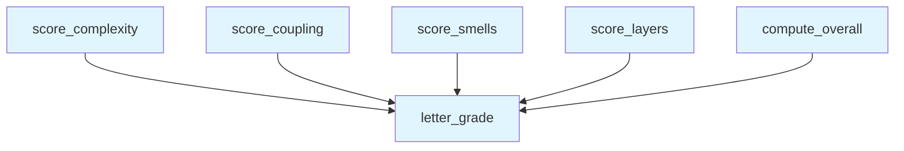

# File: `src/local_deepwiki/generators/analysis/health_scoring.py`

## File Overview

This module is responsible for converting raw architectural metrics into meaningful health scores and letter grades. It provides a suite of functions that evaluate different aspects of code health — complexity, coupling, design smells, and layer discipline — and then combines these into an overall score.

The module is designed to be purely computational, taking in metric summaries and returning structured score data without performing any I/O operations. It serves as a core component in the architecture analysis pipeline, enabling the generation of health reports.

## Key Concepts

### Dimension-Based Scoring
Each function in this module evaluates a specific dimension of code health:
- **Complexity**: Based on cyclomatic complexity and percentage of functions exceeding a threshold.
- **Coupling**: Evaluates module distances and instability, with a focus on disconnected modules.
- **Smells**: Measures density of design smells and counts of high-impact issues like "god classes".
- **Layers**: Simple count of layer violations.

These dimensions are weighted when computing an overall score, reflecting their relative importance in determining system health.

### Scoring Algorithm Design
Each scoring function follows a consistent pattern:
1. **Base Score**: Starts at 100.
2. **Penalties**: Deduct points based on metric thresholds.
3. **Normalization**: Caps penalties and ensures final score is within [0, 100].
4. **Grading**: Converts the final score to a letter grade using `letter_grade`.

This approach ensures that scores are intuitive, consistent, and easy to interpret.

### Letter Grade Conversion
The `letter_grade` function maps a numerical score (0–100) to a letter grade (A–F). This is implemented using a threshold-based lookup table (`_GRADE_THRESHOLDS`) which is referenced by the other scoring functions.

## Integration

This module is used by:
- `architecture_health` — likely in `src/local_deepwiki/generators/analysis/architecture_report.py`, which generates architecture health reports.
- `test_health_scoring` — a test module that validates the correctness of scoring logic.

The module is imported by `architecture_health` and directly used in `test_health_scoring`, making it a key part of the analysis pipeline and its testing.

It does not depend on any external libraries beyond standard typing constructs, ensuring it's lightweight and suitable for integration into larger analysis workflows.

## Design Notes

### Weighted Overall Score
The `compute_overall` function aggregates dimension scores using predefined weights (`_DIMENSION_WEIGHTS`). This reflects the idea that not all aspects of code health are equally important, and allows for prioritization of certain dimensions in the final health assessment.

### Handling Edge Cases
- **Zero Division**: Functions like `score_complexity` and `score_smells` handle cases where `total_functions` or `total_lines` are zero, returning a perfect score of 100.
- **Empty Metrics**: Functions like `score_coupling` return a perfect score if no metrics are provided.
- **Penalty Capping**: All penalties are capped to prevent a single bad metric from causing a score to drop below zero, ensuring meaningful scores across all inputs.

### Threshold Selection
Thresholds for penalties (e.g., max CC > 50, unstable modules with Ca=0 and high Ce) are chosen to reflect real-world architectural concerns. For example:
- Modules with `Ca=0` and high `Ce` are flagged as disconnected and problematic.
- God classes are heavily penalized due to their impact on maintainability.

This design choice ensures that the scoring system aligns with best practices in software architecture and maintainability.

## API Reference

### Functions

#### `letter_grade`

```python
def letter_grade(score: float) -> str
```

Convert a 0-100 score to a letter grade.


| Parameter | Type | Default | Description |
|-----------|------|---------|-------------|
| `score` | `float` | - | - |

**Returns:** `str`


<details>
<summary>View Source (lines 29-34) | <a href="https://github.com/UrbanDiver/local-deepwiki-mcp/blob/main/src/local_deepwiki/generators/analysis/health_scoring.py#L29-L34">GitHub</a></summary>

```python
def letter_grade(score: float) -> str:
    """Convert a 0-100 score to a letter grade."""
    for grade, threshold in _GRADE_THRESHOLDS:
        if score >= threshold:
            return grade
    return "F"
```

</details>

#### `score_complexity`

```python
def score_complexity(hotspots: list[dict[str, Any]], total_functions: int) -> dict[str, Any]
```

Score complexity dimension (0-100).  Factors: - Max cyclomatic complexity (lower is better) - % of functions above CC=15 (lower is better)


| Parameter | Type | Default | Description |
|-----------|------|---------|-------------|
| `hotspots` | `list[dict[str, Any]]` | - | - |
| `total_functions` | `int` | - | - |

**Returns:** `dict[str, Any]`


<details>
<summary>View Source (lines 37-76) | <a href="https://github.com/UrbanDiver/local-deepwiki-mcp/blob/main/src/local_deepwiki/generators/analysis/health_scoring.py#L37-L76">GitHub</a></summary>

```python
def score_complexity(
    hotspots: list[dict[str, Any]],
    total_functions: int,
) -> dict[str, Any]:
    """Score complexity dimension (0-100).

    Factors:
    - Max cyclomatic complexity (lower is better)
    - % of functions above CC=15 (lower is better)
    """
    if total_functions == 0:
        return {"score": 100, "grade": "A", "factors": {}}

    cc_values = [h["metric_value"] for h in hotspots if "metric_value" in h]
    max_cc = max(cc_values) if cc_values else 0
    high_cc_count = sum(1 for h in hotspots if h.get("metric_value", 0) > 15)
    high_cc_pct = (high_cc_count / total_functions) * 100 if total_functions > 0 else 0

    # Score: start at 100, deduct for high CC
    score = 100.0
    if max_cc > 50:
        score -= 30
    elif max_cc > 30:
        score -= 20
    elif max_cc > 15:
        score -= 10

    # Deduct for % of functions over CC=15
    score -= min(high_cc_pct * 5, 40)  # cap at 40 point deduction

    score = max(0.0, min(100.0, score))
    return {
        "score": round(score, 1),
        "grade": letter_grade(score),
        "factors": {
            "max_cyclomatic": max_cc,
            "functions_over_cc15": high_cc_count,
            "pct_over_cc15": round(high_cc_pct, 1),
        },
    }
```

</details>

#### `score_coupling`

```python
def score_coupling(metrics: list[dict[str, Any]]) -> dict[str, Any]
```

Score coupling dimension (0-100).  Factors: - Average distance from main sequence (lower is better) - Percentage of problematic unstable modules  Highly unstable modules are only flagged when they have Ca=0 (nothing depends on them) AND high Ce — these are disconnected modules that import a lot but provide no value to the rest of the system. Edge modules with Ca>0 (handlers that are imported by __init__.py, services used by handlers) are expected to be unstable and are not penalized.


| Parameter | Type | Default | Description |
|-----------|------|---------|-------------|
| `metrics` | `list[dict[str, Any]]` | - | - |

**Returns:** `dict[str, Any]`


<details>
<summary>View Source (lines 79-121) | <a href="https://github.com/UrbanDiver/local-deepwiki-mcp/blob/main/src/local_deepwiki/generators/analysis/health_scoring.py#L79-L121">GitHub</a></summary>

```python
def score_coupling(metrics: list[dict[str, Any]]) -> dict[str, Any]:
    """Score coupling dimension (0-100).

    Factors:
    - Average distance from main sequence (lower is better)
    - Percentage of problematic unstable modules

    Highly unstable modules are only flagged when they have Ca=0 (nothing
    depends on them) AND high Ce — these are disconnected modules that
    import a lot but provide no value to the rest of the system. Edge
    modules with Ca>0 (handlers that are imported by __init__.py, services
    used by handlers) are expected to be unstable and are not penalized.
    """
    if not metrics:
        return {"score": 100, "grade": "A", "factors": {}}

    distances = [m.get("distance", 0) for m in metrics]
    avg_distance = sum(distances) / len(distances) if distances else 0
    # Only flag modules that are fully disconnected (Ca=0) with high outgoing deps
    highly_unstable = sum(
        1
        for m in metrics
        if m.get("instability", 0) > 0.8
        and m.get("efferent_coupling", 0) > 5
        and m.get("afferent_coupling", 0) == 0
    )
    unstable_pct = (highly_unstable / len(metrics)) * 100 if metrics else 0

    score = 100.0
    score -= min(avg_distance * 30, 25)  # avg distance penalty, cap 25
    score -= min(unstable_pct * 2, 25)  # disconnected unstable % penalty, cap 25

    score = max(0.0, min(100.0, score))
    return {
        "score": round(score, 1),
        "grade": letter_grade(score),
        "factors": {
            "avg_distance": round(avg_distance, 3),
            "highly_unstable_modules": highly_unstable,
            "unstable_pct": round(unstable_pct, 1),
            "total_modules": len(metrics),
        },
    }
```

</details>

#### `score_smells`

```python
def score_smells(smells: list[dict[str, Any]], total_lines: int) -> dict[str, Any]
```

Score design smells dimension (0-100).  Factors: - Smell density: smells per 1000 lines, weighted by severity - God class count (high-impact)


| Parameter | Type | Default | Description |
|-----------|------|---------|-------------|
| `smells` | `list[dict[str, Any]]` | - | - |
| `total_lines` | `int` | - | - |

**Returns:** `dict[str, Any]`


<details>
<summary>View Source (lines 124-157) | <a href="https://github.com/UrbanDiver/local-deepwiki-mcp/blob/main/src/local_deepwiki/generators/analysis/health_scoring.py#L124-L157">GitHub</a></summary>

```python
def score_smells(
    smells: list[dict[str, Any]],
    total_lines: int,
) -> dict[str, Any]:
    """Score design smells dimension (0-100).

    Factors:
    - Smell density: smells per 1000 lines, weighted by severity
    - God class count (high-impact)
    """
    if total_lines == 0:
        return {"score": 100, "grade": "A", "factors": {}}

    severity_weights = {"high": 3, "medium": 1, "low": 0.5}
    weighted_count = sum(
        severity_weights.get(s.get("severity", "medium"), 1) for s in smells
    )
    density = (weighted_count / total_lines) * 1000
    god_classes = sum(1 for s in smells if s.get("type") == "god_class")

    score = 100.0
    score -= min(density * 8, 80)  # density penalty, cap 80
    score -= min(god_classes * 10, 35)  # god class penalty, cap 35

    score = max(0.0, min(100.0, score))
    return {
        "score": round(score, 1),
        "grade": letter_grade(score),
        "factors": {
            "total_smells": len(smells),
            "weighted_density_per_1k": round(density, 2),
            "god_classes": god_classes,
        },
    }
```

</details>

#### `score_layers`

```python
def score_layers(violations: list[dict[str, Any]]) -> dict[str, Any]
```

Score layer discipline dimension (0-100).  Simple: 100 minus 10 per violation, floor 0.


| Parameter | Type | Default | Description |
|-----------|------|---------|-------------|
| `violations` | `list[dict[str, Any]]` | - | - |

**Returns:** `dict[str, Any]`


<details>
<summary>View Source (lines 160-173) | <a href="https://github.com/UrbanDiver/local-deepwiki-mcp/blob/main/src/local_deepwiki/generators/analysis/health_scoring.py#L160-L173">GitHub</a></summary>

```python
def score_layers(violations: list[dict[str, Any]]) -> dict[str, Any]:
    """Score layer discipline dimension (0-100).

    Simple: 100 minus 10 per violation, floor 0.
    """
    count = len(violations)
    score = max(0.0, 100.0 - count * 10)
    return {
        "score": round(score, 1),
        "grade": letter_grade(score),
        "factors": {
            "total_violations": count,
        },
    }
```

</details>

#### `compute_overall`

```python
def compute_overall(dimension_scores: dict[str, dict[str, Any]]) -> dict[str, Any]
```

Compute weighted overall score from dimension scores.


| Parameter | Type | Default | Description |
|-----------|------|---------|-------------|
| `dimension_scores` | `dict[str, dict[str, Any]]` | - | - |

**Returns:** `dict[str, Any]`


<details>
<summary>View Source (lines 176-189) | <a href="https://github.com/UrbanDiver/local-deepwiki-mcp/blob/main/src/local_deepwiki/generators/analysis/health_scoring.py#L176-L189">GitHub</a></summary>

```python
def compute_overall(dimension_scores: dict[str, dict[str, Any]]) -> dict[str, Any]:
    """Compute weighted overall score from dimension scores."""
    total = 0.0
    for dim, weight in _DIMENSION_WEIGHTS.items():
        dim_score = dimension_scores.get(dim, {}).get("score", 100)
        total += dim_score * weight

    overall = round(total, 1)
    return {
        "score": overall,
        "grade": letter_grade(overall),
        "dimensions": dimension_scores,
        "weights": _DIMENSION_WEIGHTS,
    }
```

</details>

## Call Graph



## Used By

Functions and methods in this file and their callers:

- **`letter_grade`**: called by `compute_overall`, `score_complexity`, `score_coupling`, `score_layers`, `score_smells`

## Usage Examples

*Examples extracted from test files*

### Example: `letter_grade`

From `test_health_scoring.py::test_letter_grade_a_at_90`:

```python
assert letter_grade(90) == "A"
```

### Example: `letter_grade`

From `test_health_scoring.py::test_letter_grade_a_at_100`:

```python
assert letter_grade(100) == "A"
```

### Example: `score_complexity`

From `test_health_scoring.py::test_score_complexity_empty_hotspots_zero_functions`:

```python
result = score_complexity([], 0)
    assert result["score"] == 100
    assert result["grade"] == "A"
    assert result["factors"] == {}
```

### Example: `score_complexity`

From `test_health_scoring.py::test_score_complexity_perfect_no_high_cc`:

```python
hotspots = [{"metric_value": 3}, {"metric_value": 5}, {"metric_value": 2}]
    result = score_complexity(hotspots, total_functions=10)
    assert result["score"] == 100.0
    assert result["grade"] == "A"
    assert result["factors"]["max_cyclomatic"] == 5
    assert result["factors"]["functions_over_cc15"] == 0
    assert result["factors"]["pct_over_cc15"] == 0.0
```

### Example: `score_coupling`

From `test_health_scoring.py::test_score_coupling_empty_metrics`:

```python
result = score_coupling([])
    assert result["score"] == 100
    assert result["grade"] == "A"
    assert result["factors"] == {}
```


## Last Modified

| Entity | Type | Author | Date | Commit |
|--------|------|--------|------|--------|
| `score_coupling` | function | Brian Breidenbach | today | `c0fe1bd` fix: unify module labels in... |
| `score_smells` | function | Brian Breidenbach | 1 week ago | `b12031b` fix: recalibrate smells sco... |
| `letter_grade` | function | Brian Breidenbach | 1 week ago | `c9f0d4d` refactor: extract source_fi... |
| `score_complexity` | function | Brian Breidenbach | 1 week ago | `c9f0d4d` refactor: extract source_fi... |
| `score_layers` | function | Brian Breidenbach | 1 week ago | `c9f0d4d` refactor: extract source_fi... |
| `compute_overall` | function | Brian Breidenbach | 1 week ago | `c9f0d4d` refactor: extract source_fi... |

## Relevant Source Files

- `src/local_deepwiki/generators/analysis/health_scoring.py:29-34`
