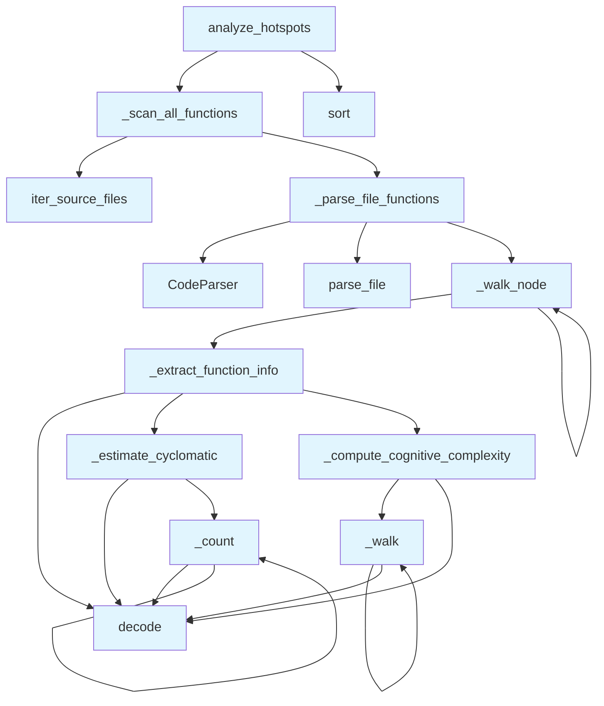

# File: `src/local_deepwiki/generators/analysis/hotspots.py`

## File Overview

This file provides functionality to analyze source code repositories and identify "hotspots" — functions that are particularly complex or resource-intensive based on various metrics such as cyclomatic complexity, cognitive complexity, parameter count, function length, or nesting depth.

The analysis is performed entirely offline using tree-sitter AST parsing, without any external dependencies or network calls. It is designed to support tools like complexity reports, architecture health dashboards, and churn analysis by ranking functions across a repository based on a chosen metric.

## Key Concepts

### Function Metrics Extraction

The core of this module is the ability to extract per-function metrics from source code using AST traversal. The following metrics are computed:

- **Cyclomatic Complexity**: Estimated using `_estimate_cyclomatic`, which counts decision points.
- **Cognitive Complexity**: Computed using `_compute_cognitive_complexity`, following SonarSource’s specification.
- **Function Length**: Measured in lines of code.
- **[Parameter](api_docs.md) Count**: Number of non-`self`/`cls` parameters.
- **Nesting Depth**: How deeply nested a function is within other control structures.

These metrics are essential for identifying functions that may be difficult to maintain or test.

### AST Traversal Patterns

The module leverages recursive AST traversal through functions like `_walk_node` and `_walk`, which walk the tree-sitter AST nodes and [collect](../../web/routes_chat.md) relevant information. These functions are structured to handle different node types appropriately:

- Control flow constructs (`if`, `for`, `while`) are treated as structural increments for complexity.
- Logical operators (`and`, `or`) are analyzed for switching between operator types to compute cognitive complexity.
- Nesting levels are tracked to provide accurate nesting depth for functions.

This approach allows for fine-grained analysis of code structure and complexity without relying on precomputed metrics or external tools.

### Metric-Based Ranking

The `analyze_hotspots` function provides a unified interface for ranking functions based on a specified metric. This allows users to focus on different aspects of code quality:

- **Complexity**: Cyclomatic complexity
- **Parameters**: Number of parameters
- **Length**: Number of lines
- **Nesting**: Nesting depth
- **Cognitive**: Cognitive complexity

This flexibility makes the module adaptable to various code quality and maintenance needs.

## Integration

This module is part of the `local_deepwiki.generators.analysis` package and integrates with other core components:

- **[`CodeParser`](../../core/parser/code_parser.md)**: Used via `local_deepwiki.core.parser` to parse source files into tree-sitter ASTs.
- **[`iter_source_files`](source_filter.md)**: From `local_deepwiki.generators.analysis.source_filter`, it walks the repository and identifies source files to process.
- **Logging**: Utilizes [`get_logger`](../../logging.md) from `local_deepwiki.logging` for status and debug messages.

The module is called by several other components in the system, including:

- `complexity`, `design_smells`, `architecture_health`, and others for detailed analysis.
- `churn`, `hotspots_page`, `module_health` for reporting or visualization purposes.

This modular design ensures that hotspot analysis can be reused across multiple analysis tasks, promoting consistency and reducing code duplication.

## Design Notes

### Offline Analysis

The entire analysis is performed offline using only local file system access and tree-sitter parsing. This makes it fast, secure, and suitable for environments where network access is restricted or unavailable.

### Handling of Edge Cases

- **Anonymous Functions**: Anonymous functions are labeled as `<anonymous>` in the output.
- **Invalid Metrics**: The `analyze_hotspots` function validates the input metric and returns an error if invalid.
- **Threshold Filtering**: Functions can be filtered based on a minimum metric value, allowing for fine-grained control over results.
- **Test File Exclusion**: By default, test files are excluded from analysis, which improves relevance for production code analysis.

### Performance Considerations

- The AST traversal is optimized to avoid unnecessary recursion and to compute metrics efficiently.
- The use of `nonlocal` in nested functions (`_count`, `_walk`) avoids passing state through function arguments, improving readability and performance.
- Results are pre-sorted and truncated to `top_n` to reduce memory usage and improve responsiveness.

### Metric Mapping

The module maps the user-facing `metric` parameter to internal keys. For example, `"complexity"` maps to `"cyclomatic"` for consistency with the complexity calculation. This design choice allows for a clean public API while internally managing multiple complexity-related metrics.

This approach also supports future expansion, such as adding more metrics or modifying how they are computed, without breaking existing APIs.

## API Reference

### Functions

#### `analyze_hotspots`

```python
def analyze_hotspots(repo_path: Path, metric: str = "complexity", top_n: int = 20, min_threshold: float | None = None, exclude_tests: bool = True) -> dict[str, Any]
```

Walk all source files in *repo_path* and rank functions by *metric*.


| Parameter | Type | Default | Description |
|-----------|------|---------|-------------|
| `repo_path` | `Path` | - | Root of the repository to scan. |
| `metric` | `str` | `"complexity"` | Ranking key — one of ``complexity``, ``params``, ``length``, ``nesting``. |
| `top_n` | `int` | `20` | How many results to return (1–100). |
| `min_threshold` | `float | None` | `None` | Optional minimum metric value to include. |
| `exclude_tests` | `bool` | `True` | When ``True``, skip test files. |

**Returns:** `dict[str, Any]`


<details>
<summary>View Source (lines 266-336) | <a href="https://github.com/UrbanDiver/local-deepwiki-mcp/blob/main/src/local_deepwiki/generators/analysis/hotspots.py#L266-L336">GitHub</a></summary>

```python
def analyze_hotspots(
    repo_path: Path,
    metric: str = "complexity",
    top_n: int = 20,
    min_threshold: float | None = None,
    exclude_tests: bool = True,
) -> dict[str, Any]:
    """Walk all source files in *repo_path* and rank functions by *metric*.

    Args:
        repo_path: Root of the repository to scan.
        metric: Ranking key — one of ``complexity``, ``params``, ``length``,
            ``nesting``.
        top_n: How many results to return (1–100).
        min_threshold: Optional minimum metric value to include.
        exclude_tests: When ``True``, skip test files.

    Returns:
        A dict with ``status``, ``hotspots``, and ``stats`` keys.
    """
    if metric not in VALID_METRICS:
        return {
            "status": "error",
            "message": (
                f"Invalid metric '{metric}'. Valid values: "
                + ", ".join(sorted(VALID_METRICS))
            ),
        }

    metric_key = "cyclomatic" if metric == "complexity" else metric

    all_functions, files_scanned = _scan_all_functions(repo_path, exclude_tests)

    if min_threshold is not None:
        all_functions = [f for f in all_functions if f[metric_key] >= min_threshold]

    all_functions.sort(key=lambda f: f[metric_key], reverse=True)

    hotspots = [
        {
            "function": f["function"],
            "file": f["file"],
            "line": f["line"],
            "metric_value": f[metric_key],
            "details": {
                "cyclomatic": f["cyclomatic"],
                "cognitive": f["cognitive"],
                "params": f["params"],
                "length": f["length"],
                "nesting": f["nesting"],
            },
        }
        for f in all_functions[:top_n]
    ]

    logger.info(
        "Hotspots: %d functions scanned, top %d by %s returned",
        len(all_functions),
        len(hotspots),
        metric,
    )

    return {
        "status": "success",
        "hotspots": hotspots,
        "stats": {
            "total_functions": len(all_functions),
            "files_scanned": files_scanned,
            "metric_used": metric,
        },
    }
```

</details>

## Call Graph



## Used By

Functions and methods in this file and their callers:

- **[`CodeParser`](../../core/parser/code_parser.md)**: called by `_parse_file_functions`
- **`_compute_cognitive_complexity`**: called by `_extract_function_info`
- **`_count`**: called by `_count`, `_estimate_cyclomatic`
- **`_estimate_cyclomatic`**: called by `_extract_function_info`
- **`_extract_function_info`**: called by `_walk_node`
- **`_parse_file_functions`**: called by `_scan_all_functions`
- **`_scan_all_functions`**: called by `analyze_hotspots`
- **`_walk`**: called by `_compute_cognitive_complexity`, `_walk`
- **`_walk_node`**: called by `_parse_file_functions`, `_walk_node`
- **`decode`**: called by `_compute_cognitive_complexity`, `_count`, `_estimate_cyclomatic`, `_extract_function_info`, `_walk`
- **[`iter_source_files`](source_filter.md)**: called by `_scan_all_functions`
- **`parse_file`**: called by `_parse_file_functions`
- **`sort`**: called by `analyze_hotspots`

## Usage Examples

*Examples extracted from test files*

### Handler returns a success response

From `test_hotspots.py::test_hotspots_returns_success`:

```python
result = await handle_get_hotspots({"repo_path": str(simple_repo)})
data = json.loads(result[0].text)
assert data["status"] == "success"
```

### Flat function with no control flow has cognitive complexity 0

From `test_hotspots.py::test_cognitive_complexity_simple_function`:

```python
_compute_cognitive_complexity,
)
from local_deepwiki.core.parser.code_parser import CodeParser
from local_deepwiki.models import Language as LangEnum
from local_deepwiki.core.parser.ast_utils import find_nodes_by_type

source = "def simple(a, b):\n    return a + b\n"
parser = CodeParser()
root = parser.parse_source(source, LangEnum.PYTHON)
fns = find_nodes_by_type(root, {"function_definition"})
assert _compute_cognitive_complexity(fns[0]) == 0
```

### Top-level if: +1 structural, 0 nesting = 1

From `test_hotspots.py::test_cognitive_complexity_single_if`:

```python
_compute_cognitive_complexity,
)
from local_deepwiki.core.parser.code_parser import CodeParser
from local_deepwiki.models import Language as LangEnum
from local_deepwiki.core.parser.ast_utils import find_nodes_by_type

source = "def f(x):\n    if x:\n        return 1\n    return 0\n"
parser = CodeParser()
root = parser.parse_source(source, LangEnum.PYTHON)
fns = find_nodes_by_type(root, {"function_definition"})
assert _compute_cognitive_complexity(fns[0]) == 1
```

### Example: `hotspots`

From `test_hotspots_page.py::test_returns_markdown_with_title_and_table_headers`:

```python
result = generate_hotspots_page(_make_data())
    assert result is not None
    assert "# Complexity Hotspots" in result
    assert "| Rank |" in result
    assert "| Function |" in result
    assert "| File |" in result
    assert "| CC |" in result
    assert "| Lines |" in result
    assert "| Params |" in result
    assert "| Nesting |" in result
```


## Last Modified

| Entity | Type | Author | Date | Commit |
|--------|------|--------|------|--------|
| `_compute_cognitive_complexity` | function | Brian Breidenbach | today | `db19fc2` feat: add cognitive complex... |
| `_walk` | function | Brian Breidenbach | today | `db19fc2` feat: add cognitive complex... |
| `_extract_function_info` | function | Brian Breidenbach | today | `db19fc2` feat: add cognitive complex... |
| `_parse_file_functions` | function | Brian Breidenbach | today | `db19fc2` feat: add cognitive complex... |
| `analyze_hotspots` | function | Brian Breidenbach | today | `db19fc2` feat: add cognitive complex... |
| `_scan_all_functions` | function | Brian Breidenbach | 5 days ago | `29ae780` refactor: decompose long me... |
| `_estimate_cyclomatic` | function | Brian Breidenbach | 2 weeks ago | `f6da957` feat: add 4 architecture an... |
| `_count` | function | Brian Breidenbach | 2 weeks ago | `f6da957` feat: add 4 architecture an... |
| `_walk_node` | function | Brian Breidenbach | 2 weeks ago | `f6da957` feat: add 4 architecture an... |

## Additional Source Code

Source code for functions and methods not listed in the API Reference above.

#### `_estimate_cyclomatic`

<details>
<summary>View Source (lines 69-89) | <a href="https://github.com/UrbanDiver/local-deepwiki-mcp/blob/main/src/local_deepwiki/generators/analysis/hotspots.py#L69-L89">GitHub</a></summary>

```python
def _estimate_cyclomatic(node: Node) -> int:
    """Estimate cyclomatic complexity by counting decision points."""
    count = 1  # Base complexity

    def _count(n: Node) -> None:
        nonlocal count
        if n.type in _BRANCH_TYPES:
            count += 1
        if n.type in ("boolean_operator", "binary_expression"):
            for child in n.children:
                if child.type in ("and", "or") or (
                    child.text
                    and child.text.decode("utf-8", errors="replace") in _LOGICAL_OPS
                ):
                    count += 1
                    break
        for child in n.children:
            _count(child)

    _count(node)
    return count
```

</details>


#### `_count`

<details>
<summary>View Source (lines 73-86) | <a href="https://github.com/UrbanDiver/local-deepwiki-mcp/blob/main/src/local_deepwiki/generators/analysis/hotspots.py#L73-L86">GitHub</a></summary>

```python
def _count(n: Node) -> None:
        nonlocal count
        if n.type in _BRANCH_TYPES:
            count += 1
        if n.type in ("boolean_operator", "binary_expression"):
            for child in n.children:
                if child.type in ("and", "or") or (
                    child.text
                    and child.text.decode("utf-8", errors="replace") in _LOGICAL_OPS
                ):
                    count += 1
                    break
        for child in n.children:
            _count(child)
```

</details>


#### `_compute_cognitive_complexity`

<details>
<summary>View Source (lines 126-180) | <a href="https://github.com/UrbanDiver/local-deepwiki-mcp/blob/main/src/local_deepwiki/generators/analysis/hotspots.py#L126-L180">GitHub</a></summary>

```python
def _compute_cognitive_complexity(node: Node) -> int:
    """Compute cognitive complexity following SonarSource's specification.

    Three increment rules:
    1. Structural: +1 for each control flow break (if, for, while, catch, etc.)
    2. Nesting: +nesting_depth for each structural increment inside nesting
    3. Fundamental: +1 for each switch between logical operator types
    """
    score = 0

    def _walk(n: Node, nesting: int) -> None:
        nonlocal score

        if n.type in _COGNITIVE_NESTING_TYPES:
            # Structural +1, plus nesting bonus
            score += 1 + nesting
            # Children are nested one level deeper
            for child in n.children:
                _walk(child, nesting + 1)
            return

        if n.type in _COGNITIVE_FLAT_TYPES:
            # Structural +1, but no nesting bonus and no nesting increase
            score += 1
            for child in n.children:
                _walk(child, nesting)
            return

        if n.type in _COGNITIVE_NEST_ONLY:
            # No structural increment, but increases nesting for children
            for child in n.children:
                _walk(child, nesting + 1)
            return

        # Logical operator sequences: +1 per switch between operator types
        if n.type in ("boolean_operator", "binary_expression"):
            op_text = None
            for child in n.children:
                child_text = (
                    child.text.decode("utf-8", errors="replace") if child.text else ""
                )
                if child_text in ("and", "or", "&&", "||"):
                    if op_text is None or child_text != op_text:
                        score += 1
                        op_text = child_text
            # Still walk children for nested boolean expressions
            for child in n.children:
                _walk(child, nesting)
            return

        for child in n.children:
            _walk(child, nesting)

    _walk(node, 0)
    return score
```

</details>


#### `_walk`

<details>
<summary>View Source (lines 136-177) | <a href="https://github.com/UrbanDiver/local-deepwiki-mcp/blob/main/src/local_deepwiki/generators/analysis/hotspots.py#L136-L177">GitHub</a></summary>

```python
def _walk(n: Node, nesting: int) -> None:
        nonlocal score

        if n.type in _COGNITIVE_NESTING_TYPES:
            # Structural +1, plus nesting bonus
            score += 1 + nesting
            # Children are nested one level deeper
            for child in n.children:
                _walk(child, nesting + 1)
            return

        if n.type in _COGNITIVE_FLAT_TYPES:
            # Structural +1, but no nesting bonus and no nesting increase
            score += 1
            for child in n.children:
                _walk(child, nesting)
            return

        if n.type in _COGNITIVE_NEST_ONLY:
            # No structural increment, but increases nesting for children
            for child in n.children:
                _walk(child, nesting + 1)
            return

        # Logical operator sequences: +1 per switch between operator types
        if n.type in ("boolean_operator", "binary_expression"):
            op_text = None
            for child in n.children:
                child_text = (
                    child.text.decode("utf-8", errors="replace") if child.text else ""
                )
                if child_text in ("and", "or", "&&", "||"):
                    if op_text is None or child_text != op_text:
                        score += 1
                        op_text = child_text
            # Still walk children for nested boolean expressions
            for child in n.children:
                _walk(child, nesting)
            return

        for child in n.children:
            _walk(child, nesting)
```

</details>


#### `_extract_function_info`

<details>
<summary>View Source (lines 183-210) | <a href="https://github.com/UrbanDiver/local-deepwiki-mcp/blob/main/src/local_deepwiki/generators/analysis/hotspots.py#L183-L210">GitHub</a></summary>

```python
def _extract_function_info(node: Node, depth: int) -> dict[str, Any]:
    """Extract name, line range, param count, and complexity from a function node."""
    name = ""
    param_count = 0
    for child in node.children:
        if child.type in ("identifier", "name", "property_identifier"):
            name = child.text.decode("utf-8", errors="replace") if child.text else ""
        if child.type in ("parameters", "formal_parameters", "parameter_list"):
            param_count = sum(
                1
                for p in child.children
                if p.type not in ("(", ")", ",", "comment")
                and (p.text.decode("utf-8", errors="replace") if p.text else "")
                not in ("self", "cls")
            )
    cyclomatic = _estimate_cyclomatic(node)
    cognitive = _compute_cognitive_complexity(node)
    length = node.end_point[0] - node.start_point[0] + 1
    return {
        "name": name,
        "line": node.start_point[0] + 1,
        "end_line": node.end_point[0] + 1,
        "cyclomatic": cyclomatic,
        "cognitive": cognitive,
        "params": param_count,
        "length": length,
        "nesting": depth,
    }
```

</details>


#### `_walk_node`

<details>
<summary>View Source (lines 213-219) | <a href="https://github.com/UrbanDiver/local-deepwiki-mcp/blob/main/src/local_deepwiki/generators/analysis/hotspots.py#L213-L219">GitHub</a></summary>

```python
def _walk_node(node: Node, depth: int, results: list[dict[str, Any]]) -> None:
    """Recursively collect function metrics from the AST."""
    if node.type in _FUNCTION_TYPES:
        results.append(_extract_function_info(node, depth))
    next_depth = depth + 1 if node.type in _NESTING_TYPES else depth
    for child in node.children:
        _walk_node(child, next_depth, results)
```

</details>


#### `_parse_file_functions`

<details>
<summary>View Source (lines 222-243) | <a href="https://github.com/UrbanDiver/local-deepwiki-mcp/blob/main/src/local_deepwiki/generators/analysis/hotspots.py#L222-L243">GitHub</a></summary>

```python
def _parse_file_functions(full_path: Path, rel_path: Path) -> list[dict[str, Any]]:
    """Parse one file and return per-function metric rows."""
    parser = CodeParser()
    parse_result = parser.parse_file(full_path)
    if parse_result is None:
        return []
    root_node, _lang, _src = parse_result
    raw: list[dict[str, Any]] = []
    _walk_node(root_node, 0, raw)
    return [
        {
            "function": entry["name"] or "<anonymous>",
            "file": str(rel_path),
            "line": entry["line"],
            "cyclomatic": entry["cyclomatic"],
            "cognitive": entry["cognitive"],
            "params": entry["params"],
            "length": entry["length"],
            "nesting": entry["nesting"],
        }
        for entry in raw
    ]
```

</details>


#### `_scan_all_functions`

<details>
<summary>View Source (lines 246-263) | <a href="https://github.com/UrbanDiver/local-deepwiki-mcp/blob/main/src/local_deepwiki/generators/analysis/hotspots.py#L246-L263">GitHub</a></summary>

```python
def _scan_all_functions(
    repo_path: Path,
    exclude_tests: bool,
) -> tuple[list[dict[str, Any]], int]:
    """Walk all source files and collect per-function metrics.

    Returns (all_functions, files_scanned).
    """
    all_functions: list[dict[str, Any]] = []
    files_scanned = 0
    for full_path, rel_path in iter_source_files(
        repo_path, exclude_tests=exclude_tests
    ):
        rows = _parse_file_functions(full_path, rel_path)
        if rows:
            all_functions.extend(rows)
        files_scanned += 1
    return all_functions, files_scanned
```

</details>

## Relevant Source Files

- `src/local_deepwiki/generators/analysis/hotspots.py:69-89`
