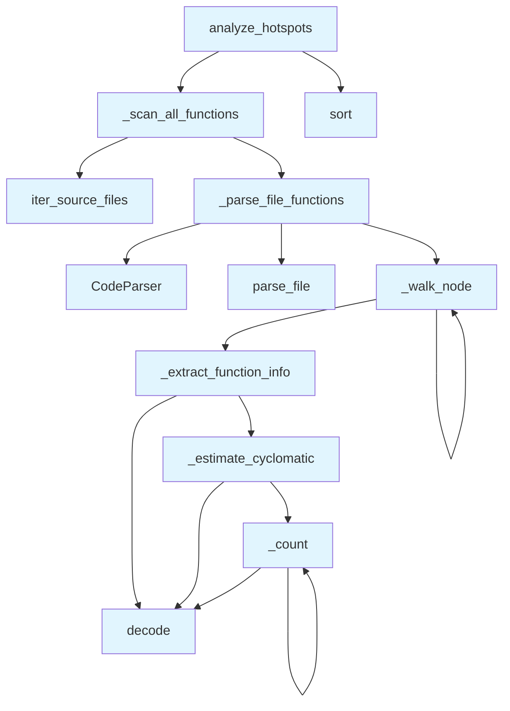

# File: `src/local_deepwiki/generators/analysis/hotspots.py`

## File Overview

This file implements **hotspot analysis**, a mechanism for identifying and ranking functions within a codebase based on complexity or other metrics. It performs static analysis using tree-sitter AST parsing to extract function-level data without requiring external services or LLMs. The analysis supports ranking by cyclomatic complexity, parameter count, function length, and nesting depth.

The module is designed to be used by analysis tools that need to highlight problematic or complex functions in a repository, such as in documentation generation or architecture health checks.

## Key Concepts

### AST-Based Function Parsing
The core of this module's functionality is based on **tree-sitter AST parsing**. It leverages the [`CodeParser`](../../core/parser/code_parser.md) class to parse source code into structured abstract syntax trees, which are then traversed to extract function metrics.

### Cyclomatic Complexity Estimation
Cyclomatic complexity is estimated by counting decision points in the function's control flow:
- Branching constructs like `if`, `while`, `for`, `switch`, etc., increase complexity.
- Logical operators like `and`, `or` also contribute to complexity.
- The `_estimate_cyclomatic` function recursively traverses a node and accumulates complexity based on these rules.

### Function Metrics Extraction
Each function node in the AST is analyzed to extract:
- Function name
- Line number and end line
- [Parameter](api_docs.md) count (excluding `self` and `cls`)
- Cyclomatic complexity
- Function length (in lines)
- Nesting depth

These metrics are stored and used to rank functions during hotspot analysis.

### Recursive AST Traversal
The `_walk_node` function recursively traverses the AST, collecting function information and updating nesting depth when entering nested constructs like function definitions or control structures.

## Integration

This module is part of the analysis pipeline and integrates with:
- [`iter_source_files`](source_filter.md) from `local_deepwiki.generators.analysis.source_filter` to iterate over source files in a repository.
- [`CodeParser`](../../core/parser/code_parser.md) from `local_deepwiki.core.parser` to perform AST parsing.
- [`get_logger`](../../logging.md) from `local_deepwiki.logging` for logging during analysis.

It is used by:
- `hotspots_page` (for generating hotspot reports)
- `analysis_architecture` (for architecture health checks)
- Various internal analysis tools that require complexity or structural insights

The module is **not dependent on any LLM or external API**, making it fast and self-contained for local analysis.

## Design Notes

### Why Static Analysis?
This module avoids LLMs or external services to ensure:
- **Speed**: Analysis runs entirely from the filesystem.
- **Reproducibility**: No external dependencies or network calls.
- **Security**: No data is sent to external systems.

### Why Tree-Sitter?
Tree-sitter provides:
- **[Language](../../models/foundation.md)-agnostic ASTs** (supports multiple languages).
- **Accurate parsing** with full syntactic context.
- **Efficient traversal** for extracting function metrics.

### Function Ranking and Filtering
The `analyze_hotspots` function supports:
- Filtering by a minimum threshold (`min_threshold`)
- Ranking by various metrics (`complexity`, `params`, `length`, `nesting`)
- Returning only top `N` results (`top_n`)

### Handling Anonymous Functions
Anonymous functions are labeled as `<anonymous>` in the output to ensure all entries are meaningful.

### Nesting Depth Calculation
Nesting depth is calculated by tracking when entering constructs like nested functions or control structures. This helps identify deeply nested code that may be hard to follow.

### Metric Mapping
The `complexity` metric is mapped to `cyclomatic` internally for consistency in sorting and reporting.

### Error Handling
If a file fails to parse, it is skipped silently. This ensures that one broken file doesn't stop the entire analysis.

## API Reference

### Functions

#### `analyze_hotspots`

```python
def analyze_hotspots(repo_path: Path, metric: str = "complexity", top_n: int = 20, min_threshold: float | None = None, exclude_tests: bool = True) -> dict[str, Any]
```

Walk all source files in *repo_path* and rank functions by *metric*.


| Parameter | Type | Default | Description |
|-----------|------|---------|-------------|
| `repo_path` | `Path` | - | Root of the repository to scan. |
| `metric` | `str` | `"complexity"` | Ranking key — one of ``complexity``, ``params``, ``length``, ``nesting``. |
| `top_n` | `int` | `20` | How many results to return (1–100). |
| `min_threshold` | `float | None` | `None` | Optional minimum metric value to include. |
| `exclude_tests` | `bool` | `True` | When ``True``, skip test files. |

**Returns:** `dict[str, Any]`


<details>
<summary>View Source (lines 172-241) | <a href="https://github.com/UrbanDiver/local-deepwiki-mcp/blob/main/src/local_deepwiki/generators/analysis/hotspots.py#L172-L241">GitHub</a></summary>

```python
def analyze_hotspots(
    repo_path: Path,
    metric: str = "complexity",
    top_n: int = 20,
    min_threshold: float | None = None,
    exclude_tests: bool = True,
) -> dict[str, Any]:
    """Walk all source files in *repo_path* and rank functions by *metric*.

    Args:
        repo_path: Root of the repository to scan.
        metric: Ranking key — one of ``complexity``, ``params``, ``length``,
            ``nesting``.
        top_n: How many results to return (1–100).
        min_threshold: Optional minimum metric value to include.
        exclude_tests: When ``True``, skip test files.

    Returns:
        A dict with ``status``, ``hotspots``, and ``stats`` keys.
    """
    if metric not in VALID_METRICS:
        return {
            "status": "error",
            "message": (
                f"Invalid metric '{metric}'. Valid values: "
                + ", ".join(sorted(VALID_METRICS))
            ),
        }

    metric_key = "cyclomatic" if metric == "complexity" else metric

    all_functions, files_scanned = _scan_all_functions(repo_path, exclude_tests)

    if min_threshold is not None:
        all_functions = [f for f in all_functions if f[metric_key] >= min_threshold]

    all_functions.sort(key=lambda f: f[metric_key], reverse=True)

    hotspots = [
        {
            "function": f["function"],
            "file": f["file"],
            "line": f["line"],
            "metric_value": f[metric_key],
            "details": {
                "cyclomatic": f["cyclomatic"],
                "params": f["params"],
                "length": f["length"],
                "nesting": f["nesting"],
            },
        }
        for f in all_functions[:top_n]
    ]

    logger.info(
        "Hotspots: %d functions scanned, top %d by %s returned",
        len(all_functions),
        len(hotspots),
        metric,
    )

    return {
        "status": "success",
        "hotspots": hotspots,
        "stats": {
            "total_functions": len(all_functions),
            "files_scanned": files_scanned,
            "metric_used": metric,
        },
    }
```

</details>

## Call Graph



## Used By

Functions and methods in this file and their callers:

- **[`CodeParser`](../../core/parser/code_parser.md)**: called by `_parse_file_functions`
- **`_count`**: called by `_count`, `_estimate_cyclomatic`
- **`_estimate_cyclomatic`**: called by `_extract_function_info`
- **`_extract_function_info`**: called by `_walk_node`
- **`_parse_file_functions`**: called by `_scan_all_functions`
- **`_scan_all_functions`**: called by `analyze_hotspots`
- **`_walk_node`**: called by `_parse_file_functions`, `_walk_node`
- **`decode`**: called by `_count`, `_estimate_cyclomatic`, `_extract_function_info`
- **[`iter_source_files`](source_filter.md)**: called by `_scan_all_functions`
- **`parse_file`**: called by `_parse_file_functions`
- **`sort`**: called by `analyze_hotspots`

## Usage Examples

*Examples extracted from test files*

### Handler returns a success response

From `test_hotspots.py::test_hotspots_returns_success`:

```python
result = await handle_get_hotspots({"repo_path": str(simple_repo)})
data = json.loads(result[0].text)
assert data["status"] == "success"
```

### Example: `hotspots`

From `test_hotspots_page.py::test_returns_markdown_with_title_and_table_headers`:

```python
result = generate_hotspots_page(_make_data())
    assert result is not None
    assert "# Complexity Hotspots" in result
    assert "| Rank |" in result
    assert "| Function |" in result
    assert "| File |" in result
    assert "| CC |" in result
    assert "| Lines |" in result
    assert "| Params |" in result
    assert "| Nesting |" in result
```


## Last Modified

| Entity | Type | Author | Date | Commit |
|--------|------|--------|------|--------|
| `_scan_all_functions` | function | Brian Breidenbach | yesterday | `29ae780` refactor: decompose long me... |
| `analyze_hotspots` | function | Brian Breidenbach | yesterday | `29ae780` refactor: decompose long me... |
| `_estimate_cyclomatic` | function | Brian Breidenbach | 1 week ago | `f6da957` feat: add 4 architecture an... |
| `_count` | function | Brian Breidenbach | 1 week ago | `f6da957` feat: add 4 architecture an... |
| `_extract_function_info` | function | Brian Breidenbach | 1 week ago | `f6da957` feat: add 4 architecture an... |
| `_walk_node` | function | Brian Breidenbach | 1 week ago | `f6da957` feat: add 4 architecture an... |
| `_parse_file_functions` | function | Brian Breidenbach | 1 week ago | `f6da957` feat: add 4 architecture an... |

## Additional Source Code

Source code for functions and methods not listed in the API Reference above.

#### `_estimate_cyclomatic`

<details>
<summary>View Source (lines 69-89) | <a href="https://github.com/UrbanDiver/local-deepwiki-mcp/blob/main/src/local_deepwiki/generators/analysis/hotspots.py#L69-L89">GitHub</a></summary>

```python
def _estimate_cyclomatic(node: Node) -> int:
    """Estimate cyclomatic complexity by counting decision points."""
    count = 1  # Base complexity

    def _count(n: Node) -> None:
        nonlocal count
        if n.type in _BRANCH_TYPES:
            count += 1
        if n.type in ("boolean_operator", "binary_expression"):
            for child in n.children:
                if child.type in ("and", "or") or (
                    child.text
                    and child.text.decode("utf-8", errors="replace") in _LOGICAL_OPS
                ):
                    count += 1
                    break
        for child in n.children:
            _count(child)

    _count(node)
    return count
```

</details>


#### `_count`

<details>
<summary>View Source (lines 73-86) | <a href="https://github.com/UrbanDiver/local-deepwiki-mcp/blob/main/src/local_deepwiki/generators/analysis/hotspots.py#L73-L86">GitHub</a></summary>

```python
def _count(n: Node) -> None:
        nonlocal count
        if n.type in _BRANCH_TYPES:
            count += 1
        if n.type in ("boolean_operator", "binary_expression"):
            for child in n.children:
                if child.type in ("and", "or") or (
                    child.text
                    and child.text.decode("utf-8", errors="replace") in _LOGICAL_OPS
                ):
                    count += 1
                    break
        for child in n.children:
            _count(child)
```

</details>


#### `_extract_function_info`

<details>
<summary>View Source (lines 92-117) | <a href="https://github.com/UrbanDiver/local-deepwiki-mcp/blob/main/src/local_deepwiki/generators/analysis/hotspots.py#L92-L117">GitHub</a></summary>

```python
def _extract_function_info(node: Node, depth: int) -> dict[str, Any]:
    """Extract name, line range, param count, and complexity from a function node."""
    name = ""
    param_count = 0
    for child in node.children:
        if child.type in ("identifier", "name", "property_identifier"):
            name = child.text.decode("utf-8", errors="replace") if child.text else ""
        if child.type in ("parameters", "formal_parameters", "parameter_list"):
            param_count = sum(
                1
                for p in child.children
                if p.type not in ("(", ")", ",", "comment")
                and (p.text.decode("utf-8", errors="replace") if p.text else "")
                not in ("self", "cls")
            )
    cyclomatic = _estimate_cyclomatic(node)
    length = node.end_point[0] - node.start_point[0] + 1
    return {
        "name": name,
        "line": node.start_point[0] + 1,
        "end_line": node.end_point[0] + 1,
        "cyclomatic": cyclomatic,
        "params": param_count,
        "length": length,
        "nesting": depth,
    }
```

</details>


#### `_walk_node`

<details>
<summary>View Source (lines 120-126) | <a href="https://github.com/UrbanDiver/local-deepwiki-mcp/blob/main/src/local_deepwiki/generators/analysis/hotspots.py#L120-L126">GitHub</a></summary>

```python
def _walk_node(node: Node, depth: int, results: list[dict[str, Any]]) -> None:
    """Recursively collect function metrics from the AST."""
    if node.type in _FUNCTION_TYPES:
        results.append(_extract_function_info(node, depth))
    next_depth = depth + 1 if node.type in _NESTING_TYPES else depth
    for child in node.children:
        _walk_node(child, next_depth, results)
```

</details>


#### `_parse_file_functions`

<details>
<summary>View Source (lines 129-149) | <a href="https://github.com/UrbanDiver/local-deepwiki-mcp/blob/main/src/local_deepwiki/generators/analysis/hotspots.py#L129-L149">GitHub</a></summary>

```python
def _parse_file_functions(full_path: Path, rel_path: Path) -> list[dict[str, Any]]:
    """Parse one file and return per-function metric rows."""
    parser = CodeParser()
    parse_result = parser.parse_file(full_path)
    if parse_result is None:
        return []
    root_node, _lang, _src = parse_result
    raw: list[dict[str, Any]] = []
    _walk_node(root_node, 0, raw)
    return [
        {
            "function": entry["name"] or "<anonymous>",
            "file": str(rel_path),
            "line": entry["line"],
            "cyclomatic": entry["cyclomatic"],
            "params": entry["params"],
            "length": entry["length"],
            "nesting": entry["nesting"],
        }
        for entry in raw
    ]
```

</details>


#### `_scan_all_functions`

<details>
<summary>View Source (lines 152-169) | <a href="https://github.com/UrbanDiver/local-deepwiki-mcp/blob/main/src/local_deepwiki/generators/analysis/hotspots.py#L152-L169">GitHub</a></summary>

```python
def _scan_all_functions(
    repo_path: Path,
    exclude_tests: bool,
) -> tuple[list[dict[str, Any]], int]:
    """Walk all source files and collect per-function metrics.

    Returns (all_functions, files_scanned).
    """
    all_functions: list[dict[str, Any]] = []
    files_scanned = 0
    for full_path, rel_path in iter_source_files(
        repo_path, exclude_tests=exclude_tests
    ):
        rows = _parse_file_functions(full_path, rel_path)
        if rows:
            all_functions.extend(rows)
        files_scanned += 1
    return all_functions, files_scanned
```

</details>

## Relevant Source Files

- `src/local_deepwiki/generators/analysis/hotspots.py:69-89`
