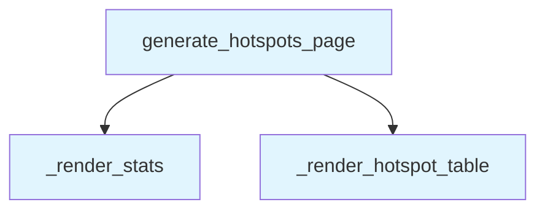

# File: `src/local_deepwiki/generators/analysis/hotspots_page.py`

## File Overview

This module is responsible for rendering the results of a complexity hotspots analysis into a structured markdown page. It takes the raw data dictionary returned by the `analyze_hotspots()` function and transforms it into a human-readable report that includes summary statistics and a ranked table of the most complex functions.

The design avoids external dependencies, asynchronous operations, or LLM calls, making it a pure computation module focused on formatting and presentation logic.

## Key Concepts

### Markdown Generation Strategy
The module uses a simple and efficient approach to build markdown content by appending lines to a list. This method avoids string concatenation overhead and keeps the structure of the output predictable and easy to maintain.

### Data Abstraction
The data passed in (`hotspots_data`) is expected to follow a specific schema:
- A top-level dictionary with keys `"hotspots"` and `"stats"`
- `"hotspots"` is a list of dictionaries, each representing a function hotspot
- `"stats"` is a dictionary containing summary statistics

This structure supports a clear separation between the raw analysis data and its presentation layer, enabling modularity and testability.

### Table Formatting
The hotspot table is rendered with a fixed set of columns and a maximum row limit (`_MAX_ROWS`). This ensures that the output remains readable and not overly verbose while still providing useful information. The use of markdown table syntax allows for clean rendering in wiki environments.

## Integration

This module is used by:
- `generate_hotspots_page` — the main entry point, called by `test_hotspots_page`
- `_render_stats` — used by `health_page` for rendering summary data

The functions are designed to be composable and reusable. For example, `_render_stats` can be independently invoked by other parts of the system that need to display summary statistics, and `_render_hotspot_table` could potentially be used elsewhere if a similar table format is required.

## Design Notes

### Handling Empty Data
If no hotspots are present (`hotspots` list is empty), the function returns `None`, indicating that no meaningful output should be generated. This prevents the creation of empty or misleading reports.

### Table Truncation
The hotspot table is limited to a maximum number of rows (defined by `_MAX_ROWS`), which is a practical decision to prevent overly long tables. The choice of truncation over pagination suggests that the tool is intended for quick inspection rather than deep analysis.

### Markdown Formatting Choices
The use of bold formatting (`**Total functions scanned:**`) improves readability in markdown viewers. Similarly, code-style formatting for function and file names (using backticks) ensures clarity when referencing code elements.

### No External Dependencies
The module does not rely on external libraries or async capabilities, keeping it lightweight and suitable for inclusion in environments where such features are not available or desired.

## API Reference

### Functions

#### `generate_hotspots_page`

```python
def generate_hotspots_page(hotspots_data: dict) -> str | None
```

Render hotspots dict as markdown.


| Parameter | Type | Default | Description |
|-----------|------|---------|-------------|
| `hotspots_data` | `dict` | - | Dict returned by ``analyze_hotspots()``. |

**Returns:** `str | None`


<details>
<summary>View Source (lines 14-34) | <a href="https://github.com/UrbanDiver/local-deepwiki-mcp/blob/main/src/local_deepwiki/generators/analysis/hotspots_page.py#L14-L34">GitHub</a></summary>

```python
def generate_hotspots_page(hotspots_data: dict) -> str | None:
    """Render hotspots dict as markdown.

    Args:
        hotspots_data: Dict returned by ``analyze_hotspots()``.

    Returns:
        Markdown string, or ``None`` if the data is empty / unusable.
    """
    hotspots = hotspots_data.get("hotspots", [])
    if not hotspots:
        return None

    lines: list[str] = []
    lines.append("# Complexity Hotspots")
    lines.append("")

    _render_stats(lines, hotspots_data.get("stats", {}))
    _render_hotspot_table(lines, hotspots)

    return "\n".join(lines)
```

</details>

## Call Graph



## Used By

Functions and methods in this file and their callers:

- **`_render_hotspot_table`**: called by `generate_hotspots_page`
- **`_render_stats`**: called by `generate_hotspots_page`

## Usage Examples

*Examples extracted from test files*

### Example: `hotspots_page`

From `test_hotspots_page.py::test_returns_markdown_with_title_and_table_headers`:

```python
result = generate_hotspots_page(_make_data())
    assert result is not None
    assert "# Complexity Hotspots" in result
    assert "| Rank |" in result
    assert "| Function |" in result
    assert "| File |" in result
    assert "| CC |" in result
    assert "| Lines |" in result
    assert "| Params |" in result
    assert "| Nesting |" in result
```

### Example: `generate_hotspots_page`

From `test_hotspots_page.py::test_returns_markdown_with_title_and_table_headers`:

```python
result = generate_hotspots_page(_make_data())
    assert result is not None
    assert "# Complexity Hotspots" in result
    assert "| Rank |" in result
    assert "| Function |" in result
    assert "| File |" in result
    assert "| CC |" in result
    assert "| Lines |" in result
    assert "| Params |" in result
    assert "| Nesting |" in result
```

### Example: `generate_hotspots_page`

From `test_hotspots_page.py::test_includes_function_name_and_file_in_output`:

```python
data = _make_data(
        hotspots=[
            _make_hotspot(function="process_data", file="core/engine.py", line=42)
        ]
    )
    result = generate_hotspots_page(data)
    assert result is not None
    assert "`process_data`" in result
    assert "`core/engine.py:42`" in result
```


## Last Modified

| Entity | Type | Author | Date | Commit |
|--------|------|--------|------|--------|
| `generate_hotspots_page` | function | Brian Breidenbach | 1 week ago | `d9789d0` feat: add Complexity Hotspo... |
| `_render_stats` | function | Brian Breidenbach | 1 week ago | `d9789d0` feat: add Complexity Hotspo... |
| `_render_hotspot_table` | function | Brian Breidenbach | 1 week ago | `d9789d0` feat: add Complexity Hotspo... |

## Additional Source Code

Source code for functions and methods not listed in the API Reference above.

#### `_render_stats`

<details>
<summary>View Source (lines 37-47) | <a href="https://github.com/UrbanDiver/local-deepwiki-mcp/blob/main/src/local_deepwiki/generators/analysis/hotspots_page.py#L37-L47">GitHub</a></summary>

```python
def _render_stats(lines: list[str], stats: dict) -> None:
    """Append summary statistics."""
    if not stats:
        return

    lines.append("## Summary")
    lines.append("")
    lines.append(f"- **Total functions scanned:** {stats.get('total_functions', 0):,}")
    lines.append(f"- **Files scanned:** {stats.get('files_scanned', 0):,}")
    lines.append(f"- **Metric used:** {stats.get('metric_used', 'complexity')}")
    lines.append("")
```

</details>


#### `_render_hotspot_table`

<details>
<summary>View Source (lines 50-63) | <a href="https://github.com/UrbanDiver/local-deepwiki-mcp/blob/main/src/local_deepwiki/generators/analysis/hotspots_page.py#L50-L63">GitHub</a></summary>

```python
def _render_hotspot_table(lines: list[str], hotspots: list[dict]) -> None:
    """Append ranked hotspot table, limited to top ``_MAX_ROWS``."""
    lines.append("## Top Hotspots")
    lines.append("")
    lines.append("| Rank | Function | File | CC | Lines | Params | Nesting |")
    lines.append("|------|----------|------|----|-------|--------|---------|")
    for rank, h in enumerate(hotspots[:_MAX_ROWS], start=1):
        d = h.get("details", {})
        lines.append(
            f"| {rank} | `{h['function']}` | `{h['file']}:{h['line']}` "
            f"| {d.get('cyclomatic', '')} | {d.get('length', '')} "
            f"| {d.get('params', '')} | {d.get('nesting', '')} |"
        )
    lines.append("")
```

</details>

## Relevant Source Files

- `src/local_deepwiki/generators/analysis/hotspots_page.py:14-34`
