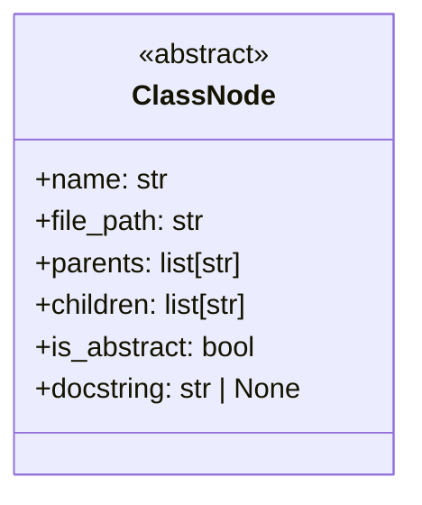
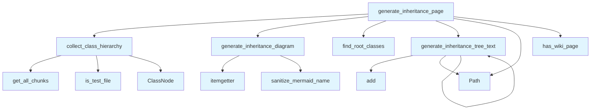

# File: `src/local_deepwiki/generators/analysis/inheritance.py`

## File Overview

This file provides functionality for extracting, analyzing, and visualizing class inheritance hierarchies within a codebase. It is responsible for collecting class information from indexed code chunks, building inheritance relationships, and generating documentation artifacts such as Mermaid diagrams and text-based inheritance trees.

The core purpose of this file is to support analysis and documentation generation by exposing class inheritance relationships in a structured and readable format. It is used primarily in the context of codebase analysis and documentation generation tools, such as the `lazy_generator` and test suites.

## Key Concepts

### Class Hierarchy Collection

The `collect_class_hierarchy` function is the central mechanism for extracting class information and their inheritance relationships from the vector store. It uses metadata from code chunks to identify parent classes and determines if a class is abstract based on common Python patterns (`ABC`, `@abstractmethod`, or keywords in docstrings).

This approach is chosen for its ability to leverage the existing indexing infrastructure, avoiding redundant file-level parsing and enabling efficient querying of class definitions across the codebase.

### Inheritance Tree Construction

The `ClassNode` dataclass is used to model each class in the inheritance tree, capturing essential properties like name, file path, parents, children, and abstraction status. The `find_root_classes` and `generate_inheritance_tree_text` functions work together to build and render textual inheritance trees, starting from root classes.

This design allows for clear visualization of class hierarchies and supports both recursive traversal and tree formatting for documentation.

### Mermaid Diagram Generation

The `generate_inheritance_diagram` function produces a Mermaid class diagram showing inheritance relationships. It filters to only include classes with internal inheritance (i.e., those that inherit from or are inherited by other classes in the codebase), avoiding noise from external base classes like `ABC` or `BaseModel`.

The choice to limit the number of classes in the diagram and prioritize those with more relationships ensures clarity and readability, especially in large codebases.

### Documentation Page Generation

The `generate_inheritance_page` function orchestrates the entire inheritance analysis pipeline, combining class collection, diagram generation, tree rendering, and a table of all classes. This function is used to produce a complete documentation page for inheritance relationships.

This design ensures that all inheritance-related information is presented in a single, cohesive document, enhancing usability for developers and analysts.

## Integration

This file integrates deeply with the core indexing and documentation generation infrastructure:

- It relies on [`IndexStatus`](../../models/wiki.md) and [`VectorStore`](../../core/vectorstore/store.md) to access indexed code chunks and metadata.
- It uses [`is_test_file`](source_filter.md) to filter out test classes, ensuring only production code is analyzed.
- It leverages [`sanitize_mermaid_name`](../diagrams/_utils.md) to ensure Mermaid diagrams are valid and readable.
- It integrates with [`has_wiki_page`](../wiki/utils.md) to generate appropriate file links in the documentation.

The functions in this file are called by:
- `test_impact_analysis`, `test_inheritance` (test suite)
- `analysis_entity`, `analysis_service` (analysis pipelines)
- `lazy_generator` (documentation generation)

This makes it a core component in the analysis and documentation toolchain, enabling inheritance-aware analysis and visualization.

## Design Notes

### Filtering for Internal Inheritance

The system distinguishes between internal and external inheritance by checking if a parent class is present in the codebase (`p in classes`). This avoids cluttering diagrams and trees with external dependencies like `ABC` or `BaseModel`, which are common in Python projects but not part of the internal codebase being analyzed.

### Abstract Class Detection

Abstract classes are identified using multiple heuristics:
- Presence of `ABC` in parent classes
- Use of `@abstractmethod` [decorator](../../providers/retry.md)
- Keywords like "abstract" in the first 100 characters of the class content

This multi-method approach increases robustness in identifying abstract classes, even when decorators or docstrings are not consistently used.

### Handling Cycles and Re-entries

The `generate_inheritance_tree_text` function uses a `visited` set to prevent cycles in inheritance trees. This is a common pattern when traversing tree structures, and is critical for preventing infinite recursion in cases where inheritance might be circular (though not common in Python).

### Diagram Size Limitation

The `generate_inheritance_diagram` function includes a maximum class limit (`max_classes`) to prevent overly complex diagrams. This is a pragmatic choice to maintain usability in large codebases, where including all classes would result in unreadable output.

### Textual Tree Formatting

The textual tree output uses Unicode characters (`└─`) for visual clarity, and formats class names with markdown-style bolding and file paths for readability. This enhances the documentation's usability in markdown environments.

## API Reference

### class `ClassNode`

A class in the inheritance tree.

---


<details>
<summary>View Source (lines 17-25) | <a href="https://github.com/UrbanDiver/local-deepwiki-mcp/blob/main/src/local_deepwiki/generators/analysis/inheritance.py#L17-L25">GitHub</a></summary>

```python
class ClassNode:
    """A class in the inheritance tree."""

    name: str
    file_path: str
    parents: list[str] = field(default_factory=list)
    children: list[str] = field(default_factory=list)
    is_abstract: bool = False
    docstring: str | None = None
```

</details>

### Functions

#### `collect_class_hierarchy`

```python
async def collect_class_hierarchy(index_status: IndexStatus, vector_store: VectorStore) -> dict[str, ClassNode]
```

Collect all classes and their inheritance relationships.


| Parameter | Type | Default | Description |
|-----------|------|---------|-------------|
| `index_status` | `IndexStatus` | - | Index status with file information. |
| `vector_store` | `VectorStore` | - | Vector store with code chunks. |

**Returns:** `dict[str, ClassNode]`


<details>
<summary>View Source (lines 28-82) | <a href="https://github.com/UrbanDiver/local-deepwiki-mcp/blob/main/src/local_deepwiki/generators/analysis/inheritance.py#L28-L82">GitHub</a></summary>

```python
async def collect_class_hierarchy(
    index_status: IndexStatus,
    vector_store: VectorStore,
) -> dict[str, ClassNode]:
    """Collect all classes and their inheritance relationships.

    Args:
        index_status: Index status with file information.
        vector_store: Vector store with code chunks.

    Returns:
        Dictionary mapping class name to ClassNode.
    """
    classes: dict[str, ClassNode] = {}

    # Single filtered query for all CLASS chunks (instead of N per-file queries)
    for chunk in vector_store.get_all_chunks(chunk_type="class"):
        if is_test_file(chunk.file_path):
            continue
        class_name = chunk.name
        if not class_name:
            continue

        # Extract parent classes from metadata
        parent_classes = chunk.metadata.get("parent_classes", [])

        # Check if abstract
        is_abstract = (
            "ABC" in str(parent_classes)
            or "@abstractmethod" in chunk.content
            or "abstract" in chunk.content.lower()[:100]
        )

        # Create or update class node
        if class_name not in classes:
            classes[class_name] = ClassNode(
                name=class_name,
                file_path=chunk.file_path,
                parents=parent_classes,
                is_abstract=is_abstract,
                docstring=chunk.docstring,
            )
        else:
            # Merge if same class appears in multiple files (shouldn't happen often)
            existing = classes[class_name]
            existing.parents = list(set(existing.parents + parent_classes))

    # Build children relationships (reverse of parents)
    for class_name, class_node in classes.items():
        for parent in class_node.parents:
            if parent in classes:
                if class_name not in classes[parent].children:
                    classes[parent].children.append(class_name)

    return classes
```

</details>

#### `find_root_classes`

```python
def find_root_classes(classes: dict[str, ClassNode]) -> list[str]
```

Find classes that have no parents (root of inheritance trees).


| Parameter | Type | Default | Description |
|-----------|------|---------|-------------|
| `classes` | `dict[str, ClassNode]` | - | Dictionary of class nodes. |

**Returns:** `list[str]`


<details>
<summary>View Source (lines 85-100) | <a href="https://github.com/UrbanDiver/local-deepwiki-mcp/blob/main/src/local_deepwiki/generators/analysis/inheritance.py#L85-L100">GitHub</a></summary>

```python
def find_root_classes(classes: dict[str, ClassNode]) -> list[str]:
    """Find classes that have no parents (root of inheritance trees).

    Args:
        classes: Dictionary of class nodes.

    Returns:
        List of root class names, sorted alphabetically.
    """
    roots = []
    for class_name, class_node in classes.items():
        # A class is a root if it has no parents in our codebase
        has_internal_parent = any(p in classes for p in class_node.parents)
        if not has_internal_parent and class_node.children:
            roots.append(class_name)
    return sorted(roots)
```

</details>

#### `generate_inheritance_diagram`

```python
def generate_inheritance_diagram(classes: dict[str, ClassNode], max_classes: int = 50) -> str | None
```

Generate a Mermaid class diagram showing inheritance relationships.  Only shows classes with internal inheritance relationships (excludes classes that only inherit from external bases like BaseModel, Enum, ABC).


| Parameter | Type | Default | Description |
|-----------|------|---------|-------------|
| `classes` | `dict[str, ClassNode]` | - | Dictionary of class nodes. |
| `max_classes` | `int` | `50` | Maximum number of classes to include. |

**Returns:** `str | None`


<details>
<summary>View Source (lines 103-174) | <a href="https://github.com/UrbanDiver/local-deepwiki-mcp/blob/main/src/local_deepwiki/generators/analysis/inheritance.py#L103-L174">GitHub</a></summary>

```python
def generate_inheritance_diagram(
    classes: dict[str, ClassNode],
    max_classes: int = 50,
) -> str | None:
    """Generate a Mermaid class diagram showing inheritance relationships.

    Only shows classes with internal inheritance relationships (excludes
    classes that only inherit from external bases like BaseModel, Enum, ABC).

    Args:
        classes: Dictionary of class nodes.
        max_classes: Maximum number of classes to include.

    Returns:
        Mermaid diagram string or None if no inheritance found.
    """
    # Filter to classes that have INTERNAL inheritance relationships
    # (parent or child is also in our codebase)
    classes_with_internal_inheritance = {
        name: node
        for name, node in classes.items()
        if any(p in classes for p in node.parents) or node.children
    }

    if not classes_with_internal_inheritance:
        return None

    # If too many, prioritize classes with most internal relationships
    if len(classes_with_internal_inheritance) > max_classes:
        scored = [
            (name, len([p for p in node.parents if p in classes]) + len(node.children))
            for name, node in classes_with_internal_inheritance.items()
        ]
        scored = sorted(scored, key=itemgetter(1), reverse=True)
        keep_names = {name for name, _ in scored[:max_classes]}
        classes_with_internal_inheritance = {
            name: node
            for name, node in classes_with_internal_inheritance.items()
            if name in keep_names
        }

    lines = ["```mermaid", "classDiagram"]

    # Add class definitions
    for class_name in sorted(classes_with_internal_inheritance.keys()):
        node = classes_with_internal_inheritance[class_name]
        safe_name = sanitize_mermaid_name(class_name)

        if node.is_abstract:
            lines.append(f"    class {safe_name} {{")
            lines.append("        <<abstract>>")
            lines.append("    }")
        else:
            lines.append(f"    class {safe_name}")

    # Add inheritance relationships (only internal)
    for class_name, node in sorted(classes_with_internal_inheritance.items()):
        safe_child = sanitize_mermaid_name(class_name)
        for parent in node.parents:
            # Only add if parent is in our codebase
            if parent in classes_with_internal_inheritance:
                safe_parent = sanitize_mermaid_name(parent)
                lines.append(f"    {safe_child} --|> {safe_parent}")

    lines.append("```")

    # Check if we actually have any relationships
    has_relationships = any("-->" in line or "--|>" in line for line in lines)
    if not has_relationships:
        return None

    return "\n".join(lines)
```

</details>

#### `generate_inheritance_tree_text`

```python
def generate_inheritance_tree_text(classes: dict[str, ClassNode], root_class: str, indent: int = 0, visited: set[str] | None = None) -> list[str]
```

Generate a text-based inheritance tree starting from a root class.


| Parameter | Type | Default | Description |
|-----------|------|---------|-------------|
| `classes` | `dict[str, ClassNode]` | - | Dictionary of class nodes. |
| `root_class` | `str` | - | The root class to start from. |
| `indent` | `int` | `0` | Current indentation level. |
| `visited` | `set[str] | None` | `None` | Set of visited classes to avoid cycles. |

**Returns:** `list[str]`


<details>
<summary>View Source (lines 177-231) | <a href="https://github.com/UrbanDiver/local-deepwiki-mcp/blob/main/src/local_deepwiki/generators/analysis/inheritance.py#L177-L231">GitHub</a></summary>

```python
def generate_inheritance_tree_text(
    classes: dict[str, ClassNode],
    root_class: str,
    indent: int = 0,
    visited: set[str] | None = None,
) -> list[str]:
    """Generate a text-based inheritance tree starting from a root class.

    Args:
        classes: Dictionary of class nodes.
        root_class: The root class to start from.
        indent: Current indentation level.
        visited: Set of visited classes to avoid cycles.

    Returns:
        List of formatted tree lines.
    """
    if visited is None:
        visited = set()

    if root_class in visited:
        return []

    visited.add(root_class)
    lines = []

    node = classes.get(root_class)
    if not node:
        return []

    prefix = "  " * indent
    marker = "- " if indent == 0 else "└─ " if indent > 0 else ""

    # Format: ClassName (file.py) - brief description
    file_name = Path(node.file_path).name
    desc = ""
    if node.docstring:
        first_line = node.docstring.split("\n")[0].strip()
        if len(first_line) > 60:
            first_line = first_line[:57] + "..."
        desc = f" - {first_line}"

    abstract_marker = " (abstract)" if node.is_abstract else ""
    lines.append(
        f"{prefix}{marker}**{root_class}**{abstract_marker} `{file_name}`{desc}"
    )

    # Recursively add children
    for child in sorted(node.children):
        child_lines = generate_inheritance_tree_text(
            classes, child, indent + 1, visited
        )
        lines.extend(child_lines)

    return lines
```

</details>

#### `generate_inheritance_page`

```python
async def generate_inheritance_page(index_status: IndexStatus, vector_store: VectorStore) -> str | None
```

Generate the inheritance documentation page content.


| Parameter | Type | Default | Description |
|-----------|------|---------|-------------|
| `index_status` | `IndexStatus` | - | Index status with file information. |
| `vector_store` | `VectorStore` | - | Vector store with code chunks. |

**Returns:** `str | None`


<details>
<summary>View Source (lines 234-308) | <a href="https://github.com/UrbanDiver/local-deepwiki-mcp/blob/main/src/local_deepwiki/generators/analysis/inheritance.py#L234-L308">GitHub</a></summary>

```python
async def generate_inheritance_page(
    index_status: IndexStatus,
    vector_store: VectorStore,
) -> str | None:
    """Generate the inheritance documentation page content.

    Args:
        index_status: Index status with file information.
        vector_store: Vector store with code chunks.

    Returns:
        Markdown content for the inheritance page, or None if no inheritance found.
    """
    classes = await collect_class_hierarchy(index_status, vector_store)

    if not classes:
        return None

    # Filter to classes with INTERNAL inheritance relationships
    classes_with_inheritance = {
        name: node
        for name, node in classes.items()
        if any(p in classes for p in node.parents) or node.children
    }

    if not classes_with_inheritance:
        return None

    lines = [
        "# Class Inheritance",
        "",
        "This page shows the class inheritance hierarchies in the codebase.",
        "",
    ]

    # Generate diagram
    diagram = generate_inheritance_diagram(classes)
    if diagram:
        lines.append("## Inheritance Diagram")
        lines.append("")
        lines.append(diagram)
        lines.append("")

    # Find root classes and generate trees
    roots = find_root_classes(classes)

    if roots:
        lines.append("## Inheritance Trees")
        lines.append("")

        for root in roots:
            tree_lines = generate_inheritance_tree_text(classes, root)
            if tree_lines:
                lines.extend(tree_lines)
                lines.append("")

    # List all classes with their parents
    lines.append("## All Classes")
    lines.append("")
    lines.append("| Class | Inherits From | File |")
    lines.append("|-------|---------------|------|")

    for class_name in sorted(classes_with_inheritance.keys()):
        node = classes_with_inheritance[class_name]
        parents_str = ", ".join(f"`{p}`" for p in node.parents) if node.parents else "-"
        file_name = Path(node.file_path).name
        if has_wiki_page(node.file_path):
            file_col = f"[{file_name}](files/{node.file_path.replace('.py', '.md')})"
        else:
            file_col = file_name
        lines.append(f"| `{class_name}` | {parents_str} | {file_col} |")

    lines.append("")

    return "\n".join(lines)
```

</details>

## Class Diagram



## Call Graph



## Used By

Functions and methods in this file and their callers:

- **`ClassNode`**: called by `collect_class_hierarchy`
- **`Path`**: called by `generate_inheritance_page`, `generate_inheritance_tree_text`
- **`add`**: called by `generate_inheritance_tree_text`
- **`collect_class_hierarchy`**: called by `generate_inheritance_page`
- **`find_root_classes`**: called by `generate_inheritance_page`
- **`generate_inheritance_diagram`**: called by `generate_inheritance_page`
- **`generate_inheritance_tree_text`**: called by `generate_inheritance_page`, `generate_inheritance_tree_text`
- **`get_all_chunks`**: called by `collect_class_hierarchy`
- **[`has_wiki_page`](../wiki/utils.md)**: called by `generate_inheritance_page`
- **[`is_test_file`](source_filter.md)**: called by `collect_class_hierarchy`
- **`itemgetter`**: called by `generate_inheritance_diagram`
- **[`sanitize_mermaid_name`](../diagrams/_utils.md)**: called by `generate_inheritance_diagram`

## Usage Examples

*Examples extracted from test files*

### Test creating a basic class node

From `test_inheritance.py::TestClassNode::test_creates_basic_node`:

```python
node = ClassNode(name="MyClass", file_path="src/myclass.py")
assert node.name == "MyClass"
assert node.file_path == "src/myclass.py"
assert node.parents == []
assert node.children == []
assert node.is_abstract is False
```

### Test creating a node with parent classes

From `test_inheritance.py::TestClassNode::test_creates_node_with_inheritance`:

```python
node = ClassNode(
    name="ChildClass",
    file_path="src/child.py",
    parents=["BaseClass", "Mixin"],
    is_abstract=True,
)
assert node.parents == ["BaseClass", "Mixin"]
assert node.is_abstract is True
```

### Test finding root classes that have children

From `test_inheritance.py::TestFindRootClasses::test_finds_root_with_children`:

```python
classes = {
    "Base": ClassNode("Base", "base.py", [], ["Child1", "Child2"]),
    "Child1": ClassNode("Child1", "child1.py", ["Base"], []),
    "Child2": ClassNode("Child2", "child2.py", ["Base"], []),
}
roots = find_root_classes(classes)
assert roots == ["Base"]
```

### Test that classes with no parents but no children are excluded

From `test_inheritance.py::TestFindRootClasses::test_excludes_root_without_children`:

```python
classes = {
    "Standalone": ClassNode("Standalone", "standalone.py", [], []),
    "Base": ClassNode("Base", "base.py", [], ["Child"]),
    "Child": ClassNode("Child", "child.py", ["Base"], []),
}
roots = find_root_classes(classes)
assert "Standalone" not in roots
assert "Base" in roots
```

### Test returns None for empty classes

From `test_inheritance.py::TestGenerateInheritanceDiagram::test_returns_none_for_empty`:

```python
assert generate_inheritance_diagram({}) is None
```


## Last Modified

| Entity | Type | Author | Date | Commit |
|--------|------|--------|------|--------|
| `generate_inheritance_page` | function | Brian Breidenbach | 2 weeks ago | `37654a7` fix: prevent broken links t... |
| `collect_class_hierarchy` | function | Brian Breidenbach | 2 weeks ago | `39c02f1` fix: filter test entities f... |
| `generate_inheritance_diagram` | function | Brian Breidenbach | Feb 21, 2026 | `01e8359` refactor: add __all__, dict... |
| `generate_inheritance_tree_text` | function | Brian Breidenbach | Feb 09, 2026 | `b75f366` perf: Optimize LLM cache ev... |
| `ClassNode` | class | Brian Breidenbach | Jan 16, 2026 | `8d2ab68` Add inheritance trees, glos... |
| `find_root_classes` | function | Brian Breidenbach | Jan 16, 2026 | `8d2ab68` Add inheritance trees, glos... |

## Relevant Source Files

- `src/local_deepwiki/generators/analysis/inheritance.py:17-25`
