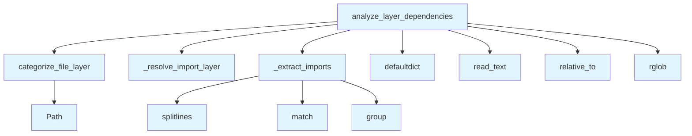

# File: `src/local_deepwiki/generators/analysis/layer_analysis.py`

## File Overview

This file provides functionality for performing static analysis of Python code to detect architectural layer dependency violations. It categorizes source files into architectural layers (such as `core`, `web`, `handlers`, etc.) and analyzes import statements to identify cases where lower layers import from higher layers, which violates the intended architecture.

The module is designed to be used in a pure static analysis context — it does not make any external API calls or use language models. It works entirely from the filesystem and is intended to be part of a larger toolchain for enforcing architectural consistency in codebases.

## Key Concepts

### Layer Categorization
The module defines a set of known architectural layers (`_KNOWN_LAYERS`) and uses a simple path-based heuristic to assign files to layers. This approach is chosen for its simplicity and effectiveness in identifying architectural boundaries based on directory structure.

### Import Analysis
Import analysis is performed using regular expressions to extract top-level module names from Python import statements. This enables the module to determine the source of dependencies without needing to resolve them fully, which avoids the complexity of full import resolution.

### Dependency Violation Detection
The core logic identifies violations by comparing the layer order of source files and their imported modules. A violation occurs when a file in a lower-numbered layer (e.g., `web`) imports from a higher-numbered layer (e.g., `core`). This is determined using a predefined `LAYER_ORDER` mapping.

## Integration

This module is used by the test suite, specifically in `test_layer_analysis`, where it is called via `categorize_file_layer` and `analyze_layer_dependencies`. It is part of a broader analysis framework within the `local_deepwiki` project, likely integrated into CLI tools or build pipelines to enforce architectural consistency.

The module imports from:
- `local_deepwiki.logging` for logging warnings
- Standard library modules (`re`, `defaultdict`, `Path`, `typing`)

It is related to other analysis modules such as:
- `src/local_deepwiki/cli/config_validator.py`
- `src/local_deepwiki/cli/main.py`
- `src/local_deepwiki/core/reranker.py`
- `src/local_deepwiki/generators/analysis/api_docs.py`
- `src/local_deepwiki/generators/analysis/architecture_compare.py`

These modules likely contribute to a larger system for maintaining code quality and architecture consistency.

## Design Notes

### Why Path-Based Layer Assignment?
The function `categorize_file_layer` assigns a file to the first layer directory name found in its path. This design choice ensures that the categorization is predictable and aligns with directory structure, which is a common and intuitive way to organize code in layered architectures.

### Handling Imports
The `_extract_imports` function is designed to extract only top-level module names (e.g., from `import foo.bar.baz`, it extracts `foo`). This simplifies dependency mapping and avoids over-complicating the analysis with full module resolution, which is unnecessary for detecting architectural layer violations.

### Violation Detection Logic
Violations are detected by comparing layer order numbers (`LAYER_ORDER`). This assumes a consistent, ordered layer hierarchy. If a file's layer order is greater than the imported module's layer order, it is flagged as a violation. This is a simple but effective heuristic for enforcing architectural constraints.

### Error Handling
The code gracefully handles file reading errors with a warning log, ensuring that the analysis can continue even if some files are unreadable. This is important for robustness in large codebases where some files may be inaccessible or malformed.

### No External Dependencies
The module is intentionally self-contained and does not rely on external services or LLMs. This makes it suitable for integration into CI/CD pipelines or local development environments where external dependencies are undesirable.

## API Reference

### Functions

#### `categorize_file_layer`

```python
def categorize_file_layer(file_path: str) -> str
```

Determine which architectural layer a file belongs to.  Scans path parts for known layer directory names and returns the first match.  Falls back to ``"root"`` for files not under any known layer.


| Parameter | Type | Default | Description |
|-----------|------|---------|-------------|
| `file_path` | `str` | - | Relative file path (e.g. ``"core/indexer.py"``). |

**Returns:** `str`


<details>
<summary>View Source (lines 44-60) | <a href="https://github.com/UrbanDiver/local-deepwiki-mcp/blob/main/src/local_deepwiki/generators/analysis/layer_analysis.py#L44-L60">GitHub</a></summary>

```python
def categorize_file_layer(file_path: str) -> str:
    """Determine which architectural layer a file belongs to.

    Scans path parts for known layer directory names and returns the first
    match.  Falls back to ``"root"`` for files not under any known layer.

    Args:
        file_path: Relative file path (e.g. ``"core/indexer.py"``).

    Returns:
        Layer name such as ``"core"``, ``"web"``, ``"handlers"``, etc.
    """
    parts = Path(file_path).parts
    for part in parts:
        if part in _KNOWN_LAYERS:
            return part
    return "root"
```

</details>

#### `analyze_layer_dependencies`

```python
def analyze_layer_dependencies(repo_path: Path, project_name: str) -> dict[str, Any]
```

Scan Python files and detect layer dependency violations.  Walks all ``.py`` files under *repo_path*, categorizes them into layers, parses their import statements, and flags any import that flows *upward* (a lower-order layer importing from a higher-order layer).


| Parameter | Type | Default | Description |
|-----------|------|---------|-------------|
| `repo_path` | `Path` | - | Root directory of the repository to analyze. |
| `project_name` | `str` | - | Project name (currently unused, reserved for future package-name stripping). |

**Returns:** `dict[str, Any]`


<details>
<summary>View Source (lines 93-167) | <a href="https://github.com/UrbanDiver/local-deepwiki-mcp/blob/main/src/local_deepwiki/generators/analysis/layer_analysis.py#L93-L167">GitHub</a></summary>

```python
def analyze_layer_dependencies(repo_path: Path, project_name: str) -> dict[str, Any]:
    """Scan Python files and detect layer dependency violations.

    Walks all ``.py`` files under *repo_path*, categorizes them into layers,
    parses their import statements, and flags any import that flows *upward*
    (a lower-order layer importing from a higher-order layer).

    Args:
        repo_path: Root directory of the repository to analyze.
        project_name: Project name (currently unused, reserved for future
            package-name stripping).

    Returns:
        A dict with keys:
        - ``layer_file_counts``: ``{layer_name: file_count}``
        - ``layer_edges``: list of ``{from_layer, to_layer, count}`` dicts
        - ``violations``: list of ``{from_layer, to_layer, file, import_module}``
        - ``total_violations``: integer count of violations
    """
    layer_file_counts: dict[str, int] = defaultdict(int)
    edge_counts: dict[tuple[str, str], int] = defaultdict(int)
    violations: list[dict[str, str]] = []

    py_files = sorted(repo_path.rglob("*.py"))

    for py_file in py_files:
        try:
            rel_path = py_file.relative_to(repo_path)
        except ValueError:
            continue

        file_layer = categorize_file_layer(str(rel_path))
        layer_file_counts[file_layer] += 1

        try:
            source = py_file.read_text(encoding="utf-8", errors="replace")
        except OSError:
            logger.warning("Could not read %s", py_file)
            continue

        imported_modules = _extract_imports(source)
        for module_name in imported_modules:
            target_layer = _resolve_import_layer(module_name)
            if target_layer is None:
                continue
            if target_layer == file_layer:
                # Same-layer import — not an edge or violation
                continue

            edge_counts[(file_layer, target_layer)] += 1

            file_order = LAYER_ORDER.get(file_layer, 3)
            target_order = LAYER_ORDER.get(target_layer, 3)
            if file_order > target_order:
                # Upward dependency: a lower layer imports from a higher layer
                violations.append(
                    {
                        "from_layer": file_layer,
                        "to_layer": target_layer,
                        "file": str(rel_path),
                        "import_module": module_name,
                    }
                )

    layer_edges = [
        {"from_layer": src, "to_layer": tgt, "count": cnt}
        for (src, tgt), cnt in sorted(edge_counts.items())
    ]

    return {
        "layer_file_counts": dict(layer_file_counts),
        "layer_edges": layer_edges,
        "violations": violations,
        "total_violations": len(violations),
    }
```

</details>

## Call Graph



## Used By

Functions and methods in this file and their callers:

- **`Path`**: called by `categorize_file_layer`
- **`_extract_imports`**: called by `analyze_layer_dependencies`
- **`_resolve_import_layer`**: called by `analyze_layer_dependencies`
- **`categorize_file_layer`**: called by `analyze_layer_dependencies`
- **`defaultdict`**: called by `analyze_layer_dependencies`
- **`group`**: called by `_extract_imports`
- **`match`**: called by `_extract_imports`
- **`read_text`**: called by `analyze_layer_dependencies`
- **`relative_to`**: called by `analyze_layer_dependencies`
- **`rglob`**: called by `analyze_layer_dependencies`
- **`splitlines`**: called by `_extract_imports`

## Usage Examples

*Examples extracted from test files*

### Example: `categorize_file_layer`

From `test_layer_analysis.py::TestCategorizeFileLayer::test_web_layer`:

```python
assert categorize_file_layer("web/app.py") == "web"
```

### Example: `categorize_file_layer`

From `test_layer_analysis.py::TestCategorizeFileLayer::test_handler_layer`:

```python
assert categorize_file_layer("handlers/core.py") == "handlers"
```

### Creates minimal project structure, verifies output shape

From `test_layer_analysis.py::TestAnalyzeLayerDependencies::test_returns_layer_counts`:

```python
# Create a mini project with files in different layers
core_dir = tmp_path / "core"
core_dir.mkdir()
(core_dir / "parser.py").write_text("def parse(): pass\n")
(core_dir / "indexer.py").write_text("from core.parser import parse\n")

handlers_dir = tmp_path / "handlers"
handlers_dir.mkdir()
(handlers_dir / "main.py").write_text("from core.indexer import index\n")

result = analyze_layer_dependencies(tmp_path, "myproject")

assert "layer_file_counts" in result
assert "layer_edges" in result
assert "violations" in result
assert "total_violations" in result

# Should have found files in core and handlers
assert result["layer_file_counts"].get("core", 0) == 2
assert result["layer_file_counts"].get("handlers", 0) == 1
```

### Core importing from handlers is an upward (violation) dependency

From `test_layer_analysis.py::TestAnalyzeLayerDependencies::test_detects_upward_dependency`:

```python
result = analyze_layer_dependencies(tmp_path, "myproject")

assert result["total_violations"] >= 1
# Find the violation: core -> handlers is upward (core is order 4, handlers is order 1)
violations = result["violations"]
assert len(violations) >= 1
```


## Last Modified

| Entity | Type | Author | Date | Commit |
|--------|------|--------|------|--------|
| `categorize_file_layer` | function | Brian Breidenbach | 2 weeks ago | `0eea627` feat: add layer dependency ... |
| `_extract_imports` | function | Brian Breidenbach | 2 weeks ago | `0eea627` feat: add layer dependency ... |
| `_resolve_import_layer` | function | Brian Breidenbach | 2 weeks ago | `0eea627` feat: add layer dependency ... |
| `analyze_layer_dependencies` | function | Brian Breidenbach | 2 weeks ago | `0eea627` feat: add layer dependency ... |

## Additional Source Code

Source code for functions and methods not listed in the API Reference above.

#### `_extract_imports`

<details>
<summary>View Source (lines 63-79) | <a href="https://github.com/UrbanDiver/local-deepwiki-mcp/blob/main/src/local_deepwiki/generators/analysis/layer_analysis.py#L63-L79">GitHub</a></summary>

```python
def _extract_imports(source: str) -> list[str]:
    """Extract top-level module names from Python import statements.

    Returns the first dotted component of each imported module, which
    corresponds to the top-level package directory.
    """
    modules: list[str] = []
    for line in source.splitlines():
        stripped = line.strip()
        for pattern in _IMPORT_PATTERNS:
            match = pattern.match(stripped)
            if match:
                full_module = match.group(1)
                top_level = full_module.split(".")[0]
                modules.append(top_level)
                break
    return modules
```

</details>


#### `_resolve_import_layer`

<details>
<summary>View Source (lines 82-90) | <a href="https://github.com/UrbanDiver/local-deepwiki-mcp/blob/main/src/local_deepwiki/generators/analysis/layer_analysis.py#L82-L90">GitHub</a></summary>

```python
def _resolve_import_layer(module_name: str) -> str | None:
    """Map a top-level import module name to a layer, if it matches one.

    Returns ``None`` for imports that don't correspond to a known layer
    (e.g. stdlib or third-party packages).
    """
    if module_name in _KNOWN_LAYERS:
        return module_name
    return None
```

</details>

## Relevant Source Files

- `src/local_deepwiki/generators/analysis/layer_analysis.py:44-60`
