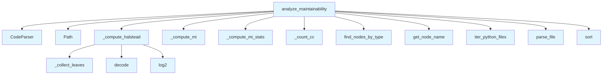

# File: `src/local_deepwiki/generators/analysis/maintainability.py`

## File Overview

This file computes the **Maintainability Index (MI)** for functions across a Python repository. It leverages **tree-sitter ASTs** to analyze code structure and applies standard metrics such as **Halstead Volume**, **Cyclomatic Complexity (CC)**, and **Lines of Code (LOC)** to compute MI values per function.

The core purpose is to support automated code quality analysis by identifying functions with low maintainability, which may be candidates for refactoring or further review.

## Key Concepts

### Maintainability Index (MI)

The Maintainability Index is a software metric that quantifies how maintainable a piece of code is. It is computed using the formula:

```
MI = max(0, (171 - 5.2*ln(HV) - 0.23*CC - 16.2*ln(LOC)) * 100/171)
```

Where:
- `HV` = Halstead Volume
- `CC` = Cyclomatic Complexity
- `LOC` = Lines of Code

This approach is widely used in software engineering for identifying complex or hard-to-maintain code sections.

### Halstead Metrics

Halstead metrics are used to compute software quality metrics based on the number of operators and operands in a program. In this implementation:
- Operands include identifiers, strings, numbers, booleans, and `None`.
- Operators include keywords, punctuation, and other meaningful tokens.
- Comments and whitespace-like nodes are skipped.

This is used to compute `Halstead Volume`, a key component of MI.

### Cyclomatic Complexity (CC)

Cyclomatic complexity measures the number of linearly independent paths through a function. It is computed by counting decision points (e.g., `if`, `while`, `for`, `and`, `or`) in the AST.

This value is used in the MI computation to penalize overly complex functions.

## Integration

This file is part of the `local_deepwiki.generators.analysis` module and integrates with several other components:

- **Parser Integration**: It uses [`CodeParser`](../../core/parser/code_parser.md) from `local_deepwiki.core.parser.code_parser` to parse files into tree-sitter ASTs.
- **AST Utilities**: It uses [`find_nodes_by_type`](../../core/parser/ast_utils.md) and [`get_node_name`](../../core/parser/ast_utils.md) from `local_deepwiki.core.parser.ast_utils` to extract function nodes and their names.
- **File Filtering**: It relies on [`iter_python_files`](source_filter.md) from `local_deepwiki.generators.analysis.source_filter` to iterate over Python source files in a repository.
- **Logging**: It uses [`get_logger`](../../logging.md) from `local_deepwiki.logging` for reporting analysis results.

The main function `analyze_maintainability` is used by:
- `analysis_architecture` (for generating architecture reports)
- `test_maintainability` (for unit tests)

This design supports modular analysis, where maintainability metrics can be computed and used as part of broader architectural or quality checks.

## Design Notes

### AST Traversal

The `_collect_leaves` function performs a depth-first traversal of the AST subtree to [collect](../../web/routes_chat.md) all leaf nodes. This is necessary because Halstead metrics are computed from the tokens of a function, and leaf nodes represent the atomic elements of the code.

### Halstead Volume Calculation

The Halstead volume is computed using a logarithmic formula:
```python
volume = length * math.log2(vocabulary)
```
This is a standard approach to compute program volume based on unique operators and operands.

### Maintainability Index Normalization

The MI is normalized to a 0–100 scale:
```python
MI = max(0, min(100, raw * 100 / 171))
```
This ensures that even very low values are capped at 0, and very high values are capped at 100.

### Edge Cases Handled

- **Zero or negative Halstead Volume or LOC**: The `_compute_mi` function returns `100.0` in such cases, assuming the function is trivially maintainable.
- **Empty or unparsable files**: The `analyze_maintainability` function skips files that fail to parse.
- **Functions without a name**: Anonymous functions are labeled as `<anonymous>`.

### Performance Considerations

- The file uses a stack-based traversal for AST nodes, which is efficient and avoids recursion limits.
- The `top_n` parameter in `analyze_maintainability` allows limiting output for performance and readability in large codebases.

This implementation avoids external dependencies like LLMs and focuses purely on AST-based computation, making it fast and deterministic.

## API Reference

### Functions

#### `analyze_maintainability`

```python
def analyze_maintainability(repo_path: Path, top_n: int = 20, exclude_tests: bool = True) -> dict[str, Any]
```

Compute Maintainability Index per function across the repository.


| Parameter | Type | Default | Description |
|-----------|------|---------|-------------|
| `repo_path` | `Path` | - | Root of the repository to scan. |
| `top_n` | `int` | `20` | Maximum number of functions to return (sorted by MI ascending). |
| `exclude_tests` | `bool` | `True` | Skip test files when True. |

**Returns:** `dict[str, Any]`


<details>
<summary>View Source (lines 177-246) | <a href="https://github.com/UrbanDiver/local-deepwiki-mcp/blob/main/src/local_deepwiki/generators/analysis/maintainability.py#L177-L246">GitHub</a></summary>

```python
def analyze_maintainability(
    repo_path: Path,
    *,
    top_n: int = 20,
    exclude_tests: bool = True,
) -> dict[str, Any]:
    """Compute Maintainability Index per function across the repository.

    Args:
        repo_path: Root of the repository to scan.
        top_n: Maximum number of functions to return (sorted by MI ascending).
        exclude_tests: Skip test files when True.

    Returns:
        Dict with status, functions (worst MI first), and summary stats.
    """
    repo_path = Path(repo_path)
    parser = CodeParser()
    files = iter_python_files(repo_path, exclude_tests=exclude_tests)

    all_functions: list[dict[str, Any]] = []

    for full_path, rel_path in files:
        result = parser.parse_file(full_path)
        if result is None:
            continue

        root, language, source = result
        fn_types = FUNCTION_NODE_TYPES.get(language)
        if fn_types is None:
            continue

        fn_nodes = find_nodes_by_type(root, fn_types)
        for fn_node in fn_nodes:
            fn_name = get_node_name(fn_node, source, language) or "<anonymous>"
            loc = fn_node.end_point[0] - fn_node.start_point[0] + 1
            halstead = _compute_halstead(fn_node, source)
            cc = _count_cc(fn_node)
            mi = _compute_mi(halstead["volume"], cc, loc)

            all_functions.append(
                {
                    "function": fn_name,
                    "file": str(rel_path),
                    "line": fn_node.start_point[0] + 1,
                    "mi": round(mi, 1),
                    "halstead_volume": round(halstead["volume"], 1),
                    "cc": cc,
                    "loc": loc,
                }
            )

    # Sort by MI ascending (worst first)
    all_functions.sort(key=lambda f: f["mi"])

    stats = _compute_mi_stats(all_functions)

    logger.info(
        "Maintainability: %d functions, avg_mi=%.1f, low_mi=%d in %s",
        stats["total_functions"],
        stats["avg_mi"],
        stats["low_mi_functions"],
        repo_path,
    )

    return {
        "status": "success",
        "functions": all_functions[:top_n],
        "stats": stats,
    }
```

</details>

## Call Graph



## Used By

Functions and methods in this file and their callers:

- **[`CodeParser`](../../core/parser/code_parser.md)**: called by `analyze_maintainability`
- **`Path`**: called by `analyze_maintainability`
- **`_collect_leaves`**: called by `_compute_halstead`
- **`_compute_halstead`**: called by `analyze_maintainability`
- **`_compute_mi`**: called by `analyze_maintainability`
- **`_compute_mi_stats`**: called by `analyze_maintainability`
- **`_count_cc`**: called by `analyze_maintainability`
- **`decode`**: called by `_compute_halstead`
- **[`find_nodes_by_type`](../../core/parser/ast_utils.md)**: called by `analyze_maintainability`
- **[`get_node_name`](../../core/parser/ast_utils.md)**: called by `analyze_maintainability`
- **[`iter_python_files`](source_filter.md)**: called by `analyze_maintainability`
- **`log2`**: called by `_compute_halstead`
- **`parse_file`**: called by `analyze_maintainability`
- **`sort`**: called by `analyze_maintainability`

## Usage Examples

*Examples extracted from test files*

### Halstead metrics on a simple function have operators and operands

From `test_maintainability.py::test_compute_halstead_simple_function`:

```python
from local_deepwiki.generators.analysis.maintainability import _compute_halstead

py_file = tmp_path / "add.py"
py_file.write_text("def add(a, b):\n    return a + b\n")

parser = CodeParser()
result = parser.parse_file(py_file)
assert result is not None

root, _lang, src = result
# Find the function node
func_node = None
for child in root.children:
    if child.type == "function_definition":
        func_node = child
        break
assert func_node is not None
```

### Halstead metrics on a simple function have operators and operands

From `test_maintainability.py::test_compute_halstead_simple_function`:

```python
from local_deepwiki.generators.analysis.maintainability import _compute_halstead

py_file = tmp_path / "add.py"
py_file.write_text("def add(a, b):\n    return a + b\n")

parser = CodeParser()
result = parser.parse_file(py_file)
assert result is not None

root, _lang, src = result
# Find the function node
func_node = None
for child in root.children:
    if child.type == "function_definition":
        func_node = child
        break
assert func_node is not None
```

### Halstead on a minimal function (pass body) still computes

From `test_maintainability.py::test_compute_halstead_empty_function`:

```python
from local_deepwiki.generators.analysis.maintainability import _compute_halstead

py_file = tmp_path / "noop.py"
py_file.write_text("def noop():\n    pass\n")

parser = CodeParser()
result = parser.parse_file(py_file)
assert result is not None

root, _lang, src = result
func_node = None
for child in root.children:
    if child.type == "function_definition":
        func_node = child
        break
assert func_node is not None
```

### MI with known inputs produces expected range

From `test_maintainability.py::test_compute_mi_known_values`:

```python
from local_deepwiki.generators.analysis.maintainability import _compute_mi

# A small function with low volume, low CC, few LOC should have high MI
mi = _compute_mi(halstead_volume=50, cc=2, loc=5)
assert 50 < mi <= 100, f"Expected high MI for simple function, got {mi}"
```

### MI returns 100 when Halstead volume is zero

From `test_maintainability.py::test_compute_mi_zero_volume`:

```python
from local_deepwiki.generators.analysis.maintainability import _compute_mi

mi = _compute_mi(halstead_volume=0, cc=5, loc=10)
assert mi == 100.0
```


## Last Modified

| Entity | Type | Author | Date | Commit |
|--------|------|--------|------|--------|
| `_compute_mi_stats` | function | Brian Breidenbach | today | `a75af5c` refactor: extract helpers f... |
| `analyze_maintainability` | function | Brian Breidenbach | today | `a75af5c` refactor: extract helpers f... |
| `_collect_leaves` | function | Brian Breidenbach | today | `64e4b55` feat: add maintainability i... |
| `_compute_halstead` | function | Brian Breidenbach | today | `64e4b55` feat: add maintainability i... |
| `_count_cc` | function | Brian Breidenbach | today | `64e4b55` feat: add maintainability i... |
| `_compute_mi` | function | Brian Breidenbach | today | `64e4b55` feat: add maintainability i... |

## Additional Source Code

Source code for functions and methods not listed in the API Reference above.

#### `_collect_leaves`

<details>
<summary>View Source (lines 69-79) | <a href="https://github.com/UrbanDiver/local-deepwiki-mcp/blob/main/src/local_deepwiki/generators/analysis/maintainability.py#L69-L79">GitHub</a></summary>

```python
def _collect_leaves(node: Node) -> list[Node]:
    """Collect all leaf nodes (no children) from an AST subtree."""
    leaves: list[Node] = []
    stack = [node]
    while stack:
        current = stack.pop()
        if not current.children:
            leaves.append(current)
        else:
            stack.extend(reversed(current.children))
    return leaves
```

</details>


#### `_compute_halstead`

<details>
<summary>View Source (lines 82-129) | <a href="https://github.com/UrbanDiver/local-deepwiki-mcp/blob/main/src/local_deepwiki/generators/analysis/maintainability.py#L82-L129">GitHub</a></summary>

```python
def _compute_halstead(func_node: Node, source: bytes) -> dict[str, Any]:
    """Compute Halstead metrics for a function AST node.

    Classifies leaf nodes into operators and operands:
    - Operands: identifiers, strings, numbers, booleans, none
    - Operators: keywords, punctuation, and other meaningful tokens
    - Skipped: comments, newlines, whitespace-like nodes

    Returns:
        Dict with keys n1, n2, N1, N2, and volume.
    """
    operators: dict[str, int] = {}
    operands: dict[str, int] = {}

    for leaf in _collect_leaves(func_node):
        node_type = leaf.type
        if node_type in _SKIP_TYPES:
            continue

        text = leaf.text.decode("utf-8", errors="replace") if leaf.text else ""
        if not text.strip():
            continue

        if node_type in _OPERAND_TYPES:
            operands[text] = operands.get(text, 0) + 1
        else:
            operators[text] = operators.get(text, 0) + 1

    n1 = len(operators)  # unique operators
    n2 = len(operands)  # unique operands
    big_n1 = sum(operators.values())  # total operators
    big_n2 = sum(operands.values())  # total operands

    vocabulary = n1 + n2
    length = big_n1 + big_n2

    if vocabulary <= 1:
        volume = 0.0
    else:
        volume = length * math.log2(vocabulary)

    return {
        "n1": n1,
        "n2": n2,
        "N1": big_n1,
        "N2": big_n2,
        "volume": volume,
    }
```

</details>


#### `_count_cc`

<details>
<summary>View Source (lines 132-144) | <a href="https://github.com/UrbanDiver/local-deepwiki-mcp/blob/main/src/local_deepwiki/generators/analysis/maintainability.py#L132-L144">GitHub</a></summary>

```python
def _count_cc(node: Node) -> int:
    """Count cyclomatic complexity decision points inside a node.

    Starts at 1 (base path) and increments for each decision node.
    """
    count = 1
    stack = [node]
    while stack:
        current = stack.pop()
        if current.type in _CC_NODE_TYPES:
            count += 1
        stack.extend(current.children)
    return count
```

</details>


#### `_compute_mi`

<details>
<summary>View Source (lines 147-157) | <a href="https://github.com/UrbanDiver/local-deepwiki-mcp/blob/main/src/local_deepwiki/generators/analysis/maintainability.py#L147-L157">GitHub</a></summary>

```python
def _compute_mi(halstead_volume: float, cc: int, loc: int) -> float:
    """Compute normalized Maintainability Index (0-100).

    Uses the standard formula:
      raw = 171 - 5.2*ln(HV) - 0.23*CC - 16.2*ln(LOC)
      MI  = max(0, min(100, raw * 100 / 171))
    """
    if halstead_volume <= 0 or loc <= 0:
        return 100.0
    raw = 171 - 5.2 * math.log(halstead_volume) - 0.23 * cc - 16.2 * math.log(loc)
    return max(0.0, min(100.0, raw * 100 / 171))
```

</details>


#### `_compute_mi_stats`

<details>
<summary>View Source (lines 160-174) | <a href="https://github.com/UrbanDiver/local-deepwiki-mcp/blob/main/src/local_deepwiki/generators/analysis/maintainability.py#L160-L174">GitHub</a></summary>

```python
def _compute_mi_stats(all_functions: list[dict[str, Any]]) -> dict[str, Any]:
    """Compute summary statistics from per-function MI values."""
    total = len(all_functions)
    mi_values = [f["mi"] for f in all_functions]
    avg_mi = sum(mi_values) / total if total > 0 else 100.0
    low_mi_count = sum(1 for v in mi_values if v < 20)
    low_mi_pct = (low_mi_count / total * 100) if total > 0 else 0.0
    min_mi = min(mi_values) if mi_values else 100.0
    return {
        "total_functions": total,
        "avg_mi": round(avg_mi, 1),
        "low_mi_functions": low_mi_count,
        "low_mi_pct": round(low_mi_pct, 1),
        "min_mi": round(min_mi, 1),
    }
```

</details>

## Relevant Source Files

- `src/local_deepwiki/generators/analysis/maintainability.py:69-79`
