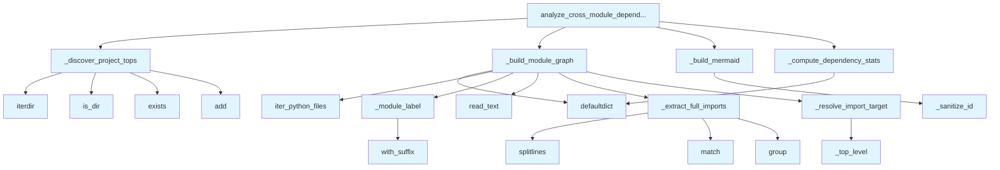

# File: `src/local_deepwiki/generators/analysis/module_dependencies.py`

## File Overview

This file provides functionality for analyzing cross-module dependencies within a Python project. It scans Python source files to build an inter-module import graph, identifying how modules depend on one another. The analysis is purely based on filesystem and regex parsing — no external services or LLMs are involved.

The core purpose of this module is to support architectural analysis, coupling metrics, and dependency visualization. It is used by various tools in the `local_deepwiki` project, including `coupling`, `module_health`, and `analysis_architecture`.

## Key Concepts

### Module Labeling and Resolution

The system uses a consistent labeling scheme for modules:
- Modules are identified as second-level packages (e.g., `core.indexer`, `generators.wiki`) relative to the project root.
- The `_module_label` function strips common [wrapper](../../handlers/_error_handling.md) directories (`src`, `lib`, `pkg`) and the top-level project package name (e.g., `local_deepwiki`) to ensure that labels match import targets.
- The `_discover_project_tops` function identifies all top-level packages in the repository, which are used to distinguish internal from external imports.

This approach allows for accurate resolution of imports and ensures that the analysis focuses on internal project dependencies.

### Dependency Graph Construction

The `_build_module_graph` function scans all Python files in the repository, extracts import statements, and builds a graph of module dependencies:
- It tracks file counts and line counts per module.
- It counts how many times one module imports from another (edge weights).
- It records the actual import statements associated with each edge for detailed reporting.

This data structure supports both statistical analysis (e.g., afferent/efferent coupling) and visualization (e.g., Mermaid diagrams).

### Import Pattern Matching

The `_extract_full_imports` function uses regular expressions to identify all import statements in a source file:
- It handles various import patterns (`import x`, `from x import y`, `import x as y`, etc.).
- This allows the system to accurately extract module names from code without relying on AST parsing, which keeps the tool lightweight and fast.

### Mermaid Diagram Generation

The `_build_mermaid` function converts the dependency graph into a Mermaid diagram for visualization:
- It ensures that module names are sanitized to be valid Mermaid node IDs (replacing dots and hyphens with underscores).
- This provides a visual representation of module dependencies that can be embedded in documentation or reports.

## Integration

This file is part of the `local_deepwiki.generators.analysis` module and integrates with:
- `source_filter.py`: Used by `_build_module_graph` to iterate over Python files.
- `logging.py`: Used for logging warnings when files cannot be read.

It is consumed by:
- `coupling.py`: Uses `_module_label` and `analyze_cross_module_dependencies`.
- `test_module_health.py`: Uses `_discover_project_tops` and `_resolve_import_target`.
- `analysis_architecture.py`: Uses `analyze_cross_module_dependencies`.

The functions in this file are designed to be modular and composable, enabling reuse in different analysis contexts. For example, `analyze_cross_module_dependencies` is the main entry point used by multiple tools, while lower-level functions like `_resolve_import_target` and `_build_module_graph` support more granular control.

## Design Notes

### Why Regex for Import Parsing?

The decision to use regex for import parsing, rather than AST parsing, was made to:
- Keep the analysis lightweight and fast.
- Avoid dependencies on full Python parsers.
- Maintain compatibility with Python versions and syntax that may not be fully supported by AST parsers.

This trade-off is acceptable because the goal is to extract module names, not to analyze code semantics.

### Handling `__init__.py` Files

The `_module_label` function collapses `__init__.py` files into their parent package:
- For example, `core/__init__.py` becomes `core` in the module label.
- This simplifies the module graph and avoids clutter from `__init__.py` files.

### Filtering and Exclusion

The `analyze_cross_module_dependencies` function supports filtering:
- `module_filter`: Only include modules matching a given prefix.
- `include_external`: Toggle inclusion of third-party or stdlib imports.
- `min_edge_weight`: Exclude weak dependencies.

This flexibility allows users to tailor the analysis to their needs, whether they're interested in a full project overview or a focused subset of modules.

### Sanitization for Mermaid

The `_sanitize_id` function ensures that module names are valid Mermaid node IDs:
- Replaces dots (`.`) and hyphens (`-`) with underscores (`_`).
- Prevents rendering issues in Mermaid diagrams.

This is a pragmatic choice to support visualization without requiring complex ID generation logic.

## API Reference

### Functions

#### `analyze_cross_module_dependencies`

```python
def analyze_cross_module_dependencies(repo_path: Path, module_filter: str | None = None, include_external: bool = False, min_edge_weight: int = 1) -> dict[str, Any]
```

Build and return the inter-module import graph for *repo_path*.


| Parameter | Type | Default | Description |
|-----------|------|---------|-------------|
| `repo_path` | `Path` | - | Root of the repository to scan. |
| `module_filter` | `str | None` | `None` | When given, only include modules whose label starts with this prefix (e.g. ``"core"``). |
| `include_external` | `bool` | `False` | When ``False`` (default), third-party and stdlib imports are excluded. |
| `min_edge_weight` | `int` | `1` | Minimum number of import occurrences to include an edge in the output. |

**Returns:** `dict[str, Any]`


<details>
<summary>View Source (lines 224-291) | <a href="https://github.com/UrbanDiver/local-deepwiki-mcp/blob/main/src/local_deepwiki/generators/analysis/module_dependencies.py#L224-L291">GitHub</a></summary>

```python
def analyze_cross_module_dependencies(
    repo_path: Path,
    module_filter: str | None = None,
    include_external: bool = False,
    min_edge_weight: int = 1,
) -> dict[str, Any]:
    """Build and return the inter-module import graph for *repo_path*.

    Args:
        repo_path: Root of the repository to scan.
        module_filter: When given, only include modules whose label starts with
            this prefix (e.g. ``"core"``).
        include_external: When ``False`` (default), third-party and stdlib
            imports are excluded.
        min_edge_weight: Minimum number of import occurrences to include an
            edge in the output.

    Returns:
        A dict with ``status``, ``modules``, ``edges``, ``mermaid``, and
        ``stats`` keys.
    """
    project_tops = _discover_project_tops(repo_path)

    module_file_counts, module_line_counts, edge_counts, edge_imports = (
        _build_module_graph(repo_path, project_tops, module_filter, include_external)
    )

    # Build output structures.
    all_module_names = set(module_file_counts.keys()) | {
        tgt for (_, tgt) in edge_counts
    }
    modules = [
        {
            "name": m,
            "file_count": module_file_counts.get(m, 0),
            "total_lines": module_line_counts.get(m, 0),
        }
        for m in sorted(all_module_names)
    ]

    edges = [
        {
            "source": src,
            "target": tgt,
            "weight": cnt,
            "imports": edge_imports[(src, tgt)][:10],
        }
        for (src, tgt), cnt in sorted(edge_counts.items())
        if cnt >= min_edge_weight
    ]

    mermaid = _build_mermaid(edges)
    stats = _compute_dependency_stats(edges, modules)

    logger.info(
        "Cross-module deps: %d modules, %d edges in %s",
        len(modules),
        len(edges),
        repo_path,
    )

    return {
        "status": "success",
        "modules": modules,
        "edges": edges,
        "mermaid": mermaid,
        "stats": stats,
    }
```

</details>

## Call Graph



## Used By

Functions and methods in this file and their callers:

- **`_build_mermaid`**: called by `analyze_cross_module_dependencies`
- **`_build_module_graph`**: called by `analyze_cross_module_dependencies`
- **`_compute_dependency_stats`**: called by `analyze_cross_module_dependencies`
- **`_discover_project_tops`**: called by `analyze_cross_module_dependencies`
- **`_extract_full_imports`**: called by `_build_module_graph`
- **`_module_label`**: called by `_build_module_graph`
- **`_resolve_import_target`**: called by `_build_module_graph`
- **`_sanitize_id`**: called by `_build_mermaid`
- **`_top_level`**: called by `_resolve_import_target`
- **`add`**: called by `_discover_project_tops`
- **`defaultdict`**: called by `_build_module_graph`, `_compute_dependency_stats`
- **`exists`**: called by `_discover_project_tops`
- **`group`**: called by `_extract_full_imports`
- **`is_dir`**: called by `_discover_project_tops`
- **[`iter_python_files`](source_filter.md)**: called by `_build_module_graph`
- **`iterdir`**: called by `_discover_project_tops`
- **`match`**: called by `_extract_full_imports`
- **`read_text`**: called by `_build_module_graph`
- **`splitlines`**: called by `_extract_full_imports`
- **`with_suffix`**: called by `_module_label`

## Usage Examples

*Examples extracted from test files*

### Handler returns success status

From `test_module_dependencies.py::test_cross_module_deps_success`:

```python
result = await handle_get_cross_module_dependencies({"repo_path": str(simple_pkg)})
data = json.loads(result[0].text)
assert data["status"] == "success"
```

### Each edge has source, target, weight, and imports

From `test_module_dependencies.py::test_cross_module_deps_edge_shape`:

```python
result = await handle_get_cross_module_dependencies({"repo_path": str(simple_pkg)})
data = json.loads(result[0].text)
for edge in data["edges"]:
    assert "source" in edge
    assert "target" in edge
    assert "weight" in edge
    assert isinstance(edge["weight"], int)
    assert "imports" in edge
    assert isinstance(edge["imports"], list)
```


## Last Modified

| Entity | Type | Author | Date | Commit |
|--------|------|--------|------|--------|
| `_module_label` | function | Brian Breidenbach | today | `c0fe1bd` fix: unify module labels in... |
| `_build_module_graph` | function | Brian Breidenbach | today | `c0fe1bd` fix: unify module labels in... |
| `_resolve_import_target` | function | Brian Breidenbach | 5 days ago | `27721d1` refactor: extract _resolve_... |
| `_discover_project_tops` | function | Brian Breidenbach | 1 week ago | `ed42442` refactor: split 10+ long me... |
| `_compute_dependency_stats` | function | Brian Breidenbach | 1 week ago | `ed42442` refactor: split 10+ long me... |
| `analyze_cross_module_dependencies` | function | Brian Breidenbach | 1 week ago | `ed42442` refactor: split 10+ long me... |
| `_extract_full_imports` | function | Brian Breidenbach | 1 week ago | `f6da957` feat: add 4 architecture an... |
| `_top_level` | function | Brian Breidenbach | 1 week ago | `f6da957` feat: add 4 architecture an... |
| `_build_mermaid` | function | Brian Breidenbach | 1 week ago | `f6da957` feat: add 4 architecture an... |
| `_sanitize_id` | function | Brian Breidenbach | 1 week ago | `f6da957` feat: add 4 architecture an... |

## Additional Source Code

Source code for functions and methods not listed in the API Reference above.

#### `_extract_full_imports`

<details>
<summary>View Source (lines 30-40) | <a href="https://github.com/UrbanDiver/local-deepwiki-mcp/blob/main/src/local_deepwiki/generators/analysis/module_dependencies.py#L30-L40">GitHub</a></summary>

```python
def _extract_full_imports(source: str) -> list[str]:
    """Return full dotted module paths from all import statements in *source*."""
    modules: list[str] = []
    for line in source.splitlines():
        stripped = line.strip()
        for pattern in _IMPORT_PATTERNS:
            match = pattern.match(stripped)
            if match:
                modules.append(match.group(1))
                break
    return modules
```

</details>


#### `_module_label`

<details>
<summary>View Source (lines 43-65) | <a href="https://github.com/UrbanDiver/local-deepwiki-mcp/blob/main/src/local_deepwiki/generators/analysis/module_dependencies.py#L43-L65">GitHub</a></summary>

```python
def _module_label(rel_path: Path, project_tops: set[str] | None = None) -> str:
    """Convert a relative file path to a dotted module label.

    ``src/local_deepwiki/core/indexer.py`` -> ``core.indexer``

    Strips ``src/`` layout dirs and the top-level project package name
    (e.g. ``local_deepwiki``) so that source labels match import-target
    labels produced by :func:`_resolve_import_target`.
    """
    parts = list(rel_path.with_suffix("").parts)
    # Drop common wrapper dirs.
    while parts and parts[0] in ("src", "lib", "pkg"):
        parts = parts[1:]
    if not parts:
        return "root"
    # Strip the project top-level package (e.g. "local_deepwiki")
    if project_tops and parts[0] in project_tops:
        parts = parts[1:]
    if not parts:
        return "root"
    # Collapse __init__ to parent
    meaningful = [p for p in parts[:2] if p != "__init__"]
    return ".".join(meaningful) if meaningful else parts[0]
```

</details>


#### `_top_level`

<details>
<summary>View Source (lines 68-70) | <a href="https://github.com/UrbanDiver/local-deepwiki-mcp/blob/main/src/local_deepwiki/generators/analysis/module_dependencies.py#L68-L70">GitHub</a></summary>

```python
def _top_level(dotted: str) -> str:
    """Return the first component of a dotted module name."""
    return dotted.split(".")[0]
```

</details>


#### `_discover_project_tops`

<details>
<summary>View Source (lines 73-94) | <a href="https://github.com/UrbanDiver/local-deepwiki-mcp/blob/main/src/local_deepwiki/generators/analysis/module_dependencies.py#L73-L94">GitHub</a></summary>

```python
def _discover_project_tops(repo_path: Path) -> set[str]:
    """Discover top-level project package names from a repository root.

    Checks both the root and a ``src/`` subdirectory for Python packages
    (directories containing ``__init__.py``).

    Args:
        repo_path: Root of the repository.

    Returns:
        Set of top-level package names.
    """
    project_tops: set[str] = set()
    for item in repo_path.iterdir():
        if item.is_dir() and (item / "__init__.py").exists():
            project_tops.add(item.name)
    src_dir = repo_path / "src"
    if src_dir.is_dir():
        for item in src_dir.iterdir():
            if item.is_dir() and (item / "__init__.py").exists():
                project_tops.add(item.name)
    return project_tops
```

</details>


#### `_resolve_import_target`

<details>
<summary>View Source (lines 97-132) | <a href="https://github.com/UrbanDiver/local-deepwiki-mcp/blob/main/src/local_deepwiki/generators/analysis/module_dependencies.py#L97-L132">GitHub</a></summary>

```python
def _resolve_import_target(
    dotted: str,
    project_tops: set[str],
    src_module: str,
    module_filter: str | None,
    include_external: bool,
) -> str | None:
    """Classify a dotted import and return the target module label.

    Returns the target module label string, or ``None`` if the import
    should be skipped (e.g. self-import, filtered out, or unwanted external).
    """
    top = _top_level(dotted)
    is_internal = top in project_tops

    if not include_external and not is_internal:
        return None

    if is_internal:
        parts = dotted.split(".")
        if parts[0] in project_tops:
            parts = parts[1:]
        if not parts:
            return None
        tgt_module = ".".join(parts[:2]) if len(parts) >= 2 else parts[0]
    else:
        tgt_module = top

    if tgt_module == src_module:
        return None

    if module_filter and not tgt_module.startswith(module_filter):
        if not include_external:
            return None

    return tgt_module
```

</details>


#### `_build_module_graph`

<details>
<summary>View Source (lines 135-190) | <a href="https://github.com/UrbanDiver/local-deepwiki-mcp/blob/main/src/local_deepwiki/generators/analysis/module_dependencies.py#L135-L190">GitHub</a></summary>

```python
def _build_module_graph(
    repo_path: Path,
    project_tops: set[str],
    module_filter: str | None,
    include_external: bool,
) -> tuple[
    dict[str, int],
    dict[str, int],
    dict[tuple[str, str], int],
    dict[tuple[str, str], list[str]],
]:
    """Scan Python files and build raw import-graph data structures.

    Args:
        repo_path: Root of the repository.
        project_tops: Known top-level package names for internal detection.
        module_filter: Optional prefix filter for source modules.
        include_external: Whether to include third-party/stdlib imports.

    Returns:
        Tuple of (module_file_counts, module_line_counts, edge_counts,
        edge_imports) defaultdict instances.
    """
    module_file_counts: dict[str, int] = defaultdict(int)
    module_line_counts: dict[str, int] = defaultdict(int)
    edge_counts: dict[tuple[str, str], int] = defaultdict(int)
    edge_imports: dict[tuple[str, str], list[str]] = defaultdict(list)

    for py_file, rel_path in iter_python_files(repo_path, exclude_tests=False):
        src_module = _module_label(rel_path, project_tops)
        if module_filter and not src_module.startswith(module_filter):
            continue

        module_file_counts[src_module] += 1

        try:
            source = py_file.read_text(encoding="utf-8", errors="replace")
        except OSError:
            logger.warning("Could not read %s", py_file)
            continue

        module_line_counts[src_module] += source.count("\n") + 1

        for dotted in _extract_full_imports(source):
            tgt_module = _resolve_import_target(
                dotted, project_tops, src_module, module_filter, include_external
            )
            if tgt_module is None:
                continue

            edge = (src_module, tgt_module)
            edge_counts[edge] += 1
            if dotted not in edge_imports[edge]:
                edge_imports[edge].append(dotted)

    return module_file_counts, module_line_counts, edge_counts, edge_imports
```

</details>


#### `_compute_dependency_stats`

<details>
<summary>View Source (lines 193-221) | <a href="https://github.com/UrbanDiver/local-deepwiki-mcp/blob/main/src/local_deepwiki/generators/analysis/module_dependencies.py#L193-L221">GitHub</a></summary>

```python
def _compute_dependency_stats(
    edges: list[dict[str, Any]],
    modules: list[dict[str, Any]],
) -> dict[str, Any]:
    """Compute afferent/efferent coupling statistics from edges.

    Args:
        edges: List of edge dicts with ``source`` and ``target`` keys.
        modules: List of module dicts (used only for total count).

    Returns:
        Stats dict with total_modules, total_edges, most_depended_on,
        and most_dependent keys.
    """
    ca: dict[str, int] = defaultdict(int)
    ce: dict[str, int] = defaultdict(int)
    for edge in edges:
        ca[edge["target"]] += 1
        ce[edge["source"]] += 1

    most_depended_on = sorted(ca.items(), key=lambda x: x[1], reverse=True)[:3]
    most_dependent = sorted(ce.items(), key=lambda x: x[1], reverse=True)[:3]

    return {
        "total_modules": len(modules),
        "total_edges": len(edges),
        "most_depended_on": [{"module": m, "afferent": c} for m, c in most_depended_on],
        "most_dependent": [{"module": m, "efferent": c} for m, c in most_dependent],
    }
```

</details>


#### `_build_mermaid`

<details>
<summary>View Source (lines 294-306) | <a href="https://github.com/UrbanDiver/local-deepwiki-mcp/blob/main/src/local_deepwiki/generators/analysis/module_dependencies.py#L294-L306">GitHub</a></summary>

```python
def _build_mermaid(edges: list[dict[str, Any]]) -> str:
    """Render a Mermaid ``graph LR`` diagram from the edge list."""
    if not edges:
        return "graph LR\n  %% No edges to display"

    lines = ["graph LR"]
    for edge in edges:
        src = _sanitize_id(edge["source"])
        tgt = _sanitize_id(edge["target"])
        weight = edge["weight"]
        lines.append(f"  {src} -->|{weight}| {tgt}")

    return "\n".join(lines)
```

</details>


#### `_sanitize_id`

<details>
<summary>View Source (lines 309-311) | <a href="https://github.com/UrbanDiver/local-deepwiki-mcp/blob/main/src/local_deepwiki/generators/analysis/module_dependencies.py#L309-L311">GitHub</a></summary>

```python
def _sanitize_id(name: str) -> str:
    """Convert a dotted module name to a valid Mermaid node ID."""
    return name.replace(".", "_").replace("-", "_")
```

</details>

## Relevant Source Files

- `src/local_deepwiki/generators/analysis/module_dependencies.py:30-40`

## See Also

- [coupling](coupling.md) - uses this

## See Also

- [coupling](coupling.md) - uses this

## See Also

- [coupling](coupling.md) - uses this

## See Also

- [coupling](coupling.md) - uses this

## See Also

- [coupling](coupling.md) - uses this
