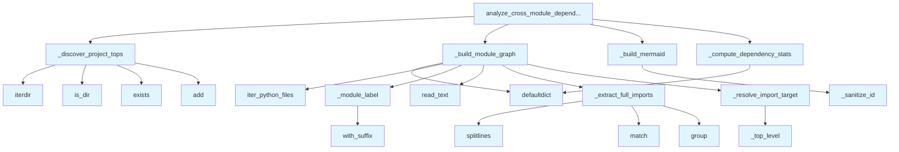

# File: `src/local_deepwiki/generators/analysis/module_dependencies.py`

## File Overview

This file implements cross-module dependency analysis for Python projects. It scans source files to build an inter-module import graph, identifying how modules depend on each other. The analysis is purely based on filesystem and regex parsing, without any external service or LLM calls.

The core responsibility of this module is to:
- Extract import statements from Python files
- Resolve import targets to module labels
- Build a graph of module dependencies
- Compute statistics about coupling between modules
- Generate Mermaid diagrams for visualization

This functionality is used by the `module_health` generator to analyze module structure and health within a project.

## Key Concepts

### Module Labeling Strategy

The `_module_label` function defines how Python files are mapped to module labels. It uses a two-level package naming scheme:
- It strips common [wrapper](../../handlers/_error_handling.md) directories like `src`, `lib`, or `pkg`
- It takes up to the first two meaningful package parts
- This ensures that sibling modules like `core/indexer.py` and `core/vectorstore/base.py` both map to `core`

This design choice balances specificity (avoiding overly broad labels) with simplicity (not requiring deep package hierarchy resolution).

### Import Resolution Logic

The `_resolve_import_target` function implements a classification system for imports:
- Determines if an import is internal (within the project) or external
- Filters out imports based on `module_filter` and `include_external` flags
- Resolves internal imports to their module label, handling both direct and relative imports
- Skips self-imports and filtered-out modules

This approach allows for flexible filtering and analysis, enabling users to focus on specific parts of the codebase or exclude third-party dependencies.

### Graph Building and Statistics

The `_build_module_graph` function:
- Iterates over all Python files in the repository
- Builds counts of files and lines per module
- Tracks import edges with weights (number of occurrences)
- Aggregates import statements per edge

The `_compute_dependency_stats` function calculates:
- Afferent coupling (how many modules depend on a given module)
- Efferent coupling (how many modules a given module depends on)
- Identifies the most depended-on and most dependent modules

These statistics provide insight into module cohesion and coupling, which are key indicators of code quality and maintainability.

## Integration

This file integrates with the broader `local_deepwiki` codebase as part of the analysis generators. It depends on:
- [`iter_python_files`](source_filter.md) from `source_filter` to enumerate Python source files
- [`get_logger`](../../logging.md) for logging output during analysis

It is called by:
- `analyze_cross_module_dependencies` which is used by the `module_health` generator
- `_resolve_import_target` which is used by the `test_module_health` function

The file's role is to provide core dependency analysis functionality that supports higher-level tools like the `module_health` generator and CLI commands such as those found in `main.py` and `config_validator.py`.

## Design Notes

### Why Pure Regex Parsing?

The module avoids using AST parsers or other complex analysis tools. Instead, it relies on regex patterns to extract import statements. This choice was made for:
- Performance: Regex parsing is faster than full AST traversal
- Simplicity: Reduces complexity and potential failure points
- Compatibility: Works with a wide range of Python syntax without needing Python version-specific handling

### Handling of External Dependencies

The `include_external` flag allows filtering out third-party and standard library imports. This is crucial for focusing analysis on project-specific dependencies and avoiding noise from external libraries.

### Edge Case Handling

- **File Reading Errors**: When a file cannot be read, it's skipped with a warning
- **Self-Imports**: These are filtered out to prevent circular references in the graph
- **Module Filtering**: The `module_filter` parameter allows analysis of subsets of the codebase
- **Edge Weight Thresholding**: The `min_edge_weight` parameter allows filtering out weak dependencies

### Mermaid Diagram Generation

The `_build_mermaid` function generates visual representations of the dependency graph using Mermaid syntax. This provides a human-readable way to understand module relationships, particularly useful for documentation and architectural review. The `_sanitize_id` function ensures that module names (which may contain dots or hyphens) are valid Mermaid node IDs.

## API Reference

### Functions

#### `analyze_cross_module_dependencies`

```python
def analyze_cross_module_dependencies(repo_path: Path, module_filter: str | None = None, include_external: bool = False, min_edge_weight: int = 1) -> dict[str, Any]
```

Build and return the inter-module import graph for *repo_path*.


| Parameter | Type | Default | Description |
|-----------|------|---------|-------------|
| `repo_path` | `Path` | - | Root of the repository to scan. |
| `module_filter` | `str | None` | `None` | When given, only include modules whose label starts with this prefix (e.g. ``"core"``). |
| `include_external` | `bool` | `False` | When ``False`` (default), third-party and stdlib imports are excluded. |
| `min_edge_weight` | `int` | `1` | Minimum number of import occurrences to include an edge in the output. |

**Returns:** `dict[str, Any]`


<details>
<summary>View Source (lines 218-285) | <a href="https://github.com/UrbanDiver/local-deepwiki-mcp/blob/main/src/local_deepwiki/generators/analysis/module_dependencies.py#L218-L285">GitHub</a></summary>

```python
def analyze_cross_module_dependencies(
    repo_path: Path,
    module_filter: str | None = None,
    include_external: bool = False,
    min_edge_weight: int = 1,
) -> dict[str, Any]:
    """Build and return the inter-module import graph for *repo_path*.

    Args:
        repo_path: Root of the repository to scan.
        module_filter: When given, only include modules whose label starts with
            this prefix (e.g. ``"core"``).
        include_external: When ``False`` (default), third-party and stdlib
            imports are excluded.
        min_edge_weight: Minimum number of import occurrences to include an
            edge in the output.

    Returns:
        A dict with ``status``, ``modules``, ``edges``, ``mermaid``, and
        ``stats`` keys.
    """
    project_tops = _discover_project_tops(repo_path)

    module_file_counts, module_line_counts, edge_counts, edge_imports = (
        _build_module_graph(repo_path, project_tops, module_filter, include_external)
    )

    # Build output structures.
    all_module_names = set(module_file_counts.keys()) | {
        tgt for (_, tgt) in edge_counts
    }
    modules = [
        {
            "name": m,
            "file_count": module_file_counts.get(m, 0),
            "total_lines": module_line_counts.get(m, 0),
        }
        for m in sorted(all_module_names)
    ]

    edges = [
        {
            "source": src,
            "target": tgt,
            "weight": cnt,
            "imports": edge_imports[(src, tgt)][:10],
        }
        for (src, tgt), cnt in sorted(edge_counts.items())
        if cnt >= min_edge_weight
    ]

    mermaid = _build_mermaid(edges)
    stats = _compute_dependency_stats(edges, modules)

    logger.info(
        "Cross-module deps: %d modules, %d edges in %s",
        len(modules),
        len(edges),
        repo_path,
    )

    return {
        "status": "success",
        "modules": modules,
        "edges": edges,
        "mermaid": mermaid,
        "stats": stats,
    }
```

</details>

## Call Graph



## Used By

Functions and methods in this file and their callers:

- **`_build_mermaid`**: called by `analyze_cross_module_dependencies`
- **`_build_module_graph`**: called by `analyze_cross_module_dependencies`
- **`_compute_dependency_stats`**: called by `analyze_cross_module_dependencies`
- **`_discover_project_tops`**: called by `analyze_cross_module_dependencies`
- **`_extract_full_imports`**: called by `_build_module_graph`
- **`_module_label`**: called by `_build_module_graph`
- **`_resolve_import_target`**: called by `_build_module_graph`
- **`_sanitize_id`**: called by `_build_mermaid`
- **`_top_level`**: called by `_resolve_import_target`
- **`add`**: called by `_discover_project_tops`
- **`defaultdict`**: called by `_build_module_graph`, `_compute_dependency_stats`
- **`exists`**: called by `_discover_project_tops`
- **`group`**: called by `_extract_full_imports`
- **`is_dir`**: called by `_discover_project_tops`
- **[`iter_python_files`](source_filter.md)**: called by `_build_module_graph`
- **`iterdir`**: called by `_discover_project_tops`
- **`match`**: called by `_extract_full_imports`
- **`read_text`**: called by `_build_module_graph`
- **`splitlines`**: called by `_extract_full_imports`
- **`with_suffix`**: called by `_module_label`

## Usage Examples

*Examples extracted from test files*

### Handler returns success status

From `test_module_dependencies.py::test_cross_module_deps_success`:

```python
result = await handle_get_cross_module_dependencies({"repo_path": str(simple_pkg)})
data = json.loads(result[0].text)
assert data["status"] == "success"
```

### Each edge has source, target, weight, and imports

From `test_module_dependencies.py::test_cross_module_deps_edge_shape`:

```python
result = await handle_get_cross_module_dependencies({"repo_path": str(simple_pkg)})
data = json.loads(result[0].text)
for edge in data["edges"]:
    assert "source" in edge
    assert "target" in edge
    assert "weight" in edge
    assert isinstance(edge["weight"], int)
    assert "imports" in edge
    assert isinstance(edge["imports"], list)
```


## Last Modified

| Entity | Type | Author | Date | Commit |
|--------|------|--------|------|--------|
| `_resolve_import_target` | function | Brian Breidenbach | 3 days ago | `27721d1` refactor: extract _resolve_... |
| `_build_module_graph` | function | Brian Breidenbach | 3 days ago | `27721d1` refactor: extract _resolve_... |
| `_discover_project_tops` | function | Brian Breidenbach | 1 week ago | `ed42442` refactor: split 10+ long me... |
| `_compute_dependency_stats` | function | Brian Breidenbach | 1 week ago | `ed42442` refactor: split 10+ long me... |
| `analyze_cross_module_dependencies` | function | Brian Breidenbach | 1 week ago | `ed42442` refactor: split 10+ long me... |
| `_extract_full_imports` | function | Brian Breidenbach | 1 week ago | `f6da957` feat: add 4 architecture an... |
| `_module_label` | function | Brian Breidenbach | 1 week ago | `f6da957` feat: add 4 architecture an... |
| `_top_level` | function | Brian Breidenbach | 1 week ago | `f6da957` feat: add 4 architecture an... |
| `_build_mermaid` | function | Brian Breidenbach | 1 week ago | `f6da957` feat: add 4 architecture an... |
| `_sanitize_id` | function | Brian Breidenbach | 1 week ago | `f6da957` feat: add 4 architecture an... |

## Additional Source Code

Source code for functions and methods not listed in the API Reference above.

#### `_extract_full_imports`

<details>
<summary>View Source (lines 30-40) | <a href="https://github.com/UrbanDiver/local-deepwiki-mcp/blob/main/src/local_deepwiki/generators/analysis/module_dependencies.py#L30-L40">GitHub</a></summary>

```python
def _extract_full_imports(source: str) -> list[str]:
    """Return full dotted module paths from all import statements in *source*."""
    modules: list[str] = []
    for line in source.splitlines():
        stripped = line.strip()
        for pattern in _IMPORT_PATTERNS:
            match = pattern.match(stripped)
            if match:
                modules.append(match.group(1))
                break
    return modules
```

</details>


#### `_module_label`

<details>
<summary>View Source (lines 43-59) | <a href="https://github.com/UrbanDiver/local-deepwiki-mcp/blob/main/src/local_deepwiki/generators/analysis/module_dependencies.py#L43-L59">GitHub</a></summary>

```python
def _module_label(rel_path: Path) -> str:
    """Convert a relative file path to a dotted module label.

    ``src/local_deepwiki/core/indexer.py`` -> ``core.indexer``

    We take up to the first two meaningful package parts (skipping ``src``
    and single top-level project wrappers) so that siblings like
    ``core/indexer.py`` and ``core/vectorstore/base.py`` both map to
    ``core``.
    """
    parts = list(rel_path.with_suffix("").parts)
    # Drop common wrapper dirs.
    while parts and parts[0] in ("src", "lib", "pkg"):
        parts = parts[1:]
    if not parts:
        return "root"
    return ".".join(parts[:2]) if len(parts) >= 2 else parts[0]
```

</details>


#### `_top_level`

<details>
<summary>View Source (lines 62-64) | <a href="https://github.com/UrbanDiver/local-deepwiki-mcp/blob/main/src/local_deepwiki/generators/analysis/module_dependencies.py#L62-L64">GitHub</a></summary>

```python
def _top_level(dotted: str) -> str:
    """Return the first component of a dotted module name."""
    return dotted.split(".")[0]
```

</details>


#### `_discover_project_tops`

<details>
<summary>View Source (lines 67-88) | <a href="https://github.com/UrbanDiver/local-deepwiki-mcp/blob/main/src/local_deepwiki/generators/analysis/module_dependencies.py#L67-L88">GitHub</a></summary>

```python
def _discover_project_tops(repo_path: Path) -> set[str]:
    """Discover top-level project package names from a repository root.

    Checks both the root and a ``src/`` subdirectory for Python packages
    (directories containing ``__init__.py``).

    Args:
        repo_path: Root of the repository.

    Returns:
        Set of top-level package names.
    """
    project_tops: set[str] = set()
    for item in repo_path.iterdir():
        if item.is_dir() and (item / "__init__.py").exists():
            project_tops.add(item.name)
    src_dir = repo_path / "src"
    if src_dir.is_dir():
        for item in src_dir.iterdir():
            if item.is_dir() and (item / "__init__.py").exists():
                project_tops.add(item.name)
    return project_tops
```

</details>


#### `_resolve_import_target`

<details>
<summary>View Source (lines 91-126) | <a href="https://github.com/UrbanDiver/local-deepwiki-mcp/blob/main/src/local_deepwiki/generators/analysis/module_dependencies.py#L91-L126">GitHub</a></summary>

```python
def _resolve_import_target(
    dotted: str,
    project_tops: set[str],
    src_module: str,
    module_filter: str | None,
    include_external: bool,
) -> str | None:
    """Classify a dotted import and return the target module label.

    Returns the target module label string, or ``None`` if the import
    should be skipped (e.g. self-import, filtered out, or unwanted external).
    """
    top = _top_level(dotted)
    is_internal = top in project_tops

    if not include_external and not is_internal:
        return None

    if is_internal:
        parts = dotted.split(".")
        if parts[0] in project_tops:
            parts = parts[1:]
        if not parts:
            return None
        tgt_module = ".".join(parts[:2]) if len(parts) >= 2 else parts[0]
    else:
        tgt_module = top

    if tgt_module == src_module:
        return None

    if module_filter and not tgt_module.startswith(module_filter):
        if not include_external:
            return None

    return tgt_module
```

</details>


#### `_build_module_graph`

<details>
<summary>View Source (lines 129-184) | <a href="https://github.com/UrbanDiver/local-deepwiki-mcp/blob/main/src/local_deepwiki/generators/analysis/module_dependencies.py#L129-L184">GitHub</a></summary>

```python
def _build_module_graph(
    repo_path: Path,
    project_tops: set[str],
    module_filter: str | None,
    include_external: bool,
) -> tuple[
    dict[str, int],
    dict[str, int],
    dict[tuple[str, str], int],
    dict[tuple[str, str], list[str]],
]:
    """Scan Python files and build raw import-graph data structures.

    Args:
        repo_path: Root of the repository.
        project_tops: Known top-level package names for internal detection.
        module_filter: Optional prefix filter for source modules.
        include_external: Whether to include third-party/stdlib imports.

    Returns:
        Tuple of (module_file_counts, module_line_counts, edge_counts,
        edge_imports) defaultdict instances.
    """
    module_file_counts: dict[str, int] = defaultdict(int)
    module_line_counts: dict[str, int] = defaultdict(int)
    edge_counts: dict[tuple[str, str], int] = defaultdict(int)
    edge_imports: dict[tuple[str, str], list[str]] = defaultdict(list)

    for py_file, rel_path in iter_python_files(repo_path, exclude_tests=False):
        src_module = _module_label(rel_path)
        if module_filter and not src_module.startswith(module_filter):
            continue

        module_file_counts[src_module] += 1

        try:
            source = py_file.read_text(encoding="utf-8", errors="replace")
        except OSError:
            logger.warning("Could not read %s", py_file)
            continue

        module_line_counts[src_module] += source.count("\n") + 1

        for dotted in _extract_full_imports(source):
            tgt_module = _resolve_import_target(
                dotted, project_tops, src_module, module_filter, include_external
            )
            if tgt_module is None:
                continue

            edge = (src_module, tgt_module)
            edge_counts[edge] += 1
            if dotted not in edge_imports[edge]:
                edge_imports[edge].append(dotted)

    return module_file_counts, module_line_counts, edge_counts, edge_imports
```

</details>


#### `_compute_dependency_stats`

<details>
<summary>View Source (lines 187-215) | <a href="https://github.com/UrbanDiver/local-deepwiki-mcp/blob/main/src/local_deepwiki/generators/analysis/module_dependencies.py#L187-L215">GitHub</a></summary>

```python
def _compute_dependency_stats(
    edges: list[dict[str, Any]],
    modules: list[dict[str, Any]],
) -> dict[str, Any]:
    """Compute afferent/efferent coupling statistics from edges.

    Args:
        edges: List of edge dicts with ``source`` and ``target`` keys.
        modules: List of module dicts (used only for total count).

    Returns:
        Stats dict with total_modules, total_edges, most_depended_on,
        and most_dependent keys.
    """
    ca: dict[str, int] = defaultdict(int)
    ce: dict[str, int] = defaultdict(int)
    for edge in edges:
        ca[edge["target"]] += 1
        ce[edge["source"]] += 1

    most_depended_on = sorted(ca.items(), key=lambda x: x[1], reverse=True)[:3]
    most_dependent = sorted(ce.items(), key=lambda x: x[1], reverse=True)[:3]

    return {
        "total_modules": len(modules),
        "total_edges": len(edges),
        "most_depended_on": [{"module": m, "afferent": c} for m, c in most_depended_on],
        "most_dependent": [{"module": m, "efferent": c} for m, c in most_dependent],
    }
```

</details>


#### `_build_mermaid`

<details>
<summary>View Source (lines 288-300) | <a href="https://github.com/UrbanDiver/local-deepwiki-mcp/blob/main/src/local_deepwiki/generators/analysis/module_dependencies.py#L288-L300">GitHub</a></summary>

```python
def _build_mermaid(edges: list[dict[str, Any]]) -> str:
    """Render a Mermaid ``graph LR`` diagram from the edge list."""
    if not edges:
        return "graph LR\n  %% No edges to display"

    lines = ["graph LR"]
    for edge in edges:
        src = _sanitize_id(edge["source"])
        tgt = _sanitize_id(edge["target"])
        weight = edge["weight"]
        lines.append(f"  {src} -->|{weight}| {tgt}")

    return "\n".join(lines)
```

</details>


#### `_sanitize_id`

<details>
<summary>View Source (lines 303-305) | <a href="https://github.com/UrbanDiver/local-deepwiki-mcp/blob/main/src/local_deepwiki/generators/analysis/module_dependencies.py#L303-L305">GitHub</a></summary>

```python
def _sanitize_id(name: str) -> str:
    """Convert a dotted module name to a valid Mermaid node ID."""
    return name.replace(".", "_").replace("-", "_")
```

</details>

## Relevant Source Files

- `src/local_deepwiki/generators/analysis/module_dependencies.py:30-40`
