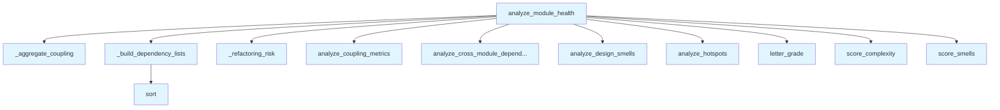

# File: `src/local_deepwiki/generators/analysis/module_health.py`

## File Overview

This module provides functionality to analyze the health of a single module within a repository. It aggregates various metrics including coupling, complexity, design smells, and dependency relationships to produce a comprehensive health score for a given module.

The purpose of this file is to support deeper introspection into module-level quality by combining results from several analysis components into a unified view. This allows developers or tools to understand how a specific module fits into the overall system architecture and identify potential issues such as high coupling, complexity, or design smells.

## Key Concepts

### Module Health Analysis
This file implements a **module-level health scoring system** that combines multiple dimensions of code quality:
- **Coupling Metrics**: Measures how much a module depends on or is depended upon by other modules.
- **Complexity Distribution**: Identifies hotspots based on function-level complexity.
- **Design Smells**: Detects problematic patterns in the codebase.
- **Dependency Graphs**: Provides information on module dependents and dependencies.

These metrics are combined into a single **health score**, which is then converted into a letter grade for easier interpretation.

### Aggregation and Filtering
The core logic relies on **aggregation functions** (`_aggregate_coupling`, `_build_dependency_lists`) to process raw analysis results and extract relevant data for a specific module.

- `_aggregate_coupling`: Supports both exact match and prefix-based aggregation of sub-modules.
- `_build_dependency_lists`: Sorts dependents and dependencies by weight, making it easier to prioritize refactoring or dependency management.

### Scoring System
A **simple averaging** approach is used to combine complexity and smell scores into a final health score. This design choice reflects a balance between simplicity and meaningfulness, assuming that both complexity and design smells contribute equally to overall module health.

## Integration

This file integrates with the broader `local_deepwiki` codebase through several key entry points and dependencies:

- **Called From**: Likely invoked by CLI commands or other analysis modules such as `src/local_deepwiki/cli/main.py` or `src/local_deepwiki/generators/wiki/pages.py` to provide per-module insights during documentation generation or system analysis.
- **Dependencies**:
  - [`analyze_coupling_metrics`](coupling.md): Provides coupling data for modules.
  - [`analyze_design_smells`](design_smells.md): Identifies design smells in the codebase.
  - [`analyze_hotspots`](hotspots.md): Detects complex functions or files.
  - [`analyze_cross_module_dependencies`](module_dependencies.md): Builds dependency relationships between modules.
  - [`letter_grade`](health_scoring.md), [`score_complexity`](health_scoring.md), [`score_smells`](health_scoring.md): Scoring utilities for computing health metrics.

These functions are part of a modular analysis pipeline where this module acts as a **coordinator**, collecting outputs from various specialized analyzers and synthesizing them into a single health report.

## Design Notes

### Why Aggregate Coupling?
The `_aggregate_coupling` function supports two modes of matching:
1. Exact match for the module itself.
2. Prefix-based aggregation for sub-modules (e.g., `core` aggregates `core.indexer`).

This design allows for **flexible reporting**, enabling analysis of both individual modules and hierarchical groupings. It avoids hardcoding module hierarchies and supports dynamic module structures.

### Why Sort Dependencies?
The `_build_dependency_lists` function sorts dependents and dependencies by weight, which helps prioritize refactoring or dependency management efforts. This prioritization is essential in large systems where not all dependencies are equally impactful.

### Handling Missing Data
If no coupling data is found for a module, `_aggregate_coupling` returns `None`. A default coupling structure is provided in `analyze_module_health` to prevent downstream errors, ensuring that even modules with no coupling data still produce valid output.

### Scoring Logic
The final health score is computed as the average of complexity and smell scores. While simple, this approach assumes that both factors contribute equally to health. This design trade-off favors clarity and consistency over nuanced weighting, which might be added in future versions if needed.

### Hotspot and Smell Filtering
Both hotspots and smells are filtered based on the module’s path prefix (e.g., `core.indexer` → `core/indexer`). This ensures that only relevant analysis results are included in the final report, avoiding noise from unrelated code sections.

### Logging
The module uses the [`get_logger`](../../logging.md) utility to log module health scores for debugging and monitoring purposes. This supports observability during system analysis and helps trace performance or accuracy issues in the analysis pipeline.

## API Reference

### Functions

#### `analyze_module_health`

```python
def analyze_module_health(repo_path: Path, module_name: str) -> dict[str, Any]
```

Analyze health of a single module.


| Parameter | Type | Default | Description |
|-----------|------|---------|-------------|
| `repo_path` | `Path` | - | Repository root. |
| `module_name` | `str` | - | Module identifier (e.g., 'core.indexer', 'generators.wiki'). |

**Returns:** `dict[str, Any]`


<details>
<summary>View Source (lines 88-167) | <a href="https://github.com/UrbanDiver/local-deepwiki-mcp/blob/main/src/local_deepwiki/generators/analysis/module_health.py#L88-L167">GitHub</a></summary>

```python
def analyze_module_health(
    repo_path: Path,
    module_name: str,
) -> dict[str, Any]:
    """Analyze health of a single module.

    Args:
        repo_path: Repository root.
        module_name: Module identifier (e.g., 'core.indexer', 'generators.wiki').

    Returns:
        Dict with module coupling, complexity, smells, dependents, and health score.
    """
    # Run analyses filtered/scoped to this module
    hotspot_result = analyze_hotspots(repo_path, metric="complexity", top_n=100)
    smell_result = analyze_design_smells(repo_path, severity_threshold="low")
    coupling_result = analyze_coupling_metrics(repo_path)
    deps_result = analyze_cross_module_dependencies(
        repo_path, module_filter=module_name
    )

    # Filter hotspots and smells to this module's files
    module_path_prefix = module_name.replace(".", "/")
    module_hotspots = [
        h
        for h in hotspot_result.get("hotspots", [])
        if module_path_prefix in h.get("file", "")
    ]
    module_smells = [
        s
        for s in smell_result.get("smells", [])
        if module_path_prefix in s.get("file", "")
    ]

    module_coupling = _aggregate_coupling(coupling_result, module_name)

    # Compute module-level scores
    total_functions = len(module_hotspots)
    complexity_score = score_complexity(module_hotspots, total_functions)

    total_lines = sum(h.get("details", {}).get("length", 0) for h in module_hotspots)
    smell_score = score_smells(module_smells, max(total_lines, 1))

    avg_score = (complexity_score["score"] + smell_score["score"]) / 2
    ca = module_coupling.get("afferent_coupling", 0) if module_coupling else 0

    dependents, dependencies = _build_dependency_lists(deps_result, module_name)

    logger.info("Module health for %s: score=%.1f", module_name, avg_score)

    default_coupling: dict[str, Any] = {
        "afferent_coupling": 0,
        "efferent_coupling": 0,
        "instability": 0,
        "abstractness": 0,
        "distance": 0,
    }

    return {
        "status": "success",
        "module": module_name,
        "health": {
            "score": round(avg_score, 1),
            "grade": letter_grade(avg_score),
            "complexity": complexity_score,
            "smells": smell_score,
        },
        "coupling": module_coupling or default_coupling,
        "refactoring_risk": _refactoring_risk(ca),
        "hotspots": module_hotspots[:10],
        "smells": module_smells,
        "dependents": dependents,
        "dependencies": dependencies,
        "stats": {
            "functions": total_functions,
            "smells_count": len(module_smells),
            "dependents_count": len(dependents),
            "dependencies_count": len(dependencies),
        },
    }
```

</details>

## Call Graph



## Used By

Functions and methods in this file and their callers:

- **`_aggregate_coupling`**: called by `analyze_module_health`
- **`_build_dependency_lists`**: called by `analyze_module_health`
- **`_refactoring_risk`**: called by `analyze_module_health`
- **[`analyze_coupling_metrics`](coupling.md)**: called by `analyze_module_health`
- **[`analyze_cross_module_dependencies`](module_dependencies.md)**: called by `analyze_module_health`
- **[`analyze_design_smells`](design_smells.md)**: called by `analyze_module_health`
- **[`analyze_hotspots`](hotspots.md)**: called by `analyze_module_health`
- **[`letter_grade`](health_scoring.md)**: called by `analyze_module_health`
- **[`score_complexity`](health_scoring.md)**: called by `analyze_module_health`
- **[`score_smells`](health_scoring.md)**: called by `analyze_module_health`
- **`sort`**: called by `_build_dependency_lists`

## Usage Examples

*Examples extracted from test files*

### Example: `module_health`

From `test_module_health.py::test_refactoring_risk_high`:

```python
from local_deepwiki.generators.analysis.module_health import _refactoring_risk

    assert _refactoring_risk(15) == "high"
    assert _refactoring_risk(20) == "high"
```

### Example: `_refactoring_risk`

From `test_module_health.py::test_refactoring_risk_high`:

```python
from local_deepwiki.generators.analysis.module_health import _refactoring_risk

    assert _refactoring_risk(15) == "high"
    assert _refactoring_risk(20) == "high"
```

### Example: `_refactoring_risk`

From `test_module_health.py::test_refactoring_risk_medium`:

```python
from local_deepwiki.generators.analysis.module_health import _refactoring_risk

    assert _refactoring_risk(5) == "medium"
    assert _refactoring_risk(14) == "medium"
```

### Example: `analyze_module_health`

From `test_module_health.py::test_analyze_module_health_returns_required_keys`:

```python
from local_deepwiki.generators.analysis.module_health import analyze_module_health

    result = analyze_module_health(module_repo, "core")

    assert result["status"] == "success"
    assert result["module"] == "core"
```

### Example: `analyze_module_health`

From `test_module_health.py::test_analyze_module_health_score_in_range`:

```python
from local_deepwiki.generators.analysis.module_health import analyze_module_health

    result = analyze_module_health(module_repo, "core")
    health = result["health"]

    assert 0 <= health["score"] <= 100
    assert health["grade"] in ("A", "B", "C", "D", "F")
```


## Last Modified

| Entity | Type | Author | Date | Commit |
|--------|------|--------|------|--------|
| `_aggregate_coupling` | function | Brian Breidenbach | yesterday | `29ae780` refactor: decompose long me... |
| `_build_dependency_lists` | function | Brian Breidenbach | yesterday | `29ae780` refactor: decompose long me... |
| `analyze_module_health` | function | Brian Breidenbach | yesterday | `29ae780` refactor: decompose long me... |
| `_refactoring_risk` | function | Brian Breidenbach | 1 week ago | `38d706a` feat: add architecture_heal... |

## Additional Source Code

Source code for functions and methods not listed in the API Reference above.

#### `_refactoring_risk`

<details>
<summary>View Source (lines 28-34) | <a href="https://github.com/UrbanDiver/local-deepwiki-mcp/blob/main/src/local_deepwiki/generators/analysis/module_health.py#L28-L34">GitHub</a></summary>

```python
def _refactoring_risk(afferent_coupling: int) -> str:
    """Estimate risk of refactoring based on how many modules depend on this one."""
    if afferent_coupling >= 15:
        return "high"
    if afferent_coupling >= 5:
        return "medium"
    return "low"
```

</details>


#### `_aggregate_coupling`

<details>
<summary>View Source (lines 37-68) | <a href="https://github.com/UrbanDiver/local-deepwiki-mcp/blob/main/src/local_deepwiki/generators/analysis/module_health.py#L37-L68">GitHub</a></summary>

```python
def _aggregate_coupling(
    coupling_result: dict[str, Any],
    module_name: str,
) -> dict[str, Any] | None:
    """Aggregate afferent/efferent coupling for a module and its sub-modules.

    Performs an exact match first; if not found, aggregates all sub-modules
    by prefix (e.g. ``module_name="core"`` aggregates ``"core.indexer"``, etc.).

    Returns ``None`` when no coupling data is found for the module.
    """
    prefix = module_name + "."
    aggregate_ca = 0
    aggregate_ce = 0
    matched_any = False
    for m in coupling_result.get("metrics", []):
        mname = m.get("module", "")
        if mname == module_name or mname.startswith(prefix):
            aggregate_ca += m.get("afferent_coupling", 0)
            aggregate_ce += m.get("efferent_coupling", 0)
            matched_any = True
    if not matched_any:
        return None
    total = aggregate_ca + aggregate_ce
    instability = round(aggregate_ce / total, 4) if total > 0 else 0.0
    return {
        "afferent_coupling": aggregate_ca,
        "efferent_coupling": aggregate_ce,
        "instability": instability,
        "abstractness": 0.0,
        "distance": 0.0,
    }
```

</details>


#### `_build_dependency_lists`

<details>
<summary>View Source (lines 71-85) | <a href="https://github.com/UrbanDiver/local-deepwiki-mcp/blob/main/src/local_deepwiki/generators/analysis/module_health.py#L71-L85">GitHub</a></summary>

```python
def _build_dependency_lists(
    deps_result: dict[str, Any],
    module_name: str,
) -> tuple[list[dict[str, Any]], list[dict[str, Any]]]:
    """Build sorted dependents and dependencies lists from the dependency edge list."""
    dependents: list[dict[str, Any]] = []
    dependencies: list[dict[str, Any]] = []
    for edge in deps_result.get("edges", []):
        if edge.get("target") == module_name:
            dependents.append({"module": edge["source"], "weight": edge["weight"]})
        elif edge.get("source") == module_name:
            dependencies.append({"module": edge["target"], "weight": edge["weight"]})
    dependents.sort(key=lambda d: d["weight"], reverse=True)
    dependencies.sort(key=lambda d: d["weight"], reverse=True)
    return dependents, dependencies
```

</details>

## Relevant Source Files

- `src/local_deepwiki/generators/analysis/module_health.py:28-34`
