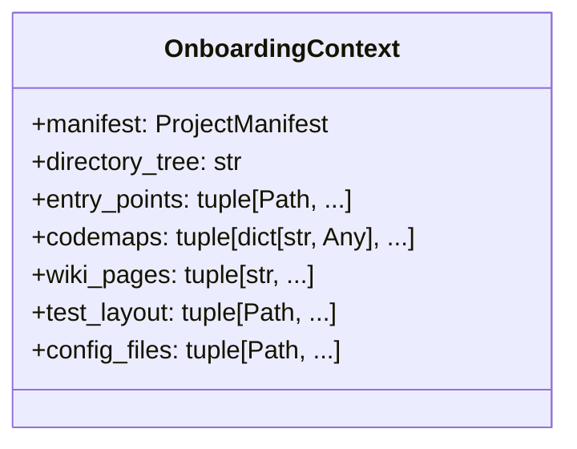

# File: `src/local_deepwiki/generators/analysis/onboarding.py`

## File Overview

This file implements a comprehensive onboarding guide generator for software repositories. It scans a project to gather structural information and uses LLMs to synthesize a rich, narrative documentation guide that helps newcomers understand the project's architecture, entry points, and development workflow.

The module is designed to support both basic and rich onboarding experiences:
- **Basic onboarding** is generated by `generate_onboarding_guide` and `format_onboarding_guide`, which produce a markdown document based on static project analysis.
- **Rich onboarding** is generated by `generate_rich_onboarding`, which uses LLMs to select key execution flows, generate codemaps, and synthesize a detailed guide with diagrams and narrative walkthroughs.

The file is part of the `local_deepwiki.generators.analysis` package and integrates with other generators like `dir_tree`, `manifest`, and `codemap` to [collect](../../web/routes_chat.md) project metadata and code structure information.

## Key Concepts

### Repository Analysis and Structured Data Collection
The module starts by scanning a repository using several helper functions to [collect](../../web/routes_chat.md) key information:
- `_find_entry_points`: Identifies potential entry points by matching common file naming patterns.
- `_find_key_modules`: Finds source modules by line count to identify core components.
- `_find_test_layout`: Detects test directory structures.
- `_find_config_files`: Identifies configuration files and directories.

These functions use `pathlib.Path` and `glob`-style patterns to traverse the repository, with filtering logic to exclude common non-source paths like `__pycache__` and hidden directories.

### Onboarding Data Format and Detail Levels
The `generate_onboarding_guide` function returns a structured dictionary that supports multiple detail levels (`summary`, `standard`, `full`). This allows for generating concise or comprehensive guides depending on the user's needs.

The `format_onboarding_guide` function then renders this structured data into markdown text using formatting helpers like `_format_project_overview`, `_format_getting_started`, and `_format_repository_layout`.

### LLM-Driven Execution Flow Selection and Codemap Generation
For rich onboarding, the module leverages LLMs to:
1. **Select important execution flows** using `_select_flows_with_llm`.
2. **Generate codemaps** for these flows using `_generate_codemaps_for_flows`.
3. **Synthesize a full guide** using `_synthesize_onboarding_guide`.

This LLM-based approach allows for dynamic selection of relevant flows and narrative generation, making the onboarding guide more adaptive to the project's actual structure and complexity.

### Prompt Engineering for LLM Interaction
The module uses carefully crafted prompts to guide the LLM:
- `_build_flow_selection_prompt` asks the LLM to choose 3 important entry points.
- `_build_onboarding_synthesis_prompt` provides a comprehensive prompt template for generating a full guide with sections like "What This Project Does", "Architecture at a Glance", and "How It Works".

These prompts are designed to return structured outputs (e.g., JSON for flow selection) and enforce formatting rules (e.g., using relative links, inlining Mermaid diagrams).

## Integration

This file integrates with the broader `local_deepwiki` codebase through several key modules:

- **`local_deepwiki.generators.dir_tree`**: Used by [`get_directory_tree`](../dir_tree.md) to build the repository layout for onboarding.
- **`local_deepwiki.generators.manifest`**: Used by [`get_cached_manifest`](../manifest.md) to extract project metadata (name, version, scripts, etc.).
- **`local_deepwiki.generators.codemap.generator`**: Used by [`generate_codemap`](../codemap/generator.md) to create execution flow diagrams for key areas of the codebase.
- **`local_deepwiki.logging`**: Used for logging warnings and errors during LLM interactions.

The functions in this module are called by CLI commands and test suites:
- `generate_onboarding_guide` and `format_onboarding_guide` are used by `test_onboarding`.
- `generate_rich_onboarding` is used by CLI commands that require rich documentation generation.

## Design Notes

### Detail Level Strategy
The module supports three detail levels (`summary`, `standard`, `full`) to balance information density with performance. This is implemented via lookup tables (`_TREE_DEPTH`, `_KEY_MODULE_LIMITS`) that control how much information is gathered and formatted.

### LLM Interaction Robustness
To handle LLM failures gracefully, the module implements fallbacks:
- If LLM flow selection fails, `_fallback_flows` uses heuristics based on entry points.
- If codemap generation fails for a flow, the error is logged but does not halt the entire process.
- `_parse_flow_json` strips markdown code fences to handle LLM responses that wrap JSON in triple backticks.

### Mermaid Diagram Inlining
A key design choice is to inline Mermaid diagrams verbatim from the codemap generation step. This ensures that the onboarding guide includes the actual, context-specific diagrams rather than generic or simplified versions, improving accuracy and utility for newcomers.

### Wiki Page Integration
The module supports linking to existing wiki pages by scanning the `.deepwiki` directory. This allows the onboarding guide to reference project documentation, enhancing the value of the generated content.

### Path Handling and Filtering
All file path operations use `pathlib.Path` and include filtering to avoid including:
- Hidden directories (starting with `.`)
- `__pycache__`
- `node_modules`
- Test files in key modules listing

This ensures that the onboarding guide focuses on relevant source code and avoids noise from build artifacts or test infrastructure.

## API Reference

### class `OnboardingContext`

Immutable context for onboarding guide synthesis.  Bundles the gathered project data passed through :func:`_build_onboarding_prompt_context` and :func:`_synthesize_onboarding_guide`.

---


<details>
<summary>View Source (lines 22-36) | <a href="https://github.com/UrbanDiver/local-deepwiki-mcp/blob/main/src/local_deepwiki/generators/analysis/onboarding.py#L22-L36">GitHub</a></summary>

```python
class OnboardingContext:
    """Immutable context for onboarding guide synthesis.

    Bundles the gathered project data passed through
    :func:`_build_onboarding_prompt_context` and
    :func:`_synthesize_onboarding_guide`.
    """

    manifest: ProjectManifest
    directory_tree: str
    entry_points: tuple[Path, ...] = ()
    codemaps: tuple[dict[str, Any], ...] = ()
    wiki_pages: tuple[str, ...] = ()
    test_layout: tuple[Path, ...] = ()
    config_files: tuple[Path, ...] = ()
```

</details>

### Functions

#### `generate_onboarding_guide`

```python
def generate_onboarding_guide(repo_path: Path, detail_level: str = "standard") -> dict[str, Any]
```

Scan a repository and return structured onboarding data.


| Parameter | Type | Default | Description |
|-----------|------|---------|-------------|
| `repo_path` | `Path` | - | Path to the repository root. |
| `detail_level` | `str` | `"standard"` | One of ``"summary"``, ``"standard"``, or ``"full"``. |

**Returns:** `dict[str, Any]`


<details>
<summary>View Source (lines 179-211) | <a href="https://github.com/UrbanDiver/local-deepwiki-mcp/blob/main/src/local_deepwiki/generators/analysis/onboarding.py#L179-L211">GitHub</a></summary>

```python
def generate_onboarding_guide(
    repo_path: Path, *, detail_level: str = "standard"
) -> dict[str, Any]:
    """Scan a repository and return structured onboarding data.

    Args:
        repo_path: Path to the repository root.
        detail_level: One of ``"summary"``, ``"standard"``, or ``"full"``.

    Returns:
        Dictionary with keys: ``manifest``, ``directory_tree``,
        ``entry_points``, ``key_modules``, ``test_layout``,
        ``config_files``, ``detail_level``.
    """
    tree_depth = _TREE_DEPTH.get(detail_level, 3)
    module_limit = _KEY_MODULE_LIMITS.get(detail_level, 5)

    manifest = get_cached_manifest(repo_path)
    directory_tree = get_directory_tree(repo_path, max_depth=tree_depth)
    entry_points = _find_entry_points(repo_path)
    key_modules = _find_key_modules(repo_path, limit=module_limit)
    test_layout = _find_test_layout(repo_path)
    config_files = _find_config_files(repo_path)

    return {
        "manifest": manifest,
        "directory_tree": directory_tree,
        "entry_points": entry_points,
        "key_modules": key_modules,
        "test_layout": test_layout,
        "config_files": config_files,
        "detail_level": detail_level,
    }
```

</details>

#### `format_onboarding_guide`

```python
def format_onboarding_guide(data: dict[str, Any], detail_level: str = "standard") -> str
```

Format structured onboarding data into a markdown narrative.


| Parameter | Type | Default | Description |
|-----------|------|---------|-------------|
| `data` | `dict[str, Any]` | - | Structured data from :func:`generate_onboarding_guide`. |
| `detail_level` | `str` | `"standard"` | One of ``"summary"``, ``"standard"``, or ``"full"``. |

**Returns:** `str`


<details>
<summary>View Source (lines 325-357) | <a href="https://github.com/UrbanDiver/local-deepwiki-mcp/blob/main/src/local_deepwiki/generators/analysis/onboarding.py#L325-L357">GitHub</a></summary>

```python
def format_onboarding_guide(
    data: dict[str, Any], *, detail_level: str = "standard"
) -> str:
    """Format structured onboarding data into a markdown narrative.

    Args:
        data: Structured data from :func:`generate_onboarding_guide`.
        detail_level: One of ``"summary"``, ``"standard"``, or ``"full"``.

    Returns:
        Markdown string with appropriate sections for the detail level.
    """
    manifest: ProjectManifest = data["manifest"]
    sections = ["# Onboarding Guide", ""]

    # Always included: overview, getting started, layout
    sections.append(_format_project_overview(manifest))
    sections.append(_format_getting_started(manifest))
    sections.append(_format_repository_layout(data["directory_tree"]))

    if detail_level == "summary":
        return "\n".join(sections)

    # Standard and full: entry points, key modules, testing
    sections.append(_format_entry_points(data["entry_points"]))
    sections.append(_format_key_modules(data["key_modules"]))
    sections.append(_format_testing(data["test_layout"]))

    # Full only: configuration
    if detail_level == "full":
        sections.append(_format_configuration(data["config_files"]))

    return "\n".join(sections)
```

</details>

#### `generate_rich_onboarding`

```python
async def generate_rich_onboarding(repo_path: Path, vector_store: Any, llm: Any, detail_level: str = "full") -> dict[str, Any]
```

Generate a rich onboarding guide with diagrams, narrative, and wiki links.  Requires prior indexing -- uses vector store for codemap generation and LLM for flow selection and synthesis.


| Parameter | Type | Default | Description |
|-----------|------|---------|-------------|
| `repo_path` | `Path` | - | Path to the indexed repository. |
| `vector_store` | `Any` | - | Initialized VectorStore instance. |
| `llm` | `Any` | - | LLM provider for flow selection and synthesis. |
| `detail_level` | `str` | `"full"` | Detail level (currently always produces full output). |

**Returns:** `dict[str, Any]`


<details>
<summary>View Source (lines 609-666) | <a href="https://github.com/UrbanDiver/local-deepwiki-mcp/blob/main/src/local_deepwiki/generators/analysis/onboarding.py#L609-L666">GitHub</a></summary>

```python
async def generate_rich_onboarding(
    repo_path: Path,
    vector_store: Any,
    llm: Any,
    *,
    detail_level: str = "full",
) -> dict[str, Any]:
    """Generate a rich onboarding guide with diagrams, narrative, and wiki links.

    Requires prior indexing -- uses vector store for codemap generation
    and LLM for flow selection and synthesis.

    Args:
        repo_path: Path to the indexed repository.
        vector_store: Initialized VectorStore instance.
        llm: LLM provider for flow selection and synthesis.
        detail_level: Detail level (currently always produces full output).

    Returns:
        Dict with ``status``, ``guide`` (markdown string), and ``codemaps``
        (list of codemap dicts).
    """
    basics = generate_onboarding_guide(repo_path, detail_level=detail_level)
    manifest: ProjectManifest = basics["manifest"]
    entry_points: list[Path] = basics["entry_points"]
    directory_tree: str = basics["directory_tree"]
    test_layout: list[Path] = basics["test_layout"]
    config_files: list[Path] = basics["config_files"]

    flows = await _select_flows_with_llm(llm, manifest, entry_points, directory_tree)

    codemaps = await _generate_codemaps_for_flows(flows, vector_store, repo_path, llm)

    wiki_path = repo_path / ".deepwiki"
    wiki_pages: list[str] = []
    if wiki_path.exists():
        for md_file in sorted(wiki_path.rglob("*.md")):
            try:
                wiki_pages.append(str(md_file.relative_to(wiki_path)))
            except ValueError:
                continue

    onboarding_ctx = OnboardingContext(
        manifest=manifest,
        directory_tree=directory_tree,
        entry_points=tuple(entry_points),
        codemaps=tuple(codemaps),
        wiki_pages=tuple(wiki_pages),
        test_layout=tuple(test_layout),
        config_files=tuple(config_files),
    )
    guide = await _synthesize_onboarding_guide(llm, onboarding_ctx)

    return {
        "status": "success",
        "guide": guide,
        "codemaps": codemaps,
    }
```

</details>

## Class Diagram



## Call Graph

```mermaid
flowchart TD
    N0[Path]
    N1[_build_flow_selection_prompt]
    N2[_build_onboarding_prompt_co...]
    N3[_fallback_flows]
    N4[_find_config_files]
    N5[_find_entry_points]
    N6[_find_key_modules]
    N7[_find_test_layout]
    N8[_format_entry_points]
    N9[_format_getting_started]
    N10[_format_project_overview]
    N11[_format_repository_layout]
    N12[_generate_codemaps_for_flows]
    N13[_parse_flow_json]
    N14[_select_flows_with_llm]
    N15[_synthesize_onboarding_guide]
    N16[add]
    N17[exists]
    N18[format_onboarding_guide]
    N19[generate]
    N20[generate_onboarding_guide]
    N21[generate_rich_onboarding]
    N22[get_cached_manifest]
    N23[get_directory_tree]
    N24[get_tech_stack_summary]
    N25[read_text]
    N26[relative_to]
    N27[rglob]
    N28[sort]
    N29[splitlines]
    N5 --> N27
    N5 --> N26
    N6 --> N27
    N6 --> N26
    N6 --> N29
    N6 --> N25
    N6 --> N28
    N7 --> N27
    N7 --> N26
    N7 --> N16
    N7 --> N0
    N4 --> N17
    N4 --> N0
    N20 --> N22
    N20 --> N23
    N20 --> N5
    N20 --> N6
    N20 --> N7
    N20 --> N4
    N10 --> N24
    N18 --> N10
    N18 --> N9
    N18 --> N11
    N18 --> N8
    N1 --> N24
    N14 --> N1
    N14 --> N19
    N14 --> N13
    N14 --> N3
    N2 --> N24
    N15 --> N2
    N15 --> N19
    N21 --> N20
    N21 --> N14
    N21 --> N12
    N21 --> N17
    N21 --> N27
    N21 --> N26
    N21 --> N15
    classDef func fill:#e1f5fe
    class N0,N1,N2,N3,N4,N5,N6,N7,N8,N9,N10,N11,N12,N13,N14,N15,N16,N17,N18,N19,N20,N21,N22,N23,N24,N25,N26,N27,N28,N29 func
```



## Used By

Functions and methods in this file and their callers:

- **`OnboardingContext`**: called by `generate_rich_onboarding`
- **`Path`**: called by `_find_config_files`, `_find_test_layout`
- **`_build_flow_selection_prompt`**: called by `_select_flows_with_llm`
- **`_build_onboarding_prompt_context`**: called by `_synthesize_onboarding_guide`
- **`_build_onboarding_synthesis_prompt`**: called by `_synthesize_onboarding_guide`
- **`_fallback_flows`**: called by `_select_flows_with_llm`
- **`_find_config_files`**: called by `generate_onboarding_guide`
- **`_find_entry_points`**: called by `generate_onboarding_guide`
- **`_find_key_modules`**: called by `generate_onboarding_guide`
- **`_find_test_layout`**: called by `generate_onboarding_guide`
- **`_format_codemap_text`**: called by `_build_onboarding_prompt_context`
- **`_format_configuration`**: called by `format_onboarding_guide`
- **`_format_entry_points`**: called by `format_onboarding_guide`
- **`_format_getting_started`**: called by `format_onboarding_guide`
- **`_format_key_modules`**: called by `format_onboarding_guide`
- **`_format_project_overview`**: called by `format_onboarding_guide`
- **`_format_repository_layout`**: called by `format_onboarding_guide`
- **`_format_testing`**: called by `format_onboarding_guide`
- **`_generate_codemaps_for_flows`**: called by `generate_rich_onboarding`
- **`_join_paths_as_bullets`**: called by `_build_onboarding_prompt_context`
- **`_parse_flow_json`**: called by `_select_flows_with_llm`
- **`_select_flows_with_llm`**: called by `generate_rich_onboarding`
- **`_strip_code_fence`**: called by `_parse_flow_json`
- **`_synthesize_onboarding_guide`**: called by `generate_rich_onboarding`
- **`add`**: called by `_find_test_layout`
- **`exists`**: called by `_find_config_files`, `generate_rich_onboarding`
- **`generate`**: called by `_select_flows_with_llm`, `_synthesize_onboarding_guide`
- **[`generate_codemap`](../codemap/generator.md)**: called by `_generate_codemaps_for_flows`
- **`generate_onboarding_guide`**: called by `generate_rich_onboarding`
- **[`get_cached_manifest`](../manifest.md)**: called by `generate_onboarding_guide`
- **[`get_directory_tree`](../dir_tree.md)**: called by `generate_onboarding_guide`
- **`get_tech_stack_summary`**: called by `_build_flow_selection_prompt`, `_build_onboarding_prompt_context`, `_format_project_overview`
- **`loads`**: called by `_parse_flow_json`
- **`read_text`**: called by `_find_key_modules`
- **`relative_to`**: called by `_find_entry_points`, `_find_key_modules`, `_find_test_layout`, `generate_rich_onboarding`
- **`rglob`**: called by `_find_entry_points`, `_find_key_modules`, `_find_test_layout`, `generate_rich_onboarding`
- **`sort`**: called by `_find_key_modules`
- **`splitlines`**: called by `_find_key_modules`
- **`title`**: called by `_fallback_flows`

## Usage Examples

*Examples extracted from test files*

### Standard detail level returns all main sections

From `test_onboarding.py::test_generate_onboarding_guide_standard`:

```python
data = generate_onboarding_guide(synthetic_repo, detail_level="standard")

assert "manifest" in data
assert "directory_tree" in data
assert "entry_points" in data
assert "key_modules" in data
assert "test_layout" in data
assert "detail_level" in data
assert data["detail_level"] == "standard"
```

### Standard detail level returns all main sections

From `test_onboarding.py::test_generate_onboarding_guide_standard`:

```python
data = generate_onboarding_guide(synthetic_repo, detail_level="standard")

assert "manifest" in data
assert "directory_tree" in data
assert "entry_points" in data
assert "key_modules" in data
assert "test_layout" in data
assert "detail_level" in data
assert data["detail_level"] == "standard"
```

### Detects __main__.py and server.py as entry points

From `test_onboarding.py::test_generate_onboarding_guide_has_entry_points`:

```python
data = generate_onboarding_guide(synthetic_repo, detail_level="standard")

entry_point_paths = [str(ep) for ep in data["entry_points"]]
# Should find __main__.py and server.py (and cli.py)
assert any("__main__.py" in p for p in entry_point_paths)
assert any("server.py" in p for p in entry_point_paths)
```

### Formatted markdown has expected section headers for standard level

From `test_onboarding.py::test_format_onboarding_guide_standard`:

```python
data = generate_onboarding_guide(synthetic_repo, detail_level="standard")
md = format_onboarding_guide(data, detail_level="standard")

assert "# Onboarding Guide" in md
assert "## Project Overview" in md
assert "## Getting Started" in md
assert "## Repository Layout" in md
assert "## Entry Points" in md
assert "## Key Modules" in md
assert "## Testing" in md
```

### Summary level only includes overview, getting started, and layout

From `test_onboarding.py::test_format_onboarding_guide_summary`:

```python
data = generate_onboarding_guide(synthetic_repo, detail_level="summary")
md = format_onboarding_guide(data, detail_level="summary")

assert "## Project Overview" in md
assert "## Getting Started" in md
assert "## Repository Layout" in md
# Should NOT include detailed sections
assert "## Entry Points" not in md
assert "## Key Modules" not in md
assert "## Testing" not in md
assert "## Configuration" not in md
```


## Last Modified

| Entity | Type | Author | Date | Commit |
|--------|------|--------|------|--------|
| `OnboardingContext` | class | Brian Breidenbach | yesterday | `1eef062` refactor: complete Grade A ... |
| `_build_onboarding_prompt_context` | function | Brian Breidenbach | yesterday | `1eef062` refactor: complete Grade A ... |
| `_synthesize_onboarding_guide` | function | Brian Breidenbach | yesterday | `1eef062` refactor: complete Grade A ... |
| `generate_rich_onboarding` | function | Brian Breidenbach | yesterday | `1eef062` refactor: complete Grade A ... |
| `_build_flow_selection_prompt` | function | Brian Breidenbach | 2 days ago | `1a11306` refactor: decompose CC > 15... |
| `_strip_code_fence` | function | Brian Breidenbach | 2 days ago | `1a11306` refactor: decompose CC > 15... |
| `_parse_flow_json` | function | Brian Breidenbach | 2 days ago | `1a11306` refactor: decompose CC > 15... |
| `_fallback_flows` | function | Brian Breidenbach | 2 days ago | `1a11306` refactor: decompose CC > 15... |
| `_select_flows_with_llm` | function | Brian Breidenbach | 2 days ago | `1a11306` refactor: decompose CC > 15... |
| `_format_codemap_text` | function | Brian Breidenbach | 2 days ago | `1a11306` refactor: decompose CC > 15... |
| `_join_paths_as_bullets` | function | Brian Breidenbach | 2 days ago | `1a11306` refactor: decompose CC > 15... |
| `_build_onboarding_synthesis_prompt` | function | Brian Breidenbach | 2 days ago | `1a11306` refactor: decompose CC > 15... |
| `_generate_codemaps_for_flows` | function | Brian Breidenbach | 3 days ago | `f9fa919` fix: use local import for g... |
| `_find_entry_points` | function | Brian Breidenbach | 4 days ago | `a4056de` feat: add onboarding guide ... |
| `_find_key_modules` | function | Brian Breidenbach | 4 days ago | `a4056de` feat: add onboarding guide ... |
| `_find_test_layout` | function | Brian Breidenbach | 4 days ago | `a4056de` feat: add onboarding guide ... |
| `_find_config_files` | function | Brian Breidenbach | 4 days ago | `a4056de` feat: add onboarding guide ... |
| `generate_onboarding_guide` | function | Brian Breidenbach | 4 days ago | `a4056de` feat: add onboarding guide ... |
| `_format_project_overview` | function | Brian Breidenbach | 4 days ago | `a4056de` feat: add onboarding guide ... |
| `_format_getting_started` | function | Brian Breidenbach | 4 days ago | `a4056de` feat: add onboarding guide ... |
| `_format_repository_layout` | function | Brian Breidenbach | 4 days ago | `a4056de` feat: add onboarding guide ... |
| `_format_entry_points` | function | Brian Breidenbach | 4 days ago | `a4056de` feat: add onboarding guide ... |
| `_format_key_modules` | function | Brian Breidenbach | 4 days ago | `a4056de` feat: add onboarding guide ... |
| `_format_testing` | function | Brian Breidenbach | 4 days ago | `a4056de` feat: add onboarding guide ... |
| `_format_configuration` | function | Brian Breidenbach | 4 days ago | `a4056de` feat: add onboarding guide ... |
| `format_onboarding_guide` | function | Brian Breidenbach | 4 days ago | `a4056de` feat: add onboarding guide ... |

## Additional Source Code

Source code for functions and methods not listed in the API Reference above.

#### `_find_entry_points`

<details>
<summary>View Source (lines 83-100) | <a href="https://github.com/UrbanDiver/local-deepwiki-mcp/blob/main/src/local_deepwiki/generators/analysis/onboarding.py#L83-L100">GitHub</a></summary>

```python
def _find_entry_points(repo_path: Path) -> list[Path]:
    """Discover entry point files by matching known filename patterns.

    Returns paths relative to repo_path, sorted alphabetically.
    """
    found: list[Path] = []
    for pattern in ENTRY_POINT_PATTERNS:
        for match in sorted(repo_path.rglob(pattern)):
            try:
                relative = match.relative_to(repo_path)
            except ValueError:
                continue
            # Skip hidden directories and common non-source locations
            parts = relative.parts
            if any(part.startswith(".") or part == "__pycache__" for part in parts):
                continue
            found.append(relative)
    return sorted(found)
```

</details>


#### `_find_key_modules`

<details>
<summary>View Source (lines 103-137) | <a href="https://github.com/UrbanDiver/local-deepwiki-mcp/blob/main/src/local_deepwiki/generators/analysis/onboarding.py#L103-L137">GitHub</a></summary>

```python
def _find_key_modules(repo_path: Path, limit: int) -> list[dict[str, Any]]:
    """Identify key source modules by size (line count).

    Returns up to *limit* modules sorted by descending line count.
    Each entry has ``path`` (relative) and ``lines``.
    """
    if limit <= 0:
        return []

    source_extensions = {".py", ".ts", ".tsx", ".js", ".jsx", ".go", ".rs", ".java"}
    modules: list[dict[str, Any]] = []

    for ext in source_extensions:
        for filepath in repo_path.rglob(f"*{ext}"):
            try:
                relative = filepath.relative_to(repo_path)
            except ValueError:
                continue
            parts = relative.parts
            if any(
                part.startswith(".") or part in ("__pycache__", "node_modules")
                for part in parts
            ):
                continue
            # Skip test files for key modules listing
            if any(part.startswith("test") for part in parts):
                continue
            try:
                line_count = len(filepath.read_text(errors="replace").splitlines())
            except OSError:
                continue
            modules.append({"path": relative, "lines": line_count})

    modules.sort(key=lambda m: m["lines"], reverse=True)
    return modules[:limit]
```

</details>


#### `_find_test_layout`

<details>
<summary>View Source (lines 140-163) | <a href="https://github.com/UrbanDiver/local-deepwiki-mcp/blob/main/src/local_deepwiki/generators/analysis/onboarding.py#L140-L163">GitHub</a></summary>

```python
def _find_test_layout(repo_path: Path) -> list[Path]:
    """Find test directories and test files.

    Returns relative paths to directories containing test files.
    """
    test_dirs: set[Path] = set()
    test_patterns = ("test_*.py", "*_test.py", "test_*.ts", "*.test.ts", "*.spec.ts")

    for pattern in test_patterns:
        for match in repo_path.rglob(pattern):
            try:
                relative = match.relative_to(repo_path)
            except ValueError:
                continue
            parts = relative.parts
            if any(part.startswith(".") or part == "__pycache__" for part in parts):
                continue
            # Add the parent directory of the test file
            if len(relative.parts) > 1:
                test_dirs.add(Path(*relative.parts[:-1]))
            else:
                test_dirs.add(Path("."))

    return sorted(test_dirs)
```

</details>


#### `_find_config_files`

<details>
<summary>View Source (lines 166-176) | <a href="https://github.com/UrbanDiver/local-deepwiki-mcp/blob/main/src/local_deepwiki/generators/analysis/onboarding.py#L166-L176">GitHub</a></summary>

```python
def _find_config_files(repo_path: Path) -> list[Path]:
    """Discover configuration files and directories matching known patterns.

    Returns relative paths sorted alphabetically.
    """
    found: list[Path] = []
    for pattern in CONFIG_PATTERNS:
        candidate = repo_path / pattern
        if candidate.exists():
            found.append(Path(pattern))
    return sorted(found)
```

</details>


#### `_format_project_overview`

<details>
<summary>View Source (lines 214-231) | <a href="https://github.com/UrbanDiver/local-deepwiki-mcp/blob/main/src/local_deepwiki/generators/analysis/onboarding.py#L214-L231">GitHub</a></summary>

```python
def _format_project_overview(manifest: ProjectManifest) -> str:
    """Format the Project Overview section."""
    lines = ["## Project Overview", ""]
    if manifest.name:
        lines.append(f"**{manifest.name}**")
        if manifest.version:
            lines[-1] += f" v{manifest.version}"
        lines.append("")
    if manifest.description:
        lines.append(manifest.description)
        lines.append("")
    tech_summary = manifest.get_tech_stack_summary()
    if tech_summary and tech_summary != "No package manifest found.":
        lines.append("### Tech Stack")
        lines.append("")
        lines.append(tech_summary)
        lines.append("")
    return "\n".join(lines)
```

</details>


#### `_format_getting_started`

<details>
<summary>View Source (lines 234-255) | <a href="https://github.com/UrbanDiver/local-deepwiki-mcp/blob/main/src/local_deepwiki/generators/analysis/onboarding.py#L234-L255">GitHub</a></summary>

```python
def _format_getting_started(manifest: ProjectManifest) -> str:
    """Format the Getting Started section."""
    lines = ["## Getting Started", ""]
    if manifest.scripts:
        lines.append("Available scripts:")
        lines.append("")
        for name, cmd in sorted(manifest.scripts.items()):
            lines.append(f"- `{name}`: `{cmd}`")
        lines.append("")
    elif manifest.language:
        lines.append(f"This is a **{manifest.language}** project.")
        if manifest.manifest_files:
            lines.append(
                f"Check `{manifest.manifest_files[0]}` for build/run instructions."
            )
        lines.append("")
    else:
        lines.append(
            "No package manifest detected. Check the repository for setup instructions."
        )
        lines.append("")
    return "\n".join(lines)
```

</details>


#### `_format_repository_layout`

<details>
<summary>View Source (lines 258-269) | <a href="https://github.com/UrbanDiver/local-deepwiki-mcp/blob/main/src/local_deepwiki/generators/analysis/onboarding.py#L258-L269">GitHub</a></summary>

```python
def _format_repository_layout(directory_tree: str) -> str:
    """Format the Repository Layout section."""
    return "\n".join(
        [
            "## Repository Layout",
            "",
            "```",
            directory_tree,
            "```",
            "",
        ]
    )
```

</details>


#### `_format_entry_points`

<details>
<summary>View Source (lines 272-281) | <a href="https://github.com/UrbanDiver/local-deepwiki-mcp/blob/main/src/local_deepwiki/generators/analysis/onboarding.py#L272-L281">GitHub</a></summary>

```python
def _format_entry_points(entry_points: list[Path]) -> str:
    """Format the Entry Points section."""
    lines = ["## Entry Points", ""]
    if entry_points:
        for ep in entry_points:
            lines.append(f"- `{ep}`")
    else:
        lines.append("No standard entry points detected.")
    lines.append("")
    return "\n".join(lines)
```

</details>


#### `_format_key_modules`

<details>
<summary>View Source (lines 284-295) | <a href="https://github.com/UrbanDiver/local-deepwiki-mcp/blob/main/src/local_deepwiki/generators/analysis/onboarding.py#L284-L295">GitHub</a></summary>

```python
def _format_key_modules(key_modules: list[dict[str, Any]]) -> str:
    """Format the Key Modules section."""
    lines = ["## Key Modules", ""]
    if key_modules:
        lines.append("Largest source files (by line count):")
        lines.append("")
        for mod in key_modules:
            lines.append(f"- `{mod['path']}` ({mod['lines']} lines)")
    else:
        lines.append("No source modules detected.")
    lines.append("")
    return "\n".join(lines)
```

</details>


#### `_format_testing`

<details>
<summary>View Source (lines 298-310) | <a href="https://github.com/UrbanDiver/local-deepwiki-mcp/blob/main/src/local_deepwiki/generators/analysis/onboarding.py#L298-L310">GitHub</a></summary>

```python
def _format_testing(test_layout: list[Path]) -> str:
    """Format the Testing section."""
    lines = ["## Testing", ""]
    if test_layout:
        lines.append("Test directories:")
        lines.append("")
        for td in test_layout:
            display = str(td) if str(td) != "." else "(root)"
            lines.append(f"- `{display}`")
    else:
        lines.append("No test files detected.")
    lines.append("")
    return "\n".join(lines)
```

</details>


#### `_format_configuration`

<details>
<summary>View Source (lines 313-322) | <a href="https://github.com/UrbanDiver/local-deepwiki-mcp/blob/main/src/local_deepwiki/generators/analysis/onboarding.py#L313-L322">GitHub</a></summary>

```python
def _format_configuration(config_files: list[Path]) -> str:
    """Format the Configuration section."""
    lines = ["## Configuration", ""]
    if config_files:
        for cf in config_files:
            lines.append(f"- `{cf}`")
    else:
        lines.append("No standard configuration files detected.")
    lines.append("")
    return "\n".join(lines)
```

</details>


#### `_build_flow_selection_prompt`

<details>
<summary>View Source (lines 365-387) | <a href="https://github.com/UrbanDiver/local-deepwiki-mcp/blob/main/src/local_deepwiki/generators/analysis/onboarding.py#L365-L387">GitHub</a></summary>

```python
def _build_flow_selection_prompt(
    manifest: ProjectManifest,
    entry_points: list[Path],
    directory_tree: str,
) -> str:
    """Construct the LLM prompt for selecting important newcomer flows."""
    entry_list = "\n".join(f"- {ep}" for ep in entry_points) or "- (none detected)"
    tech_stack = manifest.get_tech_stack_summary() or "Unknown"
    return (
        "You are helping a developer who is new to this codebase. "
        "Given the project structure below, pick the 3 most important "
        "execution flows a newcomer should understand first.\n\n"
        f"Project: {manifest.name or 'Unknown'}\n"
        f"Description: {manifest.description or 'No description'}\n"
        f"Tech stack: {tech_stack}\n\n"
        f"Entry points:\n{entry_list}\n\n"
        f"Directory structure:\n{directory_tree[:3000]}\n\n"
        "Return ONLY a JSON array of exactly 3 objects, each with:\n"
        '- "entry_point": function or filename to start tracing from\n'
        '- "query": a "How does X work?" question for the codemap\n'
        '- "title": short title for this flow (2-5 words)\n\n'
        "Return ONLY the JSON array, no other text."
    )
```

</details>


#### `_strip_code_fence`

<details>
<summary>View Source (lines 390-398) | <a href="https://github.com/UrbanDiver/local-deepwiki-mcp/blob/main/src/local_deepwiki/generators/analysis/onboarding.py#L390-L398">GitHub</a></summary>

```python
def _strip_code_fence(text: str) -> str:
    """Remove optional markdown code fence from LLM JSON output."""
    cleaned = text.strip()
    if cleaned.startswith("```"):
        cleaned = cleaned.split("\n", 1)[1] if "\n" in cleaned else cleaned[3:]
        if cleaned.endswith("```"):
            cleaned = cleaned[:-3]
        cleaned = cleaned.strip()
    return cleaned
```

</details>


#### `_parse_flow_json`

<details>
<summary>View Source (lines 401-417) | <a href="https://github.com/UrbanDiver/local-deepwiki-mcp/blob/main/src/local_deepwiki/generators/analysis/onboarding.py#L401-L417">GitHub</a></summary>

```python
def _parse_flow_json(raw: str) -> list[dict[str, str]] | None:
    """Parse LLM JSON response into a list of flow dicts, or return None on failure."""
    try:
        cleaned = _strip_code_fence(raw)
        flows = json.loads(cleaned)
        if isinstance(flows, list) and len(flows) > 0:
            return [
                {
                    "entry_point": f.get("entry_point", ""),
                    "query": f.get("query", ""),
                    "title": f.get("title", ""),
                }
                for f in flows[:3]
            ]
    except Exception:
        pass
    return None
```

</details>


#### `_fallback_flows`

<details>
<summary>View Source (lines 420-432) | <a href="https://github.com/UrbanDiver/local-deepwiki-mcp/blob/main/src/local_deepwiki/generators/analysis/onboarding.py#L420-L432">GitHub</a></summary>

```python
def _fallback_flows(entry_points: list[Path]) -> list[dict[str, str]]:
    """Build heuristic flow list from entry points when LLM call fails."""
    fallback: list[dict[str, str]] = []
    for ep in entry_points[:3]:
        name = ep.stem
        fallback.append(
            {
                "entry_point": name,
                "query": f"How does {name} work?",
                "title": f"{name.replace('_', ' ').title()} Flow",
            }
        )
    return fallback
```

</details>


#### `_select_flows_with_llm`

<details>
<summary>View Source (lines 435-453) | <a href="https://github.com/UrbanDiver/local-deepwiki-mcp/blob/main/src/local_deepwiki/generators/analysis/onboarding.py#L435-L453">GitHub</a></summary>

```python
async def _select_flows_with_llm(
    llm: Any,
    manifest: ProjectManifest,
    entry_points: list[Path],
    directory_tree: str,
) -> list[dict[str, str]]:
    """Ask the LLM to pick the 3 most important flows for newcomers."""
    prompt = _build_flow_selection_prompt(manifest, entry_points, directory_tree)
    try:
        raw = await llm.generate(
            prompt, system_prompt="You are a code architecture expert."
        )
        parsed = _parse_flow_json(raw)
        if parsed is not None:
            return parsed
    except Exception:
        pass
    logger.warning("LLM flow selection failed, falling back to entry point heuristics")
    return _fallback_flows(entry_points)
```

</details>


#### `_generate_codemaps_for_flows`

<details>
<summary>View Source (lines 456-489) | <a href="https://github.com/UrbanDiver/local-deepwiki-mcp/blob/main/src/local_deepwiki/generators/analysis/onboarding.py#L456-L489">GitHub</a></summary>

```python
async def _generate_codemaps_for_flows(
    flows: list[dict[str, str]],
    vector_store: Any,
    repo_path: Path,
    llm: Any,
) -> list[dict[str, Any]]:
    """Generate codemaps for each selected flow."""
    from local_deepwiki.generators.codemap.generator import generate_codemap

    results: list[dict[str, Any]] = []
    for flow in flows:
        try:
            codemap = await generate_codemap(
                query=flow["query"],
                vector_store=vector_store,
                repo_path=repo_path,
                llm=llm,
                entry_point=flow["entry_point"] or None,
                max_depth=5,
                max_nodes=30,
            )
            if codemap.total_nodes > 0:
                results.append(
                    {
                        "title": flow["title"],
                        "query": flow["query"],
                        "mermaid_diagram": codemap.mermaid_diagram,
                        "narrative": codemap.narrative,
                        "files_involved": codemap.files_involved,
                    }
                )
        except Exception:
            logger.warning("Codemap generation failed for %r", flow.get("query"))
    return results
```

</details>


#### `_format_codemap_text`

<details>
<summary>View Source (lines 492-503) | <a href="https://github.com/UrbanDiver/local-deepwiki-mcp/blob/main/src/local_deepwiki/generators/analysis/onboarding.py#L492-L503">GitHub</a></summary>

```python
def _format_codemap_text(codemaps: list[dict[str, Any]]) -> str:
    """Render codemap results into a text block for the onboarding prompt."""
    sections: list[str] = []
    for cm in codemaps:
        sections.append(
            f"### Flow: {cm['title']}\n"
            f"Question: {cm['query']}\n"
            f"Files: {', '.join(cm['files_involved'][:10])}\n\n"
            f"Mermaid diagram:\n{cm['mermaid_diagram']}\n\n"
            f"Narrative:\n{cm['narrative']}\n"
        )
    return "\n---\n".join(sections) if sections else "(no codemaps generated)"
```

</details>


#### `_join_paths_as_bullets`

<details>
<summary>View Source (lines 506-509) | <a href="https://github.com/UrbanDiver/local-deepwiki-mcp/blob/main/src/local_deepwiki/generators/analysis/onboarding.py#L506-L509">GitHub</a></summary>

```python
def _join_paths_as_bullets(paths: list, default: str = "- (none detected)") -> str:
    """Join a list of paths as backtick bullet items, returning default when empty."""
    joined = "\n".join(f"- `{p}`" for p in paths)
    return joined if joined else default
```

</details>


#### `_build_onboarding_prompt_context`

<details>
<summary>View Source (lines 512-527) | <a href="https://github.com/UrbanDiver/local-deepwiki-mcp/blob/main/src/local_deepwiki/generators/analysis/onboarding.py#L512-L527">GitHub</a></summary>

```python
def _build_onboarding_prompt_context(
    ctx: OnboardingContext,
) -> dict[str, str]:
    """Assemble all text substitutions needed for the onboarding synthesis prompt."""
    return {
        "codemap_text": _format_codemap_text(list(ctx.codemaps)),
        "entry_list": _join_paths_as_bullets(list(ctx.entry_points)),
        "test_list": _join_paths_as_bullets(list(ctx.test_layout)),
        "config_list": _join_paths_as_bullets(list(ctx.config_files)),
        "wiki_links": _join_paths_as_bullets(
            list(ctx.wiki_pages[:30]), default="- (none available)"
        ),
        "tech_stack": ctx.manifest.get_tech_stack_summary() or "Unknown",
        "project_name": ctx.manifest.name or "Unknown",
        "project_description": ctx.manifest.description or "No description",
    }
```

</details>


#### `_build_onboarding_synthesis_prompt`

<details>
<summary>View Source (lines 530-593) | <a href="https://github.com/UrbanDiver/local-deepwiki-mcp/blob/main/src/local_deepwiki/generators/analysis/onboarding.py#L530-L593">GitHub</a></summary>

```python
def _build_onboarding_synthesis_prompt(ctx: dict[str, str], directory_tree: str) -> str:
    """Format the full LLM prompt for onboarding guide synthesis."""
    return f"""Generate a comprehensive Developer Onboarding Guide for the project below.

PROJECT METADATA:
- Name: {ctx["project_name"]}
- Description: {ctx["project_description"]}
- Tech stack: {ctx["tech_stack"]}

ENTRY POINTS:
{ctx["entry_list"]}

DIRECTORY STRUCTURE:
{directory_tree[:3000]}

EXECUTION FLOW DIAGRAMS (include these verbatim):
{ctx["codemap_text"]}

AVAILABLE WIKI PAGES (use for linking):
{ctx["wiki_links"]}

TEST LAYOUT:
{ctx["test_list"]}

CONFIGURATION FILES:
{ctx["config_list"]}

INSTRUCTIONS:
Produce a single markdown document with these sections:

1. **What This Project Does** -- 2-3 paragraphs explaining the purpose, who it's for, \
and what problem it solves. Write narrative prose, not bullet lists.

2. **Architecture at a Glance** -- A Mermaid component diagram showing how the main \
subsystems connect. Below the diagram, briefly describe each layer and link to wiki pages \
where available using relative links like `[ComponentName](files/path/to/file.md)`.

3. **How It Works** -- For each execution flow diagram provided above, create a subsection \
with:
   - The flow title as an H3 heading
   - The Mermaid diagram inlined VERBATIM (do not modify it)
   - A narrative walkthrough that references wiki pages with links like \
`[FileName](files/path/to/file.md)`

4. **Getting Started** -- Prerequisites, install commands, how to run. Based on the tech \
stack and config files.

5. **Key Concepts** -- A markdown table of important terms/concepts a newcomer needs to \
know, derived from the code entities visible in the execution flows.

6. **Development Workflow** -- How to run tests, lint, and do common development tasks. \
Based on the test layout and config files.

7. **Further Reading** -- Links to Architecture, Dependencies, Glossary, and Changelog wiki \
pages using relative links: `[Architecture](architecture.md)`, \
`[Dependencies](dependencies.md)`, `[Glossary](glossary.md)`, `[Changelog](changelog.md)`.

CRITICAL RULES:
- Use relative wiki links for file references: `[Name](files/path/to/file.md)`
- Inline Mermaid diagrams from the execution flows VERBATIM -- do not regenerate them
- Write narrative prose, not bullet lists, for descriptive sections
- The Key Concepts table should have columns: Concept | What It Means
- Start the document with `# Developer Onboarding Guide`
"""
```

</details>


#### `_synthesize_onboarding_guide`

<details>
<summary>View Source (lines 596-606) | <a href="https://github.com/UrbanDiver/local-deepwiki-mcp/blob/main/src/local_deepwiki/generators/analysis/onboarding.py#L596-L606">GitHub</a></summary>

```python
async def _synthesize_onboarding_guide(
    llm: Any,
    ctx: OnboardingContext,
) -> str:
    """Ask the LLM to synthesize the full onboarding guide."""
    prompt_ctx = _build_onboarding_prompt_context(ctx)
    prompt = _build_onboarding_synthesis_prompt(prompt_ctx, ctx.directory_tree)
    return await llm.generate(
        prompt,
        system_prompt="You are a technical writer creating developer documentation.",
    )
```

</details>

## Relevant Source Files

- `src/local_deepwiki/generators/analysis/onboarding.py:22-36`
