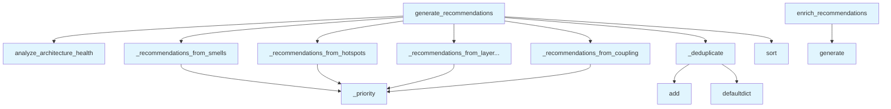

# File: `src/local_deepwiki/generators/analysis/recommendations.py`

## File Overview

This module is responsible for generating actionable, prioritized architecture recommendations based on findings from architecture health analysis. It transforms raw architectural issues (such as design smells, hotspots, layer violations, and coupling metrics) into structured recommendations that can guide developers in improving code quality.

The module provides two main functions:
- `generate_recommendations`: The core function that maps findings into recommendations, prioritizes them, and filters them based on category or count.
- `enrich_recommendations`: An optional async function that enhances each recommendation with LLM-generated descriptions for better clarity and actionability.

The design rationale is to keep `generate_recommendations` a pure function, avoiding side effects and enabling easy testing and reuse. LLM enrichment is kept as a separate step to maintain performance and control over external dependencies.

## Key Concepts

### Template-Based Recommendation Mapping
Recommendations are generated using templates defined per smell type. This approach allows for consistent formatting and structured data output while supporting different categories of architectural issues (e.g., god classes, cyclomatic complexity).

### Priority Scoring
Recommendations are scored based on a combination of impact and effort. The `_priority` function implements a weighted scoring system that favors high-impact, low-effort fixes. This prioritization helps developers focus on the most impactful improvements first.

### Deduplication and Grouping
The `_deduplicate` function ensures that:
1. Exact duplicates (same file, line, and category) are removed.
2. When three or more recommendations target the same file and category, they are merged into a compound entry to reduce noise and provide a consolidated view.

This algorithm balances between avoiding repetition and preserving actionable detail.

### Asynchronous LLM Enrichment
The `enrich_recommendations` function introduces optional async LLM-based enrichment. This allows for richer, more human-readable explanations without altering the core recommendation generation logic. Failures in enrichment are silently handled to ensure robustness.

## Integration

### Imports and Dependencies
This module imports:
- `Path` from `pathlib` for handling file system paths.
- `Any` from `typing` for flexible typing.
- [`get_logger`](../../logging.md) from `local_deepwiki.logging` for structured logging.
- `defaultdict` from `collections` for grouping logic.
- [`analyze_architecture_health`](architecture_health.md) from `local_deepwiki.generators.analysis.architecture_health`, which is the primary data source for this module's recommendations.

### Usage within the Codebase
- `generate_recommendations` is the main entry point for generating recommendations. It is used by other modules in the architecture analysis pipeline, such as `api_docs.py`, `architecture_compare.py`, and `smells_page.py`.
- `_recommendations_from_layer_violations` is used by `test_recommendations` for unit testing.
- `_deduplicate` is used by `reasoning`, `embedding`, and `graph` modules, suggesting it is a general-purpose utility for cleaning recommendation lists.

### Relationship to Related Files
This module is part of the architecture analysis suite and integrates closely with:
- `architecture_health.py`: Provides the input data (`health_data`) that drives recommendation generation.
- `smells_page.py`, `api_docs.py`, `architecture_compare.py`: These files likely consume the output of `generate_recommendations` to display or act upon recommendations.

## Design Notes

### Why Use Templates for Smells?
Using templates for smells allows for consistent formatting and categorization without hardcoding each smell type. This approach supports extensibility — new smell types can be added by simply extending the `_TEMPLATE_BY_TYPE` dictionary.

### Why Prioritize by Impact and Effort?
The priority score is based on impact and effort because it reflects a real-world trade-off. High-impact, low-effort changes provide immediate value and are more likely to be adopted. This scoring system ensures actionable results that are practical for developers.

### Handling Optional Coupling Metrics
Coupling metrics are optional and accessed via a private key (`_coupling_metrics`) in `health_data`. This design choice allows the system to function even if coupling analysis is not enabled or fails, without breaking the recommendation pipeline.

### Why Separate Enrichment from Generation?
LLM enrichment is kept as a separate step to:
- Allow performance tuning (e.g., batch LLM calls or caching).
- Avoid blocking or increasing latency in the core recommendation generation.
- Maintain a clean separation of concerns: data generation vs. enrichment.

### Deduplication Strategy
The deduplication logic handles two cases:
1. Exact duplicates are removed to prevent redundancy.
2. When multiple recommendations target the same file and category, they are grouped to reduce noise.

This strategy prevents overwhelming developers with repetitive suggestions while preserving the ability to merge actionable insights.

## API Reference

### Functions

#### `generate_recommendations`

```python
def generate_recommendations(repo_path: Path, health_data: dict[str, Any] | None = None, max_items: int = 10, category_filter: str | None = None) -> dict[str, Any]
```

Generate prioritized architecture recommendations.


| Parameter | Type | Default | Description |
|-----------|------|---------|-------------|
| `repo_path` | `Path` | - | Repository root (used only when *health_data* is ``None``). |
| `health_data` | `dict[str, Any] | None` | `None` | Pre-computed output from ``analyze_architecture_health``. When ``None``, the function runs the analysis internally. |
| `max_items` | `int` | `10` | Maximum number of recommendations to return. |
| `category_filter` | `str | None` | `None` | If set, restrict to a single category (``"smells"``, ``"complexity"``, ``"coupling"``, ``"layers"``). |

**Returns:** `dict[str, Any]`


<details>
<summary>View Source (lines 275-352) | <a href="https://github.com/UrbanDiver/local-deepwiki-mcp/blob/main/src/local_deepwiki/generators/analysis/recommendations.py#L275-L352">GitHub</a></summary>

```python
def generate_recommendations(
    repo_path: Path,
    *,
    health_data: dict[str, Any] | None = None,
    max_items: int = 10,
    category_filter: str | None = None,
) -> dict[str, Any]:
    """Generate prioritized architecture recommendations.

    Args:
        repo_path: Repository root (used only when *health_data* is ``None``).
        health_data: Pre-computed output from ``analyze_architecture_health``.
            When ``None``, the function runs the analysis internally.
        max_items: Maximum number of recommendations to return.
        category_filter: If set, restrict to a single category
            (``"smells"``, ``"complexity"``, ``"coupling"``, ``"layers"``).

    Returns:
        Dict with ``status``, ``recommendations`` (sorted by priority desc),
        and ``stats``.
    """
    if health_data is None:
        from local_deepwiki.generators.analysis.architecture_health import (
            analyze_architecture_health,
        )

        health_data = analyze_architecture_health(repo_path, repo_path.name)

    findings = health_data.get("top_findings", {})

    # Collect all raw recommendations from each source.
    all_recs: list[dict[str, Any]] = []

    # God classes come in their own bucket; smells also includes them but
    # we process them uniformly via the smell template.
    god_classes = findings.get("god_classes", [])
    high_smells = findings.get("high_severity_smells", [])
    combined_smells = god_classes + high_smells
    all_recs.extend(_recommendations_from_smells(combined_smells))

    all_recs.extend(_recommendations_from_hotspots(findings.get("hotspots", [])))
    all_recs.extend(
        _recommendations_from_layer_violations(findings.get("layer_violations", []))
    )

    # Coupling metrics are optional -- passed via a private key.
    coupling_metrics = health_data.get("_coupling_metrics", [])
    all_recs.extend(_recommendations_from_coupling(coupling_metrics))

    # Deduplicate
    all_recs = _deduplicate(all_recs)

    # Category filter
    if category_filter is not None:
        all_recs = [r for r in all_recs if r["category"] == category_filter]

    # Sort by priority descending, then by title for stability.
    all_recs.sort(key=lambda r: (-r["priority"], r["title"]))

    total_findings = len(all_recs)
    returned = all_recs[:max_items]

    logger.info(
        "Generated %d recommendations (%d total findings) for %s",
        len(returned),
        total_findings,
        repo_path,
    )

    return {
        "status": "success",
        "recommendations": returned,
        "stats": {
            "total_findings": total_findings,
            "returned": len(returned),
            "category": category_filter or "all",
        },
    }
```

</details>

#### `enrich_recommendations`

```python
async def enrich_recommendations(recommendations: list[dict[str, Any]], llm_provider: Any) -> list[dict[str, Any]]
```

Add LLM-generated enriched descriptions to recommendations.  Each recommendation is independently enriched; failures are silently skipped (the original recommendation is kept without an ``enriched_description`` field).


| Parameter | Type | Default | Description |
|-----------|------|---------|-------------|
| `recommendations` | `list[dict[str, Any]]` | - | List of recommendation dicts from ``generate_recommendations``. |
| `llm_provider` | `Any` | - | An object with an ``async generate(prompt)`` method. |

**Returns:** `list[dict[str, Any]]`


<details>
<summary>View Source (lines 355-394) | <a href="https://github.com/UrbanDiver/local-deepwiki-mcp/blob/main/src/local_deepwiki/generators/analysis/recommendations.py#L355-L394">GitHub</a></summary>

```python
async def enrich_recommendations(
    recommendations: list[dict[str, Any]],
    llm_provider: Any,
) -> list[dict[str, Any]]:
    """Add LLM-generated enriched descriptions to recommendations.

    Each recommendation is independently enriched; failures are silently
    skipped (the original recommendation is kept without an
    ``enriched_description`` field).

    Args:
        recommendations: List of recommendation dicts from
            ``generate_recommendations``.
        llm_provider: An object with an ``async generate(prompt)`` method.

    Returns:
        A **new** list of recommendation dicts (no mutation of originals).
    """
    enriched: list[dict[str, Any]] = []
    for rec in recommendations:
        try:
            prompt = (
                f"Provide a concise, actionable suggestion for the following "
                f"architecture recommendation:\n\n"
                f"Title: {rec['title']}\n"
                f"Category: {rec['category']}\n"
                f"File: {rec.get('file', 'N/A')}\n"
                f"Description: {rec.get('description', 'N/A')}\n\n"
                f"Give a 2-3 sentence explanation of why this matters and "
                f"how to fix it."
            )
            enriched_text = await llm_provider.generate(prompt)
            enriched.append({**rec, "enriched_description": enriched_text})
        except Exception:
            logger.debug(
                "Failed to enrich recommendation %r, keeping original",
                rec.get("title", ""),
            )
            enriched.append({**rec})
    return enriched
```

</details>

## Call Graph



## Used By

Functions and methods in this file and their callers:

- **`_deduplicate`**: called by `generate_recommendations`
- **`_priority`**: called by `_recommendations_from_coupling`, `_recommendations_from_hotspots`, `_recommendations_from_layer_violations`, `_recommendations_from_smells`
- **`_recommendations_from_coupling`**: called by `generate_recommendations`
- **`_recommendations_from_hotspots`**: called by `generate_recommendations`
- **`_recommendations_from_layer_violations`**: called by `generate_recommendations`
- **`_recommendations_from_smells`**: called by `generate_recommendations`
- **`add`**: called by `_deduplicate`
- **[`analyze_architecture_health`](architecture_health.md)**: called by `generate_recommendations`
- **`defaultdict`**: called by `_deduplicate`
- **`generate`**: called by `enrich_recommendations`
- **`sort`**: called by `generate_recommendations`

## Usage Examples

*Examples extracted from test files*

### God class findings produce 'Split class' recommendations

From `test_recommendations.py::test_recommendations_from_god_class`:

```python
from local_deepwiki.generators.analysis.recommendations import (
    generate_recommendations,
)

health = _make_health_data(
    god_classes=[
        {
            "type": "god_class",
            "severity": "high",
            "file": "src/big.py",
            "line": 1,
            "entity": "BigClass",
            "description": "Class has too many methods.",
        }
    ],
)

result = generate_recommendations(
    Path("/fake"),
    health_data=health,
)

assert result["status"] == "success"
recs = result["recommendations"]
assert len(recs) >= 1
```

### God class findings produce 'Split class' recommendations

From `test_recommendations.py::test_recommendations_from_god_class`:

```python
generate_recommendations,
)

health = _make_health_data(
    god_classes=[
        {
            "type": "god_class",
            "severity": "high",
            "file": "src/big.py",
            "line": 1,
            "entity": "BigClass",
            "description": "Class has too many methods.",
        }
    ],
)

result = generate_recommendations(
    Path("/fake"),
    health_data=health,
)

assert result["status"] == "success"
recs = result["recommendations"]
assert len(recs) >= 1
```

### Long method findings produce 'Extract helpers' recommendations

From `test_recommendations.py::test_recommendations_from_long_method`:

```python
generate_recommendations,
)

health = _make_health_data(
    smells=[
        {
            "type": "long_method",
            "severity": "high",
            "file": "src/handler.py",
            "line": 42,
            "entity": "process_request",
            "description": "Method is 200 lines long.",
        }
    ],
)

result = generate_recommendations(
    Path("/fake"),
    health_data=health,
)

recs = result["recommendations"]
assert len(recs) >= 1

lm_rec = recs[0]
```


## Last Modified

| Entity | Type | Author | Date | Commit |
|--------|------|--------|------|--------|
| `_recommendations_from_coupling` | function | Brian Breidenbach | 2 days ago | `d58bac7` feat: add data clump and di... |
| `_deduplicate` | function | Brian Breidenbach | 2 days ago | `d58bac7` feat: add data clump and di... |
| `generate_recommendations` | function | Brian Breidenbach | 2 days ago | `d58bac7` feat: add data clump and di... |
| `_priority` | function | Brian Breidenbach | 4 days ago | `0fd6383` feat: add get_onboarding_gu... |
| `_recommendations_from_smells` | function | Brian Breidenbach | 4 days ago | `0fd6383` feat: add get_onboarding_gu... |
| `_recommendations_from_hotspots` | function | Brian Breidenbach | 4 days ago | `0fd6383` feat: add get_onboarding_gu... |
| `_recommendations_from_layer_violations` | function | Brian Breidenbach | 4 days ago | `0fd6383` feat: add get_onboarding_gu... |
| `enrich_recommendations` | function | Brian Breidenbach | 4 days ago | `0fd6383` feat: add get_onboarding_gu... |

## Additional Source Code

Source code for functions and methods not listed in the API Reference above.

#### `_priority`

<details>
<summary>View Source (lines 96-98) | <a href="https://github.com/UrbanDiver/local-deepwiki-mcp/blob/main/src/local_deepwiki/generators/analysis/recommendations.py#L96-L98">GitHub</a></summary>

```python
def _priority(impact: str, effort: str) -> float:
    """Higher impact and lower effort yield a higher priority score."""
    return _WEIGHT[impact] * (1.0 / _WEIGHT[effort])
```

</details>


#### `_recommendations_from_smells`

<details>
<summary>View Source (lines 106-139) | <a href="https://github.com/UrbanDiver/local-deepwiki-mcp/blob/main/src/local_deepwiki/generators/analysis/recommendations.py#L106-L139">GitHub</a></summary>

```python
def _recommendations_from_smells(
    smells: list[dict[str, Any]],
) -> list[dict[str, Any]]:
    """Map design smell findings to recommendations."""
    recs: list[dict[str, Any]] = []
    for smell in smells:
        smell_type = smell.get("type", "")
        template = _TEMPLATE_BY_TYPE.get(smell_type)
        if template is None:
            continue

        entity = smell.get("entity", smell.get("file", "unknown"))
        file_path = smell.get("file", "")
        line = smell.get("line", 0)

        # For large_file, use {file} in the template; others use {entity}.
        title = template["title_template"].format(
            entity=entity,
            file=file_path,
        )

        recs.append(
            {
                "title": title,
                "category": template["category"],
                "description": smell.get("description", ""),
                "file": file_path,
                "line": line,
                "effort": template["effort"],
                "impact": template["impact"],
                "priority": _priority(template["impact"], template["effort"]),
            }
        )
    return recs
```

</details>


#### `_recommendations_from_hotspots`

<details>
<summary>View Source (lines 142-166) | <a href="https://github.com/UrbanDiver/local-deepwiki-mcp/blob/main/src/local_deepwiki/generators/analysis/recommendations.py#L142-L166">GitHub</a></summary>

```python
def _recommendations_from_hotspots(
    hotspots: list[dict[str, Any]],
) -> list[dict[str, Any]]:
    """Map hotspot findings (CC > 15) to recommendations."""
    recs: list[dict[str, Any]] = []
    for spot in hotspots:
        cc = spot.get("details", {}).get("cyclomatic", 0)
        if cc <= 15:
            continue
        func_name = spot.get("function", "unknown")
        file_path = spot.get("file", "")
        line = spot.get("line", 0)
        recs.append(
            {
                "title": f"Reduce complexity in {func_name}",
                "category": "complexity",
                "description": f"Cyclomatic complexity is {cc} (threshold: 15).",
                "file": file_path,
                "line": line,
                "effort": "medium",
                "impact": "high",
                "priority": _priority("high", "medium"),
            }
        )
    return recs
```

</details>


#### `_recommendations_from_layer_violations`

<details>
<summary>View Source (lines 169-193) | <a href="https://github.com/UrbanDiver/local-deepwiki-mcp/blob/main/src/local_deepwiki/generators/analysis/recommendations.py#L169-L193">GitHub</a></summary>

```python
def _recommendations_from_layer_violations(
    violations: list[dict[str, Any]],
) -> list[dict[str, Any]]:
    """Map layer violations to recommendations."""
    recs: list[dict[str, Any]] = []
    for viol in violations:
        from_layer = viol.get("from_layer", "unknown")
        to_layer = viol.get("to_layer", "unknown")
        file_path = viol.get("file", "")
        recs.append(
            {
                "title": f"Fix upward dependency: {from_layer} -> {to_layer}",
                "category": "layers",
                "description": (
                    f"Module in {from_layer} imports from {to_layer}, "
                    f"violating the layered architecture."
                ),
                "file": file_path,
                "line": 0,
                "effort": "low",
                "impact": "high",
                "priority": _priority("high", "low"),
            }
        )
    return recs
```

</details>


#### `_recommendations_from_coupling`

<details>
<summary>View Source (lines 196-220) | <a href="https://github.com/UrbanDiver/local-deepwiki-mcp/blob/main/src/local_deepwiki/generators/analysis/recommendations.py#L196-L220">GitHub</a></summary>

```python
def _recommendations_from_coupling(
    coupling_metrics: list[dict[str, Any]],
) -> list[dict[str, Any]]:
    """Map high-distance coupling metrics (D > 0.7) to recommendations."""
    recs: list[dict[str, Any]] = []
    for metric in coupling_metrics:
        distance = metric.get("distance", 0.0)
        if distance <= 0.7:
            continue
        module_name = metric.get("module", "unknown")
        recs.append(
            {
                "title": f"Reduce coupling in module {module_name}",
                "category": "coupling",
                "description": (
                    f"Distance from main sequence is {distance:.2f} (threshold: 0.7)."
                ),
                "file": "",
                "line": 0,
                "effort": "high",
                "impact": "medium",
                "priority": _priority("medium", "high"),
            }
        )
    return recs
```

</details>


#### `_deduplicate`

<details>
<summary>View Source (lines 223-267) | <a href="https://github.com/UrbanDiver/local-deepwiki-mcp/blob/main/src/local_deepwiki/generators/analysis/recommendations.py#L223-L267">GitHub</a></summary>

```python
def _deduplicate(
    recs: list[dict[str, Any]],
) -> list[dict[str, Any]]:
    """Remove duplicates and group related recommendations.

    1. Exact dedup by (file, line, category).
    2. When 3+ recommendations target the same (file, category), merge into
       a single compound entry listing all entities.
    """
    seen: set[tuple[str, int, str]] = set()
    unique: list[dict[str, Any]] = []
    for rec in recs:
        key = (rec["file"], rec["line"], rec["category"])
        if key not in seen:
            seen.add(key)
            unique.append(rec)

    from collections import defaultdict

    groups: dict[tuple[str, str], list[dict[str, Any]]] = defaultdict(list)
    ungroupable: list[dict[str, Any]] = []

    for rec in unique:
        file_path = rec.get("file", "")
        if file_path:
            groups[(file_path, rec["category"])].append(rec)
        else:
            ungroupable.append(rec)

    result: list[dict[str, Any]] = list(ungroupable)
    for (_file, _cat), group in groups.items():
        if len(group) >= 3:
            entities = [r.get("title", "") for r in group]
            best = max(group, key=lambda r: r["priority"])
            result.append(
                {
                    **best,
                    "title": f"Refactor {_file} ({len(group)} issues)",
                    "description": "; ".join(entities),
                }
            )
        else:
            result.extend(group)

    return result
```

</details>

## Relevant Source Files

- `src/local_deepwiki/generators/analysis/recommendations.py:96-98`
