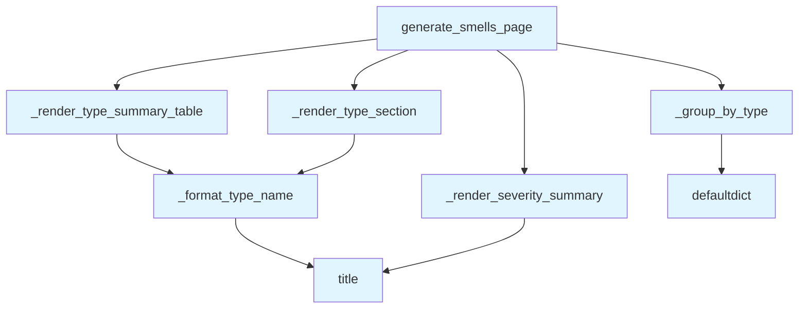

# File: `src/local_deepwiki/generators/analysis/smells_page.py`

## File Overview

This file is responsible for rendering design smells analysis data into a structured, human-readable markdown page. It takes the output of `analyze_design_smells()` and formats it into a wiki-style documentation page that includes a summary by smell type, severity breakdown, and detailed entries for each smell with refactoring suggestions.

The module is purely computational and does not involve any external dependencies, LLM calls, or asynchronous operations. It focuses on transforming structured data into a well-formatted, readable markdown document suitable for documentation or reporting purposes.

## Key Concepts

### 1. **Data Grouping and Ordering**
The module uses `_group_by_type` to organize smells by their type, which allows for consistent rendering and logical grouping. The `_SMELL_TYPE_ORDER` list (not shown but referenced) defines a canonical order for rendering smell types, ensuring consistent presentation.

### 2. **Markdown Generation Strategy**
The rendering is built using a line-by-line approach, appending content to a list of strings and joining them at the end. This approach is efficient and straightforward for generating structured markdown with consistent formatting.

### 3. **Type Name Formatting**
The `_format_type_name` function converts snake_case identifiers (e.g., `god_class`) into readable Title Case (e.g., `God Class`). This improves readability in the final markdown output.

### 4. **Summary Tables**
The module generates two summary tables:
- One showing the count of each smell type.
- One showing the distribution of smells by severity.

This helps users quickly assess the scope and impact of design smells.

## Integration

This module is used by `test_smells_page`, indicating it's part of a test suite that validates the rendering of design smells. It's also closely related to:
- `src/local_deepwiki/handlers/analysis_architecture.py` — likely where `analyze_design_smells()` is called and where this module's output is consumed.
- `src/local_deepwiki/generators/analysis/architecture_compare.py` — may share similar rendering patterns for architectural analysis.
- `src/local_deepwiki/generators/diagrams/dependency_diagram.py` and `sequence_diagram.py` — these are diagram-generating modules, suggesting a shared architecture or data flow in the documentation pipeline.

The function `generate_smells_page` is the primary entry point for transforming raw analysis data into a formatted markdown document, and it integrates with the rest of the analysis pipeline by consuming data from `analyze_design_smells()`.

## Design Notes

### 1. **No External Dependencies**
The module avoids external dependencies and asynchronous operations, making it lightweight and suitable for inclusion in documentation generation workflows.

### 2. **Robustness to Unknown Smell Types**
The rendering logic handles unexpected smell types not in `_SMELL_TYPE_ORDER` by appending them at the end. This ensures that even if new smell types are introduced, they are still rendered without breaking the structure.

### 3. **Consistent Markdown Formatting**
All tables and sections are rendered with consistent formatting:
- Tables use markdown syntax with headers and separators.
- Each section is separated by blank lines for readability.
- Smell details are rendered with consistent column alignment.

### 4. **Graceful Handling of Empty Data**
If `smells_data` is empty or lacks required fields, the function returns `None`, indicating that no meaningful output was generated. This avoids generating malformed or empty markdown documents.

### 5. **No Side Effects**
The module is stateless and does not modify input data. It only reads from the input dictionary and returns a new string, making it safe to use in functional contexts.

## API Reference

### Functions

#### `generate_smells_page`

```python
def generate_smells_page(smells_data: dict) -> str | None
```

Render design smells dict as markdown.


| Parameter | Type | Default | Description |
|-----------|------|---------|-------------|
| `smells_data` | `dict` | - | Dict returned by ``analyze_design_smells()``. |

**Returns:** `str | None`


<details>
<summary>View Source (lines 34-66) | <a href="https://github.com/UrbanDiver/local-deepwiki-mcp/blob/main/src/local_deepwiki/generators/analysis/smells_page.py#L34-L66">GitHub</a></summary>

```python
def generate_smells_page(smells_data: dict) -> str | None:
    """Render design smells dict as markdown.

    Args:
        smells_data: Dict returned by ``analyze_design_smells()``.

    Returns:
        Markdown string, or ``None`` if the data is empty / unusable.
    """
    smells = smells_data.get("smells", [])
    if not smells:
        return None

    lines: list[str] = []
    lines.append("# Design Smells")
    lines.append("")

    summary = smells_data.get("summary", {})
    grouped = _group_by_type(smells)

    _render_type_summary_table(lines, grouped)
    _render_severity_summary(lines, summary)

    for smell_type in _SMELL_TYPE_ORDER:
        if smell_type in grouped:
            _render_type_section(lines, smell_type, grouped[smell_type])

    # Handle any unexpected types not in the ordered list
    for smell_type in sorted(grouped):
        if smell_type not in _SMELL_TYPE_ORDER:
            _render_type_section(lines, smell_type, grouped[smell_type])

    return "\n".join(lines)
```

</details>

## Call Graph



## Used By

Functions and methods in this file and their callers:

- **`_format_type_name`**: called by `_render_type_section`, `_render_type_summary_table`
- **`_group_by_type`**: called by `generate_smells_page`
- **`_render_severity_summary`**: called by `generate_smells_page`
- **`_render_type_section`**: called by `generate_smells_page`
- **`_render_type_summary_table`**: called by `generate_smells_page`
- **`defaultdict`**: called by `_group_by_type`
- **`title`**: called by `_format_type_name`, `_render_severity_summary`

## Usage Examples

*Examples extracted from test files*

### Example: `smells_page`

From `test_smells_page.py::test_returns_markdown_with_title`:

```python
result = generate_smells_page(_make_data())
    assert result is not None
    assert "# Design Smells" in result
```

### Example: `generate_smells_page`

From `test_smells_page.py::test_returns_markdown_with_title`:

```python
result = generate_smells_page(_make_data())
    assert result is not None
    assert "# Design Smells" in result
```

### Example: `generate_smells_page`

From `test_smells_page.py::test_groups_smells_by_type_into_sections`:

```python
smells = [
        _make_smell(smell_type="god_class", entity="BigClass"),
        _make_smell(smell_type="long_method", entity="do_everything"),
        _make_smell(smell_type="long_method", entity="process_all"),
        _make_smell(smell_type="deep_nesting", entity="nested_func"),
    ]
    result = generate_smells_page(_make_data(smells=smells))
    assert result is not None
    assert "## God Class" in result
    assert "## Long Method" in result
    assert "## Deep Nesting" in result
```


## Last Modified

| Entity | Type | Author | Date | Commit |
|--------|------|--------|------|--------|
| `_format_type_name` | function | Brian Breidenbach | 1 week ago | `7f7ae26` feat: add Design Smells wik... |
| `generate_smells_page` | function | Brian Breidenbach | 1 week ago | `7f7ae26` feat: add Design Smells wik... |
| `_group_by_type` | function | Brian Breidenbach | 1 week ago | `7f7ae26` feat: add Design Smells wik... |
| `_render_type_summary_table` | function | Brian Breidenbach | 1 week ago | `7f7ae26` feat: add Design Smells wik... |
| `_render_severity_summary` | function | Brian Breidenbach | 1 week ago | `7f7ae26` feat: add Design Smells wik... |
| `_render_type_section` | function | Brian Breidenbach | 1 week ago | `7f7ae26` feat: add Design Smells wik... |

## Additional Source Code

Source code for functions and methods not listed in the API Reference above.

#### `_format_type_name`

<details>
<summary>View Source (lines 25-31) | <a href="https://github.com/UrbanDiver/local-deepwiki-mcp/blob/main/src/local_deepwiki/generators/analysis/smells_page.py#L25-L31">GitHub</a></summary>

```python
def _format_type_name(raw: str) -> str:
    """Convert a snake_case smell type to Title Case.

    ``"god_class"`` -> ``"God Class"``,
    ``"long_parameter_list"`` -> ``"Long Parameter List"``.
    """
    return raw.replace("_", " ").title()
```

</details>


#### `_group_by_type`

<details>
<summary>View Source (lines 69-74) | <a href="https://github.com/UrbanDiver/local-deepwiki-mcp/blob/main/src/local_deepwiki/generators/analysis/smells_page.py#L69-L74">GitHub</a></summary>

```python
def _group_by_type(smells: list[dict]) -> dict[str, list[dict]]:
    """Group smell dicts by their ``type`` field."""
    grouped: dict[str, list[dict]] = defaultdict(list)
    for smell in smells:
        grouped[smell["type"]].append(smell)
    return dict(grouped)
```

</details>


#### `_render_type_summary_table`

<details>
<summary>View Source (lines 77-96) | <a href="https://github.com/UrbanDiver/local-deepwiki-mcp/blob/main/src/local_deepwiki/generators/analysis/smells_page.py#L77-L96">GitHub</a></summary>

```python
def _render_type_summary_table(
    lines: list[str], grouped: dict[str, list[dict]]
) -> None:
    """Append a summary table showing count per smell type."""
    lines.append("## Summary by Type")
    lines.append("")
    lines.append("| Type | Count |")
    lines.append("|------|-------|")

    for smell_type in _SMELL_TYPE_ORDER:
        if smell_type in grouped:
            lines.append(
                f"| {_format_type_name(smell_type)} | {len(grouped[smell_type])} |"
            )
    for smell_type in sorted(grouped):
        if smell_type not in _SMELL_TYPE_ORDER:
            lines.append(
                f"| {_format_type_name(smell_type)} | {len(grouped[smell_type])} |"
            )
    lines.append("")
```

</details>


#### `_render_severity_summary`

<details>
<summary>View Source (lines 99-114) | <a href="https://github.com/UrbanDiver/local-deepwiki-mcp/blob/main/src/local_deepwiki/generators/analysis/smells_page.py#L99-L114">GitHub</a></summary>

```python
def _render_severity_summary(lines: list[str], summary: dict) -> None:
    """Append severity breakdown."""
    if not summary:
        return

    total = summary.get("total", 0)
    by_severity = summary.get("by_severity", {})

    lines.append("## Severity Summary")
    lines.append("")
    lines.append(f"- **Total smells:** {total}")
    for level in ("high", "medium", "low"):
        count = by_severity.get(level, 0)
        if count > 0:
            lines.append(f"- **{level.title()}:** {count}")
    lines.append("")
```

</details>


#### `_render_type_section`

<details>
<summary>View Source (lines 117-133) | <a href="https://github.com/UrbanDiver/local-deepwiki-mcp/blob/main/src/local_deepwiki/generators/analysis/smells_page.py#L117-L133">GitHub</a></summary>

```python
def _render_type_section(lines: list[str], smell_type: str, smells: list[dict]) -> None:
    """Append a section for a single smell type with a detail table."""
    title = _format_type_name(smell_type)
    lines.append(f"## {title}")
    lines.append("")
    lines.append("| Entity | File | Severity | Description | Suggestion |")
    lines.append("|--------|------|----------|-------------|------------|")
    for s in smells:
        entity = s.get("entity", "")
        file_loc = f"{s.get('file', '')}:{s.get('line', '')}"
        severity = s.get("severity", "")
        description = s.get("description", "")
        suggestion = s.get("suggestion", "")
        lines.append(
            f"| `{entity}` | `{file_loc}` | {severity} | {description} | {suggestion} |"
        )
    lines.append("")
```

</details>

## Relevant Source Files

- `src/local_deepwiki/generators/analysis/smells_page.py:25-31`
