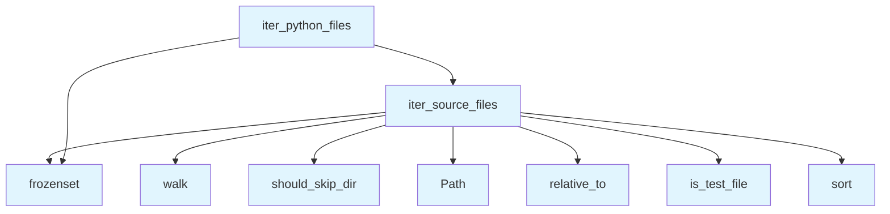

# File: `src/local_deepwiki/generators/analysis/source_filter.py`

## File Overview

This file provides shared utilities for filtering source files during analysis tasks. It centralizes logic for identifying test files, skipping certain directories, and matching file extensions. These utilities are used across various analysis modules to ensure consistent behavior when scanning repositories for source code.

The module is designed to be lightweight and reusable, with no external dependencies beyond standard library and the `EXTENSION_MAP` from `local_deepwiki.core.parser.languages`.

## Key Concepts

### Centralized File Filtering Logic
The core idea is to define a consistent set of rules for filtering source files, which can be reused by multiple analysis tools. This avoids duplication and ensures that all parts of the toolchain apply the same logic when determining which files to process.

### Test File Detection
The function `is_test_file` identifies files that are likely test files based on naming conventions:
- Files starting with `test_`
- Files ending with `_test.py`
- Files named `conftest.py`
- Files located within directories whose names appear in `TEST_DIR_NAMES`

This approach allows for flexible recognition of test files in various project structures.

### Directory Skipping
The `should_skip_dir` function defines a set of heuristics for skipping directories during repository walks:
- Directories starting with a dot (e.g., `.git`, `.venv`)
- Directories listed in `SKIP_DIRS`

This ensures that irrelevant or system-generated directories are not processed during source file discovery.

### Extension Matching
The `iter_source_files` function supports filtering by file extension, defaulting to all tree-sitter supported extensions via `EXTENSION_MAP`. This allows for fine-grained control over which types of files are included in analysis.

## Integration

This module is used by several other components within the `local_deepwiki` codebase:

- **Called by**:
  - `is_test_file`: Used by `path_utils`, `dependency_graph_data`, `generator` and six other modules
  - `should_skip_dir`: Used by `test_source_filter`
  - `iter_source_files`: Used by `test_source_filter`
  - `iter_python_files`: Used by `test_source_filter`

These callers rely on consistent behavior when identifying and skipping files or directories, ensuring uniformity in analysis workflows.

Additionally, this module imports from:
- `local_deepwiki.core.parser.languages`: To access `EXTENSION_MAP`, which defines supported file extensions for tree-sitter parsing

This integration ensures that the filtering logic aligns with the parser's capabilities.

## Design Notes

### Reusability and Consistency
By centralizing filtering logic, this module promotes reuse and consistency across different analysis tools. This design choice reduces the chance of divergent behavior in how files are processed.

### Handling of Relative Paths
The functions work with `Path` objects and compute relative paths using `relative_to()`. This allows for accurate identification of file locations relative to the repository root, which is essential for proper filtering and reporting.

### Extension Filtering
The `iter_source_files` function supports optional extension filtering, allowing downstream code to restrict processing to specific file types (e.g., Python files only). This is implemented using `frozenset` for performance and immutability.

### Exclusion of Test Files
The default behavior of `iter_source_files` is to exclude test files, but this can be overridden. This default is chosen to align with typical analysis workflows where test code is often excluded from documentation or dependency graphs.

### Edge Cases
- The function handles cases where a file path cannot be made relative to the repository root (e.g., if the file is outside the repo). In such cases, it silently skips the file.
- Directory filtering uses in-place modification (`dirs[:] = [...]`) to avoid descending into unwanted directories during `os.walk`.

This design ensures that performance is not impacted by unnecessary traversal of irrelevant directories.

## API Reference

### Functions

#### `is_test_file`

```python
def is_test_file(rel_path: Path) -> bool
```

Return True if *rel_path* looks like a test file.


| Parameter | Type | Default | Description |
|-----------|------|---------|-------------|
| `rel_path` | `Path` | - | - |

**Returns:** `bool`


<details>
<summary>View Source (lines 47-52) | <a href="https://github.com/UrbanDiver/local-deepwiki-mcp/blob/main/src/local_deepwiki/generators/analysis/source_filter.py#L47-L52">GitHub</a></summary>

```python
def is_test_file(rel_path: Path) -> bool:
    """Return True if *rel_path* looks like a test file."""
    name = rel_path.name
    if name.startswith("test_") or name.endswith("_test.py") or name == "conftest.py":
        return True
    return any(part in TEST_DIR_NAMES for part in rel_path.parts)
```

</details>

#### `should_skip_dir`

```python
def should_skip_dir(dirname: str) -> bool
```

Return True if *dirname* should be skipped during source scanning.


| Parameter | Type | Default | Description |
|-----------|------|---------|-------------|
| `dirname` | `str` | - | - |

**Returns:** `bool`


<details>
<summary>View Source (lines 55-57) | <a href="https://github.com/UrbanDiver/local-deepwiki-mcp/blob/main/src/local_deepwiki/generators/analysis/source_filter.py#L55-L57">GitHub</a></summary>

```python
def should_skip_dir(dirname: str) -> bool:
    """Return True if *dirname* should be skipped during source scanning."""
    return dirname.startswith(".") or dirname in SKIP_DIRS
```

</details>

#### `iter_source_files`

```python
def iter_source_files(repo_path: Path, exclude_tests: bool = True, extensions: frozenset[str] | None = None) -> list[tuple[Path, Path]]
```

Walk *repo_path* and return (full_path, rel_path) pairs for source files.


| Parameter | Type | Default | Description |
|-----------|------|---------|-------------|
| `repo_path` | `Path` | - | Root of the repository. |
| `exclude_tests` | `bool` | `True` | Skip test files when True. |
| `extensions` | `frozenset[str] | None` | `None` | File extensions to include (default: all tree-sitter supported). |

**Returns:** `list[tuple[Path, Path]]`


<details>
<summary>View Source (lines 60-95) | <a href="https://github.com/UrbanDiver/local-deepwiki-mcp/blob/main/src/local_deepwiki/generators/analysis/source_filter.py#L60-L95">GitHub</a></summary>

```python
def iter_source_files(
    repo_path: Path,
    *,
    exclude_tests: bool = True,
    extensions: frozenset[str] | None = None,
) -> list[tuple[Path, Path]]:
    """Walk *repo_path* and return (full_path, rel_path) pairs for source files.

    Args:
        repo_path: Root of the repository.
        exclude_tests: Skip test files when True.
        extensions: File extensions to include (default: all tree-sitter supported).

    Returns:
        List of (absolute_path, relative_path) tuples, sorted by relative path.
    """
    if extensions is None:
        extensions = frozenset(EXTENSION_MAP.keys())

    results: list[tuple[Path, Path]] = []
    for root, dirs, files in os.walk(repo_path):
        dirs[:] = [d for d in dirs if not should_skip_dir(d)]
        for fname in files:
            full_path = Path(root) / fname
            if full_path.suffix not in extensions:
                continue
            try:
                rel_path = full_path.relative_to(repo_path)
            except ValueError:
                continue
            if exclude_tests and is_test_file(rel_path):
                continue
            results.append((full_path, rel_path))

    results.sort(key=lambda pair: pair[1])
    return results
```

</details>

#### `iter_python_files`

```python
def iter_python_files(repo_path: Path, exclude_tests: bool = False) -> list[tuple[Path, Path]]
```

Walk *repo_path* and return (full_path, rel_path) for .py files only.


| Parameter | Type | Default | Description |
|-----------|------|---------|-------------|
| `repo_path` | `Path` | - | - |
| `exclude_tests` | `bool` | `False` | - |

**Returns:** `list[tuple[Path, Path]]`


<details>
<summary>View Source (lines 98-108) | <a href="https://github.com/UrbanDiver/local-deepwiki-mcp/blob/main/src/local_deepwiki/generators/analysis/source_filter.py#L98-L108">GitHub</a></summary>

```python
def iter_python_files(
    repo_path: Path,
    *,
    exclude_tests: bool = False,
) -> list[tuple[Path, Path]]:
    """Walk *repo_path* and return (full_path, rel_path) for .py files only."""
    return iter_source_files(
        repo_path,
        exclude_tests=exclude_tests,
        extensions=frozenset({".py"}),
    )
```

</details>

## Call Graph



## Used By

Functions and methods in this file and their callers:

- **`Path`**: called by `iter_source_files`
- **`frozenset`**: called by `iter_python_files`, `iter_source_files`
- **`is_test_file`**: called by `iter_source_files`
- **`iter_source_files`**: called by `iter_python_files`
- **`relative_to`**: called by `iter_source_files`
- **`should_skip_dir`**: called by `iter_source_files`
- **`sort`**: called by `iter_source_files`
- **`walk`**: called by `iter_source_files`

## Usage Examples

*Examples extracted from test files*

### Example: `is_test_file`

From `test_source_filter.py::test_is_test_file_by_prefix`:

```python
assert is_test_file(Path("test_foo.py"))
```

### Example: `is_test_file`

From `test_source_filter.py::test_is_test_file_by_suffix`:

```python
assert is_test_file(Path("foo_test.py"))
```

### Example: `should_skip_dir`

From `test_source_filter.py::test_should_skip_dir_hidden_git`:

```python
assert should_skip_dir(".git")
```

### Example: `should_skip_dir`

From `test_source_filter.py::test_should_skip_dir_hidden_venv`:

```python
assert should_skip_dir(".venv")
```

### Example: `iter_source_files`

From `test_source_filter.py::test_iter_source_files_excludes_tests_by_default`:

```python
results = iter_source_files(
    tmp_path, exclude_tests=True, extensions=frozenset({".py"})
)
rel_paths = [r[1] for r in results]
assert Path("src/main.py") in rel_paths
assert not any("test" in str(p) for p in rel_paths)
```


## Last Modified

| Entity | Type | Author | Date | Commit |
|--------|------|--------|------|--------|
| `is_test_file` | function | Brian Breidenbach | 1 week ago | `c9f0d4d` refactor: extract source_fi... |
| `should_skip_dir` | function | Brian Breidenbach | 1 week ago | `c9f0d4d` refactor: extract source_fi... |
| `iter_source_files` | function | Brian Breidenbach | 1 week ago | `c9f0d4d` refactor: extract source_fi... |
| `iter_python_files` | function | Brian Breidenbach | 1 week ago | `c9f0d4d` refactor: extract source_fi... |

## Relevant Source Files

- `src/local_deepwiki/generators/analysis/source_filter.py:47-52`
