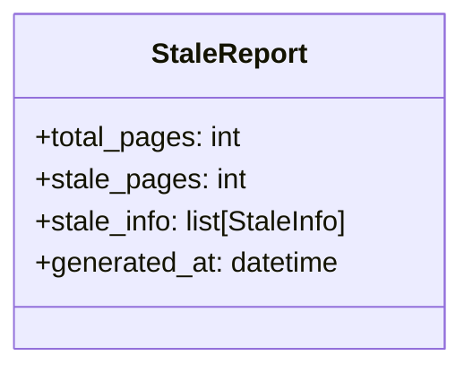
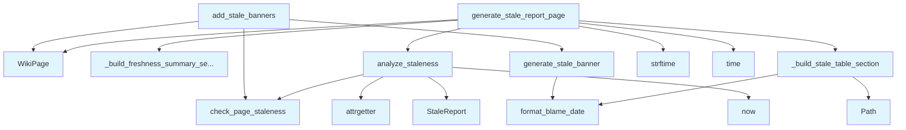

# File: `src/local_deepwiki/generators/analysis/stale_detection.py`

## File Overview

This module provides functionality to detect and report stale documentation within a wiki generated from a codebase. It identifies wiki pages that may be outdated compared to their source code by comparing the last modification dates of source files against the documentation generation timestamps. This helps maintainers prioritize documentation updates.

The module is responsible for analyzing staleness across all relevant wiki pages, generating a summary report, and optionally adding warning banners to individual pages that are identified as stale.

## Key Concepts

### Staleness Detection Logic
The core algorithm relies on comparing the modification times of source files with the time a wiki page was generated. This is implemented via the [`check_page_staleness`](../../core/git_utils.md) function from `local_deepwiki.core.git_utils`, which returns a [`StaleInfo`](../../core/git_utils.md) object when a page is deemed stale.

### Report Generation
Two key report components are built:
1. A **freshness summary section**, which provides an overview of how many pages are stale.
2. A **stale table section**, which lists each stale page with details such as days stale, last documentation update, and source modification date.

### Banner Insertion
The `add_stale_banners` function allows for injecting warning banners directly into wiki pages that are identified as stale, making it easy for readers to see at a glance that the documentation may be outdated.

## Integration

This module integrates with the broader `local_deepwiki` codebase by leveraging:
- [`local_deepwiki.core.git_blame.format_blame_date`](../../core/git_blame.md): For consistent date formatting in reports.
- [`local_deepwiki.core.git_utils.check_page_staleness`](../../core/git_utils.md): Core staleness checking logic.
- [`local_deepwiki.models.WikiGenerationStatus`](../../models/wiki.md) and [`WikiPage`](../../export/streaming.md): Data models for representing wiki state and pages.

It is used by:
- `generator_service`: Calls `analyze_staleness` to perform staleness checks during generation.
- `test_stale_detection`: Uses `StaleReport`, `analyze_staleness`, `generate_stale_report_page`, and `generate_stale_banner` for testing.

## Design Notes

### Filtering Non-File Pages
The `analyze_staleness` function explicitly skips pages that do not start with `"files/"`, ensuring only documentation for actual source code files is considered. This aligns with the project's structure where non-file pages (like overview or architecture documents) are excluded from staleness analysis.

### Sorting Stale Pages
Stale pages are sorted by `days_stale` in descending order. This prioritizes the most outdated documentation for attention, which is a sensible default for maintenance workflows.

### Threshold Configuration
Both `analyze_staleness` and `add_stale_banners` accept a `stale_threshold_days` parameter. This allows flexibility in how strict the staleness detection is, supporting different use cases such as:
- A zero threshold to flag all changes.
- A higher threshold to only warn about significant staleness.

### Banner Formatting
The `generate_stale_banner` function returns a Markdown-formatted warning that includes:
- A clear warning icon (`⚠️`)
- The source modification date
- The number of days since documentation was generated
- A recommendation to re-index

This format is chosen to be visually prominent and actionable, encouraging maintainers to act on stale documentation.

### Time Handling
The module uses `datetime.now()` for generating the report timestamp and `time.time()` for `WikiPage.generated_at`. This reflects a pragmatic approach to time handling, using appropriate functions for each context (datetime for human-readable reports, time for internal tracking).

## API Reference

### class `StaleReport`

Summary of stale documentation analysis.

---


<details>
<summary>View Source (lines 21-27) | <a href="https://github.com/UrbanDiver/local-deepwiki-mcp/blob/main/src/local_deepwiki/generators/analysis/stale_detection.py#L21-L27">GitHub</a></summary>

```python
class StaleReport:
    """Summary of stale documentation analysis."""

    total_pages: int
    stale_pages: int
    stale_info: list[StaleInfo]
    generated_at: datetime
```

</details>

### Functions

#### `analyze_staleness`

```python
def analyze_staleness(repo_path: Path, wiki_status: WikiGenerationStatus, stale_threshold_days: int = 0) -> StaleReport
```

Analyze all wiki pages for staleness.


| Parameter | Type | Default | Description |
|-----------|------|---------|-------------|
| `repo_path` | `Path` | - | Path to the repository root. |
| `wiki_status` | `WikiGenerationStatus` | - | Wiki generation status with page info. |
| `stale_threshold_days` | `int` | `0` | Minimum days to consider a page stale. |

**Returns:** `StaleReport`


<details>
<summary>View Source (lines 30-71) | <a href="https://github.com/UrbanDiver/local-deepwiki-mcp/blob/main/src/local_deepwiki/generators/analysis/stale_detection.py#L30-L71">GitHub</a></summary>

```python
def analyze_staleness(
    repo_path: Path,
    wiki_status: WikiGenerationStatus,
    stale_threshold_days: int = 0,
) -> StaleReport:
    """Analyze all wiki pages for staleness.

    Args:
        repo_path: Path to the repository root.
        wiki_status: Wiki generation status with page info.
        stale_threshold_days: Minimum days to consider a page stale.

    Returns:
        StaleReport with analysis results.
    """
    stale_info: list[StaleInfo] = []

    for page_path, page_status in wiki_status.pages.items():
        # Skip non-file pages (overview, architecture, etc.)
        if not page_path.startswith("files/"):
            continue

        info = check_page_staleness(
            repo_path=repo_path,
            page_path=page_path,
            generated_at=page_status.generated_at,
            source_files=page_status.source_files,
            stale_threshold_days=stale_threshold_days,
        )

        if info:
            stale_info.append(info)

    # Sort by days stale (most stale first)
    stale_info = sorted(stale_info, key=attrgetter("days_stale"), reverse=True)

    return StaleReport(
        total_pages=len([p for p in wiki_status.pages if p.startswith("files/")]),
        stale_pages=len(stale_info),
        stale_info=stale_info,
        generated_at=datetime.now(),
    )
```

</details>

#### `generate_stale_report_page`

```python
def generate_stale_report_page(repo_path: Path, wiki_status: WikiGenerationStatus, stale_threshold_days: int = 0) -> WikiPage
```

Generate a wiki page reporting potentially stale documentation.


| Parameter | Type | Default | Description |
|-----------|------|---------|-------------|
| `repo_path` | `Path` | - | Path to the repository root. |
| `wiki_status` | `WikiGenerationStatus` | - | Wiki generation status with page info. |
| `stale_threshold_days` | `int` | `0` | Minimum days to consider a page stale. |

**Returns:** [`WikiPage`](../../export/streaming.md)


<details>
<summary>View Source (lines 124-172) | <a href="https://github.com/UrbanDiver/local-deepwiki-mcp/blob/main/src/local_deepwiki/generators/analysis/stale_detection.py#L124-L172">GitHub</a></summary>

```python
def generate_stale_report_page(
    repo_path: Path,
    wiki_status: WikiGenerationStatus,
    stale_threshold_days: int = 0,
) -> WikiPage:
    """Generate a wiki page reporting potentially stale documentation.

    Args:
        repo_path: Path to the repository root.
        wiki_status: Wiki generation status with page info.
        stale_threshold_days: Minimum days to consider a page stale.

    Returns:
        WikiPage with the stale documentation report.
    """
    report = analyze_staleness(repo_path, wiki_status, stale_threshold_days)

    lines: list[str] = [
        "# Documentation Freshness Report",
        "",
        "This page identifies documentation that may be outdated compared to the source code.",
        "Pages are flagged when source files have been modified after the documentation was generated.",
        "",
    ]

    lines.extend(_build_freshness_summary_section(report))
    lines.extend(_build_stale_table_section(report))

    lines.extend(
        [
            "## Recommendations",
            "",
            "To refresh stale documentation:",
            "",
            "1. **Re-index the repository** with `force=True` to regenerate all pages",
            "2. **Incremental update** will automatically regenerate pages when source files change",
            "3. **Manual review** may be needed for pages where only comments or docstrings changed",
            "",
            "---",
            f"*Report generated: {report.generated_at.strftime('%Y-%m-%d %H:%M:%S')}*",
        ]
    )

    return WikiPage(
        path="freshness.md",
        title="Documentation Freshness",
        content="\n".join(lines),
        generated_at=time.time(),
    )
```

</details>

#### `generate_stale_banner`

```python
def generate_stale_banner(stale_info: StaleInfo) -> str
```

Generate a warning banner for a stale page.


| Parameter | Type | Default | Description |
|-----------|------|---------|-------------|
| `stale_info` | `StaleInfo` | - | Staleness information for the page. |

**Returns:** `str`


<details>
<summary>View Source (lines 175-191) | <a href="https://github.com/UrbanDiver/local-deepwiki-mcp/blob/main/src/local_deepwiki/generators/analysis/stale_detection.py#L175-L191">GitHub</a></summary>

```python
def generate_stale_banner(stale_info: StaleInfo) -> str:
    """Generate a warning banner for a stale page.

    Args:
        stale_info: Staleness information for the page.

    Returns:
        Markdown banner string to prepend to the page.
    """
    source_date = format_blame_date(stale_info.newest_source_date)

    return f"""> ⚠️ **Documentation may be outdated**
>
> Source code was modified {source_date} ({stale_info.days_stale} days after this documentation was generated).
> Consider re-indexing to update this page.

"""
```

</details>

#### `add_stale_banners`

```python
def add_stale_banners(pages: list[WikiPage], repo_path: Path, wiki_status: WikiGenerationStatus, stale_threshold_days: int = 1) -> list[WikiPage]
```

Add stale warning banners to pages with outdated documentation.


| Parameter | Type | Default | Description |
|-----------|------|---------|-------------|
| `pages` | `list[WikiPage]` | - | List of wiki pages to process. |
| `repo_path` | `Path` | - | Path to the repository root. |
| `wiki_status` | `WikiGenerationStatus` | - | Wiki generation status with page info. |
| `stale_threshold_days` | `int` | `1` | Minimum days to show a banner (default: 1). |

**Returns:** `list[WikiPage]`


<details>
<summary>View Source (lines 194-239) | <a href="https://github.com/UrbanDiver/local-deepwiki-mcp/blob/main/src/local_deepwiki/generators/analysis/stale_detection.py#L194-L239">GitHub</a></summary>

```python
def add_stale_banners(
    pages: list[WikiPage],
    repo_path: Path,
    wiki_status: WikiGenerationStatus,
    stale_threshold_days: int = 1,
) -> list[WikiPage]:
    """Add stale warning banners to pages with outdated documentation.

    Args:
        pages: List of wiki pages to process.
        repo_path: Path to the repository root.
        wiki_status: Wiki generation status with page info.
        stale_threshold_days: Minimum days to show a banner (default: 1).

    Returns:
        List of wiki pages with banners added where appropriate.
    """
    updated_pages: list[WikiPage] = []

    for page in pages:
        page_status = wiki_status.pages.get(page.path)

        if page_status and page.path.startswith("files/"):
            stale_info = check_page_staleness(
                repo_path=repo_path,
                page_path=page.path,
                generated_at=page_status.generated_at,
                source_files=page_status.source_files,
                stale_threshold_days=stale_threshold_days,
            )

            if stale_info:
                banner = generate_stale_banner(stale_info)
                updated_pages.append(
                    WikiPage(
                        path=page.path,
                        title=page.title,
                        content=banner + page.content,
                        generated_at=page.generated_at,
                    )
                )
                continue

        updated_pages.append(page)

    return updated_pages
```

</details>

## Class Diagram



## Call Graph



## Used By

Functions and methods in this file and their callers:

- **`Path`**: called by `_build_stale_table_section`
- **`StaleReport`**: called by `analyze_staleness`
- **[`WikiPage`](../../export/streaming.md)**: called by `add_stale_banners`, `generate_stale_report_page`
- **`_build_freshness_summary_section`**: called by `generate_stale_report_page`
- **`_build_stale_table_section`**: called by `generate_stale_report_page`
- **`analyze_staleness`**: called by `generate_stale_report_page`
- **`attrgetter`**: called by `analyze_staleness`
- **[`check_page_staleness`](../../core/git_utils.md)**: called by `add_stale_banners`, `analyze_staleness`
- **[`format_blame_date`](../../core/git_blame.md)**: called by `_build_stale_table_section`, `generate_stale_banner`
- **`generate_stale_banner`**: called by `add_stale_banners`
- **`now`**: called by `analyze_staleness`
- **`strftime`**: called by `generate_stale_report_page`
- **`time`**: called by `generate_stale_report_page`

## Usage Examples

*Examples extracted from test files*

### Test returns a StaleReport with correct counts

From `test_stale_detection.py::TestAnalyzeStaleness::test_returns_report_with_counts`:

```python
assert isinstance(result, StaleReport)
assert result.total_pages == 1  # Only files/ pages are counted
```

### Test returns a StaleReport with correct counts

From `test_stale_detection.py::TestAnalyzeStaleness::test_returns_report_with_counts`:

```python
result = analyze_staleness(tmp_path, wiki_status)

assert isinstance(result, StaleReport)
assert result.total_pages == 1  # Only files/ pages are counted
```

### Test generates a valid WikiPage

From `test_stale_detection.py::TestGenerateStaleReportPage::test_generates_wiki_page`:

```python
wiki_status = WikiGenerationStatus(
    repo_path=str(tmp_path),
    generated_at=time.time(),
    total_pages=1,
    pages={
        "files/test.md": WikiPageStatus(
            path="files/test.md",
            source_files=["test.py"],
            source_hashes={"test.py": "abc123"},
            content_hash="xyz789",
            generated_at=time.time(),
        ),
    },
)

result = generate_stale_report_page(tmp_path, wiki_status)

assert isinstance(result, WikiPage)
assert result.path == "freshness.md"
assert result.title == "Documentation Freshness"
assert "Documentation Freshness Report" in result.content
```

### Test shows success message when all docs are current

From `test_stale_detection.py::TestGenerateStaleReportPage::test_shows_all_up_to_date_when_no_stale`:

```python
wiki_status = WikiGenerationStatus(
    repo_path=str(tmp_path),
    generated_at=time.time(),
    total_pages=0,
    pages={},
)

result = generate_stale_report_page(tmp_path, wiki_status)

assert "All Documentation Up to Date" in result.content
```

### Test generates a markdown warning banner

From `test_stale_detection.py::TestGenerateStaleBanner::test_generates_warning_banner`:

```python
stale_info = StaleInfo(
    page_path="files/test.md",
    generated_at=datetime.now() - timedelta(days=5),
    source_files=["test.py"],
    newest_source_date=datetime.now(),
    days_stale=5,
)

result = generate_stale_banner(stale_info)

assert "⚠️" in result
assert "outdated" in result.lower()
assert "5 days" in result
```


## Last Modified

| Entity | Type | Author | Date | Commit |
|--------|------|--------|------|--------|
| `_build_freshness_summary_section` | function | Brian Breidenbach | 2 days ago | `29ae780` refactor: decompose long me... |
| `_build_stale_table_section` | function | Brian Breidenbach | 2 days ago | `29ae780` refactor: decompose long me... |
| `generate_stale_report_page` | function | Brian Breidenbach | 2 days ago | `29ae780` refactor: decompose long me... |
| `analyze_staleness` | function | Brian Breidenbach | Feb 21, 2026 | `e45a53a` refactor: apply Pythonic id... |
| `add_stale_banners` | function | Brian Breidenbach | Feb 09, 2026 | `a6cd172` chore: remove unused logger... |
| `StaleReport` | class | Brian Breidenbach | Jan 16, 2026 | `59bad6c` Add stale documentation det... |
| `generate_stale_banner` | function | Brian Breidenbach | Jan 16, 2026 | `59bad6c` Add stale documentation det... |

## Additional Source Code

Source code for functions and methods not listed in the API Reference above.

#### `_build_freshness_summary_section`

<details>
<summary>View Source (lines 74-98) | <a href="https://github.com/UrbanDiver/local-deepwiki-mcp/blob/main/src/local_deepwiki/generators/analysis/stale_detection.py#L74-L98">GitHub</a></summary>

```python
def _build_freshness_summary_section(report: StaleReport) -> list[str]:
    """Build the summary section lines for the freshness report."""
    if report.stale_pages == 0:
        return [
            "## ✅ All Documentation Up to Date",
            "",
            f"All {report.total_pages} file documentation pages are current with their source code.",
            "",
        ]
    freshness_pct = (
        ((report.total_pages - report.stale_pages) / report.total_pages * 100)
        if report.total_pages > 0
        else 100
    )
    return [
        "## Summary",
        "",
        "| Metric | Value |",
        "|--------|-------|",
        f"| Total file pages | {report.total_pages} |",
        f"| Potentially stale | {report.stale_pages} |",
        f"| Up to date | {report.total_pages - report.stale_pages} |",
        f"| Freshness | {freshness_pct:.0f}% |",
        "",
    ]
```

</details>


#### `_build_stale_table_section`

<details>
<summary>View Source (lines 101-121) | <a href="https://github.com/UrbanDiver/local-deepwiki-mcp/blob/main/src/local_deepwiki/generators/analysis/stale_detection.py#L101-L121">GitHub</a></summary>

```python
def _build_stale_table_section(report: StaleReport) -> list[str]:
    """Build the stale pages table section lines (empty list if nothing is stale)."""
    if report.stale_pages == 0:
        return []
    lines: list[str] = [
        "## ⚠️ Potentially Stale Documentation",
        "",
        "The following pages may need review. Source files were modified after documentation was generated.",
        "",
        "| Page | Days Stale | Last Doc Update | Source Modified |",
        "|------|------------|-----------------|-----------------|",
    ]
    for info in report.stale_info:
        page_link = f"[{Path(info.page_path).stem}]({info.page_path})"
        doc_date = format_blame_date(info.generated_at)
        source_date = format_blame_date(info.newest_source_date)
        lines.append(
            f"| {page_link} | {info.days_stale} | {doc_date} | {source_date} |"
        )
    lines.append("")
    return lines
```

</details>

## Relevant Source Files

- `src/local_deepwiki/generators/analysis/stale_detection.py:21-27`
