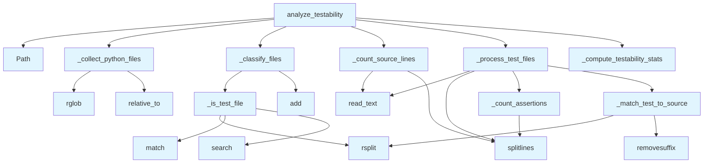

# File: `src/local_deepwiki/generators/analysis/testability.py`

## File Overview

This file implements a testability analysis system for Python repositories. It computes metrics such as test-to-code ratio, identifies untested source files, and estimates assertion density within test files. The system uses file naming conventions and directory structure to classify and match test files to their corresponding source files, without relying on any external LLMs or runtime code execution.

The module is designed to be lightweight and purely computational, focusing on static analysis of file structure and content to derive meaningful testability insights.

## Key Concepts

### File Classification Heuristics
The system classifies Python files into test or source using heuristics based on:
- File name patterns: `test_*.py`, `*_test.py`, `*_spec.py`
- Directory path patterns: `/tests/`, `/test/`, `/__tests__/`

This approach is chosen for its simplicity and robustness in identifying test files in typical Python project layouts.

### Test-to-Source Matching
To compute test coverage, the system attempts to map each test file to its likely source file by:
- Removing prefixes like `test_`
- Removing suffixes like `_test` or `_spec`
- Searching for matching `.py` files in the source directory tree

This mapping is heuristic and works well for standard naming conventions but may fail for complex or non-standard setups.

### Assertion Counting
Assertions are counted using a simple line-based approach that detects:
- Lines starting with `assert ` or `assert(`
- Lines containing `.assert` (e.g., `self.assertEqual`, `assertTrue`)

This method is fast and works with common Python testing frameworks like pytest and unittest.

### Statistics Aggregation
The system aggregates statistics such as:
- Total lines of source and test code
- Ratio of test lines to source lines
- Average number of assertions per test file
- Number and percentage of untested files

These metrics are useful for assessing code quality and test coverage.

## Integration

This module is part of the `local_deepwiki.generators.analysis` family of analysis tools and is used by the `test_testability` module to perform testability analysis on repositories. It is also called by several shared test handling components, indicating its role as a foundational utility for test-related metrics in the codebase.

The module imports from:
- `re` for regular expression matching
- `pathlib.Path` for path manipulation
- `typing.Any` for flexible type annotations
- [`local_deepwiki.logging.get_logger`](../../logging.md) for logging

The functions in this module are designed to be composable and reusable across different analysis tasks, with `analyze_testability` being the main entry point that orchestrates the entire workflow.

## Design Notes

### File Exclusion Logic
The `_collect_python_files` function excludes hidden directories and common non-source directories (`node_modules`, `__pycache__`) to avoid including irrelevant or generated files in the analysis. This ensures that only meaningful source and test files are processed.

### Error Handling
The system gracefully handles file read errors (e.g., permission denied, encoding issues) by using `try...except OSError` blocks, allowing the analysis to continue even if some files cannot be read.

### Ratio Computation
The test-to-code ratio is computed as `test_lines / source_lines`. If there are no source lines, it defaults to 0 to avoid division by zero errors.

### Statistics Precision
Floating-point results like ratios and percentages are rounded to appropriate decimal places for readability and consistency:
- Ratio: 4 decimal places
- Percentage: 1 decimal place
- Average assertions: 2 decimal places

### No Runtime Dependencies
The module avoids runtime code execution or introspection, relying solely on static file analysis. This makes it fast and safe to run on any Python repository, regardless of the presence of specific testing frameworks or runtime dependencies.

This design choice aligns with the project's emphasis on lightweight, static analysis for generating documentation and insights.

## API Reference

### Functions

#### `analyze_testability`

```python
def analyze_testability(repo_path: Path | str, exclude_patterns: list[str] | None = None) -> dict[str, Any]
```

Analyze testability metrics for a repository.  Walks all Python files, classifies them as test or source, computes test-to-code ratio, matches test files to source, counts assertions, and identifies untested modules.


| Parameter | Type | Default | Description |
|-----------|------|---------|-------------|
| `repo_path` | `Path | str` | - | Repository root directory. |
| `exclude_patterns` | `list[str] | None` | `None` | Optional glob patterns to exclude. |

**Returns:** `dict[str, Any]`


<details>
<summary>View Source (lines 205-253) | <a href="https://github.com/UrbanDiver/local-deepwiki-mcp/blob/main/src/local_deepwiki/generators/analysis/testability.py#L205-L253">GitHub</a></summary>

```python
def analyze_testability(
    repo_path: Path | str,
    *,
    exclude_patterns: list[str] | None = None,
) -> dict[str, Any]:
    """Analyze testability metrics for a repository.

    Walks all Python files, classifies them as test or source, computes
    test-to-code ratio, matches test files to source, counts assertions,
    and identifies untested modules.

    Args:
        repo_path: Repository root directory.
        exclude_patterns: Optional glob patterns to exclude.

    Returns:
        Dict with status, test_files, untested_files, and stats.
    """
    repo_path = Path(repo_path)

    source_files_set: set[str] = set()
    all_py = _collect_python_files(repo_path)
    test_paths, source_paths = _classify_files(all_py, source_files_set)
    source_lines = _count_source_lines(source_paths)
    test_files, test_lines, total_assertions = _process_test_files(test_paths, source_files_set)
    untested_files, stats = _compute_testability_stats(
        source_paths,
        test_paths,
        test_files,
        source_lines,
        test_lines,
        total_assertions,
        source_files_set,
    )

    logger.info(
        "Testability: %d test files, %d source files, ratio=%.2f in %s",
        len(test_paths),
        len(source_paths),
        stats["test_to_code_ratio"],
        repo_path,
    )

    return {
        "status": "success",
        "test_files": test_files,
        "untested_files": untested_files,
        "stats": stats,
    }
```

</details>

## Call Graph



## Used By

Functions and methods in this file and their callers:

- **`Path`**: called by `analyze_testability`
- **`_classify_files`**: called by `analyze_testability`
- **`_collect_python_files`**: called by `analyze_testability`
- **`_compute_testability_stats`**: called by `analyze_testability`
- **`_count_assertions`**: called by `_process_test_files`
- **`_count_source_lines`**: called by `analyze_testability`
- **`_is_test_file`**: called by `_classify_files`
- **`_match_test_to_source`**: called by `_process_test_files`
- **`_process_test_files`**: called by `analyze_testability`
- **`add`**: called by `_classify_files`
- **`match`**: called by `_is_test_file`
- **`read_text`**: called by `_count_source_lines`, `_process_test_files`
- **`relative_to`**: called by `_collect_python_files`
- **`removesuffix`**: called by `_match_test_to_source`
- **`rglob`**: called by `_collect_python_files`
- **`rsplit`**: called by `_is_test_file`, `_match_test_to_source`
- **`search`**: called by `_is_test_file`
- **`splitlines`**: called by `_count_assertions`, `_count_source_lines`, `_process_test_files`

## Usage Examples

*Examples extracted from test files*

### Example: `testability`

From `test_testability.py::test_is_test_file_test_prefix`:

```python
from local_deepwiki.generators.analysis.testability import _is_test_file

    assert _is_test_file("test_foo.py") is True
```

### Example: `_is_test_file`

From `test_testability.py::test_is_test_file_test_prefix`:

```python
from local_deepwiki.generators.analysis.testability import _is_test_file

    assert _is_test_file("test_foo.py") is True
```

### Example: `_is_test_file`

From `test_testability.py::test_is_test_file_test_suffix`:

```python
from local_deepwiki.generators.analysis.testability import _is_test_file

    assert _is_test_file("foo_test.py") is True
```

### Example: `_count_assertions`

From `test_testability.py::test_count_assertions_assert_keyword`:

```python
from local_deepwiki.generators.analysis.testability import _count_assertions

    content = "assert x == 1\nassert y > 2\n"
    assert _count_assertions(content) == 2
```

### Example: `_count_assertions`

From `test_testability.py::test_count_assertions_assert_paren`:

```python
from local_deepwiki.generators.analysis.testability import _count_assertions

    content = "assert(x == 1)\n"
    assert _count_assertions(content) == 1
```


## Last Modified

| Entity | Type | Author | Date | Commit |
|--------|------|--------|------|--------|
| `_collect_python_files` | function | Brian Breidenbach | today | `a75af5c` refactor: extract helpers f... |
| `_classify_files` | function | Brian Breidenbach | today | `a75af5c` refactor: extract helpers f... |
| `_count_source_lines` | function | Brian Breidenbach | today | `a75af5c` refactor: extract helpers f... |
| `_process_test_files` | function | Brian Breidenbach | today | `a75af5c` refactor: extract helpers f... |
| `_compute_testability_stats` | function | Brian Breidenbach | today | `a75af5c` refactor: extract helpers f... |
| `analyze_testability` | function | Brian Breidenbach | today | `a75af5c` refactor: extract helpers f... |
| `_is_test_file` | function | Brian Breidenbach | today | `6d8243f` feat: add testability-based... |
| `_match_test_to_source` | function | Brian Breidenbach | today | `6d8243f` feat: add testability-based... |
| `_count_assertions` | function | Brian Breidenbach | today | `6d8243f` feat: add testability-based... |

## Additional Source Code

Source code for functions and methods not listed in the API Reference above.

#### `_is_test_file`

<details>
<summary>View Source (lines 21-32) | <a href="https://github.com/UrbanDiver/local-deepwiki-mcp/blob/main/src/local_deepwiki/generators/analysis/testability.py#L21-L32">GitHub</a></summary>

```python
def _is_test_file(rel_path: str) -> bool:
    """Return True if a relative path looks like a test file.

    Matches filenames like ``test_*.py``, ``*_test.py``, ``*_spec.py``
    or paths containing ``/tests/``, ``/test/``, or ``/__tests__/``.
    """
    filename = rel_path.rsplit("/", 1)[-1] if "/" in rel_path else rel_path
    if _TEST_FILE_RE.match(filename):
        return True
    if _TEST_DIR_RE.search(rel_path):
        return True
    return False
```

</details>


#### `_match_test_to_source`

<details>
<summary>View Source (lines 35-63) | <a href="https://github.com/UrbanDiver/local-deepwiki-mcp/blob/main/src/local_deepwiki/generators/analysis/testability.py#L35-L63">GitHub</a></summary>

```python
def _match_test_to_source(
    test_path: str,
    source_files: set[str],
) -> str | None:
    """Heuristic matching: map a test file to its likely source file.

    Given ``tests/test_foo.py``, look for ``src/**/foo.py`` in *source_files*.
    Tries stripping ``test_`` prefix and ``_test`` / ``_spec`` suffix from the
    filename stem.
    """
    filename = test_path.rsplit("/", 1)[-1] if "/" in test_path else test_path
    stem = filename.removesuffix(".py")

    # Build candidate stems
    candidates: list[str] = []
    if stem.startswith("test_"):
        candidates.append(stem[5:])
    if stem.endswith("_test"):
        candidates.append(stem[:-5])
    if stem.endswith("_spec"):
        candidates.append(stem[:-5])

    for candidate in candidates:
        target = f"{candidate}.py"
        for src in source_files:
            if src.endswith(f"/{target}") or src == target:
                return src

    return None
```

</details>


#### `_count_assertions`

<details>
<summary>View Source (lines 66-81) | <a href="https://github.com/UrbanDiver/local-deepwiki-mcp/blob/main/src/local_deepwiki/generators/analysis/testability.py#L66-L81">GitHub</a></summary>

```python
def _count_assertions(content: str) -> int:
    """Count assertion statements in a file.

    Counts lines containing:
    - ``assert `` (Python assert keyword)
    - ``.assert`` (pytest/unittest methods like assertEqual, assertTrue)
    - ``self.assert`` (unittest assertion methods)
    """
    count = 0
    for line in content.splitlines():
        stripped = line.strip()
        if stripped.startswith("assert ") or stripped.startswith("assert("):
            count += 1
        elif ".assert" in stripped:
            count += 1
    return count
```

</details>


#### `_collect_python_files`

<details>
<summary>View Source (lines 84-98) | <a href="https://github.com/UrbanDiver/local-deepwiki-mcp/blob/main/src/local_deepwiki/generators/analysis/testability.py#L84-L98">GitHub</a></summary>

```python
def _collect_python_files(repo_path: Path) -> list[tuple[Path, str]]:
    """Walk repo for .py files, skipping hidden/non-source dirs."""
    all_py: list[tuple[Path, str]] = []
    for py_file in sorted(repo_path.rglob("*.py")):
        try:
            rel_path = str(py_file.relative_to(repo_path))
        except ValueError:
            continue

        parts = rel_path.split("/")
        if any(part.startswith(".") or part in ("node_modules", "__pycache__") for part in parts):
            continue

        all_py.append((py_file, rel_path))
    return all_py
```

</details>


#### `_classify_files`

<details>
<summary>View Source (lines 101-116) | <a href="https://github.com/UrbanDiver/local-deepwiki-mcp/blob/main/src/local_deepwiki/generators/analysis/testability.py#L101-L116">GitHub</a></summary>

```python
def _classify_files(
    all_py: list[tuple[Path, str]],
    source_files_set: set[str],
) -> tuple[list[tuple[Path, str]], list[tuple[Path, str]]]:
    """Split files into test and source lists. Populates *source_files_set* in place."""
    test_paths: list[tuple[Path, str]] = []
    source_paths: list[tuple[Path, str]] = []

    for full_path, rel_path in all_py:
        if _is_test_file(rel_path):
            test_paths.append((full_path, rel_path))
        else:
            source_paths.append((full_path, rel_path))
            source_files_set.add(rel_path)

    return test_paths, source_paths
```

</details>


#### `_count_source_lines`

<details>
<summary>View Source (lines 119-128) | <a href="https://github.com/UrbanDiver/local-deepwiki-mcp/blob/main/src/local_deepwiki/generators/analysis/testability.py#L119-L128">GitHub</a></summary>

```python
def _count_source_lines(source_paths: list[tuple[Path, str]]) -> int:
    """Sum line counts across source files."""
    total = 0
    for full_path, _rel in source_paths:
        try:
            content = full_path.read_text(encoding="utf-8", errors="replace")
            total += len(content.splitlines())
        except OSError:
            continue
    return total
```

</details>


#### `_process_test_files`

<details>
<summary>View Source (lines 131-164) | <a href="https://github.com/UrbanDiver/local-deepwiki-mcp/blob/main/src/local_deepwiki/generators/analysis/testability.py#L131-L164">GitHub</a></summary>

```python
def _process_test_files(
    test_paths: list[tuple[Path, str]],
    source_files_set: set[str],
) -> tuple[list[dict[str, Any]], int, int]:
    """Read test files, count assertions, match to source.

    Returns (test_files, test_lines, total_assertions).
    """
    test_files: list[dict[str, Any]] = []
    test_lines = 0
    total_assertions = 0

    for full_path, rel_path in test_paths:
        try:
            content = full_path.read_text(encoding="utf-8", errors="replace")
        except OSError:
            continue

        lines = len(content.splitlines())
        test_lines += lines
        assertions = _count_assertions(content)
        total_assertions += assertions
        matched = _match_test_to_source(rel_path, source_files_set)

        test_files.append(
            {
                "file": rel_path,
                "lines": lines,
                "assertions": assertions,
                "matches_source": matched,
            }
        )

    return test_files, test_lines, total_assertions
```

</details>


#### `_compute_testability_stats`

<details>
<summary>View Source (lines 167-202) | <a href="https://github.com/UrbanDiver/local-deepwiki-mcp/blob/main/src/local_deepwiki/generators/analysis/testability.py#L167-L202">GitHub</a></summary>

```python
def _compute_testability_stats(
    source_paths: list[tuple[Path, str]],
    test_paths: list[tuple[Path, str]],
    test_files: list[dict[str, Any]],
    source_lines: int,
    test_lines: int,
    total_assertions: int,
    source_files_set: set[str],
) -> tuple[list[str], dict[str, Any]]:
    """Compute summary statistics.

    Returns (untested_files, stats_dict).
    """
    tested_sources = {tf["matches_source"] for tf in test_files if tf["matches_source"]}
    untested_files = sorted(rel for rel in source_files_set if rel not in tested_sources)

    total_source = len(source_paths)
    total_test = len(test_paths)
    untested_count = len(untested_files)
    untested_pct = (untested_count / total_source * 100) if total_source > 0 else 0.0
    ratio = test_lines / source_lines if source_lines > 0 else 0.0
    avg_assertions = total_assertions / total_test if total_test > 0 else 0.0

    stats = {
        "source_lines": source_lines,
        "test_lines": test_lines,
        "test_to_code_ratio": round(ratio, 4),
        "total_source_files": total_source,
        "total_test_files": total_test,
        "untested_file_count": untested_count,
        "untested_file_pct": round(untested_pct, 1),
        "total_assertions": total_assertions,
        "avg_assertions_per_test": round(avg_assertions, 2),
    }

    return untested_files, stats
```

</details>

## Relevant Source Files

- `src/local_deepwiki/generators/analysis/testability.py:21-32`
